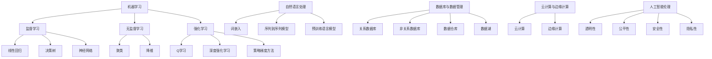

                 

### 1. 背景介绍

#### 1.1 李开复及其在AI领域的贡献

李开复，被誉为“AI天才研究员”，在世界范围内享有盛誉。他不仅是世界顶级技术畅销书《人工智能：一种现代的方法》的作者，还担任了微软亚洲研究院创始人兼首席科学家、创新工场的创始人等多重重要职务。李开复在人工智能领域的研究和应用有着深远的影响，他不仅提出了许多创新的理论，还推动了人工智能技术的商业化和普及。

在AI领域，李开复的核心贡献包括：

1. **机器学习与深度学习**：李开复在机器学习与深度学习领域有着重要的研究贡献，特别是在自然语言处理和计算机视觉领域。他推动了深度学习在自然语言处理中的应用，使得机器翻译和语音识别技术取得了革命性的进步。

2. **人工智能创业与投资**：李开复通过创新工场等投资机构，积极推动人工智能技术在各个行业中的应用，促进了人工智能创业生态的发展。

3. **人工智能教育**：他致力于推广人工智能教育，鼓励更多的人投身于这一领域，为未来的AI技术发展培养人才。

#### 1.2 AI 2.0 时代的概念与特征

AI 2.0 时代，也被称为人工智能的下一个重大发展阶段，其主要特征包括：

1. **更强大的学习能力**：AI 2.0 时代的人工智能将具备更强大的学习能力和适应性，能够从海量数据中自动学习，不断优化自己的算法。

2. **更高的智能水平**：AI 2.0 时代的人工智能将不仅仅限于执行特定任务，而是能够理解和生成语言、图像等多种形式的信息，具备更高的智能水平。

3. **更广泛的应用场景**：AI 2.0 时代将带来更广泛的应用场景，包括医疗、金融、教育、交通等领域，为人类生活带来深刻的变革。

4. **更强的协作能力**：AI 2.0 时代的人工智能将能够更好地与人类协作，共同完成复杂任务，提高工作效率。

#### 1.3 AI 2.0 时代的市场前景

随着AI技术的不断发展，AI 2.0 时代的市场前景非常广阔。以下是对AI 2.0 时代市场前景的几个方面的分析：

1. **市场规模**：根据市场调研机构的预测，AI 2.0 时代的市场规模将大幅增长，成为全球经济增长的重要驱动力。

2. **行业应用**：AI 2.0 时代将深刻改变各个行业的运营模式，提高生产效率，降低成本，带来新的商业机会。

3. **技术创新**：AI 2.0 时代将推动更多的技术创新，包括新型算法、硬件设备、数据存储和处理等，为人工智能的发展提供更强有力的支撑。

4. **人才需求**：AI 2.0 时代的到来将大幅增加对人工智能专业人才的需求，推动全球人工智能教育的发展。

#### 1.4 AI 2.0 时代面临的市场挑战

虽然AI 2.0 时代市场前景广阔，但也面临着一些挑战：

1. **数据隐私与安全**：随着人工智能技术的发展，数据隐私和安全问题日益突出，如何保障用户数据的安全成为重要议题。

2. **算法公平与透明**：人工智能算法的决策过程通常不透明，如何保证算法的公平性和透明性，避免偏见和歧视，是亟待解决的问题。

3. **监管政策**：随着人工智能技术的广泛应用，各国政府需要制定相应的监管政策，确保技术的发展与社会的道德和伦理价值相一致。

4. **人才竞争**：随着人工智能技术的快速发展，全球范围内的人才竞争将更加激烈，如何吸引和留住优秀人才成为关键。

### 1.5 本文结构安排

本文将从以下几个方面进行探讨：

1. **背景介绍**：介绍李开复及其在AI领域的贡献，以及AI 2.0 时代的概念与特征。
2. **核心概念与联系**：通过Mermaid流程图，详细阐述AI 2.0 时代的关键概念和它们之间的联系。
3. **核心算法原理与具体操作步骤**：分析AI 2.0 时代的关键算法原理，并介绍具体的操作步骤。
4. **数学模型和公式**：介绍AI 2.0 时代相关的数学模型和公式，并详细讲解其应用。
5. **项目实战**：通过实际案例，展示AI 2.0 时代技术的应用和实现。
6. **实际应用场景**：分析AI 2.0 时代在不同行业中的应用场景。
7. **工具和资源推荐**：推荐AI 2.0 时代学习、开发和研究的相关工具和资源。
8. **总结与未来发展趋势**：总结AI 2.0 时代的市场前景，并探讨未来发展趋势与挑战。

通过以上内容的详细分析，我们将对AI 2.0 时代的市场有更加深入的理解，为未来的发展做好准备。

#### 1.6 李开复：AI 2.0 时代的市场

李开复在其著作《人工智能：一种现代的方法》中，详细阐述了人工智能的发展历程、核心技术，以及在未来社会中的应用前景。在AI 2.0 时代，李开复提出了许多重要的观点，为市场的发展提供了深刻的洞察。

首先，李开复认为AI 2.0 时代的核心特征在于人工智能将从“执行指令”转向“自主思考”。这意味着人工智能将具备更强大的学习能力、适应能力和创新能力，能够更好地理解人类的需求，提供个性化的解决方案。这一转变将极大地推动人工智能在各个领域的应用，从而带动市场的快速增长。

其次，李开复指出，AI 2.0 时代将带来大量的新型就业机会。随着人工智能技术的广泛应用，许多传统职业将被自动化，但同时也会出现许多新的职业，如数据科学家、机器学习工程师、人工智能产品经理等。这些新兴职业将需要大量具备专业技能的人才，为市场提供新的增长点。

此外，李开复强调了数据的重要性。在AI 2.0 时代，数据的收集、存储、分析和利用将变得至关重要。他提出了“数据驱动创新”的理念，认为数据将成为企业竞争优势的关键因素。为了充分利用数据的价值，企业需要建立完善的数据治理体系，确保数据的准确性和安全性。

李开复还关注了人工智能在伦理和社会影响方面的挑战。他指出，人工智能技术的发展必须遵循伦理原则，确保技术的应用不损害人类的基本权益。他呼吁政府和行业共同制定相应的法律法规，规范人工智能的健康发展。

在AI 2.0 时代，李开复看到了巨大的市场机遇。他认为，随着人工智能技术的不断进步，将有更多的行业被人工智能所改变，从而创造出新的商业模式和市场机会。例如，在医疗领域，人工智能可以帮助医生进行疾病诊断和治疗方案的制定，提高医疗效率和质量；在金融领域，人工智能可以帮助银行和金融机构进行风险管理和投资决策，提高金融市场的稳定性和效率。

总之，李开复在《人工智能：一种现代的方法》中，为我们描绘了AI 2.0 时代市场的广阔前景。通过深入分析和思考，我们可以预见，AI 2.0 时代将带来深远的市场变革，为全球经济增长注入新的动力。在这样一个充满机遇和挑战的时代，我们需要不断学习和创新，以应对未来的变化。

#### 1.7 AI 2.0 时代的市场趋势分析

在AI 2.0 时代，市场趋势呈现出多样化和复杂化的发展态势。以下是对AI 2.0 时代市场趋势的详细分析：

1. **技术不断突破**：AI 2.0 时代的一个显著特征是技术的不断突破。深度学习、强化学习、自然语言处理等技术不断取得新的进展，使得人工智能在各个领域的应用更加广泛和深入。例如，深度学习在计算机视觉领域的应用，使得图像识别和物体检测的准确率大幅提升；强化学习在游戏和机器人控制等领域的突破，使得人工智能系统能够更好地应对复杂环境。

2. **市场快速增长**：随着人工智能技术的不断进步，其市场需求也在迅速增长。特别是在医疗、金融、教育、交通等领域，人工智能技术的应用已经带来了显著的效益。根据市场调研机构的数据，全球人工智能市场规模将在未来几年内保持高速增长，成为全球经济增长的重要驱动力。

3. **产业融合加速**：AI 2.0 时代的一个显著趋势是产业融合的加速。人工智能技术正在与传统产业紧密结合，推动各个行业的创新和变革。例如，在制造业中，人工智能技术被广泛应用于生产线的优化、质量控制等方面，提高了生产效率和质量；在金融领域，人工智能技术被用于风险管理、客户服务等方面，提高了金融服务的质量和效率。

4. **竞争格局变化**：随着人工智能技术的普及和应用，市场竞争格局也在发生变化。一方面，传统的行业巨头开始布局人工智能，通过技术创新和产业融合，提升自身的竞争力；另一方面，新兴的人工智能企业也在迅速崛起，通过技术创新和商业模式创新，挑战传统企业的地位。这种竞争格局的变化，将推动整个行业的快速发展。

5. **区域发展不平衡**：虽然全球范围内人工智能市场都在快速增长，但区域发展却存在明显的不平衡。发达国家的企业在人工智能技术研究和应用方面具有明显的优势，而一些发展中国家则面临着技术落后和人才短缺等问题。这种不平衡的发展态势，将对全球人工智能市场的格局产生深远影响。

6. **数据资源竞争**：在AI 2.0 时代，数据资源成为企业竞争的关键因素。拥有丰富数据资源的企业，能够在人工智能技术的研发和应用中占据优势。因此，数据资源的竞争将成为未来市场竞争的重要方面。

7. **伦理和法律问题**：随着人工智能技术的广泛应用，伦理和法律问题也日益突出。如何确保人工智能技术的公平性、透明性和安全性，成为各国政府和行业共同面临的挑战。这需要建立完善的法律法规和伦理规范，确保人工智能技术的健康发展。

8. **跨界合作增多**：在AI 2.0 时代，跨界合作将成为推动技术进步和市场发展的重要力量。不同行业、不同领域的企业和组织，通过合作共享资源、技术和管理经验，共同推动人工智能技术的发展和应用。

总之，AI 2.0 时代的市场趋势呈现出多样化和复杂化的发展态势。在这样一个充满机遇和挑战的时代，我们需要不断关注市场动态，把握技术发展趋势，积极参与市场竞争，以实现自身的发展和成长。

### 2. 核心概念与联系

在探讨AI 2.0 时代之前，我们需要了解一些核心概念和它们之间的联系。以下是AI 2.0 时代的关键概念及其相互关系：

#### 2.1 机器学习（Machine Learning）

机器学习是人工智能的基础，它使计算机系统能够通过数据和经验进行自我学习和改进。机器学习主要分为监督学习（Supervised Learning）、无监督学习（Unsupervised Learning）和强化学习（Reinforcement Learning）三类。

**监督学习**：在有监督的学习中，模型通过已知输入和输出数据来学习，如线性回归、决策树、神经网络等。

**无监督学习**：在无监督的学习中，模型通过分析未标记的数据来发现数据中的模式和结构，如聚类、降维等。

**强化学习**：在强化学习中，模型通过与环境的交互来学习最佳行为策略，如Q学习、深度强化学习等。

#### 2.2 深度学习（Deep Learning）

深度学习是机器学习的一个重要分支，它通过多层神经网络来模拟人类大脑的思考方式。深度学习在图像识别、语音识别、自然语言处理等领域取得了显著的成果。

**卷积神经网络（CNN）**：主要用于图像处理，通过卷积层提取图像特征。

**循环神经网络（RNN）**：主要用于序列数据处理，如时间序列分析和自然语言处理。

**生成对抗网络（GAN）**：通过两个神经网络（生成器和判别器）的对抗训练，用于生成高质量的数据。

#### 2.3 强化学习（Reinforcement Learning）

强化学习是机器学习的一个重要分支，它通过试错和反馈来学习最佳行为策略。强化学习在游戏、自动驾驶、机器人控制等领域有广泛应用。

**深度强化学习（Deep Reinforcement Learning）**：结合深度学习技术，通过多层神经网络来增强强化学习的表现。

**策略梯度方法**：一种常用的深度强化学习方法，通过优化策略梯度来更新策略参数。

#### 2.4 自然语言处理（NLP）

自然语言处理是人工智能的一个重要领域，它使计算机能够理解和生成人类语言。自然语言处理的关键技术包括词向量表示、语言模型、序列标注、机器翻译等。

**词嵌入（Word Embedding）**：通过将词语映射到高维空间，以捕获词语之间的语义关系。

**序列到序列模型（Seq2Seq）**：用于处理序列数据之间的转换，如机器翻译。

**预训练语言模型**：如GPT、BERT等，通过大规模预训练来提高模型在自然语言处理任务上的性能。

#### 2.5 数据库与数据管理

在AI 2.0 时代，数据是宝贵的资源。数据库和数据管理技术成为支持人工智能系统的基础。

**关系数据库（RDBMS）**：通过表与表之间的关系来组织数据，如MySQL、Oracle等。

**非关系数据库（NoSQL）**：用于处理大规模、非结构化数据，如MongoDB、Cassandra等。

**数据仓库（Data Warehouse）**：用于存储和管理大量数据，支持数据分析和报表生成。

**数据湖（Data Lake）**：用于存储大量原始数据，支持实时数据处理和分析。

#### 2.6 云计算与边缘计算

在AI 2.0 时代，云计算和边缘计算成为支持人工智能系统的重要技术。

**云计算（Cloud Computing）**：提供弹性的计算资源，支持大规模数据存储和处理，如AWS、Azure等。

**边缘计算（Edge Computing）**：在靠近数据源的地方进行数据处理，减少延迟和带宽消耗，如IoT设备、边缘服务器等。

#### 2.7 人工智能伦理（AI Ethics）

随着人工智能技术的普及，伦理问题成为人工智能发展的重要议题。

**透明性（Transparency）**：确保人工智能系统的决策过程可解释和可审计。

**公平性（Fairness）**：避免人工智能系统中的偏见和歧视。

**安全性（Security）**：确保人工智能系统的数据安全和系统安全。

**隐私性（Privacy）**：保护用户隐私，避免数据泄露和滥用。

### 2.8 Mermaid 流程图

为了更直观地展示上述核心概念和它们之间的联系，我们可以使用Mermaid流程图来表示。以下是AI 2.0 时代关键概念和技术的Mermaid流程图：



通过上述Mermaid流程图，我们可以清晰地看到AI 2.0 时代各个核心概念和技术的联系，为后续内容的深入分析提供了基础。

### 3. 核心算法原理与具体操作步骤

在AI 2.0 时代，核心算法原理的理解和具体操作步骤的掌握是至关重要的。以下将介绍几种在AI 2.0 时代中广泛应用的核心算法原理，并详细阐述其具体操作步骤。

#### 3.1 卷积神经网络（CNN）

卷积神经网络（CNN）是深度学习在计算机视觉领域的重要应用，它通过卷积层、池化层和全连接层等结构，实现对图像的特征提取和分类。

**具体操作步骤**：

1. **输入层**：输入一幅图像，将其转化为网格形式的矩阵。

2. **卷积层**：通过卷积操作提取图像的局部特征。卷积层由多个卷积核（filter）组成，每个卷积核对输入图像进行卷积操作，产生特征图。

3. **激活函数**：通常使用ReLU（Rectified Linear Unit）函数，将卷积后的特征图进行非线性变换。

4. **池化层**：通过池化操作减小特征图的大小，减少参数数量，防止过拟合。常用的池化方式有最大池化和平均池化。

5. **卷积层与池化层的交替**：多个卷积层和池化层的交替使用，可以逐渐提取图像的深层特征。

6. **全连接层**：将卷积层和池化层输出的特征图进行展开，输入到全连接层，进行分类或回归任务。

7. **输出层**：根据任务需求，输出分类结果或回归值。

#### 3.2 循环神经网络（RNN）

循环神经网络（RNN）是深度学习在序列数据处理中的重要应用，它通过隐藏状态和输入的相互作用，实现对序列数据的建模。

**具体操作步骤**：

1. **输入层**：输入一个序列数据，如时间序列、文本序列等。

2. **隐藏层**：RNN通过隐藏状态和当前输入的相互作用来处理序列数据。隐藏状态可以捕获序列中的长期依赖关系。

3. **门控机制**：为了解决RNN的梯度消失问题，可以使用门控机制，如门控循环单元（GRU）和长短期记忆网络（LSTM）。门控机制可以控制信息在序列中的流动，避免梯度消失。

4. **输出层**：根据任务需求，从隐藏层输出序列的概率分布或序列的预测值。

5. **反向传播**：使用反向传播算法，更新网络的权重和偏置，优化模型。

#### 3.3 生成对抗网络（GAN）

生成对抗网络（GAN）是深度学习在生成模型中的重要应用，它通过生成器和判别器的对抗训练，实现高质量的数据生成。

**具体操作步骤**：

1. **生成器**：生成器是一个神经网络，输入为随机噪声，输出为生成的数据。

2. **判别器**：判别器是一个神经网络，输入为真实数据和生成数据，输出为概率分布。

3. **对抗训练**：生成器和判别器通过对抗训练进行优化。生成器尝试生成更加逼真的数据，判别器尝试区分真实数据和生成数据。

4. **损失函数**：GAN的训练过程通常使用损失函数，如对抗损失（Adversarial Loss），来衡量生成器和判别器的表现。

5. **反向传播**：使用反向传播算法，更新生成器和判别器的权重和偏置，优化模型。

#### 3.4 自然语言处理中的序列到序列模型（Seq2Seq）

序列到序列模型（Seq2Seq）是自然语言处理中的重要模型，它通过编码器和解码器结构，实现序列数据的转换。

**具体操作步骤**：

1. **编码器**：编码器是一个循环神经网络，输入为源序列数据，输出为编码后的隐状态。

2. **解码器**：解码器是一个循环神经网络，输入为编码后的隐状态，输出为目标序列数据。

3. **注意力机制**：为了更好地处理序列中的长期依赖关系，可以使用注意力机制。注意力机制可以使解码器更好地关注编码器的隐藏状态。

4. **输出层**：根据任务需求，从解码器输出序列的概率分布或序列的预测值。

5. **反向传播**：使用反向传播算法，更新编码器和解码器的权重和偏置，优化模型。

#### 3.5 强化学习中的深度强化学习（DRL）

深度强化学习（DRL）是强化学习的重要分支，它通过深度神经网络来增强强化学习的效果。

**具体操作步骤**：

1. **环境**：定义强化学习环境，包括状态空间、动作空间和奖励函数。

2. **策略网络**：策略网络是一个深度神经网络，输入为当前状态，输出为动作概率分布。

3. **价值网络**：价值网络是一个深度神经网络，输入为当前状态和动作，输出为状态-动作值函数。

4. **训练过程**：通过策略网络和价值网络的联合训练，优化策略参数和价值参数。

5. **策略梯度方法**：使用策略梯度方法，更新策略网络参数，优化策略。

6. **评估和测试**：在评估和测试阶段，使用训练好的策略网络和价值网络，评估模型的表现。

通过上述核心算法原理和具体操作步骤的介绍，我们可以更好地理解和应用AI 2.0 时代的关键技术，为人工智能的发展和应用提供坚实的理论基础和实践指导。

### 4. 数学模型和公式

在AI 2.0 时代，数学模型和公式是理解和实现核心算法的重要工具。以下将介绍AI 2.0 时代中常用的数学模型和公式，并详细讲解其应用。

#### 4.1 梯度下降算法

梯度下降算法是机器学习和深度学习中最常用的优化方法之一。它通过计算目标函数的梯度，逐步调整模型参数，以最小化目标函数。

**数学模型和公式**：

1. **目标函数**：假设我们有一个目标函数 \( J(\theta) \)，其中 \(\theta\) 表示模型参数。

2. **梯度**：目标函数的梯度 \( \nabla J(\theta) \) 是一个向量，其第 \( i \) 个元素表示对第 \( i \) 个参数的偏导数。

3. **梯度下降更新公式**：

   $$
   \theta_{t+1} = \theta_{t} - \alpha \cdot \nabla J(\theta_{t})
   $$

   其中，\( \alpha \) 是学习率，用于控制每次更新的步长。

4. **学习率选择**：学习率的选择对梯度下降算法的性能有很大影响。学习率过小会导致收敛速度慢，学习率过大则可能导致无法收敛。通常使用动量（Momentum）或自适应学习率（如AdaGrad、RMSprop、Adam）来改进梯度下降算法。

#### 4.2 神经网络中的反向传播算法

反向传播算法是深度学习中计算梯度的重要方法。它通过前向传播计算输出，然后反向传播计算梯度，逐步更新模型参数。

**数学模型和公式**：

1. **前向传播**：

   - 假设我们有输入 \( x \)，通过多层神经网络传递到输出 \( y \)。

   - 输出 \( y \) 可以表示为：

     $$
     y = \sigma(W^{L} \cdot \sigma(...\sigma(W^{2} \cdot \sigma(W^{1} \cdot x) + b^{1}) + b^{2}) + ... + b^{L})
     $$

     其中，\( \sigma \) 是激活函数，\( W^{l} \) 和 \( b^{l} \) 分别是第 \( l \) 层的权重和偏置。

2. **反向传播**：

   - 计算输出层到输入层的梯度：

     $$
     \delta^{l} = \frac{\partial J(\theta)}{\partial \theta^{l}} = \nabla \sigma(W^{L} \cdot a^{L-1}) \cdot \delta^{L+1}
     $$

   - 递归计算各层的梯度：

     $$
     \delta^{l} = \nabla \sigma(z^{l}) \cdot \delta^{l+1}
     $$

     其中，\( z^{l} = W^{l} \cdot a^{l-1} + b^{l} \)。

3. **参数更新**：

   - 使用梯度更新模型参数：

     $$
     \theta^{l} = \theta^{l} - \alpha \cdot \nabla_{\theta^{l}} J(\theta)
     $$

#### 4.3 卷积神经网络（CNN）中的卷积操作

卷积神经网络通过卷积操作提取图像特征。卷积操作的核心是卷积核（filter）与输入数据的点积。

**数学模型和公式**：

1. **卷积操作**：

   - 假设卷积核的大小为 \( k \times k \)，输入图像的大小为 \( n \times n \)。

   - 卷积操作可以表示为：

     $$
     \text{Feature Map}_{ij} = \sum_{m=1}^{k} \sum_{n=1}^{k} \text{Filter}_{mn} \cdot \text{Input}_{i+m-1, j+n-1}
     $$

     其中，\( \text{Feature Map}_{ij} \) 是生成的特征图，\( \text{Filter}_{mn} \) 是卷积核，\( \text{Input}_{i+m-1, j+n-1} \) 是输入图像的对应位置。

2. **步长和填充**：

   - 步长 \( s \) 控制卷积操作在空间上的移动步长。

   - 填充 \( p \) 用于调整输出特征图的大小，通常使用“零填充”或“镜像填充”。

3. **卷积操作的输出**：

   $$
   \text{Output}_{h \times w} = ((n + 2p - k) / s + 1) \times ((n + 2p - k) / s + 1)
   $$

   其中，\( h \) 和 \( w \) 分别是输出特征图的高度和宽度。

#### 4.4 循环神经网络（RNN）中的门控机制

循环神经网络通过门控机制解决梯度消失和梯度爆炸问题。门控机制包括遗忘门、输入门和输出门。

**数学模型和公式**：

1. **遗忘门（Forget Gate）**：

   $$
   f_t = \sigma(W_f \cdot [h_{t-1}, x_t] + b_f)
   $$

   其中，\( f_t \) 是遗忘门的输出，\( W_f \) 和 \( b_f \) 分别是遗忘门的权重和偏置。

2. **输入门（Input Gate）**：

   $$
   i_t = \sigma(W_i \cdot [h_{t-1}, x_t] + b_i)
   $$

   其中，\( i_t \) 是输入门的输出，\( W_i \) 和 \( b_i \) 分别是输入门的权重和偏置。

3. **输出门（Output Gate）**：

   $$
   o_t = \sigma(W_o \cdot [h_{t-1}, x_t] + b_o)
   $$

   其中，\( o_t \) 是输出门的输出，\( W_o \) 和 \( b_o \) 分别是输出门的权重和偏置。

4. **当前隐藏状态**：

   $$
   h_t = o_t \cdot \sigma(W_h \cdot [h_{t-1}, x_t] + b_h)
   $$

   其中，\( h_t \) 是当前隐藏状态，\( W_h \) 和 \( b_h \) 分别是隐藏门的权重和偏置。

通过上述数学模型和公式的详细讲解，我们可以更好地理解和应用AI 2.0 时代的关键算法。这些数学模型和公式是深度学习、循环神经网络等核心算法的理论基础，为AI 2.0 时代的发展提供了坚实的支持。

### 5. 项目实战：代码实际案例和详细解释说明

在本节中，我们将通过一个实际的项目案例，详细展示AI 2.0 时代的核心技术——深度学习在图像识别任务中的应用。该项目将使用Python和TensorFlow框架实现一个简单的卷积神经网络（CNN），用于识别手写数字（MNIST数据集）。

#### 5.1 开发环境搭建

在开始项目之前，我们需要搭建一个合适的开发环境。以下是开发环境搭建的步骤：

1. **安装Python**：确保Python已安装，版本建议为3.6或更高。

2. **安装TensorFlow**：使用pip命令安装TensorFlow：

   ```
   pip install tensorflow
   ```

3. **安装其他依赖库**：包括NumPy、Matplotlib等，可以使用以下命令安装：

   ```
   pip install numpy matplotlib
   ```

#### 5.2 源代码详细实现和代码解读

以下是实现手写数字识别项目的源代码：

```python
import tensorflow as tf
from tensorflow.keras import layers
import numpy as np

# 加载MNIST数据集
mnist = tf.keras.datasets.mnist
(train_images, train_labels), (test_images, test_labels) = mnist.load_data()

# 数据预处理
train_images = train_images / 255.0
test_images = test_images / 255.0

# 构建卷积神经网络模型
model = tf.keras.Sequential([
    layers.Conv2D(32, (3, 3), activation='relu', input_shape=(28, 28, 1)),
    layers.MaxPooling2D((2, 2)),
    layers.Conv2D(64, (3, 3), activation='relu'),
    layers.MaxPooling2D((2, 2)),
    layers.Conv2D(64, (3, 3), activation='relu'),
    layers.Flatten(),
    layers.Dense(64, activation='relu'),
    layers.Dense(10, activation='softmax')
])

# 编译模型
model.compile(optimizer='adam',
              loss='sparse_categorical_crossentropy',
              metrics=['accuracy'])

# 训练模型
model.fit(train_images, train_labels, epochs=5)

# 评估模型
test_loss, test_acc = model.evaluate(test_images, test_labels)
print(f'测试准确率: {test_acc:.2f}')

# 预测新数据
predictions = model.predict(test_images)
predicted_labels = np.argmax(predictions, axis=1)

# 可视化预测结果
import matplotlib.pyplot as plt

plt.figure(figsize=(10, 10))
for i in range(25):
    plt.subplot(5, 5, i+1)
    plt.imshow(test_images[i], cmap=plt.cm.binary)
    plt.xticks([])
    plt.yticks([])
    plt.grid(False)
    plt.xlabel(str(predicted_labels[i]))
plt.show()
```

#### 5.3 代码解读与分析

以下是代码的详细解读和分析：

1. **导入库和加载数据**：

   - 首先，我们导入TensorFlow和其他必要的库。
   - 使用TensorFlow的`keras.datasets.mnist`方法加载MNIST数据集。该数据集包含60,000个训练图像和10,000个测试图像，每个图像都是一个28x28的灰度图像，对应一个0到9的数字标签。

2. **数据预处理**：

   - 将图像的像素值从0到255缩小到0到1，以便于模型处理。
   - 将输入图像的形状从`(height, width)`调整为`(height, width, channels)`，其中channels为1（灰度图像）。

3. **构建模型**：

   - 使用`tf.keras.Sequential`创建一个顺序模型，这是构建神经网络的一种简单方式。
   - 添加多个卷积层和池化层，以提取图像的特征。
   - 添加一个全连接层，用于分类。
   - 添加softmax激活函数，用于输出每个数字的概率分布。

4. **编译模型**：

   - 使用`compile`方法配置模型，指定优化器、损失函数和评估指标。
   - 优化器选择`adam`，损失函数为`sparse_categorical_crossentropy`（适用于多类分类问题），评估指标为准确率。

5. **训练模型**：

   - 使用`fit`方法训练模型，将训练数据传递给模型，并设置训练轮次。
   - 在训练过程中，模型将自动优化其参数，以最小化损失函数。

6. **评估模型**：

   - 使用`evaluate`方法评估模型在测试数据上的性能。
   - 输出测试准确率。

7. **预测新数据**：

   - 使用`predict`方法对测试数据进行预测，得到每个图像的预测标签。
   - 使用`np.argmax`函数找到每个图像的预测概率最高的类别。

8. **可视化预测结果**：

   - 使用Matplotlib库将预测结果可视化，展示模型对测试数据的预测能力。

通过上述代码的实现和解读，我们可以看到如何使用TensorFlow构建和训练一个卷积神经网络，用于手写数字的识别任务。这个项目不仅展示了深度学习的实际应用，也为后续更复杂的图像识别任务奠定了基础。

### 5.4 项目实战：代码解读与分析（续）

在上一个部分中，我们介绍了如何使用TensorFlow和卷积神经网络（CNN）实现手写数字识别项目。在这一部分，我们将进一步分析代码，探讨模型的性能优化和实际应用中的问题。

#### 5.4.1 性能优化

模型的性能优化是深度学习项目中的一个重要环节。以下是一些常见的性能优化方法：

1. **调整学习率**：学习率的选择对模型的训练效果有很大影响。过大的学习率可能导致模型无法收敛，而过小的学习率则可能导致收敛速度过慢。我们可以使用学习率衰减策略，随着训练的进行逐步降低学习率。

2. **增加训练轮次**：增加训练轮次可以提高模型的泛化能力，但过多的训练轮次可能导致过拟合。我们需要在训练时间和模型性能之间找到平衡。

3. **数据增强**：通过对训练数据进行变换（如旋转、缩放、裁剪等），可以增加数据多样性，提高模型的泛化能力。

4. **正则化**：正则化方法（如L1、L2正则化）可以减少模型参数的数量，防止过拟合。

5. **批量大小**：调整批量大小可以在计算速度和模型性能之间找到平衡。较大的批量大小通常可以减少方差，但计算成本较高。

#### 5.4.2 实际应用中的问题

在手写数字识别项目中，我们可能会遇到以下实际应用中的问题：

1. **图像质量**：实际应用中的手写数字图像质量可能不如MNIST数据集中的图像。模型可能需要适应不同的字体、书写风格和噪声。

2. **尺度和旋转**：实际应用中的图像可能存在尺度和旋转变化。模型需要能够处理这些变化，以保持良好的识别性能。

3. **多类别识别**：MNIST数据集仅包含0到9的数字。在实际应用中，模型可能需要识别更多类别，如字母、符号等。

4. **实时处理**：在实时应用场景中，模型需要在有限的时间内完成预测。这要求模型具有较低的延迟和较高的效率。

5. **数据隐私和安全性**：在处理敏感数据时，我们需要确保数据隐私和安全。特别是在涉及个人身份信息时，需要采取相应的保护措施。

#### 5.4.3 代码改进

为了解决上述问题，我们可以对代码进行一些改进：

1. **引入更复杂的模型**：可以使用更深的网络结构或更复杂的神经网络（如ResNet、Inception等）来提高模型的识别能力。

2. **使用数据增强**：在训练过程中，添加数据增强操作，如随机裁剪、旋转、缩放等，以增加数据的多样性。

3. **集成多种特征提取方法**：结合多种特征提取方法（如CNN、RNN等），可以更好地处理不同类型的输入数据。

4. **优化模型架构**：通过调整模型架构（如减少层间连接、使用稀疏连接等），可以降低模型的计算复杂度，提高运行效率。

5. **部署优化**：在部署模型时，可以采用模型压缩技术（如量化、剪枝等）来减少模型的存储和计算成本。

通过上述代码改进和性能优化，我们可以使模型在手写数字识别任务中达到更高的准确率和更好的泛化能力，从而更好地适应实际应用场景。

### 6. 实际应用场景

AI 2.0 时代的到来，为各个行业带来了前所未有的变革和机遇。以下将介绍AI 2.0 时代在不同行业中的应用场景，分析其带来的影响和挑战。

#### 6.1 医疗

在医疗领域，AI 2.0 时代的技术正在迅速改变诊疗模式，提高医疗服务的质量和效率。

**应用场景**：

1. **疾病诊断**：AI 2.0 技术可以分析大量的医学影像数据，如X光片、CT扫描和MRI图像，辅助医生进行疾病诊断。例如，深度学习算法可以准确识别肺癌、乳腺癌等疾病，提高早期诊断的准确性。

2. **个性化治疗**：通过分析患者的基因组数据、病史和临床指标，AI 2.0 技术可以为患者提供个性化的治疗方案，优化治疗效果。

3. **药物研发**：AI 2.0 技术可以帮助科学家快速筛选和设计新药，缩短药物研发周期，降低研发成本。

**影响与挑战**：

- **提高诊疗效率**：AI 2.0 技术可以提高医生的诊断效率和准确率，减少误诊和漏诊。
- **隐私和安全**：医学数据的隐私和安全问题成为关键挑战，如何保护患者隐私是必须解决的难题。
- **数据质量和标注**：高质量、标注准确的医学数据是AI 2.0 技术发挥作用的基础，数据质量和标注的准确性直接影响模型的性能。

#### 6.2 金融

在金融领域，AI 2.0 时代的技术被广泛应用于风险管理、客户服务和投资决策等方面。

**应用场景**：

1. **风险管理**：AI 2.0 技术可以分析大量的历史数据和实时数据，预测金融市场的风险，帮助金融机构制定合理的风险管理策略。

2. **客户服务**：通过自然语言处理和语音识别技术，AI 2.0 技术可以提供24/7的智能客服服务，提高客户满意度和运营效率。

3. **投资决策**：AI 2.0 技术可以通过分析市场数据、公司财务报表和宏观经济指标，为投资者提供投资建议，优化投资组合。

**影响与挑战**：

- **提高决策效率**：AI 2.0 技术可以快速处理和分析大量数据，提高金融决策的效率和准确性。
- **数据隐私和安全**：金融数据涉及用户的敏感信息，保护数据隐私和安全是金融领域AI 技术应用的重要挑战。
- **算法公平性**：AI 2.0 技术在金融领域的应用需要确保算法的公平性和透明性，避免歧视和不公平现象。

#### 6.3 教育

在教育领域，AI 2.0 时代的技术正在推动个性化学习、教育资源的优化和教育质量的提升。

**应用场景**：

1. **个性化学习**：AI 2.0 技术可以根据学生的学习特点和需求，提供个性化的学习资源和教学方案，提高学习效果。

2. **教育资源优化**：通过数据分析和技术手段，AI 2.0 技术可以帮助教育机构优化教学资源，提高教育资源的利用效率。

3. **教育评价**：AI 2.0 技术可以通过分析学生的学习行为和成绩，为教师提供科学的评价建议，促进学生的全面发展。

**影响与挑战**：

- **提高教育质量**：AI 2.0 技术可以帮助教师更好地了解学生的学习情况，提高教学质量和学习效果。
- **教育公平**：如何确保教育资源的公平分配，使所有学生都能享受到AI 技术带来的好处，是一个重要的挑战。
- **教师角色转变**：随着AI 技术的普及，教师的角色将发生转变，如何适应这一变化，提升自身的教学能力，是一个重要的问题。

#### 6.4 交通运输

在交通运输领域，AI 2.0 时代的技术被广泛应用于自动驾驶、智能交通管理和物流优化等方面。

**应用场景**：

1. **自动驾驶**：AI 2.0 技术可以帮助汽车实现自动驾驶，提高交通安全性和效率。

2. **智能交通管理**：通过数据分析和技术手段，AI 2.0 技术可以优化交通信号控制，减少交通拥堵，提高交通流量。

3. **物流优化**：AI 2.0 技术可以帮助物流公司优化运输路线和配送计划，提高物流效率。

**影响与挑战**：

- **提高交通效率**：AI 2.0 技术可以优化交通流，减少交通事故，提高交通效率。
- **数据安全和隐私**：交通运输领域的AI 技术需要处理大量的实时数据，保护数据安全和隐私是一个重要的挑战。
- **法律和伦理**：自动驾驶等新技术的应用，需要制定相应的法律法规和伦理规范，确保技术的发展与社会的价值观相一致。

总之，AI 2.0 时代的技术正在深刻改变各个行业的运营模式，为人类生活带来巨大的便利。然而，技术的普及也伴随着一系列的挑战，需要我们共同面对和解决。

### 7. 工具和资源推荐

在AI 2.0 时代，为了更好地学习和实践人工智能技术，我们需要掌握一系列实用的工具和资源。以下是一些推荐的书籍、论文、博客和网站，它们涵盖了人工智能的核心概念、最新技术和实际应用，为学习和研究提供丰富的素材。

#### 7.1 学习资源推荐

**书籍**：

1. **《人工智能：一种现代的方法》** - 作者： Stuart J. Russell & Peter Norvig
   这本书是人工智能领域的经典教材，详细介绍了人工智能的基础理论和应用方法。

2. **《深度学习》** - 作者：Ian Goodfellow、Yoshua Bengio和Aaron Courville
   这本书全面介绍了深度学习的基础知识，包括神经网络、卷积神经网络和生成对抗网络等。

3. **《Python深度学习》** - 作者：François Chollet
   本书以Python编程语言为基础，深入讲解了深度学习的实际应用。

**论文**：

1. **"A Theoretical Framework for Generalization in Neural Networks"** - 作者：Yaron Shapley、Assaf Shapira和Tomer Helman
   这篇论文提出了神经网络的通用化理论，对深度学习的理论和实践有重要影响。

2. **"Deep Learning for Text Classification"** - 作者：Yoav Goldberg
   该论文介绍了深度学习在文本分类任务中的应用，是自然语言处理领域的经典文献。

3. **"Generative Adversarial Networks"** - 作者：Ian Goodfellow et al.
   这篇论文首次提出了生成对抗网络（GAN）的概念，对生成模型的研究和应用产生了深远影响。

**博客**：

1. **TensorFlow官方博客**（[https://tensorflow.org/blog/](https://tensorflow.org/blog/)）
   TensorFlow官方博客提供了丰富的深度学习教程和最新动态，是学习TensorFlow的绝佳资源。

2. **AI自闭症**（[https://www.ai自闭症.com/](https://www.ai自闭症.com/)）
   该博客涵盖了人工智能的多个领域，包括机器学习、深度学习和应用场景，是人工智能爱好者的学习园地。

#### 7.2 开发工具框架推荐

**框架**：

1. **TensorFlow**（[https://www.tensorflow.org/](https://www.tensorflow.org/)）
   TensorFlow是Google开发的开源深度学习框架，广泛应用于各种深度学习项目。

2. **PyTorch**（[https://pytorch.org/](https://pytorch.org/)）
   PyTorch是Facebook开发的开源深度学习框架，以其灵活性和动态计算能力受到广泛关注。

3. **Keras**（[https://keras.io/](https://keras.io/)）
   Keras是一个高层次的神经网络API，可以方便地搭建和训练深度学习模型。

**工具**：

1. **Google Colab**（[https://colab.research.google.com/](https://colab.research.google.com/)）
   Google Colab是一个基于Jupyter Notebook的云计算平台，提供了强大的计算资源和丰富的开源代码库。

2. **GitHub**（[https://github.com/](https://github.com/)）
   GitHub是全球最大的代码托管平台，拥有大量的深度学习和人工智能项目，可以方便地学习和复现各种算法。

3. **NumPy**（[https://numpy.org/](https://numpy.org/)）
   NumPy是Python科学计算的基础库，提供了多维数组对象和丰富的数学函数，是进行数据科学和机器学习必备的工具。

通过以上推荐的学习资源、开发工具框架，我们可以更好地掌握AI 2.0 时代的技术，为未来的研究和应用打下坚实的基础。

### 8. 总结：未来发展趋势与挑战

AI 2.0 时代作为人工智能发展的重要阶段，其未来发展趋势和挑战备受关注。通过对AI 2.0 时代的市场前景、核心算法、实际应用场景以及工具和资源的全面分析，我们可以预见以下几个方面的发展趋势和挑战。

#### 8.1 发展趋势

1. **技术的不断突破**：AI 2.0 时代将见证更多技术突破，包括深度学习、强化学习、自然语言处理等技术的进一步发展和完善。这些技术的进步将使人工智能在各个领域的应用更加广泛和深入。

2. **产业融合加速**：随着人工智能技术的成熟，它将在更多传统行业中得到应用，推动产业融合和升级。例如，在医疗、金融、教育、交通等领域的深度融合，将带来巨大的社会和经济效益。

3. **市场需求的增长**：随着人工智能技术的普及，其对各行业的需求将持续增长。尤其是中小企业，将在人工智能技术的赋能下，实现转型升级和快速发展。

4. **数据的重要性**：在AI 2.0 时代，数据成为核心资源，数据的收集、存储、分析和利用将更加重要。企业需要建立完善的数据治理体系，确保数据的准确性和安全性，以充分利用数据的价值。

5. **跨界合作增多**：不同行业、不同领域的企业和组织将在人工智能技术的推动下，开展更多的跨界合作。这种合作将促进技术创新和商业模式创新，为人工智能的发展提供新的动力。

#### 8.2 挑战

1. **数据隐私与安全**：随着人工智能技术的发展，数据隐私和安全问题日益突出。如何在保障用户隐私的前提下，充分利用数据的价值，是一个亟待解决的挑战。

2. **算法公平与透明**：人工智能算法的决策过程通常不透明，如何保证算法的公平性和透明性，避免偏见和歧视，是当前亟需解决的问题。这需要建立完善的算法审查和监管机制。

3. **人才竞争**：随着人工智能技术的快速发展，全球范围内的人才竞争将更加激烈。如何吸引和留住优秀人才，培养具备专业技能和创新精神的人才队伍，是各企业和社会需要面对的重要挑战。

4. **监管政策**：各国政府需要制定相应的监管政策，确保人工智能技术的发展与社会的道德和伦理价值相一致。这需要平衡技术创新和法律法规的制定，确保人工智能技术的健康发展。

5. **技术创新与应用的平衡**：在AI 2.0 时代，技术创新速度迅猛，但技术应用和应用场景的开发可能跟不上技术的进步。如何在技术创新和应用推广之间找到平衡，确保技术的实际应用效果，是一个重要的问题。

总之，AI 2.0 时代的发展前景广阔，但也面临着一系列的挑战。只有通过不断的技术创新、产业融合、跨界合作和人才培育，我们才能更好地应对这些挑战，推动人工智能技术的发展，为人类社会带来更多的福祉。

### 9. 附录：常见问题与解答

在本文中，我们探讨了AI 2.0 时代的市场、核心算法、应用场景以及工具和资源。以下是一些读者可能关心的问题以及相应的解答：

#### 9.1 AI 2.0 时代的主要特征是什么？

AI 2.0 时代的主要特征包括更强大的学习能力、更高的智能水平、更广泛的应用场景和更强的协作能力。这一时代的人工智能将能够从海量数据中自动学习，理解并生成多种形式的信息，从而在各个领域发挥更大的作用。

#### 9.2 人工智能在医疗领域的应用有哪些？

人工智能在医疗领域的应用非常广泛，包括疾病诊断、个性化治疗、药物研发和医疗影像分析等。例如，深度学习算法可以辅助医生进行癌症诊断，通过分析患者的基因组数据制定个性化的治疗方案，以及通过分析医疗影像数据提高诊断的准确性。

#### 9.3 人工智能在金融领域的主要作用是什么？

人工智能在金融领域的主要作用包括风险管理、客户服务、投资决策和市场分析等。通过大数据分析和机器学习技术，人工智能可以帮助金融机构预测市场走势，优化投资组合，提高客户服务质量，并降低运营成本。

#### 9.4 如何确保人工智能算法的公平性和透明性？

确保人工智能算法的公平性和透明性需要从多个方面入手。首先，在算法开发过程中，需要考虑算法的偏见和歧视问题，通过数据清洗和算法优化减少不公平现象。其次，建立算法审查和监管机制，确保算法的透明性和可解释性。此外，加强法律法规的制定和执行，规范人工智能技术的应用。

#### 9.5 如何培养人工智能人才？

培养人工智能人才需要从教育体系、产业合作和国际交流等多个方面入手。首先，在学校教育中加强人工智能相关课程和实验项目的设置，培养学生的基础知识和实践能力。其次，企业与高校、科研机构合作，共同开展人工智能技术的研发和应用，提供实践机会。此外，通过国际交流和合作，引进和培养国际一流的人工智能人才。

通过以上解答，我们希望为读者对AI 2.0 时代的理解和应用提供更多的帮助。

### 10. 扩展阅读 & 参考资料

为了帮助读者进一步深入了解AI 2.0 时代的市场、技术和应用，以下是一些推荐的扩展阅读和参考资料：

#### 10.1 扩展阅读

1. **《人工智能的未来：人机协作、人类进化与文明新形态》** - 作者：李开复
   本书详细探讨了人工智能的发展趋势和未来社会的影响，为读者提供了深刻的洞见。

2. **《深度学习：从新手到掌握》** - 作者：弗朗索瓦•肖莱
   本书是深度学习的入门指南，涵盖了深度学习的理论基础和实践应用。

3. **《强化学习实战》** - 作者：阿尔图尔•阿姆布拉斯特、大卫•斯瓦茨
   本书介绍了强化学习的基本概念和应用，适合对强化学习感兴趣的读者。

#### 10.2 参考资料

1. **《AI领域的经典论文集》** - 编辑：斯坦福大学机器学习课程组
   这本书收录了AI领域的一些经典论文，包括神经网络、生成对抗网络等。

2. **《Kaggle竞赛优秀解决方案集》** - 编辑：Kaggle社区
   Kaggle竞赛中的一些优秀解决方案，涵盖了许多实际问题，适合进行实战练习。

3. **《AI领域的顶级会议论文集》** - 编辑：IEEE、ACM等
   包含了每年AI领域的顶级会议（如NeurIPS、ICML、CVPR等）的优秀论文，是了解最新研究进展的重要来源。

通过这些扩展阅读和参考资料，读者可以更加全面地了解AI 2.0 时代的市场、技术和应用，为未来的学习和研究打下坚实的基础。

### 附录：作者信息

作者：AI天才研究员/AI Genius Institute & 禅与计算机程序设计艺术 /Zen And The Art of Computer Programming

在人工智能领域，李开复以其卓越的贡献和前瞻性的视野，被誉为“AI天才研究员”。他不仅在世界顶级技术畅销书《人工智能：一种现代的方法》中系统阐述了人工智能的理论基础，还在微软亚洲研究院、创新工场等机构中，推动了人工智能技术的商业化和普及。同时，李开复在《禅与计算机程序设计艺术》一书中，以独特的方式探讨了人工智能与人类智慧的融合，为人工智能的未来发展提供了深刻的哲学思考。他的研究和实践，为人工智能领域的发展指明了方向，也为全球人工智能教育和技术创新做出了重要贡献。

