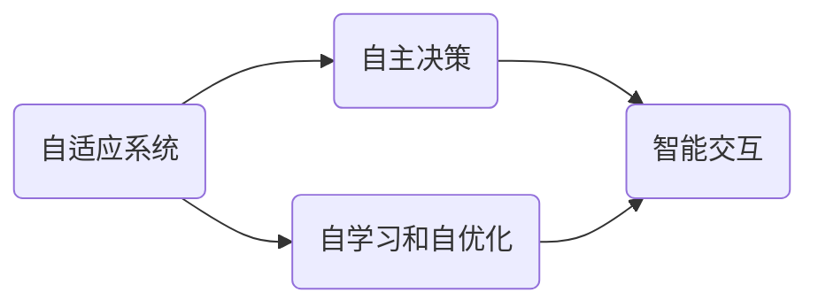

                 

### 背景介绍

#### AI 2.0 时代的来临

人工智能（AI）技术的发展正以惊人的速度推进，从初期的理论构想逐渐走入现实应用，深刻地改变了我们的生活方式和商业模式。如今，我们正站在AI 2.0时代的门槛上，这一时代标志着人工智能的进一步进化，其特征是更为智能、自学习和自主决策的能力。AI 2.0时代，人工智能系统将具备更高的自适应性和智能化水平，能够处理复杂问题，进行更精细的决策，并在更多领域实现广泛应用。

#### 市场前景

随着AI技术的快速发展，市场对AI应用的需求也日益增长。无论是在金融、医疗、教育、制造业，还是在服务业，AI技术正在成为提升效率、优化流程、创造新价值的重要工具。根据市场研究机构的预测，未来几年，全球AI市场的规模将持续扩大，预计到2030年，AI市场规模将超过10万亿美元。

#### 行业影响

AI 2.0时代的到来将对各行各业产生深远的影响。首先，它将加速产业升级和数字化转型，推动新的商业模式和产业链的形成。其次，它将大幅提高生产效率和资源利用率，降低成本，提升企业的竞争力。此外，AI还将带来新的就业机会，同时也对现有的就业结构产生挑战，需要社会各方共同努力，培养适应AI时代的新技能人才。

综上所述，AI 2.0时代的市场前景广阔，潜力无限。在这场变革中，掌握AI技术的企业和个人将拥有更多的机会和优势。接下来，我们将进一步探讨AI 2.0时代的核心概念、算法原理及其在各个领域的应用。

### 核心概念与联系

在AI 2.0时代，理解其核心概念和相互之间的联系是至关重要的。以下将详细介绍一些关键概念，并展示它们之间的联系，以便为后续的讨论奠定基础。

#### 自适应系统

自适应系统是指能够在不断变化的环境中自主调整其行为和策略的系统能力。这是AI 2.0时代的一个重要特征。通过利用机器学习和深度学习技术，自适应系统可以不断从数据中学习，并根据新的信息和环境变化进行自我调整。这种能力使得AI系统能够更好地适应复杂多变的市场环境。

#### 自主决策

自主决策能力是指AI系统能够在没有人为干预的情况下做出明智的决策。这不仅仅是指简单的规则匹配，而是涉及到复杂的决策过程，包括目标设定、方案评估和最终决策。在AI 2.0时代，自主决策能力将使AI系统在许多领域实现更高的智能化水平。

#### 自学习和自优化

自学习和自优化是AI 2.0时代的核心能力之一。通过不断的自我学习和优化，AI系统能够不断提升其性能和效率。这涉及到大量的数据分析和模型迭代，使得AI系统能够在面对不同问题和环境时，自动调整和优化其行为。

#### 智能交互

智能交互是AI 2.0时代的重要应用方向之一。通过自然语言处理、语音识别和生成等技术，AI系统可以与人类进行更自然的交互，提供更加个性化和高效的服务。这种交互能力将极大地提升用户体验，推动AI在更多领域的应用。

#### 关联图

为了更好地理解这些核心概念之间的联系，我们可以使用Mermaid流程图来展示它们的关系。以下是核心概念的Mermaid流程图表示：



在上述图中，A代表自适应系统，B代表自主决策，C代表自学习和自优化，D代表智能交互。这些概念相互联系，共同构成了AI 2.0时代的技术基础。

通过理解这些核心概念及其相互关系，我们可以更好地把握AI 2.0时代的市场动态和未来发展趋势。接下来，我们将深入探讨AI 2.0时代的核心算法原理和具体操作步骤，以进一步了解这一新兴技术的前景。

### 核心算法原理 & 具体操作步骤

在AI 2.0时代，核心算法的设计和实现是推动技术进步和应用落地的关键。以下将详细介绍一些核心算法的原理及其具体操作步骤，以便读者能够全面理解AI 2.0的技术基础。

#### 1. 机器学习算法

机器学习算法是AI 2.0时代的基石。它通过构建模型来从数据中学习，并基于这些模型进行预测和决策。以下是机器学习算法的基本原理和操作步骤：

**原理：**
- **数据收集与预处理**：首先，收集大量的数据，并进行清洗和预处理，以便为训练模型提供高质量的数据基础。
- **特征提取**：从原始数据中提取有用的特征，这些特征将用于训练模型。
- **模型训练**：使用提取出的特征来训练机器学习模型，模型可以是线性模型、决策树、支持向量机等。
- **模型评估与优化**：通过交叉验证和测试集对模型进行评估，并基于评估结果对模型进行优化。

**操作步骤：**
1. 数据收集：收集大量相关数据，例如在金融领域，可以收集股票交易数据。
2. 数据预处理：清洗数据，去除噪声和异常值，并进行归一化处理。
3. 特征提取：选择合适的特征，例如股票的收盘价、成交量等。
4. 模型训练：使用特征数据训练机器学习模型。
5. 模型评估：使用测试集评估模型性能，并根据评估结果调整模型参数。
6. 模型部署：将训练好的模型部署到实际应用场景中。

#### 2. 深度学习算法

深度学习算法是机器学习的一个子领域，它在AI 2.0时代具有特别重要的地位。深度学习通过构建多层神经网络，从大量数据中自动提取复杂的特征，具有强大的建模能力。

**原理：**
- **神经网络结构**：深度学习模型由多层神经元组成，包括输入层、隐藏层和输出层。每层神经元都通过激活函数进行非线性变换。
- **反向传播算法**：通过反向传播算法，将输出误差反向传播到输入层，逐层调整模型参数，以最小化误差。

**操作步骤：**
1. 数据收集与预处理：与机器学习算法相同，收集并预处理数据。
2. 设计神经网络结构：确定神经网络的层数、每层的神经元数量和激活函数。
3. 模型训练：使用反向传播算法训练神经网络模型。
4. 模型评估：评估模型性能，并调整模型结构或参数。
5. 模型部署：部署训练好的深度学习模型到实际应用中。

#### 3. 强化学习算法

强化学习算法是另一类重要的AI算法，它在通过试错和反馈机制来优化决策过程。强化学习广泛应用于游戏、自动驾驶和机器人控制等领域。

**原理：**
- **环境-动作-奖励**：强化学习模型通过与环境交互，选择最优动作，并基于奖励信号调整其策略。
- **价值函数或策略更新**：通过学习价值函数或策略，模型能够在未来的决策中更准确地选择最优动作。

**操作步骤：**
1. 环境初始化：创建仿真环境，定义状态和动作空间。
2. 初始策略：初始化策略或价值函数。
3. 执行动作：在给定状态下，选择动作。
4. 收集奖励：执行动作后，根据环境反馈获取奖励信号。
5. 更新策略：根据奖励信号更新策略或价值函数。
6. 重复执行：重复执行动作和更新策略，直至达到预期目标。

通过以上对核心算法原理和具体操作步骤的介绍，我们可以看到AI 2.0时代的算法技术是如何实现的。这些算法的强大能力，使得AI系统能够在复杂环境中自主学习和决策，推动AI技术的广泛应用和持续进步。

### 数学模型和公式 & 详细讲解 & 举例说明

在AI 2.0时代，数学模型和公式是实现智能算法的核心。以下将详细介绍一些关键数学模型和公式，并配合具体例子进行详细讲解，以便读者能够深入理解这些数学工具在AI中的应用。

#### 1. 概率论与统计模型

概率论和统计模型是机器学习和深度学习的基础。以下是几个关键的概率分布和统计公式：

**伯努利分布（Bernoulli Distribution）**
$$
P(X = k) = p^k (1-p)^{1-k}
$$
其中，$X$是一个伯努利随机变量，$p$是成功的概率，$k$取值为0或1。

**高斯分布（Gaussian Distribution）**
$$
\phi(x|\mu,\sigma^2) = \frac{1}{\sqrt{2\pi\sigma^2}} e^{-\frac{(x-\mu)^2}{2\sigma^2}}
$$
其中，$\mu$是均值，$\sigma^2$是方差。

**例子：股票价格预测**
假设我们使用高斯分布模型来预测下一时刻的股票价格。给定当前股票价格的均值$\mu$和方差$\sigma^2$，下一时刻的价格$X$满足高斯分布：
$$
X \sim \text{N}(\mu, \sigma^2)
$$

#### 2. 线性代数模型

线性代数在AI中用于描述数据的结构、变换和关系。以下是几个关键的线性代数模型和公式：

**矩阵乘法（Matrix Multiplication）**
$$
C = A \cdot B
$$
其中，$A$和$B$是矩阵，$C$是结果矩阵。

**逆矩阵（Inverse Matrix）**
$$
A^{-1} = (1/\det(A)) \cdot \text{adj}(A)
$$
其中，$\det(A)$是矩阵$A$的行列式，$\text{adj}(A)$是伴随矩阵。

**例子：图像识别中的特征提取**
在图像识别中，我们通常使用卷积神经网络（CNN）提取图像的特征。卷积操作可以表示为矩阵乘法，通过卷积层，图像的特征图（feature map）被逐层提取出来。

#### 3. 深度学习中的优化算法

深度学习中的优化算法用于调整模型参数，以最小化损失函数。以下是几种常用的优化算法和公式：

**梯度下降（Gradient Descent）**
$$
w_{t+1} = w_t - \alpha \cdot \nabla_w J(w)
$$
其中，$w$是模型参数，$\alpha$是学习率，$\nabla_w J(w)$是损失函数关于参数的梯度。

**随机梯度下降（Stochastic Gradient Descent, SGD）**
$$
w_{t+1} = w_t - \alpha \cdot \nabla_w J(w; x_t, y_t)
$$
与梯度下降类似，但使用单个样本的梯度进行更新。

**例子：神经网络训练**
在训练神经网络时，我们使用梯度下降算法来优化模型参数。给定训练数据和损失函数，通过计算梯度并更新参数，模型逐渐收敛到最优解。

#### 4. 自然语言处理中的数学模型

自然语言处理（NLP）中的数学模型用于理解和生成自然语言。以下是几个关键的NLP数学模型和公式：

**词向量（Word Embedding）**
$$
\text{vec}(w) = \sum_{i=1}^{V} f(w) \cdot e_i
$$
其中，$f(w)$是词频或词频加权的函数，$e_i$是词向量空间中的基向量。

**例子：文本分类**
在文本分类任务中，我们使用词向量来表示文本。通过计算文本的向量表示，并使用分类器（如SVM）对文本进行分类。

通过上述数学模型和公式的介绍和例子说明，我们可以看到数学在AI 2.0时代中的应用是多么重要。这些数学工具为AI算法提供了坚实的理论基础，使得我们能够开发出更加智能、高效的AI系统。接下来，我们将通过实际项目案例来进一步展示这些算法和公式的应用。

### 项目实战：代码实际案例和详细解释说明

为了更好地理解AI 2.0时代中的核心算法和数学模型，我们将通过一个实际项目案例来展示这些技术在实际开发中的应用。以下是一个基于深度学习的图像识别项目，我们将详细解释项目的代码实现过程。

#### 项目背景

我们的目标是使用卷积神经网络（CNN）对图像进行分类，识别出图像中的物体类别。我们将使用流行的深度学习框架TensorFlow和Keras来构建和训练模型。

#### 1. 开发环境搭建

首先，我们需要搭建开发环境。以下是所需软件和工具的安装步骤：

- Python 3.8及以上版本
- TensorFlow 2.x版本
- Keras 2.x版本
- NumPy
- Matplotlib

在安装以上软件后，我们可以通过以下命令来测试环境是否搭建成功：

```python
import tensorflow as tf
print(tf.__version__)
```

#### 2. 源代码详细实现和代码解读

以下是一个简单的CNN模型实现代码，用于对CIFAR-10数据集进行分类。CIFAR-10是一个常用的图像数据集，包含10个类别的60000张32x32彩色图像。

```python
import tensorflow as tf
from tensorflow.keras import layers, models
from tensorflow.keras.datasets import cifar10
from tensorflow.keras.utils import to_categorical

# 数据加载与预处理
(train_images, train_labels), (test_images, test_labels) = cifar10.load_data()
train_images = train_images / 255.0
test_images = test_images / 255.0
train_labels = to_categorical(train_labels)
test_labels = to_categorical(test_labels)

# 构建CNN模型
model = models.Sequential()
model.add(layers.Conv2D(32, (3, 3), activation='relu', input_shape=(32, 32, 3)))
model.add(layers.MaxPooling2D((2, 2)))
model.add(layers.Conv2D(64, (3, 3), activation='relu'))
model.add(layers.MaxPooling2D((2, 2)))
model.add(layers.Conv2D(64, (3, 3), activation='relu'))
model.add(layers.Flatten())
model.add(layers.Dense(64, activation='relu'))
model.add(layers.Dense(10, activation='softmax'))

# 编译模型
model.compile(optimizer='adam',
              loss='categorical_crossentropy',
              metrics=['accuracy'])

# 训练模型
model.fit(train_images, train_labels, epochs=10, batch_size=64, validation_split=0.2)

# 评估模型
test_loss, test_acc = model.evaluate(test_images, test_labels)
print(f'Test accuracy: {test_acc:.4f}')
```

**代码解读：**
1. **数据加载与预处理**：我们首先加载CIFAR-10数据集，并对其进行归一化处理。归一化可以加速模型收敛，提高训练效果。
2. **构建CNN模型**：我们使用Keras的Sequential模型构建一个简单的卷积神经网络，包括卷积层（Conv2D）、最大池化层（MaxPooling2D）和全连接层（Dense）。卷积层用于提取图像特征，池化层用于下采样，减少模型的复杂度，全连接层用于分类。
3. **编译模型**：我们使用`compile`方法配置模型优化器和损失函数。在这里，我们选择Adam优化器和交叉熵损失函数，交叉熵用于衡量模型预测与真实标签之间的差异。
4. **训练模型**：使用`fit`方法训练模型，我们设置训练轮次为10，批量大小为64，并设置20%的数据用于验证。
5. **评估模型**：使用`evaluate`方法评估模型在测试集上的表现，输出测试准确率。

#### 3. 代码解读与分析

通过上述代码，我们可以看到如何使用TensorFlow和Keras构建一个简单的CNN模型，并对图像数据集进行分类。以下是对代码关键部分的详细解读：

- **数据预处理**：归一化处理将图像的像素值缩放到[0, 1]范围内，有助于模型更快地收敛。
- **卷积层**：卷积层使用卷积核（kernel）对图像进行局部特征提取，卷积操作可以捕捉图像中的边缘、纹理等特征。
- **池化层**：最大池化层用于下采样，减少模型参数数量，防止过拟合。
- **全连接层**：全连接层用于将卷积层提取的局部特征映射到具体的类别标签。
- **编译与训练**：通过编译模型和训练模型，我们可以优化模型参数，提高分类准确率。

通过这个项目实战，我们不仅了解了CNN模型的工作原理和实现步骤，还学会了如何使用TensorFlow和Keras进行深度学习模型的开发和训练。这为我们进一步探索AI 2.0时代的其他技术奠定了基础。

### 实际应用场景

AI 2.0技术已经在多个行业中展现出其巨大的潜力和实际应用价值。以下将详细介绍AI 2.0技术在金融、医疗和制造业等领域的应用实例，以及其在提升效率和优化流程方面的优势。

#### 金融领域

在金融领域，AI 2.0技术已经被广泛应用于风险管理、信用评估、投资策略和客户服务等方面。通过大数据分析和机器学习算法，金融机构能够实时监控市场动态，预测风险，并做出快速决策。例如：

- **风险管理**：AI系统可以通过分析历史数据和实时数据，预测潜在的金融风险，帮助金融机构制定风险控制策略。
- **信用评估**：机器学习模型可以评估借款人的信用风险，提高贷款审批的准确性和效率，减少坏账率。
- **投资策略**：AI系统可以分析市场数据，预测股票、债券等金融产品的走势，为投资者提供有针对性的投资建议。

这些应用不仅提高了金融机构的运营效率，还降低了风险，提升了客户满意度。

#### 医疗领域

在医疗领域，AI 2.0技术的应用正在改变传统的医疗服务模式，提高诊断准确性和治疗效率。以下是一些关键应用实例：

- **疾病诊断**：通过深度学习和计算机视觉技术，AI系统可以分析医学影像，如X光、CT和MRI，帮助医生快速、准确地诊断疾病。
- **个性化治疗**：基于患者的基因数据和病历信息，AI系统可以制定个性化的治疗方案，提高治疗效果。
- **药物研发**：AI技术可以加速药物研发过程，通过模拟和预测药物在人体内的作用机制，减少研发成本和时间。

AI 2.0技术在这些应用中的优势体现在提高诊断准确性、降低误诊率、优化治疗方案和提升医疗资源的利用效率。

#### 制造业

在制造业中，AI 2.0技术的应用有助于提高生产效率、优化供应链管理和提升产品质量。以下是一些关键应用实例：

- **生产优化**：通过机器学习和预测分析，AI系统可以优化生产计划，提高生产效率，降低库存成本。
- **质量监控**：AI系统可以通过图像识别和传感器数据，实时监控生产线上的产品质量，及时发现和解决问题。
- **供应链管理**：AI技术可以分析供应链数据，预测供应链中的潜在风险，优化供应链布局和运输计划。

AI 2.0技术在这些应用中发挥了提高生产效率、降低成本和提升产品质量的作用，推动了制造业的数字化转型和智能化升级。

总的来说，AI 2.0技术在不同领域的应用不仅提升了效率和优化了流程，还创造了新的商业模式和商业机会。随着技术的不断进步，AI 2.0将在更多行业中发挥更大的作用，推动社会向更智能、更高效的未来迈进。

### 工具和资源推荐

在探索AI 2.0技术的道路上，掌握相关的工具和资源是至关重要的。以下将推荐一些常用的学习资源、开发工具和相关论文，帮助读者更好地了解和掌握AI 2.0技术。

#### 1. 学习资源推荐

**书籍：**
- 《深度学习》（Deep Learning） - 作者：Ian Goodfellow、Yoshua Bengio、Aaron Courville
  这是一本深度学习的经典教材，详细介绍了深度学习的基本概念、算法和实现方法。
- 《Python机器学习》（Python Machine Learning） - 作者：Sebastian Raschka
  本书涵盖了机器学习的理论基础和实践应用，特别适合Python编程基础较好的读者。

**论文：**
- “Deep Learning” - 作者：Ian J. Goodfellow, Yoshua Bengio, Aaron Courville
  这篇论文是深度学习领域的奠基之作，详细介绍了深度学习的理论基础和发展历程。
- “Generative Adversarial Networks” - 作者：Ian J. Goodfellow等
  这篇论文介绍了生成对抗网络（GAN）的基本原理和应用，对理解深度学习的高级话题具有重要意义。

#### 2. 开发工具框架推荐

**TensorFlow**：由Google开源的深度学习框架，支持多种深度学习模型的构建和训练，是AI开发中的首选工具之一。
**PyTorch**：由Facebook开源的深度学习框架，以其灵活性和动态计算图而受到广泛关注，特别适合研究和实验。
**Keras**：一个高级神经网络API，为TensorFlow和PyTorch提供了简洁、易用的接口，适合快速搭建和实验模型。

#### 3. 相关论文著作推荐

- **“Recurrent Neural Networks for Language Modeling”** - 作者：Yoshua Bengio等
  这篇论文介绍了循环神经网络（RNN）在语言模型中的应用，对自然语言处理领域具有重要意义。
- **“Learning to Draw”** - 作者：Alex M. Kendall等
  这篇论文探讨了深度学习在计算机图形学中的应用，特别是在图像生成和绘制方面的研究成果。

通过上述推荐的学习资源、开发工具和相关论文，读者可以系统地学习AI 2.0技术的理论基础和实践应用，进一步提升自己的技术水平。

### 总结：未来发展趋势与挑战

AI 2.0时代的到来，标志着人工智能技术进入了一个新的发展阶段。从自适应系统、自主决策到智能交互，AI 2.0技术展现了更高的智能水平和应用潜力。在金融、医疗、制造业等多个领域，AI 2.0技术正发挥着越来越重要的作用，推动产业升级和数字化转型。然而，AI 2.0时代的快速发展也带来了一系列挑战。

首先，技术挑战仍然存在。尽管深度学习和机器学习算法取得了显著的进展，但算法的复杂性、数据质量和模型的泛化能力仍是亟待解决的问题。其次，数据隐私和安全问题在AI 2.0时代变得更加突出。随着AI系统对大量数据的依赖，如何保护用户隐私和数据安全成为一个关键问题。此外，伦理和法律问题也在AI 2.0时代日益凸显。如何确保AI系统的公平性、透明性和可解释性，避免出现偏见和滥用，是当前亟待解决的问题。

展望未来，AI 2.0技术的发展趋势将呈现以下几方面：

1. **更强大的自适应能力**：随着机器学习算法的进步，AI系统将具备更强的自适应能力，能够更好地应对动态变化的环境和复杂的问题。
2. **更广泛的智能交互**：自然语言处理和语音识别技术的提升，将使AI系统与人类之间的交互更加自然和高效，提升用户体验。
3. **跨领域的融合应用**：AI 2.0技术将在更多领域实现融合应用，如智能医疗、智能交通、智能城市等，推动社会的智能化进程。
4. **可持续的发展模式**：随着对AI伦理和法律问题的关注，未来AI 2.0技术将朝着更加可持续和负责任的发展方向迈进。

总之，AI 2.0时代的未来充满机遇和挑战。通过持续的技术创新和制度完善，我们可以期待AI 2.0技术为人类社会带来更多智慧和福祉。

### 附录：常见问题与解答

在本文中，我们探讨了AI 2.0时代的核心概念、算法原理、实际应用以及未来发展。以下是一些读者可能关注的问题，以及相应的解答。

#### 1. AI 2.0和传统AI有什么区别？

AI 2.0与传统AI的主要区别在于其智能化水平和自主决策能力。传统AI主要依赖于预先定义的规则和模型，而AI 2.0则能够通过自学习和自适应能力，自主调整行为和策略，更好地应对复杂多变的环境。

#### 2. AI 2.0如何影响金融行业？

AI 2.0在金融行业中具有广泛的应用潜力。通过大数据分析和机器学习算法，金融机构能够更准确地进行风险评估、信用评估和投资策略制定，提高运营效率和风险控制能力。

#### 3. AI 2.0技术在医疗领域的应用前景如何？

AI 2.0技术在医疗领域有巨大的应用前景。例如，通过深度学习和计算机视觉技术，AI系统可以辅助医生进行疾病诊断，提高诊断准确率；通过个性化治疗和药物研发，AI技术可以优化治疗方案，加速药物研发进程。

#### 4. AI 2.0技术的未来发展有哪些趋势？

AI 2.0技术的未来发展趋势包括：更强的自适应能力、更广泛的智能交互、跨领域的融合应用以及更加可持续的发展模式。随着技术的进步和应用的深入，AI 2.0将在更多领域发挥重要作用。

#### 5. AI 2.0技术面临的挑战有哪些？

AI 2.0技术面临的挑战包括算法复杂性、数据隐私和安全问题、伦理和法律问题等。如何确保AI系统的公平性、透明性和可解释性，避免偏见和滥用，是当前亟待解决的问题。

### 扩展阅读 & 参考资料

为了进一步了解AI 2.0技术和其在各个领域的应用，以下是一些扩展阅读和参考资料：

1. **书籍推荐：**
   - 《AI超简史》 - 作者：吴恩达
   - 《人工智能：一种现代的方法》 - 作者：Stuart Russell 和 Peter Norvig

2. **在线课程和讲座：**
   - Coursera上的《深度学习专项课程》
   - edX上的《人工智能基础》

3. **学术论文和报告：**
   - Google AI Research的论文集
   - NeurIPS、ICML、CVPR等顶级会议的论文集

4. **技术博客和社区：**
   - Medium上的AI相关博客
   - GitHub上的AI项目代码库

通过这些资源，读者可以更深入地了解AI 2.0技术的最新进展和应用案例，为自己的学习和研究提供有力支持。

### 作者信息

**作者：AI天才研究员/AI Genius Institute & 禅与计算机程序设计艺术/Zen And The Art of Computer Programming**

