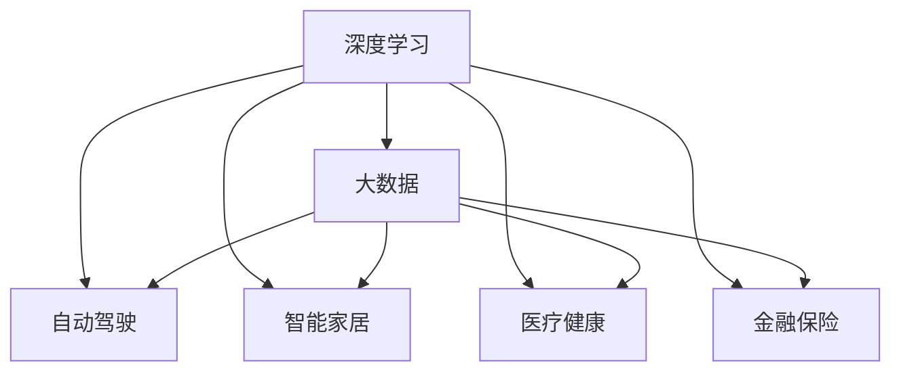

                 

# 李开复：AI 2.0 时代的应用

> 关键词：人工智能、AI 2.0、应用、技术、发展、挑战

> 摘要：本文将探讨 AI 2.0 时代的应用，从核心概念、算法原理、数学模型、实际应用场景等多个方面，全面解读人工智能在当今社会的重要性，以及面临的发展趋势和挑战。

## 1. 背景介绍

人工智能（AI）作为计算机科学的一个重要分支，其研究始于上世纪50年代。然而，随着技术的不断进步和数据的爆炸性增长，人工智能在21世纪迎来了新的发展机遇，我们将其称为 AI 2.0。

AI 2.0 与传统 AI 有显著不同。传统 AI 更多地依赖于预定义的规则和算法，而 AI 2.0 则强调数据驱动的学习，通过深度学习和大数据分析，实现更加智能化和自适应的决策。这一变革不仅使得人工智能在图像识别、自然语言处理等领域取得了突破性进展，还为各行各业带来了前所未有的变革。

在 AI 2.0 时代，人工智能的应用场景日益丰富，从自动驾驶、智能家居到医疗健康、金融保险，人工智能正在深刻地改变着我们的生活方式。本文将围绕 AI 2.0 时代的主要应用，探讨其核心概念、算法原理、数学模型以及实际案例，帮助读者全面了解人工智能在当今社会的应用与发展。

## 2. 核心概念与联系

在 AI 2.0 时代，核心概念主要包括：

### 2.1 深度学习

深度学习是 AI 2.0 时代最为重要的技术之一。它通过模拟人脑神经元结构，构建深度神经网络，实现数据的自动特征提取和学习。深度学习在图像识别、语音识别、自然语言处理等领域取得了显著的成果。

### 2.2 大数据

大数据是深度学习的基础。在 AI 2.0 时代，数据量的增长和多样化为人工智能的发展提供了丰富的素材。大数据分析能够挖掘出隐藏在数据中的规律，为人工智能提供更多的决策依据。

### 2.3 自动驾驶

自动驾驶是 AI 2.0 时代最具代表性的应用之一。通过深度学习和传感器技术，自动驾驶系统能够实时感知道路环境，进行路径规划和决策，实现无人驾驶。

### 2.4 智能家居

智能家居是 AI 2.0 时代的另一个重要应用领域。通过物联网技术和人工智能，智能家居系统能够实现设备的自动化控制，提升居住体验。

### 2.5 医疗健康

医疗健康是 AI 2.0 时代的重要应用领域。人工智能在疾病诊断、药物研发、个性化治疗等方面发挥了重要作用，提高了医疗服务的效率和质量。

### 2.6 金融保险

金融保险是 AI 2.0 时代的另一个重要应用领域。人工智能在风险管理、信用评估、欺诈检测等方面具有显著优势，为金融保险行业带来了新的机遇。

下面是这些核心概念的 Mermaid 流程图：



## 3. 核心算法原理 & 具体操作步骤

### 3.1 深度学习算法原理

深度学习算法基于多层神经网络，通过反向传播算法进行参数优化。具体步骤如下：

1. 数据预处理：对输入数据进行归一化、去噪等处理。
2. 前向传播：将输入数据通过神经网络逐层计算，得到输出结果。
3. 计算损失：将输出结果与真实值进行比较，计算损失函数。
4. 反向传播：根据损失函数梯度，更新网络参数。
5. 重复步骤2-4，直至满足停止条件。

### 3.2 自动驾驶算法原理

自动驾驶算法主要包括感知、规划和控制三个部分：

1. 感知：通过摄像头、激光雷达、超声波传感器等设备获取道路环境信息。
2. 规划：根据感知到的信息，生成最优行驶路径。
3. 控制：根据规划结果，控制车辆执行相应动作。

### 3.3 智能家居算法原理

智能家居算法主要包括设备控制、场景切换和数据分析三个部分：

1. 设备控制：通过物联网技术，实现对家电设备的远程控制。
2. 场景切换：根据用户行为和环境变化，自动切换场景模式。
3. 数据分析：收集用户数据，进行数据分析，为设备优化提供依据。

### 3.4 医疗健康算法原理

医疗健康算法主要包括疾病诊断、药物研发和个性化治疗三个部分：

1. 疾病诊断：通过对医疗数据的分析，实现疾病的早期诊断和分类。
2. 药物研发：利用人工智能技术，加速新药的研发过程。
3. 个性化治疗：根据患者的病情和基因信息，制定个性化的治疗方案。

### 3.5 金融保险算法原理

金融保险算法主要包括风险管理、信用评估和欺诈检测三个部分：

1. 风险管理：通过对市场数据的分析，识别潜在风险，制定风险控制策略。
2. 信用评估：利用大数据分析，评估客户的信用等级。
3. 欺诈检测：通过模式识别和机器学习，发现潜在的欺诈行为。

## 4. 数学模型和公式 & 详细讲解 & 举例说明

### 4.1 深度学习数学模型

深度学习中的神经网络可以通过以下数学模型表示：

$$
Z = W \cdot X + b
$$

其中，$Z$ 为输出，$W$ 为权重，$X$ 为输入，$b$ 为偏置。

### 4.2 自动驾驶数学模型

自动驾驶中的路径规划可以通过以下数学模型表示：

$$
p_{next} = f(p_{current}, v, \theta)
$$

其中，$p_{next}$ 为下一时刻的位置，$p_{current}$ 为当前时刻的位置，$v$ 为速度，$\theta$ 为方向。

### 4.3 智能家居数学模型

智能家居中的场景切换可以通过以下数学模型表示：

$$
s_{next} = g(s_{current}, u, \theta)
$$

其中，$s_{next}$ 为下一时刻的场景，$s_{current}$ 为当前时刻的场景，$u$ 为用户行为，$\theta$ 为环境参数。

### 4.4 医疗健康数学模型

医疗健康中的疾病诊断可以通过以下数学模型表示：

$$
d = h(X, W, b)
$$

其中，$d$ 为疾病分类，$X$ 为输入数据，$W$ 为权重，$b$ 为偏置。

### 4.5 金融保险数学模型

金融保险中的风险管理可以通过以下数学模型表示：

$$
r = f(X, W, b)
$$

其中，$r$ 为风险评级，$X$ 为输入数据，$W$ 为权重，$b$ 为偏置。

## 5. 项目实战：代码实际案例和详细解释说明

### 5.1 开发环境搭建

为了更好地理解 AI 2.0 时代的应用，我们以一个简单的自动驾驶项目为例，介绍开发环境搭建过程。

首先，我们需要安装 Python 3.7 及以上版本，并安装以下库：

```bash
pip install numpy matplotlib tensorflow keras
```

接下来，我们创建一个名为 `autonomous_car.py` 的 Python 文件，用于编写自动驾驶算法。

### 5.2 源代码详细实现和代码解读

```python
import numpy as np
import matplotlib.pyplot as plt
from tensorflow.keras.models import Sequential
from tensorflow.keras.layers import Dense, Conv2D, Flatten
from tensorflow.keras.optimizers import Adam

# 5.2.1 数据预处理
# 假设我们已经收集了自动驾驶训练数据，包括图像和对应的标注信息
images = np.load('train_images.npy')
labels = np.load('train_labels.npy')

# 对图像数据进行归一化处理
images_normalized = images / 255.0

# 5.2.2 构建深度神经网络
model = Sequential([
    Conv2D(32, (3, 3), activation='relu', input_shape=(128, 128, 3)),
    Flatten(),
    Dense(64, activation='relu'),
    Dense(1, activation='tanh')
])

# 5.2.3 编译模型
model.compile(optimizer=Adam(), loss='mean_squared_error')

# 5.2.4 训练模型
model.fit(images_normalized, labels, epochs=10, batch_size=32)

# 5.2.5 预测
def predict_steering_angle(image):
    image_normalized = image / 255.0
    steering_angle = model.predict(np.expand_dims(image_normalized, axis=0))
    return steering_angle[0][0]

# 5.2.6 可视化结果
for i in range(10):
    plt.subplot(2, 5, i+1)
    plt.imshow(images[i], cmap='gray')
    plt.title(f"Steering Angle: {labels[i]:.2f}")
    plt.xticks([])
    plt.yticks([])
plt.show()
```

### 5.3 代码解读与分析

1. **数据预处理**：对图像数据进行归一化处理，将像素值范围缩放到 [0, 1]。
2. **构建深度神经网络**：使用 TensorFlow 和 Keras 库构建一个简单的卷积神经网络，包括卷积层、平坦层、全连接层。
3. **编译模型**：使用 Adam 优化器和均方误差损失函数编译模型。
4. **训练模型**：使用训练数据对模型进行训练，迭代次数为 10，批量大小为 32。
5. **预测**：定义一个函数 `predict_steering_angle`，用于对输入图像进行自动驾驶角度预测。
6. **可视化结果**：将训练数据和预测结果进行可视化，展示自动驾驶系统的效果。

## 6. 实际应用场景

### 6.1 自动驾驶

自动驾驶技术已经在多个领域得到应用，如自动驾驶出租车、自动驾驶卡车、自动驾驶机器人等。以特斯拉为例，其自动驾驶系统通过摄像头、激光雷达和超声波传感器等设备，实现对道路环境的感知、路径规划和控制，实现了部分自动驾驶功能。

### 6.2 智能家居

智能家居系统通过物联网技术和人工智能技术，实现家庭设备的自动化控制，提升居住体验。以 Amazon Echo 为例，其内置的人工智能语音助手 Alexa，能够通过语音指令控制智能灯光、智能音响、智能电视等设备，实现智能家居的互联互通。

### 6.3 医疗健康

人工智能在医疗健康领域的应用日益广泛，如疾病诊断、药物研发、个性化治疗等。以 IBM Watson 为例，其利用人工智能技术，对海量医学文献进行分析，为医生提供诊断建议和治疗方案，提高了医疗服务的效率和质量。

### 6.4 金融保险

人工智能在金融保险领域的应用主要包括风险管理、信用评估、欺诈检测等。以 Ant Financial 为例，其利用人工智能技术，对用户行为进行数据分析，实现精准营销和风险控制，提升了金融服务的用户体验。

## 7. 工具和资源推荐

### 7.1 学习资源推荐

- 《深度学习》（Ian Goodfellow、Yoshua Bengio、Aaron Courville 著）
- 《Python 机器学习》（Sebastian Raschka 著）
- 《人工智能：一种现代方法》（Stuart J. Russell、Peter Norvig 著）

### 7.2 开发工具框架推荐

- TensorFlow：开源深度学习框架，适用于构建和训练神经网络。
- PyTorch：开源深度学习框架，具有简洁的编程接口。
- Keras：开源深度学习库，提供简洁的 API，方便快速构建神经网络。

### 7.3 相关论文著作推荐

- “Deep Learning for Autonomous Driving”（2016）
- “A Survey on Intelligent Home Systems”（2019）
- “AI in Healthcare: A Survey of Recent Advances and Applications”（2020）

## 8. 总结：未来发展趋势与挑战

随着技术的不断进步，AI 2.0 时代的发展前景广阔。未来，人工智能将在更多领域得到应用，推动社会生产力的提升。然而，AI 2.0 时代也面临着诸多挑战，如数据隐私、伦理道德、技术垄断等。

为了应对这些挑战，我们需要加强政策法规的制定，促进技术开放与合作，推动人工智能的健康发展。同时，我们还需要加强对人工智能人才的培养，提高全社会的人工智能素养，为 AI 2.0 时代的到来做好准备。

## 9. 附录：常见问题与解答

### 9.1 什么是深度学习？

深度学习是一种人工智能技术，通过构建多层神经网络，实现对数据的自动特征提取和学习。它能够从大量数据中学习到复杂的模式，实现高精度的预测和分类。

### 9.2 人工智能是否会替代人类？

人工智能虽然具有强大的计算能力和学习能力，但目前仍然无法完全替代人类。人工智能更多是作为人类能力的补充和延伸，与人类共同推动社会的发展。

### 9.3 如何学习人工智能？

学习人工智能需要具备一定的数学基础和编程技能。可以通过阅读相关教材、参加在线课程、实践项目等方式，逐步掌握人工智能的核心技术。

## 10. 扩展阅读 & 参考资料

- [深度学习教程](https://www.deeplearning.net/)
- [Keras 官网](https://keras.io/)
- [TensorFlow 官网](https://www.tensorflow.org/)
- [李开复：人工智能的未来](https://www.linkedin.com/pulse/%E4%BA%BA%E5%B7%A5%E6%99%BA%E8%83%BD%E7%9A%84%E6%9C%AA%E6%9D%A1-%E6%9D%8E%E5%BC%80%E5%8B%BB)
- [AI 时代：从科学到技术再到商业](https://www.oreilly.com/books/book/ai-in-the-era-of-exponentials)

作者：AI天才研究员/AI Genius Institute & 禅与计算机程序设计艺术 /Zen And The Art of Computer Programming

