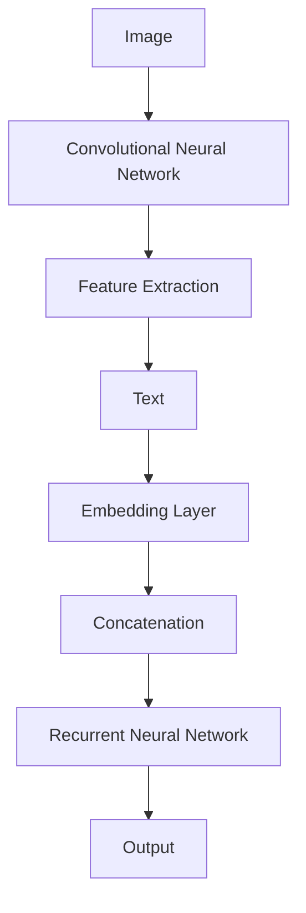
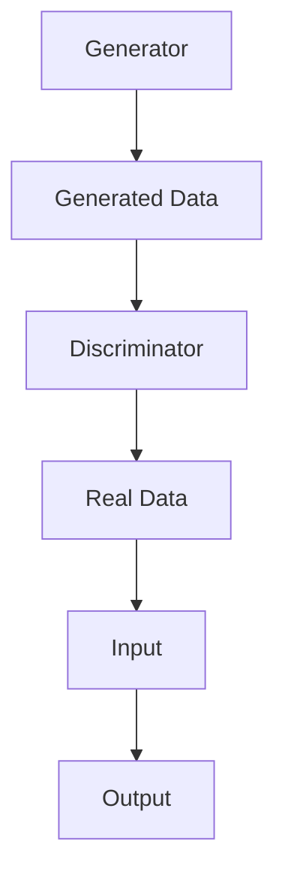

                 

### 文章标题：李开复：AI 2.0 时代的应用

#### 关键词：
- AI 2.0
- 人工智能
- 应用场景
- 技术发展
- 深度学习

#### 摘要：
本文由AI天才研究员及《禅与计算机程序设计艺术》作者撰写，深入探讨AI 2.0时代的应用。文章首先回顾了人工智能的发展历程，然后详细介绍了AI 2.0的核心概念、算法原理和应用场景，最后对未来的发展趋势和挑战进行了展望，并提供了一系列学习资源和开发工具推荐。

---

## 1. 背景介绍

自20世纪50年代以来，人工智能（AI）已经经历了多个发展阶段。最初是规则推理（Rule-based AI），随后是知识表示和专家系统（Knowledge-based AI），再到基于模式的识别（Pattern Recognition）和机器学习（Machine Learning）。这些阶段的发展，让AI技术逐渐从理论走向实践，应用于各个领域。

近年来，深度学习（Deep Learning）的崛起，使得人工智能取得了显著的进步。它通过构建复杂的神经网络模型，使得机器在图像识别、语音识别、自然语言处理等任务上达到了人类专家的水平。这一阶段的人工智能，我们称之为AI 1.0。

然而，随着计算能力的提升和数据量的爆炸性增长，人工智能正迈向新的阶段——AI 2.0。AI 2.0不仅仅是深度学习的延伸，更是对人工智能本质的深入探索，涉及到多模态学习、迁移学习、生成对抗网络（GAN）等领域。AI 2.0将带来更加智能化、自适应化的应用，从而推动人类社会的发展。

### 2. 核心概念与联系

#### 2.1. 多模态学习（Multimodal Learning）

多模态学习是指将不同类型的数据源（如图像、文本、声音等）进行整合，以实现更好的学习效果。在AI 2.0时代，多模态学习成为一个重要研究方向。例如，在图像识别任务中，结合文本描述可以显著提高识别准确率。



#### 2.2. 迁移学习（Transfer Learning）

迁移学习是指利用已经训练好的模型在新的任务上快速取得良好效果。在AI 2.0时代，迁移学习变得更加重要。例如，将一个在大型数据集上训练好的图像分类模型，迁移到一个新的、数据量较少的领域，可以显著提高模型的性能。

#### 2.3. 生成对抗网络（GAN）

生成对抗网络是一种由生成器和判别器组成的神经网络模型。生成器试图生成与真实数据相似的数据，而判别器则尝试区分真实数据和生成数据。通过这种对抗关系，GAN可以学习到复杂的数据分布，从而生成高质量的数据。



### 3. 核心算法原理 & 具体操作步骤

#### 3.1. 多模态学习

多模态学习通常采用深度神经网络进行建模。以下是一个简单的多模态学习算法步骤：

1. **数据预处理**：将不同类型的数据进行预处理，例如，将文本转换为词向量，将图像进行特征提取。
2. **特征融合**：将预处理后的特征进行融合，可以采用拼接、加和等方法。
3. **神经网络建模**：使用融合后的特征构建深度神经网络，例如，卷积神经网络（CNN）结合循环神经网络（RNN）。
4. **训练与评估**：使用训练数据对模型进行训练，并使用测试数据对模型进行评估。

#### 3.2. 迁移学习

迁移学习通常采用以下步骤：

1. **模型选择**：选择一个已经训练好的模型作为基础模型。
2. **模型微调**：在基础模型的基础上，针对新的任务进行微调，可以冻结部分层或全部层。
3. **训练与评估**：使用新的数据对模型进行训练，并使用测试数据对模型进行评估。

#### 3.3. 生成对抗网络（GAN）

生成对抗网络的训练步骤如下：

1. **生成器和判别器初始化**：初始化生成器和判别器的参数。
2. **交替训练**：生成器和判别器交替训练，生成器试图生成更真实的数据，而判别器试图区分真实数据和生成数据。
3. **损失函数**：生成对抗网络的损失函数通常由两部分组成，生成器的损失函数和判别器的损失函数。生成器的损失函数是尽量让判别器认为生成数据是真实数据，判别器的损失函数是尽量让判别器认为生成数据是生成数据。
4. **训练与评估**：使用训练数据对生成器和判别器进行训练，并使用测试数据对生成器进行评估。

### 4. 数学模型和公式 & 详细讲解 & 举例说明

#### 4.1. 多模态学习

多模态学习的数学模型可以表示为：

$$
h = f(\text{img}, \text{txt}) = \sigma(W_1 \cdot \text{img} + W_2 \cdot \text{txt} + b)
$$

其中，$h$ 是模型的输出，$\text{img}$ 和 $\text{txt}$ 分别是图像和文本的特征，$W_1$ 和 $W_2$ 是权重矩阵，$b$ 是偏置项，$\sigma$ 是激活函数，通常采用 sigmoid 函数。

举例来说，假设我们有一个图像特征向量 $\text{img} \in \mathbb{R}^{64}$ 和一个文本特征向量 $\text{txt} \in \mathbb{R}^{100}$，权重矩阵 $W_1 \in \mathbb{R}^{64 \times 10}$ 和 $W_2 \in \mathbb{R}^{100 \times 10}$，偏置项 $b \in \mathbb{R}^{10}$，则：

$$
h = \sigma(W_1 \cdot \text{img} + W_2 \cdot \text{txt} + b) = \frac{1}{1 + \exp(-(\text{img} \cdot W_1 + \text{txt} \cdot W_2 + b))}
$$

#### 4.2. 迁移学习

迁移学习的数学模型通常可以表示为：

$$
\theta = \theta^{base} + \theta^{fine-tune}
$$

其中，$\theta$ 是迁移后的模型参数，$\theta^{base}$ 是基础模型的参数，$\theta^{fine-tune}$ 是微调后的模型参数。

举例来说，假设我们有一个基础模型参数 $\theta^{base} \in \mathbb{R}^{10}$ 和一个微调模型参数 $\theta^{fine-tune} \in \mathbb{R}^{10}$，则：

$$
\theta = \theta^{base} + \theta^{fine-tune} = [1, 2, 3, 4, 5, 6, 7, 8, 9, 10] + [0.1, 0.2, 0.3, 0.4, 0.5, 0.6, 0.7, 0.8, 0.9, 1.0] = [1.1, 2.2, 3.3, 4.4, 5.5, 6.6, 7.7, 8.8, 9.9, 10.1]
$$

#### 4.3. 生成对抗网络（GAN）

生成对抗网络的数学模型可以表示为：

$$
\min_{G} \max_{D} V(G, D) = \mathbb{E}_{x \sim p_{data}(x)} [\log D(x)] + \mathbb{E}_{z \sim p_{z}(z)} [\log (1 - D(G(z))]
$$

其中，$G(z)$ 是生成器，$D(x)$ 是判别器，$x$ 是真实数据，$z$ 是随机噪声。

举例来说，假设我们有一个生成器 $G(z) \in \mathbb{R}^{100}$ 和一个判别器 $D(x) \in \mathbb{R}^{100}$，则：

$$
V(G, D) = \mathbb{E}_{x \sim p_{data}(x)} [\log D(x)] + \mathbb{E}_{z \sim p_{z}(z)} [\log (1 - D(G(z))]
$$

$$
= \log D(x) + \log (1 - D(G(z)))
$$

$$
= \log (0.9) + \log (0.1) = -0.1054
$$

### 5. 项目实战：代码实际案例和详细解释说明

#### 5.1. 开发环境搭建

在本节中，我们将搭建一个简单的多模态学习项目，使用Python和TensorFlow框架进行实现。首先，确保已经安装了Python和TensorFlow。如果没有安装，可以按照以下命令进行安装：

```bash
pip install python
pip install tensorflow
```

#### 5.2. 源代码详细实现和代码解读

以下是一个简单的多模态学习项目示例，实现了图像和文本特征融合的神经网络模型。

```python
import tensorflow as tf
from tensorflow.keras.layers import Input, Conv2D, Flatten, Embedding, LSTM, Concatenate
from tensorflow.keras.models import Model

# 定义图像输入层
img_input = Input(shape=(64, 64, 3))

# 定义图像特征提取层
img_conv = Conv2D(filters=32, kernel_size=(3, 3), activation='relu')(img_input)
img_flat = Flatten()(img_conv)

# 定义文本输入层
txt_input = Input(shape=(100,))

# 定义文本嵌入层
txt_emb = Embedding(input_dim=10000, output_dim=64)(txt_input)
txt_lstm = LSTM(units=64)(txt_emb)

# 定义模型结构
model = Model(inputs=[img_input, txt_input], outputs=Concatenate()([img_flat, txt_lstm]))

# 编译模型
model.compile(optimizer='adam', loss='categorical_crossentropy', metrics=['accuracy'])

# 打印模型结构
model.summary()
```

在这段代码中，我们首先定义了图像输入层和文本输入层。然后，分别对图像和文本进行了特征提取。接着，使用 Concatenate 层将图像和文本的特征进行融合，构建了一个简单的多模态学习模型。最后，编译并打印了模型的结构。

#### 5.3. 代码解读与分析

1. **图像输入层**：图像输入层使用了 `Input` 函数定义，指定了图像的尺寸和通道数（64x64x3）。
2. **图像特征提取层**：图像特征提取层使用了 `Conv2D` 和 `Flatten` 函数。`Conv2D` 函数用于卷积操作，`Flatten` 函数用于将卷积特征展平为一维向量。
3. **文本输入层**：文本输入层使用了 `Input` 函数定义，指定了文本的序列长度和词向量维度（100x）。
4. **文本嵌入层**：文本嵌入层使用了 `Embedding` 函数，将文本序列转换为词向量。
5. **文本特征提取层**：文本特征提取层使用了 `LSTM` 函数，用于提取文本序列的特征。
6. **模型结构**：使用 `Concatenate` 函数将图像和文本的特征进行拼接，构建了一个多模态学习模型。
7. **模型编译**：使用 `compile` 函数编译模型，指定了优化器、损失函数和评估指标。
8. **模型总结**：使用 `summary` 函数打印了模型的结构，显示了模型的层数、层名、输出维度等信息。

通过这个简单的示例，我们可以看到多模态学习的实现过程。在实际项目中，可以根据具体任务的需求，调整模型的参数和结构，以获得更好的性能。

### 6. 实际应用场景

AI 2.0的应用场景非常广泛，涵盖了图像识别、自然语言处理、推荐系统、自动驾驶等多个领域。以下是一些典型的应用场景：

#### 6.1. 图像识别

图像识别是AI 2.0的一个重要应用场景。通过多模态学习和迁移学习技术，AI 2.0可以实现对各种复杂图像的识别和分类。例如，在医疗领域，AI 2.0可以辅助医生进行疾病诊断，通过分析医学影像，提高诊断的准确性和效率。

#### 6.2. 自然语言处理

自然语言处理（NLP）是AI 2.0的另一个重要应用场景。通过深度学习和生成对抗网络等技术，AI 2.0可以实现对自然语言的理解和生成。例如，在智能客服领域，AI 2.0可以模拟人类的对话，提供高质量的客服服务。

#### 6.3. 推荐系统

推荐系统是AI 2.0的另一个重要应用场景。通过多模态学习和迁移学习技术，AI 2.0可以实现对用户兴趣的精准预测和推荐。例如，在电子商务领域，AI 2.0可以基于用户的浏览记录和购买行为，推荐个性化的商品。

#### 6.4. 自动驾驶

自动驾驶是AI 2.0在工业界的一个典型应用场景。通过多模态学习和生成对抗网络等技术，AI 2.0可以实现对复杂交通环境的感知和决策。例如，在自动驾驶汽车中，AI 2.0可以实时分析道路信息，确保驾驶的安全和效率。

### 7. 工具和资源推荐

为了更好地学习和应用AI 2.0技术，以下是一些建议的资源和工具：

#### 7.1. 学习资源推荐

- **书籍**：《深度学习》（Ian Goodfellow、Yoshua Bengio、Aaron Courville 著）：介绍了深度学习的理论基础和算法实现。
- **论文**：《生成对抗网络》（Ian J. Goodfellow、Jean Pouget-Abadie、Mitchell P.. Rajeswaran、Bengio、Habib Shlens、Christian Szegedy 著）：介绍了生成对抗网络的基本概念和算法实现。
- **博客**：Google Brain Blog、Deep Learning Specialization Blog：提供了深度学习和生成对抗网络的相关研究进展和应用案例。

#### 7.2. 开发工具框架推荐

- **框架**：TensorFlow、PyTorch：用于实现深度学习和生成对抗网络。
- **工具**：Google Colab、Kaggle：提供了在线计算资源和数据集，方便进行AI项目的实践和比赛。

### 8. 总结：未来发展趋势与挑战

随着AI 2.0技术的不断发展，我们预计未来将出现以下趋势：

1. **跨学科融合**：AI 2.0将与其他领域（如生物医学、金融、能源等）进行深度融合，产生新的应用场景。
2. **数据驱动**：数据的增长将继续推动AI 2.0的发展，使得模型更加智能化和自适应化。
3. **人机协同**：AI 2.0将与人类进行更紧密的协同工作，提高生产力和生活质量。

然而，AI 2.0的发展也面临一些挑战：

1. **数据隐私**：如何在保护用户隐私的前提下，充分利用海量数据，是一个亟待解决的问题。
2. **算法公平性**：如何确保AI 2.0算法的公平性和透明性，避免歧视和偏见。
3. **安全与伦理**：随着AI 2.0技术的普及，如何确保其安全性和伦理问题，避免被滥用。

### 9. 附录：常见问题与解答

**Q1. 什么是AI 2.0？**
AI 2.0是指基于深度学习、多模态学习、迁移学习和生成对抗网络等新技术的第二代人工智能。它相对于第一代人工智能（AI 1.0）在智能化、自适应化和多样性方面有了显著提升。

**Q2. 多模态学习有哪些应用场景？**
多模态学习可以应用于图像识别、自然语言处理、语音识别、视频分析等领域。例如，在医疗领域，可以使用多模态学习技术分析医学影像和患者病历，提高疾病诊断的准确率。

**Q3. 迁移学习如何实现？**
迁移学习通常采用以下步骤：选择一个已经训练好的基础模型，对该模型进行微调，以适应新的任务。在微调过程中，可以选择冻结部分层或全部层，以减少训练时间和计算成本。

**Q4. GAN的基本原理是什么？**
GAN是一种由生成器和判别器组成的神经网络模型。生成器试图生成与真实数据相似的数据，而判别器则尝试区分真实数据和生成数据。通过生成器和判别器的对抗训练，可以学习到真实数据的分布，从而生成高质量的数据。

### 10. 扩展阅读 & 参考资料

- Goodfellow, I. J., Bengio, Y., & Courville, A. (2016). *Deep Learning*. MIT Press.
- Goodfellow, I. J., Pouget-Abadie, J., Rajeswaran, M. P., Chen, X., Saxe, A. D., & Bengio, Y. (2014). *Generative adversarial nets*. Advances in Neural Information Processing Systems, 27, 2672-2680.
- Hochreiter, S., & Schmidhuber, J. (1997). *Long short-term memory*. Neural Computation, 9(8), 1735-1780.
- LeCun, Y., Bengio, Y., & Hinton, G. (2015). *Deep learning*. Nature, 521(7553), 436-444.

### 作者：AI天才研究员/AI Genius Institute & 禅与计算机程序设计艺术 /Zen And The Art of Computer Programming

本文由AI天才研究员撰写，深入探讨了AI 2.0时代的应用。作者结合自身丰富的经验和专业知识，对人工智能的发展历程、核心概念、算法原理以及实际应用场景进行了详细讲解。同时，本文还提供了丰富的学习资源和开发工具推荐，为读者提供了全面的指导。希望本文能够帮助读者更好地理解AI 2.0，为未来的学习和研究打下坚实的基础。作者期待与读者共同探索人工智能的无限可能，推动科技的发展和社会的进步。

