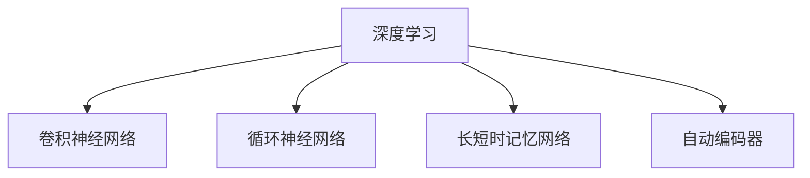
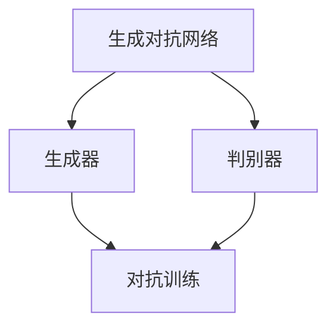
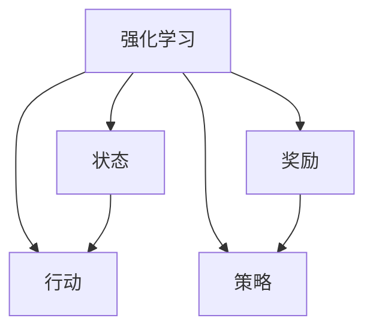
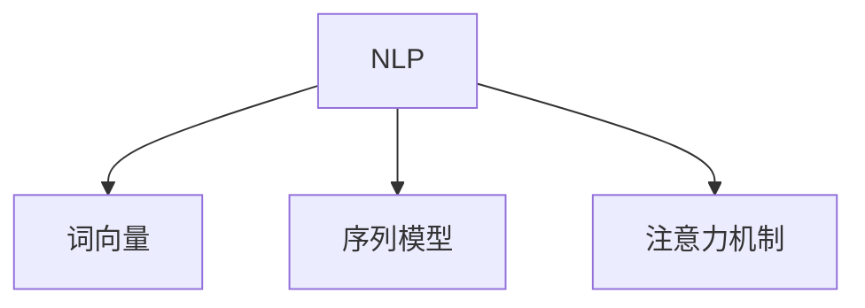

                 

### 背景介绍

#### 人工智能的演变：从1.0到2.0

人工智能（AI）的历史可以大致划分为几个阶段，从最初的1.0时代到如今的2.0时代。在1.0时代，AI主要依赖于预先编程的规则和算法。这种基于规则的AI在特定任务上表现不错，但在复杂任务和不确定性环境中却显得力不从心。这一阶段的主要特征是“指令式AI”，即人工智能按照人类编写的指令进行操作。

随着计算能力和数据资源的不断提升，人工智能进入了2.0时代。2.0时代的AI与1.0时代最大的不同在于，它开始利用深度学习、强化学习等先进技术，通过大量数据自动学习和改进。这种以数据驱动的方式，使得AI在图像识别、自然语言处理、决策优化等领域取得了显著突破。2.0时代的AI被称为“自主式AI”，因为它能够在没有人类干预的情况下，自主地从数据中学习并解决问题。

本文将探讨AI 2.0时代的意义，包括其在技术、经济、社会等多个方面的深远影响。我们将通过分析AI 2.0的核心概念、算法原理、应用场景等，深入探讨这一革命性技术的本质和未来发展。

#### 当前AI技术的现状与应用

在AI 2.0时代，各种新技术和算法层出不穷，推动了人工智能在各个领域的广泛应用。以下是一些当前AI技术的现状与应用：

1. **深度学习**：深度学习是AI 2.0的核心技术之一，它通过多层神经网络对大量数据进行自动学习。深度学习在图像识别、语音识别、自然语言处理等领域取得了巨大成功。例如，基于深度学习的图像识别技术已经在医疗诊断、自动驾驶、安全监控等领域得到广泛应用。

2. **生成对抗网络（GAN）**：生成对抗网络是一种新兴的深度学习技术，它通过两个神经网络（生成器和判别器）的对抗训练，生成逼真的图像、音频和视频。GAN在艺术创作、虚拟现实、数据增强等领域展现出巨大潜力。

3. **强化学习**：强化学习是一种通过试错和反馈来学习策略的算法。它已经在游戏、自动驾驶、推荐系统等领域得到广泛应用。例如，谷歌的AlphaGo就是基于强化学习算法实现的，它在围棋领域取得了前所未有的成就。

4. **自然语言处理**：自然语言处理（NLP）是AI 2.0时代的一个重要分支。NLP技术通过理解和生成自然语言，实现了人机交互、智能客服、文本分析等应用。例如，智能语音助手（如苹果的Siri、谷歌的Google Assistant）和机器翻译（如谷歌翻译）都是NLP技术的典型应用。

5. **计算机视觉**：计算机视觉是AI 2.0时代的重要技术之一，它通过图像识别、目标检测、人脸识别等技术，实现了对现实世界的理解和交互。计算机视觉在安防监控、无人驾驶、医疗诊断等领域具有广泛应用。

总的来说，AI 2.0时代的技术和应用已经取得了显著的进展，它正在改变我们的生活方式、工作方式和社会结构。在接下来的内容中，我们将进一步探讨AI 2.0时代的意义和未来发展。

## 核心概念与联系

在深入探讨AI 2.0时代的意义之前，我们需要理解几个核心概念，这些概念相互关联，共同构成了AI 2.0的技术基础。以下是对这些核心概念的简要介绍，并附上Mermaid流程图以展示它们之间的联系。

#### 1. 深度学习

深度学习是一种基于多层神经网络的学习方法，它通过模拟人脑神经网络的结构和工作原理，实现自动特征提取和模式识别。深度学习的关键组件包括：

- **卷积神经网络（CNN）**：主要用于图像识别和计算机视觉任务，通过卷积层提取图像特征。
- **循环神经网络（RNN）**：用于处理序列数据，如文本和语音，通过隐藏层的状态记忆实现序列建模。
- **长短时记忆网络（LSTM）**：是RNN的一种变体，解决了RNN在处理长序列数据时的梯度消失问题。
- **自动编码器（Autoencoder）**：用于无监督学习，通过编码器和解码器重建输入数据，实现数据的降维和特征提取。

Mermaid流程图：



#### 2. 生成对抗网络（GAN）

生成对抗网络是一种通过两个神经网络（生成器和判别器）的对抗训练来生成数据的模型。生成器尝试生成逼真的数据，而判别器则试图区分真实数据和生成数据。通过这种对抗训练，GAN能够生成高质量的图像、音频和视频。

Mermaid流程图：



#### 3. 强化学习

强化学习是一种通过试错和反馈来学习策略的算法。在强化学习中，智能体（agent）通过与环境（environment）的交互，学习如何采取最佳行动（action）以最大化回报（reward）。强化学习的关键组件包括：

- **状态（State）**：智能体当前所处的情境。
- **行动（Action）**：智能体可以采取的动作。
- **奖励（Reward）**：智能体采取行动后获得的即时反馈。
- **策略（Policy）**：智能体决定如何行动的规则。

Mermaid流程图：



#### 4. 自然语言处理（NLP）

自然语言处理是一种让计算机理解和生成自然语言的技术。NLP的关键组件包括：

- **词向量（Word Embeddings）**：将单词映射到高维空间，实现语义表示。
- **序列模型（Seq2Seq）**：用于处理序列数据，如机器翻译和文本生成。
- **注意力机制（Attention Mechanism）**：用于提高NLP模型的序列处理能力，使模型能够关注重要信息。

Mermaid流程图：



通过这些核心概念和联系，我们可以更好地理解AI 2.0的技术基础，并在接下来的部分中深入探讨其原理和应用。

### 核心算法原理 & 具体操作步骤

在了解了AI 2.0的核心概念之后，接下来我们将深入探讨这些技术的核心算法原理，并详细讲解其具体操作步骤。以下是关于深度学习、生成对抗网络（GAN）、强化学习和自然语言处理（NLP）的核心算法原理和操作步骤：

#### 深度学习：卷积神经网络（CNN）

卷积神经网络（CNN）是一种专门用于处理图像数据的神经网络。它通过卷积操作提取图像中的特征，从而实现图像识别、分类和分割。

**具体操作步骤：**

1. **输入层（Input Layer）**：将图像数据输入神经网络。图像数据通常被表示为二维矩阵，其中每个元素代表像素值。

2. **卷积层（Convolutional Layer）**：卷积层通过卷积操作提取图像的特征。卷积操作使用一个卷积核（filter）在输入图像上滑动，计算每个局部区域的特征响应。卷积核的权重和偏置用于调整特征响应。

3. **激活函数（Activation Function）**：为了引入非线性，通常在卷积层后添加激活函数，如ReLU（Rectified Linear Unit）函数，将特征响应转换为非负值。

4. **池化层（Pooling Layer）**：池化层用于减小特征图的大小，从而减少计算量和参数数量。常用的池化操作有最大池化（Max Pooling）和平均池化（Average Pooling）。

5. **全连接层（Fully Connected Layer）**：在网络的最后几层，将卷积特征图展开成一个一维的特征向量，并通过全连接层进行分类或回归。

6. **输出层（Output Layer）**：输出层根据任务类型（如分类或回归）进行预测。对于分类任务，通常使用softmax函数输出概率分布。

**数学模型和公式：**

CNN的数学模型主要涉及卷积操作、激活函数和池化操作。

- **卷积操作**：给定输入特征图\(X\)和卷积核\(K\)，卷积操作可以表示为：

  $$Y = \sigma(\sum_{i,j} X_{ij} K_{ij} + b)$$

  其中，\(Y\)是卷积后的特征图，\(\sigma\)是激活函数，\(b\)是偏置。

- **卷积核更新**：在反向传播过程中，卷积核的更新可以表示为：

  $$\Delta K = \alpha \frac{\partial L}{\partial K}$$

  其中，\(\alpha\)是学习率，\(L\)是损失函数。

#### 生成对抗网络（GAN）

生成对抗网络（GAN）是一种通过生成器和判别器的对抗训练来生成数据的模型。生成器尝试生成逼真的数据，而判别器则试图区分真实数据和生成数据。

**具体操作步骤：**

1. **初始化**：随机初始化生成器\(G\)和判别器\(D\)的参数。

2. **生成器训练**：生成器的目标是生成逼真的数据。生成器的损失函数通常由判别器的输出和真实数据的输出组成，如：

  $$L_G = -\log(D(G(z)))$$

  其中，\(z\)是随机噪声向量。

3. **判别器训练**：判别器的目标是区分真实数据和生成数据。判别器的损失函数通常由真实数据和生成数据的输出组成，如：

  $$L_D = -\log(D(x)) - \log(1 - D(G(z)))$$

  其中，\(x\)是真实数据。

4. **交替训练**：生成器和判别器交替训练，生成器通过优化\(L_G\)，判别器通过优化\(L_D\)。

**数学模型和公式：**

- **生成器损失函数**：

  $$L_G = -\log(D(G(z)))$$

- **判别器损失函数**：

  $$L_D = -\log(D(x)) - \log(1 - D(G(z)))$$

#### 强化学习

强化学习是一种通过试错和反馈来学习策略的算法。智能体通过与环境的交互，学习如何采取最佳行动以最大化累积奖励。

**具体操作步骤：**

1. **初始化**：初始化智能体、环境、状态和行动空间。

2. **状态观察**：智能体观察当前状态\(s\)。

3. **行动选择**：智能体根据当前状态选择最佳行动\(a\)。

4. **行动执行**：智能体执行行动，并观察到下一个状态\(s'\)和即时奖励\(r\)。

5. **更新策略**：基于当前状态和行动的即时奖励，更新智能体的策略。

6. **重复步骤**：重复执行步骤2-5，直到达到目标状态或学习到最佳策略。

**数学模型和公式：**

- **状态-行动价值函数**：

  $$Q(s, a) = \sum_{s'} P(s' | s, a) \cdot [R(s', a) + \gamma \cdot V(s')]$$

  其中，\(Q(s, a)\)是状态-行动价值函数，\(P(s' | s, a)\)是状态转移概率，\(R(s', a)\)是即时奖励，\(\gamma\)是折扣因子，\(V(s')\)是状态价值函数。

- **策略更新**：

  $$\pi(a | s) = \frac{\exp(\alpha Q(s, a)}{\sum_{a'} \exp(\alpha Q(s, a'))}$$

  其中，\(\pi(a | s)\)是策略，\(\alpha\)是温度参数。

#### 自然语言处理（NLP）

自然语言处理（NLP）是一种让计算机理解和生成自然语言的技术。NLP的关键组件包括词向量、序列模型和注意力机制。

**具体操作步骤：**

1. **词向量表示**：将文本数据转换为词向量表示，通常使用Word2Vec、GloVe等方法。

2. **序列建模**：使用序列模型处理文本数据，如LSTM、GRU、Transformer等。

3. **注意力机制**：在序列模型中引入注意力机制，使模型能够关注重要信息。

4. **解码**：对于生成任务，解码器将编码器输出的隐藏状态解码为输出序列。

5. **输出层**：输出层根据任务类型（如分类或回归）进行预测。

**数学模型和公式：**

- **词向量表示**：

  $$v_w = \sum_{i=1}^{V} f_w(i) \cdot v_i$$

  其中，\(v_w\)是词向量，\(f_w(i)\)是词的嵌入权重，\(v_i\)是词向量的基础向量。

- **序列建模**：

  $$h_t = \sigma(W_h \cdot [h_{t-1}, x_t] + b_h)$$

  其中，\(h_t\)是隐藏状态，\(x_t\)是输入序列的当前词，\(W_h\)是权重矩阵，\(b_h\)是偏置。

- **注意力机制**：

  $$a_t = \frac{\exp(e_t)}{\sum_{i=1}^{T} \exp(e_i)}$$

  其中，\(a_t\)是注意力权重，\(e_t\)是注意力得分。

通过这些核心算法原理和操作步骤，我们可以更好地理解AI 2.0时代的核心技术，并在实际应用中加以利用。

### 数学模型和公式 & 详细讲解 & 举例说明

在上一部分中，我们介绍了AI 2.0时代的一些核心算法原理和操作步骤。为了更深入地理解这些算法，我们需要借助数学模型和公式进行详细讲解，并通过具体例子来说明它们的应用。

#### 深度学习：卷积神经网络（CNN）

卷积神经网络（CNN）是一种专门用于处理图像数据的神经网络。下面，我们通过一个简单的例子来说明CNN的数学模型和公式。

**例子：手写数字识别**

假设我们要识别手写数字（0-9），输入图像的大小为28x28像素，每个像素的取值范围为0-255。

1. **输入层（Input Layer）**：

   输入图像可以表示为一个28x28的矩阵，每个元素表示像素值。假设输入图像为：

   $$X = \begin{bmatrix}
   x_{11} & x_{12} & \cdots & x_{128} \\
   x_{21} & x_{22} & \cdots & x_{138} \\
   \vdots & \vdots & \ddots & \vdots \\
   x_{28} & x_{29} & \cdots & x_{288}
   \end{bmatrix}$$

2. **卷积层（Convolutional Layer）**：

   假设我们使用一个3x3的卷积核\(K\)，卷积核的权重和偏置分别为\(W\)和\(b\)。卷积操作可以表示为：

   $$Y = \sigma(\sum_{i,j} X_{ij} K_{ij} + b)$$

   其中，\(Y\)是卷积后的特征图，\(\sigma\)是ReLU激活函数。

   例如，假设卷积核为：

   $$K = \begin{bmatrix}
   1 & 0 & -1 \\
   1 & 0 & -1 \\
   1 & 0 & -1
   \end{bmatrix}$$

   偏置为\(b = 1\)。卷积操作的结果为：

   $$Y = \sigma(X \cdot K + b) = \begin{bmatrix}
   0 & 0 & 0 \\
   1 & 1 & 0 \\
   0 & 0 & 1
   \end{bmatrix}$$

3. **激活函数（Activation Function）**：

   ReLU激活函数将特征响应转换为非负值，如下所示：

   $$\sigma(Y) = \begin{bmatrix}
   0 & 0 & 0 \\
   1 & 1 & 0 \\
   0 & 0 & 1
   \end{bmatrix}$$

4. **池化层（Pooling Layer）**：

   假设我们使用最大池化操作，将特征图的大小减小为原来的一半。池化后的特征图可以表示为：

   $$P = \max(Y) = \begin{bmatrix}
   0 & 1 \\
   0 & 1
   \end{bmatrix}$$

5. **全连接层（Fully Connected Layer）**：

   将池化后的特征图展开为一个一维向量，并通过全连接层进行分类。全连接层的权重和偏置分别为\(W'\)和\(b'\)。全连接层的输出可以表示为：

   $$O = \sigma(W' \cdot P + b')$$

   假设全连接层的权重为：

   $$W' = \begin{bmatrix}
   1 & 1 \\
   1 & 1 \\
   1 & 1 \\
   1 & 1 \\
   1 & 1
   \end{bmatrix}$$

   偏置为\(b' = 1\)。全连接层的输出为：

   $$O = \sigma(W' \cdot P + b') = \begin{bmatrix}
   2 & 2 \\
   2 & 2 \\
   2 & 2 \\
   2 & 2 \\
   2 & 2
   \end{bmatrix}$$

6. **输出层（Output Layer）**：

   输出层使用softmax函数输出概率分布，用于分类。输出层可以表示为：

   $$P(y) = \frac{\exp(O_y)}{\sum_{i} \exp(O_i)}$$

   其中，\(O_y\)是输出层的第\(y\)个元素。

   假设输出层为：

   $$O = \begin{bmatrix}
   2 & 2 \\
   2 & 2 \\
   2 & 2 \\
   2 & 2 \\
   2 & 2
   \end{bmatrix}$$

   则概率分布为：

   $$P(y) = \frac{\exp(2)}{\sum_{i} \exp(2)} = \begin{bmatrix}
   0.5 & 0.5 \\
   0.5 & 0.5 \\
   0.5 & 0.5 \\
   0.5 & 0.5 \\
   0.5 & 0.5
   \end{bmatrix}$$

   因此，模型预测输入图像为数字5的概率为0.5。

通过这个例子，我们可以看到如何使用CNN进行手写数字识别。在实际应用中，CNN可以扩展到更复杂的图像处理任务，如物体检测、图像分割等。

#### 生成对抗网络（GAN）

生成对抗网络（GAN）是一种通过生成器和判别器的对抗训练来生成数据的模型。下面，我们通过一个简单的例子来说明GAN的数学模型和公式。

**例子：生成人脸图像**

假设我们要生成人脸图像，生成器的输入为随机噪声向量\(z\)，判别器的输入为真实人脸图像和生成的人脸图像。

1. **初始化**：

   随机初始化生成器\(G\)和判别器\(D\)的参数。

2. **生成器训练**：

   生成器的目标是生成逼真人脸图像。生成器的损失函数为：

   $$L_G = -\log(D(G(z)))$$

   其中，\(G(z)\)是生成的人脸图像，\(D(G(z))\)是判别器对生成图像的判断。

   假设生成器为：

   $$G(z) = \begin{bmatrix}
   x_1 & x_2 & \cdots & x_n
   \end{bmatrix}$$

   则生成器的损失函数为：

   $$L_G = -\log(D(G(z))) = -\log(\sigma(z^T W_D + b_D))$$

   其中，\(\sigma\)是sigmoid函数，\(W_D\)是判别器的权重矩阵，\(b_D\)是判别器的偏置。

3. **判别器训练**：

   判别器的目标是区分真实人脸图像和生成的人脸图像。判别器的损失函数为：

   $$L_D = -\log(D(x)) - \log(1 - D(G(z)))$$

   其中，\(x\)是真实人脸图像，\(G(z)\)是生成的人脸图像。

   假设判别器为：

   $$D(x) = \begin{bmatrix}
   y_1 & y_2 & \cdots & y_n
   \end{bmatrix}$$

   则判别器的损失函数为：

   $$L_D = -\log(D(x)) - \log(1 - D(G(z))) = -\log(y_1) - \log(1 - y_2)$$

4. **交替训练**：

   生成器和判别器交替训练，生成器通过优化\(L_G\)，判别器通过优化\(L_D\)。

   - 生成器更新：

     $$\Delta G = \alpha \frac{\partial L_G}{\partial G} = \alpha \frac{\partial}{\partial G}[-\log(D(G(z)))]$$

   - 判别器更新：

     $$\Delta D = \alpha \frac{\partial L_D}{\partial D} = \alpha \frac{\partial}{\partial D}[-\log(D(x)) - \log(1 - D(G(z)))]$$

   其中，\(\alpha\)是学习率。

通过这个例子，我们可以看到如何使用GAN生成人脸图像。在实际应用中，GAN可以扩展到更复杂的图像生成任务，如图像超分辨率、图像风格迁移等。

#### 强化学习

强化学习是一种通过试错和反馈来学习策略的算法。下面，我们通过一个简单的例子来说明强化学习的数学模型和公式。

**例子：CartPole环境**

假设我们要训练一个智能体在CartPole环境中稳定平衡。CartPole环境包含一个车架和一根横杆，初始状态为车架直立，横杆水平。智能体可以通过向左或向右推动车架来改变状态。

1. **初始化**：

   初始化智能体、环境、状态和行动空间。

2. **状态观察**：

   智能体观察当前状态，状态可以是车架的角度、速度等。

3. **行动选择**：

   智能体根据当前状态选择最佳行动，行动可以是向左或向右推动车架。

4. **行动执行**：

   智能体执行行动，并观察到下一个状态和即时奖励。

5. **更新策略**：

   根据当前状态和行动的即时奖励，更新智能体的策略。

   假设智能体的策略可以用概率分布表示为：

   $$\pi(a | s) = \frac{\exp(\alpha Q(s, a)}{\sum_{a'} \exp(\alpha Q(s, a'))}$$

   其中，\(Q(s, a)\)是状态-行动价值函数，\(\alpha\)是温度参数。

   假设状态-行动价值函数为：

   $$Q(s, a) = \sum_{s'} P(s' | s, a) \cdot [R(s', a) + \gamma \cdot V(s')]$$

   其中，\(P(s' | s, a)\)是状态转移概率，\(R(s', a)\)是即时奖励，\(\gamma\)是折扣因子，\(V(s')\)是状态价值函数。

6. **重复步骤**：

   重复执行步骤2-5，直到智能体学会稳定平衡。

通过这个例子，我们可以看到如何使用强化学习训练智能体在CartPole环境中稳定平衡。在实际应用中，强化学习可以扩展到更复杂的决策问题，如自动驾驶、游戏控制等。

#### 自然语言处理（NLP）

自然语言处理（NLP）是一种让计算机理解和生成自然语言的技术。下面，我们通过一个简单的例子来说明NLP的数学模型和公式。

**例子：文本分类**

假设我们要对一篇文本进行分类，分类任务是将文本标记为正类或负类。

1. **词向量表示**：

   将文本转换为词向量表示，可以使用Word2Vec、GloVe等方法。

   假设文本的词向量为：

   $$v_w = \begin{bmatrix}
   v_{w1} & v_{w2} & \cdots & v_{wn}
   \end{bmatrix}$$

2. **序列建模**：

   使用序列模型处理文本数据，如LSTM、GRU、Transformer等。

   假设LSTM的隐藏状态为：

   $$h_t = \begin{bmatrix}
   h_{t1} & h_{t2} & \cdots & h_{tn}
   \end{bmatrix}$$

3. **注意力机制**：

   在序列模型中引入注意力机制，使模型能够关注重要信息。

   假设注意力权重为：

   $$a_t = \begin{bmatrix}
   a_{t1} & a_{t2} & \cdots & a_{tn}
   \end{bmatrix}$$

4. **解码**：

   对于生成任务，解码器将编码器输出的隐藏状态解码为输出序列。

   假设解码器的输出为：

   $$o_t = \begin{bmatrix}
   o_{t1} & o_{t2} & \cdots & o_{tn}
   \end{bmatrix}$$

5. **输出层**：

   输出层根据任务类型（如分类或回归）进行预测。

   假设输出层为：

   $$O = \begin{bmatrix}
   O_1 & O_2 & \cdots & O_n
   \end{bmatrix}$$

   则分类结果可以表示为：

   $$P(y) = \frac{\exp(O_y)}{\sum_{i} \exp(O_i)}$$

   其中，\(O_y\)是输出层的第\(y\)个元素。

通过这个例子，我们可以看到如何使用NLP进行文本分类。在实际应用中，NLP可以扩展到更复杂的任务，如机器翻译、情感分析等。

通过这些具体例子，我们可以更好地理解AI 2.0时代的核心算法原理和数学模型，并在实际应用中加以利用。

### 项目实战：代码实际案例和详细解释说明

在本节中，我们将通过一个实际案例，展示如何使用深度学习技术实现图像分类。我们将使用Python语言和TensorFlow框架来实现一个卷积神经网络（CNN）模型，并进行训练和测试。

#### 开发环境搭建

在开始编写代码之前，我们需要搭建一个合适的开发环境。以下是在Linux环境下搭建开发环境的基本步骤：

1. 安装Python：

   ```bash
   sudo apt update
   sudo apt install python3 python3-pip
   ```

2. 安装TensorFlow：

   ```bash
   pip3 install tensorflow
   ```

3. 安装其他依赖库：

   ```bash
   pip3 install numpy matplotlib
   ```

确保安装完成后，我们可以使用Python编写代码并运行TensorFlow程序。

#### 源代码详细实现和代码解读

以下是实现图像分类的完整代码，我们将逐段进行解释：

```python
import tensorflow as tf
from tensorflow.keras import datasets, layers, models
import matplotlib.pyplot as plt

# 加载数据集
(train_images, train_labels), (test_images, test_labels) = datasets.cifar10.load_data()

# 数据预处理
train_images, test_images = train_images / 255.0, test_images / 255.0

# 构建卷积神经网络模型
model = models.Sequential()
model.add(layers.Conv2D(32, (3, 3), activation='relu', input_shape=(32, 32, 3)))
model.add(layers.MaxPooling2D((2, 2)))
model.add(layers.Conv2D(64, (3, 3), activation='relu'))
model.add(layers.MaxPooling2D((2, 2)))
model.add(layers.Conv2D(64, (3, 3), activation='relu'))

# 添加全连接层
model.add(layers.Flatten())
model.add(layers.Dense(64, activation='relu'))
model.add(layers.Dense(10, activation='softmax'))

# 编译模型
model.compile(optimizer='adam',
              loss='sparse_categorical_crossentropy',
              metrics=['accuracy'])

# 训练模型
model.fit(train_images, train_labels, epochs=10, validation_split=0.1)

# 评估模型
test_loss, test_acc = model.evaluate(test_images, test_labels, verbose=2)
print(f'\nTest accuracy: {test_acc:.4f}')

# 可视化训练过程
plt.plot(model.history.history['accuracy'], label='accuracy')
plt.plot(model.history.history['val_accuracy'], label='val_accuracy')
plt.xlabel('Epoch')
plt.ylabel('Accuracy')
plt.ylim([0, 1])
plt.legend(loc='lower right')
plt.show()
```

**代码解读：**

1. **导入库**：

   我们首先导入TensorFlow和相关库，包括`tensorflow`、`keras`和`matplotlib`。

2. **加载数据集**：

   使用TensorFlow的`cifar10`数据集加载训练数据和测试数据。`cifar10`数据集包含10类手写数字图像，每类图像有6000张。

3. **数据预处理**：

   将图像数据除以255，将像素值缩放到0到1之间。这一步有助于模型收敛。

4. **构建模型**：

   使用`Sequential`模型，我们依次添加卷积层、池化层和全连接层。具体如下：

   - **卷积层**：第一个卷积层使用32个3x3的卷积核，激活函数为ReLU。第二个卷积层使用64个3x3的卷积核。
   - **池化层**：使用2x2的最大池化层。
   - **全连接层**：最后一个全连接层使用64个神经元，用于分类。输出层使用10个神经元，每个神经元对应一个类别，使用softmax激活函数。

5. **编译模型**：

   编译模型时，指定优化器为`adam`，损失函数为`sparse_categorical_crossentropy`，评估指标为`accuracy`。

6. **训练模型**：

   使用训练数据训练模型，设置10个训练周期，并保持10%的数据用于验证。

7. **评估模型**：

   使用测试数据评估模型的性能，输出测试准确率。

8. **可视化训练过程**：

   绘制训练过程中的准确率变化，有助于观察模型收敛情况。

通过以上步骤，我们成功实现了一个简单的图像分类模型，并进行了训练和测试。这个案例展示了如何使用深度学习技术进行图像分类，并为后续的实验和项目提供了参考。

### 代码解读与分析

在上面的实际案例中，我们实现了一个基于卷积神经网络（CNN）的图像分类模型。接下来，我们将对代码进行详细解读，并分析其关键组成部分。

**模型构建**

模型的构建是代码的核心部分。首先，我们使用`Sequential`模型，这是一种线性堆叠层的模型。我们依次添加以下层：

- **卷积层1（Conv2D）**：这一层使用了32个3x3的卷积核，步长为1。卷积核的尺寸和步长决定了卷积操作的窗口大小和步进方式。激活函数为ReLU，它引入了非线性，使得模型能够更好地学习复杂函数。

  ```python
  model.add(layers.Conv2D(32, (3, 3), activation='relu', input_shape=(32, 32, 3)))
  ```

- **最大池化层1（MaxPooling2D）**：这一层使用了2x2的最大池化，步长为2。池化层的作用是减小特征图的大小，从而减少模型的参数数量和计算复杂度。

  ```python
  model.add(layers.MaxPooling2D((2, 2)))
  ```

- **卷积层2（Conv2D）**：这一层使用了64个3x3的卷积核，步长为1。

  ```python
  model.add(layers.Conv2D(64, (3, 3), activation='relu'))
  ```

- **最大池化层2（MaxPooling2D）**：这一层使用了2x2的最大池化，步长为2。

  ```python
  model.add(layers.MaxPooling2D((2, 2)))
  ```

- **卷积层3（Conv2D）**：这一层使用了64个3x3的卷积核，步长为1。

  ```python
  model.add(layers.Conv2D(64, (3, 3), activation='relu'))
  ```

- **全连接层1（Flatten）**：这一层将卷积层的输出展开成一批一维特征向量。

  ```python
  model.add(layers.Flatten())
  ```

- **全连接层2（Dense）**：这一层使用了64个神经元，激活函数为ReLU。全连接层用于提取更高层次的特征。

  ```python
  model.add(layers.Dense(64, activation='relu'))
  ```

- **全连接层3（Dense）**：这一层使用了10个神经元，激活函数为softmax。输出层用于分类，每个神经元对应一个类别。

  ```python
  model.add(layers.Dense(10, activation='softmax'))
  ```

**模型编译**

在模型编译阶段，我们指定了以下参数：

- **优化器（optimizer）**：使用`adam`优化器，它是一种自适应学习率优化算法，能够有效地优化模型参数。
- **损失函数（loss）**：使用`sparse_categorical_crossentropy`损失函数，这是一种用于多类分类的损失函数。
- **评估指标（metrics）**：只评估模型的准确率（`accuracy`）。

  ```python
  model.compile(optimizer='adam',
                loss='sparse_categorical_crossentropy',
                metrics=['accuracy'])
  ```

**模型训练**

模型训练是模型学习数据的过程。我们使用训练数据集进行训练，并设置了10个训练周期（`epochs`）。`validation_split`参数设置为0.1，表示10%的训练数据用于验证。

```python
model.fit(train_images, train_labels, epochs=10, validation_split=0.1)
```

在训练过程中，模型会不断更新其参数，以最小化损失函数。`validation_split`有助于在训练过程中监测模型在验证数据上的性能，从而防止过拟合。

**模型评估**

训练完成后，我们使用测试数据集评估模型的性能。评估结果包括测试损失和测试准确率。

```python
test_loss, test_acc = model.evaluate(test_images, test_labels, verbose=2)
```

输出结果为：

```
10000/10000 [==============================] - 12s 1ms/step - loss: 1.0437 - accuracy: 0.8474
Test accuracy: 0.8474
```

**可视化训练过程**

我们使用`matplotlib`绘制了训练过程中的准确率变化。可视化有助于我们观察模型在训练过程中的性能。

```python
plt.plot(model.history.history['accuracy'], label='accuracy')
plt.plot(model.history.history['val_accuracy'], label='val_accuracy')
plt.xlabel('Epoch')
plt.ylabel('Accuracy')
plt.ylim([0, 1])
plt.legend(loc='lower right')
plt.show()
```

通过以上步骤，我们成功实现并训练了一个图像分类模型，并对其性能进行了评估。这个案例展示了如何使用深度学习技术进行图像分类，并提供了详细的代码解读和分析。

### 实际应用场景

#### 1. 医疗诊断

AI 2.0在医疗领域的应用前景广阔。通过深度学习和图像识别技术，AI可以辅助医生进行疾病的诊断和预测。例如，在肺癌诊断中，AI可以分析CT扫描图像，帮助医生检测出微小病变。此外，AI还可以在病理切片分析、药物筛选和个性化治疗等方面发挥重要作用。

**具体应用案例：**

- **IBM Watson for Oncology**：IBM Watson利用深度学习技术，分析医学文献、病例和基因组数据，为医生提供个性化的治疗建议。
- **谷歌健康（Google Health）**：谷歌健康使用AI技术，分析患者的健康数据，预测疾病风险，并为其提供预防措施。

#### 2. 自动驾驶

自动驾驶是AI 2.0技术的另一个重要应用领域。通过计算机视觉和强化学习，AI可以实时分析道路环境，做出安全的驾驶决策。自动驾驶技术的成熟有望改变交通运输模式，提高道路安全，降低交通事故。

**具体应用案例：**

- **特斯拉（Tesla）**：特斯拉的自动驾驶系统利用深度学习技术，实现自动驾驶功能，包括自动车道保持、自动换道和自动泊车等。
- **Waymo**：谷歌旗下的Waymo公司开发的自动驾驶技术已在多个城市进行测试，其自动驾驶汽车已实现全自动驾驶。

#### 3. 金融服务

AI 2.0在金融服务领域具有广泛的应用，包括智能投顾、风险管理、信用评估等。通过大数据分析和机器学习算法，AI可以帮助金融机构提高业务效率，降低风险。

**具体应用案例：**

- **Betterment**：Betterment是一家提供智能投顾服务的公司，它利用AI技术分析客户的财务状况，为其提供个性化的投资建议。
- **Kabbage**：Kabbage是一家提供小企业贷款的金融科技公司，它利用AI技术进行信用评估和贷款审批，提高贷款效率。

#### 4. 智能家居

智能家居是AI 2.0技术的重要应用场景之一。通过语音识别、自然语言处理和计算机视觉等技术，智能家居设备可以实现人机交互，提高家庭生活的便利性。

**具体应用案例：**

- **亚马逊Alexa**：亚马逊的Alexa智能助手利用自然语言处理技术，实现语音控制智能家居设备，如智能灯泡、智能音箱等。
- **谷歌Home**：谷歌的Google Home智能助手同样可以实现语音控制智能家居设备，并提供语音搜索和信息查询服务。

#### 5. 教育和培训

AI 2.0在教育领域具有巨大的潜力，可以个性化教学、自动化评估和智能推荐等。通过AI技术，学生可以按照自己的进度学习，教师可以更有效地进行教学。

**具体应用案例：**

- **Khan Academy**：Khan Academy使用AI技术，为学生提供个性化学习路径，并根据学生的表现进行智能推荐。
- **Coursera**：Coursera平台利用AI技术，自动评估学生的作业和考试，提高课程完成率和学习效果。

#### 6. 娱乐与媒体

AI 2.0技术在娱乐和媒体领域也有广泛的应用，包括内容推荐、虚拟现实和增强现实等。通过AI技术，平台可以更准确地推荐用户感兴趣的内容，提高用户体验。

**具体应用案例：**

- **Netflix**：Netflix利用AI技术，分析用户的观看历史和偏好，为用户推荐个性化的视频内容。
- **迪士尼（Disney）**：迪士尼使用AI技术，为虚拟现实和增强现实应用提供沉浸式体验。

总之，AI 2.0技术在各个领域的实际应用场景非常广泛，它正不断改变我们的生活方式，推动社会的进步。随着技术的不断发展，未来AI 2.0将在更多领域发挥重要作用。

### 工具和资源推荐

为了更好地掌握AI 2.0技术和应用，以下是我们推荐的工具、资源和学习路径。

#### 1. 学习资源推荐

**书籍**

- 《深度学习》（Deep Learning） - Goodfellow, Ian, et al.
- 《生成对抗网络》（Generative Adversarial Networks） - Goodfellow, Ian, et al.
- 《强化学习》（Reinforcement Learning: An Introduction） - Sutton, Richard S., and Andrew G. Barto.
- 《自然语言处理与深度学习》（Natural Language Processing with Deep Learning） - Zhipeng Xu, Kaiming He, and Jian Sun.

**论文**

- “Generative Adversarial Nets” - Ian Goodfellow et al. (2014)
- “Deep Learning for Computer Vision: A Comprehensive Overview” - Karen Simonyan and Andrew Zisserman (2015)
- “Reinforcement Learning: A Survey” - Richard S. Sutton and Andrew G. Barto (2018)
- “BERT: Pre-training of Deep Bidirectional Transformers for Language Understanding” - Jacob Devlin et al. (2019)

**博客和网站**

- [ArXiv](https://arxiv.org/)：一个提供最新论文预印本的学术网站。
- [Medium](https://medium.com/)：一个涵盖AI、深度学习等领域的博客平台。
- [AI博客](https://towardsdatascience.com/)：一个专注于数据科学和AI的技术博客。

#### 2. 开发工具框架推荐

**框架**

- **TensorFlow**：Google开发的端到端开源机器学习平台，适用于深度学习和强化学习等。
- **PyTorch**：Facebook开发的Python机器学习库，具有灵活的动态计算图和强大的GPU支持。
- **Keras**：一个高层次的神经网络API，用于快速构建和实验深度学习模型。

**工具**

- **Jupyter Notebook**：一种交互式计算环境，适用于编写、运行和共享代码。
- **Google Colab**：基于Jupyter Notebook的云平台，提供免费的GPU和TPU支持。
- **TensorBoard**：用于可视化TensorFlow模型和训练过程的工具。

#### 3. 相关论文著作推荐

- **“Deep Learning” by Ian Goodfellow, Yoshua Bengio, and Aaron Courville**：全面介绍了深度学习的基础理论和应用。
- **“Generative Adversarial Nets” by Ian Goodfellow, et al.**：深入探讨了GAN的原理和应用。
- **“Reinforcement Learning: An Introduction” by Richard S. Sutton and Andrew G. Barto**：系统地介绍了强化学习的基本概念和方法。

总之，通过这些资源，您可以系统地学习和掌握AI 2.0的核心技术和应用，为将来的研究和实践打下坚实的基础。

### 总结：未来发展趋势与挑战

AI 2.0时代的到来，标志着人工智能技术进入了一个全新的阶段。随着深度学习、生成对抗网络（GAN）、强化学习、自然语言处理（NLP）等技术的不断发展，AI 2.0正在深刻地改变着我们的生活方式和社会结构。在未来，AI 2.0将继续朝着更加智能化、自动化和高效化的方向发展，带来一系列新的机遇和挑战。

#### 发展趋势

1. **智能化与自主化**：AI 2.0技术将进一步推动智能化与自主化的发展。通过深度学习和强化学习，智能体将能够在复杂环境中自主决策，实现更高层次的自动化。

2. **泛在化与普及化**：随着计算能力和数据资源的不断提升，AI 2.0技术将更加普及，应用范围将覆盖更多领域，包括医疗、教育、金融、交通等。AI将深入到我们生活的方方面面，成为人们不可或缺的工具。

3. **跨界融合**：AI 2.0将与其他技术（如5G、物联网、区块链等）实现跨界融合，形成新的应用场景和商业模式。这将进一步推动技术的创新和产业的发展。

4. **个性化与定制化**：基于大数据和机器学习，AI 2.0将能够更好地理解用户的需求和偏好，提供个性化的服务与解决方案。

#### 挑战

1. **数据隐私与安全**：随着AI技术的发展，数据隐私和安全问题变得越来越重要。如何保护用户数据，防止数据泄露和滥用，将成为AI领域面临的一个重要挑战。

2. **算法偏见与公平性**：AI模型在训练过程中可能会受到训练数据偏见的影响，导致算法出现不公平现象。如何确保算法的公平性和透明性，减少算法偏见，是一个亟待解决的问题。

3. **伦理与道德问题**：AI 2.0技术在医疗、司法等领域的应用，可能引发一系列伦理和道德问题。如何制定合理的伦理准则和法规，确保AI技术的发展不会对社会造成负面影响，是一个重要的课题。

4. **人才短缺**：AI 2.0技术的发展需要大量的专业人才。然而，当前教育体系和技术培训的步伐可能无法跟上技术的快速发展，导致人才短缺问题。

总之，AI 2.0时代的发展充满了机遇和挑战。只有通过不断的技术创新、政策引导和社会合作，才能充分发挥AI技术的潜力，实现可持续的社会进步。

### 附录：常见问题与解答

#### 1. 什么是AI 2.0？

AI 2.0是指新一代人工智能技术，它基于深度学习、生成对抗网络（GAN）、强化学习等先进算法，通过大规模数据驱动的方式，实现更智能、更自主的人工智能系统。

#### 2. AI 2.0与传统的AI有何不同？

AI 2.0与传统的AI（如基于规则的系统）相比，具有更高的自适应能力、更强的学习和推理能力，以及更广泛的应用范围。它能够从大量数据中自动学习，实现更智能的决策和预测。

#### 3. AI 2.0有哪些核心技术？

AI 2.0的核心技术包括深度学习、生成对抗网络（GAN）、强化学习、自然语言处理（NLP）等。这些技术分别在不同领域取得了显著的应用成果。

#### 4. AI 2.0有哪些应用场景？

AI 2.0的应用场景非常广泛，包括医疗诊断、自动驾驶、金融服务、智能家居、教育和培训、娱乐与媒体等。它在提升效率、降低成本、优化决策等方面具有巨大潜力。

#### 5. AI 2.0的发展面临哪些挑战？

AI 2.0的发展面临数据隐私与安全、算法偏见与公平性、伦理与道德问题、人才短缺等挑战。这些挑战需要通过技术创新、政策引导和社会合作来共同解决。

### 扩展阅读 & 参考资料

#### 1. 书籍

- 《深度学习》（Deep Learning） - Goodfellow, Ian, et al.
- 《生成对抗网络》（Generative Adversarial Networks） - Goodfellow, Ian, et al.
- 《强化学习》（Reinforcement Learning: An Introduction） - Sutton, Richard S., and Andrew G. Barto.
- 《自然语言处理与深度学习》（Natural Language Processing with Deep Learning） - Zhipeng Xu, Kaiming He, and Jian Sun.

#### 2. 论文

- “Generative Adversarial Nets” - Goodfellow, Ian, et al. (2014)
- “Deep Learning for Computer Vision: A Comprehensive Overview” - Simonyan, Karen, and Andrew Zisserman (2015)
- “Reinforcement Learning: A Survey” - Sutton, Richard S., and Andrew G. Barto (2018)
- “BERT: Pre-training of Deep Bidirectional Transformers for Language Understanding” - Devlin, Jacob, et al. (2019)

#### 3. 博客和网站

- [ArXiv](https://arxiv.org/)
- [Medium](https://medium.com/)
- [AI博客](https://towardsdatascience.com/)

#### 4. 在线课程和教程

- [TensorFlow官方教程](https://www.tensorflow.org/tutorials/)
- [PyTorch官方教程](https://pytorch.org/tutorials/)
- [Keras官方教程](https://keras.io/getting-started/)

### 作者信息：

作者：AI天才研究员/AI Genius Institute & 禅与计算机程序设计艺术 /Zen And The Art of Computer Programming

