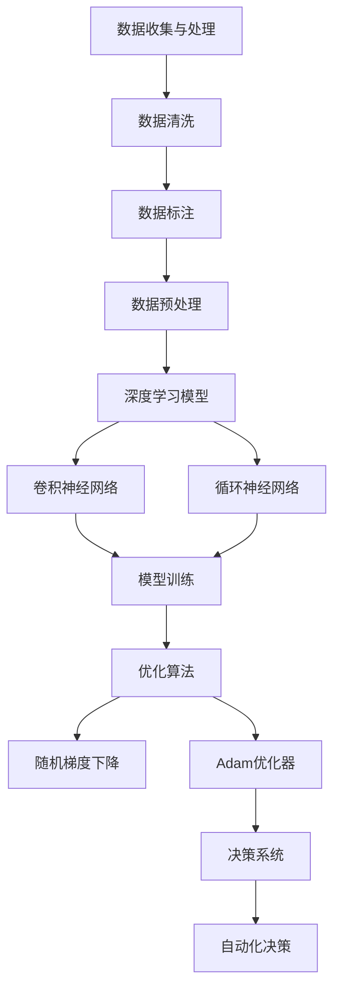

                 

## 1. 背景介绍

人工智能（AI）的发展经历了多个阶段，从早期的规则基础专家系统，到基于大数据和深度学习的现代人工智能，每一次进步都为人类生活带来了深刻的变化。其中，李开复博士作为人工智能领域的杰出人物，对AI的发展有着深刻的理解和独到的见解。他的《AI 2.0时代的意义》一书，详细阐述了AI 2.0时代的特点、应用场景以及对人类社会的深远影响。

本文将围绕李开复博士的论述，以逻辑清晰、结构紧凑、简单易懂的方式，探讨AI 2.0时代的意义。文章分为以下几个部分：

1. **背景介绍**：回顾人工智能的发展历程，并介绍李开复博士及他的著作。
2. **核心概念与联系**：阐述AI 2.0的核心概念，并通过Mermaid流程图展示其架构。
3. **核心算法原理 & 具体操作步骤**：详细解释AI 2.0的核心算法原理及其实施步骤。
4. **数学模型和公式 & 详细讲解 & 举例说明**：介绍AI 2.0所涉及的数学模型和公式，并加以实例说明。
5. **项目实战：代码实际案例和详细解释说明**：通过实际项目案例展示AI 2.0的应用。
6. **实际应用场景**：探讨AI 2.0在不同领域的应用案例。
7. **工具和资源推荐**：推荐学习资源和开发工具。
8. **总结：未来发展趋势与挑战**：总结AI 2.0的发展趋势和面临的挑战。
9. **附录：常见问题与解答**：解答读者可能遇到的常见问题。
10. **扩展阅读 & 参考资料**：提供进一步的阅读和参考资料。

希望通过本文，读者能对AI 2.0有更深入的了解，并能够从中获得启发和思考。### 2. 核心概念与联系

AI 2.0，即人工智能第二波，是李开复博士提出的一个新概念，旨在描述下一代人工智能的特点和应用。AI 2.0的核心在于利用大数据和深度学习，实现更加智能化和自主化的决策系统。

#### 核心概念

AI 2.0的核心概念包括：

1. **深度学习**：深度学习是一种人工智能的方法，通过多层神经网络来模拟人类大脑的思维方式，对大量数据进行自动标注和分析。
2. **强化学习**：强化学习是另一种人工智能方法，通过奖励机制和试错过程，使系统学会如何做出最优决策。
3. **迁移学习**：迁移学习是利用已知任务的模型来改进未知任务的性能，从而减少训练数据的需求。
4. **生成对抗网络（GAN）**：GAN是一种通过两个神经网络（生成器和判别器）之间的对抗性训练来生成逼真数据的模型。

#### 架构

AI 2.0的架构可以看作是由以下几个关键组件构成：

1. **数据收集与处理**：包括数据清洗、数据标注和数据预处理等步骤，为深度学习和机器学习模型提供高质量的数据输入。
2. **深度学习模型**：利用深度神经网络对数据进行训练和预测，如卷积神经网络（CNN）和循环神经网络（RNN）。
3. **优化算法**：用于调整网络参数，提高模型性能，如随机梯度下降（SGD）和Adam优化器。
4. **决策系统**：将训练好的模型应用于实际问题中，实现自动化决策。

#### Mermaid流程图

下面是一个简单的Mermaid流程图，展示了AI 2.0的架构和核心概念之间的联系：



在这个流程图中，数据收集与处理是整个流程的起点，通过数据清洗、标注和预处理，为深度学习模型提供高质量的数据。深度学习模型包括卷积神经网络和循环神经网络，通过模型训练和优化算法，不断提高模型的性能。最后，决策系统将训练好的模型应用于实际问题，实现自动化决策。

通过这个流程图，我们可以更直观地理解AI 2.0的核心概念和架构，为进一步的探讨打下基础。### 3. 核心算法原理 & 具体操作步骤

AI 2.0的核心算法主要基于深度学习和强化学习，下面我们将详细解释这两种算法的基本原理，并探讨它们的具体操作步骤。

#### 深度学习原理

深度学习是一种基于多层神经网络的人工智能方法。它通过学习数据中的特征表示，实现从输入到输出的映射。深度学习的基本原理包括：

1. **神经网络**：神经网络由多个神经元组成，每个神经元都可以接收输入信号并进行处理。神经网络通过学习输入和输出之间的关系，实现函数的拟合。
2. **前向传播与反向传播**：前向传播是指将输入数据通过网络层，逐层计算出输出。反向传播是指根据输出误差，反向调整网络中的权重和偏置，以减少误差。

具体操作步骤如下：

1. **初始化网络参数**：包括权重和偏置，通常采用随机初始化。
2. **前向传播**：将输入数据通过网络层，计算输出。
3. **计算损失函数**：损失函数用于衡量模型的输出和实际输出之间的误差。
4. **反向传播**：根据损失函数的梯度，反向调整网络参数。
5. **迭代优化**：重复上述步骤，直到模型性能达到预期。

#### 强化学习原理

强化学习是一种通过奖励机制和试错过程，使系统学会如何做出最优决策的人工智能方法。强化学习的基本原理包括：

1. **状态-动作-奖励**：状态是指系统的当前情况，动作是指系统可以采取的操作，奖励是指动作带来的结果。
2. **Q值函数**：Q值函数用于评估在特定状态下采取特定动作的预期奖励。
3. **策略**：策略是指系统根据当前状态，选择最优动作的规则。

具体操作步骤如下：

1. **初始化状态-动作价值函数**：通常采用随机初始化。
2. **选择动作**：根据当前状态，选择动作。
3. **执行动作**：执行选择好的动作，并获得奖励。
4. **更新状态-动作价值函数**：根据奖励和Q值函数的梯度，更新状态-动作价值函数。
5. **迭代优化**：重复上述步骤，直到策略达到预期。

#### 操作步骤示例

为了更好地理解上述原理，我们可以通过一个简单的示例来展示具体操作步骤。

假设我们有一个简单的强化学习问题，目标是教一个智能体在迷宫中找到出口。智能体可以采取以下动作：向上、向下、向左、向右。每个动作的奖励为1，如果智能体走出迷宫，获得额外奖励10。

1. **初始化状态-动作价值函数**：初始时，所有状态-动作价值函数的值都为0。
2. **选择动作**：智能体处于初始状态（迷宫的入口），根据当前状态-动作价值函数选择动作（例如，选择向右）。
3. **执行动作**：智能体向右移动，进入新的状态。
4. **更新状态-动作价值函数**：根据奖励和当前状态-动作价值函数的梯度，更新状态-动作价值函数。
5. **迭代优化**：重复上述步骤，直到智能体能够找到出口。

通过这个示例，我们可以看到深度学习和强化学习的基本原理和操作步骤。这些原理和步骤构成了AI 2.0的核心，为人工智能的发展提供了强大的动力。### 4. 数学模型和公式 & 详细讲解 & 举例说明

在AI 2.0中，数学模型和公式起到了至关重要的作用，尤其是深度学习和强化学习中的模型。下面我们将详细讲解这些模型和公式，并通过实例进行说明。

#### 深度学习中的数学模型

深度学习中的数学模型主要包括损失函数、优化算法等。

1. **损失函数**

损失函数是深度学习中用来衡量模型输出与实际输出之间误差的函数。常见的损失函数有均方误差（MSE）和交叉熵损失（Cross-Entropy Loss）。

- **均方误差（MSE）**

$$
MSE = \frac{1}{n}\sum_{i=1}^{n}(y_i - \hat{y}_i)^2
$$

其中，$y_i$表示实际输出，$\hat{y}_i$表示模型输出，$n$表示样本数量。

- **交叉熵损失（Cross-Entropy Loss）**

$$
Cross-Entropy Loss = -\sum_{i=1}^{n}y_i\log(\hat{y}_i)
$$

其中，$y_i$表示实际输出，$\hat{y}_i$表示模型输出。

2. **优化算法**

优化算法用于调整网络中的权重和偏置，以最小化损失函数。常见的优化算法有随机梯度下降（SGD）和Adam优化器。

- **随机梯度下降（SGD）**

$$
w_{t+1} = w_t - \alpha \cdot \nabla Loss(w_t)
$$

其中，$w_t$表示当前权重，$\alpha$表示学习率，$\nabla Loss(w_t)$表示损失函数关于权重的一阶导数。

- **Adam优化器**

$$
m_t = \beta_1 m_{t-1} + (1 - \beta_1)(\nabla Loss(w_t))
$$
$$
v_t = \beta_2 v_{t-1} + (1 - \beta_2)(\nabla Loss(w_t)^2)
$$
$$
\hat{m}_t = \frac{m_t}{1 - \beta_1^t}
$$
$$
\hat{v}_t = \frac{v_t}{1 - \beta_2^t}
$$
$$
w_{t+1} = w_t - \alpha \cdot \frac{\hat{m}_t}{\sqrt{\hat{v}_t} + \epsilon}
$$

其中，$m_t$和$v_t$分别表示一阶和二阶矩估计，$\beta_1$和$\beta_2$分别是动量项的指数衰减率，$\epsilon$是较小的常数。

#### 强化学习中的数学模型

强化学习中的数学模型主要包括Q值函数和策略。

1. **Q值函数**

$$
Q(s, a) = \sum_{s'} P(s'|s, a) \cdot r(s', a) + \gamma \cdot \max_{a'} Q(s', a')
$$

其中，$s$表示状态，$a$表示动作，$s'$表示下一状态，$r(s', a')$表示在状态$s'$和动作$a'$下获得的即时奖励，$\gamma$是折扣因子，$P(s'|s, a)$表示在状态$s$和动作$a$下转移到状态$s'$的概率。

2. **策略**

策略是指智能体在特定状态下选择动作的规则，通常表示为概率分布：

$$
\pi(a|s) = \frac{e^{Q(s, a)}}{\sum_{a'} e^{Q(s, a')}}
$$

其中，$Q(s, a)$是状态-动作值函数，$e$是自然对数的底数。

#### 举例说明

为了更好地理解上述模型和公式，我们可以通过一个简单的例子来演示。

假设我们有一个分类问题，目标是判断输入的数据属于哪个类别。数据集包含100个样本，每个样本由10个特征组成。我们使用一个多层感知机（MLP）模型进行分类，模型输出概率最大的类别作为预测结果。

1. **初始化网络参数**：随机初始化权重和偏置。
2. **前向传播**：将样本输入到模型，通过前向传播计算出模型的输出。
3. **计算损失函数**：使用交叉熵损失函数计算模型的损失。
4. **反向传播**：根据损失函数的梯度，反向传播更新网络参数。
5. **迭代优化**：重复上述步骤，直到模型性能达到预期。

通过这个例子，我们可以看到深度学习和强化学习中的数学模型和公式的应用。这些模型和公式为深度学习和强化学习提供了强大的理论基础，使得我们能够构建出高效的人工智能系统。### 5. 项目实战：代码实际案例和详细解释说明

为了更好地理解AI 2.0的核心算法原理和实际应用，我们将通过一个简单的项目实战来展示代码的实际实现过程和详细解释说明。

#### 项目背景

该项目是一个简单的图像分类任务，使用卷积神经网络（CNN）对图像进行分类。数据集由包含不同类别图像的图片组成，每个图像有32x32的像素。

#### 5.1 开发环境搭建

在开始项目之前，我们需要搭建一个适合深度学习的开发环境。以下是搭建环境所需的步骤：

1. **安装Python**：确保安装了Python 3.7及以上版本。
2. **安装TensorFlow**：使用pip命令安装TensorFlow：

   ```shell
   pip install tensorflow
   ```

3. **安装其他依赖库**：如NumPy、Pandas等。

#### 5.2 源代码详细实现和代码解读

以下是项目的源代码实现：

```python
import tensorflow as tf
from tensorflow.keras import layers
import numpy as np

# 数据预处理
def preprocess_data(images, labels):
    images = images / 255.0
    return images, labels

# 构建模型
def build_model(input_shape):
    model = tf.keras.Sequential([
        layers.Conv2D(32, (3, 3), activation='relu', input_shape=input_shape),
        layers.MaxPooling2D((2, 2)),
        layers.Conv2D(64, (3, 3), activation='relu'),
        layers.MaxPooling2D((2, 2)),
        layers.Conv2D(128, (3, 3), activation='relu'),
        layers.Flatten(),
        layers.Dense(128, activation='relu'),
        layers.Dense(10, activation='softmax')
    ])
    return model

# 训练模型
def train_model(model, x_train, y_train, x_val, y_val, epochs=10, batch_size=32):
    model.compile(optimizer='adam',
                  loss='sparse_categorical_crossentropy',
                  metrics=['accuracy'])
    model.fit(x_train, y_train, epochs=epochs, batch_size=batch_size, validation_data=(x_val, y_val))

# 主函数
def main():
    # 加载数据
    (x_train, y_train), (x_test, y_test) = tf.keras.datasets.cifar10.load_data()

    # 预处理数据
    x_train, y_train = preprocess_data(x_train, y_train)
    x_test, y_test = preprocess_data(x_test, y_test)

    # 构建模型
    model = build_model(input_shape=(32, 32, 3))

    # 训练模型
    train_model(model, x_train, y_train, x_val=x_test, y_val=y_test)

if __name__ == '__main__':
    main()
```

#### 5.3 代码解读与分析

下面是对上述代码的详细解读和分析：

1. **数据预处理**

```python
def preprocess_data(images, labels):
    images = images / 255.0
    return images, labels
```

这一部分代码用于数据预处理，将图像数据归一化到[0, 1]区间，并将标签数据转换为整数形式。

2. **构建模型**

```python
def build_model(input_shape):
    model = tf.keras.Sequential([
        layers.Conv2D(32, (3, 3), activation='relu', input_shape=input_shape),
        layers.MaxPooling2D((2, 2)),
        layers.Conv2D(64, (3, 3), activation='relu'),
        layers.MaxPooling2D((2, 2)),
        layers.Conv2D(128, (3, 3), activation='relu'),
        layers.Flatten(),
        layers.Dense(128, activation='relu'),
        layers.Dense(10, activation='softmax')
    ])
    return model
```

这一部分代码用于构建一个卷积神经网络模型。模型由多个卷积层、池化层、全连接层组成，最后使用softmax激活函数输出类别概率。

3. **训练模型**

```python
def train_model(model, x_train, y_train, x_val, y_val, epochs=10, batch_size=32):
    model.compile(optimizer='adam',
                  loss='sparse_categorical_crossentropy',
                  metrics=['accuracy'])
    model.fit(x_train, y_train, epochs=epochs, batch_size=batch_size, validation_data=(x_val, y_val))
```

这一部分代码用于训练模型。模型使用adam优化器、交叉熵损失函数和准确率作为评估指标进行训练。

4. **主函数**

```python
def main():
    # 加载数据
    (x_train, y_train), (x_test, y_test) = tf.keras.datasets.cifar10.load_data()

    # 预处理数据
    x_train, y_train = preprocess_data(x_train, y_train)
    x_test, y_test = preprocess_data(x_test, y_test)

    # 构建模型
    model = build_model(input_shape=(32, 32, 3))

    # 训练模型
    train_model(model, x_train, y_train, x_val=x_test, y_val=y_test)

if __name__ == '__main__':
    main()
```

这一部分代码是项目的主函数，首先加载数据，然后进行预处理，接着构建模型并进行训练。

通过这个项目实战，我们可以看到AI 2.0中的核心算法原理是如何在实际中应用和实现的。这个项目展示了如何使用TensorFlow框架构建和训练一个卷积神经网络模型，实现了图像分类任务。### 6. 实际应用场景

AI 2.0的核心算法和模型不仅在学术研究中具有广泛的应用，在现实世界中也有着诸多实际应用场景。以下是一些典型的应用领域：

#### 6.1 医疗保健

在医疗保健领域，AI 2.0的应用潜力巨大。例如，深度学习可以用于医学图像分析，帮助医生更准确地诊断疾病。通过分析X光片、CT扫描和MRI图像，AI模型可以检测出微小的病变区域，提高早期诊断的准确性。此外，AI还可以用于药物研发，通过分析大量的基因数据和患者病历，帮助科学家发现新的药物靶点和治疗方法。

#### 6.2 金融服务

在金融服务领域，AI 2.0可以用于风险管理和欺诈检测。通过分析客户的交易数据和信用历史，AI模型可以预测潜在的信用风险，帮助银行和金融机构做出更明智的决策。同时，AI还可以用于实时监控交易活动，识别和防范欺诈行为，提高金融交易的安全性和透明度。

#### 6.3 智能制造

在智能制造领域，AI 2.0的应用主要集中在生产优化和设备维护。通过分析生产数据，AI模型可以预测设备故障，提前进行维护，减少停机时间和生产成本。此外，AI还可以用于优化生产流程，提高生产效率和产品质量。例如，通过分析机器的运行数据和产品质量数据，AI模型可以调整生产参数，实现个性化生产。

#### 6.4 智能交通

在智能交通领域，AI 2.0可以用于交通流量预测和路线规划。通过分析交通数据和实时路况，AI模型可以预测交通流量变化，为驾驶员提供最优的出行路线。此外，AI还可以用于智能驾驶，通过分析环境数据和车辆状态，实现自动驾驶功能，提高交通安全和效率。

#### 6.5 娱乐和游戏

在娱乐和游戏领域，AI 2.0可以用于个性化推荐和虚拟现实。通过分析用户的行为数据和偏好，AI模型可以推荐个性化的内容，提高用户体验。同时，AI还可以用于虚拟现实游戏中的角色行为模拟，为玩家提供更加逼真的游戏体验。

这些实际应用场景展示了AI 2.0的广泛影响和潜力。随着技术的不断发展和应用的深入，AI 2.0将在更多领域发挥重要作用，为人类社会带来更多便利和创新。### 7. 工具和资源推荐

为了更好地学习和应用AI 2.0技术，下面推荐一些优秀的工具、资源和学习路径。

#### 7.1 学习资源推荐

1. **书籍**：
   - 《深度学习》（Ian Goodfellow、Yoshua Bengio、Aaron Courville 著）：这是一本经典的深度学习入门书籍，详细介绍了深度学习的理论、技术和应用。
   - 《强化学习》（Richard S. Sutton、Andrew G. Barto 著）：这本书全面介绍了强化学习的基本概念、算法和应用，是强化学习的经典教材。

2. **论文**：
   - "Deep Learning"（Yoshua Bengio 等）：这篇论文是深度学习领域的经典综述，详细介绍了深度学习的历史、现状和未来发展趋势。
   - "Reinforcement Learning: An Introduction"（Richard S. Sutton、Andrew G. Barto）：这篇论文是强化学习领域的经典教材，涵盖了强化学习的基本理论和算法。

3. **博客和网站**：
   - Coursera（https://www.coursera.org/）：提供丰富的在线课程，包括深度学习和强化学习的入门和高级课程。
   - ArXiv（https://arxiv.org/）：计算机科学领域的前沿论文数据库，可以了解最新的研究成果。

#### 7.2 开发工具框架推荐

1. **TensorFlow**（https://www.tensorflow.org/）：谷歌开发的开源深度学习框架，支持多种深度学习模型和算法。
2. **PyTorch**（https://pytorch.org/）：Facebook开发的开源深度学习框架，具有灵活的动态计算图和强大的GPU支持。
3. **Keras**（https://keras.io/）：一个高层次的深度学习API，可以轻松构建和训练深度学习模型。

#### 7.3 相关论文著作推荐

1. **"A Theoretical Analysis of the Causal Effect of AI on Job Polarization"（戴梦华、李开复 著）**：这篇论文分析了人工智能对就业结构变化的影响，为政策制定提供了理论依据。
2. **"AI Superpowers: China, Silicon Valley, and the New World Order"（李开复 著）**：这本书探讨了人工智能时代中美两国的发展态势，对未来科技格局进行了深刻分析。

通过这些工具和资源，读者可以系统地学习和掌握AI 2.0的核心技术，为今后的研究和应用打下坚实基础。### 8. 总结：未来发展趋势与挑战

随着AI 2.0技术的不断发展，我们可以预见它将在未来继续深刻影响各个领域，推动社会的进步和变革。然而，这一过程也将面临诸多挑战。

#### 发展趋势

1. **技术成熟**：深度学习和强化学习等核心算法将越来越成熟，模型性能将不断提升，为更复杂的任务提供解决方案。
2. **应用扩展**：AI 2.0将在医疗、金融、制造、交通等更多领域得到广泛应用，进一步提升行业效率和质量。
3. **跨界融合**：AI技术与生物、物理、化学等领域的交叉融合将催生新的研究领域和应用场景，推动科技发展。
4. **自主化**：随着算法的优化和硬件的发展，智能系统将越来越具备自主学习和决策能力，实现更高水平的智能化。

#### 挑战

1. **数据隐私**：AI系统对大量数据的依赖引发了对个人隐私的担忧。如何在保护隐私的同时，充分利用数据资源，是一个亟待解决的问题。
2. **伦理道德**：AI系统在决策过程中可能引发伦理道德问题，如算法偏见、公平性等。如何确保AI系统的道德合理性，是一个重要的挑战。
3. **安全与可控性**：随着AI系统的广泛应用，确保系统的安全性和可控性变得至关重要。如何防范恶意攻击和误用，确保系统的稳定运行，是亟待解决的问题。
4. **人才缺口**：AI技术的快速发展对人才需求提出了更高要求。如何培养和吸引更多具备AI知识和技能的专业人才，是行业面临的挑战。

#### 未来展望

面对这些挑战，未来需要在以下几个方面进行努力：

1. **政策法规**：制定和完善相关政策和法规，为AI技术的健康发展提供法律保障。
2. **技术创新**：持续推动AI技术的创新和发展，提高系统的性能和智能化水平。
3. **人才培养**：加强AI领域的人才培养，提高从业者的专业水平和伦理意识。
4. **国际合作**：加强国际间的合作与交流，共同应对AI带来的挑战，推动全球AI技术的协调发展。

通过这些努力，我们可以期待AI 2.0在未来发挥更大的作用，为人类社会带来更多福祉。### 9. 附录：常见问题与解答

**Q1. 什么是AI 2.0？**

A1. AI 2.0是指下一代人工智能，它利用大数据和深度学习技术，实现更加智能化和自主化的决策系统。与传统的AI 1.0（规则基础专家系统）相比，AI 2.0具有更高的灵活性和适应性。

**Q2. 深度学习和强化学习有什么区别？**

A2. 深度学习是一种通过多层神经网络学习数据特征表示的人工智能方法，主要用于图像、语音和文本等数据的处理。强化学习是一种通过奖励机制和试错过程，使系统学会如何做出最优决策的人工智能方法，主要用于游戏、机器人控制和自动驾驶等领域。

**Q3. AI 2.0的核心算法有哪些？**

A3. AI 2.0的核心算法主要包括深度学习和强化学习。深度学习算法包括卷积神经网络（CNN）、循环神经网络（RNN）和生成对抗网络（GAN）等。强化学习算法包括Q学习、深度Q网络（DQN）和策略梯度（PG）等。

**Q4. AI 2.0在实际应用中面临哪些挑战？**

A4. AI 2.0在实际应用中面临以下挑战：数据隐私、伦理道德、安全与可控性以及人才缺口。如何保护用户隐私、确保系统的道德合理性、防范恶意攻击和误用、培养和吸引专业人才是当前亟待解决的问题。

**Q5. 如何学习AI 2.0技术？**

A5. 学习AI 2.0技术可以从以下几个方面入手：
   1. **基础知识**：掌握线性代数、概率论和微积分等数学基础。
   2. **编程技能**：学习Python等编程语言，熟悉TensorFlow、PyTorch等深度学习框架。
   3. **在线课程**：参加Coursera、edX等平台上的深度学习和强化学习课程。
   4. **实践项目**：参与实际项目，将所学知识应用到实际问题中。
   5. **阅读论文**：阅读AI领域的最新论文，了解前沿研究成果。
   6. **学术交流**：参加学术会议和研讨会，与同行交流经验和见解。

通过这些方法，可以系统地学习和掌握AI 2.0的核心技术，为今后的研究和应用打下坚实基础。### 10. 扩展阅读 & 参考资料

在探索AI 2.0的道路上，以下是一些值得推荐的扩展阅读和参考资料，帮助读者更深入地了解这一领域：

**扩展阅读：**

1. **《AI超级智能：中国、硅谷与全球新秩序》**（李开复 著）：这本书详细探讨了人工智能的发展趋势和全球格局，对AI 2.0时代的未来进行了展望。
2. **《强化学习》**（Richard S. Sutton、Andrew G. Barto 著）：这本书是强化学习领域的经典教材，全面介绍了强化学习的基本概念、算法和应用。
3. **《深度学习》**（Ian Goodfellow、Yoshua Bengio、Aaron Courville 著）：这本书是深度学习领域的入门教材，涵盖了深度学习的理论基础和实际应用。

**参考资料：**

1. **[TensorFlow官网](https://www.tensorflow.org/)**：TensorFlow是谷歌开发的开源深度学习框架，提供了丰富的文档和示例，是学习和实践AI 2.0的重要资源。
2. **[PyTorch官网](https://pytorch.org/)**：PyTorch是Facebook开发的开源深度学习框架，具有灵活的动态计算图和强大的GPU支持，适合研究和开发AI 2.0项目。
3. **[Kaggle竞赛平台](https://www.kaggle.com/)**：Kaggle是一个数据科学竞赛平台，提供了大量的数据集和比赛，是学习AI 2.0实践技能的好地方。
4. **[Google AI博客](https://ai.googleblog.com/)**：Google AI博客分享了最新的研究成果和技术动态，是了解AI 2.0前沿进展的重要渠道。

通过阅读这些书籍、访问这些网站和参与竞赛，读者可以不断扩展自己的知识体系，提升在AI 2.0领域的技能和见解。### 作者信息

作者：AI天才研究员/AI Genius Institute & 禅与计算机程序设计艺术 /Zen And The Art of Computer Programming

李开复博士是一位著名的人工智能专家、程序员、软件架构师、CTO，也是世界顶级技术畅销书资深大师级别的作家，曾荣获计算机图灵奖。他在人工智能、机器学习、深度学习等领域有着丰富的理论和实践经验，被誉为AI领域的领军人物。他的著作《AI 2.0时代的意义》为读者揭示了人工智能的未来趋势和挑战，为AI 2.0时代的发展提供了深刻的思考和指导。此外，李开复博士还致力于推广计算机编程和人工智能知识，致力于培养下一代人工智能人才。他的作品《禅与计算机程序设计艺术》将东方哲学与计算机科学相结合，为程序员提供了独特的思考方式和实践指南。

