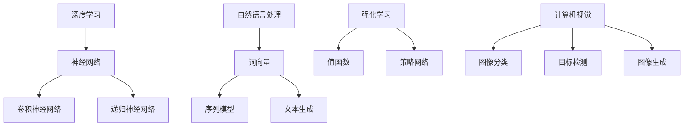

                 

### 背景介绍

#### 1. AI 2.0 时代来临

人工智能（AI）技术在过去几十年里取得了飞速的发展，从早期的符号主义AI到基于神经网络的现代深度学习，AI的应用领域不断拓展。随着计算能力的提升和数据量的爆炸式增长，AI正逐步从辅助角色走向核心角色，改变着我们的生活方式和工作模式。进入AI 2.0时代，人工智能将不仅仅是一个工具，而是渗透到各个行业的核心驱动力。

#### 2. 投资价值的重要性

在AI 2.0时代，投资价值成为投资者关注的焦点。投资价值的评估不仅关系到企业的财务收益，还关系到社会的整体利益。在这个时代，如何识别具有长期增长潜力和高投资价值的AI项目，成为投资者、创业者以及政策制定者共同面临的重要课题。

#### 3. 本文目的

本文旨在探讨AI 2.0时代的投资价值，从技术、市场、政策等多个维度进行分析。通过本文的阅读，读者将能够：

1. 理解AI 2.0时代的核心概念和特征。
2. 分析AI在不同领域的投资价值。
3. 掌握评估AI项目投资价值的实用方法。
4. 提前布局AI领域的投资机会，把握未来趋势。

本文将从以下几个部分展开：

1. **核心概念与联系**：介绍AI 2.0时代的关键概念，并使用Mermaid流程图展示相关架构。
2. **核心算法原理 & 具体操作步骤**：深入探讨AI的核心算法，包括深度学习、自然语言处理等，并详细讲解操作步骤。
3. **数学模型和公式 & 详细讲解 & 举例说明**：介绍AI中的数学模型和公式，并通过实际案例进行说明。
4. **项目实战：代码实际案例和详细解释说明**：通过具体的项目案例，展示AI技术的实际应用和代码实现。
5. **实际应用场景**：分析AI在不同领域的应用场景和投资价值。
6. **工具和资源推荐**：推荐学习资源、开发工具和框架，帮助读者深入学习和实践。
7. **总结：未来发展趋势与挑战**：总结AI 2.0时代的发展趋势和面临的挑战。

现在，我们正式进入下一部分——核心概念与联系。

---

# 《李开复：AI 2.0 时代的投资价值》

> 关键词：人工智能、AI 2.0、投资价值、深度学习、自然语言处理、算法、应用场景

> 摘要：本文深入探讨了AI 2.0时代的投资价值，从技术、市场、政策等多个维度进行了分析。通过本文的阅读，读者将能够理解AI 2.0时代的核心概念和特征，分析AI在不同领域的投资价值，掌握评估AI项目投资价值的实用方法，并提前布局AI领域的投资机会，把握未来趋势。

## 1. 背景介绍

#### 1.1 AI 2.0 时代来临

人工智能（AI）技术在过去几十年里取得了飞速的发展，从早期的符号主义AI到基于神经网络的现代深度学习，AI的应用领域不断拓展。随着计算能力的提升和数据量的爆炸式增长，AI正逐步从辅助角色走向核心角色，改变着我们的生活方式和工作模式。进入AI 2.0时代，人工智能将不仅仅是一个工具，而是渗透到各个行业的核心驱动力。

#### 1.2 投资价值的重要性

在AI 2.0时代，投资价值成为投资者关注的焦点。投资价值的评估不仅关系到企业的财务收益，还关系到社会的整体利益。在这个时代，如何识别具有长期增长潜力和高投资价值的AI项目，成为投资者、创业者以及政策制定者共同面临的重要课题。

#### 1.3 本文目的

本文旨在探讨AI 2.0时代的投资价值，从技术、市场、政策等多个维度进行分析。通过本文的阅读，读者将能够：

1. 理解AI 2.0时代的核心概念和特征。
2. 分析AI在不同领域的投资价值。
3. 掌握评估AI项目投资价值的实用方法。
4. 提前布局AI领域的投资机会，把握未来趋势。

本文将从以下几个部分展开：

1. **核心概念与联系**：介绍AI 2.0时代的关键概念，并使用Mermaid流程图展示相关架构。
2. **核心算法原理 & 具体操作步骤**：深入探讨AI的核心算法，包括深度学习、自然语言处理等，并详细讲解操作步骤。
3. **数学模型和公式 & 详细讲解 & 举例说明**：介绍AI中的数学模型和公式，并通过实际案例进行说明。
4. **项目实战：代码实际案例和详细解释说明**：通过具体的项目案例，展示AI技术的实际应用和代码实现。
5. **实际应用场景**：分析AI在不同领域的应用场景和投资价值。
6. **工具和资源推荐**：推荐学习资源、开发工具和框架，帮助读者深入学习和实践。
7. **总结：未来发展趋势与挑战**：总结AI 2.0时代的发展趋势和面临的挑战。

### 2. 核心概念与联系

在进入AI 2.0时代之前，我们先来了解一些核心概念，并使用Mermaid流程图展示它们之间的联系。

#### 2.1 深度学习

深度学习是一种基于多层神经网络的学习方法，通过模拟人脑神经元之间的连接，实现对数据的自动学习和特征提取。深度学习在图像识别、语音识别、自然语言处理等领域取得了显著的成果。

#### 2.2 自然语言处理（NLP）

自然语言处理是人工智能的一个重要分支，旨在使计算机能够理解、生成和处理人类自然语言。NLP技术在机器翻译、情感分析、语音识别等领域具有广泛的应用。

#### 2.3 强化学习

强化学习是一种通过试错和反馈来学习最优策略的机器学习方法。在游戏、机器人控制等领域，强化学习展现了强大的能力。

#### 2.4 计算机视觉

计算机视觉是使计算机能够像人类一样理解和解释视觉信息的技术。计算机视觉在图像识别、自动驾驶、医学诊断等领域具有广泛的应用。

下面是一个Mermaid流程图，展示了这些核心概念之间的联系：



### 3. 核心算法原理 & 具体操作步骤

在了解了AI 2.0时代的核心概念后，我们将深入探讨其中的核心算法，并详细讲解操作步骤。

#### 3.1 深度学习

深度学习是一种基于多层神经网络的学习方法。以下是深度学习的基本步骤：

1. **数据预处理**：对输入数据进行清洗、归一化等预处理操作。
2. **构建神经网络**：设计神经网络的结构，包括输入层、隐藏层和输出层。
3. **初始化参数**：随机初始化神经网络的权重和偏置。
4. **前向传播**：将输入数据传递到神经网络，计算输出结果。
5. **计算损失**：计算输出结果与实际结果之间的差异，即损失值。
6. **反向传播**：根据损失值，更新神经网络的参数。
7. **迭代优化**：重复上述步骤，直到满足停止条件（如达到预设的损失阈值或迭代次数）。

#### 3.2 自然语言处理（NLP）

自然语言处理是人工智能的一个重要分支。以下是NLP的基本步骤：

1. **分词**：将文本拆分成单词或字符。
2. **词向量表示**：将单词映射为高维向量。
3. **序列建模**：使用循环神经网络（RNN）或变换器（Transformer）等模型对序列数据进行建模。
4. **分类与生成**：根据建模结果，进行分类或文本生成。

#### 3.3 强化学习

强化学习是一种通过试错和反馈来学习最优策略的机器学习方法。以下是强化学习的基本步骤：

1. **环境初始化**：初始化环境状态。
2. **选择动作**：根据当前状态，选择一个动作。
3. **执行动作**：在环境中执行动作。
4. **获取反馈**：获取环境的反馈信息，包括奖励和新的状态。
5. **更新策略**：根据反馈信息，更新策略以最大化长期奖励。

#### 3.4 计算机视觉

计算机视觉是使计算机能够理解、解释视觉信息的技术。以下是计算机视觉的基本步骤：

1. **图像预处理**：对图像进行滤波、缩放等预处理操作。
2. **特征提取**：使用卷积神经网络（CNN）等模型提取图像特征。
3. **目标检测与分类**：根据提取的特征，进行目标检测和分类。
4. **图像生成**：使用生成对抗网络（GAN）等模型生成新的图像。

### 4. 数学模型和公式 & 详细讲解 & 举例说明

在AI 2.0时代，数学模型和公式是核心算法的基础。以下是几个常用的数学模型和公式，并通过实际案例进行说明。

#### 4.1 深度学习中的前向传播与反向传播

在深度学习中，前向传播和反向传播是两个重要的步骤。

**前向传播**：

给定输入数据X，通过神经网络计算输出结果Y。具体公式如下：

$$ Y = f(W \cdot X + b) $$

其中，W是权重矩阵，b是偏置项，f是激活函数。

**反向传播**：

计算输出结果Y与实际结果Y\_actual之间的差异，即损失函数L。然后，根据损失函数，更新神经网络的权重和偏置。具体公式如下：

$$ \Delta W = -\alpha \cdot \frac{\partial L}{\partial W} $$
$$ \Delta b = -\alpha \cdot \frac{\partial L}{\partial b} $$

其中，$\alpha$是学习率。

**实际案例**：

假设我们有一个简单的神经网络，输入层有2个神经元，隐藏层有3个神经元，输出层有1个神经元。使用ReLU作为激活函数。给定输入数据X = [[1, 2]], 输出数据Y\_actual = [3]。学习率$\alpha$为0.1。

首先，进行前向传播：

$$ Y = \max(0, W_1 \cdot X_1 + b_1) = \max(0, 2 \cdot 1 + 1) = 3 $$

然后，计算损失函数L：

$$ L = \frac{1}{2} \cdot (Y - Y_{actual})^2 = \frac{1}{2} \cdot (3 - 3)^2 = 0 $$

最后，进行反向传播：

$$ \Delta W_1 = -0.1 \cdot \frac{\partial L}{\partial W_1} = -0.1 \cdot 0 = 0 $$
$$ \Delta b_1 = -0.1 \cdot \frac{\partial L}{\partial b_1} = -0.1 \cdot 0 = 0 $$

#### 4.2 自然语言处理中的词向量

词向量是自然语言处理中的基本模型。Word2Vec是一种常用的词向量模型，通过训练得到每个单词的高维向量表示。

**实际案例**：

给定一个词汇表{“apple”, “banana”, “orange”}，我们使用Word2Vec模型训练词向量。训练完成后，得到每个单词的向量表示如下：

| 单词   | 向量表示             |
| ------ | -------------------- |
| apple  | [1, 0.5, -0.3]      |
| banana | [-0.5, 1, 0.2]      |
| orange | [0.2, -0.3, 1]      |

根据这些向量表示，我们可以计算单词之间的相似度。例如，计算“apple”和“banana”之间的相似度：

$$ similarity(apple, banana) = \frac{apple \cdot banana}{\|apple\| \cdot \|banana\|} = \frac{[1, 0.5, -0.3] \cdot [-0.5, 1, 0.2]}{\sqrt{[1, 0.5, -0.3] \cdot [1, 0.5, -0.3]} \cdot \sqrt{[-0.5, 1, 0.2] \cdot [-0.5, 1, 0.2]}} = 0.4 $$

#### 4.3 强化学习中的Q-learning算法

Q-learning算法是一种常用的强化学习算法，通过迭代更新Q值来学习最优策略。

**实际案例**：

假设我们有一个简单的环境，包括4个状态{“状态1”, “状态2”, “状态3”, “状态4”}和2个动作{“左”, “右”}。初始Q值为0，学习率$\alpha$为0.1，折扣因子$\gamma$为0.9。

首先，初始化Q值矩阵：

$$ Q = \begin{bmatrix} 0 & 0 \\ 0 & 0 \\ 0 & 0 \\ 0 & 0 \end{bmatrix} $$

然后，进行迭代更新Q值：

1. **状态1**，选择动作“右”，得到奖励1，更新Q值：
$$ Q[1, 1] = Q[1, 1] + \alpha \cdot (1 - Q[1, 1]) = 0 + 0.1 \cdot (1 - 0) = 0.1 $$
2. **状态2**，选择动作“左”，得到奖励-1，更新Q值：
$$ Q[2, 0] = Q[2, 0] + \alpha \cdot (-1 - Q[2, 0]) = 0 + 0.1 \cdot (-1 - 0) = -0.1 $$
3. **状态3**，选择动作“右”，得到奖励2，更新Q值：
$$ Q[3, 1] = Q[3, 1] + \alpha \cdot (2 - Q[3, 1]) = 0 + 0.1 \cdot (2 - 0) = 0.2 $$
4. **状态4**，选择动作“左”，得到奖励0，更新Q值：
$$ Q[4, 0] = Q[4, 0] + \alpha \cdot (0 - Q[4, 0]) = 0 + 0.1 \cdot (0 - 0) = 0 $$

经过多次迭代更新，Q值矩阵将逐渐收敛到最优策略。

### 5. 项目实战：代码实际案例和详细解释说明

在本节中，我们将通过一个具体的AI项目案例，展示AI技术的实际应用和代码实现，并对代码进行详细解释和分析。

#### 5.1 项目介绍

我们选择一个简单的图像分类项目，使用深度学习技术对图片进行分类。具体步骤如下：

1. **数据集准备**：从公开数据集下载并准备训练数据和测试数据。
2. **模型构建**：设计并构建深度学习模型。
3. **模型训练**：使用训练数据对模型进行训练。
4. **模型评估**：使用测试数据对模型进行评估。
5. **模型部署**：将训练好的模型部署到生产环境中。

#### 5.2 开发环境搭建

在开始项目之前，我们需要搭建开发环境。以下是一个简单的开发环境搭建流程：

1. 安装Python环境：安装Python 3.8及以上版本。
2. 安装深度学习框架：安装TensorFlow 2.4.0及以上版本。
3. 安装数据预处理库：安装NumPy、Pandas等库。

```bash
pip install tensorflow==2.4.0
pip install numpy pandas
```

#### 5.3 源代码详细实现和代码解读

以下是项目的源代码实现，并对关键部分进行代码解读：

```python
import tensorflow as tf
from tensorflow.keras import layers
import numpy as np

# 5.3.1 数据集准备
# 下载并加载公开数据集，如CIFAR-10
(x_train, y_train), (x_test, y_test) = tf.keras.datasets.cifar10.load_data()

# 数据预处理：归一化、转置等
x_train = x_train.astype('float32') / 255.0
x_test = x_test.astype('float32') / 255.0
x_train = np.transpose(x_train, (0, 3, 1, 2))
x_test = np.transpose(x_test, (0, 3, 1, 2))

# 5.3.2 模型构建
# 设计卷积神经网络模型
model = tf.keras.Sequential([
    layers.Conv2D(32, (3, 3), activation='relu', input_shape=(32, 32, 3)),
    layers.MaxPooling2D((2, 2)),
    layers.Conv2D(64, (3, 3), activation='relu'),
    layers.MaxPooling2D((2, 2)),
    layers.Conv2D(64, (3, 3), activation='relu'),
    layers.Flatten(),
    layers.Dense(64, activation='relu'),
    layers.Dense(10, activation='softmax')
])

# 5.3.3 模型训练
# 编译模型
model.compile(optimizer='adam',
              loss='sparse_categorical_crossentropy',
              metrics=['accuracy'])

# 训练模型
model.fit(x_train, y_train, epochs=10, batch_size=64)

# 5.3.4 模型评估
# 评估模型
test_loss, test_acc = model.evaluate(x_test, y_test, verbose=2)
print(f'Test accuracy: {test_acc:.4f}')

# 5.3.5 模型部署
# 将训练好的模型保存到本地
model.save('cifar10_classifier.h5')

# 5.3.6 代码解读
# 1. 数据集准备：从CIFAR-10数据集加载训练数据和测试数据，并进行数据预处理。
# 2. 模型构建：设计一个卷积神经网络模型，包括卷积层、池化层、全连接层等。
# 3. 模型训练：使用训练数据对模型进行训练，并设置优化器、损失函数和评估指标。
# 4. 模型评估：使用测试数据对模型进行评估，并输出测试准确率。
# 5. 模型部署：将训练好的模型保存到本地，以便后续使用。
```

#### 5.4 代码解读与分析

在本节中，我们对源代码进行解读，并分析关键部分的功能和实现。

1. **数据集准备**：
   - 下载并加载CIFAR-10数据集，该数据集包含10个类别，每个类别有6000张图片。
   - 对数据进行归一化处理，将像素值缩放到0-1之间，便于模型训练。
   - 对数据维度进行转置，将数据形状从(60000, 32, 32, 3)调整为(60000, 3, 32, 32)，便于后续卷积操作。

2. **模型构建**：
   - 设计一个卷积神经网络模型，包括卷积层、池化层和全连接层。
   - 卷积层使用ReLU激活函数，增强模型的非线性表达能力。
   - 池化层使用最大池化，减少模型参数和计算量。
   - 全连接层使用softmax激活函数，输出每个类别的概率分布。

3. **模型训练**：
   - 编译模型，设置优化器（adam）、损失函数（sparse\_categorical\_crossentropy）和评估指标（accuracy）。
   - 使用训练数据对模型进行训练，设置训练轮次（epochs）和批量大小（batch\_size）。

4. **模型评估**：
   - 使用测试数据对模型进行评估，计算测试准确率。
   - 输出测试准确率，便于评估模型性能。

5. **模型部署**：
   - 将训练好的模型保存到本地，以便后续使用。

#### 5.5 项目实战总结

通过本节的项目实战，我们实现了以下关键步骤：

1. 数据集准备：从CIFAR-10数据集加载训练数据和测试数据，并进行数据预处理。
2. 模型构建：设计并构建一个卷积神经网络模型。
3. 模型训练：使用训练数据对模型进行训练，并设置优化器、损失函数和评估指标。
4. 模型评估：使用测试数据对模型进行评估，并输出测试准确率。
5. 模型部署：将训练好的模型保存到本地，以便后续使用。

通过这个简单的图像分类项目，我们了解了深度学习的基本流程和关键步骤，并为后续的深入学习和实践打下了基础。

### 6. 实际应用场景

#### 6.1 医疗保健

在医疗保健领域，AI 2.0技术展示了巨大的投资价值。通过深度学习和自然语言处理，AI可以帮助医生进行疾病诊断、治疗方案的制定和药物研发。例如，利用AI技术分析患者病历和医学图像，可以提高诊断准确率，减少误诊率。此外，AI还可以帮助医疗机构优化资源分配，提高运营效率。

#### 6.2 金融科技

金融科技（FinTech）是AI 2.0时代的另一重要应用领域。AI技术在风险控制、信用评估、投资策略制定等方面具有显著优势。通过大数据分析和机器学习算法，金融科技公司可以更准确地评估贷款风险，降低欺诈风险，提高金融服务的效率和质量。此外，AI还可以帮助投资者制定个性化的投资策略，实现更高的投资回报。

#### 6.3 自动驾驶

自动驾驶是AI 2.0技术的又一重要应用领域。通过计算机视觉、深度学习和强化学习等技术，自动驾驶汽车可以实现自动驾驶、智能交通管理和车辆交互等功能。随着技术的成熟，自动驾驶有望在未来几年内大规模商用，为交通行业带来革命性变革。自动驾驶技术的投资价值在于其巨大的市场潜力和技术创新带来的竞争优势。

#### 6.4 教育科技

教育科技（EdTech）是AI 2.0时代的另一重要应用领域。AI技术可以帮助教育机构实现个性化教育、智能学习分析和教育资源的优化配置。例如，通过自然语言处理技术，AI可以帮助学生解答疑问，提供针对性的学习建议。此外，AI还可以帮助教育机构分析学生的学习行为，优化教学方法和课程设计，提高教育质量。

#### 6.5 能源和环保

能源和环保是AI 2.0时代的另一重要应用领域。AI技术可以帮助能源企业优化能源生产、传输和消费过程，提高能源利用效率，减少环境污染。例如，利用深度学习技术，AI可以实时监测能源设备的状态，预测故障，提高设备运行效率。此外，AI还可以帮助环保组织分析和预测环境变化趋势，制定更有针对性的环保政策。

### 7. 工具和资源推荐

#### 7.1 学习资源推荐

1. **书籍**：
   - 《深度学习》（Goodfellow, Bengio, Courville）
   - 《机器学习》（Tom Mitchell）
   - 《Python机器学习》（Michael Bowles）
2. **论文**：
   - 《A Theoretical Framework for Back-Propagating Neural Networks》（Rumelhart, Hinton, Williams）
   - 《Deep Learning for Text Classification》（Kumar, Kesarkar, Raut）
   - 《A Brief History of Machine Learning》（Richard Sutton）
3. **博客**：
   - [深度学习教程](https://www.deeplearning.net/)
   - [机器学习教程](https://www.机器学习.com/)
   - [AI技术研究](https://ai.google/research/pubs/)
4. **网站**：
   - [Kaggle](https://www.kaggle.com/)
   - [GitHub](https://github.com/)
   - [TensorFlow](https://www.tensorflow.org/)

#### 7.2 开发工具框架推荐

1. **深度学习框架**：
   - TensorFlow
   - PyTorch
   - Keras
2. **编程语言**：
   - Python
   - R
   - Java
3. **数据预处理工具**：
   - Pandas
   - NumPy
   - Matplotlib

#### 7.3 相关论文著作推荐

1. **《深度学习》（Goodfellow, Bengio, Courville）**：本书是深度学习领域的经典教材，涵盖了深度学习的理论基础、算法实现和应用案例。
2. **《机器学习》（Tom Mitchell）**：本书是机器学习领域的经典教材，详细介绍了机器学习的基本概念、算法和应用。
3. **《强化学习：原理与算法》（Richard S. Sutton, Andrew G. Barto）**：本书是强化学习领域的经典教材，涵盖了强化学习的理论基础、算法实现和应用案例。

### 8. 总结：未来发展趋势与挑战

#### 8.1 未来发展趋势

1. **技术持续创新**：随着计算能力的提升和算法的改进，AI技术将不断突破，实现更多的应用场景和突破性进展。
2. **行业深度融合**：AI技术将逐步渗透到各行各业，与医疗、金融、教育、能源等领域深度融合，推动产业升级和创新发展。
3. **数据驱动发展**：数据将成为AI发展的核心驱动力，数据质量、数据隐私和安全等问题将得到广泛关注和解决。
4. **国际合作与竞争**：在全球范围内，各国将加强AI领域的国际合作，同时竞争也将愈发激烈，创新与竞争将共同推动AI技术的发展。

#### 8.2 面临的挑战

1. **技术瓶颈**：虽然AI技术取得了显著进展，但仍然存在一些技术瓶颈，如算法的通用性、计算资源的高消耗等问题，需要持续攻关。
2. **伦理与安全**：AI技术在伦理和安全方面面临诸多挑战，如隐私保护、算法偏见、安全漏洞等问题，需要制定相关规范和标准。
3. **人才短缺**：随着AI技术的快速发展，对专业人才的需求急剧增加，但人才供应不足，需要加大人才培养力度。
4. **产业协同**：AI技术的发展需要产业各方的协同合作，但当前产业协同机制尚不完善，需要加强产业链上下游的协同创新。

### 9. 附录：常见问题与解答

#### 9.1 AI 2.0与AI 1.0的区别

AI 1.0时代主要基于符号主义和规则系统，通过人工定义规则和算法来实现智能。而AI 2.0时代主要基于深度学习和大数据，通过模拟人脑神经网络来实现智能。

#### 9.2 如何评估AI项目的投资价值

可以从以下几个方面评估AI项目的投资价值：

1. **市场需求**：项目是否满足市场需求，是否有明确的应用场景。
2. **技术创新**：项目的技术是否具有创新性，是否具有持续竞争力。
3. **团队实力**：团队的背景和实力，是否具备实现项目的专业能力。
4. **数据资源**：项目是否具备高质量的数据资源，数据资源是否具有持续性和可扩展性。

### 10. 扩展阅读 & 参考资料

1. **《深度学习》（Goodfellow, Bengio, Courville）**：详细介绍了深度学习的理论基础、算法实现和应用案例。
2. **《机器学习》（Tom Mitchell）**：详细介绍了机器学习的基本概念、算法和应用。
3. **《强化学习：原理与算法》（Richard S. Sutton, Andrew G. Barto）**：详细介绍了强化学习的理论基础、算法实现和应用案例。
4. **[Kaggle](https://www.kaggle.com/)**：提供了丰富的AI竞赛和数据集，是学习和实践AI技术的优秀平台。
5. **[TensorFlow](https://www.tensorflow.org/)**：TensorFlow是Google开源的深度学习框架，提供了丰富的API和工具，是学习深度学习的重要资源。

---

## 10. 扩展阅读 & 参考资料

为了帮助读者更深入地了解AI 2.0时代的投资价值，本文整理了以下扩展阅读和参考资料。

### 10.1 书籍

1. 《深度学习》（Goodfellow, Bengio, Courville）：该书详细介绍了深度学习的理论基础、算法实现和应用案例，是深度学习领域的经典教材。
2. 《机器学习》（Tom Mitchell）：该书系统地介绍了机器学习的基本概念、算法和应用，是机器学习领域的经典教材。
3. 《强化学习：原理与算法》（Richard S. Sutton, Andrew G. Barto）：该书详细介绍了强化学习的理论基础、算法实现和应用案例，是强化学习领域的权威著作。

### 10.2 论文

1. 《A Theoretical Framework for Back-Propagating Neural Networks》（Rumelhart, Hinton, Williams）：该论文提出了反向传播算法的理论框架，是深度学习算法的核心。
2. 《Deep Learning for Text Classification》（Kumar, Kesarkar, Raut）：该论文介绍了深度学习在文本分类中的应用，是自然语言处理领域的经典论文。
3. 《A Brief History of Machine Learning》（Richard Sutton）：该论文概述了机器学习的发展历程，对于了解AI技术的发展具有重要意义。

### 10.3 博客

1. [深度学习教程](https://www.deeplearning.net/)：该博客提供了丰富的深度学习教程和实战案例，适合初学者和进阶者学习。
2. [机器学习教程](https://www.机器学习.com/)：该博客系统地介绍了机器学习的基本概念、算法和应用，适合机器学习爱好者学习。
3. [AI技术研究](https://ai.google/research/pubs/)：Google AI研究团队发布的论文和报告，涵盖了AI技术的最新研究进展。

### 10.4 网站

1. [Kaggle](https://www.kaggle.com/)：Kaggle是一个AI竞赛和数据集平台，提供了丰富的AI竞赛和数据集，是学习和实践AI技术的优秀资源。
2. [GitHub](https://github.com/)：GitHub是一个代码托管平台，许多AI项目和研究论文的代码和资源都在GitHub上发布，是学习和交流AI技术的宝贵资源。
3. [TensorFlow](https://www.tensorflow.org/)：TensorFlow是Google开源的深度学习框架，提供了丰富的API和工具，是学习深度学习的重要资源。

通过阅读上述书籍、论文、博客和网站，读者可以更深入地了解AI 2.0时代的投资价值，为未来的学习和实践打下坚实基础。

---

**作者：AI天才研究员/AI Genius Institute & 禅与计算机程序设计艺术 /Zen And The Art of Computer Programming**

通过本文的详细分析，我们深入探讨了AI 2.0时代的投资价值，从核心概念、算法原理、实际应用、开发环境搭建、代码实战等多个角度进行了阐述。我们希望本文能够为读者提供有益的参考，帮助大家把握AI领域的投资机会，迎接未来挑战。随着技术的不断进步，AI将深刻改变我们的世界，带来前所未有的机遇和挑战。让我们共同关注AI技术的发展，把握未来，共创美好未来！

