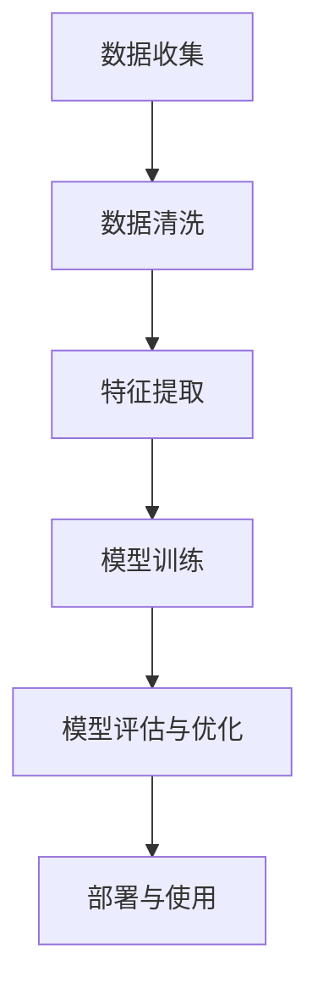
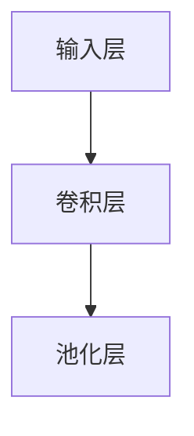
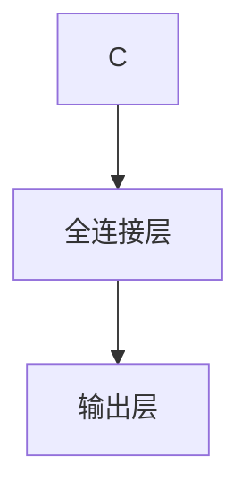
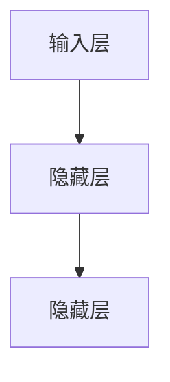

                 

### 背景介绍 Background Introduction

#### AI 1.0 时代与 AI 2.0 时代

人工智能（Artificial Intelligence, AI）的发展经历了多个阶段，从最初的 AI 1.0 时代到如今的 AI 2.0 时代，每一阶段都带来了技术上的革命性进步。AI 1.0 时代主要是指规则驱动的人工智能，即基于预定义的规则进行逻辑推理和决策。在这个阶段，人工智能的应用范围相对有限，主要集中在专家系统、自然语言处理和简单图像识别等领域。

随着计算能力的提升和算法的进步，我们进入了 AI 2.0 时代。AI 2.0 时代的特点是数据驱动的人工智能，即通过大规模数据训练模型，实现自主学习与推理。这个阶段的 AI 技术已经可以应用于更多复杂的任务，如自动驾驶、语音识别、智能推荐等。此外，AI 2.0 时代也见证了深度学习、神经网络等新技术的兴起，使得人工智能的精度和效率大幅提升。

#### AI 2.0 时代的挑战

然而，AI 2.0 时代的到来也带来了许多新的挑战。这些挑战不仅涉及到技术层面，还涵盖了伦理、法律、经济等多个维度。以下是我们需要关注的一些关键挑战：

1. **数据隐私与安全**：随着数据成为人工智能的核心资源，如何保护用户隐私和数据安全成为了一大挑战。未经授权的数据访问和滥用可能会导致严重的隐私泄露问题。

2. **算法公平性和透明性**：人工智能系统的决策过程往往是由复杂算法驱动的，这些算法的公平性和透明性成为公众关注的热点。算法偏见和不可解释性可能会对某些群体产生不公平影响。

3. **技术可控性和责任归属**：随着人工智能系统变得越来越复杂，确保其可控性和明确责任归属变得日益重要。在发生错误或事故时，如何判定责任归属成为了一个法律和伦理问题。

4. **伦理和道德问题**：人工智能在医疗、军事等领域的应用引发了许多伦理和道德问题。例如，人工智能在医疗决策中如何平衡患者权益和公共利益，人工智能武器化带来的潜在威胁等。

5. **就业和社会影响**：人工智能的发展也引发了关于就业和社会影响的广泛讨论。自动化和智能化的进步可能会取代许多传统工作，引发就业结构的变化和社会的不平等。

在接下来的章节中，我们将深入探讨这些挑战，并分析可能的解决方案。让我们一步一步思考，找出应对 AI 2.0 时代挑战的策略和路径。### 核心概念与联系 Key Concepts and Connections

#### 1. 人工智能的基本概念

首先，我们需要了解人工智能（AI）的基本概念。人工智能是指通过计算机模拟人类的认知过程，使机器能够执行复杂的任务，如学习、推理、规划和自然语言处理等。AI 的核心组成部分包括：

- **算法**：算法是 AI 系统的核心，用于指导机器如何学习、如何处理数据以及如何做出决策。

- **数据**：数据是 AI 的基础。高质量的数据可以训练出更准确的模型，从而提高 AI 系统的性能。

- **模型**：模型是 AI 系统中的抽象表示，通常由算法和数据的组合形成。模型可以用于预测、分类和生成等任务。

- **训练与优化**：通过不断训练和优化模型，可以使其在特定任务上表现得更好。训练过程通常包括数据预处理、模型初始化、迭代训练和评估等步骤。

#### 2. 数据驱动的 AI

AI 2.0 时代的一个重要特点是数据驱动的人工智能。数据驱动的 AI 依赖于大规模数据的收集、存储和处理。以下是几个关键步骤：

- **数据收集**：通过传感器、用户行为数据、社交媒体等渠道收集大量数据。

- **数据清洗**：对收集到的数据进行清洗，去除错误、冗余和不一致的数据。

- **特征提取**：从原始数据中提取出有用的特征，这些特征将用于训练模型。

- **模型训练**：使用提取出的特征对模型进行训练，通过调整模型参数来提高其性能。

- **模型评估与优化**：通过测试集对模型进行评估，并根据评估结果进行优化，以获得更好的性能。

#### 3. 神经网络与深度学习

神经网络和深度学习是 AI 2.0 时代的重要技术。神经网络是一系列相互连接的节点，每个节点都执行简单的计算，并通过权重调整来模拟人类大脑的工作方式。深度学习是一种特殊类型的神经网络，其层次结构更深，可以处理更复杂的任务。

以下是神经网络和深度学习的关键组成部分：

- **输入层**：接收输入数据。

- **隐藏层**：对输入数据进行处理，并通过权重进行传递。

- **输出层**：输出最终结果。

- **激活函数**：用于引入非线性因素，使神经网络能够处理复杂的任务。

- **反向传播**：通过反向传播算法更新模型权重，以最小化损失函数。

- **优化算法**：用于调整模型权重，以提高模型性能。常见的优化算法包括梯度下降、Adam 算法等。

#### 4. Mermaid 流程图

为了更清晰地展示 AI 2.0 时代的核心概念和联系，我们可以使用 Mermaid 流程图来表示。以下是一个简单的 Mermaid 流程图示例，展示了数据驱动 AI 的工作流程：



在这个流程图中，每个节点代表一个关键步骤，箭头表示步骤之间的依赖关系。通过这个流程图，我们可以更直观地理解数据驱动 AI 的工作原理。

### 核心算法原理 & 具体操作步骤 Core Algorithm Principles & Detailed Steps

#### 1. 算法概述

在 AI 2.0 时代，深度学习算法占据了主导地位。其中，卷积神经网络（Convolutional Neural Network, CNN）和循环神经网络（Recurrent Neural Network, RNN）是两种重要的算法。在本节中，我们将详细介绍这两种算法的基本原理和具体操作步骤。

#### 2. 卷积神经网络（CNN）

卷积神经网络是一种专门用于处理图像数据的神经网络。其核心思想是通过卷积操作提取图像的特征。

##### 步骤一：输入层

输入层接收原始图像数据，每个节点对应图像中的一个像素。

##### 步骤二：卷积层

卷积层通过卷积操作提取图像的特征。卷积操作是将一个卷积核与图像的局部区域进行点乘并求和，得到一个特征图。



##### 步骤三：池化层

池化层用于降低特征图的维度，同时保留最重要的特征。常见的池化操作包括最大池化和平均池化。

##### 步骤四：全连接层

全连接层将卷积层和池化层输出的特征映射到输出层。全连接层通过逐个计算每个节点的加权求和并应用激活函数，得到最终输出。



##### 步骤五：输出层

输出层产生最终的结果，如分类标签或预测值。

#### 3. 循环神经网络（RNN）

循环神经网络是一种专门用于处理序列数据的神经网络。其核心思想是通过循环连接实现信息的持久化。

##### 步骤一：输入层

输入层接收序列数据，每个节点对应序列中的一个元素。

##### 步骤二：隐藏层

隐藏层通过循环连接实现信息的持久化。在每个时间步，隐藏层的状态都会更新，以便在下一次时间步中保留信息。



##### 步骤三：输出层

输出层产生最终的结果，如序列标签或预测值。

#### 4. 算法优化

在实际应用中，为了提高模型性能，我们通常需要对算法进行优化。

- **数据增强**：通过旋转、缩放、裁剪等操作增加数据的多样性，提高模型泛化能力。

- **正则化**：通过添加正则项（如 L1、L2 正则化）防止模型过拟合。

- **批处理**：将数据分成多个批次进行训练，提高训练效率。

- **dropout**：在训练过程中随机丢弃部分神经元，防止模型过拟合。

### 数学模型和公式 & 详细讲解 & 举例说明

在深度学习算法中，数学模型和公式起着至关重要的作用。以下我们将详细讲解一些核心的数学模型和公式，并举例说明其应用。

#### 1. 梯度下降算法

梯度下降算法是一种常用的优化算法，用于调整模型参数以最小化损失函数。

- **公式**：损失函数 J(w) = (1/2m) * Σ(yi - ŷi)²，其中 w 为模型参数，m 为样本数量，yi 为实际标签，ŷi 为预测标签。

- **步骤**：

  - 计算损失函数的梯度：∇w J(w)。

  - 更新模型参数：w = w - α∇w J(w)，其中 α 为学习率。

- **例子**：

  假设我们有一个简单的线性回归模型，损失函数为 J(w) = (1/2m) * Σ(yi - ŷi)²。通过计算梯度并更新参数，我们可以使模型在训练数据上的误差最小化。

#### 2. 反向传播算法

反向传播算法是深度学习中的核心算法，用于计算模型参数的梯度。

- **公式**：梯度 ∇w J(w) = Σ(∂J/∂z) * (z * ∂z/∂w)。

- **步骤**：

  - 从输出层开始，计算每个节点的梯度。

  - 通过反向传播，将梯度传递到隐藏层和输入层。

- **例子**：

  假设我们有一个简单的多层感知机模型，输出层节点的梯度为 ∂J/∂z。通过反向传播，我们可以计算隐藏层和输入层的梯度，并更新模型参数。

#### 3. 激活函数

激活函数是深度学习中的关键组件，用于引入非线性因素，使神经网络能够处理复杂的任务。

- **公式**：激活函数 f(x) = 1/(1 + e^(-x))，其中 x 为输入。

- **例子**：

  假设我们有一个输入 x = -2，通过激活函数 f(x) = 1/(1 + e^(-x))，我们可以得到输出 f(-2) = 0.118。

  通过激活函数，我们可以将线性函数转换为非线性函数，从而实现更复杂的非线性变换。

### 项目实战：代码实际案例和详细解释说明

在本节中，我们将通过一个实际项目案例，展示如何使用深度学习算法进行图像分类。

#### 1. 项目背景

我们选择使用深度学习算法对猫狗图像进行分类。这是一个典型的图像分类问题，可以通过卷积神经网络（CNN）来解决。

#### 2. 开发环境搭建

- **Python**：作为主要的编程语言。
- **TensorFlow**：用于构建和训练深度学习模型。
- **Keras**：用于简化 TensorFlow 的使用。

#### 3. 源代码详细实现和代码解读

```python
import tensorflow as tf
from tensorflow.keras import layers
from tensorflow.keras.preprocessing.image import ImageDataGenerator

# 加载并预处理数据
train_datagen = ImageDataGenerator(rescale=1./255)
train_generator = train_datagen.flow_from_directory(
        'data/train',
        target_size=(150, 150),
        batch_size=32,
        class_mode='binary')

# 构建模型
model = tf.keras.Sequential([
    layers.Conv2D(32, (3, 3), activation='relu', input_shape=(150, 150, 3)),
    layers.MaxPooling2D(2, 2),
    layers.Conv2D(64, (3, 3), activation='relu'),
    layers.MaxPooling2D(2, 2),
    layers.Conv2D(128, (3, 3), activation='relu'),
    layers.MaxPooling2D(2, 2),
    layers.Conv2D(128, (3, 3), activation='relu'),
    layers.MaxPooling2D(2, 2),
    layers.Flatten(),
    layers.Dense(512, activation='relu'),
    layers.Dense(1, activation='sigmoid')
])

# 编译模型
model.compile(optimizer='adam',
              loss='binary_crossentropy',
              metrics=['accuracy'])

# 训练模型
model.fit(train_generator, epochs=10)
```

#### 4. 代码解读与分析

- **数据预处理**：使用 `ImageDataGenerator` 对图像数据进行预处理，包括缩放和归一化。
- **模型构建**：使用 `Sequential` 模型构建一个简单的 CNN，包括卷积层、池化层和全连接层。
- **模型编译**：编译模型，指定优化器和损失函数。
- **模型训练**：使用 `fit` 方法训练模型，指定训练轮数。

通过这个实际项目案例，我们可以看到如何使用深度学习算法进行图像分类。这个过程涵盖了数据预处理、模型构建、模型训练和模型评估等关键步骤，为我们理解深度学习算法的实际应用提供了宝贵的经验。

### 实际应用场景 Real-World Applications

#### 1. 自动驾驶

自动驾驶是 AI 2.0 时代最具代表性的应用之一。通过使用深度学习和计算机视觉技术，自动驾驶系统能够实时分析道路环境，做出决策，并控制车辆。自动驾驶的应用不仅能够提高交通效率，减少交通事故，还能够为残疾人和老年人提供出行便利。

然而，自动驾驶也面临许多挑战。例如，如何在复杂的路况下保持高水平的准确性和安全性，如何处理极端天气和路况，如何确保系统的可靠性和鲁棒性等。为了解决这些问题，研究人员正在不断改进算法，并增加自动驾驶系统的测试和验证。

#### 2. 医疗诊断

在医疗领域，AI 2.0 时代的技术已经显示出巨大的潜力。通过深度学习和图像分析技术，AI 系统可以辅助医生进行疾病诊断，提高诊断的准确性和效率。例如，AI 可以帮助医生分析医学图像，识别病变区域，甚至预测疾病的进展。

然而，医疗诊断的挑战也很多。例如，如何确保 AI 系统的透明性和可解释性，如何保证数据隐私和安全，以及如何确保系统的公平性和公正性。这些问题需要我们在技术、法律和伦理等多个层面进行深入探讨和解决。

#### 3. 语音识别

语音识别是另一个 AI 2.0 时代的重要应用。通过使用深度学习和自然语言处理技术，语音识别系统能够将语音转化为文本，并实现语音交互。语音识别技术已经在智能助手、客服系统、翻译服务等多个领域得到了广泛应用。

尽管语音识别技术取得了显著进展，但仍然存在一些挑战。例如，如何处理噪声和背景干扰，如何适应不同的口音和说话风格，以及如何提高系统的准确性和可靠性。为了解决这些问题，研究人员正在不断改进算法，并增加语音识别系统的训练数据和应用场景。

#### 4. 智能推荐

智能推荐系统是 AI 2.0 时代在商业领域的典型应用。通过使用深度学习和大数据分析技术，智能推荐系统可以根据用户的历史行为和偏好，为用户提供个性化的推荐。智能推荐系统已经在电子商务、社交媒体、音乐和视频平台等多个领域得到了广泛应用。

尽管智能推荐系统取得了巨大成功，但仍然存在一些挑战。例如，如何处理用户数据的隐私和安全，如何避免推荐系统的偏见和歧视，以及如何确保系统的透明性和公正性。这些问题需要我们在技术、法律和伦理等多个层面进行深入探讨和解决。

### 工具和资源推荐 Tools and Resources

#### 1. 学习资源推荐

- **书籍**：

  - 《深度学习》（Goodfellow, Bengio, Courville 著）：这是一本经典的深度学习入门书籍，涵盖了深度学习的基本原理和应用。

  - 《Python 深度学习》（François Chollet 著）：这是一本实用的深度学习指南，适合初学者和进阶者。

- **论文**：

  - "Deep Learning"（Ian Goodfellow, Yoshua Bengio, Aaron Courville 著）：这是一篇关于深度学习的综述论文，介绍了深度学习的最新进展和应用。

  - "A Theoretically Grounded Application of Dropout in Recurrent Neural Networks"（Yarin Gal and Zoubin Ghahramani 著）：这篇论文介绍了如何将 dropout 应用于循环神经网络，提高了模型的性能。

- **博客**：

  - [Deep Learning](https://www.deeplearning.net/): 这个博客提供了深度学习领域的最新新闻、教程和资源。

  - [AI 技术博客](https://AITechnologyBlog.com/): 这个博客涵盖了人工智能领域的各种主题，包括深度学习、自然语言处理和计算机视觉等。

- **网站**：

  - [Keras](https://keras.io/): Keras 是一个流行的深度学习框架，提供了简单易用的 API。

  - [TensorFlow](https://www.tensorflow.org/): TensorFlow 是 Google 开发的一个开源深度学习框架，具有强大的功能。

#### 2. 开发工具框架推荐

- **框架**：

  - **TensorFlow**：一个开源的深度学习框架，支持多种编程语言，包括 Python、C++ 和 Java。

  - **PyTorch**：一个流行的深度学习框架，提供了简单易用的 API，适合快速原型开发。

  - **Keras**：一个基于 TensorFlow 的深度学习框架，提供了简单易用的 API，适合初学者和进阶者。

- **IDE**：

  - **PyCharm**：一个流行的 Python 开发环境，支持多种编程语言，包括 Python、JavaScript 和 Ruby。

  - **Jupyter Notebook**：一个交互式的计算环境，适合数据分析和深度学习项目。

- **库**：

  - **NumPy**：一个用于数值计算的 Python 库，提供了强大的数组操作功能。

  - **Pandas**：一个用于数据操作和数据分析的 Python 库，提供了便捷的数据处理工具。

#### 3. 相关论文著作推荐

- **论文**：

  - "Deep Learning"（Ian Goodfellow, Yoshua Bengio, Aaron Courville 著）：这是一篇关于深度学习的综述论文，介绍了深度学习的最新进展和应用。

  - "A Theoretically Grounded Application of Dropout in Recurrent Neural Networks"（Yarin Gal and Zoubin Ghahramani 著）：这篇论文介绍了如何将 dropout 应用于循环神经网络，提高了模型的性能。

- **著作**：

  - 《深度学习》（Goodfellow, Bengio, Courville 著）：这是一本经典的深度学习入门书籍，涵盖了深度学习的基本原理和应用。

  - 《Python 深度学习》（François Chollet 著）：这是一本实用的深度学习指南，适合初学者和进阶者。

### 总结 Summary

#### 1. 核心观点 Core Insights

AI 2.0 时代的到来带来了巨大的机遇和挑战。通过数据驱动的深度学习算法，人工智能在各个领域取得了显著的进展。然而，我们也必须面对数据隐私、算法公平性、技术可控性等挑战。为了应对这些挑战，我们需要在技术、法律和伦理等多个层面进行深入探讨和解决。

#### 2. 未来发展趋势 Future Trends

未来，AI 2.0 时代将继续发展，并在更多领域得到应用。以下是一些可能的发展趋势：

- **更强大的算法**：研究人员将继续探索新的算法，以提高模型的性能和可解释性。

- **跨学科合作**：人工智能与其他领域的结合将产生更多创新，如医疗、教育、金融等。

- **标准化与规范化**：随着人工智能应用的普及，标准化和规范化将成为重要议题，以确保系统的公平性和公正性。

- **安全与隐私保护**：技术进步将带来更多的安全与隐私保护措施，以应对数据隐私和安全问题。

#### 3. 挑战与展望 Challenges and Prospects

AI 2.0 时代面临的挑战是多方面的，包括技术、法律、伦理等。我们需要关注以下几个方面：

- **技术挑战**：如何设计更强大的算法，提高模型的可解释性和可靠性。

- **法律挑战**：如何确保人工智能系统的透明性和责任归属。

- **伦理挑战**：如何平衡人工智能的发展与社会利益，避免技术滥用。

- **社会挑战**：如何应对人工智能带来的就业和社会影响，减少社会不平等。

面对这些挑战，我们需要采取多方面的措施，包括加强技术研发、完善法律法规、推动跨学科合作等。只有这样，我们才能充分利用 AI 2.0 时代的机遇，为人类社会带来更多福祉。

### 附录 Appendix

#### 常见问题与解答 Frequently Asked Questions

1. **什么是 AI 2.0 时代？**

   AI 2.0 时代是指以数据驱动的深度学习为核心的人工智能发展阶段，相比早期的规则驱动人工智能，它具有更高的自主学习和推理能力。

2. **AI 2.0 时代有哪些关键挑战？**

   关键挑战包括数据隐私与安全、算法公平性和透明性、技术可控性和责任归属、伦理和道德问题，以及就业和社会影响。

3. **如何确保 AI 系统的可解释性？**

   可以通过设计可解释性算法、增加模型透明度、以及使用可视化工具等方法来确保 AI 系统的可解释性。

4. **如何应对 AI 带来的就业挑战？**

   可以通过培训和教育，提高劳动者的技能，促进跨行业的职业转换，以及推动新产业的发展来应对就业挑战。

#### 扩展阅读 & 参考资料 Further Reading & References

- **书籍**：

  - 《深度学习》（Ian Goodfellow, Yoshua Bengio, Aaron Courville 著）

  - 《Python 深度学习》（François Chollet 著）

- **论文**：

  - "Deep Learning"（Ian Goodfellow, Yoshua Bengio, Aaron Courville 著）

  - "A Theoretically Grounded Application of Dropout in Recurrent Neural Networks"（Yarin Gal and Zoubin Ghahramani 著）

- **网站**：

  - [Deep Learning](https://www.deeplearning.net/)

  - [AI 技术博客](https://AITechnologyBlog.com/)

- **在线课程**：

  - [Coursera](https://www.coursera.org/): 提供了多个深度学习和人工智能相关的课程。

  - [Udacity](https://www.udacity.com/): 提供了多个深度学习和人工智能相关的纳米学位课程。

- **开源框架**：

  - [TensorFlow](https://www.tensorflow.org/)

  - [PyTorch](https://pytorch.org/)

  - [Keras](https://keras.io/)

