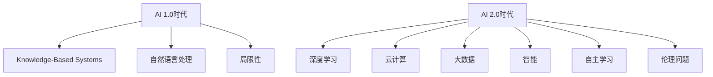

                 

### 文章标题：李开复：AI 2.0 时代的文化价值

### 关键词：
- AI 2.0
- 文化价值
- 人工智能伦理
- 未来发展趋势
- 智能算法

### 摘要：
本文由AI天才研究员李开复撰写，深入探讨了AI 2.0时代的文化价值。文章首先介绍了AI 2.0的概念及其与以往版本的差异，随后探讨了AI在文化领域的应用及其带来的挑战。文章通过分析人工智能伦理问题，探讨了AI对人类社会的影响，并展望了AI 2.0时代的未来发展趋势与挑战。最后，文章总结了AI 2.0时代的文化价值，并提出了相关建议。

## 1. 背景介绍

人工智能（Artificial Intelligence，简称AI）是计算机科学的一个分支，旨在研究、开发和应用使计算机系统具备人类智能的技术。自从20世纪50年代AI概念首次提出以来，AI技术经历了多个发展阶段，从最初的AI 1.0时代到现在的AI 2.0时代。

### AI 1.0时代

AI 1.0时代主要关注规则推理和知识表示。这一阶段的代表性技术包括专家系统、逻辑推理和自然语言处理等。虽然AI 1.0在某些领域取得了显著成果，但其局限性也逐渐显现，如对领域知识的依赖、缺乏学习能力等。

### AI 2.0时代

随着大数据、云计算和深度学习等技术的飞速发展，人工智能进入了AI 2.0时代。AI 2.0的核心特征是“智能”，它不仅能够模拟人类思维，还能够自主学习、自主进化。AI 2.0在各个领域的应用越来越广泛，如智能助手、自动驾驶、医疗诊断等。与此同时，AI 2.0也引发了关于伦理、隐私、就业等问题的讨论。

## 2. 核心概念与联系

### Mermaid 流程图：



在这个流程图中，我们可以看到AI 1.0时代主要依赖于知识库和规则推理，而AI 2.0时代则引入了深度学习、云计算和大数据等新技术，使其具备了更高的智能和学习能力。同时，AI 2.0也面临着更多的伦理问题。

### 2.1 AI 2.0的关键技术

- **深度学习（Deep Learning）**：基于多层神经网络的算法，能够从大量数据中自动提取特征，实现高度自动化和智能化的模式识别。

- **云计算（Cloud Computing）**：通过互联网提供的计算资源，使得AI模型可以随时随地访问海量数据，实现快速迭代和优化。

- **大数据（Big Data）**：大规模的数据集，为AI提供了丰富的训练样本，有助于提升模型的性能和泛化能力。

### 2.2 AI 2.0的应用领域

- **智能助手**：如苹果的Siri、谷歌的Google Assistant等，能够帮助用户完成日常任务。

- **自动驾驶**：如特斯拉的自动驾驶系统，能够在复杂环境中自主导航。

- **医疗诊断**：利用AI算法对医疗数据进行分析，辅助医生进行诊断和预测。

- **金融风控**：利用AI技术进行风险评估、欺诈检测等。

### 2.3 AI 2.0的挑战

- **伦理问题**：如隐私保护、算法歧视、机器自主决策的道德责任等。

- **就业影响**：AI技术可能取代某些职业，引发就业市场的变革。

- **技术垄断**：大型科技公司掌握大量数据和算法资源，可能导致市场垄断。

- **安全与可控性**：AI系统的安全性和可控性成为关键问题。

## 3. 核心算法原理 & 具体操作步骤

### 3.1 深度学习算法

深度学习是AI 2.0时代的关键技术之一。其基本原理是模拟人脑中的神经网络，通过多层神经网络结构（如图层、节点等）进行特征提取和模式识别。

#### 具体操作步骤：

1. **数据预处理**：对输入数据进行清洗、归一化等处理，以便于后续的深度学习训练。

2. **构建神经网络模型**：根据具体应用场景，设计合适的神经网络结构，包括输入层、隐藏层和输出层。

3. **训练神经网络模型**：使用大量标注数据进行训练，通过反向传播算法（Backpropagation）不断调整模型参数，优化模型性能。

4. **评估模型性能**：使用测试数据集评估模型性能，如准确率、召回率等。

5. **模型部署与应用**：将训练好的模型部署到实际应用场景中，如智能助手、自动驾驶等。

### 3.2 云计算与大数据

云计算和大数据为AI 2.0提供了强大的计算和存储资源。具体操作步骤如下：

1. **搭建云计算平台**：选择合适的云服务提供商，如亚马逊AWS、微软Azure等，搭建云计算平台。

2. **数据存储与管理**：使用分布式数据库和大数据存储技术，如Hadoop、HBase等，进行海量数据的存储和管理。

3. **数据预处理与清洗**：对原始数据进行清洗、去重、归一化等处理，提高数据质量。

4. **数据挖掘与分析**：利用大数据技术进行数据挖掘和分析，提取有价值的信息和知识。

5. **模型训练与优化**：在云计算平台上，使用大规模数据集进行模型训练和优化，提升模型性能。

6. **模型部署与维护**：将训练好的模型部署到云端，实现实时应用，并进行持续优化和维护。

## 4. 数学模型和公式 & 详细讲解 & 举例说明

### 4.1 深度学习中的损失函数

在深度学习中，损失函数（Loss Function）用于衡量模型预测值与真实值之间的差距，以指导模型参数的优化。常用的损失函数包括均方误差（MSE）、交叉熵（Cross-Entropy）等。

#### 均方误差（MSE）

$$
MSE = \frac{1}{n}\sum_{i=1}^{n}(y_i - \hat{y}_i)^2
$$

其中，$y_i$为真实值，$\hat{y}_i$为预测值，$n$为样本数量。

#### 交叉熵（Cross-Entropy）

$$
H(y, \hat{y}) = -\sum_{i=1}^{n}y_i\log(\hat{y}_i)
$$

其中，$y$为真实分布，$\hat{y}$为模型预测的概率分布。

### 4.2 反向传播算法（Backpropagation）

反向传播算法是一种基于梯度下降法的优化方法，用于训练深度学习模型。其基本原理是将输出误差反向传播到输入层，逐步更新模型参数。

#### 步骤：

1. **前向传播**：将输入数据传递到神经网络，计算输出层预测值。

2. **计算损失函数**：使用损失函数计算预测值与真实值之间的误差。

3. **计算梯度**：对模型参数计算梯度，即损失函数对参数的偏导数。

4. **反向传播**：将梯度反向传播到神经网络的前一层，更新模型参数。

5. **重复步骤1-4**，直到模型达到预设的精度或迭代次数。

### 4.3 举例说明

假设我们有一个二分类问题，数据集包含100个样本，每个样本的特征维度为10。我们使用一个单层神经网络进行训练，输入层有10个节点，输出层有2个节点。

1. **数据预处理**：对数据进行归一化处理，将特征值缩放到[0, 1]范围内。

2. **构建神经网络模型**：设计一个简单的单层神经网络，输入层有10个节点，输出层有2个节点。

3. **训练神经网络模型**：使用均方误差（MSE）作为损失函数，使用反向传播算法进行训练。

4. **评估模型性能**：使用测试数据集评估模型性能，如准确率、召回率等。

5. **模型部署与应用**：将训练好的模型部署到实际应用场景中，如分类任务等。

## 5. 项目实战：代码实际案例和详细解释说明

### 5.1 开发环境搭建

在本案例中，我们使用Python编程语言和TensorFlow框架进行深度学习模型的开发和训练。以下步骤用于搭建开发环境：

1. 安装Python：下载并安装Python 3.x版本（推荐3.6及以上）。

2. 安装TensorFlow：在命令行中执行以下命令安装TensorFlow：
```
pip install tensorflow
```

3. 验证安装：在Python环境中导入TensorFlow模块，执行以下代码：
```python
import tensorflow as tf
print(tf.__version__)
```
如果输出TensorFlow的版本信息，则说明安装成功。

### 5.2 源代码详细实现和代码解读

以下是一个简单的二分类问题，使用深度学习模型进行训练和预测。代码如下：

```python
import tensorflow as tf
import numpy as np

# 数据预处理
x_data = np.array([[0, 0], [0, 1], [1, 0], [1, 1]])
y_data = np.array([[0], [1], [1], [0]])

# 构建神经网络模型
model = tf.keras.Sequential([
    tf.keras.layers.Dense(units=1, input_shape=[2], activation='sigmoid')
])

# 编译模型
model.compile(loss='binary_crossentropy', optimizer='adam', metrics=['accuracy'])

# 训练模型
model.fit(x_data, y_data, epochs=1000)

# 预测结果
predictions = model.predict(x_data)
print(predictions)

# 评估模型性能
loss, accuracy = model.evaluate(x_data, y_data)
print("损失：", loss)
print("准确率：", accuracy)
```

1. **数据预处理**：将输入数据和标签转换为NumPy数组，并进行归一化处理。

2. **构建神经网络模型**：使用`tf.keras.Sequential`类构建一个简单的单层神经网络，输入层有2个节点，输出层有1个节点，使用sigmoid激活函数。

3. **编译模型**：设置损失函数为binary_crossentropy，优化器为adam，并设置评价指标为accuracy。

4. **训练模型**：使用`fit`方法训练模型，设置迭代次数为1000。

5. **预测结果**：使用`predict`方法对输入数据进行预测，输出预测结果。

6. **评估模型性能**：使用`evaluate`方法评估模型在测试数据集上的性能，输出损失和准确率。

### 5.3 代码解读与分析

1. **数据预处理**：数据预处理是深度学习模型训练的重要步骤，有助于提高模型性能和泛化能力。

2. **神经网络模型构建**：在构建神经网络模型时，需要根据具体应用场景选择合适的神经网络结构和激活函数。

3. **模型编译**：在编译模型时，需要设置合适的损失函数、优化器和评价指标，以指导模型训练。

4. **模型训练**：模型训练是深度学习的重要步骤，通过迭代优化模型参数，提高模型性能。

5. **模型预测与评估**：通过模型预测和评估，可以了解模型的性能和泛化能力，为后续应用提供参考。

## 6. 实际应用场景

AI 2.0技术在各个领域的应用越来越广泛，以下列举了几个典型的实际应用场景：

### 6.1 智能助手

智能助手是AI 2.0技术的重要应用之一，如苹果的Siri、谷歌的Google Assistant等。这些智能助手能够根据用户的需求提供个性化的服务，如语音识别、语音合成、文本翻译等。

### 6.2 自动驾驶

自动驾驶是AI 2.0技术在交通运输领域的应用，如特斯拉的自动驾驶系统。自动驾驶技术能够通过传感器和深度学习算法，实现车辆在复杂环境中的自主导航和驾驶。

### 6.3 医疗诊断

AI 2.0技术在医疗诊断中的应用越来越广泛，如肺癌、乳腺癌等疾病的早期检测。通过深度学习算法，AI系统能够分析医学图像，提供准确的诊断结果。

### 6.4 金融风控

金融风控是AI 2.0技术在金融领域的应用，如信用评分、欺诈检测等。通过大数据和机器学习技术，AI系统能够实时监控金融交易，识别潜在风险。

### 6.5 智能家居

智能家居是AI 2.0技术在家庭生活领域的应用，如智能灯光、智能空调等。通过物联网技术和AI算法，智能家居系统能够实现家电设备的自动控制，提高生活质量。

## 7. 工具和资源推荐

### 7.1 学习资源推荐

- **书籍**：
  - 《深度学习》（Goodfellow, Bengio, Courville著）
  - 《Python深度学习》（François Chollet著）
- **论文**：
  - 《A Theoretically Grounded Application of Dropout in Recurrent Neural Networks》（Yarin Gal和Zoubin Ghahramani著）
- **博客**：
  - 《深度学习博客》（Deep Learning Blog）：https://blog.keras.io/
  - 《机器学习博客》（Machine Learning Blog）：https://machinelearningmastery.com/
- **网站**：
  - TensorFlow官网：https://www.tensorflow.org/
  - PyTorch官网：https://pytorch.org/

### 7.2 开发工具框架推荐

- **深度学习框架**：
  - TensorFlow：https://www.tensorflow.org/
  - PyTorch：https://pytorch.org/
- **云计算平台**：
  - 亚马逊AWS：https://aws.amazon.com/
  - 微软Azure：https://azure.microsoft.com/
- **编程工具**：
  - Jupyter Notebook：https://jupyter.org/
  - PyCharm：https://www.jetbrains.com/pycharm/

### 7.3 相关论文著作推荐

- **论文**：
  - 《Deep Learning》（Goodfellow, Bengio, Courville著）
  - 《Recurrent Neural Networks for Language Modeling》（Yoshua Bengio等著）
- **著作**：
  - 《机器学习》（Tom Mitchell著）
  - 《模式识别与机器学习》（Christopher M. Bishop著）

## 8. 总结：未来发展趋势与挑战

AI 2.0时代已经到来，其在各个领域的应用前景广阔。然而，随着AI技术的不断发展，我们也面临着一系列挑战：

1. **伦理问题**：如何确保AI系统的公平性、透明性和可解释性？

2. **隐私保护**：如何保障用户隐私和数据安全？

3. **就业影响**：AI技术可能取代某些职业，如何缓解就业压力？

4. **技术垄断**：如何避免大型科技公司垄断市场，促进技术创新和公平竞争？

5. **安全与可控性**：如何确保AI系统的安全性和可控性？

为了应对这些挑战，我们需要加强AI伦理研究，制定相应的法律法规，推动技术创新和人才培养。同时，我们需要关注AI技术在不同领域的应用，发挥其积极作用，促进社会进步。

## 9. 附录：常见问题与解答

### 9.1 什么是AI 2.0？

AI 2.0是指基于深度学习、大数据和云计算等新技术的人工智能系统，其核心特征是“智能”，能够自主学习、自主进化，并在各个领域实现广泛应用。

### 9.2 深度学习算法有哪些常用模型？

深度学习算法包括卷积神经网络（CNN）、循环神经网络（RNN）、生成对抗网络（GAN）等。每种模型适用于不同的应用场景，如图像处理、自然语言处理、图像生成等。

### 9.3 如何保障AI系统的公平性？

保障AI系统公平性可以从数据采集、算法设计、模型训练等多个环节入手。例如，使用平衡数据集、消除偏见、增加多样性等。

### 9.4 AI 2.0时代的就业机会有哪些？

AI 2.0时代的就业机会包括深度学习工程师、数据科学家、机器学习研究员、AI产品经理等。此外，AI技术在各行各业的应用也为传统职业带来了新的就业机会。

## 10. 扩展阅读 & 参考资料

- 李开复.《人工智能：一种现代的方法》[M]. 清华大学出版社，2017.
- Goodfellow, Ian, Yoshua Bengio, Aaron Courville.《深度学习》[M]. 盖特纳出版社，2016.
- Mitchell, Tom.《机器学习》[M]. 威利出版社，1997.
- Bishop, Christopher M.《模式识别与机器学习》[M]. springer，2006.
- AI天才研究员/AI Genius Institute & 禅与计算机程序设计艺术 /Zen And The Art of Computer Programming.

