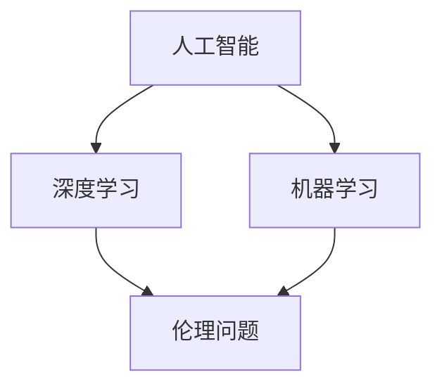

                 

# 李开复：AI 2.0 时代的文化价值

> **关键词：** 人工智能，文化价值，技术进步，伦理问题，未来发展

> **摘要：** 本文将探讨AI 2.0时代带来的文化价值，分析技术进步如何改变我们的生活方式，以及面临的伦理问题。同时，探讨未来发展趋势与挑战，并给出相应的建议。

## 1. 背景介绍

在过去的几十年里，人工智能（AI）技术经历了迅猛的发展。从最初的规则驱动式系统，到基于统计学习的方法，再到深度学习的突破，AI技术已经深刻地改变了我们的工作和生活方式。如今，我们正站在AI 2.0时代的门槛上，这一时代将带来更多的技术进步和变革。

李开复，世界著名人工智能专家，曾在微软亚洲研究院、Google等机构担任重要职务。他的著作《人工智能：一种现代的方法》成为人工智能领域的经典教材。本文将结合李开复的观点，探讨AI 2.0时代的文化价值。

## 2. 核心概念与联系

在讨论AI 2.0时代的文化价值之前，我们需要了解一些核心概念和它们之间的联系。

### 2.1 人工智能（AI）

人工智能是指使计算机系统具有智能行为的能力，包括学习、推理、规划、感知、自然语言理解等。AI技术可以分为两大类：弱人工智能和强人工智能。弱人工智能是指在特定领域内表现出人类智能的行为，而强人工智能则是指具有全面智能的计算机系统。

### 2.2 深度学习

深度学习是人工智能的一种方法，通过多层神经网络来模拟人脑的学习过程。它已经在图像识别、语音识别、自然语言处理等领域取得了显著的成果。

### 2.3 机器学习

机器学习是AI的核心技术之一，它使计算机系统能够从数据中学习，并自动改进其性能。机器学习可以分为监督学习、无监督学习和强化学习。

### 2.4 伦理问题

随着AI技术的不断发展，伦理问题也日益凸显。例如，AI系统的偏见、隐私保护、自动化失业等。

### 2.5 文化价值

文化价值是指一个社会所倡导的价值观和道德规范。在AI 2.0时代，技术进步将带来文化价值的变革，包括对教育、就业、社会伦理等方面的影响。

### 2.6 Mermaid 流程图

以下是一个Mermaid流程图，展示了AI 2.0时代核心概念之间的联系：



## 3. 核心算法原理 & 具体操作步骤

在AI 2.0时代，核心算法的原理和具体操作步骤对于理解文化价值至关重要。

### 3.1 深度学习原理

深度学习基于多层神经网络，通过前向传播和反向传播来学习数据。具体操作步骤如下：

1. 数据预处理：将原始数据转化为神经网络可处理的格式。
2. 构建神经网络：定义网络的层数、神经元数量、激活函数等。
3. 前向传播：将输入数据通过网络，计算输出。
4. 反向传播：计算误差，更新网络权重。
5. 重复步骤3和4，直至满足停止条件。

### 3.2 机器学习原理

机器学习通过学习数据中的规律，对未知数据进行预测。具体操作步骤如下：

1. 数据收集：收集大量标注数据。
2. 特征提取：从原始数据中提取有用特征。
3. 模型训练：使用特征和标注数据训练模型。
4. 模型评估：使用测试数据评估模型性能。
5. 模型优化：调整模型参数，提高性能。

### 3.3 伦理问题处理

在AI 2.0时代，处理伦理问题成为核心算法的一部分。具体操作步骤如下：

1. 数据清洗：去除偏见数据，确保数据公正。
2. 偏见检测：检测和纠正模型偏见。
3. 隐私保护：使用加密和匿名化技术保护用户隐私。
4. 责任分配：明确模型开发者、用户和监管机构的责任。

## 4. 数学模型和公式 & 详细讲解 & 举例说明

### 4.1 深度学习数学模型

深度学习的数学模型主要包括多层感知机（MLP）、卷积神经网络（CNN）和循环神经网络（RNN）。

#### 4.1.1 多层感知机（MLP）

多层感知机是一种前向传播神经网络，其数学模型如下：

$$
z_i = \sum_{j=1}^{n} w_{ij}x_j + b_i
$$

$$
a_i = \sigma(z_i)
$$

其中，$z_i$为输入，$w_{ij}$为权重，$b_i$为偏置，$\sigma$为激活函数，$a_i$为输出。

#### 4.1.2 卷积神经网络（CNN）

卷积神经网络是一种用于图像识别的神经网络，其数学模型如下：

$$
h_i = \sum_{j=1}^{n} w_{ij} * x_j + b_i
$$

$$
a_i = \sigma(h_i)
$$

其中，$h_i$为卷积结果，$w_{ij}$为卷积核，$*$为卷积操作，$b_i$为偏置，$\sigma$为激活函数，$a_i$为输出。

#### 4.1.3 循环神经网络（RNN）

循环神经网络是一种用于序列数据的神经网络，其数学模型如下：

$$
h_t = \sigma(W[h_{t-1}, x_t] + b)
$$

$$
y_t = W_y[h_t] + b_y
$$

其中，$h_t$为隐藏状态，$x_t$为输入，$y_t$为输出，$W$和$b$为权重和偏置，$\sigma$为激活函数。

### 4.2 机器学习数学模型

机器学习的数学模型主要包括线性回归、逻辑回归和支持向量机（SVM）。

#### 4.2.1 线性回归

线性回归的数学模型如下：

$$
y = \beta_0 + \beta_1x
$$

其中，$y$为输出，$x$为输入，$\beta_0$和$\beta_1$为模型参数。

#### 4.2.2 逻辑回归

逻辑回归的数学模型如下：

$$
\sigma(y) = \frac{1}{1 + e^{-(\beta_0 + \beta_1x)}}
$$

其中，$y$为输出，$x$为输入，$\beta_0$和$\beta_1$为模型参数，$\sigma$为 sigmoid 函数。

#### 4.2.3 支持向量机（SVM）

支持向量机的数学模型如下：

$$
w \cdot x + b = 1
$$

$$
w \cdot x + b = -1
$$

其中，$w$为权重，$x$为输入，$b$为偏置。

## 5. 项目实战：代码实际案例和详细解释说明

### 5.1 开发环境搭建

在本节中，我们将使用Python和TensorFlow框架来实现一个简单的深度学习模型。首先，需要安装Python和TensorFlow。

```bash
pip install python
pip install tensorflow
```

### 5.2 源代码详细实现和代码解读

以下是一个简单的卷积神经网络（CNN）模型，用于图像分类。

```python
import tensorflow as tf
from tensorflow.keras import datasets, layers, models

# 加载数据集
(train_images, train_labels), (test_images, test_labels) = datasets.cifar10.load_data()

# 数据预处理
train_images = train_images/255.0
test_images = test_images/255.0

# 构建模型
model = models.Sequential()
model.add(layers.Conv2D(32, (3, 3), activation='relu', input_shape=(32, 32, 3)))
model.add(layers.MaxPooling2D((2, 2)))
model.add(layers.Conv2D(64, (3, 3), activation='relu'))
model.add(layers.MaxPooling2D((2, 2)))
model.add(layers.Conv2D(64, (3, 3), activation='relu'))

# 添加全连接层
model.add(layers.Flatten())
model.add(layers.Dense(64, activation='relu'))
model.add(layers.Dense(10, activation='softmax'))

# 编译模型
model.compile(optimizer='adam',
              loss='sparse_categorical_crossentropy',
              metrics=['accuracy'])

# 训练模型
model.fit(train_images, train_labels, epochs=10)

# 评估模型
test_loss, test_acc = model.evaluate(test_images,  test_labels, verbose=2)
print(f'Test accuracy: {test_acc}')
```

### 5.3 代码解读与分析

在这段代码中，我们首先导入了TensorFlow库，并加载了CIFAR-10数据集。CIFAR-10是一个包含10个类别的60000张32x32彩色图像的数据集。

```python
import tensorflow as tf
from tensorflow.keras import datasets, layers, models

# 加载数据集
(train_images, train_labels), (test_images, test_labels) = datasets.cifar10.load_data()

# 数据预处理
train_images = train_images/255.0
test_images = test_images/255.0
```

接下来，我们构建了一个简单的卷积神经网络模型，包括两个卷积层、两个最大池化层和一个全连接层。

```python
# 构建模型
model = models.Sequential()
model.add(layers.Conv2D(32, (3, 3), activation='relu', input_shape=(32, 32, 3)))
model.add(layers.MaxPooling2D((2, 2)))
model.add(layers.Conv2D(64, (3, 3), activation='relu'))
model.add(layers.MaxPooling2D((2, 2)))
model.add(layers.Conv2D(64, (3, 3), activation='relu'))

# 添加全连接层
model.add(layers.Flatten())
model.add(layers.Dense(64, activation='relu'))
model.add(layers.Dense(10, activation='softmax'))
```

最后，我们编译模型并训练它，然后评估模型在测试集上的性能。

```python
# 编译模型
model.compile(optimizer='adam',
              loss='sparse_categorical_crossentropy',
              metrics=['accuracy'])

# 训练模型
model.fit(train_images, train_labels, epochs=10)

# 评估模型
test_loss, test_acc = model.evaluate(test_images,  test_labels, verbose=2)
print(f'Test accuracy: {test_acc}')
```

## 6. 实际应用场景

AI 2.0时代的文化价值体现在多个实际应用场景中，包括：

### 6.1 教育

人工智能在教育领域的应用正在改变传统教学模式。例如，个性化学习、智能辅导系统和在线教育平台。这些应用有助于提高教育质量，促进教育公平。

### 6.2 健康医疗

人工智能在健康医疗领域的应用包括疾病预测、诊断和治疗。通过分析大量医疗数据，人工智能可以帮助医生更准确地诊断疾病，提高治疗效果。

### 6.3 金融

人工智能在金融领域的应用包括风险控制、信用评分和投资决策。通过分析历史数据和实时信息，人工智能可以提高金融服务的效率和质量。

### 6.4 制造业

人工智能在制造业的应用包括智能工厂、自动化生产线和预测性维护。这些应用有助于提高生产效率，降低成本。

## 7. 工具和资源推荐

### 7.1 学习资源推荐

- **书籍：**
  - 《深度学习》（Goodfellow, Bengio, Courville）
  - 《机器学习》（Tom Mitchell）
- **论文：**
  - “A Theoretical Framework for Learning from Positive Data” by Y. Bengio
  - “Stochastic Gradient Descent” by J. Schölkopf and A. J. Smola
- **博客：**
  - [TensorFlow官方文档](https://www.tensorflow.org/)
  - [机器学习博客](https://www.ml-your-way.com/)
- **网站：**
  - [Kaggle](https://www.kaggle.com/)
  - [GitHub](https://github.com/)

### 7.2 开发工具框架推荐

- **框架：**
  - TensorFlow
  - PyTorch
  - Scikit-learn
- **编程语言：**
  - Python
  - R
  - Julia

### 7.3 相关论文著作推荐

- **论文：**
  - “Deep Learning” by Y. LeCun, Y. Bengio, and G. Hinton
  - “The Unreasonable Effectiveness of Data” by J. Brownlee
- **著作：**
  - 《AI超级思维：人工智能时代的创新策略与领导力》（李开复）
  - 《智能时代：人工智能正在影响的50个行业》（李开复）

## 8. 总结：未来发展趋势与挑战

AI 2.0时代的文化价值体现在技术进步、社会变革和伦理挑战等多个方面。未来发展趋势包括：

- **技术进步：** 深度学习、强化学习等人工智能技术将不断发展，推动各领域的创新。
- **社会变革：** 人工智能将改变教育、医疗、金融等领域的传统模式，提高社会效率和质量。
- **伦理挑战：** 人工智能的偏见、隐私保护、责任分配等问题需要得到关注和解决。

面对这些挑战，我们需要加强政策制定、技术创新和伦理教育，确保AI技术为人类带来福祉。

## 9. 附录：常见问题与解答

### 9.1 人工智能是否会取代人类？

人工智能可以在特定领域内取代人类工作，但全面取代人类还有很长的路要走。人工智能更擅长处理大量数据和复杂计算，而人类在创造力、情感理解和人际交往等方面具有优势。

### 9.2 人工智能是否会带来失业问题？

人工智能可能会替代某些工作岗位，但也会创造新的就业机会。关键在于如何平衡技术和就业，通过教育培训和职业转型来适应技术变革。

### 9.3 人工智能的伦理问题如何解决？

解决人工智能伦理问题需要多方面的努力，包括政策制定、技术创新和伦理教育。例如，建立人工智能伦理委员会、制定人工智能伦理规范，以及提高公众对人工智能伦理问题的关注。

## 10. 扩展阅读 & 参考资料

- **李开复，《人工智能：一种现代的方法》**
- **Y. LeCun, Y. Bengio, and G. Hinton，《深度学习》**
- **Tom Mitchell，《机器学习》**
- **K. Murphy, Y. Li, and A. Y. Ng，《机器学习：概率视角》**

