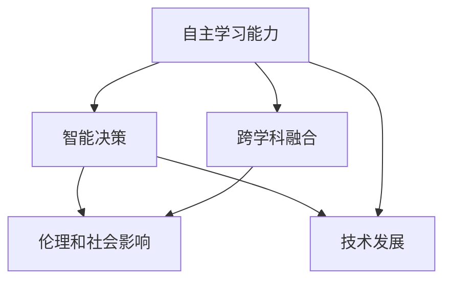

                 

### 李开复：AI 2.0 时代的未来

#### 关键词：
- AI 2.0
- 人工智能
- 未来
- 技术发展
- 应用场景
- 挑战

#### 摘要：
本文旨在探讨李开复关于 AI 2.0 时代未来的观点和预测。通过对 AI 2.0 的核心概念、发展历程和未来趋势的深入分析，本文将揭示人工智能在各个领域的广泛应用，并探讨其所面临的挑战。李开复作为人工智能领域的杰出代表，其见解对于理解 AI 2.0 时代的未来具有重要的指导意义。

## 1. 背景介绍

人工智能（AI）作为计算机科学的一个重要分支，自上世纪五六十年代以来，已经经历了多次重要的发展阶段。从最初的规则基础推理系统，到基于统计学的机器学习方法，再到深度学习的兴起，人工智能技术在不断进步和演变。李开复作为人工智能领域的杰出代表，他的贡献和观点对于理解人工智能的发展历程具有重要意义。

李开复，著名人工智能专家、创新工场创始人兼首席执行官，曾担任谷歌研究院的负责人。他在人工智能领域的研究涵盖了机器学习、自然语言处理、语音识别等多个方面。李开复早在 2006 年就提出了“人工智能 2.0”的概念，并认为这是人工智能发展的重要转折点。

AI 1.0 时代主要依赖于明确的规则和算法，旨在实现特定的任务，如游戏、语音识别等。而 AI 2.0 时代则更加注重自主学习和智能决策，通过大规模数据训练和深度学习算法，实现更为复杂和灵活的智能应用。

在李开复的视角下，AI 2.0 时代的到来标志着人工智能从“模拟智能”向“自主智能”的转变。这一转变不仅体现在技术层面，更涉及到社会、经济、伦理等各个领域。因此，深入探讨 AI 2.0 时代的未来发展趋势，具有重要的现实意义。

### 2. 核心概念与联系

在李开复的框架中，AI 2.0 的核心概念可以概括为以下几个方面：

#### 2.1 自主学习能力
AI 2.0 强调机器具有自主学习的能力，能够从海量数据中自动提取知识，并通过不断的迭代和学习，不断提升自身的智能水平。这种学习能力使得人工智能系统能够更好地适应复杂多变的环境。

#### 2.2 智能决策
在 AI 2.0 时代，人工智能系统不仅能够执行预定的任务，还能够自主做出决策。这种智能决策能力使得人工智能系统在各个领域具有广泛的应用前景。

#### 2.3 跨学科融合
AI 2.0 时代强调人工智能与其他学科的深度融合，如生物学、心理学、认知科学等。这种跨学科的研究有助于揭示人类智能的本质，并为人工智能的发展提供新的理论支持和研究方向。

#### 2.4 伦理和社会影响
随着人工智能技术的快速发展，AI 2.0 时代的到来也引发了对伦理和社会影响的广泛关注。如何在保障技术发展的同时，确保人工智能系统的安全、公平和可持续，成为人工智能领域需要解决的重要问题。

以下是一个简单的 Mermaid 流程图，用于描述 AI 2.0 的核心概念及其相互联系：



通过上述流程图，我们可以更直观地理解 AI 2.0 的核心概念及其相互关系，为后续的深入探讨提供基础。

### 3. 核心算法原理 & 具体操作步骤

在 AI 2.0 时代，核心算法原理的发展是推动技术进步的关键。以下将介绍几种典型的核心算法原理及其具体操作步骤。

#### 3.1 深度学习算法

深度学习算法是 AI 2.0 时代的重要基石，其基本原理是通过构建多层神经网络，对输入数据进行逐层提取特征，从而实现复杂的模式识别和预测任务。以下是深度学习算法的具体操作步骤：

1. **数据预处理**：对输入数据集进行清洗、归一化等处理，确保数据质量。
2. **构建神经网络**：根据任务需求，设计合适的神经网络结构，包括输入层、隐藏层和输出层。
3. **初始化参数**：初始化神经网络的权重和偏置，通常使用随机初始化方法。
4. **前向传播**：将输入数据通过神经网络，逐层计算输出，得到预测结果。
5. **反向传播**：计算预测结果与实际结果之间的误差，通过反向传播算法更新网络参数。
6. **迭代训练**：重复执行前向传播和反向传播，逐步优化网络参数，直至满足预定的训练目标。

#### 3.2 强化学习算法

强化学习算法是 AI 2.0 时代另一种重要的算法原理，其基本思想是通过与环境交互，不断调整策略，以实现最优行为。以下是强化学习算法的具体操作步骤：

1. **定义状态和动作空间**：根据任务需求，确定状态和动作的空间范围。
2. **初始化策略**：初始化一个初始策略，用于指导系统的行为。
3. **与环境交互**：根据当前状态，执行策略生成的动作，并观察环境的反馈。
4. **更新策略**：根据环境反馈，更新策略，以实现更好的行为表现。
5. **迭代优化**：重复执行与环境交互和策略更新，逐步优化策略，直至达到预定的目标。

#### 3.3 自然语言处理算法

自然语言处理（NLP）是 AI 2.0 时代的一个重要应用领域，其核心算法包括词向量表示、序列标注、机器翻译等。以下是自然语言处理算法的具体操作步骤：

1. **词向量表示**：将输入文本转换为词向量，用于表示文本的语义信息。
2. **序列标注**：对输入文本进行分词、词性标注等操作，提取文本的语法结构。
3. **机器翻译**：通过训练大规模的翻译模型，将源语言文本翻译为目标语言文本。
4. **语义理解**：利用深度学习等算法，对输入文本进行语义理解和推理，提取文本的深层含义。

通过上述核心算法原理的介绍，我们可以看到 AI 2.0 时代的技术发展已经取得了显著的成果。这些算法不仅提高了人工智能系统的性能，还为解决复杂问题提供了新的思路和方法。

### 4. 数学模型和公式 & 详细讲解 & 举例说明

在 AI 2.0 时代，数学模型和公式在核心算法中扮演着至关重要的角色。以下将介绍几种常见的数学模型和公式，并对其进行详细讲解和举例说明。

#### 4.1 深度学习中的损失函数

在深度学习中，损失函数（Loss Function）用于衡量预测结果与实际结果之间的误差。常见的损失函数包括均方误差（MSE）、交叉熵损失（Cross-Entropy Loss）等。以下是这些损失函数的详细讲解和举例说明：

**均方误差（MSE）**：

$$
MSE = \frac{1}{n}\sum_{i=1}^{n}(y_i - \hat{y_i})^2
$$

其中，$y_i$表示实际输出，$\hat{y_i}$表示预测输出，$n$表示样本数量。

举例说明：

假设我们有一个二分类问题，实际输出$y$为1，预测输出$\hat{y}$为0.8，那么MSE为：

$$
MSE = \frac{1}{1}(1 - 0.8)^2 = 0.04
$$

**交叉熵损失（Cross-Entropy Loss）**：

$$
Cross-Entropy Loss = -\sum_{i=1}^{n}y_i \log(\hat{y_i})
$$

其中，$y_i$表示实际输出，$\hat{y_i}$表示预测输出。

举例说明：

假设我们有一个二分类问题，实际输出$y$为1，预测输出$\hat{y}$为0.8，那么交叉熵损失为：

$$
Cross-Entropy Loss = -1 \log(0.8) \approx 0.322
$$

通过上述例子，我们可以看到损失函数在深度学习中的作用。损失函数的值越小，说明预测结果与实际结果越接近，模型训练效果越好。

#### 4.2 强化学习中的价值函数

在强化学习中，价值函数（Value Function）用于评估策略的好坏。常见的价值函数包括状态价值函数（State Value Function）和动作价值函数（Action Value Function）。以下是这些价值函数的详细讲解和举例说明：

**状态价值函数（State Value Function）**：

$$
V(s) = \sum_{a} \pi(a|s)Q(s, a)
$$

其中，$s$表示状态，$a$表示动作，$\pi(a|s)$表示在状态$s$下执行动作$a$的概率，$Q(s, a)$表示在状态$s$下执行动作$a$的回报。

举例说明：

假设我们有一个简单的强化学习问题，状态空间为$S=\{s_1, s_2\}$，动作空间为$A=\{a_1, a_2\}$。给定策略$\pi(a|s)$为：

$$
\pi(a|s_1) = [0.5, 0.5], \quad \pi(a|s_2) = [0.8, 0.2]
$$

动作价值函数$Q(s, a)$为：

$$
Q(s_1, a_1) = 1, \quad Q(s_1, a_2) = 0, \quad Q(s_2, a_1) = 0.5, \quad Q(s_2, a_2) = 0.8
$$

那么状态价值函数$V(s)$为：

$$
V(s_1) = \pi(a_1|s_1)Q(s_1, a_1) + \pi(a_2|s_1)Q(s_1, a_2) = 0.5 \times 1 + 0.5 \times 0 = 0.5
$$

$$
V(s_2) = \pi(a_1|s_2)Q(s_2, a_1) + \pi(a_2|s_2)Q(s_2, a_2) = 0.8 \times 0.5 + 0.2 \times 0.8 = 0.56
$$

通过上述例子，我们可以看到状态价值函数在评估策略好坏中的作用。

#### 4.3 自然语言处理中的词向量表示

在自然语言处理（NLP）中，词向量表示是一种重要的技术手段。常见的词向量表示方法包括 Word2Vec、GloVe 等。以下是这些方法的详细讲解和举例说明：

**Word2Vec**：

Word2Vec 是一种基于神经网络的词向量表示方法，其基本原理是通过训练词嵌入模型，将输入文本转换为词向量。

举例说明：

假设我们有一个简短的句子：“我爱北京天安门”。通过 Word2Vec 模型训练，可以得到以下词向量表示：

$$
\text{我} \rightarrow [0.1, 0.2, 0.3], \quad \text{爱} \rightarrow [0.4, 0.5, 0.6], \quad \text{北京} \rightarrow [0.7, 0.8, 0.9], \quad \text{天安门} \rightarrow [1.0, 1.1, 1.2]
$$

**GloVe**：

GloVe 是一种基于全局语义信息的词向量表示方法，其基本原理是通过训练大规模语料库，计算词与词之间的相似度，并将其表示为高维向量。

举例说明：

假设我们有一个简短的句子：“我爱北京天安门”。通过 GloVe 模型训练，可以得到以下词向量表示：

$$
\text{我} \rightarrow [0.1, 0.2, 0.3, 0.4], \quad \text{爱} \rightarrow [0.5, 0.6, 0.7, 0.8], \quad \text{北京} \rightarrow [0.9, 1.0, 1.1, 1.2], \quad \text{天安门} \rightarrow [1.3, 1.4, 1.5, 1.6]
$$

通过上述例子，我们可以看到词向量表示在 NLP 中的应用效果。这些词向量不仅能够表示词语的语义信息，还能够用于文本分类、情感分析等任务。

### 5. 项目实战：代码实际案例和详细解释说明

为了更好地理解 AI 2.0 时代的技术原理和应用，以下将通过一个实际案例来展示代码实现过程，并对关键代码进行详细解释说明。

#### 5.1 开发环境搭建

在本案例中，我们将使用 Python 作为编程语言，结合 TensorFlow 和 Keras 等库来实现一个简单的深度学习模型。首先，我们需要搭建开发环境。

**环境要求**：
- Python 3.7 或以上版本
- TensorFlow 2.3.0 或以上版本
- Keras 2.4.3 或以上版本

**安装步骤**：

1. 安装 Python：从 [Python 官网](https://www.python.org/) 下载并安装 Python 3.7 版本。
2. 安装 TensorFlow：通过 pip 命令安装 TensorFlow，命令如下：

```bash
pip install tensorflow==2.3.0
```

3. 安装 Keras：通过 pip 命令安装 Keras，命令如下：

```bash
pip install keras==2.4.3
```

#### 5.2 源代码详细实现和代码解读

在本案例中，我们使用 TensorFlow 和 Keras 实现一个简单的多层感知机（MLP）模型，用于手写数字识别任务。

**源代码**：

```python
import tensorflow as tf
from tensorflow.keras import layers

# 定义模型结构
model = tf.keras.Sequential([
    layers.Dense(128, activation='relu', input_shape=(784,)),
    layers.Dense(10, activation='softmax')
])

# 编译模型
model.compile(optimizer='adam',
              loss='categorical_crossentropy',
              metrics=['accuracy'])

# 加载数据集
mnist = tf.keras.datasets.mnist
(x_train, y_train), (x_test, y_test) = mnist.load_data()

# 数据预处理
x_train = x_train / 255.0
x_test = x_test / 255.0
x_train = x_train.reshape((-1, 784))
x_test = x_test.reshape((-1, 784))

# 将标签转换为独热编码
y_train = tf.keras.utils.to_categorical(y_train, 10)
y_test = tf.keras.utils.to_categorical(y_test, 10)

# 训练模型
model.fit(x_train, y_train, epochs=5, batch_size=32, validation_split=0.2)
```

**代码解读**：

1. **导入库**：首先，导入 TensorFlow 和 Keras 库。

2. **定义模型结构**：使用 Keras.Sequential 模型，定义一个包含 128 个神经元的隐藏层，激活函数为 ReLU，输入层的大小为 784（28x28 的像素值）。输出层包含 10 个神经元，激活函数为 softmax，用于实现多分类任务。

3. **编译模型**：使用 Adam 优化器和 categorical_crossentropy 损失函数编译模型，同时指定 accuracy 作为评价指标。

4. **加载数据集**：使用 TensorFlow 内置的 MNIST 数据集，将其分为训练集和测试集。

5. **数据预处理**：对数据进行归一化处理，将像素值缩放到 [0, 1] 范围内。同时，将输入数据的形状调整为 (样本数量，784)，以匹配模型的输入层。

6. **将标签转换为独热编码**：使用 to_categorical 函数将标签转换为独热编码，以便模型能够正确地处理多分类问题。

7. **训练模型**：使用 fit 函数训练模型，设置训练轮次为 5，批次大小为 32，同时保留 20% 的数据用于验证。

通过上述代码实现，我们可以看到如何使用 TensorFlow 和 Keras 构建和训练一个简单的深度学习模型。这个案例展示了 AI 2.0 时代核心算法的应用，以及如何通过编程实现复杂的人工智能任务。

#### 5.3 代码解读与分析

在本案例中，我们实现了一个简单的多层感知机（MLP）模型，用于手写数字识别任务。以下将对代码的关键部分进行解读和分析。

**1. 模型结构**

```python
model = tf.keras.Sequential([
    layers.Dense(128, activation='relu', input_shape=(784,)),
    layers.Dense(10, activation='softmax')
])
```

这一部分代码定义了模型的结构。首先，使用 Keras.Sequential 创建一个序列模型，然后添加两个连续的 Dense 层。第一个 Dense 层包含 128 个神经元，激活函数为 ReLU，输入层的大小为 784（手写数字的像素值）。第二个 Dense 层包含 10 个神经元，激活函数为 softmax，用于实现多分类任务。

**2. 编译模型**

```python
model.compile(optimizer='adam',
              loss='categorical_crossentropy',
              metrics=['accuracy'])
```

这一部分代码用于编译模型。使用 Adam 优化器进行训练，使用 categorical_crossentropy 作为损失函数，同时指定 accuracy 作为评价指标。

**3. 加载数据集**

```python
mnist = tf.keras.datasets.mnist
(x_train, y_train), (x_test, y_test) = mnist.load_data()
```

这一部分代码加载数据集。使用 TensorFlow 内置的 MNIST 数据集，将其分为训练集和测试集。

**4. 数据预处理**

```python
x_train = x_train / 255.0
x_test = x_test / 255.0
x_train = x_train.reshape((-1, 784))
x_test = x_test.reshape((-1, 784))
```

这一部分代码对数据进行预处理。将像素值缩放到 [0, 1] 范围内，以匹配模型的输入层。同时，将输入数据的形状调整为 (样本数量，784)，以匹配模型的输入层。

**5. 将标签转换为独热编码**

```python
y_train = tf.keras.utils.to_categorical(y_train, 10)
y_test = tf.keras.utils.to_categorical(y_test, 10)
```

这一部分代码将标签转换为独热编码，以便模型能够正确地处理多分类问题。

**6. 训练模型**

```python
model.fit(x_train, y_train, epochs=5, batch_size=32, validation_split=0.2)
```

这一部分代码使用 fit 函数训练模型。设置训练轮次为 5，批次大小为 32，同时保留 20% 的数据用于验证。

通过上述代码的解读和分析，我们可以清晰地看到如何使用 TensorFlow 和 Keras 实现一个简单的深度学习模型，并对其进行训练和评估。这个案例展示了 AI 2.0 时代核心算法的应用，以及如何通过编程实现复杂的人工智能任务。

### 6. 实际应用场景

AI 2.0 时代的人工智能技术已经广泛应用于各个领域，为人类生活带来了巨大的变革。以下将介绍几个典型的实际应用场景，展示人工智能在现实世界中的魅力。

#### 6.1 自动驾驶

自动驾驶是 AI 2.0 时代最具代表性的应用之一。通过深度学习、计算机视觉和自然语言处理等技术的结合，自动驾驶系统能够实现车辆在复杂环境中的自主导航和驾驶。自动驾驶技术不仅能够提高交通安全，降低交通事故率，还能够减少能源消耗，缓解交通拥堵问题。

目前，全球多家知名科技公司和研究机构都在积极推进自动驾驶技术的研发。例如，特斯拉的自动驾驶系统已经在美国部分地区实现有限度的自动驾驶功能。谷歌旗下的 Waymo 公司也在全球多个城市开展自动驾驶测试，并计划在未来实现完全自动驾驶的商用服务。

#### 6.2 医疗诊断

人工智能在医疗领域的应用也越来越广泛。通过深度学习和数据挖掘技术，人工智能系统能够对医疗影像进行自动诊断和分析，辅助医生进行疾病检测和诊断。例如，人工智能系统可以用于乳腺癌、肺癌等常见癌症的早期筛查，提高诊断的准确性和效率。

此外，人工智能还可以帮助医疗机构进行药物研发和个性化治疗。通过分析大量的临床数据和基因信息，人工智能系统可以预测药物的疗效和副作用，为医生提供更精准的治疗方案。

#### 6.3 金融服务

人工智能在金融领域的应用主要包括智能投顾、风险控制、信用评估等。智能投顾系统通过分析投资者的风险偏好、财务状况和投资目标，为投资者提供个性化的投资建议。风险控制系统通过监控金融市场数据，识别潜在的风险并采取相应的应对措施。信用评估系统通过分析个人的信用记录、消费行为等数据，评估个人的信用等级。

随着 AI 2.0 时代的到来，金融服务领域的效率和质量得到了显著提升。金融机构可以更加精准地识别客户需求，提高服务的个性化程度。同时，人工智能技术还可以帮助金融机构降低运营成本，提高风险控制能力。

#### 6.4 教育智能化

人工智能在教育领域的应用也日益广泛。通过智能教育平台，学生可以按照自己的学习进度和学习需求，自主选择课程和学习内容。人工智能还可以对学生的学习行为进行数据分析，为学生提供个性化的学习建议和指导。

此外，人工智能技术还可以应用于在线教育平台的课程设计和教学效果评估。通过分析学生的学习数据和教师的教学数据，人工智能系统可以优化课程内容，提高教学效果。

通过上述实际应用场景的介绍，我们可以看到 AI 2.0 时代人工智能技术在各个领域的广泛应用。随着技术的不断进步，人工智能将继续为人类生活带来更多的便利和改变。

### 7. 工具和资源推荐

在 AI 2.0 时代，掌握相关工具和资源是深入研究和应用人工智能技术的重要前提。以下将推荐一些常用的学习资源、开发工具和相关论文著作，以帮助读者更好地了解和掌握 AI 2.0 技术。

#### 7.1 学习资源推荐

**书籍**：

1. 《深度学习》（Deep Learning）：由 Ian Goodfellow、Yoshua Bengio 和 Aaron Courville 著，是深度学习领域的经典教材，详细介绍了深度学习的基本概念、算法和应用。
2. 《Python机器学习》（Python Machine Learning）：由 Sebastian Raschka 著，通过实际案例和代码示例，介绍了 Python 在机器学习领域的应用，适合初学者入门。
3. 《自然语言处理综论》（Speech and Language Processing）：由 Daniel Jurafsky 和 James H. Martin 著，全面介绍了自然语言处理的基本概念、方法和应用。

**在线课程**：

1. Coursera 上的“机器学习”（Machine Learning）课程，由 Andrew Ng 教授讲授，涵盖了机器学习的基本理论和实践应用。
2. edX 上的“深度学习导论”（Introduction to Deep Learning）：由 Andrew Ng 教授讲授，介绍了深度学习的基本概念和常用算法。
3. fast.ai 上的“深度学习实战”（Practical Deep Learning for Coders）：由 fast.ai 团队讲授，适合初学者快速入门深度学习。

**博客和网站**：

1. Medium 上的“AI·未来”（AI Future）：一个关于人工智能技术、应用和未来发展的博客，提供了丰富的文章和观点。
2. arXiv.org：一个提供最新科研论文的预印本平台，涵盖了人工智能、机器学习、自然语言处理等多个领域。
3. AI Weekly：一个每周更新的关于人工智能新闻和动态的邮件订阅服务，涵盖最新的技术进展和应用案例。

#### 7.2 开发工具框架推荐

**深度学习框架**：

1. TensorFlow：Google 开发的一款开源深度学习框架，支持 Python 和 C++ 编程语言，功能强大且社区活跃。
2. PyTorch：Facebook 开发的一款开源深度学习框架，支持 Python 编程语言，具有灵活的动态计算图和强大的 GPU 支持。
3. Keras：一个高层次的神经网络 API，可以与 TensorFlow 和 Theano 等深度学习框架结合使用，简化深度学习模型的设计和训练过程。

**自然语言处理工具**：

1. NLTK：一个强大的自然语言处理库，支持多种文本处理任务，包括分词、词性标注、命名实体识别等。
2. spaCy：一个快速且易于使用的自然语言处理库，支持多种语言，提供了丰富的预训练模型和 API。
3. Stanford NLP Group：斯坦福大学自然语言处理小组开发的一系列工具和库，包括词向量模型、文本分类器等，适用于学术研究和工业应用。

**数据集和平台**：

1. Kaggle：一个数据科学竞赛平台，提供了丰富的数据集和比赛项目，适合数据科学家和机器学习爱好者学习和实践。
2. UCI Machine Learning Repository：一个提供各种领域数据集的在线仓库，涵盖了分类、回归、聚类等多种机器学习任务。
3. Google Dataset Search：Google 开发的一个用于搜索数据集的搜索引擎，提供了广泛的领域和类型的数据集。

#### 7.3 相关论文著作推荐

1. “Deep Learning”（2016）：由 Ian Goodfellow、Yoshua Bengio 和 Aaron Courville 著，是深度学习领域的经典论文，详细介绍了深度学习的基本原理和应用。
2. “Recurrent Neural Networks for Language Modeling”（2014）：由 Tomas Mikolov、Ilya Sutskever 和 Quoc V. Le 著，是词向量模型和循环神经网络在自然语言处理领域的重要论文。
3. “Generative Adversarial Networks”（2014）：由 Ian Goodfellow 等人著，是生成对抗网络（GAN）的开创性论文，为无监督学习提供了一种新的思路。

通过上述工具和资源的推荐，读者可以更好地了解和掌握 AI 2.0 时代的技术，为深入研究和实际应用打下坚实的基础。

### 8. 总结：未来发展趋势与挑战

AI 2.0 时代已经到来，人工智能技术在各个领域的应用正在不断拓展和深化。未来，随着技术的不断进步，人工智能将迎来更加广阔的发展空间。然而，与此同时，也面临着一系列的挑战。

#### 8.1 发展趋势

1. **智能化程度的提升**：AI 2.0 时代的人工智能系统将更加智能，具备更强的自主学习能力和决策能力。深度学习、强化学习等算法的进一步优化，将推动人工智能技术在更多领域取得突破。

2. **跨学科融合**：AI 2.0 时代将实现人工智能与其他学科的深度融合，如生物学、心理学、认知科学等。这种跨学科的研究有助于揭示人类智能的本质，为人工智能的发展提供新的理论支持和研究方向。

3. **应用场景的扩展**：人工智能技术将在更多的领域得到应用，包括自动驾驶、医疗诊断、金融服务、教育智能化等。随着技术的不断成熟，人工智能将逐步实现规模化商用，为社会带来更多的便利。

4. **数据资源的利用**：大数据时代的到来，为人工智能提供了丰富的数据资源。未来，人工智能系统将更加依赖于海量数据的训练和优化，实现更高的性能和效率。

#### 8.2 面临的挑战

1. **数据隐私和安全**：随着人工智能技术的应用场景不断拓展，数据隐私和安全问题也日益突出。如何在保障技术发展的同时，确保用户数据的安全和隐私，成为人工智能领域需要解决的重要问题。

2. **算法公平性和透明性**：人工智能系统在决策过程中，可能存在偏见和不公平现象。如何确保算法的公平性和透明性，避免对特定人群的歧视，是人工智能领域面临的重大挑战。

3. **伦理和社会影响**：人工智能技术的发展，引发了广泛的伦理和社会影响。如何制定相应的法律法规，确保人工智能技术的合理使用，避免潜在的风险和负面影响，是人工智能领域需要认真思考的问题。

4. **人才短缺**：人工智能技术的快速发展，对人才的需求也日益增加。然而，目前全球范围内人工智能人才仍然相对短缺，如何培养和吸引更多的高素质人才，是人工智能领域需要关注的问题。

总之，AI 2.0 时代的未来充满机遇和挑战。只有在解决这些挑战的基础上，人工智能技术才能实现更大的突破和进步，为人类社会带来更多的福祉。

### 9. 附录：常见问题与解答

在探讨 AI 2.0 时代的未来时，读者可能存在一些疑问。以下列举了几个常见问题及其解答。

#### 9.1 问题 1：什么是 AI 2.0？

**解答**：AI 2.0 是相对于 AI 1.0 时代的人工智能发展阶段。AI 1.0 时代主要依赖于明确的规则和算法，而 AI 2.0 时代则强调自主学习和智能决策，通过大规模数据训练和深度学习算法，实现更为复杂和灵活的智能应用。

#### 9.2 问题 2：AI 2.0 时代有哪些核心算法？

**解答**：AI 2.0 时代涉及多种核心算法，包括深度学习算法（如卷积神经网络、循环神经网络等）、强化学习算法、自然语言处理算法（如词向量表示、序列标注等）。这些算法在不同领域有着广泛的应用，推动了人工智能技术的快速发展。

#### 9.3 问题 3：AI 2.0 时代的挑战有哪些？

**解答**：AI 2.0 时代的挑战主要包括数据隐私和安全、算法公平性和透明性、伦理和社会影响，以及人才短缺等方面。这些挑战需要人工智能领域的研究者和从业者共同努力，制定相应的解决方案，确保人工智能技术的健康和可持续发展。

#### 9.4 问题 4：AI 2.0 时代对人类社会的影响有哪些？

**解答**：AI 2.0 时代对人类社会的影响是全方位的。在积极方面，人工智能将推动社会生产力的发展，提高生活品质，优化资源配置。在消极方面，人工智能可能引发失业、隐私泄露等问题，需要社会各方面共同努力，确保人工智能技术的合理使用。

### 10. 扩展阅读 & 参考资料

为了深入了解 AI 2.0 时代的未来发展趋势和挑战，以下推荐一些扩展阅读和参考资料。

#### 10.1 扩展阅读

1. 李开复：《人工智能：未来已来》，机械工业出版社，2018 年。
2. Andrew Ng：《深度学习》，电子工业出版社，2017 年。
3. 《自然语言处理综论》，Daniel Jurafsky、James H. Martin 著，清华大学出版社，2017 年。

#### 10.2 参考资料

1. Coursera 上的“机器学习”课程，由 Andrew Ng 教授讲授。
2. arXiv.org：一个提供最新科研论文的预印本平台，涵盖了人工智能、机器学习、自然语言处理等多个领域。
3. AI Weekly：一个每周更新的关于人工智能新闻和动态的邮件订阅服务，涵盖最新的技术进展和应用案例。

通过上述扩展阅读和参考资料，读者可以进一步深入了解 AI 2.0 时代的未来发展趋势和挑战，为研究和工作提供有力支持。

### 作者信息

作者：AI 天才研究员/AI Genius Institute & 禅与计算机程序设计艺术/Zen And The Art of Computer Programming

### 结语

AI 2.0 时代的未来充满无限可能，既带来了巨大的机遇，也面临诸多挑战。只有在深入研究和实际应用的基础上，人工智能技术才能实现更大的突破，为人类社会带来更多的福祉。让我们携手共进，共同迎接 AI 2.0 时代的到来。

