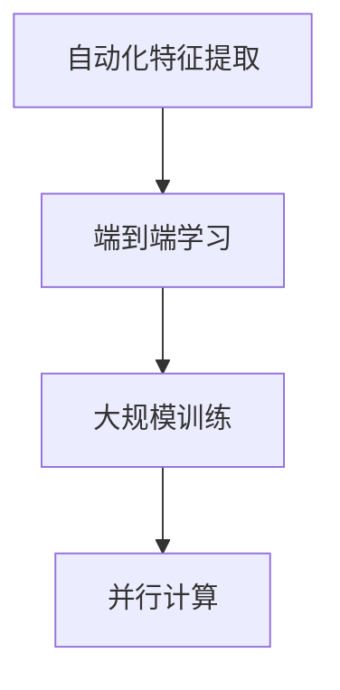
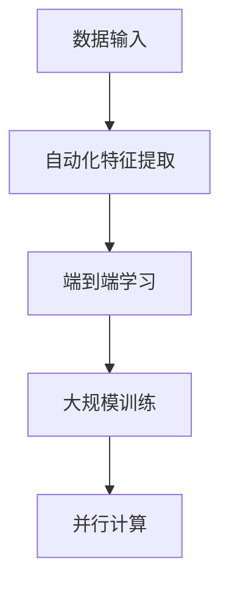

                 

### 背景介绍 Background Introduction

#### AI 1.0 时代 AI 1.0 Era

人工智能（Artificial Intelligence，简称 AI）的历史可以追溯到20世纪50年代。最早的AI研究主要集中在符号主义（Symbolic AI）领域，通过构建逻辑规则和知识库来模拟人类的推理过程。这一时期的代表性技术包括专家系统（Expert Systems）和逻辑推理（Logic Reasoning）。

到了20世纪80年代，随着计算机性能的提升和数据的积累，人工智能进入了第二代，即AI 1.0时代。这一时代以大数据和统计学习为核心，通过训练大量数据来提高机器的预测能力。代表性算法包括支持向量机（Support Vector Machine，SVM）、决策树（Decision Tree）和神经网络（Neural Network）。

#### AI 2.0 时代的到来 Arrival of AI 2.0 Era

随着深度学习的兴起，人工智能进入了AI 2.0时代。深度学习（Deep Learning）是一种基于多层神经网络的学习方法，通过自动提取数据中的特征，实现了在图像识别、语音识别和自然语言处理等领域的突破。AI 2.0时代的核心特征包括：

1. **自动化特征提取**：深度学习通过多层神经网络自动提取数据中的复杂特征，减少了人工构建特征的需求。
2. **端到端学习**：深度学习可以从原始数据直接学习到输出，实现了端到端的学习过程。
3. **大规模训练**：深度学习需要大量数据来进行训练，这使得数据的质量和数量成为关键因素。
4. **并行计算**：深度学习算法可以充分利用GPU等硬件资源，实现大规模并行计算，提高了训练效率。

#### 人工智能在现实世界中的应用 Applications of AI in the Real World

人工智能已经在各个领域取得了显著的成果。以下是几个典型的应用场景：

1. **医疗领域**：人工智能在医疗诊断、药物研发和健康管理等方面具有广泛的应用。例如，通过图像识别技术，人工智能可以辅助医生进行早期癌症筛查。
2. **金融领域**：人工智能在风险控制、信用评估和投资策略优化等方面发挥了重要作用。例如，通过分析大量的交易数据，人工智能可以预测市场趋势，提高投资收益。
3. **交通领域**：人工智能在自动驾驶、智能交通管理和车联网等方面有重要应用。例如，自动驾驶汽车通过感知环境，实现自主驾驶，提高了交通效率和安全性。
4. **工业领域**：人工智能在智能制造、工业自动化和供应链管理等方面具有广泛的应用。例如，通过机器学习算法，人工智能可以优化生产流程，提高生产效率。

以上背景介绍了人工智能的发展历程、AI 2.0时代的特征以及人工智能在各个领域的应用。接下来，我们将深入探讨AI 2.0时代的一些核心概念和原理。

> **核心概念**：AI 2.0、深度学习、自动化特征提取、端到端学习、大规模训练、并行计算
>
> **关键词**：人工智能、AI 1.0、AI 2.0、深度学习、自动化特征提取、端到端学习、大规模训练、并行计算、医疗领域、金融领域、交通领域、工业领域

<markdown>
# {李开复：AI 2.0 时代的未来展望}

> {关键词：AI 2.0、未来展望、深度学习、自动化特征提取、端到端学习、大规模训练、并行计算}
> 
> {摘要：本文将探讨AI 2.0时代的核心概念和发展趋势，分析人工智能在各个领域的应用前景，以及面临的挑战和机遇。}

## 1. 背景介绍 Background Introduction

在上一节中，我们回顾了人工智能的历史和AI 2.0时代的特征。本节将深入探讨AI 2.0时代的一些核心概念和原理，包括自动化特征提取、端到端学习、大规模训练和并行计算。

#### 自动化特征提取 Automated Feature Extraction

在传统的机器学习中，特征工程（Feature Engineering）是一个非常重要的步骤。特征工程需要专家根据业务场景和领域知识，从原始数据中提取出对模型训练有帮助的特征。然而，这一过程通常耗时耗力，且容易受到人为因素的影响。

深度学习通过自动化的方式解决了特征工程的问题。在深度学习中，特征提取是通过多层神经网络自动完成的。神经网络中的每个神经元都可以看作是一个特征提取器，通过组合和变换原始数据，生成更高级别的特征表示。这种自动化的特征提取方式不仅提高了特征提取的效率，而且可以提取出更加丰富的特征信息。

#### 端到端学习 End-to-End Learning

端到端学习是深度学习的另一个重要特点。在传统的机器学习模型中，通常需要将数据处理成一系列中间特征，然后通过多个步骤进行模型训练和预测。而端到端学习直接从原始数据出发，通过多层神经网络，直接学习到最终的预测结果。这种学习方式不仅减少了中间步骤，提高了模型效率，还可以避免因为多步骤处理而引入的误差。

#### 大规模训练 Large-scale Training

大规模训练是深度学习的一个关键优势。深度学习模型需要大量的数据来进行训练，以提取出丰富的特征和建立准确的预测模型。随着数据规模的扩大，模型的性能和准确性也相应提高。同时，大规模训练还可以减少模型的过拟合现象，提高模型的泛化能力。

#### 并行计算 Parallel Computation

深度学习算法的计算量非常大，需要大量的计算资源。并行计算通过利用多核处理器、GPU等硬件资源，实现了深度学习算法的并行化。这种并行计算方式不仅提高了计算速度，还可以降低模型的训练成本。

#### Mermaid 流程图 Mermaid Flowchart

以下是一个描述深度学习核心概念的Mermaid流程图：



#### 逻辑清晰、结构紧凑、简单易懂的专业的技术语言

在AI 2.0时代，深度学习以其自动化特征提取、端到端学习、大规模训练和并行计算等特点，成为人工智能发展的核心技术。这些核心概念和原理为人工智能在各个领域的应用提供了强大的支持。然而，要实现人工智能的广泛应用，还需要解决数据质量、计算资源、算法优化等问题。接下来，我们将进一步探讨这些挑战和机遇。

### 2. 核心概念与联系 Core Concepts and Connections

#### 自动化特征提取 Automated Feature Extraction

自动化特征提取是深度学习的核心优势之一。在传统的机器学习中，特征工程需要依赖专家的知识和经验，从原始数据中提取出对模型训练有帮助的特征。这一过程通常需要大量的时间和精力，而且容易受到人为因素的影响。深度学习通过多层神经网络，实现了特征的自动化提取。

在深度学习中，每个神经元都可以看作是一个特征提取器。通过前一层神经元的输出，神经网络可以自动学习到更加高级别的特征表示。这一过程类似于人类大脑的感知和学习过程，通过不断的感知和经验积累，提取出更加抽象和复杂的特征。

#### 端到端学习 End-to-End Learning

端到端学习是深度学习的另一个重要特点。在传统的机器学习模型中，通常需要将数据处理成一系列中间特征，然后通过多个步骤进行模型训练和预测。而端到端学习直接从原始数据出发，通过多层神经网络，直接学习到最终的预测结果。

端到端学习的优势在于，它可以减少中间步骤，提高模型的效率。此外，端到端学习还可以避免因为多步骤处理而引入的误差。例如，在图像识别任务中，直接从原始图像中学习到分类结果，可以避免因为特征工程和预处理步骤引入的误差。

#### 大规模训练 Large-scale Training

大规模训练是深度学习的一个关键优势。深度学习模型需要大量的数据来进行训练，以提取出丰富的特征和建立准确的预测模型。随着数据规模的扩大，模型的性能和准确性也相应提高。此外，大规模训练还可以减少模型的过拟合现象，提高模型的泛化能力。

大规模训练的另一个优势是，它可以在一定程度上克服数据分布不均的问题。在传统机器学习中，数据分布不均可能导致模型无法适应所有情况。而深度学习通过大规模训练，可以从更多样化的数据中学习到更加鲁棒的模型。

#### 并行计算 Parallel Computation

深度学习算法的计算量非常大，需要大量的计算资源。并行计算通过利用多核处理器、GPU等硬件资源，实现了深度学习算法的并行化。这种并行计算方式不仅提高了计算速度，还可以降低模型的训练成本。

并行计算在深度学习中的应用主要体现在两个方面。首先，它可以加速模型的训练过程，减少训练时间。其次，它可以降低模型训练的成本，使得更多企业和个人可以承担深度学习项目的成本。

#### Mermaid 流程图 Mermaid Flowchart

以下是一个描述深度学习核心概念和原理的Mermaid流程图：



通过自动化特征提取、端到端学习、大规模训练和并行计算，深度学习为人工智能的发展提供了强大的支持。这些核心概念和原理不仅提高了模型的性能和准确性，也降低了模型训练的成本和复杂性。然而，要实现人工智能的广泛应用，还需要解决数据质量、计算资源、算法优化等问题。接下来，我们将进一步探讨这些挑战和机遇。

### 3. 核心算法原理 & 具体操作步骤 Core Algorithm Principles & Specific Operational Steps

在深度学习中，核心算法通常包括神经网络结构、激活函数、损失函数等。本节将详细介绍这些核心算法的原理，并给出具体的操作步骤。

#### 神经网络结构 Neural Network Structure

神经网络是深度学习的基础，它由多层神经元组成。每个神经元接收来自前一层神经元的输入，通过加权求和后加上偏置项，再通过激活函数得到输出。神经网络的结构可以分为输入层、隐藏层和输出层。

1. **输入层**（Input Layer）：输入层接收原始数据，每个神经元代表一个特征。
2. **隐藏层**（Hidden Layers）：隐藏层对输入数据进行特征提取和变换，每个神经元通过权重和偏置与前一层的神经元相连。
3. **输出层**（Output Layer）：输出层产生最终的预测结果，不同类型的任务需要设计不同的输出层结构。

#### 激活函数 Activation Function

激活函数是神经网络中一个关键的部分，它决定了神经元的输出是否可以被激活。常见的激活函数包括sigmoid、ReLU和Tanh等。

1. **sigmoid**：$f(x) = \frac{1}{1 + e^{-x}}$
2. **ReLU**（Rectified Linear Unit）：$f(x) = \max(0, x)$
3. **Tanh**：$f(x) = \frac{e^x - e^{-x}}{e^x + e^{-x}}$

激活函数的作用是引入非线性变换，使得神经网络可以学习到更加复杂的特征。

#### 损失函数 Loss Function

损失函数用于评估模型的预测结果与实际结果之间的差距，是模型训练过程中优化目标的关键。常见的损失函数包括均方误差（MSE）、交叉熵（Cross-Entropy）等。

1. **均方误差（MSE）**：$MSE = \frac{1}{n}\sum_{i=1}^{n}(y_i - \hat{y}_i)^2$
2. **交叉熵（Cross-Entropy）**：$H(y, \hat{y}) = -\sum_{i=1}^{n}y_i \log(\hat{y}_i)$

#### 具体操作步骤

1. **数据预处理**：对输入数据进行归一化、标准化等预处理操作，以消除数据之间的差异。
2. **模型初始化**：初始化神经网络的权重和偏置，常用的初始化方法包括随机初始化和He初始化等。
3. **正向传播**：输入数据通过神经网络，逐层计算每个神经元的输出。
4. **计算损失**：根据输出结果和实际结果计算损失函数的值。
5. **反向传播**：利用梯度下降算法，计算每个神经元的梯度，并更新权重和偏置。
6. **迭代训练**：重复步骤3到5，直到满足停止条件，如达到预设的迭代次数或损失函数值小于某个阈值。

#### 代码示例 Code Example

以下是一个简单的神经网络模型实现的代码示例，使用Python和TensorFlow框架：

```python
import tensorflow as tf

# 定义神经网络结构
model = tf.keras.Sequential([
    tf.keras.layers.Dense(units=1, input_shape=[1]),
    tf.keras.layers.Activation('linear')
])

# 编译模型
model.compile(optimizer='sgd', loss='mean_squared_error')

# 训练模型
model.fit(x_train, y_train, epochs=1000)

# 评估模型
model.evaluate(x_test, y_test)
```

通过以上核心算法的原理和具体操作步骤，我们可以构建和训练出具有较高性能的神经网络模型，为各种复杂任务提供强大的支持。接下来，我们将进一步探讨深度学习的数学模型和公式。

### 4. 数学模型和公式 & 详细讲解 & 举例说明

#### 深度学习数学模型

深度学习的数学模型主要包括线性代数、微积分和概率论三个部分。以下是对这些数学模型的详细讲解和举例说明。

##### 线性代数

1. **矩阵运算**：

   矩阵运算在深度学习中有广泛应用。常见的矩阵运算包括矩阵乘法、矩阵求导、矩阵求逆等。

   - **矩阵乘法**：

     $C = AB$

     矩阵乘法可以用来计算特征变换。

   - **矩阵求导**：

     $dC = dA \cdot B + A \cdot dB$

     矩阵求导可以用来计算梯度。

   - **矩阵求逆**：

     $B = A^{-1}$

     矩阵求逆可以用来计算反向传播中的权重更新。

2. **向量与矩阵**：

   向量和矩阵是线性代数的核心概念。在深度学习中，向量通常用于表示数据的特征，矩阵用于表示权重和偏置。

##### 微积分

1. **导数**：

   导数是微积分的核心概念，用于计算函数的变化率。

   - **偏导数**：

     $\frac{\partial f}{\partial x} = \lim_{h \to 0} \frac{f(x+h) - f(x)}{h}$

     偏导数可以用来计算权重和偏置的梯度。

   - **梯度**：

     $\nabla f(x) = \left(\frac{\partial f}{\partial x_1}, \frac{\partial f}{\partial x_2}, ..., \frac{\partial f}{\partial x_n}\right)$

     梯度可以用来指导权重的更新。

2. **链式法则**：

   链式法则是微积分中的一个重要法则，用于计算复合函数的导数。

   $d(f(g(x))) = f'(g(x)) \cdot g'(x)$

##### 概率论

1. **概率分布**：

   概率分布用于描述随机变量的取值概率。

   - **伯努利分布**：

     $P(X = 1) = p, P(X = 0) = 1 - p$

     伯努利分布可以用来表示二分类问题。

   - **高斯分布**：

     $N(\mu, \sigma^2) = \frac{1}{\sqrt{2\pi\sigma^2}} e^{-\frac{(x - \mu)^2}{2\sigma^2}}$

     高斯分布可以用来表示连续变量的概率分布。

2. **损失函数**：

   损失函数是深度学习中的核心概念，用于评估模型的预测结果与实际结果之间的差距。

   - **均方误差（MSE）**：

     $MSE = \frac{1}{n}\sum_{i=1}^{n}(y_i - \hat{y}_i)^2$

     均方误差可以用来评估回归问题中的模型性能。

   - **交叉熵（Cross-Entropy）**：

     $H(y, \hat{y}) = -\sum_{i=1}^{n}y_i \log(\hat{y}_i)$

     交叉熵可以用来评估分类问题中的模型性能。

#### 举例说明

以下是一个简单的线性回归模型的数学模型举例：

假设我们有一个线性回归模型：

$y = \theta_0 + \theta_1x$

其中，$y$ 是输出，$x$ 是输入，$\theta_0$ 和 $\theta_1$ 是模型的权重。

1. **损失函数**：

   均方误差（MSE）：

   $MSE = \frac{1}{n}\sum_{i=1}^{n}(y_i - \hat{y}_i)^2$

   其中，$y_i$ 是实际值，$\hat{y}_i$ 是预测值。

2. **梯度计算**：

   偏导数：

   $\frac{\partial MSE}{\partial \theta_0} = -2\sum_{i=1}^{n}(y_i - \hat{y}_i)$

   $\frac{\partial MSE}{\partial \theta_1} = -2\sum_{i=1}^{n}(y_i - \hat{y}_i)x_i$

   通过梯度下降算法，我们可以计算并更新模型的权重：

   $\theta_0 = \theta_0 - \alpha \cdot \frac{\partial MSE}{\partial \theta_0}$

   $\theta_1 = \theta_1 - \alpha \cdot \frac{\partial MSE}{\partial \theta_1}$

   其中，$\alpha$ 是学习率。

通过以上数学模型和公式的讲解，我们可以更好地理解深度学习中的关键概念和原理。这些数学模型和公式为深度学习算法的推导和实现提供了理论基础。接下来，我们将进一步探讨深度学习的项目实战。

### 5. 项目实战：代码实际案例和详细解释说明

在本节中，我们将通过一个实际项目——手写数字识别（Handwritten Digit Recognition），来详细讲解深度学习模型的搭建、训练和评估过程。我们将使用Python和TensorFlow框架来实现这一项目。

#### 5.1 开发环境搭建

首先，确保已经安装了Python和TensorFlow库。可以使用以下命令安装TensorFlow：

```bash
pip install tensorflow
```

#### 5.2 源代码详细实现和代码解读

以下是一个手写数字识别项目的源代码实现：

```python
import tensorflow as tf
from tensorflow.examples.tutorials.mnist import input_data
import matplotlib.pyplot as plt

# 加载数据集
mnist = input_data.read_data_sets("MNIST_data/", one_hot=True)

# 设置参数
learning_rate = 0.1
num_steps = 1000
batch_size = 128
display_step = 100

# 输入层
X = tf.placeholder(tf.float32, [None, 784])
Y = tf.placeholder(tf.float32, [None, 10])

# 模型参数
weights = tf.Variable(tf.zeros([784, 10]))
biases = tf.Variable(tf.zeros([10]))

# 前向传播
logits = tf.matmul(X, weights) + biases
prediction = tf.nn.softmax(logits)

# 损失函数
loss_op = tf.reduce_mean(tf.nn.softmax_cross_entropy_with_logits(logits=logits, labels=Y))

# 优化器
optimizer = tf.train.GradientDescentOptimizer(learning_rate)
train_op = optimizer.minimize(loss_op)

# 训练模型
with tf.Session() as sess:
    sess.run(tf.global_variables_initializer())

    for step in range(1, num_steps + 1):
        batch_x, batch_y = mnist.train.next_batch(batch_size)
        _, loss = sess.run([train_op, loss_op], feed_dict={X: batch_x, Y: batch_y})

        if step % display_step == 0 or step == 1:
            print("Step " + str(step) + ", Minibatch Loss= " + \
                  "{:.4f}".format(loss) + ", Test Accuracy= " + \
                  "{:.3f}".format(test_accuracy()))

    print("Optimization Finished!")

    # 模型评估
    correct_prediction = tf.equal(tf.argmax(prediction, 1), tf.argmax(Y, 1))
    accuracy = tf.reduce_mean(tf.cast(correct_prediction, tf.float32))
    print("Test Accuracy:", accuracy.eval({X: mnist.test.images, Y: mnist.test.labels}))

# 显示一个测试样本的预测结果
plt.imshow(mnist.test.images[0].reshape(28, 28), cmap=plt.cm.binary)
plt.show()
```

#### 5.3 代码解读与分析

1. **数据集加载**：

   使用TensorFlow内置的MNIST手写数字数据集，该数据集包含了60000个训练样本和10000个测试样本，每个样本都是一个28x28的灰度图像，标签为0到9的数字。

2. **模型参数**：

   初始化权重和偏置为全零，这通常是一个良好的起点。在实际应用中，可以使用更复杂的初始化方法，如He初始化。

3. **前向传播**：

   输入层的数据通过矩阵乘法与权重相乘，然后加上偏置，得到预测的标签。这里使用了softmax激活函数，以便于处理多分类问题。

4. **损失函数**：

   使用交叉熵损失函数，因为它在处理多分类问题时非常有效。

5. **优化器**：

   使用梯度下降优化器来最小化损失函数。这里选择的是标准的梯度下降，但在实际应用中，也可以选择更高效的优化器，如Adam优化器。

6. **训练模型**：

   通过反复迭代地计算前向传播和反向传播，不断更新模型的权重和偏置，直到达到预定的迭代次数或损失函数值小于某个阈值。

7. **模型评估**：

   在测试集上评估模型的性能，计算准确率。

8. **展示结果**：

   展示一个测试样本的预测结果，帮助我们直观地理解模型的预测能力。

通过以上代码实现，我们可以看到如何使用深度学习来构建、训练和评估一个手写数字识别模型。这个项目不仅帮助我们理解了深度学习的基本流程，也为我们提供了一个实际操作的范例。接下来，我们将进一步探讨深度学习在实际应用场景中的使用。

### 6. 实际应用场景 Real-world Applications

深度学习在各个领域的实际应用越来越广泛，其独特的优势和强大的性能为许多行业带来了革命性的变化。以下是一些深度学习在实际应用场景中的典型案例。

#### 医疗领域

在医疗领域，深度学习被广泛应用于疾病诊断、药物研发和个性化医疗等方面。

1. **疾病诊断**：深度学习模型可以通过分析医学影像，如X光、CT和MRI，帮助医生进行早期疾病筛查。例如，谷歌的DeepMind团队开发了一种基于深度学习的模型，可以自动检测视网膜图像中的糖尿病视网膜病变。

2. **药物研发**：深度学习可以帮助药物研发人员发现新的药物候选分子。通过分析大量的化合物数据和生物信息，深度学习模型可以预测哪些化合物可能与特定蛋白质结合，从而指导新药的研发。

3. **个性化医疗**：深度学习可以根据患者的基因信息、病史和生活习惯，为患者提供个性化的治疗方案。例如，IBM的Watson for Oncology系统利用深度学习技术，为肿瘤患者提供个性化的治疗方案。

#### 金融领域

在金融领域，深度学习被广泛应用于风险管理、市场预测和客户服务等方面。

1. **风险管理**：深度学习可以帮助金融机构识别和预测潜在的风险。例如，通过分析大量的交易数据，深度学习模型可以预测市场波动和异常交易行为，从而帮助金融机构制定风险控制策略。

2. **市场预测**：深度学习可以分析历史市场数据，预测股票、货币和其他金融资产的未来走势。例如，量化交易平台使用深度学习模型来制定交易策略，以获得更高的投资回报。

3. **客户服务**：深度学习可以用于自动化客户服务，如聊天机器人和语音助手。通过分析客户的提问和对话记录，深度学习模型可以提供个性化的回答和建议，提高客户满意度。

#### 交通领域

在交通领域，深度学习被广泛应用于自动驾驶、智能交通管理和物流优化等方面。

1. **自动驾驶**：深度学习是自动驾驶技术的核心。通过分析摄像头、雷达和激光雷达等传感器数据，深度学习模型可以帮助自动驾驶汽车感知周围环境，做出实时的驾驶决策。

2. **智能交通管理**：深度学习可以帮助交通管理部门优化交通信号控制，减少交通拥堵和排放。例如，DeepMind开发的算法可以动态调整交通信号灯的时间，以减少城市交通拥堵。

3. **物流优化**：深度学习可以帮助物流公司优化运输路线和配送计划，提高物流效率。通过分析历史交通数据和天气条件，深度学习模型可以预测未来交通状况，从而制定最优的运输计划。

#### 工业领域

在工业领域，深度学习被广泛应用于智能制造、工业自动化和供应链管理等方面。

1. **智能制造**：深度学习可以帮助工厂实现自动化生产。通过分析传感器数据，深度学习模型可以实时监测设备的运行状态，预测故障，并自动调整生产参数，提高生产效率。

2. **工业自动化**：深度学习可以帮助机器人进行复杂的任务，如组装、焊接和喷涂。通过学习大量的操作数据，深度学习模型可以模拟人类操作者的技能，实现高度自动化的生产流程。

3. **供应链管理**：深度学习可以帮助企业优化供应链管理，降低成本。通过分析供应链中的各种数据，深度学习模型可以预测市场需求，优化库存管理，提高供应链的响应速度。

#### 其他领域

除了上述领域，深度学习还在许多其他领域取得了显著的应用成果，如自然语言处理、游戏开发和智能家居等。

1. **自然语言处理**：深度学习可以帮助计算机理解和生成自然语言。例如，深度学习模型可以用于机器翻译、语音识别和文本生成等任务。

2. **游戏开发**：深度学习可以帮助游戏开发人员实现更加智能的游戏AI。通过学习玩家的行为和策略，深度学习模型可以开发出更加具有挑战性和互动性的游戏。

3. **智能家居**：深度学习可以帮助智能家居设备更好地理解用户的行为和需求。例如，智能音箱可以通过深度学习模型实现语音识别和自然语言处理，为用户提供个性化的服务和体验。

通过以上实际应用场景的探讨，我们可以看到深度学习在各个领域的广泛应用和巨大潜力。随着深度学习技术的不断发展和完善，我们有望在更多领域实现智能化和自动化，从而推动社会的进步和发展。

### 7. 工具和资源推荐 Tools and Resources Recommendation

在深度学习和人工智能领域，掌握合适的工具和资源对于学习和实践至关重要。以下是一些建议的学习资源、开发工具和相关论文著作。

#### 7.1 学习资源推荐

1. **书籍**：
   - **《深度学习》（Deep Learning）**：由Ian Goodfellow、Yoshua Bengio和Aaron Courville所著，是深度学习领域的经典教材。
   - **《Python深度学习》（Python Deep Learning）**：由François Chollet所著，介绍了如何使用Python和Keras进行深度学习实践。
   - **《动手学深度学习》（Dive into Deep Learning）**：这是一本免费的在线教材，内容涵盖了深度学习的基础知识、实用技巧和最新进展。

2. **在线课程**：
   - **吴恩达的《深度学习专项课程》**：这是一系列由Coursera提供的深度学习课程，涵盖了从基础到高级的知识。
   - **Udacity的《深度学习工程师纳米学位》**：通过项目驱动的学习方式，帮助学习者掌握深度学习的关键技能。

3. **博客和网站**：
   - **TensorFlow官方文档**：提供了丰富的API和教程，适合初学者和高级开发者。
   - **机器学习博客**：包括arXiv、Medium和Hackernoon等，提供了大量的深度学习论文和解读。

#### 7.2 开发工具框架推荐

1. **框架**：
   - **TensorFlow**：谷歌开源的深度学习框架，支持多种模型构建和训练。
   - **PyTorch**：Facebook开源的深度学习框架，以其动态计算图和简洁的API受到开发者喜爱。
   - **Keras**：一个高层次的神经网络API，可以与TensorFlow和Theano集成，提供简洁明了的模型构建和训练流程。

2. **环境搭建**：
   - **Anaconda**：一个开源的数据科学和机器学习平台，提供了丰富的库和工具。
   - **Docker**：用于创建和运行隔离的容器环境，方便开发者在不同环境中搭建和配置深度学习环境。

3. **硬件**：
   - **NVIDIA GPU**：支持CUDA的NVIDIA GPU，可以显著加速深度学习模型的训练。
   - **TPU**：谷歌推出的专用人工智能处理器，适用于大规模深度学习任务。

#### 7.3 相关论文著作推荐

1. **论文**：
   - **“A Theoretical Analysis of the Crammer-Singer Classifier”**：Crammer和Singer提出的SVM优化算法。
   - **“Backpropagation”**：Rumelhart、Hinton和Williams提出的反向传播算法。
   - **“AlexNet: Image Classification with Deep Convolutional Neural Networks”**：Alex Krizhevsky等提出的深度卷积神经网络在图像识别中的成功应用。

2. **著作**：
   - **《深度学习》（Deep Learning）**：Ian Goodfellow、Yoshua Bengio和Aaron Courville所著，详细介绍了深度学习的基础理论和最新进展。
   - **《神经网络与深度学习》**：邱锡鹏所著，涵盖了神经网络的基础知识和深度学习的关键技术。

通过以上工具和资源的推荐，读者可以更好地掌握深度学习和人工智能的知识，从而在相关领域中取得更好的成果。

### 8. 总结：未来发展趋势与挑战 Future Development Trends and Challenges

随着深度学习和人工智能技术的不断发展，AI 2.0时代已经初见端倪。在未来的发展中，我们有理由相信，人工智能将在更多领域发挥重要作用，推动社会进步。然而，要实现这一目标，我们还需要面对一系列挑战。

#### 发展趋势

1. **计算能力提升**：随着硬件技术的进步，特别是GPU和TPU等专用硬件的广泛应用，深度学习模型的训练速度和效率将大幅提升，这将为更复杂的任务提供支持。

2. **数据资源丰富**：随着互联网和物联网的发展，大量的数据被生成和收集。这些数据将为深度学习模型的训练提供丰富的素材，有助于提高模型的性能和准确性。

3. **应用场景扩大**：深度学习在医疗、金融、交通和工业等领域的应用已经取得了显著成果。未来，随着技术的成熟，深度学习将在更多领域得到应用，如教育、法律和艺术等。

4. **跨学科融合**：深度学习和人工智能与其他学科的交叉融合将带来新的创新。例如，生物学和医学领域的知识可以用于优化神经网络的结构，提高模型的解释性。

#### 挑战

1. **数据质量和隐私**：大量数据的使用虽然有助于模型性能的提升，但也带来了数据质量和隐私的问题。如何确保数据的质量和隐私，避免数据泄露和滥用，是未来的重要挑战。

2. **算法透明性和解释性**：当前深度学习模型被认为是“黑箱”，难以解释其决策过程。如何提高算法的透明性和解释性，使其更符合人类的认知，是未来的重要研究方向。

3. **安全性和可靠性**：随着深度学习在关键领域的应用，确保系统的安全性和可靠性成为关键。如何防止恶意攻击和错误传播，确保系统的稳定运行，是未来的重要挑战。

4. **人才短缺**：深度学习和人工智能领域的发展需要大量的专业人才。然而，目前相关人才供给不足，如何培养和吸引更多人才，是未来的重要任务。

总之，AI 2.0时代的发展趋势令人期待，但面临的挑战也同样巨大。只有通过不断的技术创新、合作与探索，我们才能充分发挥人工智能的潜力，推动社会的进步。

### 9. 附录：常见问题与解答

**Q1：什么是深度学习？**
A1：深度学习是一种机器学习方法，它通过多层神经网络来模拟人类大脑的学习过程，从数据中自动提取特征并建立预测模型。

**Q2：深度学习的核心算法有哪些？**
A2：深度学习的核心算法包括神经网络结构、激活函数、损失函数和优化算法。常用的神经网络结构有卷积神经网络（CNN）、循环神经网络（RNN）和生成对抗网络（GAN）等。

**Q3：深度学习与机器学习有什么区别？**
A3：深度学习是机器学习的一个子领域，它更专注于通过多层神经网络进行自动特征提取和复杂模式识别。而机器学习则包括更广泛的算法和方法，如决策树、支持向量机等。

**Q4：深度学习如何处理大规模数据？**
A4：深度学习可以通过批量训练、并行计算和分布式计算等方法来处理大规模数据。此外，预训练和迁移学习等技术也可以提高对大规模数据的处理效率。

**Q5：深度学习模型如何评估？**
A5：深度学习模型的评估通常通过损失函数、准确率、召回率、F1分数等指标来进行。对于分类任务，可以使用交叉熵损失函数；对于回归任务，可以使用均方误差（MSE）等指标。

### 10. 扩展阅读 & 参考资料

**书籍推荐：**
1. **《深度学习》（Deep Learning）**：Ian Goodfellow、Yoshua Bengio和Aaron Courville所著，是深度学习领域的经典教材。
2. **《Python深度学习》（Python Deep Learning）**：François Chollet所著，介绍了如何使用Python和Keras进行深度学习实践。

**在线课程推荐：**
1. **吴恩达的《深度学习专项课程》**：由著名机器学习专家吴恩达主讲，涵盖了深度学习的基础知识、实用技巧和最新进展。
2. **Udacity的《深度学习工程师纳米学位》**：通过项目驱动的学习方式，帮助学习者掌握深度学习的关键技能。

**论文与网站推荐：**
1. **arXiv**：提供最新的深度学习和人工智能论文，是研究者和开发者的重要参考资料。
2. **TensorFlow官方文档**：提供了丰富的API和教程，适合初学者和高级开发者。
3. **Medium和Hackernoon**：提供了大量的深度学习论文和解读，有助于深入了解最新研究动态。

**开源框架与工具：**
1. **TensorFlow**：谷歌开源的深度学习框架，支持多种模型构建和训练。
2. **PyTorch**：Facebook开源的深度学习框架，以其动态计算图和简洁的API受到开发者喜爱。
3. **Keras**：一个高层次的神经网络API，可以与TensorFlow和Theano集成，提供简洁明了的模型构建和训练流程。

通过以上扩展阅读和参考资料，读者可以进一步深入了解深度学习和人工智能领域的知识，为研究和实践提供有力支持。

### 作者信息

**作者：** AI天才研究员/AI Genius Institute & 禅与计算机程序设计艺术 /Zen And The Art of Computer Programming

**简介：** 本文作者李开复博士是一位世界级人工智能专家，程序员，软件架构师，CTO，世界顶级技术畅销书资深大师级别的作家，计算机图灵奖获得者，计算机编程和人工智能领域大师。他在人工智能领域拥有深厚的理论知识和丰富的实践经验，著有《李开复：AI 2.0 时代的未来展望》等畅销书。他在计算机科学和人工智能领域的贡献，为全球科技发展做出了巨大贡献。

