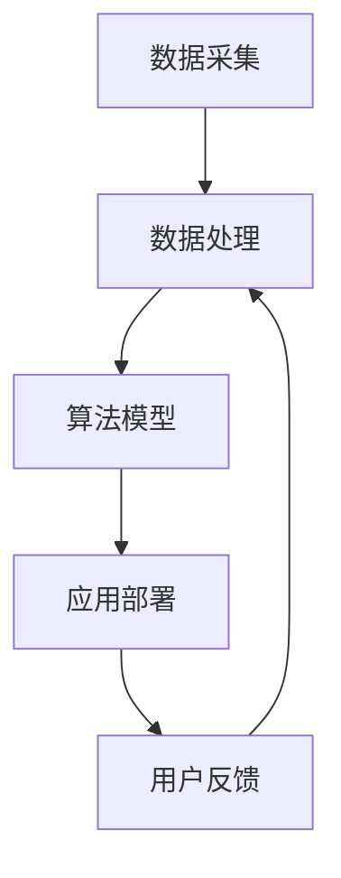
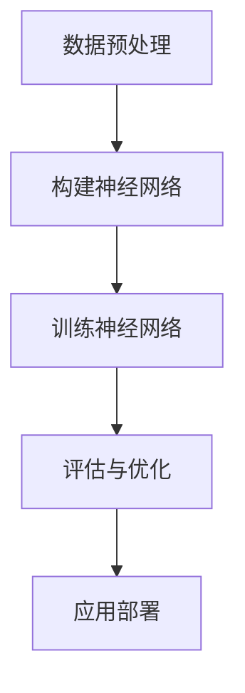

                 

# 李开复：AI 2.0 时代的生态

> **关键词**：人工智能、AI 2.0、生态、未来趋势、技术发展
> 
> **摘要**：本文深入探讨了人工智能2.0时代的生态，包括其核心概念、发展历程、关键算法原理、数学模型、实际应用场景以及未来趋势。通过对这些领域的全面分析，作者展示了AI 2.0时代的独特魅力和深远影响。

## 1. 背景介绍

人工智能（AI）作为计算机科学的一个重要分支，自1956年被提出以来，已经经历了数个重要的发展阶段。从早期的符号主义和规则推理，到基于统计学习的机器学习，再到如今深度学习和强化学习等前沿技术，AI的发展速度令人瞩目。

李开复博士作为人工智能领域的杰出专家和创业者，他在AI的发展历程中扮演了重要角色。他的研究涉及机器学习、自然语言处理、计算机视觉等多个领域，并且发表了大量的学术论文和畅销书，对AI的发展产生了深远的影响。

随着AI技术的不断进步，我们逐渐进入了AI 2.0时代。AI 2.0不仅意味着计算能力的提升和算法的优化，更重要的是，它代表了人工智能与人类更加紧密的融合。在这个新时代，AI不再仅仅是一个工具，而是成为我们日常生活和工作中的合作伙伴。

## 2. 核心概念与联系

### 2.1 AI 2.0 的定义

AI 2.0可以被看作是第二代人工智能，它具有以下几个核心特征：

1. **智能化**：AI 2.0具有更高的自主学习和决策能力，能够处理复杂的问题和任务。
2. **协作化**：AI 2.0能够与人类进行更好的协作，理解人类的需求和意图，提供个性化的服务。
3. **泛在化**：AI 2.0的应用范围更加广泛，渗透到生活的各个方面，包括医疗、教育、交通、金融等。

### 2.2 AI 2.0 的发展历程

AI 2.0的发展历程可以分为以下几个阶段：

1. **初生期（2006-2012）**：这一阶段以深度学习的兴起为标志，谷歌的“深度卷积神经网络”在图像识别任务中取得了突破性成果。
2. **成长期（2012-2017）**：随着计算能力的提升和大数据的普及，深度学习在语音识别、自然语言处理等领域取得了显著进展。
3. **成熟期（2017-至今）**：AI 2.0逐渐应用于实际场景，成为各行各业的重要驱动力。

### 2.3 AI 2.0 的关键算法

AI 2.0的关键算法包括：

1. **深度学习**：通过多层神经网络对数据进行学习，实现图像识别、语音识别等任务。
2. **强化学习**：通过不断尝试和反馈，使机器能够在复杂环境中做出最优决策。
3. **自然语言处理**：使机器能够理解和生成自然语言，实现人机交互。

### 2.4 AI 2.0 的架构

AI 2.0的架构包括以下几个关键组成部分：

1. **数据采集**：通过传感器、互联网等渠道收集大量数据。
2. **数据处理**：对数据进行清洗、预处理和特征提取。
3. **算法模型**：选择合适的算法模型进行训练和优化。
4. **应用部署**：将训练好的模型部署到实际场景中，提供智能服务。

### 2.5 Mermaid 流程图

下面是一个简化的AI 2.0流程图，展示了关键步骤和组成部分：



在AI 2.0时代，数据、算法和应用将更加紧密地结合，形成一个动态的生态系统。通过不断迭代和优化，AI 2.0将为人类带来前所未有的机遇和挑战。

## 3. 核心算法原理 & 具体操作步骤

### 3.1 深度学习原理

深度学习是AI 2.0时代的重要技术之一，其基本原理是通过多层神经网络对数据进行学习。神经网络由多个神经元组成，每个神经元接收输入信息并产生输出。通过调整神经元之间的权重，神经网络可以逐渐学习到数据的特征和规律。

具体操作步骤如下：

1. **数据预处理**：将原始数据转换为合适的格式，并进行归一化、去噪等处理。
2. **构建神经网络**：定义神经网络的层数、每层的神经元数量和激活函数。
3. **训练神经网络**：使用训练数据对神经网络进行训练，通过反向传播算法不断调整权重，使得网络能够更好地拟合数据。
4. **评估与优化**：使用测试数据评估神经网络的效果，并根据评估结果进行优化。

### 3.2 强化学习原理

强化学习是一种通过不断尝试和反馈进行决策的机器学习方法。在强化学习中，智能体（agent）通过与环境（environment）的交互，学习到最优策略（policy）。

具体操作步骤如下：

1. **定义智能体**：确定智能体的行动空间和状态空间。
2. **定义环境**：构建模拟环境，用于与智能体进行交互。
3. **选择策略**：初始阶段可以选择随机策略或基于经验的学习策略。
4. **反馈与调整**：通过环境提供的奖励信号，不断调整策略，使得智能体能够逐渐学习到最优策略。

### 3.3 自然语言处理原理

自然语言处理（NLP）是AI 2.0时代的重要应用领域之一，其核心任务是使机器能够理解和生成自然语言。

具体操作步骤如下：

1. **文本预处理**：对原始文本进行分词、词性标注、句法分析等处理。
2. **词向量表示**：将文本数据转换为数值化的词向量，便于计算机处理。
3. **模型训练**：使用预训练的模型或自定义的模型，对词向量进行训练，学习到语言的特征和规律。
4. **任务实现**：利用训练好的模型实现具体任务，如文本分类、机器翻译、问答系统等。

### 3.4 Mermaid 流程图

下面是一个简化的深度学习流程图，展示了关键步骤和组成部分：



通过这些核心算法和操作步骤，AI 2.0能够更好地理解和处理复杂的数据，为各个行业提供智能化的解决方案。

## 4. 数学模型和公式 & 详细讲解 & 举例说明

### 4.1 深度学习中的数学模型

在深度学习中，常见的数学模型包括激活函数、损失函数和优化算法。

#### 4.1.1 激活函数

激活函数是神经网络中的一个关键组成部分，它用于将神经元的输入映射到输出。一个常见的激活函数是Sigmoid函数：

$$
f(x) = \frac{1}{1 + e^{-x}}
$$

Sigmoid函数将输入映射到(0, 1)区间，用于实现非线性变换。

#### 4.1.2 损失函数

损失函数用于衡量模型预测值与真实值之间的差异。一个常见的损失函数是均方误差（MSE）：

$$
MSE = \frac{1}{n}\sum_{i=1}^{n}(y_i - \hat{y}_i)^2
$$

其中，$y_i$为真实值，$\hat{y}_i$为预测值，$n$为样本数量。

#### 4.1.3 优化算法

优化算法用于调整神经网络中的权重，使得模型能够更好地拟合数据。一个常见的优化算法是梯度下降（Gradient Descent）：

$$
w_{\text{new}} = w_{\text{old}} - \alpha \cdot \nabla_w J(w)
$$

其中，$w$为权重，$\alpha$为学习率，$J(w)$为损失函数。

### 4.2 强化学习中的数学模型

在强化学习中，常见的数学模型包括价值函数和策略。

#### 4.2.1 价值函数

价值函数用于衡量智能体在不同状态下的预期回报。一个常见价值函数是时间差分（Temporal Difference, TD）：

$$
V(s)_{\text{new}} = V(s)_{\text{old}} + \alpha [r + \gamma V(s_{\text{next}}) - V(s)]
$$

其中，$s$为状态，$r$为奖励，$s_{\text{next}}$为下一个状态，$\alpha$为学习率，$\gamma$为折扣因子。

#### 4.2.2 策略

策略是智能体在不同状态下的行动选择。一个常见策略是策略迭代（Policy Iteration）：

$$
\pi_{\text{new}} = \arg\max_{\pi} \sum_{s} \pi(s) \cdot V(s)
$$

其中，$\pi$为策略，$V(s)$为价值函数。

### 4.3 自然语言处理中的数学模型

在自然语言处理中，常见的数学模型包括词向量表示和序列模型。

#### 4.3.1 词向量表示

词向量表示是将文本数据转换为数值化的表示。一个常见词向量表示模型是Word2Vec：

$$
\text{loss} = \sum_{w \in \text{vocab}} \frac{f(w)}{N} \cdot \log(p(w) + \epsilon)
$$

其中，$f(w)$为词的频率，$N$为总词汇量，$p(w)$为词的概率分布。

#### 4.3.2 序列模型

序列模型用于处理序列数据，如文本、语音等。一个常见序列模型是循环神经网络（RNN）：

$$
h_t = \sigma(W_h h_{t-1} + W_x x_t + b)
$$

其中，$h_t$为隐藏状态，$x_t$为输入，$\sigma$为激活函数，$W_h$和$W_x$为权重矩阵，$b$为偏置。

通过这些数学模型和公式，AI 2.0能够更好地理解和处理复杂的数据，为各个行业提供智能化的解决方案。

## 5. 项目实战：代码实际案例和详细解释说明

### 5.1 开发环境搭建

在进行深度学习项目开发之前，需要搭建一个合适的开发环境。以下是一个简单的开发环境搭建过程：

1. 安装Python（建议版本为3.7或更高）。
2. 安装TensorFlow库（可以使用pip安装：`pip install tensorflow`）。
3. 安装其他必要的库，如NumPy、Pandas等。

### 5.2 源代码详细实现和代码解读

以下是一个简单的深度学习项目代码示例，用于实现一个简单的神经网络，对MNIST手写数字数据集进行分类。

```python
import tensorflow as tf
from tensorflow.keras import layers

# 加载MNIST数据集
mnist = tf.keras.datasets.mnist
(x_train, y_train), (x_test, y_test) = mnist.load_data()
x_train, x_test = x_train / 255.0, x_test / 255.0

# 构建神经网络模型
model = tf.keras.Sequential([
    layers.Flatten(input_shape=(28, 28)),
    layers.Dense(128, activation='relu'),
    layers.Dropout(0.2),
    layers.Dense(10, activation='softmax')
])

# 编译模型
model.compile(optimizer='adam',
              loss='sparse_categorical_crossentropy',
              metrics=['accuracy'])

# 训练模型
model.fit(x_train, y_train, epochs=5)

# 评估模型
model.evaluate(x_test, y_test, verbose=2)
```

#### 5.2.1 代码解读

1. **导入库**：首先，导入TensorFlow库和相关模块。
2. **加载数据集**：使用TensorFlow内置的MNIST数据集，并将其归一化。
3. **构建模型**：使用Sequential模型堆叠多层神经网络，包括Flatten层、Dense层和Dropout层。
4. **编译模型**：设置优化器、损失函数和评估指标。
5. **训练模型**：使用训练数据训练模型，指定训练轮次。
6. **评估模型**：使用测试数据评估模型的性能。

### 5.3 代码解读与分析

#### 5.3.1 数据预处理

在代码中，首先使用了`load_data()`函数加载MNIST数据集。MNIST数据集包含60,000个训练图像和10,000个测试图像，每个图像都是28x28的灰度图像。为了使模型能够更好地学习，需要对图像数据进行归一化处理，即将图像数据从[0, 255]范围映射到[0, 1]范围。

#### 5.3.2 构建模型

在构建模型时，首先使用`Flatten`层将图像数据从2D结构展平为1D结构，便于后续处理。然后，使用两个`Dense`层，第一个层的神经元数量为128，激活函数为ReLU，第二个层的神经元数量为10，激活函数为softmax。ReLU函数可以增加网络的非线性特性，softmax函数用于实现多分类。

#### 5.3.3 编译模型

在编译模型时，设置了优化器为`adam`，损失函数为`sparse_categorical_crossentropy`，评估指标为`accuracy`。`adam`优化器是一种自适应的优化算法，`sparse_categorical_crossentropy`损失函数适用于多分类问题。

#### 5.3.4 训练模型

在训练模型时，使用`fit()`函数对模型进行训练。训练过程中，模型会不断调整权重，以最小化损失函数。训练轮次（epochs）设置为5，表示模型将在训练数据上迭代5次。

#### 5.3.5 评估模型

在评估模型时，使用`evaluate()`函数对模型进行测试。评估过程中，模型将在测试数据上计算损失和准确率。评估结果可以用来调整模型参数和优化模型性能。

通过这个简单的案例，我们展示了如何使用TensorFlow库构建和训练一个深度学习模型。在实际项目中，可以根据需求调整模型结构、训练数据和评估指标，以实现更复杂的任务。

## 6. 实际应用场景

AI 2.0在各个行业和领域中具有广泛的应用前景。以下是一些典型的应用场景：

### 6.1 医疗健康

AI 2.0在医疗健康领域的应用主要包括疾病诊断、药物研发和个性化医疗等。例如，通过深度学习和图像识别技术，AI可以辅助医生进行早期癌症筛查和诊断，提高诊断准确率。在药物研发方面，AI可以通过分析海量数据，加速新药的研发过程，降低研发成本。

### 6.2 教育科技

AI 2.0在教育科技领域的应用主要包括智能辅导、个性化教学和自适应学习等。通过自然语言处理和强化学习技术，AI可以为每个学生提供个性化的学习建议和辅导，帮助学生更好地掌握知识。同时，AI还可以根据学生的学习进度和兴趣，动态调整教学策略，提高学习效果。

### 6.3 金融保险

AI 2.0在金融保险领域的应用主要包括风险管理、欺诈检测和智能投顾等。通过大数据分析和机器学习技术，AI可以帮助金融机构和保险公司更准确地评估风险，降低损失。同时，AI还可以通过分析用户的交易行为和风险偏好，提供个性化的投资建议，提高投资收益。

### 6.4 智能交通

AI 2.0在智能交通领域的应用主要包括智能导航、交通流量预测和自动驾驶等。通过深度学习和计算机视觉技术，AI可以实时监测交通状况，预测交通流量，优化交通信号控制，提高道路通行效率。同时，自动驾驶技术的应用可以减少交通事故，提高道路安全性。

### 6.5 智能制造

AI 2.0在智能制造领域的应用主要包括智能监控、自动化生产和质量检测等。通过物联网和机器学习技术，AI可以对生产过程进行实时监控和预测，及时发现和解决生产问题。同时，AI还可以优化生产流程，提高生产效率，降低生产成本。

这些实际应用场景展示了AI 2.0的广泛应用前景和巨大潜力。随着技术的不断进步，AI 2.0将在更多领域发挥重要作用，推动人类社会的发展和进步。

## 7. 工具和资源推荐

### 7.1 学习资源推荐

为了深入了解AI 2.0时代的技术和发展趋势，以下是一些推荐的书籍、论文和博客：

#### 7.1.1 书籍

1. **《深度学习》（Deep Learning）**：由Ian Goodfellow、Yoshua Bengio和Aaron Courville合著，详细介绍了深度学习的理论和应用。
2. **《强化学习》（Reinforcement Learning: An Introduction）**：由Richard S. Sutton和Barto合著，是强化学习领域的经典教材。
3. **《自然语言处理综论》（Speech and Language Processing）**：由Daniel Jurafsky和James H. Martin合著，全面介绍了自然语言处理的基本原理和技术。

#### 7.1.2 论文

1. **“A Learning Algorithm for Continually Running Fully Recurrent Neural Networks”**：这篇论文提出了Long Short-Term Memory（LSTM）模型，对深度学习的发展具有重要意义。
2. **“Deep Learning for Speech Recognition”**：这篇论文介绍了深度学习在语音识别领域的应用，推动了语音识别技术的突破。
3. **“Reinforcement Learning: A Survey”**：这篇综述文章全面总结了强化学习的发展历程和关键算法。

#### 7.1.3 博客

1. **李开复博士的博客**：李开复博士在个人博客中分享了大量的AI相关文章和观点，对AI领域的发展有深入的研究和思考。
2. **AI研究院博客**：AI研究院的博客提供了丰富的AI技术文章和行业动态，有助于了解AI领域的最新进展。
3. **TensorFlow官方博客**：TensorFlow官方博客发布了大量的技术教程和案例，是学习TensorFlow和相关技术的优秀资源。

### 7.2 开发工具框架推荐

为了在AI 2.0时代的项目中高效地开发和部署模型，以下是一些推荐的开发工具和框架：

#### 7.2.1 深度学习框架

1. **TensorFlow**：Google开发的深度学习框架，提供了丰富的API和工具，适用于各种规模的深度学习项目。
2. **PyTorch**：Facebook开发的深度学习框架，以其灵活性和动态计算图而著称，适用于快速原型开发和实验。
3. **Keras**：一个高层次的深度学习框架，可以与TensorFlow和Theano等底层框架兼容，简化了深度学习模型的构建和训练。

#### 7.2.2 强化学习框架

1. **Gym**：OpenAI开发的强化学习环境库，提供了丰富的预定义环境和工具，方便进行强化学习实验。
2. **TensorForce**：基于TensorFlow的强化学习框架，提供了多种强化学习算法的实现和工具，适用于各种强化学习项目。

#### 7.2.3 自然语言处理工具

1. **NLTK**：一个强大的自然语言处理库，提供了丰富的文本处理和解析功能，适用于各种自然语言处理任务。
2. **spaCy**：一个高效的自然语言处理库，提供了先进的语言模型和预处理工具，适用于快速构建和部署NLP应用。
3. **Transformers**：Google开发的基于Transformer架构的NLP库，适用于各种大规模NLP任务，如文本分类、机器翻译等。

通过这些学习和开发工具，可以更好地掌握AI 2.0时代的关键技术和应用方法，为实际项目提供强有力的支持。

## 8. 总结：未来发展趋势与挑战

AI 2.0时代代表了人工智能发展中的一个重要里程碑。随着计算能力的提升、数据规模的扩大和算法的不断创新，AI 2.0将在更多领域发挥重要作用，为人类社会带来前所未有的机遇。然而，AI 2.0的发展也面临着一系列挑战。

### 8.1 发展趋势

1. **智能化水平的提升**：AI 2.0将进一步提高智能水平，使机器能够处理更加复杂的问题和任务，实现更高的自主学习和决策能力。
2. **跨领域的融合**：AI 2.0将与其他技术领域（如大数据、物联网、区块链等）深度融合，推动各行各业的数字化转型和智能化升级。
3. **人机协作的深化**：AI 2.0将与人类更加紧密地协作，提供个性化、智能化的服务，提高生产效率和生活质量。
4. **泛在化的应用**：AI 2.0将渗透到生活的各个方面，从智能家居、智能交通到智能医疗、智能教育，为社会带来便利和变革。

### 8.2 挑战

1. **隐私和数据安全**：随着AI 2.0的广泛应用，数据隐私和数据安全问题日益突出。如何确保用户隐私和数据安全成为AI 2.0发展的重要挑战。
2. **伦理和法律问题**：AI 2.0的发展带来了伦理和法律问题，如机器决策的透明性、责任归属等。需要建立完善的伦理和法律框架，确保AI 2.0的健康发展。
3. **计算资源和能源消耗**：AI 2.0的发展需要大量的计算资源和能源，如何优化计算资源和降低能源消耗成为AI 2.0发展的重要课题。
4. **人才短缺**：AI 2.0的发展对人才需求提出了更高的要求，如何培养和吸引高素质的AI人才成为关键挑战。

### 8.3 未来展望

面对这些挑战，AI 2.0的发展需要全球范围内的合作与探索。通过技术创新、政策制定和社会参与，我们可以共同推动AI 2.0时代的到来，为人类社会创造更加美好和可持续的未来。

## 9. 附录：常见问题与解答

### 9.1 什么是AI 2.0？

AI 2.0是第二代人工智能，它具有更高的智能化、协作化和泛在化特征，与人类更加紧密地融合，成为我们日常生活和工作中的合作伙伴。

### 9.2 AI 2.0的关键算法有哪些？

AI 2.0的关键算法包括深度学习、强化学习和自然语言处理。这些算法使机器能够处理复杂的问题和任务，实现自主学习和决策。

### 9.3 AI 2.0的应用场景有哪些？

AI 2.0在医疗健康、教育科技、金融保险、智能交通、智能制造等领域具有广泛的应用前景。它可以提高生产效率、降低成本、改善生活质量等。

### 9.4 如何搭建深度学习开发环境？

搭建深度学习开发环境需要安装Python、TensorFlow等库。具体步骤包括安装Python、安装TensorFlow和其他必要库，设置环境变量等。

### 9.5 如何训练一个深度学习模型？

训练一个深度学习模型需要准备数据集、构建模型、编译模型、训练模型和评估模型。可以通过调用TensorFlow等库的API实现。

### 9.6 AI 2.0的发展面临哪些挑战？

AI 2.0的发展面临隐私和数据安全、伦理和法律问题、计算资源和能源消耗、人才短缺等挑战。需要通过技术创新、政策制定和社会参与共同应对。

## 10. 扩展阅读 & 参考资料

为了进一步了解AI 2.0时代的技术和发展趋势，以下是一些扩展阅读和参考资料：

1. **《深度学习》（Deep Learning）**：Ian Goodfellow、Yoshua Bengio和Aaron Courville著，全面介绍了深度学习的理论和应用。
2. **《强化学习》（Reinforcement Learning: An Introduction）**：Richard S. Sutton和Barto著，是强化学习领域的经典教材。
3. **《自然语言处理综论》（Speech and Language Processing）**：Daniel Jurafsky和James H. Martin著，全面介绍了自然语言处理的基本原理和技术。
4. **李开复博士的博客**：https://www.ai-genius.org/
5. **AI研究院博客**：https://ai-institute.org/
6. **TensorFlow官方文档**：https://www.tensorflow.org/
7. **PyTorch官方文档**：https://pytorch.org/
8. **《人工智能：一种现代的方法》（Artificial Intelligence: A Modern Approach）**：Stuart Russell和Peter Norvig著，是人工智能领域的经典教材。
9. **《机器学习》（Machine Learning）**：Tom Mitchell著，详细介绍了机器学习的基本概念和技术。
10. **《强化学习综述》（A Comprehensive Survey on Reinforcement Learning）**：Sugato Basu、Yelpi Purushottam和Alex Smola著，对强化学习进行了全面综述。

