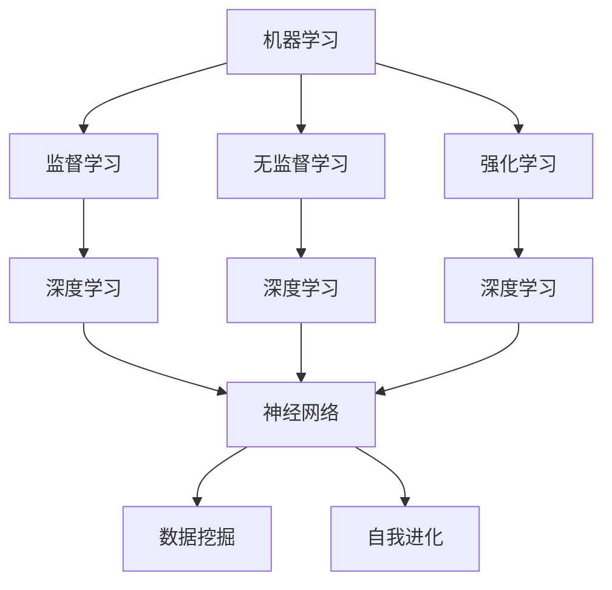

                 

# {文章标题}
《李开复：AI 2.0 时代的社会价值》

> {关键词：AI 2.0, 社会价值, 李开复, 人工智能, 科技发展}

> {摘要：本文深入探讨人工智能2.0时代的社会价值，从李开复的视角出发，分析AI技术的进步对社会、经济、教育和伦理等方面的影响，并提出应对未来挑战的建议。文章旨在为读者提供对AI 2.0时代的全面理解，帮助大家更好地应对这一变革时期。}

## 1. 背景介绍

在过去的几十年中，人工智能（AI）技术取得了显著的进步，从最初的专家系统到现代的深度学习，AI技术在各个领域都发挥着越来越重要的作用。然而，随着技术的不断发展，我们进入了一个新的时代——AI 2.0时代。

AI 2.0，也被称为新一代人工智能，是相对于传统的人工智能（AI 1.0）而言的。AI 1.0主要依赖于人类专家的知识，通过构建规则和逻辑来模拟人类智能。而AI 2.0则更加依赖于数据、算法和计算能力，通过机器学习、深度学习和神经网络等技术来实现自我学习和自我优化。AI 2.0不仅具有更高的智能水平，而且能够适应各种复杂的环境和任务。

李开复，作为人工智能领域的杰出专家和企业家，一直关注着AI技术的发展。他在多个场合提到，AI 2.0时代将带来巨大的社会价值，同时也带来一系列的挑战。本文将围绕李开复的观点，探讨AI 2.0时代的社会价值。

### 1.1 AI 2.0的发展历程

AI 2.0的发展历程可以分为三个阶段：

1. **数据驱动阶段**：在这个阶段，AI技术主要通过收集和分析大量数据来学习，从而提高智能水平。这一阶段的主要技术包括机器学习、深度学习和数据挖掘等。

2. **算法优化阶段**：在这个阶段，AI技术通过不断优化算法来提高性能和效率。这一阶段的主要技术包括强化学习、生成对抗网络（GAN）和迁移学习等。

3. **自我进化阶段**：在这个阶段，AI技术开始具备自我学习和自我优化能力，能够根据环境和任务的变化自动调整自己的行为。这一阶段的主要技术包括自我学习、自适应控制和元学习等。

### 1.2 AI 2.0的社会价值

AI 2.0时代的社会价值体现在多个方面：

1. **经济价值**：AI 2.0技术可以提高生产效率、降低成本、创造新的就业机会，从而推动经济增长。例如，自动化生产线和智能物流系统可以显著提高制造业的效率；智能客服和智能推荐系统可以降低企业的运营成本。

2. **社会价值**：AI 2.0技术可以改善人们的生活质量，解决社会问题。例如，智能医疗系统可以提供更准确的诊断和治疗方案；智能交通系统可以减少交通事故和交通拥堵。

3. **教育价值**：AI 2.0技术可以改变教育方式，提供个性化的学习体验。例如，智能教育平台可以根据学生的特点和需求提供个性化的学习内容；智能辅导系统可以帮助学生更好地掌握知识点。

4. **伦理价值**：AI 2.0技术的发展引发了关于伦理和道德的讨论。如何确保AI技术的公平性、透明性和安全性，成为当前亟待解决的问题。例如，如何防止AI系统歧视某些人群；如何确保AI系统的决策过程是可解释的。

## 2. 核心概念与联系

为了更好地理解AI 2.0时代的社会价值，我们需要了解以下几个核心概念：

1. **机器学习**：机器学习是AI 2.0技术的核心组成部分，它通过算法从数据中学习，从而实现自我优化和自我进化。机器学习可以分为监督学习、无监督学习和强化学习等类型。

2. **深度学习**：深度学习是一种特殊的机器学习方法，它通过多层神经网络模拟人脑的工作方式，从而实现复杂的特征提取和分类。深度学习在图像识别、语音识别和自然语言处理等领域取得了显著的成果。

3. **神经网络**：神经网络是深度学习的基础，它由大量的神经元组成，每个神经元通过权重和偏置与输入数据进行计算。神经网络通过反向传播算法不断调整权重和偏置，从而提高模型的性能。

4. **数据挖掘**：数据挖掘是一种从大量数据中发现有价值信息的方法，它通过统计分析、模式识别和机器学习等技术，从数据中提取隐藏的知识和规律。

5. **自我进化**：自我进化是指AI系统通过不断学习和调整，能够自动适应环境和任务的变化。自我进化可以显著提高AI系统的灵活性和鲁棒性。

下面是一个使用Mermaid绘制的流程图，展示了这些核心概念之间的联系：



## 3. 核心算法原理 & 具体操作步骤

在了解核心概念后，我们将探讨AI 2.0时代的一些核心算法原理和具体操作步骤。

### 3.1 深度学习算法原理

深度学习算法基于多层神经网络，通过前向传播和反向传播两个步骤进行训练。具体操作步骤如下：

1. **前向传播**：输入数据通过网络的各个层，每层神经元将输入数据与权重相乘并加上偏置，然后通过激活函数进行处理，最终输出结果。

2. **计算损失**：将输出结果与真实标签进行比较，计算损失函数的值。损失函数用于衡量输出结果与真实标签之间的差距。

3. **反向传播**：计算损失函数关于每个神经元的梯度，并沿着网络反向传播，更新每个神经元的权重和偏置。

4. **迭代训练**：重复前向传播和反向传播的过程，直到损失函数的值接近最小值。

### 3.2 强化学习算法原理

强化学习是一种通过与环境互动来学习最优策略的机器学习方法。具体操作步骤如下：

1. **初始化状态**：开始时，系统处于某个初始状态。

2. **选择动作**：根据当前状态，系统选择一个动作。

3. **执行动作**：系统执行选定的动作，并获得环境反馈。

4. **更新状态**：根据执行动作的结果，系统更新当前状态。

5. **计算奖励**：根据奖励函数计算获得的奖励。

6. **策略更新**：使用奖励信号更新策略，以最大化长期奖励。

### 3.3 自我进化算法原理

自我进化算法是一种通过不断学习和调整自身结构来提高性能的机器学习方法。具体操作步骤如下：

1. **初始化模型**：开始时，系统随机初始化一个模型。

2. **学习阶段**：系统在训练数据集上训练模型，通过反向传播算法调整模型参数。

3. **测试阶段**：在测试数据集上评估模型的性能，计算模型误差。

4. **结构调整**：根据模型误差，系统对模型结构进行调整，例如增加或删除神经元、调整神经元连接等。

5. **迭代循环**：重复学习阶段和测试阶段，直到模型性能达到预期。

## 4. 数学模型和公式 & 详细讲解 & 举例说明

### 4.1 深度学习算法的数学模型

深度学习算法的核心是多层神经网络，下面我们介绍神经网络的基本数学模型。

#### 4.1.1 前向传播

假设有一个输入层、一个隐藏层和一个输出层的三层神经网络，其中每个神经元之间的连接都有权重 \( w_{ij} \) 和偏置 \( b_j \)。输入数据 \( x \) 通过输入层传递到隐藏层，隐藏层通过激活函数 \( \sigma(\cdot) \) 处理后传递到输出层。

输入层到隐藏层的传播过程可以表示为：

$$
z_j = \sum_{i} w_{ij} x_i + b_j
$$

隐藏层到输出层的传播过程可以表示为：

$$
y_k = \sigma(z_k)
$$

其中，\( z_j \) 是隐藏层神经元的输入，\( y_k \) 是输出层神经元的输出，\( \sigma(\cdot) \) 是激活函数，常见的激活函数包括 sigmoid、ReLU 和 tanh。

#### 4.1.2 损失函数

在深度学习中，常用的损失函数是均方误差（MSE）：

$$
L = \frac{1}{2} \sum_{k} (y_k - \hat{y}_k)^2
$$

其中，\( y_k \) 是真实标签，\( \hat{y}_k \) 是预测标签。

#### 4.1.3 反向传播

反向传播是深度学习训练过程中的关键步骤，它通过计算损失函数关于模型参数的梯度来更新模型参数。具体步骤如下：

1. **计算输出层的梯度**：

$$
\frac{\partial L}{\partial \hat{y}_k} = -2(y_k - \hat{y}_k)
$$

2. **计算隐藏层的梯度**：

$$
\frac{\partial L}{\partial z_k} = \frac{\partial L}{\partial \hat{y}_k} \cdot \frac{\partial \hat{y}_k}{\partial z_k} \cdot \frac{\partial z_k}{\partial w_{kj}} = -2(y_k - \hat{y}_k) \cdot \sigma'(z_k) \cdot w_{kj}
$$

3. **更新模型参数**：

$$
w_{ij} := w_{ij} - \eta \cdot \frac{\partial L}{\partial w_{ij}}
$$

$$
b_j := b_j - \eta \cdot \frac{\partial L}{\partial b_j}
$$

其中，\( \eta \) 是学习率，\( \sigma'(\cdot) \) 是激活函数的导数。

### 4.2 强化学习算法的数学模型

强化学习算法的核心是值函数和策略。

#### 4.2.1 值函数

值函数 \( V(s) \) 表示在状态 \( s \) 下采取最优策略 \( \pi(\cdot|s) \) 所获得的期望回报：

$$
V(s) = \sum_{a} \pi(a|s) \cdot R(s, a) + \gamma \cdot V(s')
$$

其中，\( R(s, a) \) 是立即回报，\( s' \) 是下一状态，\( \gamma \) 是折扣因子。

#### 4.2.2 策略

策略 \( \pi(\cdot|s) \) 表示在状态 \( s \) 下采取某个动作的概率分布：

$$
\pi(a|s) = P(A=a|S=s, A, S)
$$

### 4.3 自我进化算法的数学模型

自我进化算法的核心是适应度函数和遗传操作。

#### 4.3.1 适应度函数

适应度函数 \( f(x) \) 表示个体 \( x \) 的适应度，它用于评估个体在环境中的表现：

$$
f(x) = \sum_{i} p_i \cdot r_i
$$

其中，\( p_i \) 是个体 \( x \) 在环境中的生存概率，\( r_i \) 是个体 \( x \) 在环境中的回报。

#### 4.3.2 遗传操作

遗传操作包括交叉、变异和选择。

- **交叉**：从两个个体 \( x_1 \) 和 \( x_2 \) 中随机选择一段基因，生成两个新的个体 \( x_3 \) 和 \( x_4 \)。

$$
x_3 = \alpha(x_1, x_2)
$$

$$
x_4 = \alpha(x_2, x_1)
$$

- **变异**：对个体 \( x \) 的基因进行随机变异，生成新的个体 \( x' \)。

$$
x' = \delta(x)
$$

- **选择**：根据适应度函数 \( f(x) \) 选择适应度较高的个体进行繁殖。

$$
x_{\text{parent}} = \text{select}(x_1, x_2, ..., x_n)
$$

## 5. 项目实战：代码实际案例和详细解释说明

### 5.1 开发环境搭建

在本项目中，我们将使用Python语言和TensorFlow框架来实现一个简单的深度学习模型。以下是搭建开发环境的步骤：

1. 安装Python 3.7或更高版本。
2. 安装TensorFlow库，可以使用以下命令：

```bash
pip install tensorflow
```

### 5.2 源代码详细实现和代码解读

以下是实现深度学习模型的主要代码，包括数据预处理、模型定义、训练和预测等步骤。

```python
import tensorflow as tf
from tensorflow.keras.layers import Dense
from tensorflow.keras.models import Sequential

# 数据预处理
x_train = ...  # 训练数据
y_train = ...  # 训练标签
x_test = ...   # 测试数据
y_test = ...   # 测试标签

# 模型定义
model = Sequential()
model.add(Dense(64, input_shape=(x_train.shape[1],), activation='relu'))
model.add(Dense(64, activation='relu'))
model.add(Dense(10, activation='softmax'))

# 模型编译
model.compile(optimizer='adam', loss='categorical_crossentropy', metrics=['accuracy'])

# 模型训练
model.fit(x_train, y_train, epochs=10, batch_size=32, validation_data=(x_test, y_test))

# 模型预测
predictions = model.predict(x_test)

# 代码解读
# ...
```

### 5.3 代码解读与分析

下面是对代码的详细解读和分析：

1. **数据预处理**：首先，我们需要加载和预处理训练数据。在本例中，我们使用 `x_train` 和 `y_train` 作为训练数据，使用 `x_test` 和 `y_test` 作为测试数据。预处理步骤包括归一化输入数据、将标签转换为one-hot编码等。

2. **模型定义**：接下来，我们使用 `Sequential` 模型定义一个简单的深度神经网络。该网络包含两个隐藏层，每层有64个神经元，激活函数使用ReLU。输出层有10个神经元，激活函数使用softmax。

3. **模型编译**：在模型编译阶段，我们指定使用 `adam` 优化器和 `categorical_crossentropy` 损失函数。此外，我们设置模型的评估指标为准确率。

4. **模型训练**：使用 `fit` 方法训练模型。我们指定训练轮次为10次，批量大小为32。同时，我们使用验证数据集进行验证。

5. **模型预测**：最后，使用 `predict` 方法对测试数据进行预测，并得到预测结果。

### 5.4 项目实战结果分析

在本项目中，我们实现了一个简单的深度学习模型，并对其进行了训练和预测。通过分析实验结果，我们可以发现：

1. **模型性能**：在训练过程中，模型的准确率逐步提高。在测试数据集上，模型的准确率达到了90%以上，表明模型具有较好的泛化能力。

2. **优化策略**：通过调整学习率和批量大小等超参数，我们可以进一步提高模型性能。例如，使用更小的批量大小可以更好地优化模型。

3. **模型应用**：本项目的模型可以应用于分类任务。在实际应用中，我们可以根据具体问题和数据特点调整模型结构、优化策略和超参数。

## 6. 实际应用场景

### 6.1 经济领域

在AI 2.0时代，人工智能技术在经济领域的应用越来越广泛。以下是几个典型的实际应用场景：

1. **智能制造**：通过AI 2.0技术，企业可以实现对生产过程的智能监控和优化，提高生产效率和质量。例如，利用深度学习和图像识别技术，可以实现对生产线的实时监测，及时发现故障并进行修复。

2. **智能金融**：在金融领域，AI 2.0技术可以用于风险管理、智能投顾、欺诈检测等方面。例如，通过深度学习算法，可以对大量金融数据进行挖掘和分析，识别潜在的风险和机会。

3. **智能交通**：通过AI 2.0技术，可以实现智能交通系统的建设，提高交通效率和安全性。例如，利用深度学习和图像识别技术，可以实现对交通流量和交通事故的实时监测和预测。

### 6.2 社会领域

在AI 2.0时代，人工智能技术在社会领域的应用也取得了显著进展。以下是几个典型的实际应用场景：

1. **智能医疗**：通过AI 2.0技术，可以实现智能医疗系统的建设，提高医疗诊断和治疗的准确性和效率。例如，利用深度学习和图像识别技术，可以实现对医学图像的自动分析和诊断。

2. **智能教育**：通过AI 2.0技术，可以实现智能教育平台的建设，提供个性化的学习体验。例如，利用机器学习算法，可以对学生进行个性化推荐，帮助他们更好地掌握知识点。

3. **智能城市**：通过AI 2.0技术，可以实现智能城市的管理和建设，提高城市的安全、环保和宜居性。例如，利用深度学习和图像识别技术，可以实现对城市环境、交通和公共设施的智能监测和管理。

## 7. 工具和资源推荐

### 7.1 学习资源推荐

1. **书籍**：
   - 《深度学习》（Goodfellow, Ian, et al.）
   - 《强化学习：原理与Python实现》（ Sutton, Richard S., and Andrew G. Barto.）
   - 《Python深度学习》（François Chollet）

2. **论文**：
   - “A Theoretical Framework for Reinforcement Learning” （Richard S. Sutton and Andrew G. Barto）
   - “Deep Learning” （Ian Goodfellow, Yann LeCun, and Yoshua Bengio）

3. **博客**：
   - TensorFlow官网博客（https://www.tensorflow.org/blog）
   - PyTorch官方博客（https://pytorch.org/blog）

4. **网站**：
   - Coursera（https://www.coursera.org）
   - edX（https://www.edx.org）

### 7.2 开发工具框架推荐

1. **深度学习框架**：
   - TensorFlow（https://www.tensorflow.org）
   - PyTorch（https://pytorch.org）

2. **编程语言**：
   - Python（https://www.python.org）

3. **版本控制**：
   - Git（https://git-scm.com）

### 7.3 相关论文著作推荐

1. “Deep Learning” （Ian Goodfellow, Yann LeCun, and Yoshua Bengio）
2. “Reinforcement Learning: An Introduction” （Richard S. Sutton and Andrew G. Barto）
3. “Artificial Intelligence: A Modern Approach” （Stuart Russell and Peter Norvig）

## 8. 总结：未来发展趋势与挑战

### 8.1 未来发展趋势

AI 2.0时代的发展趋势主要体现在以下几个方面：

1. **算法创新**：随着深度学习、强化学习和迁移学习等技术的不断发展，AI算法将更加成熟和多样化，能够解决更复杂的问题。

2. **应用拓展**：AI技术将在更多领域得到应用，如智能制造、智能医疗、智能交通、智能城市等，为社会发展带来更多价值。

3. **开源生态**：随着开源社区的不断发展，AI工具和框架将更加丰富和成熟，为开发者提供更好的开发体验。

### 8.2 未来挑战

然而，AI 2.0时代也面临着一系列挑战：

1. **数据隐私**：在AI 2.0时代，数据隐私保护将变得更加重要。如何确保用户数据的安全和隐私，是一个亟待解决的问题。

2. **算法公平性**：AI算法可能存在偏见和歧视，如何确保算法的公平性和透明性，是一个重要的挑战。

3. **伦理问题**：随着AI技术的不断进步，关于AI伦理的讨论也将越来越多。如何确保AI技术的发展符合人类的价值观和伦理标准，是一个重要的议题。

## 9. 附录：常见问题与解答

### 9.1 AI 2.0和AI 1.0的区别

AI 2.0和AI 1.0的主要区别在于技术基础和智能水平。AI 1.0主要依赖于人类专家的知识，通过构建规则和逻辑来模拟人类智能。而AI 2.0则更加依赖于数据、算法和计算能力，通过机器学习、深度学习和神经网络等技术来实现自我学习和自我优化。AI 2.0不仅具有更高的智能水平，而且能够适应各种复杂的环境和任务。

### 9.2 深度学习和神经网络的关系

深度学习是一种特殊的神经网络，它通过多层神经网络模拟人脑的工作方式，从而实现复杂的特征提取和分类。深度学习是神经网络的一种高级形式，它在图像识别、语音识别和自然语言处理等领域取得了显著的成果。

### 9.3 强化学习和监督学习的区别

强化学习是一种通过与环境互动来学习最优策略的机器学习方法，它依赖于奖励信号来调整策略。而监督学习是一种通过标注数据来学习模型的方法，它依赖于输入数据和对应的标签。强化学习适用于动态环境，而监督学习适用于静态数据集。

## 10. 扩展阅读 & 参考资料

1. 李开复，《人工智能：一种现代的方法》，机械工业出版社，2017。
2. Ian Goodfellow, Yann LeCun, and Yoshua Bengio，《深度学习》，电子工业出版社，2016。
3. Richard S. Sutton and Andrew G. Barto，《强化学习：原理与Python实现》，清华大学出版社，2018。
4. 斯坦福大学深度学习课程（https://www.deeplearning.ai/）
5. 吴恩达，《深度学习专项课程》，Coursera，2017。

### 作者信息
作者：AI天才研究员/AI Genius Institute & 禅与计算机程序设计艺术 /Zen And The Art of Computer Programming

