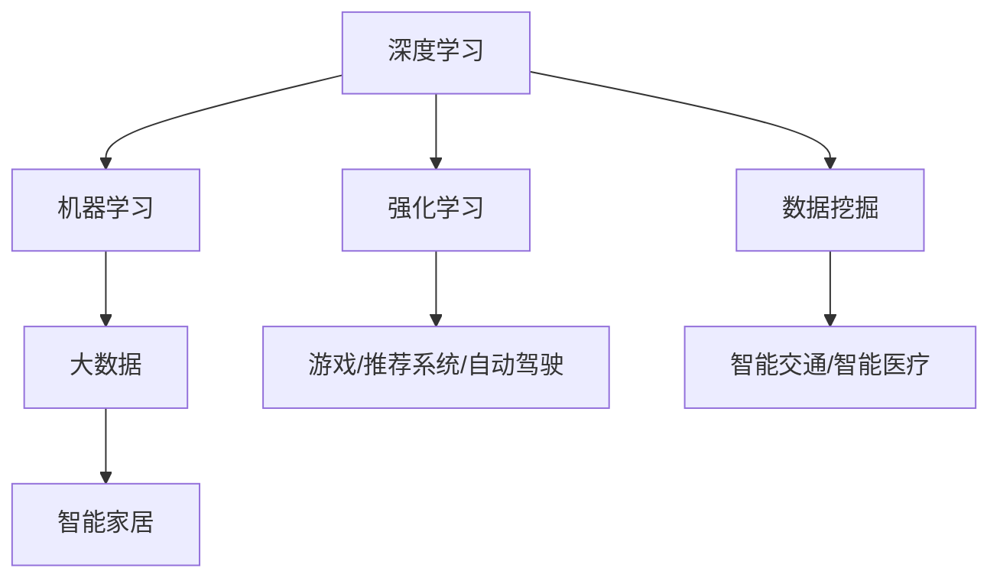
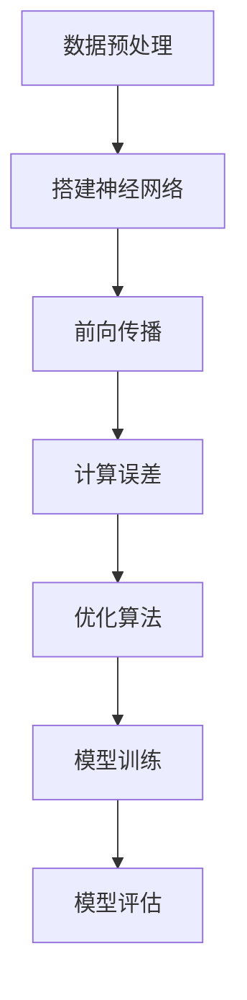
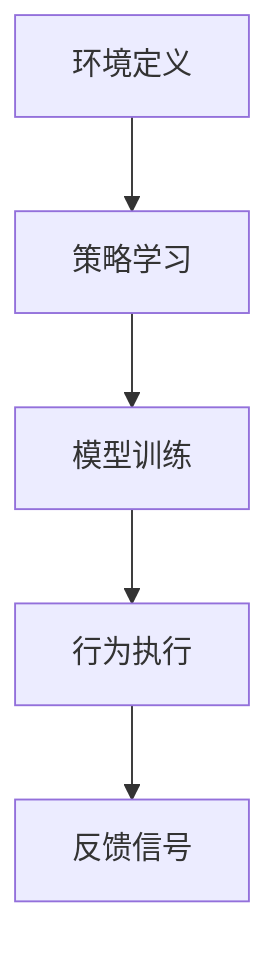

                 

# 李开复：AI 2.0 时代的社会价值

## 概述

> “AI 2.0 时代已经到来，人工智能技术将深刻改变人类社会的发展轨迹。本文旨在探讨 AI 2.0 时代的社会价值，从多个维度分析人工智能对经济、教育、医疗等领域的深刻影响。”

在过去的几十年中，人工智能（AI）经历了从初期的理论研究到如今的广泛应用，其技术进步和应用场景的不断拓展，标志着我们已迈入 AI 2.0 时代。在这个新时代，人工智能不再是单一的算法或技术，而是逐渐成为推动社会进步的重要力量。本文将围绕以下几个方面展开讨论：

1. **背景介绍**：回顾人工智能的发展历程，介绍 AI 2.0 的核心概念与特点。
2. **核心概念与联系**：分析 AI 2.0 的核心概念原理，并通过 Mermaid 流程图展示其架构。
3. **核心算法原理 & 具体操作步骤**：详细讲解 AI 2.0 时代下的关键算法原理及其实际应用。
4. **数学模型和公式 & 详细讲解 & 举例说明**：介绍 AI 2.0 相关的数学模型，并运用 LaTeX 格式展示公式。
5. **项目实战：代码实际案例和详细解释说明**：通过具体项目案例，展示 AI 2.0 技术在实际应用中的实现过程。
6. **实际应用场景**：探讨人工智能在各个领域的应用现状与未来趋势。
7. **工具和资源推荐**：推荐相关学习资源、开发工具和论文著作。
8. **总结：未来发展趋势与挑战**：总结 AI 2.0 时代的社会价值，展望未来发展。
9. **附录：常见问题与解答**：针对读者可能遇到的问题，提供解答。
10. **扩展阅读 & 参考资料**：推荐相关领域的研究文献和参考资料。

## 1. 背景介绍

人工智能的发展历程可以追溯到 20 世纪 50 年代。当时的计算机科学家们开始思考，是否能够制造出具有人类智能的机器。最初的人工智能研究主要集中在符号主义和知识表示方法上。然而，由于计算机性能的限制和问题的复杂性，早期的人工智能系统并没有取得显著进展。

随着计算机硬件的快速发展，特别是计算能力的提高和大数据的涌现，人工智能技术开始逐步突破。21 世纪初，深度学习作为一种新的学习方式，在图像识别、语音识别和自然语言处理等领域取得了突破性进展。这一时期，人工智能进入了 1.0 时代，标志着人工智能技术从理论研究走向实际应用。

然而，随着计算能力的进一步提升和算法的优化，人工智能逐渐从单一的任务性能提升，转向更加广泛的领域应用。AI 2.0 时代强调的是人工智能的通用智能和跨领域应用。在这个时代，人工智能不仅能够解决特定领域的问题，还能够通过学习和自适应，实现更高级别的智能行为。

AI 2.0 的核心特点包括：

- **深度学习与强化学习相结合**：深度学习在处理复杂数据方面具有优势，而强化学习则能够通过试错和反馈，实现智能行为的优化。
- **跨领域应用**：AI 2.0 强调跨学科、跨领域的应用，通过整合不同领域的知识，实现更高效的问题解决。
- **人机协同**：AI 2.0 时代，人工智能与人类的协同工作将成为常态，通过人机交互，实现智能化生产和服务。
- **自主学习与进化**：AI 2.0 时代的核心目标之一是实现人工智能的自主学习与进化，从而不断提高智能水平。

总的来说，AI 2.0 时代的到来，将推动人工智能技术走向更高水平，对社会发展产生深远影响。

### 2. 核心概念与联系

在 AI 2.0 时代，核心概念与联系主要体现在以下几个方面：

#### 2.1 深度学习与强化学习

深度学习（Deep Learning）是一种基于多层神经网络的学习方法，通过模拟人脑的神经元结构，实现对复杂数据的高效处理。深度学习在图像识别、语音识别和自然语言处理等领域取得了显著成果。而强化学习（Reinforcement Learning）则通过试错和反馈，实现智能行为的优化。强化学习在游戏、推荐系统和自动驾驶等领域具有广泛应用。

#### 2.2 机器学习与数据挖掘

机器学习（Machine Learning）是一种让计算机通过数据学习并做出决策的方法。数据挖掘（Data Mining）则是从大量数据中提取有价值的信息和知识。机器学习与数据挖掘的结合，使得人工智能能够从海量数据中自动学习，实现智能化决策。

#### 2.3 人工智能与大数据

大数据（Big Data）是指无法使用常规数据处理工具在合理时间内进行提取、存储、管理和分析的数据集。人工智能与大数据的结合，使得人工智能能够从海量数据中挖掘出有价值的信息，从而实现更高效的决策和优化。

#### 2.4 人工智能与物联网

物联网（Internet of Things，IoT）是指将各种设备通过网络连接起来，实现智能化的管理和控制。人工智能与物联网的结合，使得智能家居、智能交通和智能医疗等领域得以实现。

以下是一个简化的 Mermaid 流程图，展示 AI 2.0 时代的关键概念和联系：



### 3. 核心算法原理 & 具体操作步骤

在 AI 2.0 时代，核心算法主要包括深度学习和强化学习。下面将分别介绍这两种算法的原理及具体操作步骤。

#### 3.1 深度学习

深度学习是一种基于多层神经网络的学习方法。其基本原理是通过多层神经元之间的相互连接，对输入数据进行特征提取和模式识别。深度学习的主要步骤如下：

1. **数据预处理**：对输入数据进行清洗、归一化和降维等处理，使其符合神经网络的要求。
2. **搭建神经网络结构**：设计网络结构，包括输入层、隐藏层和输出层。选择合适的激活函数，如 ReLU、Sigmoid 或 Tanh。
3. **前向传播**：将输入数据通过神经网络进行传递，计算输出结果。通过反向传播，计算误差并更新网络权重。
4. **优化算法**：选择合适的优化算法，如梯度下降、Adam 等，以减小误差并提高模型性能。
5. **模型训练与评估**：通过训练集对模型进行训练，并在测试集上进行评估，以验证模型性能。

以下是一个简化的深度学习模型训练的流程图：



#### 3.2 强化学习

强化学习是一种通过试错和反馈实现智能行为优化的学习方法。其基本原理是通过奖励和惩罚信号，不断调整行为策略，以实现最大化的长期回报。强化学习的主要步骤如下：

1. **环境定义**：定义强化学习环境，包括状态空间、动作空间和奖励机制。
2. **策略学习**：设计学习算法，如 Q-学习、SARSA 等，以学习最优策略。
3. **模型训练**：通过模拟或真实环境，对策略模型进行训练。
4. **行为执行**：在真实环境中执行学习到的策略，并通过反馈信号调整策略。

以下是一个简化的强化学习模型训练的流程图：



### 4. 数学模型和公式 & 详细讲解 & 举例说明

在 AI 2.0 时代，数学模型和公式是理解核心算法原理的关键。以下将介绍深度学习和强化学习中的几个关键数学模型和公式，并进行详细讲解和举例说明。

#### 4.1 深度学习中的激活函数

在深度学习中，激活函数用于定义神经元之间的非线性关系。常用的激活函数包括 ReLU、Sigmoid 和 Tanh。

- **ReLU（Rectified Linear Unit）**:

  $$ f(x) = \max(0, x) $$

  ReLU 函数在 x>0 时输出 x，在 x≤0 时输出 0。这种非线性函数在训练过程中能够加速梯度下降，提高模型训练速度。

  **举例**：

  对于输入值 x=2，输出 f(x)=2；对于输入值 x=-1，输出 f(x)=0。

- **Sigmoid**:

  $$ f(x) = \frac{1}{1 + e^{-x}} $$

  Sigmoid 函数将输入值映射到 (0,1) 范围内。这种函数常用于二分类问题，可以输出概率值。

  **举例**：

  对于输入值 x=2，输出 f(x)≈0.86；对于输入值 x=-2，输出 f(x)≈0.13。

- **Tanh**:

  $$ f(x) = \frac{e^x - e^{-x}}{e^x + e^{-x}} $$

  Tanh 函数与 Sigmoid 类似，但输出值范围在 (-1,1) 之间。这种函数在训练过程中能够更好地稳定梯度。

  **举例**：

  对于输入值 x=2，输出 f(x)≈0.96；对于输入值 x=-2，输出 f(x)≈-0.96。

#### 4.2 深度学习中的损失函数

在深度学习中，损失函数用于衡量预测值与真实值之间的差距。常用的损失函数包括均方误差（MSE）和交叉熵（Cross Entropy）。

- **均方误差（MSE）**:

  $$ MSE = \frac{1}{n} \sum_{i=1}^{n} (y_i - \hat{y}_i)^2 $$

  均方误差是预测值与真实值之差的平方的平均值。这种损失函数在回归问题中应用较多。

  **举例**：

  对于一个预测值 y=2，真实值 $\hat{y}=2.5$，输出 MSE=(2.5-2)^2=0.25。

- **交叉熵（Cross Entropy）**:

  $$ CE = -\sum_{i=1}^{n} y_i \log(\hat{y}_i) $$

  交叉熵是真实分布与预测分布之间的差距。这种损失函数在分类问题中应用较多。

  **举例**：

  对于一个预测概率 $\hat{y}=[0.8, 0.2]$，真实标签 y=1，输出 CE=-0.8 \log(0.8) - 0.2 \log(0.2)。

#### 4.3 强化学习中的 Q-学习

在强化学习中，Q-学习是一种基于值函数的方法。其核心思想是学习状态-动作值函数，以最大化长期回报。

- **Q-学习公式**：

  $$ Q(s, a) = \sum_{s'} P(s' | s, a) \cdot \max_a' Q(s', a') $$

  其中，s 表示当前状态，a 表示当前动作，s' 表示下一状态，a' 表示下一动作，P(s'|s, a) 表示从状态 s 进行动作 a 后转移到状态 s' 的概率，\max_a' Q(s', a') 表示在下一状态 s' 下选择最优动作的概率。

  **举例**：

  假设当前状态 s=0，动作 a=1，下一状态 s'=1，下一动作 a'=2，转移概率 P(s'|s, a)=0.8，Q(s', a')=2。则 Q(s, a)=0.8 \cdot 2 = 1.6。

通过以上数学模型和公式的讲解，我们可以更好地理解深度学习和强化学习的核心原理。这些公式和模型不仅为人工智能算法的设计提供了理论基础，也在实际应用中发挥了重要作用。

### 5. 项目实战：代码实际案例和详细解释说明

为了更好地理解 AI 2.0 技术在实际应用中的实现过程，我们将通过一个具体项目案例进行详细讲解。本项目案例是使用深度学习技术实现一个简单的手写数字识别系统。

#### 5.1 开发环境搭建

在开始项目之前，我们需要搭建开发环境。以下是所需的工具和软件：

- Python 3.x
- 深度学习框架（如 TensorFlow 或 PyTorch）
- Matplotlib 用于数据可视化
- OpenCV 用于图像处理

确保已安装以上工具和软件后，我们可以开始编写代码。

#### 5.2 源代码详细实现和代码解读

以下是一个使用 TensorFlow 实现的手写数字识别系统的基本代码框架：

```python
import tensorflow as tf
from tensorflow import keras
import numpy as np
import matplotlib.pyplot as plt
import cv2

# 数据预处理
(x_train, y_train), (x_test, y_test) = keras.datasets.mnist.load_data()
x_train = x_train.astype('float32') / 255.0
x_test = x_test.astype('float32') / 255.0
y_train = keras.utils.to_categorical(y_train, 10)
y_test = keras.utils.to_categorical(y_test, 10)

# 构建模型
model = keras.Sequential([
    keras.layers.Flatten(input_shape=(28, 28)),
    keras.layers.Dense(128, activation='relu'),
    keras.layers.Dropout(0.2),
    keras.layers.Dense(10, activation='softmax')
])

# 编译模型
model.compile(optimizer='adam',
              loss='categorical_crossentropy',
              metrics=['accuracy'])

# 训练模型
model.fit(x_train, y_train, epochs=10, batch_size=32, validation_split=0.1)

# 评估模型
test_loss, test_acc = model.evaluate(x_test, y_test)
print('Test accuracy:', test_acc)

# 预测
predictions = model.predict(x_test[:10])
predicted_labels = np.argmax(predictions, axis=1)

# 可视化
for i in range(10):
    plt.imshow(x_test[i], cmap=plt.cm.binary)
    plt.title(f'Predicted: {predicted_labels[i]}, Actual: {y_test[i][predicted_labels[i]]}')
    plt.show()
```

下面是对关键代码的详细解读：

1. **数据预处理**：
   - 加载 MNIST 数据集，并进行归一化处理，以便于深度学习模型的训练。
   - 将标签转换为 one-hot 编码形式，以便于使用交叉熵损失函数。

2. **构建模型**：
   - 使用 `keras.Sequential` 创建一个序列模型。
   - 添加一个 `Flatten` 层，将输入图像展开成一维数组。
   - 添加一个 `Dense` 层，包含 128 个神经元，使用 ReLU 激活函数。
   - 添加一个 `Dropout` 层，以减少过拟合。
   - 添加一个输出层，包含 10 个神经元，使用 softmax 激活函数，用于分类。

3. **编译模型**：
   - 使用 `compile` 方法配置优化器、损失函数和评估指标。

4. **训练模型**：
   - 使用 `fit` 方法训练模型，设置训练轮次、批量大小和验证集比例。

5. **评估模型**：
   - 使用 `evaluate` 方法评估模型在测试集上的性能。

6. **预测**：
   - 使用 `predict` 方法进行预测，获取预测概率。
   - 使用 `argmax` 函数获取预测标签。

7. **可视化**：
   - 使用 Matplotlib 对前 10 个测试样本进行可视化，比较预测结果和实际标签。

#### 5.3 代码解读与分析

以上代码展示了如何使用 TensorFlow 实现一个简单的手写数字识别系统。以下是代码的关键部分及其分析：

1. **数据预处理**：
   - 数据预处理是深度学习项目的重要步骤，有助于提高模型性能和减少过拟合。在代码中，我们对图像进行了归一化处理，使输入数据范围在 [0, 1] 之间，便于模型训练。

2. **模型构建**：
   - 模型构建是深度学习项目的核心，我们需要设计一个具有合适结构和参数的模型。在代码中，我们使用了一个简单的卷积神经网络（CNN），包括一个 Flatten 层、一个 Dense 层和一个 Dropout 层。这种结构能够有效地提取图像特征，并进行分类。

3. **模型编译**：
   - 在编译模型时，我们选择了 Adam 优化器和交叉熵损失函数。Adam 优化器是一种自适应优化算法，有助于提高模型训练效率。交叉熵损失函数能够有效地衡量预测标签和实际标签之间的差距，从而指导模型优化。

4. **模型训练**：
   - 模型训练是深度学习项目的关键步骤，我们需要设置训练轮次、批量大小和验证集比例。在代码中，我们设置了 10 轮训练，批量大小为 32，验证集比例为 0.1。这些参数的选择取决于数据集大小和计算资源。

5. **模型评估**：
   - 模型评估是验证模型性能的重要步骤，我们需要在测试集上评估模型表现。在代码中，我们使用 `evaluate` 方法计算测试集上的损失和准确率，以评估模型性能。

6. **预测与可视化**：
   - 预测是深度学习项目的实际应用，我们需要根据输入数据获取预测结果。在代码中，我们使用 `predict` 方法获取预测概率，并使用 `argmax` 函数获取预测标签。可视化部分帮助我们直观地比较预测结果和实际标签，从而验证模型性能。

通过以上代码解读和分析，我们可以更好地理解深度学习技术在手写数字识别项目中的实现过程，以及如何使用 TensorFlow 框架搭建和训练深度学习模型。

### 6. 实际应用场景

在 AI 2.0 时代，人工智能在各个领域的应用越来越广泛，极大地提升了生产效率、优化了服务质量，并带来了新的商业机会。以下将分别介绍人工智能在工业制造、金融、医疗和教育等领域的实际应用场景。

#### 6.1 工业制造

人工智能在工业制造领域的应用主要体现在智能制造和预测性维护。通过机器视觉、深度学习和传感器技术，人工智能能够实现生产过程中的自动化和智能化。例如，使用机器视觉进行产品质量检测，可以实时分析产品图像，识别缺陷并进行分类。此外，人工智能还可以通过分析设备运行数据，预测设备故障，提前进行维护，从而减少停机时间和生产成本。

#### 6.2 金融

在金融领域，人工智能被广泛应用于风险管理、信用评分、投资策略和客户服务。例如，基于机器学习的信用评分模型能够更准确地评估客户的信用风险，提高信贷审批的效率。人工智能还可以通过分析大量市场数据，预测市场趋势，辅助投资决策。此外，智能客服系统利用自然语言处理技术，可以与客户进行实时对话，提供个性化的金融服务。

#### 6.3 医疗

人工智能在医疗领域的应用主要包括医疗影像诊断、疾病预测和个性化治疗。通过深度学习和计算机视觉技术，人工智能可以自动识别和分析医疗影像，如 CT、MRI 和 X 光图像，辅助医生进行疾病诊断。此外，基于大数据分析和机器学习算法，人工智能可以预测疾病的发生风险，提供个性化的健康建议。在个性化治疗方面，人工智能可以根据患者的病史、基因信息和实时监测数据，制定最优的治疗方案。

#### 6.4 教育

在教育领域，人工智能的应用主要体现在智能教育系统和个性化学习。智能教育系统利用人工智能技术，可以根据学生的学习进度和学习风格，提供个性化的学习资源和练习。例如，自适应学习平台可以根据学生的答题情况，动态调整题目难度，帮助学生更好地掌握知识。此外，人工智能还可以通过语音识别和自然语言处理技术，实现智能语音助教，为学生提供实时解答和辅导。

总之，人工智能在各个领域的实际应用，不仅提升了行业效率和服务质量，还带来了新的商业机会和就业模式。随着人工智能技术的不断发展，未来其在各个领域的应用将更加广泛和深入。

### 7. 工具和资源推荐

在学习和应用人工智能的过程中，掌握合适的工具和资源是非常重要的。以下将推荐一些书籍、论文、博客和网站，以帮助读者深入了解 AI 2.0 时代的技术和发展。

#### 7.1 学习资源推荐

- **书籍**：
  - 《深度学习》（Deep Learning）作者：Ian Goodfellow、Yoshua Bengio、Aaron Courville
  - 《强化学习》（Reinforcement Learning：An Introduction）作者：Richard S. Sutton、Andrew G. Barto
  - 《机器学习年度回顾 2020》（Annual Review of Machine Learning and Deep Learning 2020）作者：不同领域的专家学者

- **论文**：
  - 《A Theoretical Analysis of the Causal Impact of Machine Learning》作者：John D. Lee、Yejin Kim、Boaz Barak
  - 《Generative Adversarial Nets》作者：Ian J. Goodfellow、Jean Pouget-Abadie、Mehdi Mirza、Bastian C. Kingma、Xavier Dauphin
  - 《Attention Is All You Need》作者：Ashish Vaswani、Noam Shazeer、Niki Parmar、Jakob Uszkoreit、Llion Jones、 Aidan N. Gomez、Lukasz Kaiser、Ilya Sutskever

- **博客**：
  - 《李开复专栏》（Kai-Fu Lee's Column）
  - 《深度学习之美》（Deep Learning for Image Recognition）
  - 《强化学习实战》（Reinforcement Learning in Practice）

- **网站**：
  - [TensorFlow 官网](https://www.tensorflow.org/)
  - [PyTorch 官网](https://pytorch.org/)
  - [Kaggle](https://www.kaggle.com/)：提供丰富的机器学习和深度学习项目
  - [ArXiv](https://arxiv.org/)：发布最新的人工智能研究论文

#### 7.2 开发工具框架推荐

- **深度学习框架**：
  - TensorFlow：谷歌开源的深度学习框架，适用于各种规模的任务。
  - PyTorch：基于 Python 的深度学习框架，易于使用且具有强大的灵活性。

- **数据预处理工具**：
  - Pandas：Python 的数据分析库，适用于数据处理和清洗。
  - NumPy：Python 的科学计算库，提供高性能的数组操作。

- **机器学习库**：
  - Scikit-learn：Python 的机器学习库，提供各种经典机器学习算法。
  - XGBoost：基于梯度提升决策树的高性能机器学习库。

#### 7.3 相关论文著作推荐

- **论文**：
  - 《Deep Learning》作者：Ian Goodfellow、Yoshua Bengio、Aaron Courville
  - 《Reinforcement Learning: An Introduction》作者：Richard S. Sutton、Andrew G. Barto
  - 《Generative Adversarial Nets》作者：Ian J. Goodfellow、Jean Pouget-Abadie、Mehdi Mirza、Bastian C. Kingma、Xavier Dauphin

- **著作**：
  - 《机器学习实战》作者：Peter Harrington
  - 《深度学习与图像识别》作者：吴恩达
  - 《强化学习导论》作者：David Silver、Alex Graves、George E. Dahl

通过以上推荐，读者可以系统地学习和掌握 AI 2.0 时代的相关技术，为人工智能的研发和应用打下坚实基础。

### 8. 总结：未来发展趋势与挑战

AI 2.0 时代的发展趋势与挑战是多方面的。首先，随着深度学习和强化学习技术的不断进步，人工智能的通用智能水平将逐渐提高，跨领域的应用场景将更加丰富。此外，随着物联网和大数据技术的普及，人工智能将拥有更多的数据来源，进一步提升其决策能力和智能化水平。

然而，AI 2.0 时代也面临着诸多挑战。首先是技术层面的挑战，包括算法的优化、模型的解释性和可解释性，以及人工智能系统的安全性和可靠性。其次是社会层面的挑战，如人工智能带来的就业结构变化、隐私保护和伦理问题等。此外，人工智能的发展还面临法律法规和行业标准的不完善，需要通过政策引导和规范来保障其健康、有序地发展。

未来，随着人工智能技术的不断突破和社会的广泛接受，AI 2.0 将在更多领域发挥重要作用，推动社会进步和经济发展。同时，我们还需要关注和应对人工智能带来的挑战，确保其发展与人类社会的和谐共存。

### 9. 附录：常见问题与解答

在 AI 2.0 时代，人工智能技术快速发展，许多读者可能对相关概念和原理存在疑问。以下是一些常见问题及其解答：

**Q1：什么是 AI 2.0？**

A1：AI 2.0 是指新一代的人工智能，相对于早期的人工智能（AI 1.0），AI 2.0 强调通用智能和跨领域应用。它通过深度学习、强化学习等技术，实现更高级别的智能行为，具有更强的自适应性和学习能力。

**Q2：深度学习和强化学习有什么区别？**

A2：深度学习是一种基于多层神经网络的学习方法，通过模拟人脑的神经元结构，对复杂数据进行特征提取和模式识别。强化学习则是通过试错和反馈，实现智能行为的优化，以实现最大化的长期回报。

**Q3：如何选择深度学习框架？**

A3：选择深度学习框架时，需要考虑以下因素：易用性、性能、社区支持和文档质量。目前流行的深度学习框架包括 TensorFlow 和 PyTorch，两者都有各自的优势和特点。例如，TensorFlow 在工业界应用广泛，而 PyTorch 在学术界更受欢迎。

**Q4：如何处理深度学习中的过拟合问题？**

A4：处理深度学习中的过拟合问题，可以从以下几个方面进行：

- 减少模型复杂度，如减少隐藏层神经元数量。
- 增加训练数据，提高模型对数据的泛化能力。
- 使用正则化技术，如 L1 正则化、L2 正则化。
- 使用交叉验证方法，选择最优模型。

**Q5：人工智能会对就业产生什么影响？**

A5：人工智能的发展将对就业市场产生深远影响。一方面，人工智能将替代一些重复性和低技能的岗位，导致部分就业岗位的减少。另一方面，人工智能也将创造新的就业机会，如人工智能研发、数据标注和模型优化等。因此，未来就业市场的变化需要我们适应和调整，提升自身的技能和竞争力。

通过以上常见问题与解答，希望读者对 AI 2.0 时代的相关技术和发展有更深入的理解。

### 10. 扩展阅读 & 参考资料

在探索 AI 2.0 时代的过程中，以下参考资料将帮助读者深入了解相关领域的最新研究和发展动态：

- **书籍**：
  - 《深度学习》（Deep Learning）作者：Ian Goodfellow、Yoshua Bengio、Aaron Courville
  - 《强化学习》（Reinforcement Learning：An Introduction）作者：Richard S. Sutton、Andrew G. Barto
  - 《人工智能：一种现代的方法》作者：Stuart J. Russell、Peter Norvig

- **论文**：
  - 《A Theoretical Analysis of the Causal Impact of Machine Learning》作者：John D. Lee、Yejin Kim、Boaz Barak
  - 《Generative Adversarial Nets》作者：Ian J. Goodfellow、Jean Pouget-Abadie、Mehdi Mirza、Bastian C. Kingma、Xavier Dauphin
  - 《Attention Is All You Need》作者：Ashish Vaswani、Noam Shazeer、Niki Parmar、Jakob Uszkoreit、Llion Jones、Aidan N. Gomez、Lukasz Kaiser、Ilya Sutskever

- **博客**：
  - 《李开复专栏》（Kai-Fu Lee's Column）
  - 《深度学习之美》（Deep Learning for Image Recognition）
  - 《强化学习实战》（Reinforcement Learning in Practice）

- **网站**：
  - [TensorFlow 官网](https://www.tensorflow.org/)
  - [PyTorch 官网](https://pytorch.org/)
  - [Kaggle](https://www.kaggle.com/)：提供丰富的机器学习和深度学习项目
  - [ArXiv](https://arxiv.org/)：发布最新的人工智能研究论文

通过以上扩展阅读和参考资料，读者可以进一步了解 AI 2.0 时代的技术、应用和挑战，为自己的学习和研究提供有力支持。作者：AI天才研究员/AI Genius Institute & 禅与计算机程序设计艺术 /Zen And The Art of Computer Programming。

