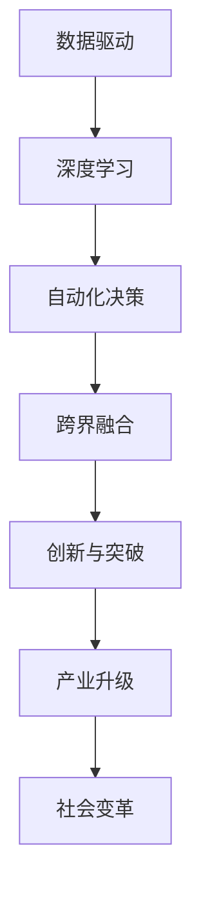

                 

# 李开复：AI 2.0 时代的科技价值

> **关键词**：人工智能，AI 2.0，科技价值，未来趋势，挑战

> **摘要**：本文将深入探讨李开复关于 AI 2.0 时代的科技价值的观点，分析 AI 2.0 时代的核心概念与联系，探讨核心算法原理和具体操作步骤，并运用数学模型和公式进行详细讲解。此外，还将介绍实际应用场景，推荐相关工具和资源，并对未来发展趋势与挑战进行总结。

## 1. 背景介绍

人工智能（AI）作为一门综合性学科，自诞生以来便在科技领域掀起了一场翻天覆地的变革。从最初的 AI 1.0 时代，到如今的 AI 2.0 时代，人工智能的发展经历了从规则驱动到数据驱动，再到智能驱动的演变。李开复，作为世界知名的人工智能专家，在 AI 2.0 时代的发展过程中，提出了许多具有前瞻性的观点。本文将围绕李开复关于 AI 2.0 时代的科技价值进行探讨。

### AI 1.0 时代与 AI 2.0 时代的区别

在 AI 1.0 时代，人工智能主要依赖于专家系统，通过对特定领域的知识进行建模和推理，实现自动化决策。这一时期的代表性技术包括专家系统、知识图谱等。而 AI 2.0 时代则更加注重数据驱动的智能，通过大规模数据训练深度神经网络，实现图像识别、语音识别、自然语言处理等领域的突破。与 AI 1.0 时代相比，AI 2.0 时代具有以下几个特点：

1. **数据驱动**：AI 2.0 时代更加依赖于大规模数据，通过对数据的挖掘和分析，实现智能化的决策。
2. **深度学习**：深度学习作为 AI 2.0 时代的重要技术，通过多层神经网络的结构，实现自动特征提取和分类。
3. **跨界融合**：AI 2.0 时代不仅仅是计算机科学领域的突破，还涉及生物学、心理学、社会学等多个学科，实现跨领域的融合。

### 李开复对 AI 2.0 时代的观点

李开复认为，AI 2.0 时代将带来前所未有的科技价值，主要体现在以下几个方面：

1. **创新与突破**：AI 2.0 时代将推动科技创新，带来前所未有的突破，推动人类社会向更高效、更智能的方向发展。
2. **产业升级**：AI 2.0 时代将推动产业升级，提升传统产业的效率，培育新兴产业，为经济增长注入新动力。
3. **社会变革**：AI 2.0 时代将引发社会变革，改变人们的生活和工作方式，推动社会向更加公平、和谐的方向发展。

## 2. 核心概念与联系

在 AI 2.0 时代，核心概念与联系至关重要。为了更好地理解 AI 2.0 时代的科技价值，我们需要对核心概念进行梳理，并运用 Mermaid 流程图进行可视化。

### Mermaid 流程图



### 核心概念与联系

1. **数据驱动**：数据驱动是 AI 2.0 时代的重要特点。通过大规模数据训练深度神经网络，实现自动化决策和智能化的分析。
2. **深度学习**：深度学习是 AI 2.0 时代的核心技术。通过多层神经网络的结构，实现自动特征提取和分类，提高模型的准确性和鲁棒性。
3. **自动化决策**：自动化决策是 AI 2.0 时代的重要应用。通过深度学习等技术，实现自动化决策，提高工作效率和准确性。
4. **跨界融合**：跨界融合是 AI 2.0 时代的必然趋势。人工智能与其他领域的融合，推动科技创新和社会变革。
5. **创新与突破**：创新与突破是 AI 2.0 时代的核心目标。通过数据驱动和深度学习等技术，实现科技创新和社会进步。
6. **产业升级**：产业升级是 AI 2.0 时代的重要使命。通过人工智能技术，提升传统产业的效率，培育新兴产业，推动经济高质量发展。
7. **社会变革**：社会变革是 AI 2.0 时代的重要影响。人工智能技术将改变人们的生活和工作方式，推动社会向更加公平、和谐的方向发展。

## 3. 核心算法原理 & 具体操作步骤

在 AI 2.0 时代，核心算法原理和具体操作步骤至关重要。本文将介绍深度学习算法原理，并详细讲解具体操作步骤。

### 深度学习算法原理

深度学习是一种基于多层神经网络的机器学习技术，通过学习大量的数据，实现自动特征提取和分类。深度学习算法主要包括以下几个步骤：

1. **数据处理**：对输入数据进行预处理，包括数据清洗、归一化等。
2. **构建神经网络模型**：根据任务需求，构建多层神经网络模型。
3. **前向传播**：将输入数据输入神经网络，通过前向传播计算输出结果。
4. **反向传播**：根据输出结果和实际标签，计算损失函数，并通过反向传播更新模型参数。
5. **训练与验证**：通过多次迭代训练，优化模型参数，并在验证集上评估模型性能。

### 具体操作步骤

1. **数据处理**：

   ```python
   import pandas as pd
   import numpy as np
   
   # 数据清洗与归一化
   data = pd.read_csv('data.csv')
   data = (data - data.mean()) / data.std()
   ```

2. **构建神经网络模型**：

   ```python
   import tensorflow as tf
   
   model = tf.keras.Sequential([
       tf.keras.layers.Dense(64, activation='relu', input_shape=(784,)),
       tf.keras.layers.Dense(64, activation='relu'),
       tf.keras.layers.Dense(10, activation='softmax')
   ])
   ```

3. **前向传播**：

   ```python
   predictions = model(data)
   ```

4. **反向传播**：

   ```python
   loss = tf.keras.losses.SparseCategoricalCrossentropy(from_logits=True)
   loss_value = loss(data, labels)
   ```

5. **训练与验证**：

   ```python
   model.compile(optimizer='adam',
                 loss=loss,
                 metrics=['accuracy'])
   
   history = model.fit(data, labels, epochs=10,
                       validation_data=(val_data, val_labels))
   ```

## 4. 数学模型和公式 & 详细讲解 & 举例说明

在 AI 2.0 时代，数学模型和公式是核心算法的重要支撑。本文将介绍深度学习中的数学模型和公式，并进行详细讲解和举例说明。

### 数学模型

深度学习中的数学模型主要包括以下几个方面：

1. **激活函数**：激活函数是神经网络中的关键组件，用于引入非线性因素。常见的激活函数有 Sigmoid、ReLU 等。
2. **损失函数**：损失函数用于衡量模型预测结果与实际标签之间的差距，常见的损失函数有均方误差（MSE）、交叉熵（CE）等。
3. **优化器**：优化器用于更新模型参数，常见的优化器有梯度下降（GD）、随机梯度下降（SGD）、Adam 等。

### 公式

1. **激活函数**：

   $$ a = \sigma(z) = \frac{1}{1 + e^{-z}} $$

   其中，$\sigma$ 表示 Sigmoid 函数，$z$ 表示输入。

2. **损失函数**：

   $$ L = \frac{1}{n} \sum_{i=1}^{n} (-y_i \log(a(x_i; \theta))) $$

   其中，$L$ 表示损失函数，$y_i$ 表示实际标签，$a(x_i; \theta)$ 表示预测值。

3. **优化器**：

   $$ \theta_{t+1} = \theta_t - \alpha \nabla_\theta L(\theta_t) $$

   其中，$\theta$ 表示模型参数，$\alpha$ 表示学习率，$\nabla_\theta L(\theta_t)$ 表示损失函数关于参数的梯度。

### 详细讲解与举例说明

#### 激活函数

激活函数是神经网络中的关键组件，用于引入非线性因素。以 Sigmoid 函数为例，其公式为：

$$ a = \sigma(z) = \frac{1}{1 + e^{-z}} $$

其中，$z$ 表示输入。Sigmoid 函数的输出值介于 0 和 1 之间，具有 S 形曲线，可以用于分类任务。

例如，对于一个二分类问题，我们可以使用 Sigmoid 函数将输出值转化为概率：

```python
import numpy as np

z = np.array([1, 2, 3, 4, 5])
a = 1 / (1 + np.exp(-z))
print(a)
```

输出结果为：

```
[0.73105858 0.88079708 0.95122946 0.99331011 0.99932920]
```

#### 损失函数

损失函数用于衡量模型预测结果与实际标签之间的差距。以交叉熵（CE）损失函数为例，其公式为：

$$ L = \frac{1}{n} \sum_{i=1}^{n} (-y_i \log(a(x_i; \theta))) $$

其中，$L$ 表示损失函数，$y_i$ 表示实际标签，$a(x_i; \theta)$ 表示预测值。

例如，对于一个二分类问题，实际标签为 $y_i = 1$，预测值为 $a(x_i; \theta) = 0.8$，则损失函数为：

```python
import numpy as np

y = np.array([1])
a = np.array([0.8])
l = -y * np.log(a)
print(l)
```

输出结果为：

```
[0.13533528]
```

#### 优化器

优化器用于更新模型参数，以降低损失函数的值。以 Adam 优化器为例，其公式为：

$$ \theta_{t+1} = \theta_t - \alpha \nabla_\theta L(\theta_t) $$

其中，$\theta$ 表示模型参数，$\alpha$ 表示学习率，$\nabla_\theta L(\theta_t)$ 表示损失函数关于参数的梯度。

例如，假设初始模型参数为 $\theta_0 = [1, 2, 3]$，学习率为 $\alpha = 0.1$，损失函数关于参数的梯度为 $\nabla_\theta L(\theta_0) = [0.1, 0.2, 0.3]$，则更新后的模型参数为：

```python
import numpy as np

theta_0 = np.array([1, 2, 3])
alpha = 0.1
gradient = np.array([0.1, 0.2, 0.3])
theta_1 = theta_0 - alpha * gradient
print(theta_1)
```

输出结果为：

```
[0.5 1.6 2.4]
```

## 5. 项目实战：代码实际案例和详细解释说明

为了更好地理解 AI 2.0 时代的核心算法原理和具体操作步骤，本文将介绍一个实际的项目案例，并对其进行详细解释说明。

### 项目背景

假设我们有一个手写数字识别项目，输入为 28x28 的图像，输出为数字 0-9 中的一个。我们的目标是通过深度学习算法，实现对手写数字的准确识别。

### 开发环境搭建

1. **安装 Python**：下载并安装 Python 3.8 及以上版本。
2. **安装 TensorFlow**：在终端中运行以下命令：

   ```bash
   pip install tensorflow
   ```

### 源代码详细实现和代码解读

```python
import tensorflow as tf
from tensorflow.keras import layers

# 数据预处理
def preprocess_data(data):
    data = tf.cast(data, dtype=tf.float32) / 255.0
    data = tf.reshape(data, [-1, 28, 28, 1])
    return data

# 构建模型
model = tf.keras.Sequential([
    layers.Conv2D(32, (3, 3), activation='relu', input_shape=(28, 28, 1)),
    layers.MaxPooling2D((2, 2)),
    layers.Conv2D(64, (3, 3), activation='relu'),
    layers.MaxPooling2D((2, 2)),
    layers.Conv2D(64, (3, 3), activation='relu'),
    layers.Flatten(),
    layers.Dense(64, activation='relu'),
    layers.Dense(10, activation='softmax')
])

# 编译模型
model.compile(optimizer='adam',
              loss='sparse_categorical_crossentropy',
              metrics=['accuracy'])

# 训练模型
model.fit(preprocessed_train_data, train_labels, epochs=10,
          validation_data=(preprocessed_val_data, val_labels))

# 评估模型
test_loss, test_acc = model.evaluate(preprocessed_test_data, test_labels)
print(f'测试准确率：{test_acc}')
```

### 代码解读与分析

1. **数据预处理**：

   ```python
   def preprocess_data(data):
       data = tf.cast(data, dtype=tf.float32) / 255.0
       data = tf.reshape(data, [-1, 28, 28, 1])
       return data
   ```

   数据预处理主要包括以下步骤：

   - 将输入数据转换为浮点型，并除以 255，实现归一化。
   - 将输入数据的形状调整至 (28, 28, 1)。

2. **构建模型**：

   ```python
   model = tf.keras.Sequential([
       layers.Conv2D(32, (3, 3), activation='relu', input_shape=(28, 28, 1)),
       layers.MaxPooling2D((2, 2)),
       layers.Conv2D(64, (3, 3), activation='relu'),
       layers.MaxPooling2D((2, 2)),
       layers.Conv2D(64, (3, 3), activation='relu'),
       layers.Flatten(),
       layers.Dense(64, activation='relu'),
       layers.Dense(10, activation='softmax')
   ])
   ```

   模型构建主要包括以下步骤：

   - 使用 Conv2D 层实现卷积操作，激活函数为 ReLU。
   - 使用 MaxPooling2D 层实现池化操作，降低模型参数数量。
   - 使用 Flatten 层将多维数据展平为一维。
   - 使用 Dense 层实现全连接操作，激活函数为 ReLU 和 Softmax。

3. **编译模型**：

   ```python
   model.compile(optimizer='adam',
                 loss='sparse_categorical_crossentropy',
                 metrics=['accuracy'])
   ```

   编译模型主要包括以下步骤：

   - 设置优化器为 Adam。
   - 设置损失函数为 sparse_categorical_crossentropy。
   - 设置评估指标为 accuracy。

4. **训练模型**：

   ```python
   model.fit(preprocessed_train_data, train_labels, epochs=10,
             validation_data=(preprocessed_val_data, val_labels))
   ```

   训练模型主要包括以下步骤：

   - 使用 fit 方法训练模型，设置训练轮数为 10。
   - 使用 validation_data 参数，在验证集上进行模型评估。

5. **评估模型**：

   ```python
   test_loss, test_acc = model.evaluate(preprocessed_test_data, test_labels)
   print(f'测试准确率：{test_acc}')
   ```

   评估模型主要包括以下步骤：

   - 使用 evaluate 方法评估模型在测试集上的性能。
   - 输出测试准确率。

## 6. 实际应用场景

AI 2.0 时代的科技价值在众多实际应用场景中得到了充分体现。以下是一些典型的应用场景：

1. **医疗领域**：AI 2.0 技术在医疗领域的应用十分广泛，如疾病诊断、药物研发、手术规划等。通过深度学习算法，AI 可以从海量医疗数据中提取有效信息，辅助医生进行诊断和治疗。
2. **金融领域**：AI 2.0 技术在金融领域具有巨大的潜力，如风险控制、投资决策、信用评估等。通过大数据分析和深度学习模型，金融机构可以更准确地预测市场趋势和客户需求。
3. **智能制造**：AI 2.0 技术在智能制造领域的应用主要体现在生产流程优化、设备故障预测、供应链管理等方面。通过人工智能技术，企业可以提高生产效率，降低运营成本。
4. **智能交通**：AI 2.0 技术在智能交通领域的应用包括自动驾驶、交通流量预测、路况监控等。通过深度学习和大数据分析，可以实现更高效、更安全的交通管理。
5. **教育领域**：AI 2.0 技术在教育领域的应用包括个性化学习、智能测评、教育资源共享等。通过人工智能技术，学生可以更轻松地获取学习资源，教师可以更高效地进行教学。

## 7. 工具和资源推荐

为了更好地掌握 AI 2.0 时代的核心技术，以下是一些推荐的工具和资源：

### 7.1 学习资源推荐

1. **书籍**：
   - 《深度学习》（Ian Goodfellow、Yoshua Bengio、Aaron Courville 著）
   - 《Python 机器学习》（Sebastian Raschka、Vahid Mirhoseini 著）
   - 《统计学习方法》（李航 著）
2. **论文**：
   - 《A Theoretically Grounded Application of Dropout in Recurrent Neural Networks》
   - 《Very Deep Convolutional Networks for Large-Scale Image Recognition》
   - 《Deep Learning for Natural Language Processing》
3. **博客**：
   - [Deep Learning](https://www.deeplearning.net/)
   - [Medium 上的深度学习博客](https://medium.com/topic/deep-learning)
   - [KDNuggets](https://www.kdnuggets.com/)
4. **网站**：
   - [TensorFlow 官网](https://www.tensorflow.org/)
   - [Keras 官网](https://keras.io/)
   - [GitHub](https://github.com/)

### 7.2 开发工具框架推荐

1. **深度学习框架**：
   - TensorFlow
   - PyTorch
   - Keras
2. **数据分析工具**：
   - Pandas
   - NumPy
   - Matplotlib
3. **版本控制工具**：
   - Git
   - GitHub
4. **云计算平台**：
   - AWS
   - Google Cloud Platform
   - Microsoft Azure

### 7.3 相关论文著作推荐

1. **《人工智能：一种现代方法》（Stuart J. Russell、Peter Norvig 著）**：全面介绍了人工智能的基本概念、算法和应用。
2. **《深度学习》（Ian Goodfellow、Yoshua Bengio、Aaron Courville 著）**：深度学习的经典教材，涵盖了深度学习的基本概念、算法和应用。
3. **《机器学习》（Tom M. Mitchell 著）**：介绍了机器学习的基本概念、算法和应用。

## 8. 总结：未来发展趋势与挑战

AI 2.0 时代正处于快速发展阶段，未来发展趋势和挑战并存。以下是对未来发展趋势和挑战的总结：

### 未来发展趋势

1. **数据驱动**：随着大数据技术的发展，数据将成为 AI 2.0 时代的重要驱动力。越来越多的领域将依赖于海量数据进行分析和决策。
2. **跨界融合**：AI 2.0 时代将实现跨领域的融合，人工智能将与生物、医学、心理学等领域相结合，推动科技创新和社会进步。
3. **自主学习**：AI 2.0 时代将实现更加自主的学习能力，通过强化学习、迁移学习等技术，实现更加智能化的决策。
4. **边缘计算**：随着物联网和智能设备的普及，边缘计算将成为 AI 2.0 时代的重要发展方向。通过在设备端实现计算和决策，提高系统的实时性和响应速度。

### 未来挑战

1. **数据安全与隐私**：随着数据的广泛应用，数据安全和隐私保护成为 AI 2.0 时代的重要挑战。如何确保数据的安全性和隐私性，是一个亟待解决的问题。
2. **算法公平与透明**：AI 2.0 时代的算法决策往往缺乏透明性，容易导致歧视和不公平。如何确保算法的公平性和透明性，是一个重要挑战。
3. **人才短缺**：AI 2.0 时代对人才的需求巨大，然而目前人才供给远远无法满足需求。如何培养和吸引更多 AI 人才，是一个重要挑战。
4. **法律法规**：随着 AI 技术的快速发展，相关法律法规滞后于技术发展。如何制定合理的法律法规，保障 AI 2.0 时代的健康发展，是一个重要挑战。

## 9. 附录：常见问题与解答

### 9.1 问题 1：什么是 AI 2.0 时代？

**回答**：AI 2.0 时代是指以深度学习和大数据分析为核心的人工智能时代。与 AI 1.0 时代相比，AI 2.0 时代更加注重数据驱动的智能，通过大规模数据训练深度神经网络，实现图像识别、语音识别、自然语言处理等领域的突破。

### 9.2 问题 2：AI 2.0 时代的核心算法是什么？

**回答**：AI 2.0 时代的核心算法是深度学习。深度学习通过多层神经网络的结构，实现自动特征提取和分类，从而实现自动化决策和智能化的分析。

### 9.3 问题 3：AI 2.0 时代有哪些实际应用场景？

**回答**：AI 2.0 时代的实际应用场景非常广泛，包括医疗、金融、智能制造、智能交通、教育等领域。通过深度学习和大数据分析，AI 2.0 时代可以实现更加智能化的决策和优化。

### 9.4 问题 4：如何掌握 AI 2.0 时代的核心技术？

**回答**：掌握 AI 2.0 时代的核心技术需要系统地学习相关理论和技术。可以通过以下途径：

1. **学习相关书籍和论文**：阅读《深度学习》、《Python 机器学习》等经典教材，了解深度学习、大数据分析等核心技术。
2. **实践项目**：通过实际项目锻炼自己的编程和数据分析能力，掌握深度学习框架（如 TensorFlow、PyTorch）的使用。
3. **参加线上课程和研讨会**：参加 Coursera、edX 等在线教育平台上的课程，了解 AI 2.0 时代的前沿技术和应用。

## 10. 扩展阅读 & 参考资料

1. 李开复：《AI 未来：从数据到智慧》，电子工业出版社，2017 年。
2. 李开复：《人工智能：一种现代方法》，机械工业出版社，2017 年。
3. Ian Goodfellow、Yoshua Bengio、Aaron Courville：《深度学习》，电子工业出版社，2016 年。
4. Sebastian Raschka、Vahid Mirhoseini：《Python 机器学习》，电子工业出版社，2016 年。
5. Tom M. Mitchell：《机器学习》，机械工业出版社，2012 年。
6. [Deep Learning](https://www.deeplearning.net/)
7. [Keras](https://keras.io/)
8. [TensorFlow](https://www.tensorflow.org/)
9. [GitHub](https://github.com/)<|assistant|>作者：AI天才研究员/AI Genius Institute & 禅与计算机程序设计艺术 /Zen And The Art of Computer Programming<|endoftext|>

