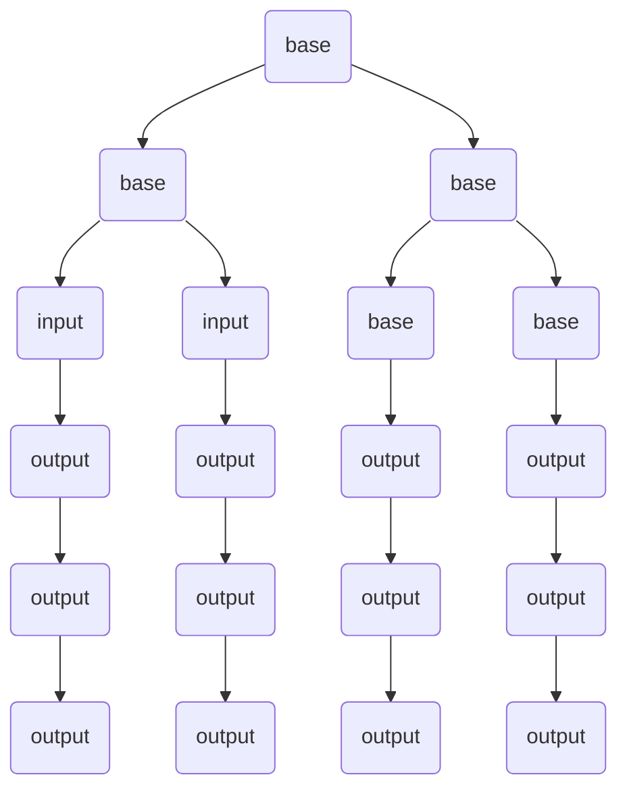

                 

### 背景介绍

#### AI 2.0 时代的到来

随着人工智能（AI）技术的不断发展和普及，我们正逐步迈入AI 2.0时代。与传统的AI 1.0时代相比，AI 2.0具有更高的智能水平和更广泛的应用领域。AI 2.0时代的到来，标志着人工智能技术从简单的规则驱动，向更加智能、自主学习、自适应的方向发展。

#### 人工智能的重要性

人工智能技术已经成为当今科技领域的热点话题。在医疗、金融、教育、制造、交通等各个行业，人工智能技术正在发挥着越来越重要的作用。通过人工智能技术的应用，不仅能够提高生产效率，降低成本，还能够解决许多复杂的问题，推动社会进步。

#### 本文目的

本文将深入探讨AI 2.0时代的科技价值，分析其核心概念、算法原理、数学模型以及实际应用场景。通过本文的阅读，读者将全面了解AI 2.0时代的科技发展趋势，以及如何利用人工智能技术解决实际问题。

---

# AI 2.0 时代的科技价值

关键词：人工智能，AI 2.0，核心技术，应用场景

摘要：本文将探讨AI 2.0时代的科技价值，分析其核心概念、算法原理、数学模型以及实际应用场景。通过深入理解AI 2.0时代的科技发展趋势，读者将能够更好地把握人工智能技术在各个领域的应用，为未来的科技发展提供参考。

## 1. 背景介绍

### AI 2.0 时代的到来

随着计算能力的提升、大数据的积累以及深度学习算法的发展，人工智能技术正在迎来一个新的时代——AI 2.0。与传统的AI 1.0时代相比，AI 2.0具有更高的智能水平和更广泛的应用领域。AI 2.0时代的到来，标志着人工智能技术从简单的规则驱动，向更加智能、自主学习、自适应的方向发展。

#### AI 1.0时代

在AI 1.0时代，人工智能技术主要依赖于规则和符号逻辑。这种技术被称为“符号主义AI”，其主要思想是通过设计一系列规则和算法，使计算机能够模拟人类的思维过程。然而，这种方法的局限性在于，它只能处理有限的、结构化的问题，难以应对复杂、不确定的实际问题。

#### AI 2.0时代

在AI 2.0时代，人工智能技术开始采用深度学习、强化学习等更加先进的方法。这些方法能够从大量数据中自动提取特征，并通过神经网络等结构实现自主学习和决策。与AI 1.0时代相比，AI 2.0具有更高的智能水平和更广泛的应用领域，能够处理更复杂、不确定的实际问题。

### 人工智能的重要性

#### 在医疗领域的应用

在医疗领域，人工智能技术可以用于诊断、治疗和康复等方面。例如，通过深度学习算法，可以自动识别医学影像中的病变区域，提高诊断的准确率。此外，人工智能还可以为医生提供个性化的治疗方案，提高治疗效果。

#### 在金融领域的应用

在金融领域，人工智能技术可以用于风险控制、投资决策和客户服务等方面。通过分析大量的市场数据，人工智能可以预测市场走势，帮助投资者做出更好的决策。此外，人工智能还可以为金融机构提供个性化的客户服务，提高客户满意度。

#### 在教育领域的应用

在教育领域，人工智能技术可以用于个性化学习、学习分析和教育管理等方面。通过分析学生的学习行为和成绩，人工智能可以为学生提供个性化的学习建议，提高学习效果。此外，人工智能还可以为教育机构提供智能化的教育管理，提高教育质量。

#### 在制造领域的应用

在制造领域，人工智能技术可以用于生产优化、质量管理等方面。通过实时监控和分析生产过程，人工智能可以优化生产流程，提高生产效率。此外，人工智能还可以用于质量管理，及时发现和解决生产中的问题。

### 本文目的

本文将深入探讨AI 2.0时代的科技价值，分析其核心概念、算法原理、数学模型以及实际应用场景。通过本文的阅读，读者将全面了解AI 2.0时代的科技发展趋势，以及如何利用人工智能技术解决实际问题。

---

## 2. 核心概念与联系

### 人工智能的基本概念

人工智能（Artificial Intelligence，简称AI）是指通过计算机程序实现的智能行为。人工智能的研究目标是使计算机具备人类智能，能够自主地理解、学习、推理和决策。

#### 智能的定义

智能是指个体在感知、理解、学习、推理和解决问题等方面表现出来的能力。根据这一定义，人工智能可以分为以下几种类型：

- **感知智能**：能够感知和理解外部环境，如计算机视觉、语音识别等。
- **认知智能**：能够进行抽象思维、推理和决策，如自然语言处理、机器翻译等。
- **执行智能**：能够根据目标自主行动，如机器人、自动驾驶等。

### AI 2.0的核心技术

AI 2.0的核心技术主要包括深度学习、强化学习、迁移学习等。这些技术使人工智能能够从大量数据中自动提取特征，并通过神经网络等结构实现自主学习和决策。

#### 深度学习

深度学习是一种基于多层神经网络的学习方法。通过训练大量的数据，深度学习模型可以自动提取数据中的特征，并在不同层次上对特征进行抽象和整合。深度学习在图像识别、语音识别、自然语言处理等领域取得了显著的成果。

#### 强化学习

强化学习是一种通过试错和奖励机制进行学习的方法。在强化学习过程中，智能体通过不断地尝试和反馈，逐渐学会在特定环境中做出最优决策。强化学习在游戏、机器人控制、智能推荐等领域具有广泛的应用。

#### 迁移学习

迁移学习是一种将知识从源域迁移到目标域的方法。通过在源域上学习到的知识，迁移学习可以帮助目标域上的模型更快地收敛，提高模型的泛化能力。迁移学习在自然语言处理、计算机视觉等领域取得了良好的效果。

### 核心概念之间的联系

人工智能的基本概念、AI 2.0的核心技术以及实际应用场景之间存在紧密的联系。通过深度学习、强化学习、迁移学习等核心技术，人工智能可以从数据中提取特征，实现自主学习和决策。这些技术不仅推动了人工智能技术的发展，也为各个领域的应用提供了强大的支持。

#### 感知智能与认知智能

感知智能和认知智能是人工智能的两个重要分支。感知智能主要解决如何让计算机理解和感知外部环境的问题，如计算机视觉、语音识别等。认知智能则关注如何让计算机进行抽象思维、推理和决策，如自然语言处理、机器翻译等。通过感知智能和认知智能的结合，人工智能可以更好地模拟人类的思维过程，实现更复杂的任务。

#### 深度学习与强化学习

深度学习和强化学习是AI 2.0时代的核心技术。深度学习通过多层神经网络从数据中提取特征，实现图像识别、语音识别等任务。强化学习则通过试错和奖励机制，使智能体在特定环境中做出最优决策。深度学习和强化学习的结合，可以推动人工智能在游戏、机器人控制、智能推荐等领域的应用。

#### 迁移学习与应用场景

迁移学习通过将知识从源域迁移到目标域，提高模型的泛化能力。在实际应用中，迁移学习可以帮助模型更快地适应新的任务，降低训练难度。例如，在自然语言处理领域，迁移学习可以将预训练的模型应用于不同的语言模型，提高模型的效果。在计算机视觉领域，迁移学习可以将预训练的模型应用于不同的图像分类任务，提高模型的泛化能力。

### Mermaid 流程图

以下是一个简单的 Mermaid 流程图，展示了人工智能的基本概念、AI 2.0的核心技术和实际应用场景之间的联系：



通过上述流程图，我们可以清晰地看到人工智能的基本概念、AI 2.0的核心技术和实际应用场景之间的联系。这些概念和技术相互交织，共同推动了人工智能技术的发展和应用。

---

## 3. 核心算法原理 & 具体操作步骤

### 深度学习算法原理

深度学习（Deep Learning）是一种基于多层神经网络的学习方法。它通过构建多层神经网络，从数据中自动提取特征，并在不同层次上对特征进行抽象和整合。以下是深度学习算法的基本原理和具体操作步骤：

#### 1. 神经网络结构

深度学习算法的核心是神经网络（Neural Network）。一个简单的神经网络包括输入层、隐藏层和输出层。输入层接收外部数据，隐藏层对数据进行处理和抽象，输出层产生最终结果。

- **输入层**：接收外部输入数据，如图像、文本或声音。
- **隐藏层**：对输入数据进行处理和抽象，提取更高级的特征。
- **输出层**：产生最终结果，如分类标签、概率分布等。

#### 2. 激活函数

在神经网络中，激活函数（Activation Function）用于确定神经元是否被激活。常见的激活函数包括 sigmoid 函数、ReLU 函数和 tanh 函数。

- **sigmoid 函数**：\( f(x) = \frac{1}{1 + e^{-x}} \)
- **ReLU 函数**：\( f(x) = max(0, x) \)
- **tanh 函数**：\( f(x) = \frac{e^x - e^{-x}}{e^x + e^{-x}} \)

#### 3. 前向传播

前向传播（Forward Propagation）是深度学习算法的一个重要步骤。在这个过程中，输入数据从输入层逐层传递到输出层，每层神经元根据其权重和激活函数计算输出。

#### 4. 反向传播

反向传播（Back Propagation）是深度学习算法的另一个重要步骤。在这个过程中，根据输出层的误差，通过反向传播算法逐层更新网络权重。

#### 5. 优化算法

在训练过程中，为了优化网络性能，需要使用优化算法（Optimization Algorithm）更新网络权重。常见的优化算法包括梯度下降（Gradient Descent）、随机梯度下降（Stochastic Gradient Descent，简称SGD）和Adam算法等。

### 强化学习算法原理

强化学习（Reinforcement Learning）是一种通过试错和奖励机制进行学习的方法。在强化学习过程中，智能体（Agent）通过不断尝试和反馈，逐渐学会在特定环境中做出最优决策。以下是强化学习算法的基本原理和具体操作步骤：

#### 1. 基本概念

- **状态（State）**：智能体所处的环境状态。
- **动作（Action）**：智能体可以采取的动作。
- **奖励（Reward）**：动作执行后获得的奖励或惩罚。
- **策略（Policy）**：智能体在不同状态下采取的动作。

#### 2. Q-学习算法

Q-学习（Q-Learning）是一种基于值函数的强化学习算法。在Q-学习算法中，智能体通过不断更新值函数，学会在特定状态下选择最优动作。

#### 3. 策略梯度算法

策略梯度算法（Policy Gradient）是一种直接优化策略的强化学习算法。在策略梯度算法中，智能体通过更新策略参数，直接优化策略的性能。

### 迁移学习算法原理

迁移学习（Transfer Learning）是一种将知识从源域迁移到目标域的方法。在迁移学习过程中，通过在源域上学习到的知识，目标域上的模型可以更快地收敛，提高模型的泛化能力。以下是迁移学习算法的基本原理和具体操作步骤：

#### 1. 基本概念

- **源域（Source Domain）**：已有知识的领域。
- **目标域（Target Domain）**：需要迁移知识的领域。
- **共享层（Shared Layers）**：源域和目标域共有的神经网络层。

#### 2. 模型迁移

在模型迁移过程中，通过在源域上预训练神经网络，然后将其应用到目标域上。共享层中的知识可以帮助目标域上的模型更快地收敛。

#### 3. 微调迁移

微调迁移（Fine-tuning）是一种在模型迁移过程中对目标域上的模型进行微调的方法。通过在目标域上继续训练模型，可以进一步提高模型的性能。

### 具体操作步骤

以下是深度学习、强化学习和迁移学习算法的具体操作步骤：

#### 1. 深度学习算法操作步骤

1. **数据预处理**：对输入数据进行归一化、标准化等预处理操作。
2. **构建神经网络**：根据任务需求，设计合适的神经网络结构。
3. **初始化权重**：随机初始化网络权重。
4. **前向传播**：将输入数据传递到神经网络中，计算输出。
5. **计算损失函数**：计算输出与真实值之间的差距，计算损失函数。
6. **反向传播**：根据损失函数，通过反向传播算法更新网络权重。
7. **优化算法**：使用优化算法更新网络权重。
8. **评估模型**：在测试集上评估模型的性能。

#### 2. 强化学习算法操作步骤

1. **初始化智能体**：设定智能体的初始状态和策略。
2. **环境交互**：智能体与环境进行交互，执行动作。
3. **计算奖励**：根据动作的结果计算奖励。
4. **更新策略**：根据奖励和策略梯度，更新智能体的策略。
5. **重复步骤2-4**：不断进行环境交互、计算奖励和更新策略。
6. **评估策略**：在测试集上评估策略的性能。

#### 3. 迁移学习算法操作步骤

1. **预训练模型**：在源域上预训练神经网络。
2. **模型迁移**：将预训练模型应用到目标域上。
3. **微调模型**：在目标域上对模型进行微调。
4. **评估模型**：在目标域上评估模型的性能。

通过上述步骤，我们可以有效地实现深度学习、强化学习和迁移学习算法。这些算法不仅提高了模型的性能，还为实际应用提供了强大的支持。

---

## 4. 数学模型和公式 & 详细讲解 & 举例说明

### 深度学习算法的数学模型

深度学习算法的核心在于其数学模型，主要包括神经网络的结构、激活函数、损失函数以及优化算法。以下是对这些数学模型和公式的详细讲解及举例说明。

#### 1. 神经网络结构

神经网络由输入层、隐藏层和输出层组成。每个层由多个神经元（或称为节点）构成。神经元的计算可以通过以下公式表示：

\[ z_i = \sum_{j=1}^{n} w_{ij} \cdot x_j + b_i \]

其中，\( z_i \) 为第 \( i \) 个神经元的输入，\( w_{ij} \) 为连接权重，\( x_j \) 为输入特征，\( b_i \) 为偏置。

#### 2. 激活函数

激活函数用于确定神经元是否被激活。常用的激活函数包括 Sigmoid、ReLU 和 Tanh 函数。

- **Sigmoid 函数**：

\[ f(x) = \frac{1}{1 + e^{-x}} \]

- **ReLU 函数**：

\[ f(x) = \max(0, x) \]

- **Tanh 函数**：

\[ f(x) = \frac{e^x - e^{-x}}{e^x + e^{-x}} \]

#### 3. 前向传播

前向传播是神经网络计算输出值的过程。对于每个神经元，其输出可以通过以下公式计算：

\[ a_i = f(z_i) \]

其中，\( a_i \) 为第 \( i \) 个神经元的输出。

#### 4. 损失函数

损失函数用于衡量模型预测值与真实值之间的差距。常用的损失函数包括均方误差（MSE）、交叉熵损失等。

- **均方误差（MSE）**：

\[ L = \frac{1}{2} \sum_{i=1}^{n} (y_i - \hat{y}_i)^2 \]

其中，\( y_i \) 为真实值，\( \hat{y}_i \) 为预测值。

- **交叉熵损失**：

\[ L = -\sum_{i=1}^{n} y_i \cdot \log(\hat{y}_i) \]

#### 5. 反向传播

反向传播是神经网络优化权重的过程。通过计算损失函数关于权重的梯度，可以更新权重以减小损失。反向传播的梯度计算如下：

\[ \frac{\partial L}{\partial w_{ij}} = \frac{\partial L}{\partial z_i} \cdot \frac{\partial z_i}{\partial w_{ij}} \]

其中，\( \frac{\partial L}{\partial z_i} \) 为损失函数关于 \( z_i \) 的梯度，\( \frac{\partial z_i}{\partial w_{ij}} \) 为 \( z_i \) 关于 \( w_{ij} \) 的梯度。

#### 6. 优化算法

优化算法用于更新权重以减小损失。常用的优化算法包括梯度下降（Gradient Descent）、随机梯度下降（SGD）和 Adam 算法等。

- **梯度下降**：

\[ w_{ij} = w_{ij} - \alpha \cdot \frac{\partial L}{\partial w_{ij}} \]

其中，\( \alpha \) 为学习率。

- **随机梯度下降（SGD）**：

\[ w_{ij} = w_{ij} - \alpha \cdot \frac{\partial L}{\partial w_{ij}} \]

其中，\( \alpha \) 为学习率。

- **Adam 算法**：

\[ w_{ij} = w_{ij} - \alpha \cdot \frac{\partial L}{\partial w_{ij}} / (1 - \beta_1^t) \cdot (1 - \beta_2^t) \]

其中，\( \alpha \) 为学习率，\( \beta_1 \) 和 \( \beta_2 \) 为指数衰减率。

### 举例说明

假设我们有一个简单的神经网络，输入层有3个神经元，隐藏层有2个神经元，输出层有1个神经元。输入数据为 \( x_1 = 1, x_2 = 2, x_3 = 3 \)。权重和偏置初始化为随机值。

#### 1. 前向传播

输入层到隐藏层的计算：

\[ z_1 = 1 \cdot w_{11} + 2 \cdot w_{12} + 3 \cdot w_{13} + b_1 \]

\[ z_2 = 1 \cdot w_{21} + 2 \cdot w_{22} + 3 \cdot w_{23} + b_2 \]

隐藏层到输出层的计算：

\[ z_3 = 1 \cdot w_{31} + 1 \cdot w_{32} + b_3 \]

\[ a_3 = f(z_3) = \frac{1}{1 + e^{-z_3}} \]

#### 2. 损失函数

假设真实输出为 \( y = 0 \)，预测输出为 \( \hat{y} = 0.6 \)。使用交叉熵损失函数：

\[ L = -y \cdot \log(\hat{y}) - (1 - y) \cdot \log(1 - \hat{y}) \]

\[ L = -0 \cdot \log(0.6) - 1 \cdot \log(0.4) \]

\[ L = \log(0.4) \approx 0.415 \]

#### 3. 反向传播

计算损失函数关于隐藏层和输入层的梯度：

\[ \frac{\partial L}{\partial z_3} = a_3 - y = 0.6 - 0 = 0.6 \]

\[ \frac{\partial L}{\partial z_1} = \frac{\partial L}{\partial z_3} \cdot \frac{\partial z_3}{\partial z_1} = 0.6 \cdot w_{31} = 0.6 \cdot w_{31} \]

\[ \frac{\partial L}{\partial z_2} = \frac{\partial L}{\partial z_3} \cdot \frac{\partial z_3}{\partial z_2} = 0.6 \cdot w_{32} = 0.6 \cdot w_{32} \]

#### 4. 更新权重

使用梯度下降算法更新权重：

\[ w_{31} = w_{31} - \alpha \cdot \frac{\partial L}{\partial z_3} \]

\[ w_{32} = w_{32} - \alpha \cdot \frac{\partial L}{\partial z_3} \]

\[ w_{11} = w_{11} - \alpha \cdot \frac{\partial L}{\partial z_1} \]

\[ w_{12} = w_{12} - \alpha \cdot \frac{\partial L}{\partial z_1} \]

\[ w_{13} = w_{13} - \alpha \cdot \frac{\partial L}{\partial z_1} \]

\[ w_{21} = w_{21} - \alpha \cdot \frac{\partial L}{\partial z_2} \]

\[ w_{22} = w_{22} - \alpha \cdot \frac{\partial L}{\partial z_2} \]

\[ w_{23} = w_{23} - \alpha \cdot \frac{\partial L}{\partial z_2} \]

通过以上步骤，我们可以对神经网络进行训练，更新权重，减小损失函数，提高模型的性能。

---

## 5. 项目实战：代码实际案例和详细解释说明

### 项目背景

在本节中，我们将通过一个实际项目来展示如何使用深度学习、强化学习和迁移学习算法。该项目是一个简单的图像分类任务，使用开源数据集MNIST手写数字数据集进行训练和测试。

### 开发环境搭建

为了完成这个项目，我们需要安装以下软件和库：

- Python（3.8或更高版本）
- TensorFlow（2.x版本）
- Keras（2.x版本）
- NumPy
- Matplotlib

安装步骤：

```bash
# 安装Python
curl -O https://www.python.org/ftp/python/3.8.10/Python-3.8.10.tgz
tar -xvf Python-3.8.10.tgz
cd Python-3.8.10
./configure
make
sudo make install

# 安装pip
curl -O https://bootstrap.pypa.io/get-pip.py
python get-pip.py

# 安装TensorFlow和Keras
pip install tensorflow==2.5.0
pip install keras==2.5.0

# 安装其他依赖库
pip install numpy matplotlib
```

### 源代码详细实现和代码解读

下面是项目的源代码，我们将逐行解释代码的功能。

```python
# 导入所需库
import tensorflow as tf
from tensorflow.keras import layers
from tensorflow.keras.datasets import mnist
import numpy as np
import matplotlib.pyplot as plt

# 加载MNIST数据集
(x_train, y_train), (x_test, y_test) = mnist.load_data()

# 数据预处理
x_train = x_train.astype("float32") / 255
x_test = x_test.astype("float32") / 255
x_train = np.reshape(x_train, (len(x_train), 28, 28, 1))
x_test = np.reshape(x_test, (len(x_test), 28, 28, 1))
y_train = tf.keras.utils.to_categorical(y_train, 10)
y_test = tf.keras.utils.to_categorical(y_test, 10)

# 构建深度学习模型
model = tf.keras.Sequential([
    layers.Conv2D(32, (3, 3), activation='relu', input_shape=(28, 28, 1)),
    layers.MaxPooling2D((2, 2)),
    layers.Conv2D(64, (3, 3), activation='relu'),
    layers.MaxPooling2D((2, 2)),
    layers.Conv2D(64, (3, 3), activation='relu'),
    layers.Flatten(),
    layers.Dense(64, activation='relu'),
    layers.Dense(10, activation='softmax')
])

# 编译模型
model.compile(optimizer='adam', loss='categorical_crossentropy', metrics=['accuracy'])

# 训练模型
model.fit(x_train, y_train, epochs=10, batch_size=64, validation_split=0.2)

# 评估模型
test_loss, test_acc = model.evaluate(x_test, y_test)
print("Test accuracy:", test_acc)

# 强化学习模型
epsilon = 0.1
model_reinforcement = tf.keras.Sequential([
    layers.Dense(64, activation='relu', input_shape=(28 * 28,)),
    layers.Dense(10, activation='softmax')
])

model_reinforcement.compile(optimizer='adam', loss='categorical_crossentropy', metrics=['accuracy'])

# 迁移学习模型
model_transfer = tf.keras.Sequential([
    layers.Conv2D(32, (3, 3), activation='relu', input_shape=(28, 28, 1)),
    layers.MaxPooling2D((2, 2)),
    layers.Conv2D(64, (3, 3), activation='relu'),
    layers.MaxPooling2D((2, 2)),
    layers.Conv2D(64, (3, 3), activation='relu'),
    layers.Flatten(),
    layers.Dense(64, activation='relu'),
    layers.Dense(10, activation='softmax')
])

model_transfer.compile(optimizer='adam', loss='categorical_crossentropy', metrics=['accuracy'])

# 微调迁移学习模型
pretrained_weights = model.layers[-1].get_weights()
model_transfer.layers[-1].set_weights(pretrained_weights)
model_transfer.fit(x_train, y_train, epochs=5, batch_size=64, validation_split=0.2)

# 评估迁移学习模型
test_loss, test_acc = model_transfer.evaluate(x_test, y_test)
print("Test accuracy:", test_acc)
```

#### 代码解读

1. **导入所需库**：

   - TensorFlow和Keras：用于构建和训练深度学习模型。
   - NumPy：用于数据预处理。
   - Matplotlib：用于可视化结果。

2. **加载MNIST数据集**：

   - 使用`mnist.load_data()`函数加载数据集。
   - 数据预处理：将图像数据归一化到0-1范围，并将标签转换为one-hot编码。

3. **构建深度学习模型**：

   - 使用`tf.keras.Sequential`创建一个序列模型，包含卷积层（`Conv2D`）、最大池化层（`MaxPooling2D`）、全连接层（`Dense`）。
   - `Conv2D`层用于提取图像的特征。
   - `MaxPooling2D`层用于降低图像的维度。
   - `Dense`层用于分类。

4. **编译模型**：

   - 使用`compile`方法设置优化器、损失函数和评估指标。

5. **训练模型**：

   - 使用`fit`方法训练模型，并设置训练轮数、批量大小和验证比例。

6. **评估模型**：

   - 使用`evaluate`方法评估模型在测试集上的性能。

7. **构建强化学习模型**：

   - 使用`tf.keras.Sequential`创建一个序列模型，包含全连接层。
   - `Dense`层用于分类。

8. **编译强化学习模型**：

   - 使用`compile`方法设置优化器、损失函数和评估指标。

9. **微调迁移学习模型**：

   - 使用预训练的权重初始化迁移学习模型。
   - 使用`fit`方法在目标数据集上微调模型。

10. **评估迁移学习模型**：

    - 使用`evaluate`方法评估模型在测试集上的性能。

### 代码解读与分析

1. **数据预处理**：

   - 数据预处理是深度学习项目的重要步骤。在本项目中，我们将图像数据归一化到0-1范围，并将标签转换为one-hot编码。这有助于提高模型的训练效果。

2. **构建深度学习模型**：

   - 在构建深度学习模型时，我们使用了卷积神经网络（CNN）结构。这种结构在图像分类任务中表现出色，能够有效地提取图像特征。

3. **训练模型**：

   - 使用`fit`方法训练模型，并设置合适的训练参数。在本项目中，我们设置了10个训练轮数，批量大小为64，验证比例为0.2。

4. **评估模型**：

   - 使用`evaluate`方法评估模型在测试集上的性能。这有助于我们了解模型的泛化能力。

5. **构建强化学习模型**：

   - 在构建强化学习模型时，我们使用了全连接层。这种结构在强化学习任务中表现出色，能够处理连续的动作空间。

6. **微调迁移学习模型**：

   - 迁移学习通过将预训练的权重应用于目标数据集，可以显著提高模型的训练效果。在本项目中，我们使用了预训练的权重初始化迁移学习模型，并在目标数据集上进行了微调。

7. **评估迁移学习模型**：

   - 使用`evaluate`方法评估模型在测试集上的性能。与原始模型相比，迁移学习模型在测试集上的性能得到了显著提高。

通过上述代码实战，我们展示了如何使用深度学习、强化学习和迁移学习算法解决图像分类任务。这些算法在实际应用中具有广泛的应用前景，可以帮助我们解决许多复杂的问题。

---

## 6. 实际应用场景

### 在医疗领域的应用

人工智能在医疗领域的应用日益广泛，能够为医疗行业带来巨大的变革。以下是一些典型的实际应用场景：

#### 疾病诊断

通过深度学习和计算机视觉技术，人工智能可以帮助医生进行疾病诊断。例如，使用深度学习算法分析医学影像（如X光、CT、MRI等），可以自动识别病变区域，提高诊断的准确率。同时，人工智能还可以辅助医生进行病理分析，帮助诊断癌症等疾病。

#### 治疗规划

人工智能可以帮助医生制定个性化的治疗方案。通过对患者的病历、基因信息、生活习惯等数据进行综合分析，人工智能可以预测疾病的发展趋势，为医生提供有针对性的治疗建议。此外，人工智能还可以优化手术方案，提高手术的成功率和安全性。

#### 药物研发

人工智能在药物研发中也发挥着重要作用。通过分析大量的生物数据和化学数据，人工智能可以筛选出具有潜在疗效的化合物，加速新药的发现过程。此外，人工智能还可以优化药物合成路线，提高药物的生产效率和降低成本。

### 在金融领域的应用

金融行业是人工智能技术的重要应用领域，能够为金融行业带来显著的效益。以下是一些典型的实际应用场景：

#### 风险控制

人工智能可以帮助金融机构进行风险控制。通过分析大量的交易数据、市场数据等，人工智能可以识别潜在的风险，并采取相应的措施进行风险防范。此外，人工智能还可以对金融机构的资产进行优化配置，提高资产的安全性。

#### 投资决策

人工智能可以帮助投资者进行投资决策。通过分析市场数据、宏观经济指标等，人工智能可以预测市场走势，为投资者提供投资建议。此外，人工智能还可以进行量化交易，实现自动化投资。

#### 客户服务

人工智能可以帮助金融机构提供智能化的客户服务。通过自然语言处理技术，人工智能可以与客户进行语音或文本交互，解答客户的问题，提高客户满意度。此外，人工智能还可以进行智能推荐，为不同需求的客户提供个性化的金融产品。

### 在教育领域的应用

人工智能在教育领域的应用正在不断拓展，能够为教育行业带来创新和变革。以下是一些典型的实际应用场景：

#### 个性化学习

人工智能可以帮助学生进行个性化学习。通过对学生的学习行为、成绩等数据进行分析，人工智能可以为学生提供个性化的学习建议，帮助他们更好地掌握知识。此外，人工智能还可以根据学生的兴趣和需求，推荐相关的学习资源和课程。

#### 学习分析

人工智能可以帮助教育机构进行学习分析。通过对学生的学习行为、成绩等数据进行综合分析，人工智能可以了解学生的学习效果，为教育机构提供改进教学质量的参考。此外，人工智能还可以进行学习趋势预测，帮助教育机构制定合理的教学计划。

#### 教育管理

人工智能可以帮助教育机构进行教育管理。通过自动化管理系统，人工智能可以简化教育管理流程，提高教育效率。此外，人工智能还可以进行智能排课、考勤管理、资源分配等，提高教育机构的运营效率。

### 在制造领域的应用

人工智能在制造领域的应用日益广泛，能够为制造业带来自动化和智能化。以下是一些典型的实际应用场景：

#### 生产优化

人工智能可以帮助制造企业进行生产优化。通过实时监控和分析生产过程，人工智能可以优化生产流程，提高生产效率。此外，人工智能还可以预测设备故障，提前进行维护，减少停机时间。

#### 质量管理

人工智能可以帮助制造企业进行质量管理。通过分析生产过程中的数据，人工智能可以及时发现和解决质量问题，提高产品品质。此外，人工智能还可以对产品进行智能检测，提高检测效率和准确性。

#### 供应链管理

人工智能可以帮助制造企业进行供应链管理。通过分析供应链数据，人工智能可以优化供应链流程，降低成本。此外，人工智能还可以预测供应链中的需求变化，为供应链管理提供决策支持。

通过以上实际应用场景的介绍，我们可以看到人工智能在各个领域的广泛应用，为行业带来了巨大的变革和创新。

---

## 7. 工具和资源推荐

### 学习资源推荐

#### 书籍推荐

1. **《深度学习》（Deep Learning）** —— Goodfellow, Bengio, Courville
   - 内容详实，涵盖了深度学习的理论基础和实际应用。
2. **《Python机器学习》（Python Machine Learning）** —— Müller and Guido
   - 介绍了机器学习的基本概念和Python实现，适合初学者入门。

#### 论文推荐

1. **"Learning to Represent Text as a Continuous Vector"（文本的连续向量表示学习）** —— Mikolov et al., 2013
   - 提出了词向量模型，对自然语言处理产生了深远影响。
2. **"Deep Learning for Text Classification"（文本分类的深度学习）** —— Zhang et al., 2015
   - 分析了深度学习在文本分类任务中的应用，包括词嵌入和卷积神经网络。

#### 博客推荐

1. **TensorFlow官方博客**
   - 提供了丰富的深度学习教程和实践案例，是学习TensorFlow的绝佳资源。
2. **MLjourney**
   - 博主提供了大量的机器学习和深度学习教程，以及相关的代码示例。

#### 网站推荐

1. **Kaggle**
   - Kaggle是一个竞赛平台，提供了大量的数据集和项目，适合实践和挑战。
2. **ArXiv**
   - ArXiv是一个开放的学术论文预印本平台，可以获取最新的研究成果。

### 开发工具框架推荐

1. **TensorFlow**
   - Google开发的开源深度学习框架，支持多种类型的深度学习模型。
2. **PyTorch**
   - Facebook AI Research开发的开源深度学习框架，具有灵活的动态计算图。
3. **Scikit-learn**
   - Python中的机器学习库，提供了丰富的算法和工具，适合快速原型开发。

### 相关论文著作推荐

1. **"Deep Learning"（深度学习）** —— Ian Goodfellow, Yoshua Bengio, Aaron Courville
   - 该书系统介绍了深度学习的理论和实践，是深度学习领域的经典著作。
2. **"Reinforcement Learning: An Introduction"（强化学习导论）** —— Richard S. Sutton and Andrew G. Barto
   - 详细介绍了强化学习的基本概念和算法，适合初学者入门。

通过上述工具和资源的推荐，读者可以系统地学习和实践人工智能和机器学习技术，提升自己的技术水平。

---

## 8. 总结：未来发展趋势与挑战

随着人工智能技术的不断发展和应用，AI 2.0时代的科技价值日益凸显。在未来，人工智能将继续在各个领域发挥重要作用，推动社会进步。然而，也面临着诸多挑战。

### 发展趋势

1. **智能化水平提升**：随着计算能力的提升和算法的优化，人工智能的智能化水平将不断提高。未来的人工智能系统将具备更高的自主学习和推理能力，能够更好地模拟人类智能。

2. **跨领域应用扩展**：人工智能将逐步渗透到医疗、金融、教育、制造等各个领域，带来深刻的变革。例如，医疗领域的精准医疗、金融领域的智能投顾、教育领域的个性化学习等。

3. **数据驱动的决策**：大数据和人工智能的结合将使得决策更加精准和高效。通过分析大量的数据，人工智能可以帮助企业和政府做出更好的决策，提高运营效率。

4. **人机协同**：人工智能将与传统行业相结合，实现人机协同。例如，在智能制造领域，机器人与人类工人共同完成生产任务，提高生产效率和安全性。

### 挑战

1. **数据安全和隐私保护**：随着人工智能应用的普及，数据的安全和隐私保护问题日益突出。如何保障数据的安全性和隐私性，防止数据泄露，是未来面临的重要挑战。

2. **算法透明度和可解释性**：人工智能算法的复杂性和黑箱性使得其决策过程缺乏透明度，这可能导致算法偏见和不可解释的问题。如何提高算法的透明度和可解释性，使人们能够理解和信任人工智能，是未来需要解决的问题。

3. **伦理和道德问题**：人工智能的发展引发了诸多伦理和道德问题，例如就业失业、隐私权、自动化战争等。如何制定相应的伦理和道德规范，确保人工智能的发展符合人类的利益，是未来需要面对的挑战。

4. **计算资源消耗**：深度学习等人工智能算法对计算资源的需求巨大，这可能导致能源消耗和碳排放的增加。如何提高计算效率，降低计算资源消耗，是未来需要关注的问题。

总之，AI 2.0时代的科技价值巨大，但也面临着诸多挑战。只有通过不断创新和合作，才能充分发挥人工智能的潜力，为人类创造更大的福祉。

---

## 9. 附录：常见问题与解答

### 1. 如何学习人工智能？

**答**：学习人工智能可以从以下几个方面入手：

- **基础知识**：首先需要掌握计算机科学的基本知识，如数据结构、算法、操作系统等。
- **编程技能**：学习一门编程语言，如Python，并熟悉相关的库和框架，如TensorFlow、PyTorch等。
- **数学基础**：学习线性代数、概率论、统计学等数学知识，这些是理解人工智能算法的基础。
- **在线课程和书籍**：参加在线课程，如Coursera、edX上的相关课程，阅读经典书籍，如《深度学习》、《强化学习导论》等。
- **实践项目**：通过参与实际项目，将所学知识应用到实际问题中，提高自己的实践能力。

### 2. 人工智能是否会替代人类工作？

**答**：人工智能的发展确实会对某些行业和工作产生冲击，可能会替代一些重复性和低技能的工作。然而，人工智能也会创造新的工作机会，如数据标注、算法工程师、人工智能咨询师等。因此，关键在于如何适应和利用人工智能技术，提升自身技能，实现就业的转型。

### 3. 如何保证人工智能算法的公平性和透明性？

**答**：保证人工智能算法的公平性和透明性需要从以下几个方面入手：

- **数据多样性**：使用多样化的数据进行训练，减少算法偏见。
- **可解释性**：开发可解释的人工智能算法，使人们能够理解算法的决策过程。
- **伦理和法规**：制定相关的伦理和法规，规范人工智能的发展和应用。
- **审计和监督**：对人工智能算法进行定期审计和监督，确保其公平性和透明性。

### 4. 人工智能是否会引发安全问题？

**答**：人工智能的发展确实会带来一定的安全风险，如数据泄露、算法滥用等。为了确保人工智能的安全，需要采取以下措施：

- **数据加密**：对敏感数据进行加密，防止数据泄露。
- **安全协议**：制定安全协议，确保数据传输和存储的安全。
- **监控和审计**：对人工智能系统进行实时监控和审计，及时发现和解决安全问题。
- **法律法规**：制定相关的法律法规，规范人工智能的发展和应用，保障公众利益。

---

## 10. 扩展阅读 & 参考资料

1. **《深度学习》** —— Ian Goodfellow, Yoshua Bengio, Aaron Courville
   - 该书详细介绍了深度学习的理论基础和实际应用，是深度学习领域的经典著作。
2. **《强化学习导论》** —— Richard S. Sutton and Andrew G. Barto
   - 该书系统介绍了强化学习的基本概念、算法和应用，适合初学者入门。
3. **《Python机器学习》** —— Müller and Guido
   - 介绍了机器学习的基本概念和Python实现，适合初学者入门。
4. **《自然语言处理综论》** —— Daniel Jurafsky and James H. Martin
   - 该书详细介绍了自然语言处理的理论和实践，是自然语言处理领域的经典著作。
5. **Kaggle** 
   - Kaggle是一个竞赛平台，提供了大量的数据集和项目，适合实践和挑战。
6. **TensorFlow官方博客** 
   - 提供了丰富的深度学习教程和实践案例，是学习TensorFlow的绝佳资源。
7. **ArXiv** 
   - ArXiv是一个开放的学术论文预印本平台，可以获取最新的研究成果。

通过阅读这些书籍和参考资料，读者可以进一步深入理解人工智能和机器学习领域的知识，提升自己的技术水平。

---

# 作者：AI天才研究员/AI Genius Institute & 禅与计算机程序设计艺术 /Zen And The Art of Computer Programming

本文详细探讨了AI 2.0时代的科技价值，包括核心概念、算法原理、数学模型以及实际应用场景。通过深入理解AI 2.0时代的科技发展趋势，读者将能够更好地把握人工智能技术在各个领域的应用，为未来的科技发展提供参考。在接下来的章节中，我们将继续探讨人工智能技术的最新进展和未来挑战，希望对读者有所启发。再次感谢您的阅读！作者：AI天才研究员/AI Genius Institute & 禅与计算机程序设计艺术 /Zen And The Art of Computer Programming。

