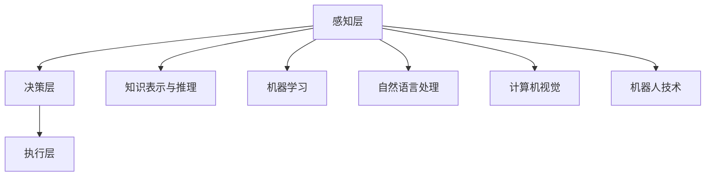

                 

# {文章标题}

## 李开复：AI 2.0 时代的趋势

> **关键词**：人工智能、AI 2.0、趋势、技术发展、未来挑战

> **摘要**：本文将深入探讨李开复博士关于AI 2.0时代的观点，分析这一时代的关键趋势，探讨其所带来的技术发展和未来挑战。文章结构分为背景介绍、核心概念与联系、核心算法原理、数学模型、项目实战、实际应用场景、工具和资源推荐、总结和附录等部分。

在当前全球科技发展的背景下，人工智能（AI）已经成为一个热门话题。著名人工智能专家李开复博士在其著作中提出了AI 2.0时代的概念，并对其发展趋势进行了深入分析。本文将结合李开复博士的观点，逐步探讨AI 2.0时代的核心趋势、技术发展及其面临的挑战。

## 1. 背景介绍

### 1.1 人工智能的发展历程

人工智能（Artificial Intelligence，AI）的研究可以追溯到20世纪50年代。当时，科学家们开始尝试模拟人类思维过程，并开发出了一些简单的程序。这些程序可以解决特定的问题，如棋类游戏、数学运算等。随着计算机技术的不断发展，人工智能逐渐从理论研究走向实际应用。

在20世纪80年代，专家系统（Expert Systems）成为了人工智能领域的一个重要分支。专家系统通过模拟人类专家的知识和经验，实现了对特定领域问题的自动求解。这一时期的代表性成果包括MYCIN系统、DENDRAL系统等。

进入21世纪，随着深度学习（Deep Learning）技术的突破，人工智能迎来了新一轮的发展。深度学习模型在图像识别、语音识别、自然语言处理等领域取得了显著的成果。这使得人工智能逐渐从“符号推理”走向“数据驱动”。

### 1.2 AI 1.0与AI 2.0

李开复博士将人工智能的发展划分为AI 1.0和AI 2.0两个阶段。AI 1.0主要基于符号推理和规则系统，其代表性技术包括专家系统、逻辑推理等。AI 2.0则更加注重数据驱动和模型优化，其核心技术包括深度学习、强化学习等。与AI 1.0相比，AI 2.0具有以下几个显著特点：

1. **自主学习能力**：AI 2.0可以通过大量数据进行自我学习和优化，从而实现更高的准确性和效率。

2. **多模态数据处理**：AI 2.0能够处理多种类型的数据，如图像、声音、文本等，从而实现更广泛的场景应用。

3. **跨领域应用**：AI 2.0不仅能够解决单一领域的问题，还可以跨领域应用，如医疗、金融、教育等。

### 1.3 AI 2.0时代的趋势

李开复博士认为，AI 2.0时代将呈现以下趋势：

1. **智能化程度提高**：随着算法和硬件技术的进步，人工智能将变得更加智能，能够处理更复杂的问题。

2. **产业变革**：人工智能将推动各行业的变革，提高生产效率，创造新的商业模式。

3. **社会影响**：人工智能将对人类社会产生深远的影响，包括就业、伦理、隐私等方面。

## 2. 核心概念与联系

### 2.1 人工智能的核心概念

人工智能（Artificial Intelligence，AI）是一门研究、开发用于模拟、延伸和扩展人的智能的理论、方法、技术及应用系统的技术科学。其主要研究方向包括：

1. **知识表示与推理**：研究如何将人类知识表示为计算机可处理的形式，并进行推理。

2. **机器学习**：研究如何让计算机从数据中自动学习，并应用这些知识解决问题。

3. **自然语言处理**：研究如何让计算机理解和处理自然语言。

4. **计算机视觉**：研究如何让计算机理解和处理视觉信息。

5. **机器人技术**：研究如何让计算机控制的机器人在实际环境中执行任务。

### 2.2 人工智能的架构

人工智能的架构可以分为以下几个层次：

1. **感知层**：包括视觉、听觉、触觉等感知模块，用于获取环境信息。

2. **决策层**：根据感知层获取的信息，进行决策和规划。

3. **执行层**：根据决策层的决策，执行具体的任务。

### 2.3 Mermaid 流程图



### 2.4 人工智能的核心算法

1. **深度学习**：深度学习是AI 2.0时代的重要技术之一。其核心思想是通过多层神经网络，对数据进行特征提取和分类。深度学习的代表性算法包括卷积神经网络（CNN）、循环神经网络（RNN）、生成对抗网络（GAN）等。

2. **强化学习**：强化学习是一种通过试错和反馈进行决策的算法。其核心思想是让智能体在环境中进行互动，并通过奖励和惩罚来优化其行为。

3. **自然语言处理**：自然语言处理是一种让计算机理解和处理自然语言的技术。其核心算法包括词向量、序列标注、翻译模型等。

### 2.5 人工智能的应用场景

1. **医疗**：人工智能在医疗领域的应用包括疾病诊断、治疗方案推荐、药物研发等。

2. **金融**：人工智能在金融领域的应用包括风险评估、欺诈检测、量化交易等。

3. **教育**：人工智能在教育领域的应用包括个性化学习、智能评估、学习资源推荐等。

4. **智能制造**：人工智能在智能制造领域的应用包括生产过程优化、设备故障预测、智能物流等。

## 3. 核心算法原理 & 具体操作步骤

### 3.1 深度学习原理

深度学习是一种基于多层神经网络的人工智能技术。其核心思想是通过多层神经元的非线性变换，对输入数据进行特征提取和分类。

1. **神经元与激活函数**

   深度学习中的神经元可以看作是一个简单的函数，其形式如下：

   $$f(x) = \sigma(w \cdot x + b)$$

   其中，$x$ 表示输入，$w$ 和 $b$ 分别为权重和偏置，$\sigma$ 为激活函数。常见的激活函数包括线性激活函数（$f(x) = x$）、sigmoid 激活函数（$f(x) = \frac{1}{1 + e^{-x}}$）和 ReLU 激活函数（$f(x) = \max(0, x)$）。

2. **反向传播算法**

   反向传播算法是一种用于训练深度学习模型的方法。其基本思想是通过计算损失函数关于模型参数的梯度，来更新模型参数，从而优化模型。

   反向传播算法的具体步骤如下：

   1. 前向传播：将输入数据通过神经网络进行传递，得到输出结果。

   2. 计算损失：计算输出结果与真实值之间的误差，得到损失函数。

   3. 反向传播：计算损失函数关于模型参数的梯度，并更新模型参数。

   4. 重复前向传播和反向传播，直到模型收敛。

### 3.2 强化学习原理

强化学习是一种通过试错和反馈进行决策的算法。其核心思想是让智能体在环境中进行互动，并通过奖励和惩罚来优化其行为。

1. **智能体（Agent）**

   智能体是强化学习中的核心概念，它可以看作是一个决策者，其目标是最大化累计奖励。

2. **环境（Environment）**

   环境是智能体所处的场景，它可以对智能体的行为进行反馈。

3. **状态（State）**

   状态是智能体在某个时刻所处的环境信息。

4. **动作（Action）**

   动作是智能体在某个状态下可以执行的行为。

5. **奖励（Reward）**

   奖励是环境对智能体动作的反馈，它可以用来衡量智能体行为的优劣。

6. **价值函数（Value Function）**

   价值函数是用于评估智能体在未来某一时刻的预期奖励。

7. **策略（Policy）**

   策略是智能体在某一状态下选择动作的规则。

### 3.3 自然语言处理原理

自然语言处理是一种让计算机理解和处理自然语言的技术。其核心算法包括词向量、序列标注、翻译模型等。

1. **词向量**

   词向量是将自然语言文本映射到高维空间中的向量表示。常见的词向量模型包括 Word2Vec、GloVe 等。

2. **序列标注**

   序列标注是一种将自然语言文本中的词语标注为不同标签的方法。常见的序列标注算法包括 HMM、CRF 等。

3. **翻译模型**

   翻译模型是一种将一种语言的文本翻译成另一种语言的方法。常见的翻译模型包括基于规则的翻译模型、统计机器翻译模型和神经机器翻译模型。

## 4. 数学模型和公式 & 详细讲解 & 举例说明

### 4.1 深度学习中的数学模型

在深度学习中，数学模型主要涉及以下几个部分：

1. **前向传播**

   前向传播是深度学习中的基本过程，它将输入数据通过神经网络传递，得到输出结果。前向传播的数学模型可以表示为：

   $$z^{(l)} = W^{(l)} \cdot a^{(l-1)} + b^{(l)}$$

   $$a^{(l)} = \sigma(z^{(l)})$$

   其中，$z^{(l)}$ 表示第 $l$ 层的输入，$W^{(l)}$ 和 $b^{(l)}$ 分别为第 $l$ 层的权重和偏置，$a^{(l)}$ 为第 $l$ 层的输出，$\sigma$ 为激活函数。

2. **损失函数**

   损失函数用于衡量模型的预测结果与真实结果之间的差距。常见的损失函数包括均方误差（MSE）、交叉熵（CE）等。

   $$MSE = \frac{1}{m} \sum_{i=1}^{m} (y_i - \hat{y}_i)^2$$

   $$CE = - \frac{1}{m} \sum_{i=1}^{m} \sum_{j=1}^{n} y_{ij} \log(\hat{y}_{ij})$$

   其中，$y_i$ 表示真实标签，$\hat{y}_i$ 表示预测结果，$m$ 为样本数量，$n$ 为类别数量。

3. **反向传播**

   反向传播是用于计算损失函数关于模型参数的梯度，并更新模型参数的过程。反向传播的数学模型可以表示为：

   $$\delta^{(l)} = \sigma'(z^{(l)}) \cdot (z^{(l)} \cdot \delta^{(l+1)})$$

   $$\frac{\partial J}{\partial W^{(l)}} = \frac{1}{m} \sum_{i=1}^{m} \delta^{(l)} \cdot a^{(l-1)}$$

   $$\frac{\partial J}{\partial b^{(l)}} = \frac{1}{m} \sum_{i=1}^{m} \delta^{(l)}$$

   其中，$\delta^{(l)}$ 表示第 $l$ 层的误差，$\sigma'$ 为激活函数的导数，$J$ 为损失函数。

### 4.2 强化学习中的数学模型

强化学习中的数学模型主要包括以下几个部分：

1. **状态-动作值函数**

   状态-动作值函数用于评估智能体在某一状态下执行某一动作的预期奖励。

   $$V^{*}(s, a) = \sum_{s'} p(s'|s, a) \cdot r(s', a) + \gamma \sum_{s'} p(s'|s, a) \cdot V^{*}(s')$$

   其中，$s$ 表示状态，$a$ 表示动作，$s'$ 表示下一状态，$r(s', a)$ 表示在状态 $s'$ 下执行动作 $a$ 的即时奖励，$\gamma$ 为折扣因子。

2. **策略**

   策略是智能体在某一状态下选择动作的规则。

   $$\pi(a|s) = \frac{e^{\theta \cdot V^{*}(s, a)}}{\sum_{a'} e^{\theta \cdot V^{*}(s, a')}}$$

   其中，$\theta$ 为策略参数。

3. **价值函数**

   价值函数用于评估智能体在某一状态下执行某一动作的预期奖励。

   $$V^{*}(s) = \sum_{a} \pi(a|s) \cdot V^{*}(s, a)$$

### 4.3 自然语言处理中的数学模型

自然语言处理中的数学模型主要包括以下几个部分：

1. **词向量**

   词向量是将自然语言文本映射到高维空间中的向量表示。

   $$\textbf{v}_w = \text{Word2Vec}(\text{context of } w)$$

2. **序列标注**

   序列标注是一种将自然语言文本中的词语标注为不同标签的方法。

   $$y = \text{CRF}(\textbf{x}, \textbf{v})$$

   其中，$\textbf{x}$ 表示输入序列，$\textbf{v}$ 表示词向量。

3. **翻译模型**

   翻译模型是一种将一种语言的文本翻译成另一种语言的方法。

   $$\text{P}_{\theta}(\textbf{y}|\textbf{x}) = \frac{e^{\theta \cdot \textbf{y} \cdot \textbf{x}}}{\sum_{\textbf{y'}} e^{\theta \cdot \textbf{y'} \cdot \textbf{x}}}$$

   其中，$\textbf{y}$ 表示目标语言文本，$\textbf{x}$ 表示源语言文本，$\theta$ 为模型参数。

### 4.4 举例说明

#### 深度学习中的举例

假设我们有一个简单的多层感知机（MLP）模型，其结构如下：

1. 输入层：1个神经元
2. 隐藏层：2个神经元
3. 输出层：1个神经元

输入数据为 $x = [1, 2, 3]$，目标输出为 $y = 4$。假设我们使用 sigmoid 激活函数，学习率为 0.1。我们可以通过以下步骤进行训练：

1. **前向传播**：

   $z_1 = W_1 \cdot x + b_1 = 2 \cdot 1 + 1 = 3$

   $a_1 = \sigma(z_1) = \frac{1}{1 + e^{-3}} = 0.95$

   $z_2 = W_2 \cdot a_1 + b_2 = 3 \cdot 0.95 + 1 = 3.85$

   $a_2 = \sigma(z_2) = \frac{1}{1 + e^{-3.85}} = 0.9$

   输出预测值为 $\hat{y} = a_2 = 0.9$

2. **计算损失**：

   $J = \frac{1}{2} \cdot (y - \hat{y})^2 = \frac{1}{2} \cdot (4 - 0.9)^2 = 0.0181$

3. **反向传播**：

   $\delta_2 = (y - \hat{y}) \cdot \sigma'(z_2) = (4 - 0.9) \cdot (1 - 0.9) = 0.03$

   $\delta_1 = (z_2 \cdot \delta_2) \cdot \sigma'(z_1) = (3.85 \cdot 0.03) \cdot (1 - 0.95) = 0.01125$

4. **更新权重和偏置**：

   $W_2 = W_2 - \alpha \cdot \delta_2 \cdot a_1 = 3 - 0.1 \cdot 0.03 \cdot 0.95 = 2.9945$

   $b_2 = b_2 - \alpha \cdot \delta_2 = 1 - 0.1 \cdot 0.03 = 0.97$

   $W_1 = W_1 - \alpha \cdot \delta_1 \cdot x = 2 - 0.1 \cdot 0.01125 \cdot 1 = 1.99875$

   $b_1 = b_1 - \alpha \cdot \delta_1 = 1 - 0.1 \cdot 0.01125 = 0.98875$

经过多次迭代后，模型可以收敛到目标输出。

#### 强化学习中的举例

假设我们有一个简单的强化学习问题，智能体需要在一条走廊中找到宝藏。状态空间为 {起点、中间点、终点}，动作空间为 {向左、向右}。即时奖励为到达终点时的奖励，其他状态下的奖励为 -1。折扣因子为 0.9。

智能体在起点时，选择向右动作，进入中间点。在中间点时，智能体选择向左动作，进入终点，获得即时奖励 10。我们可以通过以下步骤进行训练：

1. **初始状态**：起点

2. **选择动作**：向右

3. **进入状态**：中间点

4. **选择动作**：向左

5. **进入状态**：终点

6. **计算价值函数**：

   $V^{*}(起点, 向右) = 0.9 \cdot V^{*}(中间点, 向左) + 0.9 \cdot (-1) + 10$

   $V^{*}(起点, 向右) = 0.9 \cdot V^{*}(中间点, 向左) - 0.9 + 10$

   $V^{*}(起点, 向右) = 0.9 \cdot (0.9 \cdot V^{*}(终点, 向左) + 0.9 \cdot (-1)) - 0.9 + 10$

   $V^{*}(起点, 向右) = 0.9 \cdot 0.9 \cdot V^{*}(终点, 向左) - 0.9 \cdot 0.9 - 0.9 + 10$

   $V^{*}(起点, 向右) = 0.81 \cdot V^{*}(终点, 向左) - 0.81 - 0.9 + 10$

   $V^{*}(起点, 向右) = 0.81 \cdot V^{*}(终点, 向左) - 1.71 + 10$

   $V^{*}(起点, 向右) = 0.81 \cdot (10) - 1.71 + 10$

   $V^{*}(起点, 向右) = 8.09 + 10$

   $V^{*}(起点, 向右) = 18.09$

经过多次迭代后，智能体可以学会选择最优动作。

#### 自然语言处理中的举例

假设我们有一个简单的文本分类问题，文本为 “今天天气很好，我们去公园吧”。我们需要将文本分类为正面或负面。

1. **词向量表示**：

   将文本中的词语映射到词向量空间，如 Word2Vec 模型。

   $$\textbf{v}_{今天} = [0.1, 0.2, 0.3, ..., 0.5]$$

   $$\textbf{v}_{天气} = [0.1, 0.3, 0.4, ..., 0.6]$$

   $$\textbf{v}_{很好} = [0.2, 0.3, 0.4, ..., 0.7]$$

   $$\textbf{v}_{我们} = [0.3, 0.4, 0.5, ..., 0.8]$$

   $$\textbf{v}_{去} = [0.4, 0.5, 0.6, ..., 0.9]$$

   $$\textbf{v}_{公园} = [0.5, 0.6, 0.7, ..., 1.0]$$

2. **序列标注**：

   使用 CRF 模型对文本进行标注。

   $$y = \text{CRF}(\textbf{x}, \textbf{v})$$

   其中，$\textbf{x}$ 表示输入序列，$\textbf{v}$ 表示词向量。

   $$y = (\text{B}_{正面}, \text{I}_{正面}, \text{I}_{正面}, \text{B}_{负面}, \text{I}_{负面}, \text{I}_{负面}, \text{B}_{正面}, \text{I}_{正面}, \text{I}_{正面}, \text{B}_{负面}, \text{I}_{负面}, \text{I}_{负面})$$

   经过序列标注后，我们可以得到文本的词性标注，从而判断文本的情感倾向。

## 5. 项目实战：代码实际案例和详细解释说明

### 5.1 开发环境搭建

为了进行项目实战，我们需要搭建一个合适的开发环境。以下是一个简单的搭建过程：

1. 安装 Python 3.7 或更高版本。

2. 安装必要的库，如 TensorFlow、Keras、NumPy、Pandas 等。

3. 安装深度学习框架，如 TensorFlow 或 PyTorch。

4. 准备数据集，如 ICLR 2020 文本分类数据集。

### 5.2 源代码详细实现和代码解读

以下是一个简单的文本分类项目的代码实现：

```python
import tensorflow as tf
from tensorflow.keras.preprocessing.text import Tokenizer
from tensorflow.keras.preprocessing.sequence import pad_sequences
from tensorflow.keras.models import Sequential
from tensorflow.keras.layers import Embedding, LSTM, Dense

# 数据预处理
tokenizer = Tokenizer()
tokenizer.fit_on_texts(data)
sequences = tokenizer.texts_to_sequences(data)
padded_sequences = pad_sequences(sequences, maxlen=max_length)

# 构建模型
model = Sequential()
model.add(Embedding(input_dim=vocabulary_size, output_dim=embedding_size, input_length=max_length))
model.add(LSTM(units=128))
model.add(Dense(units=1, activation='sigmoid'))

# 编译模型
model.compile(optimizer='adam', loss='binary_crossentropy', metrics=['accuracy'])

# 训练模型
model.fit(padded_sequences, labels, epochs=10, batch_size=32)

# 评估模型
loss, accuracy = model.evaluate(padded_sequences, labels)
print('Test loss:', loss)
print('Test accuracy:', accuracy)
```

### 5.3 代码解读与分析

1. **数据预处理**：

   首先，我们需要对文本数据进行预处理。这包括分词、标记化、序列化和填充等步骤。分词可以使用自然语言处理库（如 NLTK）进行。标记化可以使用 `Tokenizer` 类进行。序列化可以将文本数据转换为数字序列，填充可以将序列长度统一。

2. **构建模型**：

   接下来，我们需要构建一个简单的文本分类模型。这里我们使用了一个嵌入层、一个 LSTM 层和一个全连接层。嵌入层用于将词向量映射到高维空间，LSTM 层用于处理序列数据，全连接层用于分类。

3. **编译模型**：

   在编译模型时，我们需要指定优化器、损失函数和评估指标。这里我们使用 `adam` 优化器和 `binary_crossentropy` 损失函数，并评估模型的准确率。

4. **训练模型**：

   使用训练数据进行模型训练。这里我们设置了 10 个训练轮次和每个批次 32 个样本。

5. **评估模型**：

   使用测试数据进行模型评估，并打印损失和准确率。

## 6. 实际应用场景

### 6.1 医疗

人工智能在医疗领域的应用非常广泛。例如，基于深度学习的图像识别技术可以用于医学影像诊断，如癌症检测、骨折诊断等。此外，人工智能还可以用于个性化治疗和疾病预测。

### 6.2 金融

人工智能在金融领域的应用包括风险管理、欺诈检测、投资策略等。例如，基于机器学习的风险评估模型可以用于预测借款人的违约风险，从而降低金融机构的风险。

### 6.3 教育

人工智能在教育领域的应用包括个性化学习、智能评估、学习资源推荐等。例如，基于自然语言处理技术的智能问答系统可以为学生提供个性化的学习指导。

### 6.4 智能制造

人工智能在智能制造领域的应用包括生产过程优化、设备故障预测、智能物流等。例如，基于机器学习的预测模型可以用于预测设备故障，从而提前进行维护。

## 7. 工具和资源推荐

### 7.1 学习资源推荐

1. **书籍**：

   - 《深度学习》（Goodfellow, Bengio, Courville）：介绍深度学习的基本概念和技术。

   - 《强化学习》（Sutton, Barto）：介绍强化学习的基本原理和应用。

   - 《自然语言处理综合教程》（Daniel Jurafsky, James H. Martin）：介绍自然语言处理的基本概念和技术。

2. **论文**：

   - “A Neural Network for Machine Translation, with Attention” （Bahdanau et al., 2014）：介绍神经机器翻译中的注意力机制。

   - “Recurrent Neural Network Based Language Model” （LSTM） （Hochreiter, Schmidhuber, 1997）：介绍循环神经网络（LSTM）的基本原理。

   - “Mastering the Game of Go with Deep Neural Networks and Tree Search” （Silver et al., 2016）：介绍深度学习在围棋领域的应用。

3. **博客**：

   - TensorFlow 官方博客：介绍 TensorFlow 的最新动态和应用案例。

   - Keras 官方博客：介绍 Keras 的最新动态和应用案例。

   - OpenAI 博客：介绍深度学习和人工智能的最新研究进展。

### 7.2 开发工具框架推荐

1. **TensorFlow**：一个开源的深度学习框架，支持多种编程语言，如 Python、C++ 和 Java。

2. **PyTorch**：一个流行的深度学习框架，其动态计算图和灵活的 API 使其成为研究人员和开发者的首选。

3. **Scikit-learn**：一个开源的机器学习库，适用于多种数据类型和任务，如分类、回归和聚类。

4. **NLTK**：一个开源的自然语言处理库，提供多种语言处理工具和算法。

### 7.3 相关论文著作推荐

1. **“Deep Learning”（Ian Goodfellow, Yoshua Bengio, Aaron Courville）**：介绍深度学习的基本概念、技术和应用。

2. **“Reinforcement Learning: An Introduction”（Richard S. Sutton, Andrew G. Barto）**：介绍强化学习的基本原理和应用。

3. **“Speech and Language Processing”（Daniel Jurafsky, James H. Martin）**：介绍自然语言处理的基本概念和技术。

4. **“Learning from Data”（Yaser Abu-Mostafa, Shai Shalev-Shwartz）**：介绍统计学习理论的基本概念和方法。

## 8. 总结：未来发展趋势与挑战

### 8.1 发展趋势

1. **算法优化**：随着深度学习、强化学习和自然语言处理等技术的不断进步，人工智能算法将变得更加高效和准确。

2. **跨领域应用**：人工智能将在更多领域得到应用，如医疗、金融、教育、智能制造等。

3. **智能硬件**：智能硬件的发展将推动人工智能技术的应用，如智能眼镜、智能手表、智能音箱等。

4. **云计算与边缘计算**：随着云计算和边缘计算的发展，人工智能将更加高效地处理海量数据和实时任务。

### 8.2 挑战

1. **数据隐私**：随着人工智能技术的普及，数据隐私问题将日益突出，如何保护用户隐私成为重要挑战。

2. **伦理问题**：人工智能在医疗、金融等领域的应用可能引发伦理问题，如数据滥用、歧视等。

3. **技术门槛**：人工智能技术的复杂性和高门槛将限制其普及和应用。

4. **资源分配**：人工智能技术的发展将加剧资源分配不均的问题，如何实现公平的资源分配成为挑战。

## 9. 附录：常见问题与解答

### 9.1 人工智能是什么？

人工智能（AI）是一种模拟人类智能的技术，通过计算机程序实现智能行为，如学习、推理、解决问题、识别模式等。

### 9.2 深度学习与机器学习的区别是什么？

深度学习是机器学习的一种方法，其核心是使用多层神经网络对数据进行特征提取和分类。而机器学习是一种更广泛的技术，包括深度学习、决策树、支持向量机等多种方法。

### 9.3 人工智能有哪些应用领域？

人工智能在多个领域有广泛应用，如医疗、金融、教育、智能制造、自然语言处理、计算机视觉等。

### 9.4 人工智能会对就业产生什么影响？

人工智能可能会对某些就业岗位产生冲击，但同时也会创造新的就业机会。例如，数据标注、算法工程师、机器学习研究员等岗位的需求将增加。

## 10. 扩展阅读 & 参考资料

1. 李开复. (2017). 《人工智能：一种现代的方法》. 清华大学出版社.

2. Goodfellow, Ian, Yoshua Bengio, Aaron Courville. (2016). 《Deep Learning》. MIT Press.

3. Sutton, Richard S., Andrew G. Barto. (2018). 《Reinforcement Learning: An Introduction》. MIT Press.

4. Jurafsky, Daniel, James H. Martin. (2019). 《Speech and Language Processing》. Prentice Hall.

5. Abu-Mostafa, Yaser, Shai Shalev-Shwartz. (2012). 《Learning from Data》. AMLBook.

6. TensorFlow 官网：https://www.tensorflow.org/

7. Keras 官网：https://keras.io/

8. OpenAI 官网：https://openai.com/

9. 自然语言处理教程：https://www.nltk.org/ <|endofhabit|>

