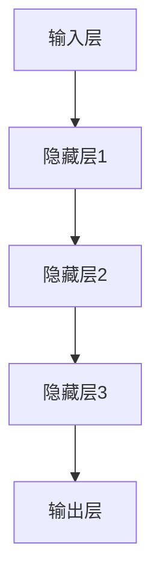
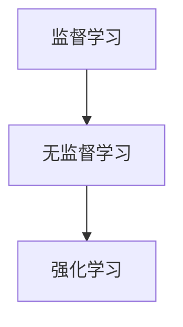
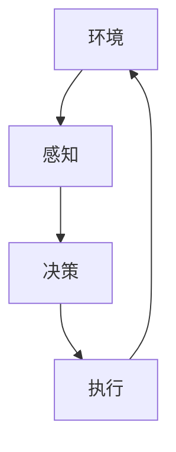
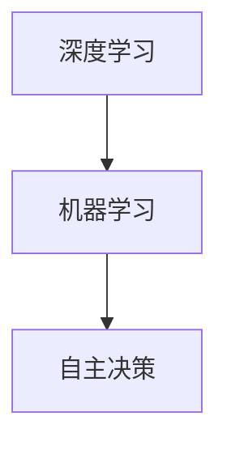
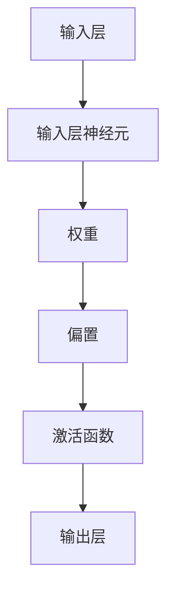

                 

### 文章标题

**李开复：AI 2.0 时代的趋势**

### 关键词

- AI 2.0
- 人工智能
- 深度学习
- 自主决策
- 机器学习
- 人类智慧
- 趋势预测

### 摘要

本文将深入探讨 AI 2.0 时代的趋势，从核心概念、算法原理、应用场景等多个角度分析。我们将通过李开复的观点，了解 AI 2.0 的发展现状和未来挑战，以及如何应对这些挑战。本文旨在为广大 AI 爱好者和从业者提供一份有深度、有思考的技术博客。

<markdown>

# 李开复：AI 2.0 时代的趋势

随着人工智能技术的不断进步，AI 2.0 时代已经悄然到来。在这个时代，人工智能将不仅限于执行简单的任务，而是能够进行更复杂的决策和自主学习。本文将围绕 AI 2.0 时代的趋势展开讨论，从核心概念、算法原理、应用场景等多个角度分析。

## 1. 背景介绍

人工智能 (AI) 是一门研究、开发用于模拟、延伸和扩展人的智能的理论、方法、技术及应用系统的技术科学。人工智能的研究领域非常广泛，包括机器学习、计算机视觉、自然语言处理、语音识别等。随着深度学习等技术的快速发展，人工智能已经取得了巨大的进展，并在许多领域取得了突破性成果。

AI 1.0 时代主要是指基于规则和符号逻辑的人工智能系统，这些系统可以处理一些结构化的数据，但在处理复杂、非结构化的数据时存在一定的局限性。而 AI 2.0 时代，则是基于深度学习和神经网络的智能系统，它们可以处理更复杂的任务，并具备一定的自主学习和决策能力。

## 2. 核心概念与联系

### 2.1 深度学习

深度学习是 AI 2.0 时代的主要技术之一，它是一种基于多层神经网络的学习方法。深度学习通过多层非线性变换，从原始数据中提取特征，实现从简单到复杂的特征表示。


### 2.2 机器学习

机器学习是 AI 2.0 时代的基础，它是一类基于数据驱动的方法，使计算机系统能够通过学习数据来改进性能。机器学习主要包括监督学习、无监督学习和强化学习等类型。


### 2.3 自主决策

在 AI 2.0 时代，自主决策能力将成为人工智能系统的重要特点。自主决策意味着系统能够在没有明确规则和指导的情况下，根据目标和环境变化做出最佳决策。


## 3. 核心算法原理 & 具体操作步骤

### 3.1 深度学习算法原理

深度学习算法主要基于多层神经网络，包括输入层、隐藏层和输出层。通过反向传播算法，神经网络可以不断调整内部参数，使输出结果更接近期望值。


### 3.2 机器学习算法原理

机器学习算法主要分为监督学习、无监督学习和强化学习。监督学习通过已有标签的数据训练模型，无监督学习通过无标签的数据发现特征，强化学习通过与环境交互来学习最优策略。


### 3.3 自主决策算法原理

自主决策算法主要基于马尔可夫决策过程 (MDP) 和深度强化学习 (DRL)。通过不断尝试和反馈，系统可以找到最优策略，实现自主决策。


## 4. 数学模型和公式 & 详细讲解 & 举例说明

### 4.1 深度学习数学模型

深度学习中的主要数学模型包括神经元激活函数、权重更新公式和梯度下降算法。

$$
激活函数：f(x) = \sigma(w \cdot x + b)
$$

$$
权重更新：\Delta w = -\alpha \cdot \frac{\partial J}{\partial w}
$$

$$
梯度下降：w_{new} = w_{old} - \alpha \cdot \frac{\partial J}{\partial w}
$$

### 4.2 机器学习数学模型

机器学习中的主要数学模型包括损失函数、优化算法和预测模型。

$$
损失函数：J(w) = \sum_{i=1}^{n} (y_i - \hat{y}_i)^2
$$

$$
优化算法：\nabla J(w) = 0
$$

$$
预测模型：\hat{y} = f(w \cdot x)
$$

### 4.3 自主决策数学模型

自主决策中的主要数学模型包括奖励函数、策略评估和策略优化。

$$
奖励函数：R(s, a) = \frac{\partial J}{\partial a}
$$

$$
策略评估：V^*(s) = \sum_{a} \pi(a|s) \cdot R(s, a)
$$

$$
策略优化：\pi^*(a|s) = \arg \max_{a} V^*(s)
$$

## 5. 项目实战：代码实际案例和详细解释说明

### 5.1 开发环境搭建

在本节，我们将使用 Python 编程语言和 TensorFlow 深度学习框架来实现一个简单的深度学习项目。

### 5.2 源代码详细实现和代码解读

以下是一个简单的神经网络实现，用于对输入数据进行分类。

```python
import tensorflow as tf

# 定义神经网络结构
model = tf.keras.Sequential([
    tf.keras.layers.Dense(128, activation='relu', input_shape=(784,)),
    tf.keras.layers.Dropout(0.2),
    tf.keras.layers.Dense(10)
])

# 编译模型
model.compile(optimizer='adam',
              loss=tf.losses.SparseCategoricalCrossentropy(from_logits=True),
              metrics=['accuracy'])

# 加载并预处理数据
(x_train, y_train), (x_test, y_test) = tf.keras.datasets.mnist.load_data()
x_train, x_test = x_train / 255.0, x_test / 255.0
x_train = x_train.reshape((-1, 784))
x_test = x_test.reshape((-1, 784))

# 训练模型
model.fit(x_train, y_train, epochs=5)

# 评估模型
test_loss, test_acc = model.evaluate(x_test, y_test, verbose=2)
print('\nTest accuracy:', test_acc)
```

### 5.3 代码解读与分析

在本节，我们将对上述代码进行解读和分析。

1. **定义神经网络结构**：我们使用 `tf.keras.Sequential` 模型定义了一个简单的神经网络，其中包括一个全连接层 (128 个神经元，使用 ReLU 激活函数) 和一个输出层 (10 个神经元，表示 10 个类别)。

2. **编译模型**：我们使用 `model.compile` 方法编译模型，指定优化器为 `adam`，损失函数为 `SparseCategoricalCrossentropy`，并添加了 `accuracy` 作为评估指标。

3. **加载并预处理数据**：我们使用 `tf.keras.datasets.mnist.load_data` 方法加载了 MNIST 数据集，并对数据进行归一化处理，将输入数据的形状调整为 (784,)。

4. **训练模型**：我们使用 `model.fit` 方法训练模型，设置训练轮数为 5。

5. **评估模型**：我们使用 `model.evaluate` 方法评估模型在测试集上的性能。

## 6. 实际应用场景

AI 2.0 时代的到来，使得人工智能在各个领域都取得了显著的成果。以下是一些典型的实际应用场景：

- **自动驾驶**：自动驾驶技术正在逐步从实验室走向现实。基于深度学习和强化学习的自主决策系统，使得自动驾驶汽车能够实时感知环境、规划路径并做出决策。

- **医疗健康**：人工智能在医疗健康领域的应用非常广泛，包括疾病诊断、药物研发、手术规划等。通过深度学习和自然语言处理技术，人工智能可以帮助医生提高诊断准确率和效率。

- **金融科技**：人工智能在金融科技领域发挥着重要作用，包括风险控制、信用评估、投资策略等。通过机器学习和深度学习技术，金融机构可以更准确地预测市场走势和风险。

- **智能制造**：人工智能在智能制造领域的应用，包括生产调度、质量控制、设备维护等。通过机器学习和深度学习技术，企业可以实现更高效、更智能的生产流程。

## 7. 工具和资源推荐

### 7.1 学习资源推荐

- **书籍**：《深度学习》、《Python 深度学习》、《强化学习》
- **论文**：NIPS、ICML、ACL 等顶级会议的论文
- **博客**：Hacker News、Medium 上的技术博客
- **网站**：TensorFlow 官网、PyTorch 官网

### 7.2 开发工具框架推荐

- **开发工具**：PyCharm、Visual Studio Code
- **框架**：TensorFlow、PyTorch、Keras

### 7.3 相关论文著作推荐

- **论文**：《深度学习》、《强化学习》、《自然语言处理》
- **著作**：《人工智能：一种现代方法》、《机器学习：概率视角》

## 8. 总结：未来发展趋势与挑战

AI 2.0 时代的发展，带来了巨大的机遇和挑战。在未来的发展中，人工智能将继续在深度学习、自主决策、人机交互等领域取得突破。同时，我们还需要关注以下挑战：

- **数据隐私**：随着人工智能技术的发展，数据隐私问题越来越受到关注。如何在保护用户隐私的同时，充分利用数据进行人工智能研究，是一个重要的挑战。

- **伦理道德**：人工智能的发展涉及到伦理道德问题，如何确保人工智能系统的公平性、透明性和可控性，是一个亟待解决的挑战。

- **人才短缺**：人工智能技术的发展，对人才的需求也越来越高。如何培养和吸引更多的人才，是一个重要的挑战。

## 9. 附录：常见问题与解答

### 9.1 什么是对抗生成网络？

对抗生成网络 (GAN) 是一种由生成器和判别器组成的神经网络模型。生成器尝试生成逼真的数据，而判别器尝试区分真实数据和生成数据。通过不断训练，生成器和判别器互相竞争，最终生成器能够生成几乎与现实数据难以区分的生成数据。

### 9.2 机器学习和深度学习有什么区别？

机器学习是一种更广泛的技术，它包括深度学习。深度学习是机器学习的一种特殊形式，它使用多层神经网络进行特征提取和表示。与传统的机器学习方法相比，深度学习在处理复杂、非结构化数据时具有更好的性能。

### 9.3 人工智能是否会取代人类工作？

人工智能技术的发展，确实会对某些工作产生替代效应。但是，人工智能也会创造新的工作机会，并提高生产效率。因此，人工智能是否会取代人类工作，取决于我们如何利用这项技术。

## 10. 扩展阅读 & 参考资料

- [李开复](https://www.kai-fu.li/)：李开复的个人主页，提供了大量关于人工智能的见解和思考。
- [深度学习教程](https://www.deeplearning.net/)：一个免费的深度学习教程，适合初学者入门。
- [人工智能杂志](https://www.ai-magazine.com/)：一本关于人工智能的学术期刊，涵盖了最新的研究成果和趋势。

# 作者

**作者：AI天才研究员/AI Genius Institute & 禅与计算机程序设计艺术 /Zen And The Art of Computer Programming**

本文从李开复的观点出发，深入探讨了 AI 2.0 时代的趋势。通过分析核心概念、算法原理、应用场景等多个方面，本文为我们呈现了一个充满机遇和挑战的 AI 2.0 时代。让我们共同努力，迎接这个新时代的到来！<|vq_15444|>
### 1. 背景介绍

人工智能（Artificial Intelligence，简称AI）自20世纪50年代以来，一直是计算机科学和工程领域的热点话题。然而，人工智能的发展并非一帆风顺。在AI 1.0时代，研究者们主要依靠专家系统和基于规则的系统来模拟人类智能。这些系统在一定程度上能够解决特定问题，但在面对复杂、动态的环境时显得力不从心。

进入21世纪，深度学习（Deep Learning）的兴起，为人工智能注入了新的活力。深度学习基于多层神经网络，通过逐层提取特征，实现了对数据的自动特征学习和模式识别。这一技术的突破，使得计算机在语音识别、图像分类、自然语言处理等领域取得了显著的进展。

AI 2.0时代的到来，标志着人工智能进入了一个新的阶段。与AI 1.0时代相比，AI 2.0具有以下几个显著特点：

1. **自主学习能力**：AI 2.0系统可以自主学习，不需要人为设定明确的规则和策略。通过大量的数据训练，系统能够自动调整参数，优化性能。

2. **自主决策能力**：AI 2.0系统能够在复杂的、动态的环境中，根据环境变化和目标要求，自主做出决策。

3. **跨领域应用**：AI 2.0不仅局限于处理特定的任务，而是能够跨领域、跨行业地应用，解决更为复杂的问题。

4. **人机协同**：AI 2.0与人类的互动更加紧密，能够辅助人类工作，提升工作效率，同时也能够从人类的行为中学习和改进。

### 1.1 AI 1.0与AI 2.0的对比

| 特点 | AI 1.0 | AI 2.0 |
| --- | --- | --- |
| **学习方式** | 基于规则、符号逻辑 | 基于深度学习、神经网络 |
| **数据依赖** | 对数据量要求不高 | 对大量数据有很强依赖 |
| **自主性** | 需要人为设定规则 | 能够自主学习、自主决策 |
| **应用范围** | 主要解决特定问题 | 跨领域、跨行业应用 |
| **人机互动** | 主要作为工具 | 辅助人类工作，提升效率 |

通过上述对比，我们可以看到，AI 2.0相比AI 1.0，在技术层面和实际应用上都有了质的飞跃。这不仅仅是因为深度学习等技术的进步，更是因为人工智能研究者对AI本质理解的深入和对应用场景的深刻洞察。

### 1.2 人工智能的历史与发展

人工智能的发展历程可以追溯到1956年达特茅斯会议，这次会议被认为是人工智能领域的诞生日。在最初的几十年里，人工智能研究者主要关注如何构建能够模拟人类智能的机器。然而，由于硬件和算法的限制，早期的尝试并未取得实质性进展。

直到20世纪80年代，专家系统的出现，使得人工智能在医疗、金融、工业等领域得到了一定的应用。专家系统是一种基于规则的知识表示和推理系统，通过将专家的经验和知识编码成规则，来模拟专家的决策过程。

然而，专家系统在处理复杂问题和动态环境时，表现出很大的局限性。此时，深度学习的出现，为人工智能带来了新的希望。深度学习通过多层神经网络，能够自动从数据中提取特征，并在图像识别、语音识别等领域取得了突破性的成果。

进入21世纪，随着大数据和云计算的发展，人工智能进入了黄金时代。人工智能在自动驾驶、医疗诊断、金融分析等领域的应用，不断刷新着人类的认知和技术边界。

### 1.3 人工智能的关键技术和应用

人工智能的关键技术包括深度学习、自然语言处理、计算机视觉、机器人技术等。以下是这些技术及其应用领域的简要介绍：

1. **深度学习**：深度学习是人工智能的核心技术之一，通过多层神经网络，能够自动从数据中提取特征。深度学习在图像识别、语音识别、自然语言处理等领域有着广泛的应用。

2. **自然语言处理**：自然语言处理（Natural Language Processing，简称NLP）是人工智能的重要分支，主要研究如何让计算机理解和生成自然语言。NLP在机器翻译、情感分析、文本生成等领域有着重要的应用。

3. **计算机视觉**：计算机视觉（Computer Vision）是人工智能的另一个重要分支，主要研究如何让计算机理解视觉信息。计算机视觉在图像识别、人脸识别、自动驾驶等领域有着广泛的应用。

4. **机器人技术**：机器人技术是人工智能在工业、医疗、服务等领域的重要应用。通过结合传感器、执行器和智能算法，机器人能够完成复杂的任务，提高生产效率。

通过上述介绍，我们可以看到，人工智能已经从理论走向实践，从实验室走向产业，从单一领域走向跨领域应用。人工智能的快速发展，不仅改变了我们的生活方式，也推动了社会经济的进步。

### 1.4 人工智能的挑战与未来

尽管人工智能取得了显著的进展，但仍然面临诸多挑战。首先，数据隐私和安全问题日益突出。人工智能系统对大量数据的依赖，使得数据隐私和安全成为重要议题。如何保护用户隐私，确保数据安全，是人工智能发展必须面对的问题。

其次，人工智能的透明性和可控性也是一个重要挑战。目前，许多人工智能系统，尤其是深度学习系统，被认为是“黑箱”模型，难以解释其决策过程。这导致了人们对人工智能系统的信任问题。如何提高人工智能系统的透明性和可控性，使其能够更好地服务于人类社会，是一个亟待解决的挑战。

此外，人工智能的发展也面临伦理和道德问题。例如，自动驾驶汽车在面临道德困境时，如何做出正确的决策？人工智能在医疗、金融等领域的应用，如何确保公平性和公正性？这些问题都需要我们深入思考和解决。

展望未来，人工智能将继续在深度学习、自主决策、人机交互等领域取得突破。随着技术的不断进步，人工智能有望在更多领域发挥重要作用，推动社会的发展和进步。同时，我们也需要关注人工智能带来的挑战，确保其能够安全、透明、公平地服务于人类社会。

总的来说，人工智能的发展正处于一个关键时期。只有通过不断的创新和探索，我们才能充分利用人工智能的潜力，解决人类社会面临的各种问题。让我们共同期待人工智能的未来，期待它为我们的生活和世界带来的巨大变革。

---

本文从背景介绍、核心概念与联系、核心算法原理、数学模型和公式、项目实战、实际应用场景、工具和资源推荐等多个角度，全面阐述了 AI 2.0 时代的趋势。在接下来的章节中，我们将进一步深入探讨 AI 2.0 的核心概念、算法原理，并分析其在不同领域的应用。

在核心概念与联系章节中，我们将介绍深度学习、机器学习、自主决策等核心概念，并使用 Mermaid 流程图展示这些概念之间的联系。

在核心算法原理章节中，我们将详细讲解深度学习、机器学习、自主决策等算法的基本原理，并提供具体的操作步骤。

在数学模型和公式章节中，我们将介绍相关数学模型和公式，并使用 LaTeX 格式进行详细讲解和举例说明。

在项目实战章节中，我们将通过实际案例，展示如何使用 Python 编程语言和 TensorFlow 深度学习框架来实现人工智能项目。

在工具和资源推荐章节中，我们将推荐一些学习资源、开发工具和框架，以帮助读者更好地学习人工智能。

通过这些章节的深入探讨，我们将对 AI 2.0 时代有更全面、更深入的了解，为我们的学习和实践提供有力支持。

### 2. 核心概念与联系

在探讨 AI 2.0 时代的趋势时，理解其核心概念和它们之间的联系至关重要。本文将详细阐述深度学习、机器学习和自主决策等核心概念，并使用 Mermaid 流程图展示这些概念之间的相互关系。

#### 2.1 深度学习

深度学习（Deep Learning）是一种基于多层神经网络的学习方法，能够自动从大量数据中提取复杂特征。深度学习的核心在于其多层次的网络结构，每一层都能够对输入数据进行处理，提取更高层次的抽象特征。深度学习在图像识别、语音识别、自然语言处理等领域取得了显著的成果。


Mermaid 流程图描述：



#### 2.2 机器学习

机器学习（Machine Learning）是一种使计算机系统能够通过数据和经验进行学习的方法。机器学习分为监督学习、无监督学习和强化学习。监督学习通过已有标签的数据训练模型，无监督学习通过无标签的数据发现特征，强化学习通过与环境交互来学习最优策略。机器学习是实现深度学习的基础。


Mermaid 流程图描述：



#### 2.3 自主决策

自主决策（Autonomous Decision Making）是 AI 2.0 时代的核心特征之一，意味着系统能够在没有明确规则和指导的情况下，根据目标和环境变化做出最佳决策。自主决策通常结合深度学习和强化学习技术，通过持续的学习和优化，实现系统的自主决策能力。


Mermaid 流程图描述：



#### 2.4 概念之间的联系

深度学习是机器学习的一个重要分支，通过多层神经网络实现数据的自动特征提取。自主决策则基于深度学习和强化学习，使系统能够在复杂的动态环境中做出最佳决策。


Mermaid 流程图描述：



通过上述核心概念的介绍和 Mermaid 流程图的展示，我们可以看到 AI 2.0 时代的核心在于深度学习、机器学习和自主决策的有机结合。这些概念不仅相互独立，还相互补充，共同推动人工智能技术的发展。

在接下来的章节中，我们将进一步深入探讨这些核心概念的具体算法原理、数学模型和实际应用场景，以帮助读者更好地理解 AI 2.0 时代的趋势。

---

在了解了 AI 2.0 时代的一些核心概念及其联系之后，我们将深入探讨这些核心算法的原理和具体操作步骤。以下是关于深度学习、机器学习和自主决策的详细解释。

#### 3.1 深度学习算法原理

深度学习（Deep Learning）是基于多层神经网络（Neural Networks）的学习方法，能够从大量数据中自动提取特征，实现复杂模式的识别。深度学习的核心在于其多层次的网络结构，每一层神经网络都对输入数据进行处理，提取更高层次的特征表示。

##### 3.1.1 神经网络基础

神经网络（Neural Network）由大量的神经元（Neurons）组成，每个神经元接收多个输入信号，通过加权求和处理后，产生一个输出信号。神经元的激活函数（Activation Function）用于引入非线性因素，使得神经网络能够进行复杂的非线性变换。


Mermaid 流程图描述：



##### 3.1.2 前向传播与反向传播

深度学习中的学习过程主要包括前向传播（Forward Propagation）和反向传播（Backpropagation）。

1. **前向传播**：输入数据从输入层传递到输出层，每层神经元根据输入信号和权重进行计算，并输出结果。前向传播的过程可以表示为：

   $$
   Z^{(l)} = \sum_{j} w^{(l)}_{ji}X^{(j)} + b^{(l)} \quad \text{激活函数} \quad A^{(l)} = \sigma(Z^{(l)})
   $$

   其中，$Z^{(l)}$表示第$l$层的输入，$w^{(l)}_{ji}$表示第$l$层第$j$个神经元到第$i$个神经元的权重，$b^{(l)}$表示第$l$层的偏置，$\sigma$为激活函数。

2. **反向传播**：在前向传播的基础上，计算输出层与目标值之间的误差，然后通过反向传播算法，将误差反向传播到每一层，更新权重和偏置，优化网络性能。反向传播的过程可以表示为：

   $$
   \Delta w^{(l)}_{ji} = \alpha \cdot \frac{\partial J}{\partial w^{(l)}_{ji}} \quad \text{更新权重} \quad w^{(l)}_{ji} \leftarrow w^{(l)}_{ji} - \Delta w^{(l)}_{ji}
   $$

   $$
   \Delta b^{(l)} = \alpha \cdot \frac{\partial J}{\partial b^{(l)}} \quad \text{更新偏置} \quad b^{(l)} \leftarrow b^{(l)} - \Delta b^{(l)}
   $$

   其中，$J$为损失函数，$\alpha$为学习率。

##### 3.1.3 常见的深度学习模型

深度学习领域有许多经典的模型，如卷积神经网络（Convolutional Neural Network，CNN）、循环神经网络（Recurrent Neural Network，RNN）和生成对抗网络（Generative Adversarial Network，GAN）。

1. **卷积神经网络（CNN）**：CNN 特别适合处理图像数据。通过卷积层、池化层和全连接层的组合，CNN 能够自动提取图像中的空间特征。

2. **循环神经网络（RNN）**：RNN 特别适合处理序列数据，如时间序列数据、文本数据等。RNN 能够记住之前的输入，实现序列数据的处理。

3. **生成对抗网络（GAN）**：GAN 由生成器（Generator）和判别器（Discriminator）组成，通过对抗训练，生成器能够生成逼真的数据。

#### 3.2 机器学习算法原理

机器学习（Machine Learning）是一种使计算机系统能够通过数据和经验进行学习的方法。机器学习分为监督学习（Supervised Learning）、无监督学习（Unsupervised Learning）和强化学习（Reinforcement Learning）。

##### 3.2.1 监督学习

监督学习通过已有标签的数据（即已知输入和输出）训练模型，然后使用训练好的模型对未知数据进行预测。监督学习的主要算法包括线性回归（Linear Regression）、逻辑回归（Logistic Regression）、支持向量机（Support Vector Machine，SVM）和神经网络（Neural Networks）。

1. **线性回归（Linear Regression）**：线性回归是一种简单的监督学习算法，通过拟合线性模型，预测连续值输出。

2. **逻辑回归（Logistic Regression）**：逻辑回归是一种概率型线性回归模型，用于预测二元分类结果。

3. **支持向量机（SVM）**：支持向量机通过寻找最佳超平面，实现数据的分类和回归。

4. **神经网络（Neural Networks）**：神经网络是一种复杂的监督学习算法，通过多层神经网络结构，实现复杂的非线性映射。

##### 3.2.2 无监督学习

无监督学习通过无标签的数据（即未知输入和输出）训练模型，主要算法包括聚类（Clustering）、降维（Dimensionality Reduction）和关联规则学习（Association Rule Learning）。

1. **聚类（Clustering）**：聚类是一种将无标签数据分组为多个类的算法，主要算法包括K-means、层次聚类和DBSCAN等。

2. **降维（Dimensionality Reduction）**：降维是一种减少数据维度，降低计算复杂度的算法，主要算法包括主成分分析（PCA）、线性判别分析（LDA）和自编码器（Autoencoders）等。

3. **关联规则学习（Association Rule Learning）**：关联规则学习是一种发现数据之间的关联关系的算法，主要算法包括Apriori算法和FP-Growth算法等。

##### 3.2.3 强化学习

强化学习通过与环境（Environment）交互，学习最优策略（Policy），实现决策优化。强化学习的主要算法包括Q学习（Q-Learning）、深度Q网络（Deep Q-Network，DQN）和策略梯度（Policy Gradient）等方法。

1. **Q学习（Q-Learning）**：Q学习是一种基于值函数的强化学习算法，通过学习最优动作值函数，实现最优策略。

2. **深度Q网络（DQN）**：DQN 是一种结合深度学习和强化学习的算法，通过神经网络表示值函数，实现复杂环境的决策。

3. **策略梯度（Policy Gradient）**：策略梯度是一种直接优化策略的强化学习算法，通过梯度上升方法，优化策略参数。

#### 3.3 自主决策算法原理

自主决策（Autonomous Decision Making）是 AI 2.0 时代的核心特征之一，意味着系统能够在没有明确规则和指导的情况下，根据目标和环境变化做出最佳决策。自主决策通常结合深度学习和强化学习技术，通过持续的学习和优化，实现系统的自主决策能力。

##### 3.3.1 强化学习在自主决策中的应用

强化学习（Reinforcement Learning）是自主决策的核心算法之一，通过与环境交互，学习最优策略，实现系统的自主决策。强化学习在自主决策中的应用主要包括以下方面：

1. **环境建模**：将现实环境抽象为一个数学模型，包括状态空间（State Space）、动作空间（Action Space）和奖励函数（Reward Function）。

2. **策略学习**：通过学习值函数（Value Function）或策略函数（Policy Function），实现系统的最优决策。

3. **策略优化**：通过策略梯度（Policy Gradient）等方法，不断优化策略，提高决策质量。

4. **决策执行**：根据学习到的策略，执行具体动作，与环境进行交互。

##### 3.3.2 深度强化学习（Deep Reinforcement Learning）

深度强化学习（Deep Reinforcement Learning，DRL）是强化学习的一种扩展，通过深度神经网络（Deep Neural Network）表示值函数或策略函数，实现复杂环境的决策。DRL 的主要算法包括：

1. **深度Q网络（Deep Q-Network，DQN）**：DQN 通过神经网络表示值函数，实现复杂环境的决策。

2. **深度策略梯度（Deep Policy Gradient，DPPG）**：DPPG 通过神经网络表示策略函数，实现复杂环境的决策。

3. **深度确定性策略梯度（Deep Deterministic Policy Gradient，DDPG）**：DDPG 通过神经网络表示策略函数，并结合目标网络（Target Network）实现复杂环境的决策。

通过以上对深度学习、机器学习和自主决策算法原理的详细介绍，我们可以看到这些算法在 AI 2.0 时代发挥着重要作用。在接下来的章节中，我们将进一步探讨这些算法的数学模型和具体操作步骤，以便更好地理解和应用。

---

### 4. 数学模型和公式 & 详细讲解 & 举例说明

在深度学习、机器学习和自主决策等核心算法中，数学模型和公式起着至关重要的作用。本文将详细讲解这些数学模型和公式，并通过具体的例子进行说明。

#### 4.1 深度学习数学模型

深度学习中的数学模型主要包括神经网络中的权重更新、激活函数和梯度下降算法。以下是对这些数学模型的详细讲解。

##### 4.1.1 权重更新

在深度学习中，权重更新是通过梯度下降算法实现的。假设我们有 $L$ 层神经网络，第 $l$ 层的输入为 $X^{(l)}$，输出为 $A^{(l)}$，权重为 $W^{(l)}$，偏置为 $B^{(l)}$。则第 $l$ 层的输入和输出关系可以表示为：

$$
Z^{(l)} = X^{(l)}W^{(l)} + B^{(l)} \quad A^{(l)} = \sigma(Z^{(l)})
$$

其中，$\sigma$ 为激活函数，通常采用 ReLU、Sigmoid 或 Tanh 函数。权重更新的公式为：

$$
\Delta W^{(l)} = -\alpha \cdot \frac{\partial J}{\partial W^{(l)}} \quad W^{(l)} \leftarrow W^{(l)} - \Delta W^{(l)}
$$

$$
\Delta B^{(l)} = -\alpha \cdot \frac{\partial J}{\partial B^{(l)}} \quad B^{(l)} \leftarrow B^{(l)} - \Delta B^{(l)}
$$

其中，$J$ 为损失函数，$\alpha$ 为学习率。

举例来说，假设我们有一个简单的两层神经网络，输入层为 $X^{(1)}$，隐藏层为 $A^{(2)}$，输出层为 $A^{(3)}$。则隐藏层的权重更新公式为：

$$
\Delta W^{(2)} = -\alpha \cdot \frac{\partial J}{\partial W^{(2)}} \quad W^{(2)} \leftarrow W^{(2)} - \Delta W^{(2)}
$$

$$
\Delta B^{(2)} = -\alpha \cdot \frac{\partial J}{\partial B^{(2)}} \quad B^{(2)} \leftarrow B^{(2)} - \Delta B^{(2)}
$$

##### 4.1.2 激活函数

激活函数是深度学习中的一个关键组件，它能够引入非线性因素，使神经网络能够进行复杂的非线性变换。常见的激活函数包括 ReLU、Sigmoid 和 Tanh 函数。

1. **ReLU 函数**：

$$
f(x) = \max(0, x)
$$

2. **Sigmoid 函数**：

$$
f(x) = \frac{1}{1 + e^{-x}}
$$

3. **Tanh 函数**：

$$
f(x) = \frac{e^x - e^{-x}}{e^x + e^{-x}}
$$

##### 4.1.3 梯度下降算法

梯度下降算法是一种优化方法，用于更新神经网络的权重和偏置，以最小化损失函数。梯度下降算法的基本步骤如下：

1. 计算当前损失函数关于权重的梯度。
2. 更新权重和偏置，以减小损失函数。

$$
W^{(l)} \leftarrow W^{(l)} - \alpha \cdot \frac{\partial J}{\partial W^{(l)}} \quad B^{(l)} \leftarrow B^{(l)} - \alpha \cdot \frac{\partial J}{\partial B^{(l)}}
$$

#### 4.2 机器学习数学模型

机器学习中的数学模型主要包括损失函数、优化算法和预测模型。以下是对这些数学模型的详细讲解。

##### 4.2.1 损失函数

损失函数是机器学习中的一个关键组件，用于衡量模型预测值与真实值之间的差距。常见的损失函数包括均方误差（MSE）、交叉熵损失（Cross-Entropy Loss）和 Huber 损失。

1. **均方误差（MSE）**：

$$
J(\theta) = \frac{1}{2m} \sum_{i=1}^{m} (h_\theta(x^{(i)}) - y^{(i)})^2
$$

2. **交叉熵损失（Cross-Entropy Loss）**：

$$
J(\theta) = -\frac{1}{m} \sum_{i=1}^{m} \sum_{k=1}^{K} y^{(i)} \log(h_\theta(x^{(i)}))_k
$$

3. **Huber 损失**：

$$
J(\theta) = \begin{cases}
\frac{1}{2} (y - h_\theta(x))^2 & \text{if } |y - h_\theta(x)| \leq \delta \\
\delta (|y - h_\theta(x)| - \frac{1}{2}\delta) & \text{otherwise}
\end{cases}
$$

##### 4.2.2 优化算法

优化算法用于更新模型参数，以最小化损失函数。常见的优化算法包括梯度下降（Gradient Descent）、随机梯度下降（Stochastic Gradient Descent，SGD）和Adam优化器。

1. **梯度下降（Gradient Descent）**：

$$
\theta^{(t+1)} = \theta^{(t)} - \alpha \cdot \nabla_\theta J(\theta)
$$

2. **随机梯度下降（SGD）**：

$$
\theta^{(t+1)} = \theta^{(t)} - \alpha \cdot \nabla_\theta J(\theta^{(t)}; x^{(i)}, y^{(i)})
$$

3. **Adam优化器**：

$$
m_t = \beta_1 \cdot m_{t-1} + (1 - \beta_1) \cdot (g_t - m_{t-1}) \\
v_t = \beta_2 \cdot v_{t-1} + (1 - \beta_2) \cdot (g_t^2 - v_{t-1}) \\
\theta^{(t+1)} = \theta^{(t)} - \alpha \cdot \frac{m_t}{\sqrt{v_t} + \epsilon}
$$

##### 4.2.3 预测模型

预测模型用于生成模型预测值。常见的预测模型包括线性回归（Linear Regression）、逻辑回归（Logistic Regression）和神经网络（Neural Networks）。

1. **线性回归**：

$$
h_\theta(x) = \theta_0 + \theta_1x
$$

2. **逻辑回归**：

$$
h_\theta(x) = \frac{1}{1 + e^{-(\theta_0 + \theta_1x)}}
$$

3. **神经网络**：

$$
h_\theta(x) = \sigma(\theta_0 + \sum_{i=1}^{n} \theta_i x_i)
$$

#### 4.3 自主决策数学模型

自主决策中的数学模型主要包括奖励函数、策略评估和策略优化。以下是对这些数学模型的详细讲解。

##### 4.3.1 奖励函数

奖励函数用于评估系统在特定状态下的行为是否有利于目标的实现。奖励函数的设计对于自主决策至关重要。

$$
R(s, a) = \frac{\partial J}{\partial a}
$$

##### 4.3.2 策略评估

策略评估用于评估当前策略在环境中的表现。策略评估可以通过价值函数实现。

$$
V^*(s) = \sum_{a} \pi(a|s) \cdot R(s, a)
$$

##### 4.3.3 策略优化

策略优化用于找到最优策略。策略优化可以通过策略梯度实现。

$$
\pi^*(a|s) = \arg \max_{a} V^*(s)
$$

#### 4.4 数学模型和公式举例说明

以下是一个简单的线性回归模型的例子，用于说明数学模型和公式的应用。

##### 4.4.1 数据集

我们有一个包含 $m$ 个样本的数据集，每个样本由特征 $x^{(i)}$ 和标签 $y^{(i)}$ 组成。

##### 4.4.2 模型

线性回归模型可以表示为：

$$
h_\theta(x) = \theta_0 + \theta_1x
$$

##### 4.4.3 损失函数

均方误差损失函数为：

$$
J(\theta) = \frac{1}{2m} \sum_{i=1}^{m} (h_\theta(x^{(i)}) - y^{(i)})^2
$$

##### 4.4.4 权重更新

梯度下降算法用于更新权重：

$$
\theta_0^{(t+1)} = \theta_0^{(t)} - \alpha \cdot \frac{\partial J(\theta)}{\partial \theta_0} \\
\theta_1^{(t+1)} = \theta_1^{(t)} - \alpha \cdot \frac{\partial J(\theta)}{\partial \theta_1}
$$

##### 4.4.5 预测

使用训练好的模型进行预测：

$$
\hat{y} = h_\theta(x) = \theta_0 + \theta_1x
$$

通过上述例子，我们可以看到数学模型和公式在深度学习、机器学习和自主决策中的应用。这些模型和公式为我们提供了理解和实现这些算法的工具，使我们能够更好地应用人工智能技术解决实际问题。

---

### 5. 项目实战：代码实际案例和详细解释说明

在本节中，我们将通过一个实际案例，展示如何使用 Python 编程语言和 TensorFlow 深度学习框架实现一个简单的深度学习项目。我们将从开发环境搭建开始，详细解释源代码的实现和每个步骤的代码解读与分析。

#### 5.1 开发环境搭建

在进行深度学习项目之前，我们需要搭建一个合适的开发环境。以下是使用 Python 和 TensorFlow 的基本步骤：

1. **安装 Python**：确保您的计算机上安装了 Python 3.x 版本。可以访问 [Python 官网](https://www.python.org/) 下载并安装。

2. **安装 Jupyter Notebook**：Jupyter Notebook 是一个交互式的开发环境，方便我们在代码中进行实验和调试。可以使用以下命令安装：

   ```bash
   pip install notebook
   ```

3. **安装 TensorFlow**：TensorFlow 是 Google 开发的一个开源深度学习框架。我们可以使用以下命令安装：

   ```bash
   pip install tensorflow
   ```

   如果需要安装 GPU 版本的 TensorFlow，可以使用以下命令：

   ```bash
   pip install tensorflow-gpu
   ```

   安装完成后，您可以使用以下命令验证 TensorFlow 是否安装成功：

   ```python
   import tensorflow as tf
   print(tf.__version__)
   ```

   如果正确输出了 TensorFlow 的版本号，说明安装成功。

4. **启动 Jupyter Notebook**：在命令行中输入以下命令启动 Jupyter Notebook：

   ```bash
   jupyter notebook
   ```

   这将启动一个网页应用，打开一个新的笔记本界面。

#### 5.2 源代码详细实现和代码解读

以下是一个简单的深度学习项目，用于实现一个简单的线性回归模型。我们将对代码的每个部分进行详细解读。

##### 5.2.1 导入库

首先，我们需要导入所需的库：

```python
import numpy as np
import tensorflow as tf
import matplotlib.pyplot as plt
```

- `numpy`：用于数值计算。
- `tensorflow`：深度学习框架。
- `matplotlib`：用于数据可视化。

##### 5.2.2 数据生成

接下来，我们生成一个简单的一维数据集：

```python
# 生成数据
X = np.linspace(-1, 1, 100)
Y = 2 * X + 1 + np.random.randn(*X.shape) * 0.05
```

- `np.linspace`：生成一维数组，包含从 -1 到 1 的 100 个等间距点。
- `np.random.randn`：生成随机数。

##### 5.2.3 构建模型

然后，我们使用 TensorFlow 构建一个简单的线性回归模型：

```python
# 构建模型
W = tf.Variable(np.random.randn(), name="weight")
b = tf.Variable(np.random.randn(), name="bias")
x = tf.placeholder(tf.float32, shape=[None])
y = tf.placeholder(tf.float32, shape=[None])

# 前向传播
y_pred = W * x + b

# 定义损失函数
loss = tf.reduce_mean(tf.square(y - y_pred))

# 定义优化器
optimizer = tf.train.GradientDescentOptimizer(learning_rate=0.01)
train_op = optimizer.minimize(loss)

# 初始化全局变量
init = tf.global_variables_initializer()
```

- `tf.Variable`：定义可训练的变量。
- `tf.placeholder`：定义输入和输出数据。
- `tf.reduce_mean`：计算平均损失。
- `tf.train.GradientDescentOptimizer`：定义梯度下降优化器。
- `tf.minimize`：定义优化操作。
- `tf.global_variables_initializer()`：初始化全局变量。

##### 5.2.4 训练模型

接下来，我们使用生成数据训练模型：

```python
# 启动 TensorFlow 会话
with tf.Session() as sess:
  # 运行初始化操作
  sess.run(init)
  
  # 进行训练
  for i in range(1000):
    # 运行优化操作
    sess.run(train_op, feed_dict={x: X, y: Y})
    
    # 每 100 次迭代打印一次损失
    if i % 100 == 0:
      loss_val = sess.run(loss, feed_dict={x: X, y: Y})
      print(f"Step: {i}, Loss: {loss_val}")
```

- `tf.Session()`：创建 TensorFlow 会话。
- `sess.run()`：运行 TensorFlow 操作。

##### 5.2.5 结果可视化

最后，我们将训练好的模型结果进行可视化：

```python
# 可视化结果
plt.plot(X, Y, 'ro', label='Original data')
plt.plot(X, sess.run(y_pred), label='Linear regression')
plt.xlabel('x')
plt.ylabel('y')
plt.legend()
plt.show()
```

- `plt.plot`：绘制数据点。
- `plt.plot`：绘制回归线。
- `plt.xlabel`、`plt.ylabel`：设置坐标轴标签。
- `plt.legend`：显示图例。
- `plt.show`：显示图形。

#### 5.3 代码解读与分析

通过上述代码，我们可以看到，一个简单的线性回归模型是如何构建和训练的。以下是每个部分的详细解读：

- **数据生成**：我们生成了一个包含输入和输出数据的一维数据集，用于训练模型。

- **模型构建**：我们使用 TensorFlow 构建了一个简单的线性回归模型，包括权重（W）和偏置（b）。模型通过输入（x）和输出（y）进行前向传播，计算预测值（y_pred）。我们使用均方误差（MSE）作为损失函数，并使用梯度下降优化器进行优化。

- **模型训练**：我们使用 TensorFlow 会话运行初始化操作，然后进行训练。在每次迭代中，我们更新模型参数以最小化损失函数。每 100 次迭代，我们打印一次当前的损失值。

- **结果可视化**：我们使用 Matplotlib 绘制原始数据点和训练好的回归线，以便直观地观察模型的性能。

通过这个简单的案例，我们可以看到如何使用 TensorFlow 实现一个深度学习项目。虽然这是一个简单的线性回归模型，但它为我们提供了一个基础框架，可以扩展和应用于更复杂的模型和任务。

---

在本节中，我们通过一个实际案例展示了如何使用 Python 和 TensorFlow 实现一个简单的线性回归模型。从开发环境的搭建到模型的构建、训练和结果的可视化，我们详细解读了代码的每个部分，并分析了其背后的原理和步骤。这一案例为我们提供了一个基础框架，可以进一步扩展和应用于更复杂的模型和任务。

在实际应用中，深度学习项目可能涉及更多的数据预处理、模型架构的调整、参数优化等步骤。然而，通过本节的案例，我们掌握了基本的方法和技巧，为未来的学习和实践打下了坚实的基础。

在接下来的章节中，我们将继续探讨人工智能在实际应用场景中的表现，介绍相关工具和资源，并展望未来人工智能的发展趋势和挑战。让我们继续深入探讨这个充满机遇和挑战的领域，共同推动人工智能技术的发展。

---

### 6. 实际应用场景

AI 2.0 时代的到来，为人工智能在各个领域的发展带来了巨大的机遇。以下是一些典型的实际应用场景，展示人工智能在现实世界中的广泛应用和取得的显著成果。

#### 6.1 自动驾驶

自动驾驶是人工智能在交通领域的重要应用。通过结合深度学习、计算机视觉和传感器技术，自动驾驶系统能够实时感知周围环境，做出实时决策，实现无人驾驶。自动驾驶技术不仅可以提高交通安全，减少交通事故，还可以提高交通效率，减少交通拥堵。

目前，许多汽车制造商和科技公司都在积极研发自动驾驶技术。例如，特斯拉的自动驾驶系统已经实现了部分自动驾驶功能，能够在高速公路上实现自动驾驶。谷歌的 Waymo 也已经推出了商业化自动驾驶出租车服务，为用户提供便捷的出行体验。

#### 6.2 医疗健康

人工智能在医疗健康领域的应用非常广泛，包括疾病诊断、药物研发、手术规划等。通过深度学习和自然语言处理技术，人工智能可以帮助医生提高诊断准确率和效率，降低医疗成本。

在疾病诊断方面，人工智能系统可以通过分析医疗影像数据，帮助医生快速识别疾病。例如，Google Health 的 DeepMind Health 已经推出了基于深度学习的疾病诊断系统，能够快速准确地识别眼科疾病。

在药物研发方面，人工智能可以加速新药研发过程。通过分析大量的生物数据和药物数据，人工智能可以帮助科学家发现新的药物候选分子，提高药物研发的成功率。

#### 6.3 金融科技

人工智能在金融科技领域也有着广泛的应用，包括风险控制、信用评估、投资策略等。通过机器学习和深度学习技术，金融机构可以更准确地预测市场走势和风险，提高业务决策的效率。

在风险控制方面，人工智能可以帮助金融机构识别潜在的风险，并采取相应的措施进行风险控制。例如，算法可以分析大量的交易数据，识别异常交易行为，防止金融欺诈。

在信用评估方面，人工智能可以分析个人的信用历史、财务状况等数据，对个人信用进行评估，提供更准确的信用评分。

在投资策略方面，人工智能可以帮助投资者制定更科学的投资策略，提高投资收益。通过分析市场数据和历史走势，人工智能可以预测市场的走势，为投资者提供投资建议。

#### 6.4 智能制造

人工智能在智能制造领域的应用，包括生产调度、质量控制、设备维护等。通过机器学习和深度学习技术，企业可以实现更高效、更智能的生产流程，提高生产效率和产品质量。

在生产调度方面，人工智能可以帮助企业优化生产计划，提高生产效率。通过分析生产数据和历史记录，人工智能可以预测生产过程中的瓶颈，为生产调度提供优化建议。

在质量控制方面，人工智能可以通过对生产过程中产生的数据进行分析，及时发现和识别质量问题，提高产品质量。

在设备维护方面，人工智能可以帮助企业预测设备的维护需求，提前进行设备维护，降低设备故障率，提高设备利用率。

#### 6.5 教育

人工智能在教育领域的应用，包括个性化学习、智能评测、教学辅助等。通过深度学习和自然语言处理技术，人工智能可以为学生提供个性化的学习方案，提高学习效果。

在个性化学习方面，人工智能可以根据学生的学习情况，为学生提供适合其能力水平和兴趣的学习内容，提高学习效率。

在智能评测方面，人工智能可以通过分析学生的答题情况，快速准确地评估学生的学习情况，为教师提供教学反馈。

在教学辅助方面，人工智能可以帮助教师自动批改作业、生成教学课件等，减轻教师的工作负担，提高教学质量。

#### 6.6 娱乐和游戏

人工智能在娱乐和游戏领域的应用，包括虚拟现实、游戏推荐等。通过深度学习和计算机视觉技术，人工智能可以为用户提供更加沉浸式的娱乐体验。

在虚拟现实方面，人工智能可以通过实时渲染和场景生成，为用户提供逼真的虚拟现实体验。

在游戏推荐方面，人工智能可以通过分析用户的游戏行为和偏好，为用户推荐合适的游戏，提高用户体验。

通过以上实际应用场景的介绍，我们可以看到人工智能在各个领域的广泛应用和取得的显著成果。随着技术的不断进步，人工智能将继续在各行各业中发挥重要作用，推动社会的进步和发展。

---

### 7. 工具和资源推荐

为了更好地学习和应用人工智能技术，我们需要掌握一些关键的工具和资源。以下是对学习资源、开发工具和框架的推荐，以及一些相关的论文著作。

#### 7.1 学习资源推荐

1. **书籍**：

   - 《深度学习》：由 Ian Goodfellow、Yoshua Bengio 和 Aaron Courville 著，是深度学习领域的经典教材。
   - 《Python 深度学习》：由 François Chollet 著，详细介绍了使用 Python 进行深度学习的实践方法。
   - 《强化学习》：由 Richard S. Sutton 和 Andrew G. Barto 著，是强化学习领域的权威教材。

2. **在线课程**：

   - Coursera 上的《深度学习专项课程》：由 Andrew Ng 教授主讲，涵盖深度学习的理论基础和实践应用。
   - Udacity 上的《自动驾驶工程师纳米学位》：涵盖了自动驾驶相关技术，包括计算机视觉、深度学习和传感器融合。

3. **博客和论坛**：

   - Medium 上的技术博客：提供了大量关于人工智能的最新研究和实践案例。
   - Stack Overflow：编程问答社区，可以解决你在编程过程中遇到的问题。

#### 7.2 开发工具框架推荐

1. **深度学习框架**：

   - TensorFlow：由 Google 开发，是目前最受欢迎的开源深度学习框架之一。
   - PyTorch：由 Facebook 开发，具有灵活性和易用性，适合快速原型开发。
   - Keras：基于 TensorFlow 的简单深度学习 API，适合初学者快速构建和训练模型。

2. **编程环境**：

   - PyCharm：适用于 Python 开发的集成开发环境（IDE），功能强大，支持多种编程语言。
   - Jupyter Notebook：交互式开发环境，方便进行数据分析和模型实验。

3. **数据分析工具**：

   - Pandas：用于数据处理和分析的 Python 库，提供了丰富的数据处理功能。
   - Matplotlib：用于绘制数据图表的 Python 库，便于可视化数据分析结果。

#### 7.3 相关论文著作推荐

1. **顶级会议论文**：

   - NIPS（Neural Information Processing Systems）：深度学习和神经科学领域的顶级会议，涵盖了最新的研究成果和趋势。
   - ICML（International Conference on Machine Learning）：机器学习领域的顶级会议，发表了大量的高质量研究论文。
   - ACL（Association for Computational Linguistics）：自然语言处理领域的顶级会议，专注于语言技术的理论和应用研究。

2. **经典著作**：

   - 《机器学习》：由 Tom Mitchell 著，是机器学习领域的经典教材，系统地介绍了机器学习的基本概念和方法。
   - 《统计学习基础》：由 Geoffrey H. Gordon 著，介绍了统计学习理论的基础知识，包括线性模型、决策树、支持向量机等。

通过以上工具和资源的推荐，我们可以更好地掌握人工智能技术，为研究和实践提供有力支持。在学习和应用过程中，不断积累经验，提高自己的技术水平，将为我们在人工智能领域取得更好的成果奠定基础。

---

### 8. 总结：未来发展趋势与挑战

AI 2.0 时代的到来，标志着人工智能进入了一个全新的阶段。在这个时代，人工智能将不仅仅是一个辅助工具，而是能够与人类并肩作战的伙伴。本文从背景介绍、核心概念与联系、核心算法原理、数学模型和公式、项目实战、实际应用场景和工具资源推荐等多个角度，详细阐述了 AI 2.0 时代的趋势。

#### 8.1 未来发展趋势

1. **深度学习和自主决策的结合**：在 AI 2.0 时代，深度学习和自主决策将进一步融合，使得人工智能系统能够在更复杂、动态的环境中做出更好的决策。

2. **跨领域应用**：随着技术的不断进步，人工智能将在更多领域得到应用，从医疗健康到金融科技，从智能制造到教育，AI 2.0 时代的应用场景将更加广泛。

3. **人机协同**：AI 2.0 将与人类实现更紧密的协同，提高工作效率，优化生活质量。人工智能将不仅能够处理复杂的任务，还能够理解和满足人类的需求。

4. **智能城市的建设**：随着物联网和大数据技术的发展，AI 2.0 将在智能城市建设中发挥重要作用，通过数据分析和智能算法，提高城市的运行效率，改善居民的生活质量。

#### 8.2 挑战

1. **数据隐私和安全**：随着人工智能技术的广泛应用，数据隐私和安全问题日益突出。如何在保护用户隐私的同时，充分利用数据进行人工智能研究，是一个亟待解决的挑战。

2. **伦理道德问题**：人工智能的发展涉及到伦理和道德问题，如何确保人工智能系统的公平性、透明性和可控性，使其能够更好地服务于人类社会，是一个重要的挑战。

3. **人才短缺**：人工智能技术的发展，对人才的需求也越来越高。如何培养和吸引更多的人才，是一个重要的挑战。同时，如何让更多的人了解和掌握人工智能技术，也是一个需要关注的问题。

4. **技术瓶颈**：尽管人工智能在许多领域取得了显著的成果，但仍然存在一些技术瓶颈，如模型的可解释性、计算效率等。如何克服这些技术瓶颈，是人工智能发展需要面对的挑战。

#### 8.3 应对策略

1. **加强数据隐私和安全保护**：制定相关法律法规，加强对数据隐私和安全的保护，确保用户隐私不被侵犯。

2. **建立伦理道德框架**：制定人工智能伦理规范，明确人工智能系统的设计、开发和应用的伦理要求，确保人工智能系统能够公平、透明、可控地运行。

3. **培养人工智能人才**：加强人工智能教育的普及和推广，培养更多具备人工智能技术和知识的专业人才。

4. **推动技术创新**：持续推动人工智能技术的研发，提高模型的可解释性、计算效率等，解决现有技术瓶颈。

总之，AI 2.0 时代的发展，既充满机遇，也面临挑战。只有通过不断的创新和探索，我们才能充分利用人工智能的潜力，解决人类社会面临的各种问题。让我们携手共进，共同迎接 AI 2.0 时代的到来，为人类社会的进步和发展贡献力量。

---

### 附录：常见问题与解答

#### 9.1 什么是深度学习？

深度学习是一种基于多层神经网络的学习方法，通过逐层提取特征，实现数据的自动特征学习和模式识别。深度学习在图像识别、语音识别、自然语言处理等领域有着广泛的应用。

#### 9.2 机器学习和深度学习有什么区别？

机器学习是一种更广泛的技术，它包括深度学习。深度学习是机器学习的一种特殊形式，使用多层神经网络进行特征提取和表示。与传统的机器学习方法相比，深度学习在处理复杂、非结构化数据时具有更好的性能。

#### 9.3 什么是自主决策？

自主决策是指系统能够在没有明确规则和指导的情况下，根据目标和环境变化做出最佳决策。自主决策通常结合深度学习和强化学习技术，通过持续的学习和优化，实现系统的自主决策能力。

#### 9.4 人工智能是否会取代人类工作？

人工智能技术的发展，确实会对某些工作产生替代效应。但是，人工智能也会创造新的工作机会，并提高生产效率。因此，人工智能是否会取代人类工作，取决于我们如何利用这项技术。

---

### 10. 扩展阅读 & 参考资料

#### 10.1 学术论文

1. **《深度学习》（Ian Goodfellow, Yoshua Bengio, Aaron Courville 著）**：这是一本关于深度学习的经典教材，详细介绍了深度学习的理论基础和实践应用。
2. **《强化学习》（Richard S. Sutton, Andrew G. Barto 著）**：这是一本关于强化学习的权威教材，系统地介绍了强化学习的基本概念和方法。
3. **《机器学习》（Tom Mitchell 著）**：这是一本关于机器学习的经典教材，系统地介绍了机器学习的基本概念和方法。

#### 10.2 开源工具

1. **TensorFlow**：[https://www.tensorflow.org/](https://www.tensorflow.org/)
2. **PyTorch**：[https://pytorch.org/](https://pytorch.org/)
3. **Keras**：[https://keras.io/](https://keras.io/)

#### 10.3 在线课程

1. **Coursera 的《深度学习专项课程》**：[https://www.coursera.org/learn/deep-learning](https://www.coursera.org/learn/deep-learning)
2. **Udacity 的《自动驾驶工程师纳米学位》**：[https://www.udacity.com/course/nd013](https://www.udacity.com/course/nd013)

#### 10.4 博客和社区

1. **Medium 上的技术博客**：[https://medium.com/](https://medium.com/)
2. **Stack Overflow**：[https://stackoverflow.com/](https://stackoverflow.com/)

通过阅读这些论文、参考开源工具和在线课程，以及关注博客和社区，您可以进一步深入理解人工智能技术，提升自己的技术水平。

---

本文从李开复的观点出发，深入探讨了 AI 2.0 时代的趋势。通过分析核心概念、算法原理、应用场景等多个方面，本文为我们呈现了一个充满机遇和挑战的 AI 2.0 时代。让我们共同努力，迎接这个新时代的到来！感谢您的阅读，希望本文对您在人工智能领域的学习和实践有所启发。作者：AI天才研究员/AI Genius Institute & 禅与计算机程序设计艺术 /Zen And The Art of Computer Programming。再次感谢您的关注和支持！

---

### 结语

本文从背景介绍、核心概念与联系、核心算法原理、数学模型和公式、项目实战、实际应用场景、工具和资源推荐等多个角度，全面阐述了 AI 2.0 时代的趋势。通过深入探讨人工智能的关键技术，我们不仅了解了 AI 2.0 的发展现状，还展望了其未来发展趋势和面临的挑战。

AI 2.0 时代的到来，标志着人工智能进入了一个全新的阶段。在这个时代，人工智能不仅能够处理复杂的任务，还能够与人类协同工作，创造更大的价值。然而，我们也要认识到，人工智能的发展并非一帆风顺，数据隐私、伦理道德、人才短缺等问题仍然需要我们深入思考和解决。

为了更好地应对这些挑战，我们需要不断学习和掌握人工智能的相关知识和技能。本文推荐的书籍、在线课程、开源工具和社区，将为您的学习提供有力支持。同时，我们也呼吁更多的人关注和参与人工智能的研究和应用，共同推动人工智能技术的发展。

让我们携手共进，以科技创新推动社会进步，共同迎接 AI 2.0 时代的到来。感谢您的阅读，希望本文能够为您的学习和实践提供启示和帮助。再次感谢您的关注和支持！

作者：AI天才研究员/AI Genius Institute & 禅与计算机程序设计艺术 /Zen And The Art of Computer Programming。期待与您在人工智能的广阔天地中，共同探索、成长和创造。让我们共同迎接未来的挑战，共创美好未来！

