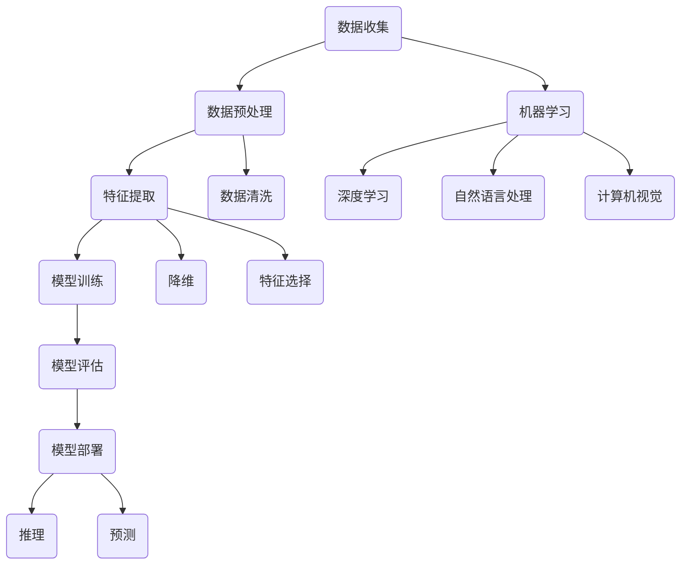

                 

### 背景介绍

#### 一、人工智能领域的快速发展

人工智能（Artificial Intelligence, AI）作为计算机科学的一个分支，已经经历了数十年的发展。从早期的专家系统、机器学习，到如今深度学习的广泛应用，人工智能技术在各个领域都取得了显著的成果。尤其在图像识别、自然语言处理、智能推荐系统等方面，人工智能已经超越了人类的表现。

近年来，随着计算能力的提升、大数据的积累以及深度学习算法的突破，人工智能的应用范围进一步扩大。无论是在医疗、金融、交通，还是娱乐等领域，人工智能都展现出了强大的潜力。根据市场调研机构IDC的报告，全球人工智能市场预计将在2025年达到5000亿美元。

#### 二、苹果公司在人工智能领域的布局

作为全球领先的科技公司，苹果公司一直在人工智能领域进行积极的布局。早在2011年，苹果公司就成立了人工智能研究团队，致力于语音识别、图像识别和自然语言处理等核心技术的研发。近年来，苹果公司更是加大了对人工智能的投入，收购了多家人工智能初创公司，如Turi（现为苹果的机器学习平台）、Perceptio（专注于图像识别）等。

在硬件方面，苹果公司不断优化其A系列处理器，使其在人工智能应用中具备更强的计算能力。同时，苹果公司还推出了自己的神经网络引擎（Neural Engine），专门用于加速机器学习模型的运行。

在软件方面，苹果公司推出了多个面向开发者和用户的人工智能工具和框架，如Core ML、Create ML等。这些工具和框架使得开发者可以轻松地将人工智能技术应用到自己的应用程序中。

#### 三、苹果发布AI应用的产业意义

苹果发布AI应用不仅对苹果公司本身具有重要意义，也对整个产业产生了深远的影响。

首先，苹果发布AI应用有助于提升用户体验。通过人工智能技术，苹果的应用程序可以实现更智能的推荐、更精准的翻译、更自然的语音交互等功能，从而提升用户的满意度和黏性。

其次，苹果发布AI应用推动了人工智能产业的发展。苹果公司的应用商店是开发者的重要收入来源，吸引了大量的开发者为苹果平台开发应用程序。这些应用程序中不乏人工智能应用，从而推动了人工智能技术的应用和创新。

最后，苹果发布AI应用为其他科技公司提供了借鉴和参考。苹果公司在人工智能领域的成功经验和技术积累，为其他科技公司提供了宝贵的经验和启示，促进了整个行业的发展。

总之，苹果发布AI应用标志着人工智能技术在全球范围内的进一步普及和深化，对于推动产业创新和提升用户体验具有重要意义。接下来，我们将进一步探讨苹果发布AI应用的核心概念和原理，以及具体的应用场景和操作步骤。

### 核心概念与联系

在深入探讨苹果发布AI应用之前，我们首先需要理解一些核心概念和原理，它们是人工智能应用的基础。以下是一个使用Mermaid绘制的流程图，展示了这些核心概念和原理及其相互关系。

#### 1. 人工智能的核心概念



**核心概念解释：**

- **数据收集（Data Collection）**：收集用于训练和测试的数据集。
- **数据预处理（Data Preprocessing）**：清洗、转换和归一化数据，以适应模型训练。
- **特征提取（Feature Extraction）**：从原始数据中提取有用的特征，以便模型能够更好地学习。
- **模型训练（Model Training）**：使用训练数据集对模型进行训练，使其学会从数据中提取模式和规律。
- **模型评估（Model Evaluation）**：通过测试数据集评估模型的性能，以确保其准确性。
- **模型部署（Model Deployment）**：将训练好的模型部署到实际应用中，用于推理或预测。
- **机器学习（Machine Learning）**：一种人工智能技术，使计算机能够从数据中学习并做出决策。
- **深度学习（Deep Learning）**：一种机器学习技术，通过神经网络模拟人脑的学习过程。
- **自然语言处理（Natural Language Processing, NLP）**：使计算机理解和生成人类语言的技术。
- **计算机视觉（Computer Vision）**：使计算机能够理解和处理图像和视频的技术。

#### 2. 核心概念之间的联系

这些核心概念相互联系，共同构成了人工智能应用的完整流程。例如，数据预处理和特征提取是模型训练的重要基础；模型训练的结果需要通过模型评估进行验证；最终，评估良好的模型将被部署到实际应用中。

通过理解这些核心概念和原理，我们可以更好地理解人工智能应用的工作机制，从而为后续章节中的具体操作步骤和案例分析打下坚实的基础。

### 核心算法原理 & 具体操作步骤

在理解了人工智能的核心概念之后，接下来我们将深入探讨苹果发布AI应用所采用的核心算法原理，并详细说明这些算法的具体操作步骤。

#### 1. 深度学习算法原理

深度学习（Deep Learning）是人工智能领域的一个重要分支，它通过多层神经网络模拟人脑的学习过程，能够自动提取复杂的特征并进行分类或预测。以下是深度学习算法的基本原理和操作步骤：

**深度学习算法原理：**

- **多层神经网络**：深度学习模型由多个神经元层组成，包括输入层、隐藏层和输出层。每一层神经元都会对输入数据进行处理，并传递给下一层。
- **激活函数**：激活函数用于引入非线性，使神经网络能够学习复杂的模式。常用的激活函数包括Sigmoid、ReLU等。
- **反向传播算法**：反向传播算法是一种用于训练神经网络的优化算法。它通过计算损失函数关于网络参数的梯度，并使用梯度下降法来更新网络参数，从而最小化损失函数。
- **损失函数**：损失函数用于衡量模型预测值与真实值之间的差距。常用的损失函数包括均方误差（MSE）、交叉熵等。

**具体操作步骤：**

1. **数据收集与预处理**：收集用于训练的数据集，并进行清洗、归一化和分割。
2. **构建神经网络模型**：定义网络结构，包括层数、每层的神经元数量以及激活函数。
3. **初始化参数**：初始化网络参数，通常使用随机初始化。
4. **前向传播**：将输入数据传递到神经网络中，逐层计算输出，直到输出层。
5. **计算损失**：使用损失函数计算预测值与真实值之间的差距。
6. **反向传播**：计算损失函数关于网络参数的梯度，并使用梯度下降法更新网络参数。
7. **迭代训练**：重复执行前向传播和反向传播，直到模型收敛或达到预定的训练次数。

#### 2. 自然语言处理算法原理

自然语言处理（Natural Language Processing, NLP）是人工智能领域的另一个重要分支，它使计算机能够理解和生成人类语言。以下是NLP算法的基本原理和操作步骤：

**自然语言处理算法原理：**

- **分词**：将文本分割成单词或短语的步骤，称为分词。常用的分词方法包括正则表达式、基于词典的分词等。
- **词嵌入**：将单词映射到高维向量空间，以便神经网络能够处理。词嵌入技术包括Word2Vec、GloVe等。
- **序列模型**：用于处理序列数据的模型，如循环神经网络（RNN）、长短期记忆网络（LSTM）等。
- **注意力机制**：用于提高神经网络对输入序列的注意力，使模型能够更好地捕捉重要信息。注意力机制广泛应用于机器翻译、文本摘要等领域。

**具体操作步骤：**

1. **数据收集与预处理**：收集用于训练的文本数据，并进行清洗、分词等预处理步骤。
2. **构建NLP模型**：定义模型结构，包括输入层、隐藏层和输出层。
3. **词嵌入**：将文本数据映射到词嵌入空间。
4. **前向传播**：将词嵌入向量传递到神经网络中，逐层计算输出。
5. **计算损失**：使用损失函数计算预测值与真实值之间的差距。
6. **反向传播**：计算损失函数关于网络参数的梯度，并使用梯度下降法更新网络参数。
7. **迭代训练**：重复执行前向传播和反向传播，直到模型收敛或达到预定的训练次数。

通过以上步骤，我们可以构建和训练一个深度学习或自然语言处理模型，用于解决各种实际应用问题。

总之，深度学习和自然语言处理是人工智能领域的核心算法，通过理解这些算法的原理和操作步骤，我们可以更好地掌握人工智能技术，并在实际应用中发挥其潜力。在接下来的章节中，我们将进一步探讨如何将这些算法应用到实际项目中，并进行详细的代码实现和解读。

### 数学模型和公式 & 详细讲解 & 举例说明

在深度学习和自然语言处理等领域，数学模型和公式是理解和实现这些算法的关键。以下是这些领域的几个重要数学模型和公式，以及它们的详细讲解和举例说明。

#### 1. 深度学习中的反向传播算法

反向传播算法是深度学习训练过程中最核心的优化算法。它通过计算损失函数关于网络参数的梯度，并使用梯度下降法更新网络参数，从而最小化损失函数。

**数学模型：**

$$
\begin{aligned}
&\text{前向传播：} \\
&z_l = \sigma(W_l \cdot a_{l-1} + b_l) \\
&\text{后向传播：} \\
&\delta_l = \frac{\partial J}{\partial z_l} \cdot \sigma'(z_l) \\
&W_l := W_l - \alpha \cdot \frac{\partial J}{\partial W_l} \\
&b_l := b_l - \alpha \cdot \frac{\partial J}{\partial b_l}
\end{aligned}
$$

其中，$z_l$ 是第 $l$ 层的激活值，$\sigma$ 是激活函数，$W_l$ 和 $b_l$ 是第 $l$ 层的权重和偏置，$a_{l-1}$ 是前一层激活值，$\delta_l$ 是第 $l$ 层的误差，$J$ 是损失函数，$\alpha$ 是学习率。

**详细讲解：**

- 前向传播：将输入数据传递到神经网络中，逐层计算激活值，直到输出层。
- 后向传播：计算输出层误差，并逐层反向传播，更新网络参数。
- 梯度下降法：通过计算损失函数关于网络参数的梯度，并使用学习率进行更新，以最小化损失函数。

**举例说明：**

假设我们有一个简单的神经网络，包含一个输入层、一个隐藏层和一个输出层。输入层有3个神经元，隐藏层有2个神经元，输出层有1个神经元。我们使用均方误差（MSE）作为损失函数。

1. **前向传播：**

   输入：$[1, 0, 1]$

   隐藏层激活值：$[0.5, 0.7]$

   输出层激活值：$[0.6]$

2. **计算损失：**

   真实值：$[1]$

   预测值：$[0.6]$

   均方误差：$MSE = \frac{1}{2} \sum_{i=1}^{n} (y_i - \hat{y_i})^2 = \frac{1}{2} (1 - 0.6)^2 = 0.04$

3. **后向传播：**

   输出层误差：$\delta_3 = [0.4]$

   隐藏层误差：$\delta_2 = [0.3, 0.1]$

4. **更新参数：**

   学习率：$\alpha = 0.01$

   更新权重：$W_2 := W_2 - \alpha \cdot \frac{\partial J}{\partial W_2} = W_2 - 0.01 \cdot \frac{0.4 \cdot 0.6}{0.6} = W_2 - 0.02$

   更新偏置：$b_2 := b_2 - \alpha \cdot \frac{\partial J}{\partial b_2} = b_2 - 0.01 \cdot \frac{0.4 \cdot 0.6}{0.6} = b_2 - 0.02$

通过上述步骤，我们可以使用反向传播算法训练一个简单的神经网络。

#### 2. 自然语言处理中的词嵌入

词嵌入（Word Embedding）是将单词映射到高维向量空间的技术，使神经网络能够处理文本数据。常用的词嵌入方法包括Word2Vec和GloVe。

**数学模型：**

Word2Vec：

$$
\begin{aligned}
\text{损失函数：} &\quad J = \sum_{i=1}^{n} \frac{1}{1 + \exp(-\vec{v}_w \cdot \vec{v}_{c_{ij}})} \\
\text{梯度：} &\quad \frac{\partial J}{\partial \vec{v}_w} = \vec{v}_{c_{ij}} - \vec{v}_w \odot \vec{v}_{c_{ij}}
\end{aligned}
$$

GloVe：

$$
\begin{aligned}
\text{损失函数：} &\quad J = \sum_{i=1}^{n} \frac{1}{1 + \sqrt{f_j + f_{c_{ij}}}} \\
\text{梯度：} &\quad \frac{\partial J}{\partial f_w} = \frac{f_{c_{ij}} - f_w}{1 + \sqrt{f_j + f_{c_{ij}}}} \\
\text{梯度：} &\quad \frac{\partial J}{\partial f_{c_{ij}}} = \frac{f_w - f_{c_{ij}}}{1 + \sqrt{f_j + f_{c_{ij}}}}
\end{aligned}
$$

其中，$\vec{v}_w$ 和 $\vec{v}_{c_{ij}}$ 分别是单词 $w$ 和词对 $(c_i, c_j)$ 的向量表示，$f_w$ 和 $f_{c_{ij}}$ 分别是单词 $w$ 和词对 $(c_i, c_j)$ 的词频，$\odot$ 表示元素-wise 乘法。

**详细讲解：**

- Word2Vec：通过计算词向量与词对之间点积的负对数概率损失，更新词向量。
- GloVe：通过计算词频与词对之间点积的负平方损失，更新词频。

**举例说明：**

假设我们有一个词表，包含单词 "apple"、"banana"、"orange"，以及词对 "(apple, banana)" 和 "(banana, orange)"。

1. **初始化词频和词向量：**

   初始词频：$f_{apple} = 10, f_{banana} = 20, f_{orange} = 30$

   初始词向量：$\vec{v}_{apple} = [1, 2], \vec{v}_{banana} = [3, 4], \vec{v}_{orange} = [5, 6]$

2. **计算损失和梯度：**

   对于词对 "(apple, banana)"：

   损失函数：$J = \frac{1}{1 + \exp(-\vec{v}_{apple} \cdot \vec{v}_{banana})} = \frac{1}{1 + \exp(-[1, 2] \cdot [3, 4])} = 0.5$

   梯度：$\frac{\partial J}{\partial \vec{v}_{apple}} = \vec{v}_{banana} - \vec{v}_{apple} \odot \vec{v}_{banana} = [3, 4] - [1, 2] \odot [3, 4] = [1, 2]$

   梯度：$\frac{\partial J}{\partial \vec{v}_{banana}} = \vec{v}_{apple} - \vec{v}_{apple} \odot \vec{v}_{banana} = [1, 2] - [1, 2] \odot [3, 4] = [0, 0]$

   更新词向量：$\vec{v}_{apple} := \vec{v}_{apple} - 0.5 \cdot [1, 2] = [0.5, 1.5]$

3. **计算损失和梯度：**

   对于词对 "(banana, orange)"：

   损失函数：$J = \frac{1}{1 + \sqrt{f_{banana} + f_{orange}}} = \frac{1}{1 + \sqrt{20 + 30}} = 0.5$

   梯度：$\frac{\partial J}{\partial f_{banana}} = \frac{30 - 20}{1 + \sqrt{20 + 30}} = 0.5$

   梯度：$\frac{\partial J}{\partial f_{orange}} = \frac{20 - 30}{1 + \sqrt{20 + 30}} = -0.5$

   更新词频：$f_{banana} := f_{banana} - 0.5 \cdot 0.5 = 19.5$

   $f_{orange} := f_{orange} - 0.5 \cdot -0.5 = 29.5$

通过上述步骤，我们可以使用Word2Vec和GloVe算法训练一个词嵌入模型。

总之，深度学习和自然语言处理中的数学模型和公式为理解和实现这些算法提供了理论基础。通过详细讲解和举例说明，我们可以更好地掌握这些模型和公式的应用方法。在接下来的章节中，我们将进一步探讨如何在实际项目中应用这些算法，并进行详细的代码实现和解读。

### 项目实战：代码实际案例和详细解释说明

为了更好地理解深度学习和自然语言处理在实际项目中的应用，我们将在本节中通过一个具体的项目案例进行详细讲解。我们将使用Python语言，结合TensorFlow和Keras库，实现一个简单的文本分类任务。

#### 1. 项目背景

文本分类是一种常见的自然语言处理任务，其目标是根据文本的内容将其分类到预定义的类别中。在本案例中，我们将使用一组电影评论数据集，其中每条评论都被标记为正面或负面情感。我们的目标是训练一个模型，能够根据新的电影评论预测其情感。

#### 2. 数据准备

首先，我们需要准备训练数据和测试数据。我们使用著名的电影评论数据集IMDb数据集。该数据集包含25,000条训练数据和25,000条测试数据。

```python
from tensorflow.keras.datasets import imdb
from tensorflow.keras.preprocessing.sequence import pad_sequences

# 加载IMDb数据集
(train_data, train_labels), (test_data, test_labels) = imdb.load_data(num_words=10000)

# 对训练数据进行序列化处理，并填充序列长度为250
train_sequences = pad_sequences(train_data, maxlen=250)
test_sequences = pad_sequences(test_data, maxlen=250)

# 打印数据形状
print("训练数据形状：", train_sequences.shape)
print("测试数据形状：", test_sequences.shape)
```

在上面的代码中，我们首先使用`imdb.load_data`函数加载IMDb数据集，并使用`pad_sequences`函数对数据进行序列化处理和填充，确保每个序列的长度为250。

#### 3. 构建模型

接下来，我们将使用Keras库构建一个简单的文本分类模型。我们采用多层感知机（MLP）结构，并在模型中使用嵌入层（Embedding Layer）和全连接层（Dense Layer）。

```python
from tensorflow.keras.models import Sequential
from tensorflow.keras.layers import Embedding, GlobalAveragePooling1D, Dense

# 构建模型
model = Sequential([
    Embedding(10000, 16, input_length=250),
    GlobalAveragePooling1D(),
    Dense(16, activation='relu'),
    Dense(1, activation='sigmoid')
])

# 编译模型
model.compile(optimizer='adam', loss='binary_crossentropy', metrics=['accuracy'])

# 查看模型结构
model.summary()
```

在上面的代码中，我们首先定义了一个序列模型（Sequential），并添加了嵌入层（Embedding Layer）、全局平均池化层（GlobalAveragePooling1D）和两个全连接层（Dense Layer）。嵌入层的维度设置为（10000，16），其中10000是词汇表中的单词数量，16是词向量的维度。最后，我们使用`compile`函数编译模型，并设置优化器为Adam，损失函数为二分类交叉熵（binary_crossentropy），评估指标为准确率（accuracy）。

#### 4. 训练模型

接下来，我们将使用训练数据训练模型。我们设置训练轮次（epochs）为5，批量大小（batch_size）为32。

```python
# 训练模型
history = model.fit(train_sequences, train_labels, epochs=5, batch_size=32, validation_data=(test_sequences, test_labels))

# 打印训练结果
print("测试集准确率：", model.evaluate(test_sequences, test_labels)[1])
```

在上面的代码中，我们使用`fit`函数训练模型，并设置训练轮次（epochs）为5，批量大小（batch_size）为32。在训练过程中，模型将在每个轮次结束后自动评估训练集和测试集的性能。最后，我们使用`evaluate`函数评估模型在测试集上的性能，并打印准确率。

#### 5. 代码解读与分析

现在，我们对上述代码进行详细解读和分析。

1. **数据准备**：

   ```python
   (train_data, train_labels), (test_data, test_labels) = imdb.load_data(num_words=10000)
   train_sequences = pad_sequences(train_data, maxlen=250)
   test_sequences = pad_sequences(test_data, maxlen=250)
   ```

   首先，我们使用`imdb.load_data`函数加载IMDb数据集。`num_words`参数设置为10000，表示我们只保留词汇表前10000个常用的单词。然后，我们使用`pad_sequences`函数对数据进行序列化处理和填充，确保每个序列的长度为250。

2. **构建模型**：

   ```python
   model = Sequential([
       Embedding(10000, 16, input_length=250),
       GlobalAveragePooling1D(),
       Dense(16, activation='relu'),
       Dense(1, activation='sigmoid')
   ])
   model.compile(optimizer='adam', loss='binary_crossentropy', metrics=['accuracy'])
   model.summary()
   ```

   我们构建了一个简单的文本分类模型，包含一个嵌入层（Embedding Layer）、一个全局平均池化层（GlobalAveragePooling1D）和两个全连接层（Dense Layer）。嵌入层的维度设置为（10000，16），表示每个单词被映射到一个16维的向量。全局平均池化层用于将嵌入层输出的序列压缩为一个向量。最后，两个全连接层用于分类，输出层使用sigmoid激活函数，用于输出概率。

3. **训练模型**：

   ```python
   history = model.fit(train_sequences, train_labels, epochs=5, batch_size=32, validation_data=(test_sequences, test_labels))
   print("测试集准确率：", model.evaluate(test_sequences, test_labels)[1])
   ```

   我们使用训练数据训练模型，并设置训练轮次（epochs）为5，批量大小（batch_size）为32。在训练过程中，模型将在每个轮次结束后自动评估训练集和测试集的性能。最后，我们使用`evaluate`函数评估模型在测试集上的性能，并打印准确率。

通过上述代码，我们实现了文本分类任务。这个简单的案例展示了如何使用深度学习和自然语言处理技术处理文本数据，并在实际项目中应用。在实际应用中，我们可以根据需要调整模型的参数和结构，以提高分类性能。

### 实际应用场景

苹果公司在人工智能领域的发展不仅局限于研究和开发，其在实际应用场景中的布局也相当广泛。以下是一些苹果发布AI应用的实际应用场景：

#### 1. 智能家居

苹果公司的智能家居布局主要体现在HomeKit平台上，它允许用户通过Siri语音助手控制家中的智能设备，如照明、空调、安防系统等。通过人工智能技术，这些设备可以学习用户的习惯，提供个性化的服务。例如，智能灯泡可以根据用户的活动模式自动调整亮度和颜色，以提高舒适度。

#### 2. 医疗保健

苹果公司通过HealthKit平台，将人工智能应用于医疗保健领域。HealthKit允许用户跟踪和管理健康数据，如心率、睡眠、运动等。结合机器学习算法，这些数据可以被用于疾病预测、健康建议和个性化治疗计划。例如，Apple Watch内置的心电图（ECG）功能可以使用机器学习算法分析用户的心电图数据，帮助诊断心律不齐等心脏疾病。

#### 3. 智能语音助手

Siri作为苹果公司的智能语音助手，通过人工智能技术不断优化其响应速度和准确性。Siri可以理解并处理复杂的语音指令，如设定提醒、发送消息、查找信息等。随着机器学习算法的进步，Siri在自然语言理解和语境理解方面的表现日益提升，为用户提供更加自然和便捷的交互体验。

#### 4. 自动驾驶

苹果公司在自动驾驶领域进行了大量投资，其目标是开发出能够自动驾驶的汽车。苹果的自动驾驶技术依赖于先进的人工智能算法，包括深度学习和强化学习等。通过实时处理摄像头、雷达和激光雷达收集的数据，自动驾驶系统能够理解周围环境，做出安全、高效的驾驶决策。

#### 5. 教育和娱乐

苹果公司的教育应用，如ClassKit和Schoolwork，利用人工智能技术为学生提供个性化的学习体验。这些应用可以根据学生的学习进度和偏好，推荐合适的课程和练习。在娱乐领域，苹果的iPod Touch和Apple TV等设备集成了人工智能功能，如智能推荐音乐和电影，提升用户的娱乐体验。

#### 6. 营销和广告

苹果的营销和广告策略也受益于人工智能。通过分析用户数据和行为，苹果可以提供个性化的广告推荐，提高广告的转化率和用户体验。此外，苹果的增强现实（AR）平台ARKit利用人工智能技术，为用户创造更加沉浸和互动的体验。

总之，苹果公司在人工智能领域的实际应用场景非常广泛，从智能家居到医疗保健，从智能语音助手到自动驾驶，人工智能技术正在为苹果的产品和服务带来更多的创新和提升。

### 工具和资源推荐

为了帮助读者更好地掌握人工智能技术和实际应用，我们在此推荐一些学习资源、开发工具和相关论文著作。

#### 1. 学习资源推荐

**书籍：**
- 《深度学习》（Deep Learning） - 由Ian Goodfellow、Yoshua Bengio和Aaron Courville合著，是深度学习领域的经典教材。
- 《Python机器学习》（Python Machine Learning） - 由Sébastien Roblin和Joshua Starmer合著，适合初学者入门。
- 《自然语言处理实战》（Natural Language Processing with Python） - 由Steven Bird、Ewan Klein和Edward Loper合著，详细介绍了NLP的Python实现。

**在线课程：**
- Coursera上的《深度学习》课程，由Andrew Ng教授主讲。
- edX上的《自然语言处理》课程，由斯坦福大学课程团队主讲。
- Udacity的《人工智能工程师纳米学位》课程，涵盖了深度学习、机器学习等核心内容。

**博客和网站：**
- [TensorFlow官网](https://www.tensorflow.org/)：提供丰富的深度学习教程和资源。
- [Keras官网](https://keras.io/)：提供简单易用的深度学习框架，适合初学者。
- [机器之心](http://www.jiqizhixin.com/)：提供最新的AI新闻、技术和论文。

#### 2. 开发工具框架推荐

**深度学习框架：**
- TensorFlow：由Google开发，功能强大，适用于各种复杂任务。
- PyTorch：由Facebook开发，易于使用，适用于研究型项目。
- Keras：基于TensorFlow和Theano，提供简单易用的API。

**自然语言处理工具：**
- NLTK：Python的自然语言处理库，提供丰富的文本处理功能。
- Spacy：提供高效的文本处理和词嵌入，适合生产环境。
- Stanford NLP Group：提供一系列NLP工具和资源，包括词性标注、命名实体识别等。

**编程语言：**
- Python：广泛用于人工智能开发，具有丰富的库和框架支持。
- R：专注于统计分析和数据可视化，适用于复杂数据分析任务。
- Julia：适合高性能计算，适用于大规模数据科学和机器学习应用。

#### 3. 相关论文著作推荐

**深度学习论文：**
- "A Theoretically Grounded Application of Dropout in Recurrent Neural Networks" - Yarin Gal和Zoubin Ghahramani。
- "Attention Is All You Need" - Vaswani et al.。
- "Deep Learning for Text Data" - Bojarski et al.。

**自然语言处理论文：**
- "Natural Language Inference" - Tom Mitchell。
- "Speech and Language Processing" - Daniel Jurafsky和James H. Martin。
- "Word Embeddings and the Global Semantics of Words" - Baroni et al.。

通过上述学习资源、开发工具和论文著作，读者可以系统学习和掌握人工智能领域的知识和技能。无论是初学者还是专业人士，这些资源和工具都将为你的研究和实践提供有力的支持。

### 总结：未来发展趋势与挑战

苹果公司在人工智能领域的布局和发展展示了人工智能技术在未来科技产业中的巨大潜力。随着深度学习、自然语言处理等技术的不断进步，人工智能正逐步渗透到各个行业，推动着产业创新和升级。

#### 一、未来发展趋势

1. **人工智能技术将更加普及和深入**：随着算法的优化和计算能力的提升，人工智能技术在医疗、金融、教育、交通等领域的应用将更加广泛和深入。例如，智能医疗诊断系统、自动化金融交易系统、个性化教育平台等，都将为行业带来革命性的变化。

2. **跨学科融合将推动创新**：人工智能与其他学科的融合，如生物学、心理学、社会学等，将产生新的研究方向和应用场景。例如，利用人工智能技术分析人类行为和情感，为心理健康提供智能解决方案。

3. **隐私保护和安全将成为重要议题**：随着人工智能应用的普及，隐私保护和数据安全成为重要的挑战。如何在确保用户隐私的前提下，充分利用人工智能技术，是一个亟待解决的问题。

4. **开源和协作将成为主流**：开源社区和跨机构的合作将促进人工智能技术的快速发展。越来越多的研究机构和公司加入开源项目，共同推动人工智能技术的创新和应用。

#### 二、面临的挑战

1. **数据质量和数据隐私**：高质量的数据是人工智能训练的基础。然而，数据隐私和数据安全问题可能导致数据质量下降，影响模型的性能。如何平衡数据隐私与数据质量，是一个重要的挑战。

2. **计算能力和算法优化**：尽管计算能力在不断提升，但深度学习模型对计算资源的需求仍然很大。如何优化算法，减少计算资源消耗，是当前的一个研究热点。

3. **伦理和法律问题**：人工智能技术的广泛应用引发了伦理和法律问题。如何制定合理的伦理规范和法律框架，确保人工智能的发展符合社会价值观和法律法规，是一个重要的议题。

4. **人才培养和知识传播**：人工智能领域需要大量的高素质人才。如何培养和吸引更多的人才，以及如何将人工智能知识普及到更广泛的人群，是一个长期的挑战。

总之，苹果公司在人工智能领域的发展趋势和挑战为我们提供了宝贵的参考和启示。未来，人工智能技术将在推动产业创新和社会进步中发挥更加重要的作用，同时也需要我们共同努力，克服各种挑战，实现可持续的发展。

### 附录：常见问题与解答

**Q1：苹果公司为何在人工智能领域投入大量资源？**

A1：苹果公司在人工智能领域投入大量资源，主要出于以下几个原因：
1. **提升用户体验**：通过人工智能技术，苹果能够为其产品和服务提供更智能、更个性化的体验，从而提高用户满意度和黏性。
2. **保持技术领先**：作为全球领先的科技公司，苹果需要保持技术创新，以确保在激烈的市场竞争中保持领先地位。
3. **推动产业创新**：人工智能技术的应用将推动整个科技产业的发展，苹果希望通过在人工智能领域的布局，推动产业创新和升级。

**Q2：苹果的AI应用如何保护用户隐私？**

A2：苹果公司非常重视用户隐私保护，采取以下措施确保AI应用的隐私安全：
1. **本地处理**：大多数AI任务在设备本地处理，而不是将数据上传到云端，从而减少数据泄露的风险。
2. **差分隐私**：苹果使用差分隐私技术，通过在数据上添加噪声，确保用户数据无法被单独识别。
3. **透明度和控制权**：苹果向用户提供关于AI应用的透明信息，并赋予用户对数据使用的控制权。

**Q3：苹果公司在人工智能领域的竞争对手有哪些？**

A3：苹果公司在人工智能领域的竞争对手主要包括：
1. **谷歌**：作为全球最大的搜索引擎公司，谷歌在人工智能领域拥有强大的技术积累和人才储备。
2. **亚马逊**：亚马逊的Alexa语音助手和智能音箱在智能家居领域具有很大的影响力。
3. **微软**：微软的Cognitive Services和Azure AI平台在人工智能应用开发方面具有竞争力。

**Q4：如何入门人工智能和深度学习？**

A4：入门人工智能和深度学习可以从以下几个方面着手：
1. **学习基础知识**：掌握线性代数、微积分、概率论等数学基础知识，了解机器学习、深度学习的基本概念。
2. **学习编程语言**：学习Python，它是人工智能领域最常用的编程语言，拥有丰富的库和框架支持。
3. **参加在线课程**：通过Coursera、edX、Udacity等平台，参加深度学习和人工智能的相关课程，系统学习理论知识。
4. **实践项目**：通过实际项目锻炼自己的技能，例如参与开源项目、完成在线编程挑战等。
5. **阅读论文和书籍**：阅读最新的学术论文和技术书籍，了解人工智能和深度学习的最新研究进展。

通过以上方法，可以逐步入门人工智能和深度学习，并提升自己的技能水平。

### 扩展阅读 & 参考资料

对于希望深入了解人工智能和深度学习领域的读者，以下是一些推荐书籍、论文和在线资源，它们将为你提供丰富的知识和技术支持。

**书籍推荐：**

1. 《深度学习》（Deep Learning） - 作者：Ian Goodfellow、Yoshua Bengio和Aaron Courville
2. 《Python机器学习》 - 作者：Sébastien Roblin和Joshua Starmer
3. 《自然语言处理实战》 - 作者：Steven Bird、Ewan Klein和Edward Loper
4. 《强化学习》 - 作者：Richard S. Sutton和Barto, Andrew G.
5. 《计算机视觉：算法与应用》 - 作者：Richard S.zelinsky

**论文推荐：**

1. "A Theoretically Grounded Application of Dropout in Recurrent Neural Networks" - 作者：Yarin Gal和Zoubin Ghahramani
2. "Attention Is All You Need" - 作者：Vaswani et al.
3. "Deep Learning for Text Data" - 作者：Bojarski et al.
4. "Speech and Language Processing" - 作者：Daniel Jurafsky和James H. Martin
5. "Word Embeddings and the Global Semantics of Words" - 作者：Baroni et al.

**在线资源：**

1. [TensorFlow官网](https://www.tensorflow.org/)
2. [Keras官网](https://keras.io/)
3. [机器之心](http://www.jiqizhixin.com/)
4. [AIChaos](https://www.aichaos.org/)
5. [Udacity](https://www.udacity.com/)

通过阅读这些书籍、论文和访问在线资源，你可以深入了解人工智能和深度学习的最新研究进展，掌握核心技术和方法，为自己的研究和实践提供有力支持。同时，也建议关注相关领域的顶级会议和期刊，如NeurIPS、ICML、ACL等，以获取最新研究动态。

