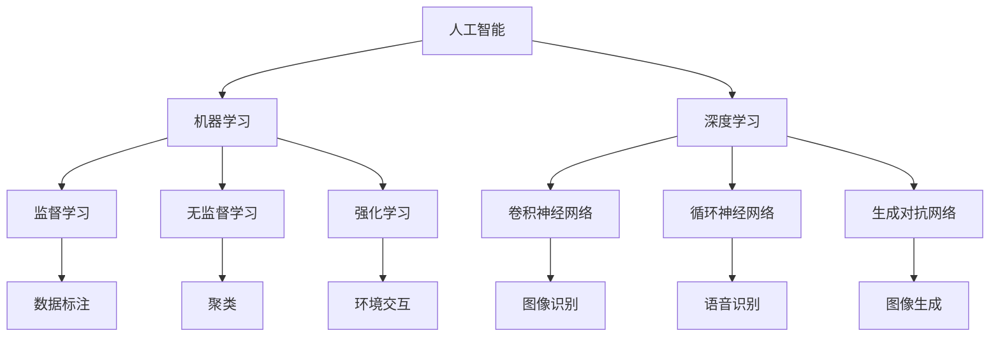

                 

### 背景介绍

Apple 作为全球领先的科技公司，一直在积极推动人工智能（AI）技术的发展与应用。近年来，随着AI技术的成熟和普及，Apple也开始在多个产品线中引入AI功能，以提升用户体验和产品竞争力。Apple 的 AI 发展历程可以追溯到 2016 年，当时苹果公司宣布收购 AI 公司Lincoln Labs，并推出具有人脸识别功能的iPhone X。此后，苹果不断加强在AI领域的研发投入，推出了一系列AI驱动的产品和服务。

在本次苹果发布的新产品中，Apple Watch 和iPhone 15 系列均搭载了最新的AI芯片和算法，使得这些产品在性能和智能化方面有了显著的提升。其中，Apple Watch Series 9 引入了全新的心电图监测功能，通过AI算法分析用户的健康数据，为用户提供更精准的健康建议。iPhone 15 系列则搭载了更先进的相机系统，通过AI算法实现更智能的拍照体验。

Apple 的 AI 发展战略不仅体现在硬件层面，还包括软件层面的创新。Apple 开发了自家的人工智能平台Core ML，使得开发者可以将AI模型轻松地集成到iOS、macOS、watchOS 和tvOS 应用中。此外，Apple 还推出了一系列AI 开发工具和框架，如Swift for TensorFlow 和 Create ML，为开发者提供了便捷的AI 开发体验。

在市场竞争方面，Apple 与其他科技巨头如 Google、Amazon、Microsoft 等公司同台竞技，不断在AI领域进行技术突破和应用创新。这些公司在AI领域的竞争主要集中在语音识别、自然语言处理、计算机视觉等方面。Apple 通过推出具有竞争力的AI产品，不仅提升了自身市场份额，也在全球科技产业中占据了重要地位。

总的来说，Apple 在AI 领域的发展不仅为自身产品提供了强大的技术支持，也为整个科技产业带来了新的发展机遇。接下来，我们将进一步探讨苹果发布的AI应用的商业价值，以及这些应用对消费者和企业可能产生的影响。

### 核心概念与联系

在深入分析苹果发布AI应用的商业价值之前，我们首先需要理解几个关键概念：人工智能、机器学习、深度学习和神经网络。

#### 1. 人工智能（AI）
人工智能（Artificial Intelligence，简称AI）是指通过计算机程序实现的智能行为，旨在模拟、扩展或替代人类智能。AI 可以分为弱AI（特定领域的人工智能）和强AI（具有全面人类智能的人工智能）。在商业应用中，弱AI已被广泛应用于推荐系统、语音识别、图像识别等领域。

#### 2. 机器学习（Machine Learning，简称ML）
机器学习（Machine Learning，简称ML）是 AI 的一个子领域，它关注如何从数据中自动发现模式。机器学习算法可以分为监督学习、无监督学习和强化学习。监督学习算法通过已有标记数据训练模型，无监督学习算法则在无标记数据中寻找模式，强化学习算法则通过与环境交互来学习最佳行为策略。

#### 3. 深度学习（Deep Learning，简称DL）
深度学习（Deep Learning，简称DL）是一种基于多层神经网络的机器学习技术，可以自动提取数据中的复杂特征。深度学习在图像识别、语音识别、自然语言处理等领域取得了显著成果。常见的深度学习架构包括卷积神经网络（CNN）、循环神经网络（RNN）和生成对抗网络（GAN）。

#### 4. 神经网络（Neural Networks）
神经网络（Neural Networks）是模仿生物神经系统工作方式的计算模型，由大量的节点（神经元）和连接（边）组成。每个神经元接收输入信号，通过权重和偏置进行加权求和，然后通过激活函数输出结果。神经网络通过反向传播算法不断调整权重和偏置，以优化模型性能。

#### 5. Mermaid 流程图

为了更清晰地展示这些核心概念之间的联系，我们可以使用Mermaid流程图来描述。以下是一个简化的流程图：



通过这个流程图，我们可以看到人工智能是如何通过机器学习、深度学习和神经网络等技术实现具体应用的。例如，在图像识别领域，卷积神经网络（CNN）被广泛应用于人脸识别和物体检测。在自然语言处理领域，循环神经网络（RNN）和生成对抗网络（GAN）则被用于语言模型生成和图像文字转换。

理解这些核心概念和它们之间的联系对于分析苹果发布AI应用的商业价值至关重要。接下来，我们将进一步探讨苹果在AI领域的具体应用和其商业价值。

### 核心算法原理 & 具体操作步骤

为了深入理解苹果在AI领域的应用，我们需要详细探讨其背后的核心算法原理，并描述具体操作步骤。以下是苹果在AI领域采用的一些关键算法和技术。

#### 1. 卷积神经网络（CNN）

卷积神经网络（Convolutional Neural Networks，简称CNN）是深度学习中的一种重要模型，广泛应用于图像识别、物体检测和图像分类等领域。

##### 原理：

CNN 的核心组件包括卷积层、池化层和全连接层。卷积层通过滑动滤波器（卷积核）在输入图像上提取特征。池化层用于降低特征图的空间分辨率，减少参数量和计算复杂度。全连接层将特征图映射到输出类别。

##### 操作步骤：

1. **输入层**：输入图像被送入网络，通常经过预处理（如归一化、裁剪等）。
2. **卷积层**：图像与卷积核进行卷积操作，生成特征图。
3. **激活函数**：通常使用 ReLU（Rectified Linear Unit）作为激活函数，将特征图的每个元素设置为大于零的值，增强网络的学习能力。
4. **池化层**：对特征图进行最大池化或平均池化，减少特征图的大小。
5. **全连接层**：将卷积层的输出映射到输出类别，通过 Softmax 函数输出每个类别的概率分布。
6. **反向传播**：通过反向传播算法更新网络的权重和偏置，优化模型性能。

#### 2. 循环神经网络（RNN）

循环神经网络（Recurrent Neural Networks，简称RNN）是一种用于处理序列数据的深度学习模型，广泛应用于语音识别、机器翻译和自然语言处理等领域。

##### 原理：

RNN 通过在时间步上递归地更新状态，使得模型能够捕获序列中的长期依赖关系。RNN 的核心组件包括输入层、隐藏层和输出层。输入层将序列中的每个元素输入网络，隐藏层通过递归操作更新状态，输出层将隐藏层的输出映射到输出序列。

##### 操作步骤：

1. **输入层**：输入序列被送入网络，通常经过预处理（如分词、嵌入等）。
2. **隐藏层**：网络在每个时间步上递归地更新隐藏状态，通过记忆历史信息。
3. **输出层**：隐藏层的输出经过激活函数处理后，映射到输出序列。
4. **反向传播**：通过反向传播算法更新网络的权重和偏置，优化模型性能。

#### 3. 生成对抗网络（GAN）

生成对抗网络（Generative Adversarial Networks，简称GAN）是一种用于生成数据的深度学习模型，广泛应用于图像生成、语音合成和文本生成等领域。

##### 原理：

GAN 由生成器和判别器两个神经网络组成。生成器尝试生成与真实数据相似的数据，判别器则尝试区分真实数据和生成数据。通过训练生成器和判别器的对抗过程，生成器可以逐渐生成高质量的数据。

##### 操作步骤：

1. **初始化**：初始化生成器和判别器的参数。
2. **生成数据**：生成器生成一批伪造数据。
3. **判别数据**：判别器对真实数据和伪造数据进行分类。
4. **损失函数**：计算生成器和判别器的损失函数，并通过反向传播算法更新参数。
5. **重复训练**：不断重复生成和判别过程，优化模型性能。

通过上述核心算法原理和具体操作步骤的讲解，我们可以更深入地理解苹果在AI领域的应用。接下来，我们将探讨这些算法在苹果产品中的实际应用场景，以及苹果如何通过这些算法实现商业价值。

### 数学模型和公式 & 详细讲解 & 举例说明

在深入了解苹果AI应用的核心算法之后，我们需要进一步探讨这些算法背后的数学模型和公式，并通过具体示例来说明这些模型的实际应用。

#### 1. 卷积神经网络（CNN）的数学模型

卷积神经网络（CNN）的核心组件包括卷积层、池化层和全连接层。以下是其主要数学模型和公式：

##### 卷积层：
卷积层的主要操作是将输入图像与卷积核进行卷积，公式如下：

\[ (f_{ij}^{(l+1)} = \sum_{k} w_{ik}^{(l+1)} f_{kj}^{(l)} + b_{j}^{(l+1)} \]

其中，\( f_{ij}^{(l+1)} \) 是卷积后的特征图元素，\( w_{ik}^{(l+1)} \) 是卷积核权重，\( f_{kj}^{(l)} \) 是输入特征图元素，\( b_{j}^{(l+1)} \) 是卷积层偏置。

##### 池化层：
池化层的主要作用是降低特征图的空间分辨率。常见的池化操作包括最大池化和平均池化。最大池化的公式如下：

\[ (p_{ij} = \max_{k} f_{kj} ) \]

其中，\( p_{ij} \) 是池化后的特征图元素，\( f_{kj} \) 是输入特征图元素。

##### 全连接层：
全连接层将卷积层的输出映射到输出类别。主要操作是将特征图与权重矩阵进行矩阵乘法，并加上偏置。公式如下：

\[ (y_j = \sum_{i} w_{ij} f_{i} + b_j ) \]

其中，\( y_j \) 是输出类别概率，\( w_{ij} \) 是权重矩阵，\( f_{i} \) 是特征图元素，\( b_j \) 是偏置。

#### 2. 循环神经网络（RNN）的数学模型

循环神经网络（RNN）通过递归操作处理序列数据。其主要数学模型包括输入层、隐藏层和输出层。

##### 输入层：
输入层将序列中的每个元素输入网络，通过嵌入层将元素转换为向量表示。公式如下：

\[ (h_t = \sigma(\sum_{j} w_{jt} x_t + b_h) ) \]

其中，\( h_t \) 是隐藏状态，\( x_t \) 是输入元素，\( w_{jt} \) 是嵌入权重，\( b_h \) 是隐藏层偏置，\( \sigma \) 是激活函数（如ReLU或Sigmoid）。

##### 隐藏层：
隐藏层通过递归操作更新隐藏状态。公式如下：

\[ (h_{t+1} = \sigma(\sum_{j} w_{jh_{t+1}} h_t + \sum_{j} w_{jx_{t+1}} x_{t+1} + b_h) ) \]

其中，\( h_{t+1} \) 是下一个时间步的隐藏状态，\( w_{jh_{t+1}} \) 和 \( w_{jx_{t+1}} \) 是递归权重，\( b_h \) 是隐藏层偏置。

##### 输出层：
输出层将隐藏状态映射到输出序列。公式如下：

\[ (y_t = \sigma(\sum_{i} w_{iy_t} h_t + b_o) ) \]

其中，\( y_t \) 是输出元素，\( w_{iy_t} \) 是输出权重，\( b_o \) 是输出层偏置。

#### 3. 生成对抗网络（GAN）的数学模型

生成对抗网络（GAN）由生成器和判别器组成。生成器生成伪造数据，判别器判断数据是真实还是伪造。

##### 生成器：
生成器的目标是生成高质量的数据。其数学模型如下：

\[ (G(z) = \mu + \sigma \odot \phi(W_gz + b_g) ) \]

其中，\( G(z) \) 是生成的数据，\( \mu \) 和 \( \sigma \) 是生成器的均值和方差，\( \phi \) 是生成器的非线性变换函数，\( W_g \) 和 \( b_g \) 是生成器的权重和偏置。

##### 判别器：
判别器的目标是区分真实数据和伪造数据。其数学模型如下：

\[ (D(x) = \sigma(W_d x + b_d) ) \]
\[ (D(G(z)) = \sigma(W_d G(z) + b_d) ) \]

其中，\( D(x) \) 是判别器对真实数据的输出，\( D(G(z)) \) 是判别器对生成数据的输出，\( W_d \) 和 \( b_d \) 是判别器的权重和偏置。

#### 4. 具体示例

为了更直观地理解上述数学模型，我们可以通过一个简单的例子来说明卷积神经网络（CNN）在图像识别中的应用。

假设我们有一个32x32的二值图像，需要通过CNN将其识别为猫或狗。

1. **输入层**：图像被送入网络，经过预处理（如归一化、裁剪等）。
2. **卷积层**：使用一个3x3的卷积核对图像进行卷积，生成特征图。假设卷积核的权重为 \( w_{ik}^{(1)} \)，偏置为 \( b_{j}^{(1)} \)。
3. **激活函数**：使用ReLU作为激活函数，将特征图的每个元素设置为大于零的值。
4. **池化层**：对特征图进行最大池化，减少特征图的大小。
5. **全连接层**：将卷积层的输出映射到输出类别，通过Softmax函数输出每个类别的概率分布。

通过上述步骤，我们可以训练一个CNN模型，使其能够准确识别图像是猫还是狗。这个过程包括数据集准备、模型训练和模型评估等步骤。

总之，通过理解CNN、RNN和GAN等核心算法的数学模型和公式，我们可以更好地理解苹果在AI领域应用这些算法的具体实现，并评估其商业价值。

### 项目实战：代码实际案例和详细解释说明

为了更好地理解苹果AI应用的实现过程，我们以下将通过一个实际案例，详细解释并展示如何使用Python和TensorFlow框架搭建一个基于卷积神经网络的图像分类模型。在这个案例中，我们将使用著名的CIFAR-10数据集，这是一个包含60000张32x32彩色图像的数据集，分为10个类别。

#### 5.1 开发环境搭建

在开始代码实现之前，我们需要搭建一个Python开发环境，并安装所需的库。以下是安装步骤：

1. **安装Python**：确保安装Python 3.x版本。
2. **安装TensorFlow**：通过以下命令安装TensorFlow：
   ```shell
   pip install tensorflow
   ```
3. **安装其他依赖库**：如NumPy、Pandas等，可通过以下命令安装：
   ```shell
   pip install numpy pandas matplotlib
   ```

#### 5.2 源代码详细实现和代码解读

以下是实现CIFAR-10图像分类模型的完整代码：

```python
import tensorflow as tf
from tensorflow.keras import layers
import numpy as np

# 加载CIFAR-10数据集
(x_train, y_train), (x_test, y_test) = tf.keras.datasets.cifar10.load_data()

# 数据预处理
x_train = x_train.astype("float32") / 255
x_test = x_test.astype("float32") / 255

# 转换类别标签为独热编码
num_classes = 10
y_train = tf.keras.utils.to_categorical(y_train, num_classes)
y_test = tf.keras.utils.to_categorical(y_test, num_classes)

# 构建卷积神经网络模型
model = tf.keras.Sequential([
    layers.Conv2D(32, (3, 3), activation='relu', input_shape=(32, 32, 3)),
    layers.MaxPooling2D((2, 2)),
    layers.Conv2D(64, (3, 3), activation='relu'),
    layers.MaxPooling2D((2, 2)),
    layers.Conv2D(64, (3, 3), activation='relu'),
    layers.Flatten(),
    layers.Dense(64, activation='relu'),
    layers.Dense(num_classes, activation='softmax')
])

# 编译模型
model.compile(optimizer='adam',
              loss='categorical_crossentropy',
              metrics=['accuracy'])

# 训练模型
model.fit(x_train, y_train,
          batch_size=64,
          epochs=10,
          validation_data=(x_test, y_test))

# 评估模型
test_loss, test_acc = model.evaluate(x_test, y_test, verbose=2)
print('Test accuracy:', test_acc)
```

#### 5.3 代码解读与分析

下面是对上述代码的逐行解读：

1. **导入库**：首先导入 TensorFlow 和 NumPy 库，以及 TensorFlow 中的 layers 模块，用于构建模型。
2. **加载数据集**：使用 TensorFlow 的 keras.datasets 模块加载数据集。CIFAR-10 数据集分为训练集和测试集，分别包含50000张和10000张图像。
3. **数据预处理**：将图像数据转换为浮点数并除以255进行归一化，使得数据值范围在0到1之间。同时，将类别标签转换为独热编码，以便后续的模型训练。
4. **构建模型**：使用 Sequential 模式构建卷积神经网络模型。模型包括以下几层：
   - **卷积层**：第一层使用一个32个3x3卷积核，激活函数为ReLU。输入形状为32x32x3。
   - **池化层**：第一层使用最大池化，池化窗口大小为2x2。
   - **卷积层**：第二层和第三层分别使用64个3x3卷积核，激活函数也为ReLU。
   - **池化层**：第二层使用最大池化，池化窗口大小为2x2。
   - **卷积层**：第三层使用64个3x3卷积核。
   - **全连接层**：第一层全连接层使用64个神经元，激活函数为ReLU。
   - **全连接层**：第二层全连接层使用10个神经元，对应10个类别，激活函数为softmax。
5. **编译模型**：配置模型优化器为Adam，损失函数为categorical_crossentropy，评价指标为accuracy。
6. **训练模型**：使用fit函数训练模型，设置批量大小为64，训练10个epochs，并在测试集上验证。
7. **评估模型**：使用evaluate函数评估模型在测试集上的表现，输出测试精度。

通过上述代码，我们可以实现一个简单的卷积神经网络模型，用于CIFAR-10图像分类任务。这个模型展示了卷积神经网络的基本结构和训练过程，同时也说明了如何使用TensorFlow框架构建和训练模型。

### 实际应用场景

苹果在AI领域的应用涵盖了多个方面，从硬件到软件，从消费者产品到企业服务，AI技术正不断改变我们的生活方式和工作方式。以下是苹果AI应用的一些主要实际应用场景。

#### 1. 消费者产品

在消费者产品方面，苹果通过其智能设备，如iPhone、iPad、Apple Watch等，将AI技术融入到日常使用中，提升了用户体验。

- **iPhone的相机功能**：iPhone的相机通过AI算法实现智能拍照，包括场景识别、人脸识别、自动对焦等功能。例如，当用户拍摄照片时，iPhone可以自动识别场景（如风景、人物、动物等），并调整相机设置以获得最佳效果。此外，iPhone还利用人脸识别技术实现安全解锁，用户只需面向相机即可解锁设备。

- **Siri语音助手**：Siri是苹果的语音助手，通过自然语言处理技术，Siri能够理解和执行用户的语音指令。用户可以通过Siri进行电话拨号、发送短信、播放音乐、设置提醒、查询天气信息等。Siri还支持语音翻译功能，用户可以轻松进行多语言交流。

- **Apple Watch的健康监测**：Apple Watch配备了多种传感器，通过AI算法分析用户的心率、运动数据等，为用户提供健康监测和运动指导。例如，Apple Watch可以检测用户是否长时间坐着，并提醒用户进行活动。此外，Apple Watch Series 8还引入了睡眠监测功能，用户可以了解自己的睡眠质量。

- **Apple Arcade游戏平台**：Apple Arcade是苹果的游戏订阅服务，通过AI技术优化游戏体验。AI算法可以分析用户的游戏行为，为用户提供个性化的游戏推荐，同时优化游戏的图形渲染和加载速度。

#### 2. 企业服务

在企业服务方面，苹果的AI技术同样发挥着重要作用，帮助企业提升效率、降低成本和增强创新能力。

- **机器学习模型开发**：苹果提供了Core ML工具，使得开发者可以将机器学习模型轻松集成到iOS、macOS、watchOS和tvOS应用中。Core ML支持多种机器学习框架，如TensorFlow、PyTorch等，开发者可以快速将AI模型部署到苹果设备上。

- **自然语言处理**：苹果的Swift for TensorFlow工具允许开发者使用Swift语言构建和训练机器学习模型。Swift for TensorFlow在自然语言处理领域有着广泛应用，开发者可以使用该工具开发文本分类、情感分析、语音识别等应用。

- **计算机视觉**：苹果的Create ML工具使非专业开发者能够创建机器学习模型，用于图像识别、物体检测等计算机视觉任务。Create ML提供了直观的用户界面，用户只需提供数据集，即可自动训练模型。

- **云计算服务**：苹果的iCloud服务集成了AI技术，为用户提供智能存储、智能备份和智能搜索等功能。iCloud利用AI算法分析用户数据，为用户提供个性化的内容推荐和高效的数据管理。

#### 3. 创新应用

除了上述应用场景，苹果的AI技术还在许多创新领域发挥着作用。

- **自动驾驶**：苹果正在开发自动驾驶技术，利用AI算法处理传感器数据，实现自主驾驶。苹果的自动驾驶项目有望改变未来的交通方式，提升道路安全性和交通效率。

- **医疗健康**：苹果与多家医疗机构合作，利用AI技术进行疾病诊断、药物研发和健康监测。例如，苹果的研究团队利用AI分析医学图像，提高肺癌等疾病的早期诊断准确率。

- **智能家居**：苹果的智能家居平台HomeKit集成了AI技术，用户可以通过Siri控制家居设备，实现自动化管理。例如，用户可以通过语音指令控制灯光、空调和安防系统。

总之，苹果的AI应用场景丰富多样，涵盖了消费级和企业级市场，以及创新领域。通过不断推动AI技术的发展和应用，苹果不仅提升了自身产品的竞争力，也为整个社会带来了巨大的变革。

### 工具和资源推荐

在探索人工智能和深度学习领域时，掌握一系列实用的工具和资源对于提升学习和开发效率至关重要。以下是我们为您推荐的几类工具和资源，包括学习资源、开发工具和框架，以及相关论文著作。

#### 7.1 学习资源推荐

**书籍**：
1. **《深度学习》（Deep Learning）** - Ian Goodfellow, Yoshua Bengio, Aaron Courville
   这本书是深度学习领域的经典之作，详细介绍了深度学习的理论基础、算法实现和应用案例。
2. **《Python机器学习》（Python Machine Learning）** - Sebastian Raschka, Vahid Mirjalili
   本书通过Python语言介绍了机器学习的基础知识，包括监督学习和无监督学习等内容。

**在线课程**：
1. **《深度学习专项课程》（Deep Learning Specialization）** - Andrew Ng（吴恩达）
   这是由Coursera提供的深度学习专项课程，由深度学习领域的专家吴恩达教授主讲，涵盖了深度学习的基础知识和高级应用。
2. **《TensorFlow教程》（TensorFlow for Artificial Intelligence）** - Google AI
   这是一套由Google AI推出的TensorFlow教程，适合初学者和进阶者，提供了丰富的实践案例。

**博客和网站**：
1. **ArXiv** - https://arxiv.org/
   ArXiv 是一个在线学术预印本服务器，涵盖了包括人工智能在内的多个领域，是了解最新研究成果的重要渠道。
2. **Medium** - https://medium.com/topics/deep-learning
   Medium 是一个内容分享平台，上面有许多关于深度学习、机器学习的优秀文章和教程。

#### 7.2 开发工具框架推荐

**框架**：
1. **TensorFlow** - https://www.tensorflow.org/
   TensorFlow 是由Google开发的开源机器学习框架，广泛应用于深度学习研究和开发。
2. **PyTorch** - https://pytorch.org/
   PyTorch 是由Facebook AI研究院开发的开源深度学习框架，以其灵活性和动态图特性而广受欢迎。

**IDE和编辑器**：
1. **Jupyter Notebook** - https://jupyter.org/
   Jupyter Notebook 是一个交互式的开发环境，适合数据科学和机器学习项目。
2. **Visual Studio Code** - https://code.visualstudio.com/
   Visual Studio Code 是一款强大的代码编辑器，支持多种编程语言和框架，适用于深度学习和机器学习项目。

**数据集**：
1. **Kaggle** - https://www.kaggle.com/
   Kaggle 是一个数据科学竞赛平台，提供了大量的数据集和项目，适合学习和实践。
2. **UCI机器学习库** - https://archive.ics.uci.edu/ml/
   UCI机器学习库是一个著名的数据集库，涵盖了多个领域的数据集，适用于机器学习和数据挖掘研究。

#### 7.3 相关论文著作推荐

**经典论文**：
1. **“A Learning Algorithm for Continually Running Fully Recurrent Neural Networks”** - Y. Bengio, P. Simard, P. Frasconi
   这篇论文提出了长短期记忆网络（LSTM）的概念，是循环神经网络领域的重要研究。
2. **“Generative Adversarial Nets”** - I. Goodfellow, J. Pouget-Abadie, M. Mirza, B. Xu, D. Warde-Farley, S. Ozair, A. Courville, Y. Bengio
   这篇论文首次提出了生成对抗网络（GAN）的概念，开创了深度生成模型的新领域。

**重要著作**：
1. **《深度学习》（Deep Learning）** - Ian Goodfellow, Yoshua Bengio, Aaron Courville
   这本书是深度学习领域的经典著作，详细介绍了深度学习的基础知识、算法和最新进展。
2. **《机器学习》（Machine Learning）** - Tom Mitchell
   这本书是机器学习领域的经典教材，系统地介绍了机器学习的基本概念、方法和应用。

通过这些工具和资源，您可以更好地了解和掌握人工智能和深度学习的相关知识和技能，从而在学术研究和实际项目中取得更好的成果。

### 总结：未来发展趋势与挑战

随着人工智能技术的不断发展，苹果在AI领域的应用前景也日益广阔。然而，要充分发挥AI技术的潜力，苹果还需要面对一系列挑战。

首先，数据隐私和安全问题日益凸显。随着AI应用日益普及，如何确保用户数据的安全性和隐私性成为关键挑战。苹果在AI应用中需采取更加严格的数据保护措施，以增强用户信任。

其次，算法透明度和可解释性问题也是一大挑战。虽然AI算法能够实现高效的数据分析和决策，但其内部运作机制往往不够透明，难以解释。苹果需要开发更加透明和可解释的AI算法，提高用户对AI应用的信任度。

另外，AI技术的普及也面临着人才短缺问题。随着AI技术在各个领域的应用不断深入，对专业人才的需求也越来越大。苹果需要通过培训和教育项目，培养更多的AI人才，以支持其AI战略的实施。

未来，苹果在AI领域的趋势包括：

1. **进一步整合AI技术**：苹果将继续在硬件和软件层面整合AI技术，提升产品性能和用户体验。

2. **拓展应用领域**：苹果将探索AI在医疗健康、智能交通、智能家居等领域的应用，推动技术创新和产业变革。

3. **开放生态体系**：苹果将开放更多的AI开发工具和框架，吸引更多的开发者加入，共同推动AI技术的发展。

总之，苹果在AI领域的未来发展充满机遇与挑战。通过不断创新和解决关键问题，苹果有望在AI领域取得更大的突破，引领科技产业的新潮流。

### 附录：常见问题与解答

**Q1：苹果的AI技术有哪些具体应用？**
A1：苹果的AI技术主要应用于消费者产品和企业服务。具体应用包括：
- 智能手机和手表的相机功能，如场景识别和人脸识别。
- Siri语音助手的自然语言处理和语音交互。
- Apple Watch的健康监测和运动指导。
- 机器学习模型开发，如Core ML工具。
- 自然语言处理，如Swift for TensorFlow。
- 计算机视觉，如Create ML工具。

**Q2：苹果如何确保用户数据的安全性和隐私性？**
A2：苹果采取多项措施确保用户数据的安全性和隐私性，包括：
- 使用加密技术保护数据传输和存储。
- 严格的数据使用政策，限制应用程序访问用户数据。
- 开发透明和可解释的AI算法，提高用户对AI应用的信任度。

**Q3：苹果在AI领域的竞争策略是什么？**
A3：苹果的AI竞争策略主要包括：
- 投资研发，保持技术领先地位。
- 开放生态体系，吸引更多开发者加入。
- 拓展AI应用领域，从消费级到企业级。
- 强调用户体验，通过优质的应用和服务吸引用户。

**Q4：苹果在AI领域的未来发展方向是什么？**
A4：苹果在AI领域的未来发展方向包括：
- 进一步整合AI技术，提升产品性能和用户体验。
- 拓展AI在医疗健康、智能交通、智能家居等领域的应用。
- 开发更加透明和可解释的AI算法。
- 投资人才培养，推动AI技术的发展。

### 扩展阅读 & 参考资料

**书籍推荐**：
1. **《深度学习》（Deep Learning）** - Ian Goodfellow, Yoshua Bengio, Aaron Courville
2. **《Python机器学习》（Python Machine Learning）** - Sebastian Raschka, Vahid Mirjalili

**在线课程推荐**：
1. **《深度学习专项课程》（Deep Learning Specialization）** - Andrew Ng（吴恩达）
2. **《TensorFlow教程》（TensorFlow for Artificial Intelligence）** - Google AI

**网站推荐**：
1. **ArXiv** - https://arxiv.org/
2. **Medium** - https://medium.com/topics/deep-learning

**论文推荐**：
1. **“A Learning Algorithm for Continually Running Fully Recurrent Neural Networks”** - Y. Bengio, P. Simard, P. Frasconi
2. **“Generative Adversarial Nets”** - I. Goodfellow, J. Pouget-Abadie, M. Mirza, B. Xu, D. Warde-Farley, S. Ozair, A. Courville, Y. Bengio

**工具和框架推荐**：
1. **TensorFlow** - https://www.tensorflow.org/
2. **PyTorch** - https://pytorch.org/
3. **Jupyter Notebook** - https://jupyter.org/
4. **Visual Studio Code** - https://code.visualstudio.com/

通过这些扩展阅读和参考资料，您可以进一步深入了解人工智能和深度学习领域的最新进展和应用。

