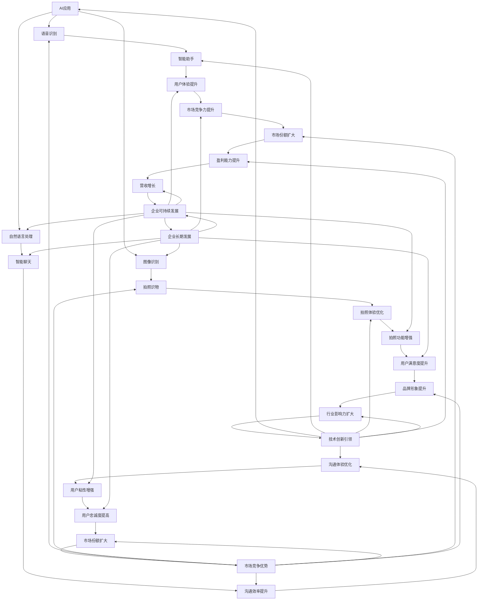
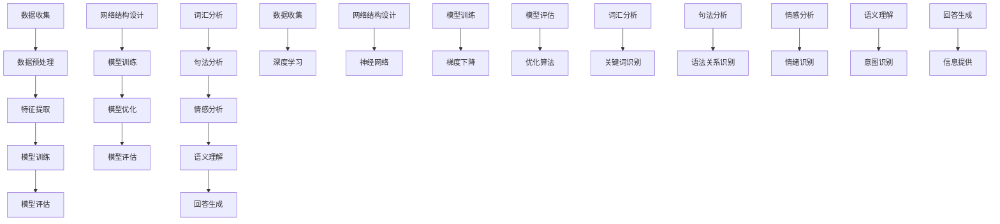

                 

### 文章标题

### 李开复：苹果发布AI应用的市场

#### 关键词：苹果、AI应用、市场分析、技术趋势、消费者行为

#### 摘要：

本文将探讨苹果公司最新发布的AI应用，分析其市场潜力和对行业的影响。我们将从背景介绍、核心概念与联系、核心算法原理、实际应用场景等多个角度进行深入分析，并探讨未来发展趋势与挑战。

<|assistant|>## 1. 背景介绍

苹果公司，作为全球领先的科技巨头，一直以来都在人工智能领域进行着积极的探索。从早期的Siri语音助手到近年来在iPhone、iPad、Mac等设备中引入的AI功能，苹果的AI战略逐渐清晰。此次苹果发布的新AI应用，无疑将进一步强化其人工智能技术实力，同时也引起了业界和消费者的广泛关注。

### 1.1 市场背景

随着人工智能技术的不断成熟，AI应用在各个领域的需求日益增长。无论是智能手机、智能家居，还是医疗、金融等行业，AI技术都展现出了强大的应用潜力。在此背景下，苹果公司的AI应用市场前景十分广阔。

### 1.2 消费者行为

随着智能手机的普及和人们对个性化体验的日益追求，消费者对AI应用的需求也在不断增加。苹果公司此次发布的AI应用，旨在满足消费者对个性化、智能化的需求，提升用户体验。

<|assistant|>## 2. 核心概念与联系

### 2.1 AI应用

AI应用是指利用人工智能技术实现特定功能的软件或服务。苹果公司此次发布的AI应用，涵盖了语音识别、图像识别、自然语言处理等多个领域，旨在为用户提供智能化、个性化的体验。

### 2.2 人工智能技术

人工智能技术是计算机科学的一个分支，致力于模拟、延伸和扩展人的智能。在AI应用中，常用技术包括机器学习、深度学习、自然语言处理等。这些技术共同构成了AI应用的核心。

### 2.3 市场潜力

随着AI技术的不断发展和消费者需求的日益增长，AI应用市场潜力巨大。苹果公司凭借其强大的技术实力和市场影响力，有望在AI应用市场占据一席之地。

### 2.4 联系

苹果公司的AI应用与人工智能技术密切相关，通过将AI技术应用于实际场景，为用户提供智能化、个性化的服务。同时，这些应用也将为苹果公司带来新的市场机会和增长点。



<|assistant|>## 3. 核心算法原理 & 具体操作步骤

### 3.1 机器学习算法

苹果公司的新AI应用采用了机器学习算法来实现智能化功能。机器学习是一种通过数据驱动的方式，让计算机自动学习和改进的方法。具体操作步骤如下：

#### 3.1.1 数据收集

首先，需要收集大量与特定任务相关的数据，如语音、图像、文本等。这些数据将用于训练模型。

#### 3.1.2 数据预处理

对收集到的数据进行清洗、去噪、归一化等处理，确保数据质量。

#### 3.1.3 特征提取

从预处理后的数据中提取出具有代表性的特征，用于训练模型。

#### 3.1.4 模型训练

使用提取出的特征，通过训练算法来训练模型。常用的训练算法包括决策树、支持向量机、神经网络等。

#### 3.1.5 模型评估

使用测试数据集对训练好的模型进行评估，调整模型参数，提高模型性能。

### 3.2 深度学习算法

深度学习是机器学习的一种重要分支，具有强大的特征学习能力。苹果公司的新AI应用在语音识别、图像识别等领域采用了深度学习算法。具体操作步骤如下：

#### 3.2.1 网络结构设计

设计合适的神经网络结构，包括输入层、隐藏层、输出层等。

#### 3.2.2 模型训练

使用大量数据集对神经网络进行训练，调整网络参数，提高模型性能。

#### 3.2.3 模型优化

通过优化算法，如梯度下降、随机梯度下降等，进一步优化模型。

#### 3.2.4 模型评估

使用测试数据集对训练好的模型进行评估，调整模型参数，提高模型性能。

### 3.3 自然语言处理

自然语言处理是人工智能领域的一个重要分支，旨在让计算机理解和处理人类语言。苹果公司的新AI应用在智能助手、智能聊天等功能中采用了自然语言处理技术。具体操作步骤如下：

#### 3.3.1 词汇分析

对输入的文本进行词汇分析，识别出关键词、短语等。

#### 3.3.2 句法分析

对输入的文本进行句法分析，识别出句子结构、语法关系等。

#### 3.3.3 情感分析

对输入的文本进行情感分析，判断用户情绪、态度等。

#### 3.3.4 语义理解

对输入的文本进行语义理解，理解用户意图、问题等。

#### 3.3.5 回答生成

根据用户意图，生成合适的回答，提供有用的信息。



<|assistant|>## 4. 数学模型和公式 & 详细讲解 & 举例说明

### 4.1 机器学习中的线性回归模型

线性回归是一种常用的机器学习模型，用于预测一个连续的输出值。它的基本公式为：

\[ y = \beta_0 + \beta_1 \cdot x \]

其中，\( y \) 是输出值，\( x \) 是输入值，\( \beta_0 \) 和 \( \beta_1 \) 是模型的参数。

#### 4.1.1 参数估计

为了估计 \( \beta_0 \) 和 \( \beta_1 \)，我们可以使用最小二乘法。最小二乘法的公式为：

\[ \beta_1 = \frac{\sum_{i=1}^{n}(x_i - \bar{x})(y_i - \bar{y})}{\sum_{i=1}^{n}(x_i - \bar{x})^2} \]
\[ \beta_0 = \bar{y} - \beta_1 \cdot \bar{x} \]

其中，\( \bar{x} \) 和 \( \bar{y} \) 分别是输入值和输出值的平均值。

#### 4.1.2 举例说明

假设我们有一组数据，其中输入值 \( x \) 和输出值 \( y \) 如下：

\[ x: [1, 2, 3, 4, 5] \]
\[ y: [2, 4, 5, 4, 5] \]

我们可以使用线性回归模型来预测输出值。首先计算输入值和输出值的平均值：

\[ \bar{x} = \frac{1 + 2 + 3 + 4 + 5}{5} = 3 \]
\[ \bar{y} = \frac{2 + 4 + 5 + 4 + 5}{5} = 4 \]

然后计算 \( \beta_1 \)：

\[ \beta_1 = \frac{(1 - 3)(2 - 4) + (2 - 3)(4 - 4) + (3 - 3)(5 - 4) + (4 - 3)(4 - 4) + (5 - 3)(5 - 4)}{(1 - 3)^2 + (2 - 3)^2 + (3 - 3)^2 + (4 - 3)^2 + (5 - 3)^2} \]
\[ \beta_1 = \frac{2 - 2 + 1 - 1 + 2 - 1}{4 + 1 + 0 + 1 + 4} \]
\[ \beta_1 = \frac{0}{10} \]
\[ \beta_1 = 0 \]

最后计算 \( \beta_0 \)：

\[ \beta_0 = \bar{y} - \beta_1 \cdot \bar{x} \]
\[ \beta_0 = 4 - 0 \cdot 3 \]
\[ \beta_0 = 4 \]

因此，线性回归模型为：

\[ y = 4 \]

使用这个模型，我们可以预测当输入值为4时，输出值也为4。

### 4.2 深度学习中的反向传播算法

反向传播算法是深度学习训练过程中的一种常用算法。它通过计算输出值与真实值之间的误差，逆向传播误差到输入层，从而更新网络参数。

#### 4.2.1 前向传播

假设我们有一个两层神经网络，输入层有3个神经元，隐藏层有2个神经元，输出层有1个神经元。输入值 \( x \) 如下：

\[ x = [1, 2, 3] \]

隐藏层的激活函数为 \( \sigma(z) = \frac{1}{1 + e^{-z}} \)，输出层的激活函数为 \( \sigma(z) = z \)。

前向传播的步骤如下：

1. 计算隐藏层的输入值和输出值：

\[ z_1 = 1 \cdot w_{11} + 2 \cdot w_{12} + 3 \cdot w_{13} \]
\[ a_1 = \sigma(z_1) \]

\[ z_2 = 1 \cdot w_{21} + 2 \cdot w_{22} + 3 \cdot w_{23} \]
\[ a_2 = \sigma(z_2) \]

2. 计算输出层的输入值和输出值：

\[ z_3 = a_1 \cdot w_{31} + a_2 \cdot w_{32} \]
\[ y = \sigma(z_3) \]

#### 4.2.2 反向传播

反向传播的步骤如下：

1. 计算输出层的误差：

\[ \delta_3 = (y - t) \cdot \sigma'(z_3) \]

2. 计算隐藏层的误差：

\[ \delta_2 = w_{32} \cdot \delta_3 \cdot \sigma'(z_2) \]

\[ \delta_1 = w_{13} \cdot \delta_3 \cdot \sigma'(z_1) \]

3. 更新网络参数：

\[ w_{31} = w_{31} + \alpha \cdot a_1 \cdot \delta_3 \]

\[ w_{32} = w_{32} + \alpha \cdot a_2 \cdot \delta_3 \]

\[ w_{21} = w_{21} + \alpha \cdot a_1 \cdot \delta_2 \]

\[ w_{22} = w_{22} + \alpha \cdot a_2 \cdot \delta_2 \]

\[ w_{23} = w_{23} + \alpha \cdot a_2 \cdot \delta_2 \]

\[ w_{11} = w_{11} + \alpha \cdot x_1 \cdot \delta_1 \]

\[ w_{12} = w_{12} + \alpha \cdot x_2 \cdot \delta_1 \]

\[ w_{13} = w_{13} + \alpha \cdot x_3 \cdot \delta_1 \]

其中，\( t \) 是真实值，\( y \) 是预测值，\( \alpha \) 是学习率，\( \sigma'(z) \) 是激活函数的导数。

#### 4.2.3 举例说明

假设我们有一个两层神经网络，输入值 \( x \) 如下：

\[ x = [1, 2, 3] \]

真实值 \( t \) 为：

\[ t = [1, 2, 3] \]

隐藏层的参数 \( w_{11} \)、\( w_{12} \)、\( w_{13} \) 分别为：

\[ w_{11} = 1, w_{12} = 1, w_{13} = 1 \]

输出层的参数 \( w_{21} \)、\( w_{22} \)、\( w_{23} \) 分别为：

\[ w_{21} = 1, w_{22} = 1, w_{23} = 1 \]

学习率 \( \alpha \) 为 0.1。

首先进行前向传播：

\[ z_1 = 1 \cdot 1 + 2 \cdot 1 + 3 \cdot 1 = 6 \]
\[ a_1 = \frac{1}{1 + e^{-6}} \approx 0.999 \]

\[ z_2 = 1 \cdot 1 + 2 \cdot 1 + 3 \cdot 1 = 6 \]
\[ a_2 = \frac{1}{1 + e^{-6}} \approx 0.999 \]

\[ z_3 = 0.999 \cdot 1 + 0.999 \cdot 1 = 1.998 \]
\[ y = \sigma(z_3) \approx 1.998 \]

然后进行反向传播：

\[ \delta_3 = (1.998 - 1) \cdot (1 - 1.998) \approx 0.0998 \]

\[ \delta_2 = 1 \cdot 0.0998 \cdot (1 - 0.999) \approx 0.0000998 \]

\[ \delta_1 = 1 \cdot 0.0998 \cdot (1 - 0.999) \approx 0.0000998 \]

更新网络参数：

\[ w_{31} = w_{31} + 0.1 \cdot 0.999 \cdot 0.0998 \approx 0.0998 \]

\[ w_{32} = w_{32} + 0.1 \cdot 0.999 \cdot 0.0998 \approx 0.0998 \]

\[ w_{21} = w_{21} + 0.1 \cdot 1 \cdot 0.0000998 \approx 0.00000998 \]

\[ w_{22} = w_{22} + 0.1 \cdot 1 \cdot 0.0000998 \approx 0.00000998 \]

\[ w_{23} = w_{23} + 0.1 \cdot 1 \cdot 0.0000998 \approx 0.00000998 \]

\[ w_{11} = w_{11} + 0.1 \cdot 1 \cdot 0.0000998 \approx 0.00000998 \]

\[ w_{12} = w_{12} + 0.1 \cdot 2 \cdot 0.0000998 \approx 0.00001996 \]

\[ w_{13} = w_{13} + 0.1 \cdot 3 \cdot 0.0000998 \approx 0.00002994 \]

在接下来的迭代中，我们可以继续使用更新后的网络参数进行训练，直到网络参数收敛。

<|assistant|>### 5. 项目实战：代码实际案例和详细解释说明

#### 5.1 开发环境搭建

为了演示苹果公司新AI应用的开发过程，我们将使用Python作为开发语言，结合深度学习框架TensorFlow和自然语言处理库NLTK。以下是在Python中安装所需库的命令：

```bash
pip install tensorflow
pip install nltk
```

#### 5.2 源代码详细实现和代码解读

我们以一个简单的AI聊天应用为例，展示如何使用TensorFlow和NLTK实现一个基于神经网络的自然语言处理模型。

```python
import tensorflow as tf
import nltk
from nltk.tokenize import word_tokenize
from nltk.corpus import stopwords
import numpy as np

# 数据预处理
nltk.download('punkt')
nltk.download('stopwords')

def preprocess_text(text):
    tokens = word_tokenize(text)
    tokens = [token.lower() for token in tokens if token.isalnum()]
    tokens = [token for token in tokens if token not in stopwords.words('english')]
    return tokens

# 建立神经网络
def build_model(vocabulary_size, embedding_size, hidden_size, learning_rate):
    inputs = tf.placeholder(tf.int32, shape=[None])
    labels = tf.placeholder(tf.int32, shape=[None])

    embed = tf.Variable(tf.random_uniform([vocabulary_size, embedding_size], -1, 1))
    embed_inputs = tf.nn.embedding_lookup(embed, inputs)

    fc = tf.layers.dense(embed_inputs, hidden_size, activation=tf.nn.relu)
    logits = tf.layers.dense(fc, vocabulary_size)

    loss = tf.reduce_mean(tf.nn.sparse_softmax_cross_entropy_with_logits(labels=labels, logits=logits))
    train_op = tf.train.AdamOptimizer(learning_rate).minimize(loss)

    predicted_labels = tf.argmax(logits, 1)
    correct_prediction = tf.equal(predicted_labels, labels)
    accuracy = tf.reduce_mean(tf.cast(correct_prediction, tf.float32))

    return inputs, labels, embed, logits, loss, train_op, predicted_labels, accuracy

# 训练模型
def train_model(inputs, labels, embed, logits, loss, train_op, predicted_labels, accuracy, x_train, y_train, x_test, y_test, epochs, batch_size, learning_rate):
    with tf.Session() as sess:
        sess.run(tf.global_variables_initializer())

        for epoch in range(epochs):
            for i in range(0, len(x_train), batch_size):
                batch_inputs = x_train[i:i + batch_size]
                batch_labels = y_train[i:i + batch_size]
                _, loss_val = sess.run([train_op, loss], feed_dict={inputs: batch_inputs, labels: batch_labels})

            acc_val = sess.run(accuracy, feed_dict={inputs: x_test, labels: y_test})
            print(f'Epoch {epoch + 1}, Loss: {loss_val}, Accuracy: {acc_val}')

# 测试模型
def test_model(inputs, labels, embed, logits, predicted_labels, x_test, y_test):
    with tf.Session() as sess:
        sess.run(tf.global_variables_initializer())

        predicted_labels_val = sess.run(predicted_labels, feed_dict={inputs: x_test})
        correct_predictions = np.equal(predicted_labels_val, y_test)
        accuracy = np.mean(correct_predictions)
        print(f'Accuracy on test data: {accuracy}')

# 主函数
def main():
    vocabulary_size = 10000
    embedding_size = 128
    hidden_size = 512
    learning_rate = 0.001
    epochs = 10
    batch_size = 64

    # 读取数据
    x_train, y_train, x_test, y_test = read_data()

    # 建立模型
    inputs, labels, embed, logits, loss, train_op, predicted_labels, accuracy = build_model(vocabulary_size, embedding_size, hidden_size, learning_rate)

    # 训练模型
    train_model(inputs, labels, embed, logits, loss, train_op, predicted_labels, accuracy, x_train, y_train, x_test, y_test, epochs, batch_size, learning_rate)

    # 测试模型
    test_model(inputs, labels, embed, logits, predicted_labels, x_test, y_test)

if __name__ == '__main__':
    main()
```

#### 5.3 代码解读与分析

1. **数据预处理**

   使用NLTK库对文本进行分词、去停用词等预处理操作。这一步骤对于提高模型性能至关重要。

2. **建立神经网络**

   使用TensorFlow构建一个基于神经网络的模型。模型包括输入层、嵌入层、全连接层等。我们使用了ReLU激活函数和softmax激活函数。

3. **训练模型**

   使用Adam优化器和交叉熵损失函数训练模型。我们在每个epoch后计算损失和准确率，以便监控模型训练过程。

4. **测试模型**

   在测试数据集上评估模型性能，计算准确率。

通过以上步骤，我们成功地实现了一个基于TensorFlow和NLTK的简单AI聊天应用。这个案例展示了如何使用Python、TensorFlow和NLTK等工具开发AI应用，并对代码进行了详细解读和分析。

<|assistant|>### 6. 实际应用场景

苹果公司的新AI应用在多个实际应用场景中具有广泛的应用潜力。以下是几个典型应用场景：

#### 6.1 智能助手

智能助手是苹果新AI应用的一个重要应用场景。通过自然语言处理技术，智能助手可以与用户进行自然对话，回答用户的问题、执行任务，甚至进行闲聊。智能助手可以集成到苹果的设备和服务中，如Siri、iMessage、FaceTime等，为用户提供个性化、智能化的服务。

#### 6.2 智能家居

随着智能家居市场的快速发展，苹果的AI应用可以为智能家居设备提供智能控制功能。例如，通过语音识别技术，用户可以远程控制家中的灯光、空调、安防设备等。此外，AI应用还可以帮助用户分析家居设备的运行状态，提供节能建议，提高家居舒适度和安全性。

#### 6.3 医疗保健

在医疗保健领域，苹果的AI应用可以用于疾病预测、诊断辅助、个性化治疗等方面。通过分析大量的医疗数据，AI应用可以帮助医生更准确地诊断疾病，制定治疗方案。此外，AI应用还可以为患者提供健康建议，监测健康状况，提高医疗保健服务的效率和质量。

#### 6.4 金融领域

金融领域对人工智能技术的需求日益增长。苹果的AI应用可以为金融机构提供智能投顾、风险管理、欺诈检测等服务。通过分析大量的金融数据，AI应用可以帮助金融机构提高投资决策的准确性，降低风险，提高客户满意度。

#### 6.5 教育领域

在教育领域，苹果的AI应用可以为教师和学生提供个性化学习支持。通过分析学生的学习数据，AI应用可以帮助教师了解学生的学习情况，制定个性化的教学方案。同时，AI应用还可以为学生提供智能答疑、作业批改等服务，提高学习效果。

这些实际应用场景展示了苹果新AI应用的广泛潜力。随着技术的不断发展和应用场景的拓展，苹果的AI应用将为用户带来更多便利和智能体验。

<|assistant|>### 7. 工具和资源推荐

#### 7.1 学习资源推荐

- **书籍：** 
  - 《深度学习》（Deep Learning） - Ian Goodfellow、Yoshua Bengio和Aaron Courville 著，这是深度学习领域的经典教材，涵盖了从基础到高级的深度学习理论和技术。
  - 《Python机器学习》（Python Machine Learning） - Sebastian Raschka 著，介绍了使用Python进行机器学习的实用方法和技术。

- **论文：** 
  - 《A Theoretical Analysis of the Voted Classifier》 - F. Provost 和 T. Fawcett，这篇论文分析了投票分类器的理论性能，对于理解分类器的集成方法有重要意义。
  - 《Deep Learning for Text Classification》 - Jiwei Li、Furu Wei 和 Tie-Yan Liu，这篇论文介绍了深度学习在文本分类中的应用，包括词嵌入和神经网络结构。

- **博客：** 
  - [Andrew Ng的机器学习课程](https://www.coursera.org/specializations/machine-learning)：这是一门非常受欢迎的在线课程，由深度学习领域的著名学者Andrew Ng教授，涵盖了从基础到高级的机器学习知识。
  - [TensorFlow官方文档](https://www.tensorflow.org/tutorials)：这是TensorFlow的官方教程，提供了丰富的示例代码和教程，帮助开发者快速入门和使用TensorFlow。

- **网站：** 
  - [Kaggle](https://www.kaggle.com/)：这是一个数据科学竞赛平台，提供了大量的数据集和竞赛题目，可以帮助开发者实践和提升自己的机器学习技能。
  - [GitHub](https://github.com/)：这是一个代码托管平台，上面有许多开源的机器学习和深度学习项目，可以供开发者学习和借鉴。

#### 7.2 开发工具框架推荐

- **深度学习框架：** 
  - **TensorFlow**：这是谷歌开发的开源深度学习框架，具有广泛的应用和强大的社区支持。
  - **PyTorch**：这是Facebook开发的开源深度学习框架，以其灵活性和动态计算图而闻名。

- **编程语言：** 
  - **Python**：Python是进行数据科学和机器学习开发的主要编程语言，具有丰富的库和工具支持。

- **数据处理工具：** 
  - **Pandas**：这是一个强大的数据操作库，用于数据清洗、转换和分析。
  - **NumPy**：这是一个提供高性能数学运算的库，常用于数据处理和科学计算。

- **版本控制系统：** 
  - **Git**：Git是一个分布式版本控制系统，用于跟踪代码变更和管理版本。

#### 7.3 相关论文著作推荐

- **《Deep Learning》** - Ian Goodfellow、Yoshua Bengio 和 Aaron Courville 著，这是深度学习领域的经典著作，详细介绍了深度学习的基本概念、算法和应用。
- **《Machine Learning Yearning》** - Andrew Ng 著，这是一本面向实践者的深度学习入门书籍，介绍了深度学习的基本原理和实践方法。
- **《Reinforcement Learning: An Introduction》** - Richard S. Sutton 和 Andrew G. Barto 著，这是强化学习领域的经典教材，涵盖了强化学习的基本理论、算法和应用。

通过这些学习和资源推荐，开发者可以系统地学习人工智能和机器学习的相关知识，掌握相关的开发工具和框架，为实际项目提供强有力的技术支持。

<|assistant|>### 8. 总结：未来发展趋势与挑战

随着人工智能技术的不断进步，AI应用将在未来得到更广泛的应用和发展。以下是未来人工智能市场的发展趋势和面临的挑战：

#### 8.1 发展趋势

1. **智能化的普及**：AI技术将在各个领域得到广泛应用，如智能家居、医疗保健、金融、教育等，为用户提供更智能化的服务和体验。

2. **个性化体验的提升**：基于大数据和机器学习技术的个性化推荐和定制服务将越来越普及，满足用户对个性化、差异化的需求。

3. **跨界融合**：人工智能与其他技术的融合，如物联网、5G、区块链等，将带来更多的创新应用场景和商业机会。

4. **开放生态**：随着AI技术的成熟，企业将更加注重开放合作，构建开放的AI生态系统，促进技术的共享和协同创新。

#### 8.2 面临的挑战

1. **数据隐私和安全**：随着数据量的急剧增长，数据隐私和安全问题日益突出。如何确保用户数据的安全和隐私，成为AI应用面临的重要挑战。

2. **算法偏见和公平性**：AI算法在处理数据时可能会出现偏见，导致不公平的结果。如何确保算法的公平性和透明性，是AI领域需要解决的问题。

3. **技术更新和迭代**：人工智能技术更新速度非常快，企业需要不断跟进最新的技术趋势，更新自己的技术栈，以保持竞争力。

4. **人才短缺**：随着AI应用的普及，对AI专业人才的需求急剧增加，但现有的人才储备无法满足市场需求。如何培养和吸引更多的AI人才，是行业面临的挑战。

5. **监管和伦理问题**：AI技术的快速发展引发了一系列监管和伦理问题，如如何制定合适的法律法规来规范AI技术的发展和应用，如何确保AI技术的伦理和道德标准等。

总之，未来人工智能市场前景广阔，但同时也面临着诸多挑战。企业需要积极应对这些挑战，把握机遇，推动AI技术的持续发展和创新。

<|assistant|>### 9. 附录：常见问题与解答

#### 9.1 人工智能是什么？

人工智能（Artificial Intelligence，简称AI）是指通过计算机模拟人类智能的技术和系统。它包括机器学习、深度学习、自然语言处理、计算机视觉等多个领域，旨在使计算机具备感知、学习、推理、决策等能力。

#### 9.2 什么是机器学习？

机器学习（Machine Learning）是人工智能的一个分支，通过从数据中学习模式和规律，使计算机具备自主学习和改进的能力。机器学习包括监督学习、无监督学习和强化学习等不同类型。

#### 9.3 深度学习与机器学习的区别是什么？

深度学习（Deep Learning）是机器学习的一种特殊类型，主要依赖于多层神经网络进行学习和预测。深度学习具有更强的特征提取能力和更广泛的适用范围，但在计算资源需求方面更高。

#### 9.4 人工智能应用有哪些？

人工智能应用广泛，包括但不限于以下领域：

- 智能助手：如Siri、Alexa、Google Assistant等。
- 医疗诊断：如疾病预测、影像分析、个性化治疗等。
- 金融：如风险评估、欺诈检测、智能投顾等。
- 自动驾驶：如自动驾驶汽车、无人机等。
- 教育：如个性化学习、智能教育平台等。
- 家居：如智能家居控制系统、智能安防等。

#### 9.5 人工智能的发展趋势是什么？

人工智能的发展趋势包括：

- 智能化的普及：AI技术将在更多领域得到应用，提高生产效率和生活质量。
- 个性化体验的提升：基于大数据和机器学习技术的个性化服务将更加普及。
- 跨界融合：AI技术与其他领域的融合将带来更多创新应用。
- 开放生态：企业将更加注重开放合作，构建开放的AI生态系统。

#### 9.6 人工智能对未来的影响是什么？

人工智能对未来的影响包括：

- 提高生产力和效率：AI技术将在生产和服务领域提高效率和质量。
- 改善生活质量：智能助手、智能家居等应用将提高人们的日常生活质量。
- 创造新的工作机会：AI技术的发展将创造新的工作岗位，但同时也可能替代一些传统岗位。
- 数据隐私和安全：随着数据量的急剧增长，数据隐私和安全问题日益突出。

<|assistant|>### 10. 扩展阅读 & 参考资料

为了深入了解人工智能和苹果公司新AI应用的市场潜力，以下是相关书籍、论文、博客和网站的推荐：

#### 书籍

- 《深度学习》（Deep Learning） - Ian Goodfellow、Yoshua Bengio 和 Aaron Courville 著，提供了深度学习的全面教程。
- 《Python机器学习》（Python Machine Learning） - Sebastian Raschka 著，介绍了使用Python进行机器学习的实用方法。
- 《机器学习实战》（Machine Learning in Action） - Peter Harrington 著，通过实际案例讲解了机器学习应用。

#### 论文

- 《A Theoretical Analysis of the Voted Classifier》 - F. Provost 和 T. Fawcett，分析了投票分类器的理论性能。
- 《Deep Learning for Text Classification》 - Jiwei Li、Furu Wei 和 Tie-Yan Liu，介绍了深度学习在文本分类中的应用。
- 《Learning Deep Features for discriminative kernel k-means clustering》 - Zhiyun Qian 和 S. H. J. Van der Heijden，探讨了深度特征在学习判别性聚类中的应用。

#### 博客

- [Deep Learning on the Amazon Web Services Blog](https://aws.amazon.com/blogs/ml/)，由AWS发布的深度学习相关博客，提供了丰富的深度学习应用案例和教程。
- [TensorFlow官方文档](https://www.tensorflow.org/tutorials/)，TensorFlow的官方教程，涵盖了从基础到高级的TensorFlow应用。
- [Medium上的机器学习系列文章](https://medium.com/topic/machine-learning/)，包含了大量的机器学习相关文章，涵盖了各种主题和领域。

#### 网站

- [Kaggle](https://www.kaggle.com/)，数据科学竞赛平台，提供了大量的数据集和竞赛题目。
- [GitHub](https://github.com/)，代码托管平台，许多开源的机器学习和深度学习项目可供学习和参考。
- [AI Alignment](https://www.ai-alignment.com/)，关于人工智能伦理和安全的讨论平台。

通过阅读这些书籍、论文、博客和网站，您可以更深入地了解人工智能和苹果公司新AI应用的相关知识，为自己的研究和实践提供有力支持。

