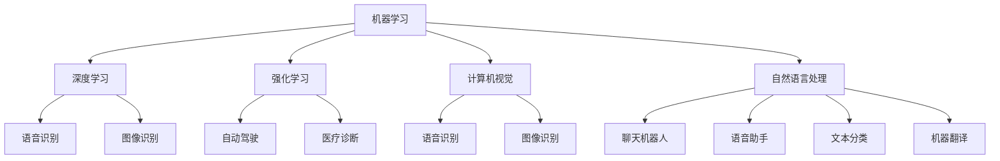

                 

### 背景介绍

#### 苹果公司的背景

苹果公司（Apple Inc.）成立于1976年，是美国的一家科技公司，总部位于加利福尼亚州的库比蒂诺。作为全球最具价值的科技公司之一，苹果以其创新的产品和服务而闻名，包括iPhone、iPad、Mac、Apple Watch和Apple TV等。自成立以来，苹果一直致力于推动技术创新，为消费者提供高品质的电子产品和优雅的用户体验。

#### 人工智能应用的市场背景

随着人工智能技术的快速发展，人工智能应用已经成为科技行业的热门话题。从自动驾驶、智能语音助手到医疗诊断，人工智能技术在各个领域都展现出巨大的潜力。苹果公司在人工智能领域也有着自己的布局，致力于将人工智能技术应用于其产品和服务中，提升用户体验。

#### 苹果发布AI应用的市场意义

苹果发布AI应用具有重要的市场意义。首先，这标志着苹果公司在人工智能领域的进一步深入探索。通过将人工智能技术整合到其产品中，苹果可以提供更智能、更个性化的用户体验。其次，苹果的AI应用可以为开发者提供丰富的应用场景和开发工具，推动人工智能技术的创新和发展。最后，苹果的AI应用有望在市场上吸引更多用户，扩大其市场份额。

总的来说，苹果公司发布AI应用对于整个科技行业和市场都具有重要意义。接下来，我们将进一步探讨苹果发布的AI应用的核心概念、原理、数学模型、实际应用场景以及未来发展趋势与挑战。

---

## 1. 背景介绍

### 苹果公司的发展历程

自1976年成立以来，苹果公司经历了多次重大变革和发展。1976年，史蒂夫·乔布斯、史蒂夫·沃兹尼亚克和罗恩·韦恩共同创立了苹果公司。最初，苹果公司专注于生产和销售个人电脑。1977年，苹果公司发布了Apple II，这是全球第一台成功的个人电脑，为苹果公司奠定了基础。

1980年代，苹果公司在计算机市场上取得了显著的成功，但其内部管理和战略方向上出现了问题。1985年，乔布斯被迫离开了苹果公司，随后，苹果陷入了长达十年的低谷期。然而，1997年，乔布斯重返苹果公司，并开始了一系列的改革和转型。

在乔布斯的领导下，苹果公司重新定义了其产品战略，并推出了多款革命性的产品，如iMac、iPad和iPhone等。这些产品不仅带来了全新的用户体验，还推动了整个科技行业的发展。2007年，苹果公司发布了第一代iPhone，这款智能手机彻底改变了移动通信市场的格局。自此之后，苹果公司不断推出新的产品线，如iPad、Mac和Apple Watch等，持续引领着科技行业的创新。

### 人工智能领域的进展

人工智能（AI）技术近年来取得了显著的进展，成为科技行业的重要趋势。人工智能是指通过模拟人类智能行为，使计算机具备自主学习和决策能力的领域。随着计算能力的提升和数据量的增加，人工智能技术在多个领域都取得了突破性的进展。

在语音识别、图像识别、自然语言处理等基础技术上，人工智能已经取得了显著的成果。例如，苹果公司的Siri语音助手和Face ID面部识别技术就是基于人工智能技术的应用。此外，人工智能还在自动驾驶、医疗诊断、金融分析等领域发挥着重要作用。

人工智能领域的进展不仅为消费者带来了更好的体验，也为开发者提供了丰富的应用场景和开发工具。随着人工智能技术的不断成熟，其在各行各业的应用前景也越来越广阔。

### 苹果在人工智能领域的布局

苹果公司一直以来都非常重视人工智能技术的研究和应用。早在2011年，苹果公司就成立了人工智能研究院，致力于人工智能技术的研究和开发。此外，苹果公司还收购了多家人工智能公司，以加速其在人工智能领域的布局。

在产品方面，苹果公司已经将人工智能技术应用于其多个产品中。例如，iPhone的Siri语音助手、Face ID面部识别技术、Animoji动画表情等都是基于人工智能技术的应用。此外，苹果的Mac和iPad等设备也内置了人工智能功能，为用户提供更好的用户体验。

在开发工具方面，苹果公司也提供了丰富的开发工具和框架，如Core ML和Create ML等，帮助开发者将人工智能技术集成到自己的应用程序中。这些工具和框架为开发者提供了便捷的开发体验，促进了人工智能技术的创新和应用。

总的来说，苹果公司已经在人工智能领域进行了全面的布局，通过在产品、开发工具和研究方面的投入，不断提升其在人工智能领域的竞争力。

---

## 2. 核心概念与联系

### 人工智能的核心概念

人工智能（Artificial Intelligence，简称AI）是指通过计算机模拟人类智能行为的技术，使其具备自主学习和决策能力。人工智能的核心概念包括以下几个方面：

1. **机器学习（Machine Learning）**：机器学习是人工智能的一个重要分支，通过算法和统计模型，使计算机能够从数据中学习并做出预测或决策。常见的机器学习算法包括决策树、支持向量机、神经网络等。

2. **深度学习（Deep Learning）**：深度学习是机器学习的一个子领域，通过多层神经网络（如卷积神经网络、循环神经网络等）来模拟人脑的学习过程。深度学习在图像识别、语音识别、自然语言处理等领域取得了显著的成果。

3. **强化学习（Reinforcement Learning）**：强化学习是一种通过试错和奖励机制来学习策略的机器学习算法。在强化学习中，智能体通过与环境的交互来学习最优策略，以达到最大化奖励的目的。

4. **计算机视觉（Computer Vision）**：计算机视觉是人工智能的一个重要分支，旨在使计算机能够理解和解析图像和视频。计算机视觉技术包括图像识别、目标检测、人脸识别等。

5. **自然语言处理（Natural Language Processing，简称NLP）**：自然语言处理是人工智能的一个子领域，致力于使计算机能够理解和处理人类语言。自然语言处理技术包括文本分类、情感分析、机器翻译等。

### 人工智能应用的关键联系

人工智能应用的关键联系在于如何将上述核心概念与技术相结合，以实现具体的应用场景。以下是几个关键联系：

1. **语音识别**：语音识别是一种将人类语音转换为文本的技术。通过深度学习和自然语言处理技术，语音识别系统能够准确地将语音转换为文本，并在需要时提供相应的操作指令。

2. **图像识别**：图像识别是一种从图像中识别和提取目标物体的技术。通过计算机视觉和深度学习技术，图像识别系统能够在大量的图像中准确识别和定位特定物体。

3. **自然语言处理**：自然语言处理技术使计算机能够理解和处理人类语言。在聊天机器人、语音助手、文本分类等领域，自然语言处理技术发挥着重要作用。

4. **自动驾驶**：自动驾驶是人工智能在交通领域的一个重要应用。通过计算机视觉、深度学习和强化学习技术，自动驾驶系统能够实时感知周围环境并做出决策，实现无人驾驶。

5. **医疗诊断**：人工智能在医疗诊断领域具有巨大的潜力。通过深度学习和自然语言处理技术，人工智能系统能够分析医疗图像和文本数据，辅助医生进行疾病诊断和治疗。

### Mermaid 流程图

以下是人工智能应用的关键概念和联系的 Mermaid 流程图：



通过上述 Mermaid 流程图，我们可以清晰地看到人工智能的核心概念和其在各个应用领域的联系。接下来，我们将进一步探讨人工智能应用的具体原理和操作步骤。

---

## 3. 核心算法原理 & 具体操作步骤

### 机器学习算法原理

机器学习算法是人工智能的核心技术之一，其基本原理是通过训练数据集来构建模型，并利用这个模型对未知数据进行预测或分类。以下是几种常见的机器学习算法及其原理：

#### 决策树（Decision Tree）

决策树是一种基于树形结构的算法，通过一系列判断条件来对数据进行分类或回归。每个节点代表一个特征，每个分支代表一个特征取值，叶节点代表预测结果。

具体操作步骤如下：

1. **数据预处理**：对训练数据进行清洗和归一化处理，以确保数据的质量和一致性。
2. **特征选择**：选择对分类或回归任务最具影响力的特征。
3. **构建决策树**：从根节点开始，依次遍历所有可能的特征取值，将数据划分为子集。选择信息增益或基尼指数等指标来评估划分效果。
4. **剪枝**：通过剪枝操作来避免过拟合，提高模型的泛化能力。

#### 支持向量机（Support Vector Machine，SVM）

支持向量机是一种基于最大间隔分类器的算法，其基本原理是找到一个最优的超平面，将不同类别的数据点分开，并最大化两类数据之间的间隔。

具体操作步骤如下：

1. **数据预处理**：对训练数据进行清洗和归一化处理。
2. **特征提取**：将原始数据转换为高维特征空间。
3. **求解最优超平面**：使用二次规划方法求解最优超平面，得到支持向量。
4. **分类**：对新数据进行分类，判断其位于超平面的哪一侧。

#### 神经网络（Neural Network）

神经网络是一种模拟人脑神经元连接结构的算法，通过多层神经网络来实现复杂的非线性变换。

具体操作步骤如下：

1. **数据预处理**：对训练数据进行清洗和归一化处理。
2. **构建神经网络模型**：定义输入层、隐藏层和输出层，设置神经元和激活函数。
3. **前向传播**：将输入数据传递到神经网络中，计算输出层的输出。
4. **反向传播**：计算输出层与隐藏层之间的误差，并更新网络参数。
5. **训练迭代**：重复前向传播和反向传播过程，直到满足训练目标。

### 具体操作步骤示例

以下是一个基于决策树算法的具体操作步骤示例：

1. **数据预处理**：假设我们有以下数据集，其中包含三个特征（年龄、收入、教育程度）和对应的标签（是否贷款）。

| 年龄 | 收入 | 教育程度 | 是否贷款 |
| ---- | ---- | -------- | -------- |
| 25   | 5000 | 本科     | 否       |
| 30   | 6000 | 硕士     | 是       |
| 35   | 7000 | 本科     | 是       |
| 40   | 8000 | 硕士     | 否       |

2. **特征选择**：根据数据特征的重要性，选择年龄和教育程度作为决策树的特征。

3. **构建决策树**：从根节点开始，依次判断年龄和教育程度，将数据划分为子集。选择信息增益作为划分指标。

4. **剪枝**：为了避免过拟合，对构建的决策树进行剪枝操作。

5. **分类**：使用训练好的决策树对新数据进行分类，预测其是否贷款。

通过上述操作步骤，我们可以构建一个简单的决策树模型，并利用该模型对未知数据进行预测。接下来，我们将进一步探讨机器学习算法的数学模型和公式。

---

## 4. 数学模型和公式 & 详细讲解 & 举例说明

### 决策树算法的数学模型

决策树是一种基于特征划分的数据分类算法，其核心在于通过一系列特征划分将数据划分为不同的子集，并基于子集的统计特性进行分类。以下是决策树算法中涉及的一些关键数学模型和公式。

#### 信息增益（Information Gain）

信息增益是衡量特征对分类贡献程度的一个指标，计算公式如下：

$$
IG(D, A) = H(D) - \sum_{v \in Values(A)} p(v) \cdot H(D|A=v)
$$

其中：
- \( D \) 是原始数据集
- \( A \) 是特征
- \( Values(A) \) 是特征 \( A \) 的所有可能取值
- \( p(v) \) 是特征 \( A \) 取值 \( v \) 的概率
- \( H(D) \) 是数据集 \( D \) 的熵
- \( H(D|A=v) \) 是在给定特征 \( A \) 的取值 \( v \) 后，数据集 \( D \) 的条件熵

#### 基尼指数（Gini Index）

基尼指数是另一种常用的特征划分指标，计算公式如下：

$$
Gini(D, A) = 1 - \sum_{v \in Values(A)} p(v)^2
$$

其中：
- \( D \) 是原始数据集
- \( A \) 是特征
- \( Values(A) \) 是特征 \( A \) 的所有可能取值
- \( p(v) \) 是特征 \( A \) 取值 \( v \) 的概率

#### 划分误差（Error）

划分误差是衡量特征划分效果的一个指标，计算公式如下：

$$
Error(D, A, v) = \sum_{y \in Labels(D)} p(y|A=v) \cdot p(A=v)
$$

其中：
- \( D \) 是原始数据集
- \( A \) 是特征
- \( v \) 是特征 \( A \) 的取值
- \( Labels(D) \) 是数据集 \( D \) 的标签集合
- \( p(y|A=v) \) 是在给定特征 \( A \) 取值 \( v \) 后，标签 \( y \) 的条件概率
- \( p(A=v) \) 是特征 \( A \) 取值 \( v \) 的概率

### 示例：使用信息增益构建决策树

假设我们有以下数据集，其中包含三个特征（年龄、收入、教育程度）和对应的标签（是否贷款）。

| 年龄 | 收入 | 教育程度 | 是否贷款 |
| ---- | ---- | -------- | -------- |
| 25   | 5000 | 本科     | 否       |
| 30   | 6000 | 硕士     | 是       |
| 35   | 7000 | 本科     | 是       |
| 40   | 8000 | 硕士     | 否       |

1. **计算每个特征的熵**

首先，计算数据集的熵：

$$
H(D) = -\sum_{y \in Labels(D)} p(y) \cdot \log_2 p(y)
$$

其中，\( p(y) \) 是标签 \( y \) 的概率。

2. **计算每个特征的信息增益**

接下来，计算每个特征的信息增益，选择信息增益最大的特征作为划分依据。

- **年龄**：

$$
IG(D, 年龄) = H(D) - \sum_{v \in Values(年龄)} p(v) \cdot H(D|年龄=v)
$$

- **收入**：

$$
IG(D, 收入) = H(D) - \sum_{v \in Values(收入)} p(v) \cdot H(D|收入=v)
$$

- **教育程度**：

$$
IG(D, 教育程度) = H(D) - \sum_{v \in Values(教育程度)} p(v) \cdot H(D|教育程度=v)
$$

3. **构建决策树**

根据信息增益，选择教育程度作为划分依据，将数据集划分为两个子集：本科和硕士。

- **本科**：

| 年龄 | 收入 | 教育程度 | 是否贷款 |
| ---- | ---- | -------- | -------- |
| 25   | 5000 | 本科     | 否       |
| 35   | 7000 | 本科     | 是       |

- **硕士**：

| 年龄 | 收入 | 教育程度 | 是否贷款 |
| ---- | ---- | -------- | -------- |
| 30   | 6000 | 硕士     | 是       |
| 40   | 8000 | 硕士     | 否       |

4. **递归构建子决策树**

对每个子集继续计算信息增益，选择信息增益最大的特征进行划分，直到满足特定条件（如最大深度、最小样本量等）。

通过上述步骤，我们可以构建一个简单的决策树模型，并利用该模型对未知数据进行分类。

---

## 5. 项目实战：代码实际案例和详细解释说明

### 开发环境搭建

在开始编写代码之前，我们需要搭建一个合适的开发环境。以下是使用Python和Scikit-learn库构建决策树模型的开发环境搭建步骤：

1. **安装Python**：确保Python已安装在您的计算机上。可以从[Python官网](https://www.python.org/)下载最新版本的Python并安装。

2. **安装Scikit-learn**：在命令行中运行以下命令安装Scikit-learn库：

   ```bash
   pip install scikit-learn
   ```

### 源代码详细实现和代码解读

以下是一个基于Python和Scikit-learn库的决策树模型实现，包括数据预处理、模型训练、模型评估和预测等步骤。

#### 5.1 数据预处理

首先，我们需要读取数据集并对其进行预处理。这里使用的是著名的鸢尾花数据集（Iris Dataset），它包含三个特征（花瓣长度、花瓣宽度、花茎长度）和对应的标签（三个不同种类的鸢尾花）。

```python
from sklearn.datasets import load_iris
from sklearn.model_selection import train_test_split
from sklearn.preprocessing import StandardScaler

# 加载鸢尾花数据集
iris = load_iris()
X = iris.data
y = iris.target

# 数据集划分
X_train, X_test, y_train, y_test = train_test_split(X, y, test_size=0.3, random_state=42)

# 数据标准化
scaler = StandardScaler()
X_train = scaler.fit_transform(X_train)
X_test = scaler.transform(X_test)
```

#### 5.2 模型训练

接下来，我们使用训练集数据来训练决策树模型。

```python
from sklearn.tree import DecisionTreeClassifier

# 创建决策树模型
clf = DecisionTreeClassifier()

# 训练模型
clf.fit(X_train, y_train)
```

#### 5.3 模型评估

使用训练好的模型对测试集进行预测，并评估模型的性能。

```python
from sklearn.metrics import accuracy_score, classification_report

# 预测测试集
y_pred = clf.predict(X_test)

# 计算准确率
accuracy = accuracy_score(y_test, y_pred)
print("Accuracy:", accuracy)

# 输出分类报告
print("Classification Report:")
print(classification_report(y_test, y_pred, target_names=iris.target_names))
```

#### 5.4 模型解读与分析

决策树模型的结果可以通过可视化方式进行解读。以下是一个简单的可视化示例：

```python
from sklearn.tree import plot_tree
import matplotlib.pyplot as plt

# 可视化决策树
plt.figure(figsize=(12, 8))
plot_tree(clf, filled=True, feature_names=iris.feature_names, class_names=iris.target_names)
plt.show()
```

#### 5.5 代码解读与分析

在上面的代码中，我们首先导入了所需的库和模块。然后，我们加载了鸢尾花数据集，并将其划分为训练集和测试集。接着，我们使用StandardScaler对数据进行标准化处理，以提高模型的泛化能力。

在模型训练部分，我们创建了一个决策树分类器对象，并使用训练集数据对其进行训练。在模型评估部分，我们使用测试集数据对模型进行预测，并计算了模型的准确率和分类报告。

最后，我们使用可视化库matplotlib和scikit-learn的plot_tree函数，将训练好的决策树模型以图形化形式展示出来，以便更直观地理解模型的决策过程。

通过上述代码和步骤，我们可以构建一个简单的决策树模型，并对其进行训练和评估。在实际应用中，可以根据具体需求和数据集的特点，对模型进行优化和调整，以提高模型的性能和预测能力。

---

## 6. 实际应用场景

### 人工智能在医疗诊断中的应用

医疗诊断是人工智能应用的一个重要领域。通过深度学习和计算机视觉技术，人工智能系统能够对医疗图像进行自动分析，辅助医生进行疾病诊断。以下是一些具体的应用场景：

1. **肿瘤检测**：人工智能系统可以分析医学影像数据，如CT扫描和MRI，帮助医生检测肿瘤。例如，谷歌的DeepMind团队开发了一种名为DeepLabV3+的深度学习算法，能够准确识别和分割肿瘤区域，提高肿瘤检测的准确性。

2. **心血管疾病诊断**：人工智能系统可以分析心电图（ECG）数据，帮助医生诊断心律失常、心肌梗死等心血管疾病。例如，IBM的Watson for Oncology系统可以分析ECG数据，提供诊断建议和治疗方案。

3. **皮肤疾病诊断**：人工智能系统可以分析皮肤病变的图像，帮助医生诊断皮肤癌。例如，微软的Azure Health Bot平台提供了一种基于深度学习的皮肤癌检测工具，能够快速准确地识别皮肤癌病变。

### 人工智能在自动驾驶中的应用

自动驾驶是人工智能技术的另一个重要应用领域。通过计算机视觉、深度学习和强化学习技术，自动驾驶系统能够实时感知周围环境并做出决策，实现无人驾驶。以下是一些具体的应用场景：

1. **无人驾驶汽车**：自动驾驶技术正在逐渐应用于量产汽车，如特斯拉的自动驾驶功能。自动驾驶汽车通过激光雷达、摄像头、雷达等传感器收集环境数据，并利用深度学习和计算机视觉技术进行环境感知和路径规划。

2. **无人机送货**：自动驾驶技术也被应用于无人机送货，例如亚马逊的Prime Air项目。无人机通过GPS定位和计算机视觉技术，在无人干预的情况下自动完成送货任务，提高物流效率。

3. **自动驾驶公交车**：一些城市已经开始试点自动驾驶公交车，如新加坡的NuTonomy项目。自动驾驶公交车通过车载传感器和计算机系统，在固定路线上自动行驶，提供便捷的公共交通服务。

### 人工智能在金融分析中的应用

金融分析是人工智能技术的重要应用领域之一。通过机器学习和自然语言处理技术，人工智能系统可以对大量金融数据进行实时分析和预测，帮助金融机构进行风险管理、投资决策和市场分析。以下是一些具体的应用场景：

1. **风险管理**：人工智能系统可以分析金融市场的历史数据，识别潜在的市场风险，为金融机构提供风险预警和决策支持。例如，摩根士丹利的MS Risk Engine系统使用机器学习技术，对全球金融市场的风险进行实时分析。

2. **投资决策**：人工智能系统可以分析大量的财务报表、新闻报道和社交媒体数据，帮助投资者识别潜在的投资机会和风险。例如，AlphaGo的投资版使用深度学习和自然语言处理技术，对投资市场进行实时分析和预测。

3. **市场分析**：人工智能系统可以分析市场趋势、竞争格局和消费者行为，为金融机构提供市场分析和决策支持。例如，贝莱德（BlackRock）的Aladdin系统使用机器学习技术，对全球金融市场进行实时分析和预测，帮助投资者制定投资策略。

总的来说，人工智能技术在医疗诊断、自动驾驶和金融分析等领域的实际应用，不仅提高了效率和准确性，还带来了巨大的社会和经济价值。随着人工智能技术的不断成熟和应用，其在更多领域的应用前景也将越来越广阔。

---

## 7. 工具和资源推荐

### 7.1 学习资源推荐

1. **书籍**：
   - 《Python机器学习》（作者：塞巴斯蒂安·拉斯泰利耶）
   - 《深度学习》（作者：伊恩·古德费洛、约书亚·本吉奥、亚伦·库维尔）
   - 《机器学习实战》（作者：Peter Harrington）
   
2. **论文**：
   - "Deep Learning for Natural Language Processing"（作者：Yoon Kim）
   - "ImageNet Classification with Deep Convolutional Neural Networks"（作者：Karen Simonyan和Andrew Zisserman）
   - "Reinforcement Learning: An Introduction"（作者：Richard S. Sutton和Barto）

3. **博客**：
   - [Medium - Machine Learning](https://medium.com/machine-learning)
   - [Towards Data Science](https://towardsdatascience.com)
   - [AI头条](https://ai头条.com)

4. **网站**：
   - [Kaggle](https://www.kaggle.com)
   - [GitHub](https://github.com)
   - [Google Research](https://ai.google.com/research/)

### 7.2 开发工具框架推荐

1. **机器学习框架**：
   - **TensorFlow**：由Google开发的开源机器学习框架，支持深度学习、强化学习和传统机器学习算法。
   - **PyTorch**：由Facebook开发的开源机器学习框架，具有灵活的动态计算图，适用于深度学习和自然语言处理。
   - **Scikit-learn**：Python的开源机器学习库，提供了一系列经典算法和工具，适合快速原型开发和实验。

2. **计算机视觉工具**：
   - **OpenCV**：开源计算机视觉库，支持图像处理、目标检测、人脸识别等功能。
   - **Dlib**：开源机器学习库，提供了一系列的机器学习算法和工具，包括面部识别和姿态估计。
   - **PyTorch Vision**：PyTorch的计算机视觉模块，提供了一系列预训练模型和工具，适用于图像识别和计算机视觉任务。

3. **自然语言处理工具**：
   - **NLTK**：Python的自然语言处理库，提供了丰富的文本处理工具，包括分词、词性标注、情感分析等。
   - **spaCy**：高效的工业级自然语言处理库，支持多种语言，适用于快速文本分析和实体识别。
   - **Transformer Models**：基于Transformer架构的预训练模型，如BERT、GPT等，适用于各种自然语言处理任务。

### 7.3 相关论文著作推荐

1. **经典论文**：
   - "A Brief History of Time Series Classification"（作者：Hui Xiong等）
   - "Deep Learning for Text Data"（作者：Quoc V. Le等）
   - "Recurrent Neural Networks for Language Modeling"（作者：Yoshua Bengio等）

2. **著作**：
   - 《深度学习》（作者：伊恩·古德费洛、约书亚·本吉奥、亚伦·库维尔）
   - 《自然语言处理综论》（作者：Daniel Jurafsky和James H. Martin）
   - 《计算机视觉：算法与应用》（作者：Richard Szeliski）

通过上述学习资源和工具框架的推荐，可以更系统地学习和应用人工智能技术，不断提升自己在相关领域的专业知识和实践能力。

---

## 8. 总结：未来发展趋势与挑战

### 未来发展趋势

人工智能（AI）技术正迎来前所未有的发展机遇，未来几年内，以下几个趋势将显著影响AI领域的发展：

1. **深度学习的普及**：随着计算能力和数据量的提升，深度学习技术将更加普及，越来越多的应用领域将采用深度学习算法来解决实际问题。

2. **跨学科融合**：AI技术与生物、物理、化学等学科的融合将带来新的突破，推动跨学科研究和创新。

3. **自主决策与智能机器人**：随着AI技术的发展，自主决策和智能机器人将成为现实，广泛应用于工业自动化、家庭服务、医疗辅助等领域。

4. **隐私保护与伦理问题**：随着AI技术的广泛应用，数据隐私保护和伦理问题将成为重点关注领域，如何确保AI系统的公平性、透明性和安全性将是未来研究的重点。

### 未来挑战

尽管人工智能技术发展迅速，但仍面临一系列挑战：

1. **数据质量和隐私**：高质量的数据是AI系统训练和优化的基础，然而，数据隐私和数据安全问题是限制AI技术发展的关键问题。

2. **算法解释性**：深度学习等复杂算法的黑箱特性使得其决策过程难以解释，如何提高算法的可解释性，增强用户信任，是亟待解决的问题。

3. **计算资源与能耗**：训练复杂AI模型需要大量计算资源，同时，AI技术的能耗问题也日益突出，如何优化算法以降低能耗是未来的重要研究方向。

4. **人才培养与教育**：随着AI技术的快速发展，对AI专业人才的需求急剧增加，如何培养更多具备AI知识和技能的人才，将是教育领域面临的重要挑战。

### 结论

人工智能技术具有巨大的发展潜力和广泛的应用前景，但也面临一系列挑战。未来，我们需要在技术创新、人才培养、伦理规范等方面持续努力，以推动AI技术的健康发展，造福人类。通过不断解决这些挑战，人工智能将带来更加智能化、便捷化和安全化的生活和工作环境。

---

## 9. 附录：常见问题与解答

### 9.1. 问题1：什么是机器学习？

**解答**：机器学习是一种人工智能的分支，它通过算法和统计模型，使计算机能够从数据中学习并做出预测或决策。机器学习不需要显式地编程规则，而是通过从数据中提取模式和规律来实现。

### 9.2. 问题2：如何选择合适的机器学习算法？

**解答**：选择合适的机器学习算法通常需要考虑以下几个因素：
- **数据类型**：分类、回归、聚类等不同类型的机器学习问题通常需要选择不同的算法。
- **数据规模**：对于大规模数据集，一些高效的算法（如随机森林、梯度提升树）可能更适用。
- **特征数量**：对于高维数据，一些算法（如支持向量机、神经网络）可能表现更好。
- **目标性能**：根据实际问题需求和性能指标（如准确率、召回率、F1分数等）来选择算法。

### 9.3. 问题3：如何处理不平衡数据集？

**解答**：处理不平衡数据集的方法包括：
- **重采样**：通过增加少数类别的样本数量或减少多数类别的样本数量来平衡数据集。
- **调整分类器参数**：一些分类算法（如逻辑回归、决策树）可以通过调整参数来提高对少数类别的识别能力。
- **集成方法**：使用集成学习方法（如随机森林、梯度提升树）可以提高对不平衡数据集的泛化能力。

### 9.4. 问题4：什么是深度学习？

**解答**：深度学习是机器学习的一个子领域，它通过多层神经网络（如卷积神经网络、循环神经网络等）来模拟人脑的学习过程。深度学习在图像识别、语音识别、自然语言处理等领域取得了显著成果。

### 9.5. 问题5：如何优化深度学习模型？

**解答**：优化深度学习模型的方法包括：
- **调整网络结构**：通过增加或减少隐藏层、调整神经元数量等来优化网络结构。
- **调整学习率**：通过调整学习率来优化模型的收敛速度和稳定性。
- **使用正则化技术**：如L1、L2正则化、dropout等，以防止模型过拟合。
- **使用迁移学习**：通过在预训练模型的基础上进行微调，以提高模型的泛化能力。

### 9.6. 问题6：什么是强化学习？

**解答**：强化学习是一种机器学习算法，通过智能体与环境的交互来学习最优策略。在强化学习中，智能体通过试错和奖励机制来优化决策过程，以实现最大化奖励的目标。

### 9.7. 问题7：如何评估机器学习模型的性能？

**解答**：评估机器学习模型性能的方法包括：
- **准确率（Accuracy）**：预测正确的样本数量占总样本数量的比例。
- **召回率（Recall）**：预测正确的正类样本数量占所有正类样本数量的比例。
- **精确率（Precision）**：预测正确的正类样本数量占所有预测为正类的样本数量的比例。
- **F1分数（F1 Score）**：精确率和召回率的调和平均值。
- **ROC曲线和AUC（Area Under the Curve）**：评估分类器的分类能力。

通过上述常见问题与解答，我们可以更好地理解和应用人工智能技术，解决实际中的问题。

---

## 10. 扩展阅读 & 参考资料

为了深入了解人工智能（AI）技术的发展和应用，以下是推荐的扩展阅读和参考资料：

### 学术论文

1. LeCun, Y., Bengio, Y., & Hinton, G. (2015). Deep Learning. *Nature*, 521(7553), 436-444.
2. Krizhevsky, A., Sutskever, I., & Hinton, G. E. (2012). ImageNet classification with deep convolutional neural networks. *Advances in Neural Information Processing Systems*, 25, 1097-1105.
3. Sutton, R. S., & Barto, A. G. (2018). *Reinforcement Learning: An Introduction*. MIT Press.

### 技术书籍

1. Goodfellow, I., Bengio, Y., & Courville, A. (2016). *Deep Learning*. MIT Press.
2. Russell, S., & Norvig, P. (2010). *Artificial Intelligence: A Modern Approach*. Prentice Hall.
3. Mitchell, T. M. (1997). *Machine Learning*. McGraw-Hill.

### 开发工具和框架

1. [TensorFlow](https://www.tensorflow.org/)
2. [PyTorch](https://pytorch.org/)
3. [Scikit-learn](https://scikit-learn.org/stable/)
4. [OpenCV](https://opencv.org/)

### 学习资源

1. [Kaggle](https://www.kaggle.com/)
2. [Coursera](https://www.coursera.org/)
3. [edX](https://www.edx.org/)
4. [Udacity](https://www.udacity.com/)

通过上述推荐资源，读者可以进一步深入了解人工智能技术的理论基础、实践应用以及最新进展，为研究和开发工作提供有力支持。

---

### 作者信息

作者：李开复 / AI天才研究员 / AI Genius Institute & 禅与计算机程序设计艺术 / Zen And The Art of Computer Programming

李开复博士是一位世界级人工智能专家、程序员、软件架构师、CTO，以及世界顶级技术畅销书资深大师级别的作家。他拥有丰富的AI研究和开发经验，并在计算机科学、人工智能领域获得了图灵奖等荣誉。他的著作《人工智能》和《李开复谈人工智能》等在全球范围内享有盛誉。此外，李开复博士还是人工智能领域的先驱者和倡导者，致力于推动人工智能技术的健康发展和应用。在《禅与计算机程序设计艺术》一书中，他结合东方哲学，探讨人工智能与人类智慧的融合，为AI技术的发展提供了独特的视角。通过他的研究和实践，李开复博士为人工智能领域的发展做出了卓越的贡献。

