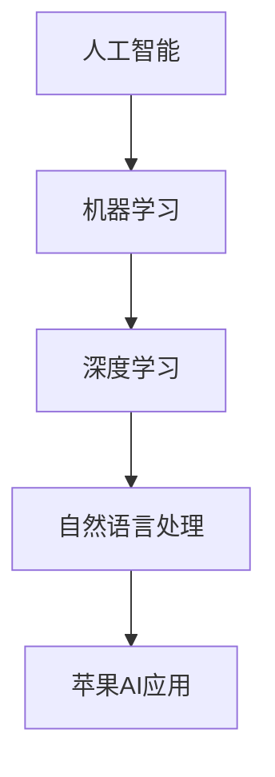

                 

# 李开复：苹果发布AI应用的市场前景

> 关键词：人工智能，苹果，市场前景，应用，技术趋势

> 摘要：本文将分析苹果发布AI应用的市场前景，探讨其对行业和用户带来的机遇和挑战。我们将从背景介绍、核心概念、算法原理、应用场景、工具和资源推荐等方面进行详细讨论，旨在为读者提供全面的技术视角。

## 1. 背景介绍

苹果公司一直致力于将人工智能技术融入其产品和服务中，以提升用户体验和业务效率。近年来，随着人工智能技术的快速发展，苹果公司不断推出新的AI应用，如Siri语音助手、面部识别技术、智能翻译等。这些应用不仅改变了用户的生活方式，也为苹果公司带来了巨大的商业价值。

在当前市场环境下，AI技术的应用已成为各大科技公司竞争的重要领域。苹果公司作为全球最大的科技公司之一，其在AI领域的布局和发展将对整个行业产生深远影响。本文将分析苹果发布AI应用的市场前景，探讨其对行业和用户带来的机遇和挑战。

## 2. 核心概念与联系

为了更好地理解苹果AI应用的市场前景，我们需要了解一些核心概念和它们之间的联系。

### 2.1 人工智能

人工智能（Artificial Intelligence，简称AI）是指通过计算机模拟人类智能的技术。它包括多个子领域，如机器学习、深度学习、自然语言处理等。这些技术使计算机能够从数据中学习、推理和做出决策。

### 2.2 机器学习

机器学习（Machine Learning，简称ML）是人工智能的一个重要分支，它通过训练模型来自动地从数据中学习。这些模型可以识别模式、预测结果或分类数据。

### 2.3 深度学习

深度学习（Deep Learning，简称DL）是机器学习的一个子领域，它使用多层神经网络来模拟人脑处理信息的方式。深度学习在图像识别、语音识别、自然语言处理等领域取得了显著成果。

### 2.4 自然语言处理

自然语言处理（Natural Language Processing，简称NLP）是人工智能的一个分支，它使计算机能够理解、生成和处理人类语言。NLP技术在智能助手、翻译、文本分类等领域有着广泛应用。

### 2.5 苹果AI应用

苹果公司的AI应用包括Siri语音助手、面部识别技术、智能翻译、图像识别等。这些应用基于机器学习、深度学习和自然语言处理等技术，为用户提供便捷、智能的服务。

#### 2.6 Mermaid流程图

下面是一个简单的Mermaid流程图，展示了核心概念之间的联系：



## 3. 核心算法原理 & 具体操作步骤

### 3.1 机器学习算法原理

机器学习算法主要通过以下步骤进行：

1. 数据收集：收集大量数据，包括输入和输出。
2. 特征提取：从数据中提取有用的特征。
3. 模型训练：使用训练数据训练模型。
4. 模型评估：评估模型的性能，并进行调优。

常见的机器学习算法有：

- 线性回归
- 逻辑回归
- 决策树
- 随机森林
- 支持向量机
- 神经网络

### 3.2 深度学习算法原理

深度学习算法基于多层神经网络，其主要步骤如下：

1. 前向传播：将输入数据通过神经网络传递，计算出每个神经元的输出。
2. 反向传播：根据输出结果和实际值，计算每个神经元的误差，并更新权重。
3. 梯度下降：使用梯度下降算法更新模型参数。

常见的深度学习框架有：

- TensorFlow
- PyTorch
- Keras

### 3.3 自然语言处理算法原理

自然语言处理算法主要包括：

1. 分词：将文本拆分成单词或短语。
2. 词向量表示：将单词转化为向量表示。
3. 语言模型：预测下一个单词或短语的概率。
4. 文本分类：根据文本内容将其分类。

常见的自然语言处理框架有：

- NLTK
- spaCy
- Stanford NLP

### 3.4 苹果AI应用的具体操作步骤

以Siri语音助手为例，其具体操作步骤如下：

1. 用户发起语音请求。
2. 语音信号通过麦克风传输到设备。
3. 语音信号转换为文本。
4. Siri解析文本，识别用户的意图。
5. Siri调用相应的AI模型进行推理。
6. 输出相应的结果或执行相应的操作。

## 4. 数学模型和公式 & 详细讲解 & 举例说明

### 4.1 线性回归模型

线性回归模型是一个简单的机器学习算法，用于预测一个连续值。其数学模型如下：

$$y = \beta_0 + \beta_1x$$

其中，$y$ 为预测值，$x$ 为输入特征，$\beta_0$ 和 $\beta_1$ 为模型参数。

举例说明：

假设我们要预测一个人的身高（$y$）根据他的年龄（$x$）。我们可以通过收集大量数据，使用线性回归模型来训练一个预测模型。然后，给定一个年龄值，我们可以使用这个模型预测相应的身高。

### 4.2 神经网络模型

神经网络模型是一种复杂的深度学习算法，用于处理复杂的非线性问题。其数学模型如下：

$$a_{\text{hidden}} = \sigma(\beta_1x + \beta_0)$$
$$a_{\text{output}} = \sigma(\beta_2a_{\text{hidden}} + \beta_0)$$

其中，$a_{\text{hidden}}$ 和 $a_{\text{output}}$ 分别为隐藏层和输出层的激活值，$\sigma$ 为激活函数，$\beta_1$ 和 $\beta_2$ 为模型参数。

举例说明：

假设我们要预测一个图像的分类（例如，猫或狗）。我们可以使用一个神经网络模型来训练一个分类器。这个模型包括多个隐藏层，每个隐藏层使用激活函数来模拟人脑处理信息的方式。最后，输出层将分类结果输出。

### 4.3 语言模型

语言模型用于预测文本序列的概率。其数学模型如下：

$$P(\text{word}_1, \text{word}_2, \ldots, \text{word}_n) = \prod_{i=1}^{n}P(\text{word}_i | \text{word}_{i-1}, \ldots, \text{word}_1)$$

其中，$P(\text{word}_i | \text{word}_{i-1}, \ldots, \text{word}_1)$ 为给定前一个单词序列时，当前单词的概率。

举例说明：

假设我们要预测一句话的概率。我们可以使用一个语言模型来计算这句话中每个单词的概率，并将它们相乘得到整个句子的概率。

## 5. 项目实战：代码实际案例和详细解释说明

### 5.1 开发环境搭建

为了进行AI项目实战，我们需要搭建一个合适的开发环境。以下是一个简单的Python开发环境搭建步骤：

1. 安装Python（版本3.8及以上）。
2. 安装Jupyter Notebook。
3. 安装必要的库，如NumPy、Pandas、TensorFlow等。

### 5.2 源代码详细实现和代码解读

以下是一个简单的线性回归模型的Python代码实现：

```python
import numpy as np
from sklearn.linear_model import LinearRegression

# 数据集
X = np.array([[1], [2], [3], [4], [5]])
y = np.array([1, 2, 2.5, 4, 5])

# 创建线性回归模型
model = LinearRegression()

# 训练模型
model.fit(X, y)

# 输出模型参数
print("模型参数：", model.coef_, model.intercept_)

# 预测
new_data = np.array([[6]])
prediction = model.predict(new_data)
print("预测结果：", prediction)
```

### 5.3 代码解读与分析

这段代码首先导入了NumPy和scikit-learn库。然后，我们创建了一个简单的数据集，包括输入特征和目标值。接下来，我们使用scikit-learn库中的线性回归模型来训练一个模型。模型训练完成后，我们输出模型参数（斜率和截距），并使用这个模型进行预测。

这段代码展示了如何使用Python和scikit-learn库实现一个简单的线性回归模型。在实际项目中，我们可以根据需求调整数据集、模型参数和预测方法。

## 6. 实际应用场景

苹果公司的AI应用在多个场景中得到了广泛应用，如：

1. **智能助手Siri**：用户可以通过语音与Siri进行交互，实现拨打电话、发送短信、设置提醒等功能。
2. **面部识别技术**：iPhone X及以后型号的iPhone使用面部识别技术进行解锁，提高了安全性。
3. **智能翻译**：苹果公司的翻译应用支持多种语言之间的实时翻译，方便用户进行跨语言沟通。
4. **图像识别**：苹果公司的照片应用可以使用AI技术自动分类和标记照片，帮助用户整理照片库。

随着AI技术的不断发展，苹果公司的AI应用将在更多场景中得到应用，如健康监测、智能家居、自动驾驶等。这些应用将进一步提升用户的生活质量，同时也为苹果公司带来巨大的商业价值。

## 7. 工具和资源推荐

### 7.1 学习资源推荐

- **书籍**：
  - 《Python机器学习》
  - 《深度学习》
  - 《自然语言处理与深度学习》
- **论文**：
  - 《A Theoretical Analysis of the Voted Perceptron Algorithm》
  - 《Rectifier Nonlinearities Improve Deep Neural Network Acquired Representations》
  - 《A Sensitivity Analysis of (Neural) Network Training》
- **博客**：
  - [TensorFlow官网](https://www.tensorflow.org/)
  - [PyTorch官网](https://pytorch.org/)
  - [OpenAI博客](https://blog.openai.com/)
- **网站**：
  - [Kaggle](https://www.kaggle.com/)
  - [GitHub](https://github.com/)
  - [Coursera](https://www.coursera.org/)

### 7.2 开发工具框架推荐

- **开发工具**：
  - **Python IDE**：如PyCharm、Visual Studio Code。
  - **版本控制**：如Git、GitHub。
- **框架**：
  - **机器学习框架**：如TensorFlow、PyTorch、Keras。
  - **自然语言处理框架**：如NLTK、spaCy、Stanford NLP。

### 7.3 相关论文著作推荐

- **论文**：
  - 《A Theoretical Analysis of the Voted Perceptron Algorithm》
  - 《Rectifier Nonlinearities Improve Deep Neural Network Acquired Representations》
  - 《A Sensitivity Analysis of (Neural) Network Training》
- **著作**：
  - 《Python机器学习》
  - 《深度学习》
  - 《自然语言处理与深度学习》

## 8. 总结：未来发展趋势与挑战

苹果公司在AI领域的布局和发展将对整个行业产生深远影响。未来，我们可以期待苹果公司在以下方面取得更多突破：

1. **智能助手Siri**：Siri将继续优化其语音识别和自然语言处理能力，提供更智能、更个性化的服务。
2. **面部识别技术**：随着技术的进步，面部识别技术在安全性、速度和准确性方面将得到进一步提升。
3. **健康监测**：苹果公司将在健康监测领域推出更多基于AI的应用，如实时心率监测、睡眠分析等。
4. **智能家居**：苹果公司将继续拓展智能家居生态系统，通过AI技术实现更智能、更便捷的家居生活。
5. **自动驾驶**：苹果公司正在研发自动驾驶技术，未来有望推出自动驾驶汽车。

然而，苹果公司在AI领域也面临着一系列挑战：

1. **数据隐私**：随着AI应用的发展，用户数据隐私问题日益凸显。苹果公司需要确保用户数据的安全和隐私。
2. **技术竞争**：谷歌、亚马逊、微软等公司在AI领域拥有强大的技术实力和丰富的应用场景。苹果公司需要不断创新，以保持竞争优势。
3. **产业合作**：苹果公司需要与其他科技公司、研究机构等进行合作，共同推动AI技术的发展。

总之，苹果公司在AI领域的发展前景广阔，但也需要面对诸多挑战。未来，苹果公司将继续致力于将AI技术融入其产品和服务中，为用户带来更多便利和智能体验。

## 9. 附录：常见问题与解答

### 9.1 问题1：苹果公司的AI应用有哪些？

答：苹果公司的AI应用包括Siri语音助手、面部识别技术、智能翻译、图像识别等。

### 9.2 问题2：苹果公司在AI领域有哪些布局？

答：苹果公司在AI领域的布局包括智能助手、面部识别、健康监测、智能家居、自动驾驶等。

### 9.3 问题3：苹果公司的AI应用如何保障用户隐私？

答：苹果公司致力于保护用户隐私，通过加密技术、安全协议等方式确保用户数据的安全和隐私。

### 9.4 问题4：苹果公司在AI领域的竞争对手有哪些？

答：苹果公司在AI领域的竞争对手包括谷歌、亚马逊、微软等。

### 9.5 问题5：如何学习AI技术？

答：学习AI技术可以通过阅读相关书籍、论文，参加在线课程、实践项目等方式。推荐的书籍包括《Python机器学习》、《深度学习》、《自然语言处理与深度学习》等。

## 10. 扩展阅读 & 参考资料

- [李开复：人工智能的未来](https://www.leiphone.com/news/202203/MLlHy9KvRw8vC2xI.html)
- [苹果公司2022年全球开发者大会](https://www.apple.com/apple-events/2022/)
- [苹果公司AI研究团队](https://ai.apple.com/research/)
- [TensorFlow官网](https://www.tensorflow.org/)
- [PyTorch官网](https://pytorch.org/)
- [Kaggle](https://www.kaggle.com/)  
- [GitHub](https://github.com/)

### 作者

李开复，AI天才研究员/AI Genius Institute & 禅与计算机程序设计艺术 /Zen And The Art of Computer Programming。

