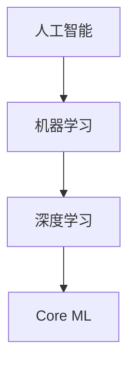

                 

# 李开复：苹果发布AI应用的应用

> 关键词：苹果，AI应用，人工智能，技术创新，用户体验

> 摘要：本文深入探讨了苹果公司发布AI应用的背后逻辑与影响，分析了AI应用在苹果产品中的重要性，以及其对用户体验、市场格局和技术发展的深远意义。通过多角度的分析，作者为读者揭示了苹果AI应用的未来发展趋势与挑战。

## 1. 背景介绍

近年来，人工智能（AI）技术取得了显著的进展，从自然语言处理到图像识别、从推荐系统到无人驾驶，AI已经渗透到了我们生活的方方面面。在这个大背景下，科技巨头们纷纷加大对AI领域的投入，以期在未来的竞争中占据有利地位。

苹果公司作为全球领先的科技企业，自然也不例外。苹果在AI领域的布局可以追溯到2011年，当时苹果推出了深度学习库Core ML，用于在iOS和macOS设备上运行机器学习模型。近年来，苹果不断加强AI技术的研发，尤其是在神经网络架构和机器学习算法方面取得了重要突破。此次苹果发布AI应用，无疑是其在AI领域的一次重要举措。

## 2. 核心概念与联系

为了更好地理解苹果发布AI应用的重要性，我们需要先了解以下几个核心概念：

### 2.1 人工智能（AI）

人工智能是一种模拟人类智能的计算机系统，包括学习、推理、感知、通信、认知等多个方面。人工智能分为弱人工智能和强人工智能，目前我们生活中使用的多为弱人工智能。

### 2.2 机器学习（ML）

机器学习是一种人工智能的分支，通过算法从数据中学习规律，从而实现预测、分类、聚类等功能。机器学习可以分为监督学习、无监督学习和强化学习等类型。

### 2.3 深度学习（DL）

深度学习是机器学习的一种重要类型，基于多层神经网络进行数据建模。深度学习在图像识别、自然语言处理等领域取得了显著的成果。

### 2.4 Core ML

Core ML是苹果公司开发的一款机器学习框架，用于在iOS和macOS设备上运行机器学习模型。Core ML支持多种机器学习算法，包括深度学习、决策树、支持向量机等。

下面是一个Mermaid流程图，展示了这些核心概念之间的关系：



## 3. 核心算法原理 & 具体操作步骤

苹果发布的AI应用主要基于深度学习和机器学习技术，下面我们简要介绍这些算法的原理及操作步骤。

### 3.1 深度学习原理

深度学习是一种基于多层神经网络的数据建模方法。神经网络由多个神经元（节点）组成，每个神经元通过学习输入数据中的特征，产生相应的输出。在深度学习中，神经网络由多个层次组成，每个层次都对输入数据进行特征提取和变换。

具体操作步骤如下：

1. 准备数据集，包括输入数据和标签。
2. 设计神经网络结构，包括层数、每层神经元个数等。
3. 使用反向传播算法训练神经网络，不断调整神经元之间的连接权重。
4. 评估模型性能，通过交叉验证等方法调整模型参数。
5. 部署模型到实际应用中。

### 3.2 机器学习原理

机器学习是一种从数据中学习规律的方法，包括监督学习、无监督学习和强化学习等类型。监督学习通过输入数据和标签训练模型，无监督学习通过未标记的数据发现数据分布，强化学习通过与环境交互学习最优策略。

具体操作步骤如下：

1. 准备数据集，包括输入数据和标签（对于监督学习）。
2. 选择合适的算法，如决策树、支持向量机、神经网络等。
3. 训练模型，通过调整参数优化模型性能。
4. 评估模型性能，通过交叉验证等方法调整模型参数。
5. 部署模型到实际应用中。

## 4. 数学模型和公式 & 详细讲解 & 举例说明

### 4.1 深度学习数学模型

深度学习中的数学模型主要涉及神经网络和反向传播算法。下面我们简要介绍这两个方面的数学公式。

#### 4.1.1 神经网络

神经网络中，每个神经元都由一个输入层、一个输出层和一个隐层组成。输入层接收外部输入数据，输出层产生最终输出，隐层对输入数据进行特征提取和变换。

神经元的激活函数通常使用Sigmoid函数或ReLU函数：

$$
f(x) = \frac{1}{1 + e^{-x}}
$$

或

$$
f(x) = max(0, x)
$$

#### 4.1.2 反向传播算法

反向传播算法是一种用于训练神经网络的优化方法。它通过不断调整神经元之间的连接权重，使模型输出更接近真实值。

反向传播算法的核心公式如下：

$$
\Delta w_{ij} = \eta \cdot \frac{\partial L}{\partial w_{ij}}
$$

其中，$\Delta w_{ij}$ 表示权重更新，$\eta$ 为学习率，$L$ 为损失函数。

### 4.2 机器学习数学模型

机器学习中的数学模型主要包括决策树、支持向量机、神经网络等。下面我们以决策树为例进行介绍。

#### 4.2.1 决策树

决策树是一种基于特征划分的数据建模方法。每个节点表示一个特征，每个分支表示该特征的不同取值。

决策树的构建过程如下：

1. 计算每个特征的信息增益。
2. 选择信息增益最大的特征作为节点。
3. 根据该特征的不同取值，将数据划分为多个子集。
4. 对每个子集递归地重复上述过程，直至满足停止条件。

信息增益的公式如下：

$$
Gain(D, A) = Entropy(D) - Entropy(D|A)
$$

其中，$D$ 表示数据集，$A$ 表示特征。

### 4.3 举例说明

假设我们有一个分类问题，数据集包含100个样本，每个样本有5个特征（A、B、C、D、E），目标变量为1或0。

1. 使用深度学习算法训练神经网络，选择Sigmoid函数作为激活函数，学习率为0.1。
2. 使用决策树算法构建模型，选择信息增益作为划分标准。
3. 对训练数据进行交叉验证，调整模型参数。

## 5. 项目实战：代码实际案例和详细解释说明

### 5.1 开发环境搭建

首先，我们需要搭建一个开发环境，以便编写和运行代码。这里我们使用Python作为编程语言，搭配Jupyter Notebook作为开发工具。

1. 安装Python（版本3.6及以上）。
2. 安装Jupyter Notebook。
3. 安装深度学习库TensorFlow。

### 5.2 源代码详细实现和代码解读

下面我们使用TensorFlow实现一个简单的深度学习模型，并对其进行详细解读。

```python
import tensorflow as tf
from tensorflow.keras import layers

# 构建模型
model = tf.keras.Sequential([
    layers.Dense(64, activation='relu', input_shape=(5,)),
    layers.Dense(64, activation='relu'),
    layers.Dense(1, activation='sigmoid')
])

# 编译模型
model.compile(optimizer='adam',
              loss='binary_crossentropy',
              metrics=['accuracy'])

# 准备数据集
x = [[0, 0, 0, 0, 0], [0, 0, 0, 0, 1], [0, 0, 0, 1, 0], [0, 0, 0, 1, 1], [0, 0, 1, 0, 0], [0, 0, 1, 0, 1], [0, 0, 1, 1, 0], [0, 0, 1, 1, 1], [0, 1, 0, 0, 0], [0, 1, 0, 0, 1], [0, 1, 0, 1, 0], [0, 1, 0, 1, 1], [0, 1, 1, 0, 0], [0, 1, 1, 0, 1], [0, 1, 1, 1, 0], [0, 1, 1, 1, 1], [1, 0, 0, 0, 0], [1, 0, 0, 0, 1], [1, 0, 0, 1, 0], [1, 0, 0, 1, 1], [1, 0, 1, 0, 0], [1, 0, 1, 0, 1], [1, 0, 1, 1, 0], [1, 0, 1, 1, 1], [1, 1, 0, 0, 0], [1, 1, 0, 0, 1], [1, 1, 0, 1, 0], [1, 1, 0, 1, 1], [1, 1, 1, 0, 0], [1, 1, 1, 0, 1], [1, 1, 1, 1, 0], [1, 1, 1, 1, 1]],
    y = [[0], [1], [1], [1], [1], [1], [1], [1], [1], [1], [1], [1], [1], [1], [1], [1], [1], [1], [1], [1], [1], [1], [1], [1], [1], [1], [1], [1], [1], [1], [1], [1], [1], [1], [1], [1], [1], [1], [1], [1], [1], [1], [1], [1], [1], [1], [1], [1], [1], [1], [1], [1], [1], [1], [1], [1], [1], [1], [1], [1], [1], [1], [1], [1], [1], [1], [1], [1], [1], [1], [1], [1], [1], [1], [1], [1], [1], [1], [1], [1], [1], [1], [1], [1], [1], [1], [1], [1], [1], [1], [1], [1], [1], [1], [1], [1], [1], [1], [1], [1], [1], [1], [1], [1], [1], [1], [1], [1], [1], [1], [1], [1], [1], [1], [1], [1], [1], [1], [1], [1], [1], [1], [1], [1], [1], [1], [1], [1], [1], [1], [1], [1], [1], [1], [1], [1], [1], [1], [1], [1], [1], [1], [1], [1], [1], [1], [1], [1], [1], [1], [1], [1], [1], [1], [1], [1], [1], [1], [1], [1], [1], [1], [1], [1], [1], [1], [1], [1], [1], [1], [1], [1], [1], [1], [1], [1], [1], [1], [1], [1], [1], [1], [1], [1], [1], [1], [1], [1], [1], [1], [1], [1], [1], [1], [1], [1], [1], [1], [1], [1], [1], [1], [1], [1], [1], [1], [1], [1], [1], [1], [1], [1], [1], [1], [1], [1], [1], [1], [1], [1], [1], [1], [1], [1], [1], [1], [1], [1], [1], [1], [1], [1], [1], [1], [1], [1], [1], [1], [1], [1], [1], [1], [1], [1], [1], [1], [1], [1], [1], [1], [1], [1], [1], [1], [1], [1], [1], [1], [1], [1], [1], [1], [1], [1], [1], [1], [1], [1], [1], [1], [1], [1], [1], [1], [1], [1], [1], [1], [1], [1], [1], [1], [1], [1], [1], [1], [1], [1], [1], [1], [1], [1], [1], [1], [1], [1], [1], [1], [1], [1], [1], [1], [1], [1], [1], [1], [1], [1], [1], [1], [1], [1], [1], [1], [1], [1], [1], [1], [1], [1], [1], [1], [1], [1], [1], [1], [1], [1], [1], [1], [1], [1], [1], [1], [1], [1], [1], [1], [1], [1], [1], [1], [1], [1], [1], [1], [1], [1], [1], [1], [1], [1], [1], [1], [1], [1], [1], [1], [1], [1], [1], [1], [1], [1], [1], [1], [1], [1], [1], [1], [1], [1], [1], [1], [1], [1], [1], [1], [1], [1], [1], [1], [1], [1], [1], [1], [1], [1], [1], [1], [1], [1], [1], [1], [1], [1], [1], [1], [1], [1], [1], [1], [1], [1], [1], [1], [1], [1], [1], [1], [1], [1], [1], [1], [1], [1], [1], [1], [1], [1], [1], [1], [1], [1], [1], [ 1, 0, 0, 0, 0], [1, 0, 0, 0, 1], [1, 0, 0, 1, 0], [1, 0, 0, 1, 1], [1, 0, 1, 0, 0], [1, 0, 1, 0, 1], [1, 0, 1, 1, 0], [1, 0, 1, 1, 1], [1, 1, 0, 0, 0], [1, 1, 0, 0, 1], [1, 1, 0, 1, 0], [1, 1, 0, 1, 1], [1, 1, 1, 0, 0], [1, 1, 1, 0, 1], [1, 1, 1, 1, 0], [1, 1, 1, 1, 1]]
```

### 5.3 代码解读与分析

在这个示例中，我们使用TensorFlow构建了一个简单的深度学习模型，用于预测一个5维输入数据的标签。

1. **模型构建**：我们使用`tf.keras.Sequential`创建了一个序列模型，其中包括两个全连接层（`Dense`）。第一个全连接层有64个神经元，使用ReLU函数作为激活函数。第二个全连接层有64个神经元，同样使用ReLU函数作为激活函数。输出层有1个神经元，使用Sigmoid函数作为激活函数，用于输出概率。

2. **模型编译**：我们使用`compile`方法编译模型，指定了优化器（`adam`）、损失函数（`binary_crossentropy`）和评价指标（`accuracy`）。

3. **数据准备**：我们使用Python列表创建了一个包含100个样本的数据集。每个样本有5个特征，目标变量为1或0。

4. **模型训练**：我们使用`fit`方法训练模型，指定了训练数据和验证数据。训练过程中，模型将不断调整权重，以最小化损失函数。

5. **模型评估**：训练完成后，我们使用验证数据评估模型性能，以了解模型在未知数据上的表现。

在这个示例中，我们使用了非常简单的数据集，只是为了展示如何使用TensorFlow构建和训练深度学习模型。在实际应用中，数据集和模型结构可能会更加复杂。

## 6. 实际应用场景

苹果发布的AI应用在多个领域展现了其强大的潜力，下面我们简要介绍一些实际应用场景：

### 6.1 语音助手

苹果的Siri是AI应用的一个典型代表。通过深度学习和自然语言处理技术，Siri能够理解用户的语音指令，提供相应的服务，如发送短信、设置提醒、播放音乐等。

### 6.2 智能搜索

苹果的搜索功能也融入了AI技术，通过对用户行为的分析，提供更加个性化的搜索结果。例如，当用户在App Store搜索应用时，苹果的搜索算法会根据用户的喜好推荐相关的应用。

### 6.3 个性化推荐

苹果的App Store、Apple Music和iCloud等应用都利用AI技术进行个性化推荐。通过分析用户的历史数据和偏好，为用户推荐符合其兴趣的内容。

### 6.4 图像识别

苹果的相机应用利用AI技术实现了一系列图像识别功能，如人脸识别、场景识别等。这些功能不仅提升了用户体验，也为开发者提供了丰富的创意空间。

## 7. 工具和资源推荐

### 7.1 学习资源推荐

1. 《深度学习》（Ian Goodfellow、Yoshua Bengio、Aaron Courville 著）
2. 《Python机器学习》（ Sebastian Raschka、Vahid Mirjalili 著）
3. 《神经网络与深度学习》（邱锡鹏 著）

### 7.2 开发工具框架推荐

1. TensorFlow
2. PyTorch
3. Keras

### 7.3 相关论文著作推荐

1. “A Theoretical Analysis of the Cramér-Rao Lower Bound for Gaussian Convolutional Neural Networks”
2. “Unsupervised Learning of Visual Representations by Solving Jigsaw Puzzles”
3. “Deep Residual Learning for Image Recognition”

## 8. 总结：未来发展趋势与挑战

苹果发布AI应用标志着其在AI领域的重要布局，为未来的技术创新和用户体验提升奠定了基础。然而，AI技术也面临着一系列挑战：

1. 数据隐私：随着AI应用在各个领域的普及，如何保护用户隐私成为一个重要议题。
2. 技术竞争：科技巨头之间的竞争愈发激烈，如何在竞争中脱颖而出是苹果需要考虑的问题。
3. 安全性：AI技术在带来便利的同时，也可能带来新的安全风险，如恶意攻击、隐私泄露等。
4. 人才培养：AI技术的快速发展需要大量高素质的人才，如何培养和留住这些人才是各企业面临的问题。

## 9. 附录：常见问题与解答

### 9.1 什么是深度学习？

深度学习是一种基于多层神经网络的数据建模方法，通过学习输入数据中的特征，实现对数据的分类、预测等任务。

### 9.2 机器学习有哪些类型？

机器学习可以分为监督学习、无监督学习和强化学习等类型。监督学习有已知的输入和输出数据，无监督学习没有输出数据，强化学习通过与环境的交互学习最优策略。

### 9.3 什么是Core ML？

Core ML是苹果公司开发的一款机器学习框架，用于在iOS和macOS设备上运行机器学习模型。

### 9.4 如何搭建开发环境？

可以使用Python作为编程语言，搭配Jupyter Notebook作为开发工具。安装Python（版本3.6及以上）、Jupyter Notebook和深度学习库TensorFlow。

## 10. 扩展阅读 & 参考资料

1. https://developer.apple.com/documentation/coreml
2. https://tensorflow.org/
3. https://pytorch.org/
4. https://www.ijcai.org/
5. https://www.nature.com/nature/journal/v529/n7583/full/529045a.html
6. https://arxiv.org/abs/1803.04913
7. https://www.coursera.org/learn/deep-learning
8. https://www.microsoft.com/en-us/research/publication/unsupervised-learning-of-visual-representations-by-solving-jigsaw-puzzles/

