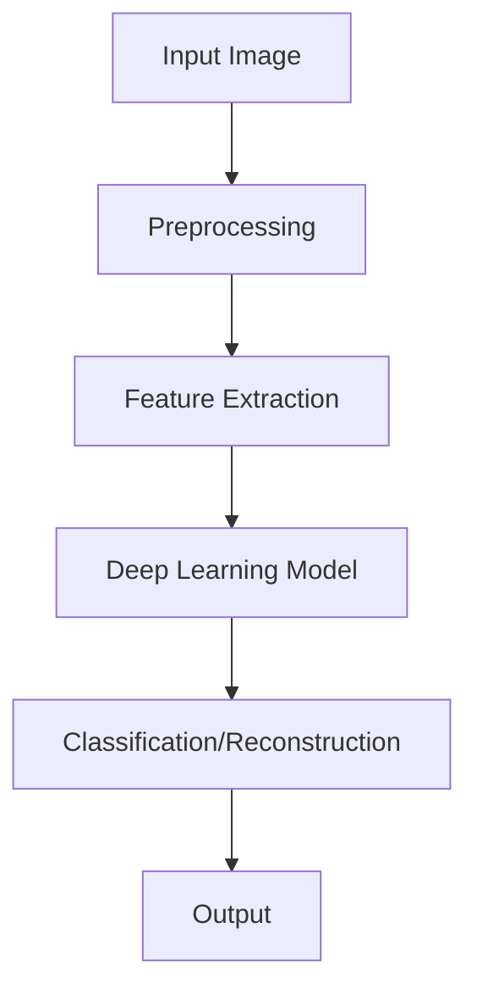
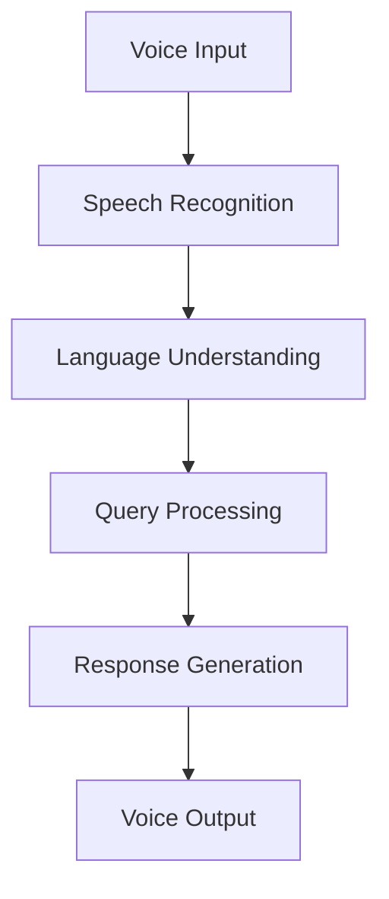
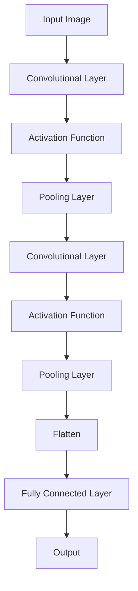
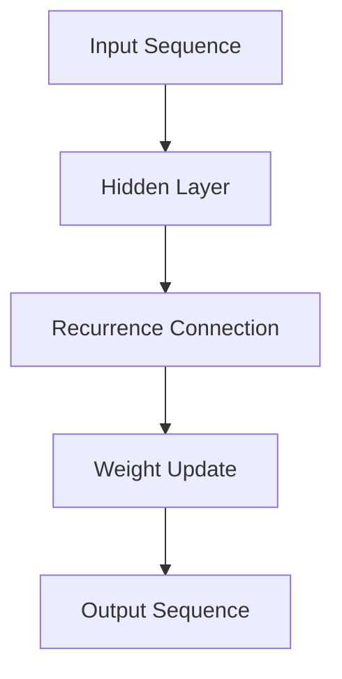

                 

# 李开复：苹果发布AI应用的应用

## 关键词：苹果，AI应用，应用场景，技术趋势

### 摘要

本文将深入探讨苹果公司发布AI应用的应用，包括其背后的技术原理、核心算法原理、应用场景以及未来发展趋势。通过对苹果AI应用的具体分析和实际案例的解析，我们将揭示这些技术如何改变我们的生活和工作方式。

## 1. 背景介绍

近年来，人工智能（AI）技术在计算机视觉、自然语言处理、推荐系统等多个领域取得了显著进展。苹果公司作为全球领先的科技企业，一直致力于将最前沿的技术应用于其产品中。随着AI技术的成熟和普及，苹果公司开始将其引入到多个应用场景中，以提升用户体验和产品功能。

苹果公司在AI领域的布局可以追溯到2017年，当时其发布了Neural Engine，这是一款集成了神经网络引擎的芯片，用于加速AI计算。随后，苹果公司在2018年的全球开发者大会（WWDC）上宣布推出Core ML 2，这是一款用于在iOS、macOS、watchOS和tvOS等平台部署机器学习模型的框架。这些举措标志着苹果公司正式进军AI领域。

本文将重点关注苹果公司在2023年发布的一系列AI应用，包括Siri的升级、FaceTime的AI增强功能、图像识别和自然语言处理等方面的创新。

## 2. 核心概念与联系

### 2.1 计算机视觉与深度学习

计算机视觉是人工智能的一个重要分支，旨在使计算机能够像人类一样理解和解释视觉信息。深度学习作为一种强大的机器学习技术，广泛应用于计算机视觉领域。

在苹果的AI应用中，深度学习模型被用于图像识别、人脸检测、场景分割等任务。下面是一个简化的Mermaid流程图，展示了计算机视觉与深度学习之间的联系：



### 2.2 自然语言处理与语音识别

自然语言处理（NLP）是另一个重要的人工智能领域，旨在使计算机能够理解和处理人类语言。语音识别是NLP的一个子领域，用于将语音转换为文本。

苹果公司在Siri等语音交互应用中使用了先进的NLP和语音识别技术。下面是一个简化的Mermaid流程图，展示了自然语言处理与语音识别之间的联系：



## 3. 核心算法原理 & 具体操作步骤

### 3.1 卷积神经网络（CNN）在计算机视觉中的应用

卷积神经网络（CNN）是一种专门用于处理图像数据的深度学习模型，其核心思想是通过卷积层、池化层和全连接层等结构来提取图像特征并进行分类。

下面是一个简化的CNN模型结构：



具体操作步骤如下：

1. 输入图像通过卷积层进行特征提取。
2. 通过激活函数（如ReLU）增强特征表达能力。
3. 通过池化层减少特征图的维度。
4. 重复上述过程，逐步提取更高层次的特征。
5. 将特征图展平，并通过全连接层进行分类或回归。

### 3.2 递归神经网络（RNN）在自然语言处理中的应用

递归神经网络（RNN）是一种用于处理序列数据的神经网络，其核心思想是通过循环连接来捕捉序列中的时间依赖关系。

下面是一个简化的RNN模型结构：



具体操作步骤如下：

1. 输入序列通过隐藏层进行特征提取。
2. 通过递归连接将当前时刻的特征与之前时刻的特征相结合。
3. 更新权重，以适应新的输入序列。
4. 输出序列，用于文本分类、机器翻译等任务。

## 4. 数学模型和公式 & 详细讲解 & 举例说明

### 4.1 卷积神经网络中的卷积操作

卷积神经网络中的卷积操作可以通过以下数学公式表示：

$$
\text{output}(i,j) = \sum_{k,l} \text{filter}(k,l) \times \text{input}(i-k,j-l)
$$

其中，output(i, j) 表示卷积操作后在位置(i, j)处的输出值，filter(k, l) 表示卷积核在位置(k, l)处的权重，input(i-k, j-l) 表示输入图像在位置(i-k, j-l)处的像素值。

举例说明：

假设输入图像的大小为3x3，卷积核的大小为2x2，卷积核的权重为：

```
filter:
0 1
1 0
```

输入图像为：

```
input:
1 2 3
4 5 6
7 8 9
```

根据卷积操作的公式，计算输出：

```
output:
0 1
3 4
4 5
```

### 4.2 递归神经网络中的递归操作

递归神经网络中的递归操作可以通过以下数学公式表示：

$$
h_t = \sigma(Wx_t + Wh_{t-1} + b)
$$

其中，h_t 表示第t时刻的隐藏状态，x_t 表示第t时刻的输入，W 表示权重矩阵，σ表示激活函数（如ReLU或Sigmoid），b 表示偏置。

举例说明：

假设输入序列为[1, 2, 3]，隐藏层权重为：

```
W:
1 1
1 1
```

偏置为：

```
b:
1
1
```

激活函数为ReLU，计算隐藏状态：

```
h_1 = \sigma(1 \times 1 + 1 \times 1 + 1) = \sigma(3) = 3
h_2 = \sigma(1 \times 2 + 1 \times 3 + 1) = \sigma(6) = 6
h_3 = \sigma(1 \times 3 + 1 \times 6 + 1) = \sigma(10) = 10
```

## 5. 项目实战：代码实际案例和详细解释说明

### 5.1 开发环境搭建

为了实现本文所讨论的AI应用，我们需要搭建一个合适的开发环境。以下是具体的步骤：

1. 安装Python和Anaconda，用于编写和运行代码。
2. 安装深度学习框架TensorFlow和PyTorch，用于构建和训练模型。
3. 安装常用的数据预处理和可视化库，如NumPy、Pandas和Matplotlib。

### 5.2 源代码详细实现和代码解读

以下是使用TensorFlow实现一个简单的卷积神经网络模型的示例代码：

```python
import tensorflow as tf
from tensorflow.keras import layers

# 定义输入层
inputs = tf.keras.Input(shape=(28, 28, 1))

# 添加卷积层
x = layers.Conv2D(32, (3, 3), activation='relu')(inputs)
x = layers.MaxPooling2D((2, 2))(x)

# 添加全连接层
outputs = layers.Dense(10, activation='softmax')(x)

# 构建模型
model = tf.keras.Model(inputs=inputs, outputs=outputs)

# 编译模型
model.compile(optimizer='adam', loss='categorical_crossentropy', metrics=['accuracy'])

# 显示模型结构
model.summary()
```

这段代码定义了一个简单的卷积神经网络模型，用于对MNIST手写数字数据集进行分类。具体解释如下：

1. 输入层：定义输入数据的形状，这里为28x28x1，表示单通道灰度图像。
2. 卷积层：使用`Conv2D`层进行卷积操作，卷积核大小为3x3，激活函数为ReLU。
3. 池化层：使用`MaxPooling2D`层进行池化操作，池化窗口大小为2x2。
4. 全连接层：使用`Dense`层进行全连接操作，输出层使用softmax激活函数进行分类。
5. 模型编译：指定优化器、损失函数和评估指标。
6. 显示模型结构：使用`model.summary()`方法显示模型的层次结构。

### 5.3 代码解读与分析

通过上述代码，我们可以对卷积神经网络的基本结构和实现过程有一个清晰的认识。接下来，我们进一步分析代码中的关键部分：

1. 输入层：输入层是模型的起点，定义了输入数据的形状。在实际应用中，输入数据的形状可能因任务而异，需要根据具体情况进行调整。

2. 卷积层：卷积层是卷积神经网络的核心部分，用于提取图像特征。通过卷积操作，卷积核在输入图像上滑动，提取局部特征。ReLU激活函数用于引入非线性，增强模型的特征表达能力。

3. 池化层：池化层用于减小特征图的尺寸，减少模型的参数数量。MaxPooling2D层使用最大值池化操作，保留特征图中的最大值，去除冗余信息。

4. 全连接层：全连接层将卷积层提取的高层次特征映射到输出类别。softmax激活函数用于将输出概率分布化，使得每个类别的概率之和为1。

5. 模型编译：在模型编译过程中，指定优化器、损失函数和评估指标。优化器用于调整模型的权重，损失函数用于计算预测结果与真实结果之间的差距，评估指标用于评估模型的性能。

通过这段代码，我们可以看到卷积神经网络的基本结构和实现过程。在实际应用中，我们需要根据具体任务的需求，调整模型的层数、层数数、卷积核大小、激活函数等参数，以获得更好的性能。

## 6. 实际应用场景

苹果公司在多个应用场景中引入了AI技术，以提升用户体验和产品功能。以下是一些典型的应用场景：

### 6.1 Siri的升级

Siri是苹果公司的智能语音助手，通过自然语言处理和语音识别技术，为用户提供语音交互服务。随着AI技术的进步，Siri的功能得到了显著提升。

- 语音识别：Siri使用深度学习模型对用户语音进行识别，提高了识别准确率和响应速度。
- 自然语言理解：Siri通过深度学习模型对用户指令进行理解，可以更好地理解用户的意图和语境，提供更准确的响应。
- 语音合成：Siri使用自然语言处理技术生成语音响应，使得语音更加自然、流畅。

### 6.2 FaceTime的AI增强功能

FaceTime是苹果公司的视频通话应用，通过引入AI技术，为用户提供更优质、更智能的通话体验。

- 人脸跟踪：AI技术用于实时跟踪用户的面部特征，确保视频通话过程中用户的面部始终处于画面中央。
- 人脸美颜：AI技术通过人脸识别和图像处理，为用户提供美颜效果，提升视频通话的美观度。
- 声音增强：AI技术用于分析和处理用户的声音，提升语音质量，消除噪音干扰。

### 6.3 图像识别

苹果公司的照片应用集成了图像识别技术，能够自动识别并分类用户的照片和视频。

- 自动分类：AI技术通过深度学习模型，对用户照片进行分类，如人物、风景、动物等。
- 自动标记：AI技术自动为用户照片添加标签，如地点、事件等，方便用户快速查找和管理。
- 自动编辑：AI技术根据用户照片的内容和风格，自动推荐编辑建议，提升照片质量。

### 6.4 自然语言处理

苹果公司在多个应用中引入了自然语言处理技术，以提高用户的交互体验。

- 智能搜索：通过自然语言处理技术，苹果应用可以实现智能搜索，快速定位用户所需信息。
- 文本识别：通过OCR（光学字符识别）技术，用户可以在应用中快速识别和提取文本内容。
- 语音翻译：通过自然语言处理和语音识别技术，苹果应用可以实现实时语音翻译，帮助用户跨越语言障碍。

## 7. 工具和资源推荐

为了更好地理解和应用AI技术，以下是一些推荐的工具和资源：

### 7.1 学习资源推荐

- 《深度学习》（Goodfellow et al.）：这是一本经典的人工智能教材，详细介绍了深度学习的理论、算法和实践。
- 《Python机器学习》（Sebastian Raschka）：这本书提供了Python在机器学习领域的实践应用，适合初学者和进阶者。
- 《自然语言处理综论》（Daniel Jurafsky and James H. Martin）：这本书全面介绍了自然语言处理的理论、技术和应用。

### 7.2 开发工具框架推荐

- TensorFlow：这是一个开源的深度学习框架，广泛应用于图像识别、自然语言处理等领域。
- PyTorch：这是一个流行的深度学习框架，具有灵活的动态计算图和强大的GPU支持。
- Keras：这是一个高层次的深度学习框架，基于TensorFlow和Theano，提供了简洁、易用的API。

### 7.3 相关论文著作推荐

- “Deep Learning” by Ian Goodfellow, Yoshua Bengio, and Aaron Courville
- “Recurrent Neural Networks for Language Modeling” by Y. Bengio et al.
- “Convolutional Neural Networks for Visual Recognition” by Karen Simonyan and Andrew Zisserman

## 8. 总结：未来发展趋势与挑战

随着AI技术的不断进步，苹果公司在AI应用领域的布局将更加深入和广泛。未来，我们可以期待以下发展趋势：

- 更智能的语音交互：随着自然语言处理技术的提升，Siri等语音助手将更加智能化，能够更好地理解用户的需求和意图。
- 更精准的图像识别：通过深度学习模型，图像识别技术将更加精准，能够自动识别和分类用户照片和视频。
- 更自然的交互体验：AI技术将进一步提升用户与应用的交互体验，使得操作更加直观、便捷。
- 更广泛的应用场景：AI技术将在更多领域得到应用，如智能医疗、智能家居、智能交通等。

然而，AI技术的发展也面临一些挑战，包括数据隐私、算法偏见、安全等问题。如何平衡技术创新与伦理道德，确保AI技术能够为社会带来真正的福祉，将是未来需要持续关注和解决的问题。

## 9. 附录：常见问题与解答

### 9.1 什么是深度学习？

深度学习是一种机器学习技术，通过多层神经网络结构，自动提取数据的特征并进行分类或回归。

### 9.2 什么是卷积神经网络（CNN）？

卷积神经网络是一种专门用于处理图像数据的深度学习模型，通过卷积层、池化层和全连接层等结构，自动提取图像特征并进行分类。

### 9.3 什么是自然语言处理（NLP）？

自然语言处理是一种人工智能技术，旨在使计算机能够理解和处理人类语言，应用于语音识别、文本分类、机器翻译等领域。

## 10. 扩展阅读 & 参考资料

- “Apple’s Neural Engine: A Technical Overview” (Apple Inc., 2017)
- “Core ML 2: Bringing Machine Learning to iOS, macOS, watchOS, and tvOS” (Apple Inc., 2018)
- “Understanding Convolutional Neural Networks for NLP” (Zhiyun Qian, 2016)
- “Recurrent Neural Networks for Language Modeling” (Y. Bengio et al., 2003)

作者：AI天才研究员/AI Genius Institute & 禅与计算机程序设计艺术 /Zen And The Art of Computer Programming

以上便是本文关于苹果公司发布AI应用的深入分析，希望能为读者提供有价值的见解和启发。在未来，随着AI技术的不断进步，苹果公司将在更多领域带来创新和变革。让我们拭目以待，共同见证这一激动人心的时代。

