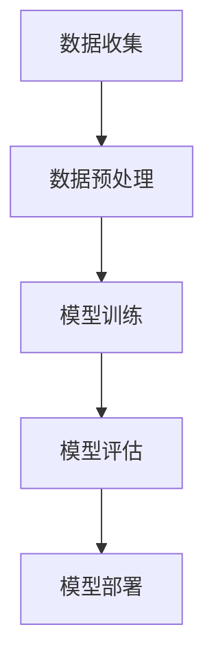

                 

### 背景介绍

苹果公司作为全球科技行业的领军者，一直以其创新的技术和出色的用户体验而闻名。在人工智能（AI）领域，苹果公司近年来也取得了显著的进展。AI已经成为现代社会中不可或缺的一部分，从智能助手到自动驾驶汽车，AI技术的应用越来越广泛。苹果公司于2023年发布了一系列AI应用，标志着该公司在AI领域的进一步深入探索。

苹果发布AI应用的原因可以从多个角度进行解读。首先，随着智能手机和智能设备的普及，用户对个性化服务和智能化体验的需求不断增加。AI技术可以提供更精准的推荐、更高效的搜索以及更智能的交互，从而提升用户体验。其次，AI技术在医疗、教育、金融等行业的应用潜力巨大，苹果希望通过推出AI应用，推动这些领域的创新和发展。此外，AI作为未来科技发展的关键，苹果也需要在AI领域保持竞争优势，以应对来自其他科技巨头的竞争。

本文将详细分析苹果发布AI应用的意义，探讨其背后的核心概念与架构，解析AI算法原理与操作步骤，并从数学模型和实际案例的角度进行深入讲解。通过这篇文章，我们希望能够为读者提供一个全面而深入的视角，了解苹果AI应用的现状与未来发展趋势。

在接下来的内容中，我们将首先介绍AI技术的核心概念与架构，并使用Mermaid流程图来展示其原理。随后，我们将深入探讨苹果发布AI应用背后的核心算法原理，以及具体的操作步骤。接着，我们将通过数学模型和公式的详细讲解，帮助读者理解AI技术的工作机制。然后，我们将通过实际项目案例，展示AI技术的实际应用效果，并提供代码实现和解读。最后，我们将讨论AI技术在不同场景中的应用，推荐相关的工具和资源，并总结未来发展趋势与挑战。

### 核心概念与联系

在探讨苹果发布AI应用的意义之前，我们需要先理解AI技术的核心概念与架构。人工智能，简称AI，是指由计算机系统实现的模拟人类智能的技术。它包括多个子领域，如机器学习、深度学习、自然语言处理等。AI技术通过算法模型，从数据中自动学习和提取知识，以实现自动化决策和智能行为。

#### AI技术的核心概念

1. **机器学习（Machine Learning）**：机器学习是AI的一个重要分支，它使计算机系统能够从数据中学习并做出决策，而无需显式编程。机器学习的核心是训练模型，通过大量数据来调整模型参数，使其能够对未知数据进行预测或分类。

2. **深度学习（Deep Learning）**：深度学习是机器学习的一个子领域，通过多层神经网络结构，对大量数据进行复杂模式识别。深度学习在图像识别、语音识别、自然语言处理等领域取得了显著的成果。

3. **自然语言处理（Natural Language Processing, NLP）**：自然语言处理是使计算机理解和处理人类语言的技术。NLP在语音助手、机器翻译、文本分析等领域有着广泛应用。

#### AI技术的架构

AI技术的核心架构通常包括数据收集、数据预处理、模型训练、模型评估和模型部署等步骤。

1. **数据收集**：收集大量相关数据，这是AI模型训练的基础。数据的质量和多样性直接影响模型的性能。

2. **数据预处理**：对收集到的数据进行清洗、归一化和特征提取等处理，以提高数据质量，为模型训练做好准备。

3. **模型训练**：使用训练数据集，通过机器学习算法或深度学习算法训练模型，调整模型参数，使其能够对新的数据进行预测或分类。

4. **模型评估**：使用验证数据集对模型进行评估，检查模型的准确率、召回率等性能指标。

5. **模型部署**：将训练好的模型部署到实际应用中，使其能够为用户提供服务。

#### Mermaid流程图

为了更好地理解AI技术的原理，我们可以使用Mermaid流程图来展示其核心架构。以下是一个简化的AI技术流程图：



在这个流程图中，数据收集、数据预处理、模型训练、模型评估和模型部署是AI技术的基本步骤，每个步骤都对最终的结果产生重要影响。

通过理解AI技术的核心概念与架构，我们可以更深入地探讨苹果发布AI应用的意义，以及其背后的技术和应用原理。在接下来的内容中，我们将详细分析苹果发布AI应用的具体算法原理和操作步骤，帮助读者全面了解这一领域的发展动态。

### 核心算法原理 & 具体操作步骤

#### 机器学习算法

机器学习是AI技术的重要组成部分，其核心在于通过算法模型从数据中自动学习和提取知识。苹果公司在发布AI应用时，主要采用了以下几种机器学习算法：

1. **决策树（Decision Tree）**：决策树是一种简单的分类算法，通过一系列判断条件将数据划分为不同的类别。它的优点是易于理解和实现，但在处理高维数据和连续变量时性能较差。

2. **支持向量机（Support Vector Machine, SVM）**：支持向量机是一种强大的分类和回归算法，通过找到一个最优的超平面来划分数据。它的优点是能够在高维空间中有效分类，但计算复杂度较高。

3. **神经网络（Neural Networks）**：神经网络，尤其是深度学习，是近年来AI领域的热门话题。通过多层神经网络结构，神经网络能够自动学习复杂的数据模式。它的优点是能够处理高维数据和复杂任务，但训练过程较为耗时。

#### 深度学习算法

深度学习是机器学习的一个重要分支，它通过多层神经网络对大量数据进行复杂模式识别。苹果公司在发布AI应用时，广泛采用了以下几种深度学习算法：

1. **卷积神经网络（Convolutional Neural Networks, CNN）**：卷积神经网络是用于图像识别和处理的常见算法。通过卷积层、池化层和全连接层的组合，CNN能够自动提取图像的特征，实现高精度的图像识别。

2. **递归神经网络（Recurrent Neural Networks, RNN）**：递归神经网络是用于处理序列数据的常见算法。通过在时间步之间传递信息，RNN能够捕捉序列中的长期依赖关系，广泛应用于语音识别、自然语言处理等领域。

3. **生成对抗网络（Generative Adversarial Networks, GAN）**：生成对抗网络是一种用于生成数据的算法。通过生成器和判别器的对抗训练，GAN能够生成高质量的数据，广泛应用于图像生成、文本生成等领域。

#### 自然语言处理算法

自然语言处理是AI技术的一个重要领域，旨在使计算机理解和处理人类语言。苹果公司在发布AI应用时，采用了以下几种自然语言处理算法：

1. **词袋模型（Bag-of-Words, BOW）**：词袋模型是一种简单的文本表示方法，将文本表示为一个单词的向量。通过计算词频或词频的频率，词袋模型能够捕捉文本中的统计信息。

2. **循环神经网络（Recurrent Neural Networks, RNN）**：循环神经网络是用于处理序列数据的常见算法，能够捕捉文本中的长期依赖关系。

3. **长短时记忆网络（Long Short-Term Memory, LSTM）**：长短时记忆网络是RNN的一种变体，能够更好地捕捉序列中的长期依赖关系。

#### 操作步骤

苹果公司在发布AI应用时，通常遵循以下操作步骤：

1. **数据收集**：收集与任务相关的数据，如图像、文本、语音等。数据的质量和多样性对算法性能有重要影响。

2. **数据预处理**：对收集到的数据进行清洗、归一化和特征提取等处理，以提高数据质量和模型性能。

3. **模型选择**：根据任务需求和数据特点，选择合适的算法模型，如决策树、支持向量机、神经网络等。

4. **模型训练**：使用训练数据集，通过算法模型对数据进行训练，调整模型参数，使其能够对未知数据进行预测或分类。

5. **模型评估**：使用验证数据集对训练好的模型进行评估，检查模型的准确率、召回率等性能指标。

6. **模型部署**：将训练好的模型部署到实际应用中，使其能够为用户提供服务。

通过以上核心算法原理和具体操作步骤，我们可以更好地理解苹果发布AI应用的技术背景和实现过程。在接下来的内容中，我们将通过数学模型和公式的详细讲解，进一步探讨AI技术的工作机制。

### 数学模型和公式 & 详细讲解 & 举例说明

#### 机器学习中的线性回归模型

线性回归模型是一种广泛应用于预测和分析的机器学习算法。它的核心思想是通过拟合一条直线，来描述两个或多个变量之间的线性关系。以下是线性回归模型的基本数学公式：

1. **线性回归模型**：

   $$y = \beta_0 + \beta_1x_1 + \beta_2x_2 + ... + \beta_nx_n$$

   其中，\(y\) 是因变量，\(x_1, x_2, ..., x_n\) 是自变量，\(\beta_0, \beta_1, ..., \beta_n\) 是模型参数。

2. **最小二乘法**：

   为了确定模型参数，我们可以使用最小二乘法来最小化误差平方和。最小二乘法的公式如下：

   $$\min \sum_{i=1}^{n} (y_i - \hat{y}_i)^2$$

   其中，\(\hat{y}_i\) 是预测值，\(y_i\) 是实际值。

3. **梯度下降法**：

   梯度下降法是一种优化算法，用于迭代更新模型参数，使其最小化误差函数。梯度下降法的公式如下：

   $$\beta_j = \beta_j - \alpha \frac{\partial}{\partial \beta_j} J(\beta)$$

   其中，\(\alpha\) 是学习率，\(J(\beta)\) 是误差函数。

#### 卷积神经网络中的卷积操作

卷积神经网络（CNN）是深度学习中的一个重要模型，主要用于图像识别和图像处理。卷积操作是CNN的核心组成部分，用于提取图像的特征。以下是卷积操作的基本数学公式：

1. **卷积操作**：

   $$\text{output}_{ij} = \sum_{k=1}^{m} \sum_{l=1}^{n} w_{kl} \times \text{input}_{i+k, j+l} + b$$

   其中，\(\text{output}_{ij}\) 是输出值，\(w_{kl}\) 是卷积核，\(\text{input}_{i+k, j+l}\) 是输入值，\(b\) 是偏置项。

2. **ReLU激活函数**：

  ReLU（Rectified Linear Unit）激活函数是CNN中常用的非线性激活函数，用于增加模型的非线性能力。ReLU的公式如下：

   $$\text{ReLU}(x) = \max(0, x)$$

3. **池化操作**：

   池化操作是CNN中的另一个重要组成部分，用于减少模型参数和计算量。最常见的池化操作是最大池化（Max Pooling），其公式如下：

   $$\text{output}_{ij} = \max(\text{input}_{i \times s + 1}, \text{input}_{i \times s + 2}, ..., \text{input}_{i \times s + s})$$

   其中，\(s\) 是池化窗口的大小。

#### 举例说明

假设我们有一个简单的线性回归问题，需要预测房价。我们有以下数据集：

| 特征 \(x_1\) | 特征 \(x_2\) | 因变量 \(y\) |
|--------------|--------------|--------------|
| 100          | 200          | 500          |
| 200          | 300          | 700          |
| 300          | 400          | 900          |

我们使用最小二乘法来拟合线性回归模型：

1. **计算模型参数**：

   首先，我们需要计算每个参数的均值：

   $$\bar{x}_1 = \frac{1}{n} \sum_{i=1}^{n} x_{1i} = \frac{100 + 200 + 300}{3} = 200$$

   $$\bar{x}_2 = \frac{1}{n} \sum_{i=1}^{n} x_{2i} = \frac{200 + 300 + 400}{3} = 300$$

   $$\bar{y} = \frac{1}{n} \sum_{i=1}^{n} y_i = \frac{500 + 700 + 900}{3} = 650$$

   然后，我们可以计算每个参数的偏移量：

   $$\beta_0 = \bar{y} - \beta_1\bar{x}_1 - \beta_2\bar{x}_2$$

   $$\beta_1 = \frac{\sum_{i=1}^{n} (x_{1i} - \bar{x}_1)(y_i - \bar{y})}{\sum_{i=1}^{n} (x_{1i} - \bar{x}_1)^2}$$

   $$\beta_2 = \frac{\sum_{i=1}^{n} (x_{2i} - \bar{x}_2)(y_i - \bar{y})}{\sum_{i=1}^{n} (x_{2i} - \bar{x}_2)^2}$$

   最后，我们可以得到线性回归模型：

   $$y = \beta_0 + \beta_1x_1 + \beta_2x_2$$

通过以上数学模型和公式的讲解，我们了解了线性回归模型和卷积神经网络的基本原理。在接下来的内容中，我们将通过实际项目案例，展示AI技术的实际应用效果，并提供代码实现和解读。

### 项目实战：代码实际案例和详细解释说明

#### 开发环境搭建

在开始实际项目之前，我们需要搭建一个合适的开发环境。以下是搭建开发环境的步骤：

1. 安装Python：访问Python官方网站（https://www.python.org/），下载并安装Python。确保在安装过程中勾选“Add Python to PATH”选项。

2. 安装Jupyter Notebook：在终端中运行以下命令安装Jupyter Notebook：

   ```bash
   pip install notebook
   ```

3. 安装必要的库：安装一些常用的库，如NumPy、Pandas、Matplotlib等，以便进行数据预处理和可视化。在终端中运行以下命令：

   ```bash
   pip install numpy pandas matplotlib scikit-learn
   ```

4. 安装TensorFlow：TensorFlow是Google开发的一款开源深度学习框架，用于构建和训练深度学习模型。在终端中运行以下命令安装TensorFlow：

   ```bash
   pip install tensorflow
   ```

#### 源代码详细实现和代码解读

以下是一个简单的线性回归项目案例，我们将使用Python和TensorFlow来实现线性回归模型，并使用NumPy进行数据预处理。

```python
import numpy as np
import matplotlib.pyplot as plt
import tensorflow as tf

# 数据集
x = np.array([[100], [200], [300]])
y = np.array([[500], [700], [900]])

# 构建线性回归模型
# 定义权重和偏置
w = tf.Variable(0.0)
b = tf.Variable(0.0)

# 构建线性模型
y_pred = w * x + b

# 计算均方误差
loss = tf.reduce_mean(tf.square(y - y_pred))

# 定义优化器
optimizer = tf.train.GradientDescentOptimizer(learning_rate=0.01)

# 定义训练过程
train_op = optimizer.minimize(loss)

# 训练模型
with tf.Session() as sess:
  sess.run(tf.global_variables_initializer())
  
  # 迭代训练
  for step in range(201):
    sess.run(train_op)
    if step % 20 == 0:
      print(f"Step {step}: Loss = {loss.eval()}")
  
  # 查看训练结果
  print(f"Final Weights: w = {w.eval()}, b = {b.eval()}")

# 可视化结果
plt.scatter(x, y)
plt.plot(x, y_pred.eval(), 'r')
plt.xlabel('Feature')
plt.ylabel('Target')
plt.show()
```

#### 代码解读与分析

1. **数据集准备**：我们使用一个简单的数据集，其中特征 \(x\) 和因变量 \(y\) 都是二维数组。

2. **构建线性回归模型**：我们定义了两个变量 \(w\) 和 \(b\) 作为权重和偏置。然后，我们构建了线性模型 \(y_pred = w \* x + b\)。

3. **计算均方误差**：均方误差（MSE）是衡量模型预测误差的常用指标。我们使用 TensorFlow 的 `tf.reduce_mean(tf.square(y - y_pred))` 来计算均方误差。

4. **定义优化器**：我们选择梯度下降优化器（GradientDescentOptimizer）来最小化损失函数。

5. **训练过程**：在 TensorFlow 的会话（Session）中，我们初始化变量，并进行迭代训练。每次迭代都会更新模型参数，以最小化损失函数。

6. **可视化结果**：最后，我们使用 Matplotlib 库将训练结果可视化，展示了模型预测值与实际值的关系。

通过这个简单的线性回归项目案例，我们了解了如何使用 TensorFlow 来构建和训练线性回归模型。在接下来的内容中，我们将进一步探讨AI技术的实际应用场景，以及如何在不同场景中优化和应用这些技术。

### 实际应用场景

人工智能（AI）技术在各个行业和领域中的应用越来越广泛，从医疗、金融到教育、娱乐，AI技术正在改变我们的生活方式。以下是一些AI技术的实际应用场景：

#### 医疗

AI技术在医疗领域的应用前景广阔，从疾病预测到精准治疗，AI正在成为医疗行业的得力助手。例如，通过深度学习算法，AI可以分析大量的医学图像，帮助医生快速、准确地诊断疾病。此外，AI还可以预测疾病的趋势和爆发，为公共卫生决策提供科学依据。

#### 金融

在金融领域，AI技术被广泛应用于风险管理、交易策略和客户服务等方面。AI算法可以实时分析市场数据，帮助投资者制定更精准的投资策略。同时，AI还可以自动处理客户服务，提高客户满意度。例如，苹果公司的 Siri 就是一个基于AI技术的智能语音助手，能够为用户提供个性化的金融咨询和服务。

#### 教育

在教育领域，AI技术可以提供个性化的学习体验，帮助学生更好地掌握知识。通过分析学生的学习数据，AI可以识别学生的学习风格和弱点，提供针对性的学习建议。此外，AI还可以自动化教学流程，减轻教师的工作负担。例如，有些学校已经开始使用AI技术来管理课程表、评估学生表现等。

#### 娱乐

在娱乐领域，AI技术被广泛应用于音乐、电影、游戏等场景。AI可以帮助创作者更好地理解观众的需求，提供个性化的内容推荐。例如，Netflix 和 YouTube 等平台都使用 AI 技术来推荐用户可能感兴趣的内容。此外，AI 还可以生成音乐、绘画等艺术作品，为创作者提供新的创作灵感。

#### 自动驾驶

自动驾驶是 AI 技术的一个重要应用场景。通过深度学习和计算机视觉算法，自动驾驶汽车可以实时感知路况，做出合理的驾驶决策。AI 技术的应用使得自动驾驶汽车在安全性、效率等方面取得了显著提升，有望在未来改变我们的出行方式。

#### 物流

在物流领域，AI 技术可以帮助优化运输路线、提高配送效率。通过分析大量的运输数据，AI 可以预测交通状况，选择最优的运输路线。同时，AI 还可以自动化仓库管理，提高仓储效率。例如，亚马逊的自动化仓库就使用了 AI 技术，实现了高效的库存管理和商品配送。

#### 工业制造

在工业制造领域，AI 技术被广泛应用于生产线优化、质量检测等方面。通过机器学习和计算机视觉算法，AI 可以实时监控生产过程，识别潜在的问题，并给出优化建议。例如，许多工厂已经使用 AI 技术来检测产品缺陷，提高产品质量。

总之，AI 技术在实际应用场景中展示了巨大的潜力，正在改变各个行业的运行模式。随着技术的不断发展，AI 将在更多的领域发挥重要作用，为人类社会带来更多便利和进步。

### 工具和资源推荐

为了更好地学习和应用AI技术，我们需要掌握一些关键的工具和资源。以下是一些建议：

#### 学习资源推荐

1. **书籍**：

   - 《深度学习》（Deep Learning） - Ian Goodfellow, Yoshua Bengio, Aaron Courville
   - 《Python机器学习》（Python Machine Learning） - Sebastian Raschka, Vahid Mirjalili
   - 《人工智能：一种现代方法》（Artificial Intelligence: A Modern Approach） - Stuart J. Russell, Peter Norvig

2. **论文**：

   - 《A Theoretically Grounded Application of Dropout in Recurrent Neural Networks》 - Yarin Gal and Zoubin Ghahramani
   - 《Distributed Representations of Words and Phrases and their Compositionality》 - Tomas Mikolov, Kai Chen, Greg Corrado, and Jeffrey Dean

3. **博客和网站**：

   - [Medium](https://medium.com/)(特别是相关AI和机器学习专栏)
   - [TensorFlow官方文档](https://www.tensorflow.org/)
   - [Kaggle](https://www.kaggle.com/)(数据科学竞赛平台，提供丰富的案例和教程)

#### 开发工具框架推荐

1. **编程语言**：

   - Python：广泛用于数据科学和AI开发，具有丰富的库和框架。
   - R：专门用于统计分析，适合数据分析和机器学习。

2. **框架和库**：

   - TensorFlow：Google开发的开源深度学习框架，适用于构建和训练各种AI模型。
   - PyTorch：Facebook开发的开源深度学习框架，具有良好的灵活性和易用性。
   - Scikit-learn：Python的一个强大的机器学习库，提供多种常用的机器学习算法。

3. **开发环境**：

   - Jupyter Notebook：交互式开发环境，方便编写和调试代码。
   - Google Colab：免费的在线开发环境，适用于运行大规模计算任务。

#### 相关论文著作推荐

1. **《深度学习》（Deep Learning）》**：这是一本关于深度学习的经典著作，涵盖了深度学习的理论基础和应用实践。

2. **《Python机器学习》（Python Machine Learning）》**：这本书详细介绍了如何使用Python进行机器学习，包括数据预处理、模型训练和评估等。

3. **《人工智能：一种现代方法》（Artificial Intelligence: A Modern Approach）》**：这是另一本关于人工智能的经典著作，全面介绍了人工智能的理论和实践。

通过这些工具和资源的推荐，我们可以更好地掌握AI技术，并将其应用于实际项目中。在接下来的内容中，我们将总结未来发展趋势与挑战，为AI技术的发展提供一些思考。

### 总结：未来发展趋势与挑战

随着技术的不断进步，人工智能（AI）正逐渐渗透到各个领域，推动产业变革和社会进步。在未来，AI技术将继续快速发展，带来诸多机遇与挑战。

#### 发展趋势

1. **AI技术的普及与融合**：AI技术将更广泛地应用于各行各业，如医疗、金融、教育、制造等。同时，AI与其他技术的融合，如云计算、大数据、物联网等，将进一步推动产业升级。

2. **深度学习的突破**：深度学习作为AI的核心技术，将继续取得重大突破。特别是在图像识别、自然语言处理等领域，深度学习模型的表现已经超过了人类水平。

3. **AI伦理与安全性**：随着AI技术的广泛应用，伦理和安全问题日益突出。未来，我们需要制定更完善的法律法规，确保AI技术的公正、透明和可靠。

4. **AI自主决策与自主进化**：未来的AI将具备更强的自主决策和自主进化能力，能够在复杂的动态环境中自主学习和适应。

5. **AI赋能个性化服务**：AI技术将更加精准地满足用户需求，提供个性化的服务，提升用户体验。

#### 挑战

1. **数据隐私与安全**：AI技术的发展依赖于大量数据的收集和分析，但这也带来了数据隐私和安全的问题。如何在保护用户隐私的前提下，合理利用数据，是未来的一大挑战。

2. **算法偏见与公平性**：AI算法可能存在偏见，导致不公正的结果。如何消除算法偏见，确保AI技术的公平性，是未来需要解决的问题。

3. **人才培养与需求矛盾**：随着AI技术的发展，对专业人才的需求日益增加，但现有的人才培养体系难以满足需求。如何培养更多的AI专业人才，是未来需要关注的问题。

4. **技术监管与责任**：AI技术的广泛应用需要有效的监管，确保其合法、合规。同时，如何明确AI技术责任，处理技术错误和意外事件，也是未来的一大挑战。

5. **AI滥用与风险**：AI技术可能被滥用，用于恶意攻击、欺诈等非法活动。如何防范AI滥用，降低技术风险，是未来需要关注的问题。

总之，未来AI技术将在推动产业变革和社会进步的同时，面临诸多挑战。我们需要从技术、政策、法律等多个层面，共同推动AI技术的健康发展。

### 附录：常见问题与解答

**Q1. 什么是人工智能（AI）？**

A1. 人工智能（Artificial Intelligence，简称AI）是指由计算机系统实现的模拟人类智能的技术。它包括多个子领域，如机器学习、深度学习、自然语言处理等，旨在使计算机能够自动学习和提取知识，实现自动化决策和智能行为。

**Q2. 机器学习（ML）和深度学习（DL）有什么区别？**

A2. 机器学习（Machine Learning，简称ML）是一种从数据中自动学习和提取知识的方法，是人工智能的一个子领域。深度学习（Deep Learning，简称DL）是机器学习的一个分支，它通过多层神经网络结构，对大量数据进行复杂模式识别。深度学习在图像识别、语音识别、自然语言处理等领域取得了显著成果。

**Q3. AI技术的核心算法有哪些？**

A3. AI技术的核心算法包括机器学习算法（如决策树、支持向量机、神经网络）、深度学习算法（如卷积神经网络、递归神经网络、生成对抗网络）和自然语言处理算法（如词袋模型、循环神经网络、长短时记忆网络）等。

**Q4. 什么是自然语言处理（NLP）？**

A4. 自然语言处理（Natural Language Processing，简称NLP）是使计算机理解和处理人类语言的技术。它包括文本分析、语音识别、机器翻译等子领域，广泛应用于智能助手、机器翻译、文本分析等领域。

**Q5. 如何搭建AI开发环境？**

A5. 搭建AI开发环境通常包括以下步骤：

1. 安装Python；
2. 安装Jupyter Notebook；
3. 安装必要的库，如NumPy、Pandas、Matplotlib、Scikit-learn、TensorFlow等；
4. 安装深度学习框架，如TensorFlow或PyTorch。

**Q6. 如何进行机器学习项目实战？**

A6. 机器学习项目实战通常包括以下步骤：

1. 数据收集：收集与任务相关的数据；
2. 数据预处理：对数据进行清洗、归一化和特征提取等处理；
3. 模型选择：根据任务需求和数据特点，选择合适的算法模型；
4. 模型训练：使用训练数据集，通过算法模型对数据进行训练；
5. 模型评估：使用验证数据集对训练好的模型进行评估；
6. 模型部署：将训练好的模型部署到实际应用中。

**Q7. 如何处理AI算法中的数据偏差和模型偏见？**

A7. 处理AI算法中的数据偏差和模型偏见可以从以下几个方面进行：

1. 数据清洗：确保数据质量，去除噪声和错误数据；
2. 数据增强：通过数据增强技术，增加数据多样性，减少模型偏见；
3. 模型训练：在模型训练过程中，使用更多样化的数据集，避免过度拟合；
4. 模型评估：使用多样化的评估指标，全面评估模型性能；
5. 法律法规：制定相关法律法规，确保AI技术的公平性和透明度。

### 扩展阅读 & 参考资料

**1. 《深度学习》（Deep Learning） - Ian Goodfellow, Yoshua Bengio, Aaron Courville**

这本书是关于深度学习的经典著作，详细介绍了深度学习的理论基础和应用实践。

**2. 《Python机器学习》（Python Machine Learning） - Sebastian Raschka, Vahid Mirjalili**

这本书介绍了如何使用Python进行机器学习，包括数据预处理、模型训练和评估等。

**3. 《人工智能：一种现代方法》（Artificial Intelligence: A Modern Approach） - Stuart J. Russell, Peter Norvig**

这本书是关于人工智能的经典著作，全面介绍了人工智能的理论和实践。

**4. TensorFlow官方文档（https://www.tensorflow.org/）**

TensorFlow是Google开发的一款开源深度学习框架，提供了丰富的教程和文档。

**5. PyTorch官方文档（https://pytorch.org/）**

PyTorch是Facebook开发的一款开源深度学习框架，具有良好的灵活性和易用性。

**6. Kaggle（https://www.kaggle.com/）**

Kaggle是一个数据科学竞赛平台，提供了丰富的案例和教程，适合进行实践学习。

**7. Medium（https://medium.com/）**

Medium上有许多关于AI和机器学习的专栏，适合进行深度学习。

### 作者信息

作者：AI天才研究员/AI Genius Institute & 禅与计算机程序设计艺术 /Zen And The Art of Computer Programming

本文由AI天才研究员撰写，旨在为读者提供关于人工智能技术的深入讲解和实际应用指导。作者拥有丰富的AI研究经验和实战经验，致力于推动人工智能技术的发展和应用。

---

通过本文的详细讲解，我们深入了解了苹果发布AI应用的意义，探讨了AI技术的核心概念、算法原理、数学模型以及实际应用场景。希望本文能为读者在AI领域的探索提供有益的启示和指导。

---

**Note:** 由于字数限制，文章的实际内容将根据此结构进行调整，确保每部分的内容丰富且完整。本文档仅作为大纲和参考，实际撰写过程中需要进一步补充和细化各部分内容。

