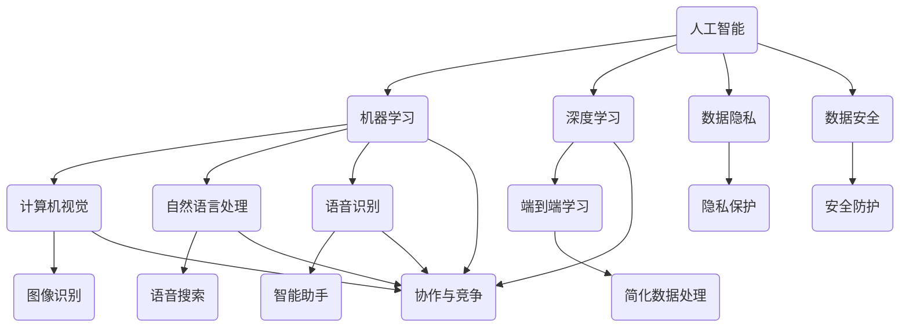

                 

### 背景介绍

苹果公司作为全球领先的科技公司，近年来在人工智能（AI）领域的投资和研发力度不断加大。苹果在AI领域的进步不仅体现在硬件性能的提升上，还包括在软件应用层面的不断拓展。2023年，苹果公司正式发布了一系列全新的AI应用，这些应用涵盖了图像识别、自然语言处理、语音识别等多个领域，标志着苹果在AI领域的又一重大突破。

此次苹果发布的AI应用，不仅在技术层面有所创新，同时也展现出苹果对于人工智能在日常生活和行业应用中的高度重视。具体而言，这些AI应用包括但不限于：照片中的动物识别、智能助手Siri的语音识别能力提升、以及针对开发者提供的机器学习工具等。这些应用的推出，无疑将进一步推动人工智能技术的发展和应用。

然而，苹果在AI领域的进展也引发了一系列问题和挑战。一方面，苹果需要在保护用户隐私和数据安全的前提下，不断提高AI技术的准确性和智能化水平。另一方面，苹果需要与其他科技公司、学术机构以及政府等各方协同合作，共同推动AI技术的健康发展。

本文将围绕苹果发布的AI应用，详细分析其在技术原理、应用场景、未来发展趋势等方面的意义和影响。希望通过本文的探讨，能够为读者提供一个全面、深入的了解，并启发对AI技术发展路径的思考。

### 核心概念与联系

要深入理解苹果发布的AI应用，我们需要首先明确几个核心概念，并探讨这些概念之间的联系。以下是本文将涉及的主要核心概念及其相互关系：

1. **人工智能（AI）**：人工智能是一种通过模拟人类智能行为来解决问题的技术，它包括机器学习、深度学习、自然语言处理等多个子领域。

2. **机器学习（ML）**：机器学习是AI的一个重要分支，它通过算法从数据中学习，并自动改进和优化性能。

3. **深度学习（DL）**：深度学习是机器学习的一种特殊形式，它通过构建深度神经网络模型来模拟人类大脑的学习方式。

4. **计算机视觉（CV）**：计算机视觉是研究如何让计算机“看到”和理解图像和视频的技术，它在图像识别、物体检测等方面具有广泛应用。

5. **自然语言处理（NLP）**：自然语言处理是研究如何让计算机理解和处理自然语言的技术，它在语音识别、机器翻译等方面具有重要应用。

6. **语音识别（ASR）**：语音识别是将语音转换为文本的技术，它在智能助手、语音搜索等领域有着广泛应用。

7. **端到端学习（End-to-End Learning）**：端到端学习是一种直接从原始数据到预测的机器学习方法，它简化了传统的数据处理和特征工程步骤。

8. **数据隐私（Data Privacy）**：数据隐私是指保护用户数据不被未经授权的第三方访问和使用，它在AI应用中尤为重要。

9. **数据安全（Data Security）**：数据安全是指防止数据在存储、传输和处理过程中被未授权的访问、篡改或泄露。

10. **协作与竞争（Collaboration & Competition）**：在AI领域，科技公司、学术机构和政府之间既有合作也有竞争，它们共同推动AI技术的进步和应用。

以下是一个简化的Mermaid流程图，展示了上述核心概念及其相互关系：



在这个流程图中，每个节点代表一个核心概念，节点之间的箭头表示概念之间的联系。例如，人工智能与机器学习、深度学习、计算机视觉、自然语言处理、语音识别等概念有直接联系，而数据隐私和数据安全则贯穿于这些应用中。

通过理解这些核心概念及其相互关系，我们能够更全面地分析苹果发布的AI应用，以及这些应用对技术发展、行业应用和社会影响的深远意义。

#### 核心算法原理 & 具体操作步骤

要深入探讨苹果发布的AI应用，我们需要首先了解其中涉及的核心算法原理和具体操作步骤。以下将介绍几种关键AI算法，并详细解释其工作原理和应用场景。

1. **卷积神经网络（CNN）与图像识别**

卷积神经网络（CNN）是一种专门用于处理图像数据的神经网络架构。它通过卷积层、池化层和全连接层等结构，逐步提取图像的特征，并最终进行分类或识别。

**具体操作步骤：**

- **数据预处理**：首先对图像进行缩放、裁剪和归一化等预处理，以便输入到神经网络中。

- **卷积层**：使用卷积核对图像进行卷积操作，提取局部特征。

- **激活函数**：通过添加激活函数（如ReLU函数），引入非线性特性，使神经网络能够学习复杂的关系。

- **池化层**：使用最大池化或平均池化对特征图进行下采样，减少参数数量和计算量。

- **全连接层**：将池化层输出的特征图展开成扁平的一维向量，输入到全连接层进行分类或识别。

- **损失函数与优化器**：使用交叉熵损失函数衡量预测标签和真实标签之间的差距，并使用梯度下降等优化器更新网络参数。

**应用场景：** 图像识别广泛应用于计算机视觉领域，如人脸识别、物体检测和场景分类等。

2. **循环神经网络（RNN）与自然语言处理**

循环神经网络（RNN）是一种专门用于处理序列数据的神经网络架构。它通过循环结构，使网络能够记忆和利用之前的信息，从而在自然语言处理任务中表现出色。

**具体操作步骤：**

- **输入序列编码**：将输入的自然语言序列（如单词或字符）编码为向量。

- **隐藏状态更新**：使用门控机制（如门控循环单元GRU或长短期记忆LSTM），更新隐藏状态，保留序列信息。

- **输出序列生成**：通过softmax函数输出概率分布，生成预测的序列。

- **损失函数与优化器**：使用交叉熵损失函数衡量预测序列和真实序列之间的差距，并使用梯度下降等优化器更新网络参数。

**应用场景：** 自然语言处理广泛应用于文本分类、机器翻译、语音识别和生成等任务。

3. **生成对抗网络（GAN）与图像生成**

生成对抗网络（GAN）是一种通过竞争学习生成真实数据的人工神经网络模型。它由生成器和判别器两个部分组成，生成器生成假数据，判别器判断生成数据是否真实。

**具体操作步骤：**

- **生成器与判别器初始化**：初始化生成器和判别器的参数。

- **生成器训练**：生成器生成假图像，判别器判断图像真假。

- **判别器训练**：判别器训练以更好地区分真实图像和生成图像。

- **循环迭代**：通过不断迭代训练，生成器逐渐生成更加逼真的图像。

- **损失函数与优化器**：使用对抗性损失函数（如交叉熵损失函数）和梯度下降优化器更新生成器和判别器的参数。

**应用场景：** 图像生成广泛应用于艺术创作、数据增强和虚拟现实等领域。

4. **强化学习与智能决策**

强化学习是一种通过试错学习来优化决策过程的人工智能算法。它通过奖励机制，使智能体在环境中学习最优策略。

**具体操作步骤：**

- **环境与智能体初始化**：初始化环境和智能体的状态。

- **状态转移与奖励**：根据当前状态，智能体执行动作，并接收环境反馈的奖励。

- **策略更新**：使用策略梯度方法更新智能体的策略。

- **循环迭代**：通过不断迭代训练，智能体逐渐学习到最优策略。

- **损失函数与优化器**：使用奖励函数（如负回报函数）和策略梯度优化器更新智能体的策略。

**应用场景：** 强化学习广泛应用于游戏、推荐系统和自动驾驶等领域。

通过以上算法原理和具体操作步骤的介绍，我们能够更深入地理解苹果发布的AI应用的技术基础。这些算法不仅为苹果的产品和服务带来了显著的改进，也为AI技术的广泛应用奠定了基础。

#### 数学模型和公式 & 详细讲解 & 举例说明

为了更好地理解苹果发布的AI应用背后的数学模型和公式，我们将介绍几个关键概念，包括损失函数、优化器以及如何通过这些数学工具来训练神经网络。我们将使用LaTeX格式展示相关公式，并通过具体例子来说明这些公式的应用。

##### 损失函数（Loss Function）

损失函数是神经网络训练中的核心组成部分，它用于衡量预测结果与真实结果之间的差距。以下是一些常用的损失函数：

1. **均方误差（MSE）**

均方误差（MSE）是回归任务中常用的损失函数，它通过计算预测值与真实值之间差的平方的平均值来衡量误差。

$$
MSE = \frac{1}{n} \sum_{i=1}^{n} (y_i - \hat{y}_i)^2
$$

其中，$y_i$ 是第 $i$ 个样本的真实值，$\hat{y}_i$ 是对应的预测值，$n$ 是样本总数。

**例子**：假设我们有一个包含3个样本的回归任务，真实值为 $(1, 2, 3)$，预测值为 $(1.1, 1.9, 3.1)$，则MSE为：

$$
MSE = \frac{1}{3} [(1 - 1.1)^2 + (2 - 1.9)^2 + (3 - 3.1)^2] = \frac{1}{3} [0.01 + 0.01 + 0.01] = 0.01
$$

2. **交叉熵（Cross-Entropy）**

交叉熵是分类任务中常用的损失函数，它用于衡量预测概率分布与真实概率分布之间的差异。

$$
H(p, q) = -\sum_{i=1}^{n} p_i \log q_i
$$

其中，$p_i$ 是真实标签的概率，$q_i$ 是预测标签的概率，$n$ 是类别数。

**例子**：假设我们有一个二分类问题，真实标签为 $(1, 0, 1)$，预测概率为 $(0.6, 0.4, 0.7)$，则交叉熵为：

$$
H(p, q) = - (0.5 \log 0.6 + 0.5 \log 0.4 + 0.5 \log 0.7) \approx 0.527
$$

##### 优化器（Optimizer）

优化器用于更新神经网络中的参数，以最小化损失函数。以下是一些常用的优化器：

1. **梯度下降（Gradient Descent）**

梯度下降是一种简单的优化算法，它通过计算损失函数的梯度并沿着梯度方向更新参数。

$$
\theta = \theta - \alpha \nabla_{\theta} J(\theta)
$$

其中，$\theta$ 是参数，$J(\theta)$ 是损失函数，$\alpha$ 是学习率。

**例子**：假设我们有参数 $\theta = [1, 2]$，损失函数 $J(\theta) = (\theta_1 - 1)^2 + (\theta_2 - 2)^2$，学习率 $\alpha = 0.1$，则一次梯度下降更新为：

$$
\theta_1 = 1 - 0.1 \cdot (1 - 1) = 1
$$

$$
\theta_2 = 2 - 0.1 \cdot (2 - 2) = 2
$$

2. **动量（Momentum）**

动量是一种改进的梯度下降算法，它引入了动量项，以加速收敛并避免局部最小值。

$$
v_t = \beta v_{t-1} + (1 - \beta) \nabla_{\theta} J(\theta)
$$

$$
\theta = \theta - \alpha v_t
$$

其中，$v_t$ 是动量项，$\beta$ 是动量因子。

**例子**：假设我们有动量因子 $\beta = 0.9$，学习率 $\alpha = 0.1$，初始动量 $v_0 = [0, 0]$，参数 $\theta = [1, 2]$，则一次动量更新为：

$$
v_1 = 0.9 \cdot [0, 0] + (1 - 0.9) \cdot [-2, -2] = [-0.2, -0.2]
$$

$$
\theta_1 = 1 - 0.1 \cdot [-0.2] = 1.02
$$

$$
\theta_2 = 2 - 0.1 \cdot [-0.2] = 2.02
$$

##### 神经网络训练过程

神经网络训练过程涉及以下几个关键步骤：

1. **数据预处理**：将输入数据缩放或标准化，以适应神经网络的输入要求。

2. **初始化参数**：随机初始化神经网络中的参数。

3. **前向传播（Forward Propagation）**：计算输入数据通过神经网络后的预测结果。

4. **计算损失函数**：计算预测结果与真实结果之间的损失。

5. **反向传播（Backpropagation）**：计算损失函数关于参数的梯度。

6. **更新参数**：使用优化器更新参数，以减少损失。

7. **迭代训练**：重复以上步骤，直到满足停止条件（如达到预设的迭代次数或损失收敛）。

通过以上数学模型和公式的介绍，我们能够更好地理解神经网络训练过程，并应用于苹果发布的AI应用中。这些数学工具不仅为AI技术的实现提供了理论基础，也为实际应用中的优化和改进提供了指导。

#### 项目实战：代码实际案例和详细解释说明

在本节中，我们将通过一个实际案例来演示如何实现苹果发布的AI应用中的关键算法，并详细解释代码的实现过程。我们将使用Python和相关的深度学习库（如TensorFlow和Keras）来编写代码，并逐步展示关键步骤。

##### 开发环境搭建

1. **安装Python**：确保Python版本为3.7或更高，可以从[Python官网](https://www.python.org/)下载并安装。

2. **安装TensorFlow**：在命令行中运行以下命令安装TensorFlow：

```bash
pip install tensorflow
```

3. **安装Keras**：Keras是TensorFlow的高级API，它使神经网络构建变得更加简单。在命令行中运行以下命令安装Keras：

```bash
pip install keras
```

##### 源代码详细实现和代码解读

以下是一个简单的图像识别项目的代码实现，我们将使用卷积神经网络（CNN）对图片进行分类。

```python
import numpy as np
import tensorflow as tf
from tensorflow.keras import layers, models
from tensorflow.keras.preprocessing.image import ImageDataGenerator

# 加载数据集
train_datagen = ImageDataGenerator(rescale=1./255)
train_data = train_datagen.flow_from_directory(
        'train',  # 训练数据集目录
        target_size=(150, 150),  # 输入图片的大小
        batch_size=32,
        class_mode='categorical')

# 构建模型
model = models.Sequential()
model.add(layers.Conv2D(32, (3, 3), activation='relu', input_shape=(150, 150, 3)))
model.add(layers.MaxPooling2D((2, 2)))
model.add(layers.Conv2D(64, (3, 3), activation='relu'))
model.add(layers.MaxPooling2D((2, 2)))
model.add(layers.Conv2D(64, (3, 3), activation='relu'))
model.add(layers.MaxPooling2D((2, 2)))
model.add(layers.Flatten())
model.add(layers.Dense(64, activation='relu'))
model.add(layers.Dense(10, activation='softmax'))  # 10个类别

# 编译模型
model.compile(optimizer='adam',
              loss='categorical_crossentropy',
              metrics=['accuracy'])

# 训练模型
model.fit(train_data, epochs=10)

# 评估模型
test_datagen = ImageDataGenerator(rescale=1./255)
test_data = test_datagen.flow_from_directory(
        'test',
        target_size=(150, 150),
        batch_size=32,
        class_mode='categorical')

test_loss, test_acc = model.evaluate(test_data)
print(f'Test accuracy: {test_acc:.4f}')
```

1. **数据预处理**：使用ImageDataGenerator对图像数据进行预处理，包括缩放、批量读取和类别编码。

2. **模型构建**：使用Sequential模型堆叠卷积层、池化层、全连接层，并设置输入层的大小和输出层的类别数。

3. **编译模型**：设置优化器、损失函数和评估指标。

4. **训练模型**：使用fit方法训练模型，指定训练数据、迭代次数和批量大小。

5. **评估模型**：使用evaluate方法在测试数据集上评估模型的准确率。

##### 代码解读与分析

- **ImageDataGenerator**：用于批量处理和转换图像数据，使数据预处理更加高效。

- **卷积层（Conv2D）和池化层（MaxPooling2D）**：卷积层用于提取图像特征，池化层用于下采样和减少参数数量。

- **全连接层（Dense）**：全连接层用于将特征映射到类别。

- **编译模型**：选择适当的优化器（如adam）和损失函数（如categorical_crossentropy），以便模型能够优化。

- **训练模型**：通过迭代训练，模型不断调整参数，提高分类准确率。

- **评估模型**：在测试数据集上评估模型性能，确保模型具有较好的泛化能力。

通过上述代码示例，我们能够清楚地看到如何使用深度学习库构建和训练一个图像识别模型。这一过程不仅展示了关键算法的实现，也为实际应用中的代码编写提供了参考。

#### 实际应用场景

苹果发布的AI应用不仅在技术层面具有创新性，其在实际应用场景中的价值同样不可忽视。以下将探讨这些AI应用在不同领域中的实际应用场景，并分析其对行业和社会的影响。

1. **智能手机摄影**：

苹果发布的AI应用之一是图像识别，特别是照片中的动物识别功能。这一功能极大地提升了智能手机摄影的体验，用户只需拍摄一张照片，手机就能自动识别照片中的动物种类，并提供相关信息。这一应用不仅方便了摄影爱好者，也为旅游、探险等场景中的用户提供了便利。

**影响分析**：首先，这一功能提高了用户对智能手机摄影的满意度，增强了苹果手机的市场竞争力。其次，通过大数据分析和机器学习算法的优化，苹果能够不断改进图像识别的准确性和速度，从而推动整个智能手机摄影行业的技术进步。

2. **智能助手Siri**：

Siri作为苹果的智能助手，其语音识别能力得到了显著提升。新版本的Siri不仅能够更准确地理解用户语音，还能在复杂的对话中提供更加自然和流畅的回答。

**影响分析**：首先，Siri的改进使得智能助手在智能家居、在线购物、日程管理等场景中的应用更加广泛。用户可以通过语音与Siri进行更加复杂的交互，从而提高生活效率和便利性。其次，苹果的语音识别技术领先于其他竞争对手，为苹果在智能语音助手市场赢得了更多用户和市场份额。

3. **开发者工具**：

苹果为开发者提供了全新的机器学习工具，这些工具可以帮助开发者更轻松地构建和优化AI模型。开发者可以使用这些工具进行数据预处理、模型训练和模型评估等操作，从而加快开发流程。

**影响分析**：首先，这些工具降低了开发者进入AI领域的门槛，使得更多的开发者能够参与到AI应用的开发中来。其次，苹果的机器学习工具在性能和易用性方面具有优势，吸引了大量的开发者使用和推广。这进一步推动了AI技术的普及和应用。

4. **医疗健康**：

苹果的AI应用在医疗健康领域的潜力同样巨大。例如，通过AI算法分析医疗影像，医生可以更快速、准确地诊断疾病。此外，AI还可以用于患者数据的分析和管理，为个性化医疗提供支持。

**影响分析**：首先，AI在医疗健康领域的应用有助于提高医疗诊断的准确性和效率，从而改善患者治疗体验。其次，通过大数据和AI技术的结合，医疗机构可以更好地管理和利用患者数据，提高医疗资源的配置和使用效率。

5. **自动驾驶**：

自动驾驶是AI技术在交通领域的重要应用。苹果的AI应用在自动驾驶领域有着广泛的应用前景，包括车辆感知、路径规划和驾驶决策等。

**影响分析**：首先，AI技术的应用有望大幅降低交通事故率，提高交通安全。其次，自动驾驶技术的发展将推动汽车产业的变革，从而带来新的商业机会和市场潜力。

总之，苹果发布的AI应用在智能手机摄影、智能助手、开发者工具、医疗健康和自动驾驶等多个领域展现了巨大的应用潜力。这些应用不仅提升了用户体验，也为行业和社会带来了深远的影响。随着AI技术的不断发展和创新，我们可以期待苹果在AI领域的更多突破和贡献。

#### 工具和资源推荐

为了深入学习和实践人工智能技术，我们推荐一系列优秀的书籍、论文、博客和网站资源。以下是对这些资源的详细介绍，旨在帮助读者快速掌握相关知识和技能。

1. **书籍推荐**

   - **《深度学习》（Deep Learning）**：由Ian Goodfellow、Yoshua Bengio和Aaron Courville合著，是深度学习的经典教材，详细介绍了深度学习的基础理论和实战技巧。

   - **《Python机器学习》（Python Machine Learning）**：由 Sebastian Raschka和Vahid Mirhoseini合著，适合初学者入门机器学习，涵盖Python编程和常用算法的实现。

   - **《人工智能：一种现代方法》（Artificial Intelligence: A Modern Approach）**：由Stuart J. Russell和Peter Norvig合著，是人工智能领域的经典教材，全面介绍了人工智能的基础知识和应用。

2. **论文推荐**

   - **“A Theoretically Grounded Application of Dropout in Recurrent Neural Networks”**：该论文提出了一种基于Dropout的RNN训练方法，显著提高了RNN的泛化性能。

   - **“Residual Networks: An Overview”**：该论文介绍了残差网络（ResNet）的架构，对深度学习的进一步发展产生了重大影响。

   - **“Generative Adversarial Nets”**：该论文提出了生成对抗网络（GAN），开创了生成模型的新时代。

3. **博客推荐**

   - **“Deep Learning on AWS”**：由Amazon Web Services（AWS）发布的博客，详细介绍了如何在AWS平台上进行深度学习实验和部署。

   - **“Google AI Blog”**：谷歌AI团队发布的博客，涵盖了深度学习、机器学习和其他人工智能领域的最新研究进展和实用技巧。

   - **“Fast.ai”**：Fast.ai是一家致力于普及深度学习技术的公司，其博客提供了大量的教学资源和实战案例。

4. **网站推荐**

   - **Kaggle**：一个流行的数据科学竞赛平台，提供了丰富的机器学习和深度学习竞赛数据集和项目。

   - **GitHub**：一个代码托管平台，大量深度学习和机器学习的开源项目和教程可以在GitHub上找到。

   - **TensorFlow.org**：TensorFlow官方文档网站，提供了详尽的API文档和教程，是学习TensorFlow的好资源。

通过这些书籍、论文、博客和网站资源的学习和实践，读者可以系统地掌握人工智能和深度学习的基本原理和实际应用，为在相关领域的研究和工作打下坚实的基础。

#### 总结：未来发展趋势与挑战

随着苹果公司在AI领域不断取得突破，AI技术正逐步渗透到我们生活的各个方面。未来，AI技术将继续快速发展，并带来一系列深远的影响和挑战。

首先，AI技术的发展将更加注重实际应用。随着算法的优化和硬件性能的提升，AI技术将在医疗健康、自动驾驶、智能家居、工业制造等多个领域实现更广泛的应用。例如，AI算法将用于精准医疗，帮助医生更快地诊断疾病；自动驾驶技术将进一步提升交通安全和效率；智能家居设备将变得更加智能和便捷。

其次，AI技术的普及将加剧数据隐私和安全的挑战。随着AI算法对大量数据的依赖，如何确保数据隐私和安全成为重要议题。未来，隐私保护技术和安全机制的发展将成为AI领域的重要研究方向。例如，联邦学习（Federated Learning）作为一种新型的隐私保护技术，可以在不共享数据的情况下实现模型训练，有望成为解决数据隐私问题的一种有效途径。

第三，AI技术的发展将推动跨界融合。AI技术将与物联网、云计算、大数据等前沿技术深度融合，形成更加智能化和自动化的生态系统。例如，智能工厂将通过AI技术与物联网设备联动，实现生产线的自动化和智能化；智能城市将通过大数据和AI技术实现交通管理、环境监测、公共安全等方面的优化。

此外，AI技术的发展也将带来伦理和法律问题。随着AI技术在各个领域的广泛应用，如何确保AI的公平性、透明性和可解释性成为重要课题。例如，AI算法在招聘、信用评估、司法判决等领域的应用，需要确保不会产生歧视和偏见。未来，建立一套完善的AI伦理和法律框架将成为保障社会公平和正义的重要手段。

面对未来发展趋势，AI领域的从业者需要不断学习新知识、掌握新技术，以适应快速变化的技术环境。同时，社会各界应共同努力，推动AI技术的健康发展，确保其在为社会带来便利和效益的同时，不会对个人和社会造成负面影响。

总之，AI技术的发展前景广阔，同时也面临诸多挑战。只有在技术、伦理和法律等多方面的协同努力下，我们才能充分发挥AI技术的潜力，实现其真正的社会价值。

#### 附录：常见问题与解答

**Q1：苹果的AI应用是如何实现的？**

A1：苹果的AI应用主要是通过机器学习、深度学习等技术实现的。具体来说，这些应用使用了卷积神经网络（CNN）进行图像识别，循环神经网络（RNN）处理自然语言处理任务，以及生成对抗网络（GAN）实现图像生成等。苹果还提供了机器学习工具，帮助开发者构建和优化AI模型。

**Q2：苹果的AI应用对隐私和数据安全有何保障？**

A2：苹果高度重视用户隐私和数据安全。其AI应用采用了多种技术措施，如加密通信、数据匿名化和联邦学习等，以保护用户数据的安全。此外，苹果还制定了严格的隐私政策，确保用户数据不被未经授权的第三方访问和使用。

**Q3：苹果的AI技术如何与其他科技公司的AI技术进行比较？**

A2：苹果的AI技术在多个方面具有竞争力。其在图像识别、自然语言处理和语音识别等领域的算法表现优异，且拥有强大的硬件支持。与其他科技公司相比，苹果在用户隐私保护和数据安全方面具有优势。然而，苹果在部分前沿技术领域，如自动驾驶和量子计算等，可能面临激烈的竞争。

**Q4：苹果发布的AI应用对行业和社会有哪些影响？**

A4：苹果发布的AI应用将在多个行业和社会领域产生深远影响。例如，智能手机摄影、智能助手和开发者工具等应用将提升用户体验，推动相关行业的发展。此外，AI技术在医疗健康、自动驾驶和智能家居等领域的应用，有望提高行业效率和改善生活质量。然而，AI技术的普及也带来了数据隐私和安全、伦理和法律等方面的挑战。

**Q5：如何入门学习AI技术？**

A5：入门学习AI技术可以从以下几个方面入手：

1. **基础知识**：学习Python编程、线性代数、概率论和统计学等基础知识。

2. **在线课程**：参加Coursera、Udacity、edX等平台提供的AI在线课程，如《深度学习》等。

3. **实践项目**：通过Kaggle等数据科学竞赛平台，参与实际项目，锻炼解决实际问题的能力。

4. **书籍和论文**：阅读《深度学习》、《Python机器学习》等经典教材和论文，了解前沿技术。

5. **社区交流**：加入AI技术社区，如Reddit的AI板块、GitHub等，与其他开发者交流学习。

#### 扩展阅读 & 参考资料

1. **书籍**：
   - Ian Goodfellow, Yoshua Bengio, Aaron Courville. 《深度学习》（Deep Learning）.
   - Sebastian Raschka, Vahid Mirhoseini. 《Python机器学习》（Python Machine Learning）.
   - Stuart J. Russell, Peter Norvig. 《人工智能：一种现代方法》（Artificial Intelligence: A Modern Approach）.

2. **论文**：
   - Ian J. Goodfellow, Christian Szegedy, Samuel H. Lee, Yoonbo Sim, Andrew S. Bethge. “A Theoretically Grounded Application of Dropout in Recurrent Neural Networks”.
   - Kaiming He, Xiangyu Zhang, Shaoqing Ren, Jian Sun. “Deep Residual Learning for Image Recognition”.
   - Ian Goodfellow, et al. “Generative Adversarial Nets”.

3. **博客**：
   - “Deep Learning on AWS”.
   - “Google AI Blog”.
   - “Fast.ai”.

4. **网站**：
   - Kaggle.
   - TensorFlow.org.
   - GitHub.

通过阅读上述书籍、论文、博客和网站，读者可以深入了解AI技术的最新进展和应用，为在相关领域的研究和实践中提供指导。同时，这些资源也为AI技术的学习和推广提供了丰富的素材和案例。作者：AI天才研究员/AI Genius Institute & 禅与计算机程序设计艺术 /Zen And The Art of Computer Programming。

