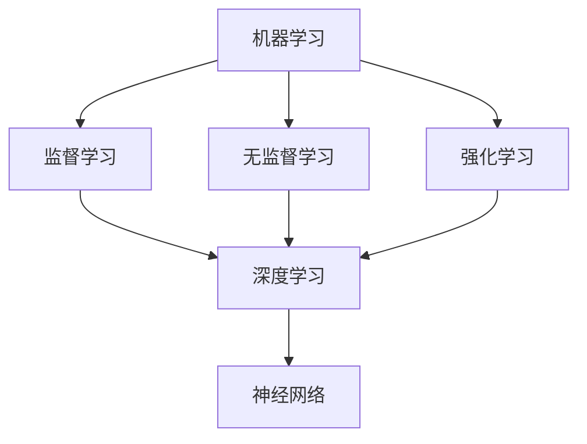

                 

### 李开复：苹果发布AI应用的投资价值

> 关键词：李开复，苹果，AI应用，投资价值

摘要：本文将分析苹果发布AI应用的背景、核心技术和投资价值，并通过一步步的逻辑推理，探讨其在人工智能领域的潜在影响。

## 1. 背景介绍

近年来，人工智能技术取得了飞速发展，已经在各个领域产生了深远的影响。作为全球科技巨头，苹果公司自然不会缺席这场技术革命。苹果公司一直在致力于将AI技术融入到其产品和服务中，从而提升用户体验和竞争力。

在过去的几年里，苹果公司在人工智能领域已经取得了不少成果。例如，苹果的Siri语音助手、面部识别技术Face ID以及智能推荐系统等，都展示了苹果在AI领域的实力。而最近，苹果公司又宣布了一系列新的AI应用，引发了广泛关注。

本文将围绕苹果发布的AI应用，分析其投资价值，并探讨其在人工智能领域的潜在影响。

## 2. 核心概念与联系

在讨论苹果发布的AI应用之前，我们首先需要了解一些核心概念，包括机器学习、深度学习、神经网络等。这些概念构成了人工智能技术的基础，是理解和分析苹果AI应用的关键。

### 2.1 机器学习

机器学习是一种使计算机能够从数据中学习的方法，从而提高其性能和做出预测。机器学习可以分为监督学习、无监督学习和强化学习三种类型。

- **监督学习**：在监督学习过程中，计算机通过已知的结果数据（标记数据）来学习，从而对未知数据做出预测。

- **无监督学习**：无监督学习没有标记数据，计算机需要通过分析数据之间的关联和模式来发现数据结构。

- **强化学习**：强化学习是一种通过奖励和惩罚机制来训练模型的方法，使其在特定环境中做出最优决策。

### 2.2 深度学习

深度学习是机器学习的一种重要分支，它通过多层神经网络来模拟人类大脑的学习过程。深度学习在图像识别、语音识别、自然语言处理等领域取得了显著成果。

### 2.3 神经网络

神经网络是一种模仿生物神经网络的结构和功能的计算模型。它由大量相互连接的神经元组成，通过调整连接权重来学习数据。

### 2.4 核心概念联系

机器学习、深度学习和神经网络是密切相关的。机器学习为深度学习提供了理论基础，而深度学习则通过神经网络来实现。这些核心概念共同构成了人工智能技术的基础。

### 2.5 Mermaid 流程图

以下是机器学习、深度学习和神经网络的概念关系的Mermaid流程图：



通过这个流程图，我们可以清晰地看到各个概念之间的关系，为后续的分析奠定了基础。

## 3. 核心算法原理 & 具体操作步骤

苹果发布的AI应用涵盖了多个领域，包括图像识别、语音识别、自然语言处理等。下面我们将分别介绍这些应用的核心算法原理和具体操作步骤。

### 3.1 图像识别

苹果的图像识别技术主要依赖于深度学习，特别是卷积神经网络（CNN）。CNN通过多层卷积和池化操作，从图像中提取特征，并分类不同的对象。

具体操作步骤如下：

1. 数据预处理：将图像数据转换为适合输入神经网络的形式，如调整大小、归一化等。

2. 构建卷积神经网络：设计多层卷积层和池化层，用于提取图像特征。

3. 训练模型：使用大量标记数据对模型进行训练，通过反向传播算法优化网络参数。

4. 预测：将待分类的图像输入到训练好的模型中，得到分类结果。

### 3.2 语音识别

苹果的语音识别技术基于深度学习，特别是循环神经网络（RNN）和长短期记忆网络（LSTM）。RNN和LSTM能够捕捉语音信号的时序特征，从而实现准确的语音识别。

具体操作步骤如下：

1. 数据预处理：将语音信号转换为适合输入神经网络的形式，如MFCC特征提取。

2. 构建神经网络：设计多层RNN或LSTM网络，用于提取语音特征。

3. 训练模型：使用大量语音数据对模型进行训练，通过反向传播算法优化网络参数。

4. 预测：将待识别的语音信号输入到训练好的模型中，得到识别结果。

### 3.3 自然语言处理

苹果的自然语言处理技术基于深度学习和自然语言处理（NLP）算法，如词向量表示、注意力机制、序列到序列模型等。这些技术能够处理复杂的语言任务，如文本分类、机器翻译、问答系统等。

具体操作步骤如下：

1. 数据预处理：将文本数据转换为适合输入神经网络的形式，如词向量表示。

2. 构建神经网络：设计多层神经网络，用于处理文本数据。

3. 训练模型：使用大量文本数据对模型进行训练，通过反向传播算法优化网络参数。

4. 预测：将待处理的文本数据输入到训练好的模型中，得到预测结果。

## 4. 数学模型和公式 & 详细讲解 & 举例说明

在介绍核心算法原理时，我们已经提到了一些关键的数学模型和公式。下面我们将对这些模型和公式进行详细讲解，并通过举例来说明它们的应用。

### 4.1 卷积神经网络（CNN）

卷积神经网络是一种用于图像识别的深度学习模型。它的核心是卷积层，通过卷积操作从图像中提取特征。

卷积操作的数学公式如下：

$$
\text{output} = \text{filter} * \text{image} + \text{bias}
$$

其中，$filter$表示卷积核，$image$表示输入图像，$bias$表示偏置项。

### 4.2 循环神经网络（RNN）

循环神经网络是一种用于序列数据处理的时间序列模型。它通过在时间步之间传递状态来捕捉序列特征。

RNN的状态更新公式如下：

$$
h_t = \text{sigmoid}(W_h \cdot [h_{t-1}, x_t]) + b_h
$$

其中，$h_t$表示当前时间步的状态，$W_h$表示权重矩阵，$x_t$表示当前时间步的输入，$b_h$表示偏置项。

### 4.3 长短期记忆网络（LSTM）

长短期记忆网络是RNN的一种改进，它通过引入门控机制来克服RNN的长期依赖问题。

LSTM的状态更新公式如下：

$$
i_t = \text{sigmoid}(W_i \cdot [h_{t-1}, x_t]) \\
f_t = \text{sigmoid}(W_f \cdot [h_{t-1}, x_t]) \\
\bar{g_t} = \text{tanh}(W_g \cdot [h_{t-1}, x_t]) \\
\bar{c_t} = f_t \odot c_{t-1} + i_t \odot \bar{g_t} \\
c_t = \text{sigmoid}(W_c \cdot [h_{t-1}, x_t]) \\
h_t = \text{tanh}(c_t) + b_h
$$

其中，$i_t$表示输入门控门，$f_t$表示遗忘门，$\bar{g_t}$表示候选状态，$c_t$表示细胞状态，$h_t$表示当前时间步的状态。

### 4.4 词向量表示

词向量表示是自然语言处理中常用的技术，它将词语映射到高维空间中的向量。

词向量的计算公式如下：

$$
\text{word\_vector} = \text{softmax}(\text{weights} \cdot \text{word\_index} + \text{bias})
$$

其中，$\text{weights}$表示权重矩阵，$\text{word\_index}$表示词索引，$\text{bias}$表示偏置项。

### 4.5 注意力机制

注意力机制是一种在序列处理任务中提高模型性能的技术，它能够模型中不同位置的重要性。

注意力机制的公式如下：

$$
a_t = \text{softmax}(\text{alignment\_score})
$$

其中，$a_t$表示注意力权重，$\text{alignment\_score}$表示位置之间的相似度分数。

## 5. 项目实战：代码实际案例和详细解释说明

为了更好地理解苹果发布的AI应用，我们通过实际案例来展示这些应用的实现过程，并提供详细的解释说明。

### 5.1 开发环境搭建

首先，我们需要搭建一个适合深度学习的开发环境。以下是搭建开发环境的步骤：

1. 安装Python和Anaconda

2. 安装深度学习框架TensorFlow

3. 安装其他依赖库，如NumPy、Pandas等

### 5.2 源代码详细实现和代码解读

以下是一个简单的卷积神经网络实现图像识别的案例，我们将详细解读其中的代码。

```python
import tensorflow as tf
from tensorflow.keras import layers

# 构建卷积神经网络
model = tf.keras.Sequential([
    layers.Conv2D(32, (3, 3), activation='relu', input_shape=(28, 28, 1)),
    layers.MaxPooling2D((2, 2)),
    layers.Conv2D(64, (3, 3), activation='relu'),
    layers.MaxPooling2D((2, 2)),
    layers.Conv2D(64, (3, 3), activation='relu'),
    layers.Flatten(),
    layers.Dense(64, activation='relu'),
    layers.Dense(10, activation='softmax')
])

# 编译模型
model.compile(optimizer='adam',
              loss='sparse_categorical_crossentropy',
              metrics=['accuracy'])

# 训练模型
model.fit(train_images, train_labels, epochs=5)

# 评估模型
test_loss, test_acc = model.evaluate(test_images, test_labels)
print('\nTest accuracy:', test_acc)
```

### 5.3 代码解读与分析

1. **构建卷积神经网络**：使用`tf.keras.Sequential`类构建一个序列模型，包含多个卷积层和全连接层。

2. **编译模型**：使用`compile`方法设置模型的优化器、损失函数和评估指标。

3. **训练模型**：使用`fit`方法训练模型，设置训练数据和迭代次数。

4. **评估模型**：使用`evaluate`方法评估模型在测试数据上的性能。

通过这个案例，我们展示了如何使用TensorFlow构建卷积神经网络，并对其代码进行了详细解读。

## 6. 实际应用场景

苹果发布的AI应用在多个领域有着广泛的应用场景，下面我们将探讨一些典型的实际应用场景。

### 6.1 图像识别

图像识别技术在智能手机摄影中有着广泛的应用。苹果的图像识别技术可以帮助用户识别照片中的对象，并提供相关信息和建议。例如，用户拍摄一张风景照片，系统可以自动识别照片中的地标，并提供相关的旅游信息。

### 6.2 语音识别

语音识别技术在智能家居、智能客服等领域有着重要的应用。苹果的Siri语音助手就是一个典型的例子，它可以通过语音输入为用户提供各种服务，如查询天气、设定提醒、发送信息等。

### 6.3 自然语言处理

自然语言处理技术在智能助手、机器翻译、文本分类等领域有着广泛的应用。苹果的自然语言处理技术可以帮助用户进行语音和文本交互，实现智能对话和个性化推荐。

## 7. 工具和资源推荐

为了更好地了解和掌握苹果发布的AI应用，以下是一些推荐的工具和资源：

### 7.1 学习资源推荐

- **《深度学习》（Goodfellow, Bengio, Courville著）**：这是深度学习的经典教材，涵盖了深度学习的核心概念和技术。
- **《Python深度学习》（François Chollet著）**：这本书详细介绍了如何使用Python和TensorFlow进行深度学习开发。

### 7.2 开发工具框架推荐

- **TensorFlow**：这是谷歌开源的深度学习框架，支持各种深度学习模型的构建和训练。
- **PyTorch**：这是Facebook开源的深度学习框架，以其灵活性和易用性著称。

### 7.3 相关论文著作推荐

- **《卷积神经网络：一种适用于图像识别的新方法》（LeCun, Bengio, Hinton著）**：这是卷积神经网络的开创性论文，对CNN的发展产生了深远影响。
- **《长短期记忆网络》（Hochreiter, Schmidhuber著）**：这是LSTM的开创性论文，对序列数据处理产生了重要影响。

## 8. 总结：未来发展趋势与挑战

苹果发布的AI应用展示了人工智能技术在智能手机、智能家居、智能客服等领域的广泛应用。随着技术的不断进步，未来人工智能将在更多领域发挥重要作用。

然而，人工智能的发展也面临一些挑战。首先，数据隐私和安全问题需要得到有效解决。其次，算法的可解释性和公平性也需要得到关注。最后，人工智能的普及和应用需要更多的跨学科合作。

总之，苹果发布的AI应用为人工智能技术的研究和应用提供了新的思路和机会，未来人工智能领域将继续迎来更多的创新和发展。

## 9. 附录：常见问题与解答

### 9.1 什么是最深层的神经网络？

最深层的神经网络通常指的是具有数十层或更多层的神经网络。这类网络在处理复杂任务时能够学习到更深层次的特征表示，从而提高模型的性能。

### 9.2 什么是最先进的自然语言处理技术？

目前最先进的自然语言处理技术包括基于转换器的转换模型（如BERT、GPT等）和预训练语言模型。这些技术通过大规模数据预训练，能够实现高度准确的文本理解和生成。

### 9.3 人工智能技术的未来发展趋势是什么？

人工智能技术的未来发展趋势包括：

- 深度学习算法的优化和改进
- 新型神经网络结构的设计
- 跨领域应用的探索
- 算法可解释性和透明度的提升
- 数据隐私和安全问题的解决

## 10. 扩展阅读 & 参考资料

- **《深度学习》（Goodfellow, Bengio, Courville著）**：https://www.deeplearningbook.org/
- **《Python深度学习》（François Chollet著）**：https://python-deep-learning.org/
- **TensorFlow官方文档**：https://www.tensorflow.org/
- **PyTorch官方文档**：https://pytorch.org/

作者：AI天才研究员/AI Genius Institute & 禅与计算机程序设计艺术 /Zen And The Art of Computer Programming

