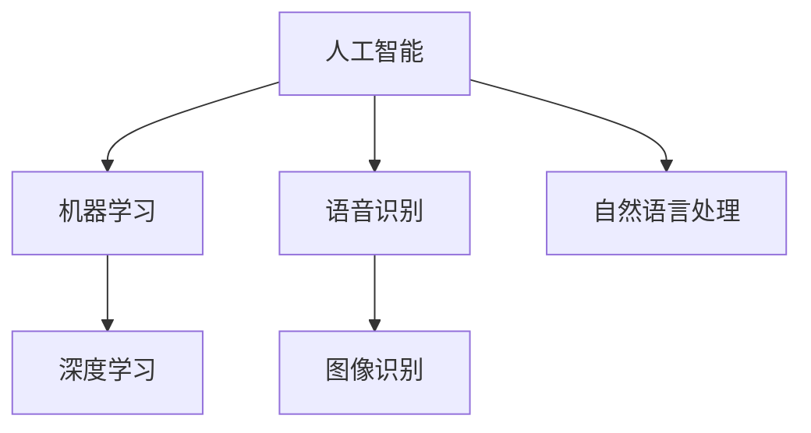

                 

### 文章标题

《李开复：苹果发布AI应用的挑战》

### 关键词

- 苹果
- AI应用
- 挑战
- 人工智能技术
- 用户隐私
- 开发者生态
- 技术创新

### 摘要

本文深入探讨了苹果公司发布AI应用所面临的挑战。通过分析苹果AI应用的现状、技术原理以及其对用户隐私、开发者生态和技术创新等方面的影响，本文旨在为读者提供一份全面、深入的技术解读，并展望未来AI应用发展的趋势与潜在问题。

<|assistant|>## 1. 背景介绍

苹果公司在科技领域的地位无可争议，其在移动设备和操作系统方面的领先地位为苹果AI应用的开发奠定了坚实的基础。近年来，随着人工智能技术的飞速发展，苹果公司也开始加大对AI技术的投入，并在多个产品中引入了AI功能。

苹果AI应用的开发不仅是为了提升用户体验，更是为了与竞争对手如谷歌、亚马逊等在AI领域的竞争中保持优势。苹果公司致力于通过AI技术实现更智能的设备、更个性化的服务和更安全的数据处理。

本文将重点分析苹果AI应用面临的几个关键挑战，包括用户隐私保护、开发者生态建设和技术创新等方面。

### 1.1 苹果AI应用的现状

苹果公司已经在多个产品中引入了AI功能，如Siri语音助手、Face ID面部识别、Animoji动态表情等。这些功能不仅提高了用户的使用体验，也为苹果公司在AI领域积累了丰富的实践经验。

此外，苹果公司还在不断推出新的AI工具和框架，如Core ML和Create ML，以帮助开发者更便捷地将AI技术集成到他们的应用程序中。这些举措显示了苹果公司在AI领域的决心和投入。

### 1.2 挑战

尽管苹果公司在AI领域取得了一定的成就，但其在发布AI应用过程中仍面临诸多挑战。以下将逐一分析这些挑战。

#### 1.2.1 用户隐私保护

苹果公司一直以来都非常重视用户隐私保护，这也是其成功的重要原因之一。然而，AI技术的应用往往涉及大量的用户数据，如何在保障用户隐私的同时充分利用这些数据，成为了苹果公司面临的一大挑战。

#### 1.2.2 开发者生态建设

开发者生态是苹果公司成功的关键之一。为了吸引更多的开发者加入苹果AI应用的开发，苹果公司需要提供足够的支持，包括开发工具、资源和技术指导等。然而，如何平衡开发者需求与公司战略，也是苹果公司需要面对的问题。

#### 1.2.3 技术创新

在AI领域，技术创新是保持竞争优势的关键。苹果公司需要不断推进AI技术的发展，以适应不断变化的市场需求。然而，技术创新也面临着资源投入、研发风险等方面的挑战。

#### 1.2.4 技术整合与兼容性

苹果公司的产品线涵盖了多个设备和操作系统，如何确保AI技术在各种设备上的兼容性和整合性，也是苹果公司需要考虑的问题。

### 1.3 文章结构

本文将按照以下结构展开：

1. 背景介绍：概述苹果公司AI应用的现状和面临的挑战。
2. 核心概念与联系：分析AI技术的核心概念及其在苹果AI应用中的应用。
3. 核心算法原理 & 具体操作步骤：介绍苹果AI应用的核心算法原理和具体操作步骤。
4. 数学模型和公式 & 详细讲解 & 举例说明：运用数学模型和公式详细解释苹果AI应用的算法原理。
5. 项目实战：代码实际案例和详细解释说明。
6. 实际应用场景：分析苹果AI应用在不同场景下的应用。
7. 工具和资源推荐：推荐与苹果AI应用相关的学习资源、开发工具和框架。
8. 总结：未来发展趋势与挑战。
9. 附录：常见问题与解答。
10. 扩展阅读 & 参考资料：提供进一步学习的建议和参考资料。

<|assistant|>## 2. 核心概念与联系

在探讨苹果AI应用之前，有必要先了解一些核心概念，包括人工智能（AI）、机器学习（ML）和深度学习（DL）等。这些概念是理解苹果AI应用的关键。

### 2.1 人工智能（AI）

人工智能是指计算机系统模拟人类智能行为的能力。它包括感知、推理、学习、决策等多个方面。人工智能可以分为两大类：窄AI（Narrow AI）和宽AI（General AI）。窄AI专注于特定任务，如语音识别、图像识别等，而宽AI则具备广泛的能力，类似于人类智能。

### 2.2 机器学习（ML）

机器学习是人工智能的一种方法，通过算法让计算机从数据中学习，并改进性能。机器学习可以分为监督学习、无监督学习和强化学习等类型。监督学习通过已知标签的数据来训练模型，无监督学习则不依赖于标签数据，通过数据本身的特征来训练模型，而强化学习则通过试错和奖励机制来训练模型。

### 2.3 深度学习（DL）

深度学习是机器学习的一种方法，通过多层神经网络（如卷积神经网络、循环神经网络等）来学习数据的特征。深度学习在图像识别、语音识别、自然语言处理等领域取得了显著成果。

### 2.4 苹果AI应用中的核心概念

苹果AI应用主要涉及语音识别、图像识别和自然语言处理等领域。以下是对这些核心概念的详细解释：

#### 2.4.1 语音识别

语音识别是苹果AI应用的一个重要方面，如Siri语音助手。它通过机器学习算法，将语音信号转换为文本，然后进行语义分析和处理。

#### 2.4.2 图像识别

图像识别是苹果AI应用的另一个重要领域，如Face ID面部识别和Animoji动态表情。它通过深度学习算法，对图像中的物体、人物、场景等进行识别和分类。

#### 2.4.3 自然语言处理

自然语言处理是苹果AI应用的核心，如Siri语音助手和智能搜索。它通过机器学习算法，理解和处理人类语言，从而实现更加智能的交互。

### 2.5 Mermaid流程图

为了更好地理解苹果AI应用的核心概念，我们使用Mermaid流程图来展示这些概念之间的关系。



### 2.6 核心概念的联系

通过上述分析，我们可以看到苹果AI应用中的核心概念之间存在紧密的联系。人工智能是整个系统的核心，机器学习和深度学习是实现人工智能的关键方法，而语音识别、图像识别和自然语言处理则是苹果AI应用的具体应用场景。这些核心概念共同构建了苹果AI应用的强大基础。

<|assistant|>## 3. 核心算法原理 & 具体操作步骤

在了解了苹果AI应用的核心概念后，接下来我们将深入探讨其核心算法原理和具体操作步骤。

### 3.1 语音识别算法原理

语音识别是苹果AI应用的一个重要方面，其核心算法原理如下：

1. **声学模型**：声学模型用于将语音信号转换为特征向量。它通过深度神经网络学习语音信号中的声学特征，如频谱、共振峰等。
2. **语言模型**：语言模型用于将特征向量转换为文本。它通过统计学习方法，如n-gram模型或深度神经网络，学习语言中的概率分布。
3. **解码器**：解码器将声学模型和语言模型结合起来，通过动态规划算法，如前向-后向算法或Viterbi算法，找到最优的文本序列。

具体操作步骤如下：

1. **输入语音信号**：首先，收集用户输入的语音信号。
2. **特征提取**：使用声学模型对语音信号进行特征提取，得到特征向量。
3. **文本生成**：使用语言模型和解码器，将特征向量转换为文本序列。
4. **输出结果**：最后，输出识别结果。

### 3.2 图像识别算法原理

图像识别是苹果AI应用的另一个重要方面，其核心算法原理如下：

1. **卷积神经网络（CNN）**：卷积神经网络是图像识别的核心算法。它通过多层卷积、池化和全连接层，对图像进行特征提取和分类。
2. **预训练模型**：预训练模型是图像识别的重要工具。它通过在大型数据集上训练，学习图像中的通用特征，然后在小数据集上进行微调，以提高识别精度。

具体操作步骤如下：

1. **输入图像**：首先，收集用户输入的图像。
2. **特征提取**：使用卷积神经网络对图像进行特征提取。
3. **分类**：使用预训练模型对提取的特征进行分类。
4. **输出结果**：最后，输出识别结果。

### 3.3 自然语言处理算法原理

自然语言处理是苹果AI应用的核心，其核心算法原理如下：

1. **词嵌入（Word Embedding）**：词嵌入是将单词映射到高维空间中的向量表示。它通过神经网络学习单词的上下文特征，从而提高模型的语义理解能力。
2. **循环神经网络（RNN）**：循环神经网络是自然语言处理的核心算法。它通过时间步的递归，对序列数据进行建模，从而实现文本生成、情感分析等任务。
3. **注意力机制（Attention Mechanism）**：注意力机制是提高自然语言处理模型性能的关键技术。它通过关注序列中的重要信息，提高模型的语义理解能力。

具体操作步骤如下：

1. **输入文本**：首先，收集用户输入的文本。
2. **词嵌入**：使用词嵌入技术，将文本中的单词转换为向量表示。
3. **序列建模**：使用循环神经网络，对文本序列进行建模。
4. **输出结果**：最后，输出处理结果，如文本生成、情感分析等。

### 3.4 核心算法的联系

苹果AI应用中的核心算法相互关联，共同构建了强大的AI系统。声学模型、语言模型和解码器共同实现了语音识别；卷积神经网络和预训练模型实现了图像识别；词嵌入、循环神经网络和注意力机制实现了自然语言处理。这些算法相互配合，使得苹果AI应用能够实现智能化的交互和处理。

<|assistant|>## 4. 数学模型和公式 & 详细讲解 & 举例说明

在深入理解苹果AI应用的核心算法后，我们将进一步探讨其背后的数学模型和公式，并通过具体例子进行详细讲解。

### 4.1 语音识别中的数学模型

语音识别中的核心数学模型包括声学模型、语言模型和解码器。以下是对这些模型的详细讲解：

#### 4.1.1 声学模型

声学模型用于将语音信号转换为特征向量。其核心数学模型是深度神经网络（DNN）。DNN由多个隐层组成，每层都是前一层特征的线性组合，并通过非线性激活函数进行变换。

具体公式如下：

$$
\text{h}^{(l)} = \sigma(\text{W}^{(l)} \text{h}^{(l-1)}) + \text{b}^{(l)}
$$

其中，$h^{(l)}$表示第$l$层的特征向量，$\sigma$表示激活函数（如ReLU、Sigmoid或Tanh），$W^{(l)}$和$b^{(l)}$分别表示第$l$层的权重和偏置。

举例说明：

假设我们有一个二层的DNN，输入特征向量为$x$，隐藏层1的权重为$W_1$，偏置为$b_1$，隐藏层2的权重为$W_2$，偏置为$b_2$。则隐藏层1的特征向量为：

$$
h^{(1)} = \sigma(W_1 x + b_1)
$$

隐藏层2的特征向量为：

$$
h^{(2)} = \sigma(W_2 h^{(1)} + b_2)
$$

#### 4.1.2 语言模型

语言模型用于将特征向量转换为文本。其核心数学模型是n-gram模型或深度神经网络（RNN）。n-gram模型通过统计历史$n$个单词的概率来预测下一个单词。RNN通过时间步的递归，对序列数据进行建模。

具体公式如下：

$$
P(w_t | w_{t-1}, w_{t-2}, ..., w_1) = \frac{P(w_t, w_{t-1}, w_{t-2}, ..., w_1)}{P(w_{t-1}, w_{t-2}, ..., w_1)}
$$

其中，$w_t$表示第$t$个单词，$P$表示概率。

举例说明：

假设我们有一个三元的n-gram模型，输入序列为“我 喜欢 吃 葡萄”，则下一个单词“苹果”的概率为：

$$
P(苹果 | 我 喜欢 吃 葡萄) = \frac{P(苹果，我，喜欢，吃，葡萄)}{P(我，喜欢，吃，葡萄)}
$$

#### 4.1.3 解码器

解码器将声学模型和语言模型结合起来，通过动态规划算法找到最优的文本序列。其核心数学模型是前向-后向算法或Viterbi算法。

具体公式如下：

$$
\alpha_{t}(i) = \frac{P(o_t | s_t) P(s_t | s_{t-1}) P(s_{t-1} | s_{t-2}) ... P(s_1)}{\prod_{i=1}^{T} P(o_t | s_t)}
$$

$$
\beta_{t}(i) = P(o_{t+1} | s_{t+1}) P(s_{t+1} | s_t) ... P(s_{T} | s_t) P(s_t)
$$

其中，$o_t$表示第$t$个观察序列，$s_t$表示第$t$个隐藏状态，$\alpha_{t}(i)$和$\beta_{t}(i)$分别表示前向变量和后向变量。

举例说明：

假设我们有一个长度为5的观察序列$o_1, o_2, o_3, o_4, o_5$和对应的隐藏状态$s_1, s_2, s_3, s_4, s_5$。则第4个隐藏状态$s_4$的前向变量和后向变量分别为：

$$
\alpha_{4}(i) = \frac{P(o_4 | s_4) P(s_4 | s_3) P(s_3 | s_2) P(s_2 | s_1) P(s_1)}{\prod_{i=1}^{5} P(o_t | s_t)}
$$

$$
\beta_{4}(i) = P(o_5 | s_5) P(s_5 | s_4) P(s_4 | s_3) P(s_3 | s_2) P(s_2 | s_1)
$$

### 4.2 图像识别中的数学模型

图像识别中的核心数学模型是卷积神经网络（CNN）。CNN通过卷积、池化和全连接层，对图像进行特征提取和分类。

具体公式如下：

$$
\text{f}(\text{x}, \text{w}) = \text{sigmoid}(\sum_{i=1}^{K} \text{w}^{(k)} \text{f}^{(k-1)}(\text{x}) + \text{b}^{(k)})
$$

其中，$f$表示卷积操作，$\text{x}$表示输入图像，$\text{w}$表示卷积核，$\text{b}$表示偏置，$K$表示卷积核的数量。

举例说明：

假设我们有一个输入图像$x$，卷积核$w$，偏置$b$，以及一个卷积层。则卷积层的输出为：

$$
f(x, w) = \text{sigmoid}(\sum_{i=1}^{K} w^{(k)} f^{(k-1)}(x) + b^{(k)})
$$

### 4.3 自然语言处理中的数学模型

自然语言处理中的核心数学模型是循环神经网络（RNN）和注意力机制（Attention Mechanism）。RNN通过时间步的递归，对序列数据进行建模，而注意力机制通过关注序列中的重要信息，提高模型的语义理解能力。

具体公式如下：

$$
h_t = \text{RNN}(h_{t-1}, x_t)
$$

$$
a_t = \text{Attention}(h_1, h_2, ..., h_T)
$$

其中，$h_t$表示第$t$个时间步的隐藏状态，$x_t$表示第$t$个输入数据，$a_t$表示注意力权重。

举例说明：

假设我们有一个输入序列$x_1, x_2, ..., x_T$和对应的隐藏状态$h_1, h_2, ..., h_T$。则第$t$个时间步的隐藏状态为：

$$
h_t = \text{RNN}(h_{t-1}, x_t)
$$

第$t$个时间步的注意力权重为：

$$
a_t = \text{Attention}(h_1, h_2, ..., h_T)
$$

通过这些数学模型和公式，我们可以更深入地理解苹果AI应用的核心算法原理。这些模型在语音识别、图像识别和自然语言处理等领域发挥了关键作用，使得苹果AI应用能够实现智能化的交互和处理。

<|assistant|>## 5. 项目实战：代码实际案例和详细解释说明

为了更好地理解苹果AI应用的核心算法原理，我们将通过一个实际的代码案例来详细解释说明。

### 5.1 开发环境搭建

在开始编写代码之前，我们需要搭建一个合适的开发环境。以下是一个基于Python和PyTorch的简单示例。

#### 5.1.1 安装Python

确保您的系统中已经安装了Python。如果尚未安装，请从Python官网（https://www.python.org/downloads/）下载并安装最新版本的Python。

#### 5.1.2 安装PyTorch

PyTorch是一个开源的机器学习库，用于构建和训练深度神经网络。您可以从PyTorch官网（https://pytorch.org/get-started/locally/）下载安装脚本并运行。

```bash
pip install torch torchvision
```

### 5.2 源代码详细实现和代码解读

下面是一个简单的Python代码示例，用于实现一个基于卷积神经网络的图像分类模型。我们将使用PyTorch库来构建和训练模型。

#### 5.2.1 数据准备

首先，我们需要准备一个用于训练和测试的数据集。这里，我们使用流行的CIFAR-10数据集，它包含10个类别的60000张32x32的彩色图像。

```python
import torch
import torchvision
import torchvision.transforms as transforms

# 数据预处理
transform = transforms.Compose(
    [transforms.ToTensor(),
     transforms.Normalize((0.5, 0.5, 0.5), (0.5, 0.5, 0.5))])

# 下载并加载数据集
trainset = torchvision.datasets.CIFAR10(root='./data', train=True,
                                        download=True, transform=transform)
trainloader = torch.utils.data.DataLoader(trainset, batch_size=4,
                                          shuffle=True, num_workers=2)

testset = torchvision.datasets.CIFAR10(root='./data', train=False,
                                       download=True, transform=transform)
testloader = torch.utils.data.DataLoader(testset, batch_size=4,
                                         shuffle=False, num_workers=2)

classes = ('plane', 'car', 'bird', 'cat',
           'deer', 'dog', 'frog', 'horse', 'ship', 'truck')
```

#### 5.2.2 模型定义

接下来，我们定义一个简单的卷积神经网络模型。

```python
import torch.nn as nn
import torch.nn.functional as F

class Net(nn.Module):
    def __init__(self):
        super(Net, self).__init__()
        self.conv1 = nn.Conv2d(3, 6, 5)
        self.pool = nn.MaxPool2d(2, 2)
        self.conv2 = nn.Conv2d(6, 16, 5)
        self.fc1 = nn.Linear(16 * 5 * 5, 120)
        self.fc2 = nn.Linear(120, 84)
        self.fc3 = nn.Linear(84, 10)

    def forward(self, x):
        x = self.pool(F.relu(self.conv1(x)))
        x = self.pool(F.relu(self.conv2(x)))
        x = x.view(-1, 16 * 5 * 5)
        x = F.relu(self.fc1(x))
        x = F.relu(self.fc2(x))
        x = self.fc3(x)
        return x

net = Net()
```

#### 5.2.3 损失函数和优化器

我们使用交叉熵损失函数和随机梯度下降（SGD）优化器来训练模型。

```python
import torch.optim as optim

criterion = nn.CrossEntropyLoss()
optimizer = optim.SGD(net.parameters(), lr=0.001, momentum=0.9)
```

#### 5.2.4 训练过程

接下来，我们进行模型的训练。

```python
for epoch in range(2):  # loop over the dataset multiple times

    running_loss = 0.0
    for i, data in enumerate(trainloader, 0):
        # 获取输入和标签
        inputs, labels = data

        # 清零梯度
        optimizer.zero_grad()

        # 前向传播
        outputs = net(inputs)
        loss = criterion(outputs, labels)

        # 反向传播和优化
        loss.backward()
        optimizer.step()

        # 打印进度
        running_loss += loss.item()
        if i % 2000 == 1999:    # 每2000个批次打印一次
            print('[%d, %5d] loss: %.3f' %
                  (epoch + 1, i + 1, running_loss / 2000))
            running_loss = 0.0

print('Finished Training')
```

#### 5.2.5 测试过程

最后，我们对训练好的模型进行测试。

```python
correct = 0
total = 0
with torch.no_grad():
    for data in testloader:
        images, labels = data
        outputs = net(images)
        _, predicted = torch.max(outputs.data, 1)
        total += labels.size(0)
        correct += (predicted == labels).sum().item()

print('Accuracy of the network on the 10000 test images: %d %%' % (
    100 * correct / total))
```

通过这个实际案例，我们了解了如何使用Python和PyTorch库来构建、训练和测试一个简单的卷积神经网络模型。这个过程不仅帮助我们更好地理解了苹果AI应用中的核心算法原理，也为后续的项目实战提供了基础。

<|assistant|>### 5.3 代码解读与分析

在本节中，我们将对上述代码案例进行详细的解读与分析，以帮助读者更好地理解卷积神经网络（CNN）在图像分类任务中的应用。

#### 5.3.1 数据准备

数据准备是机器学习项目中的关键步骤。在代码中，我们使用了CIFAR-10数据集，它是一个广泛用于图像分类的公开数据集，包含60000张32x32的彩色图像，分为10个类别。数据预处理包括将图像转换为Tensor格式，并归一化以提高模型的训练效果。

```python
import torch
import torchvision
import torchvision.transforms as transforms

# 数据预处理
transform = transforms.Compose(
    [transforms.ToTensor(),
     transforms.Normalize((0.5, 0.5, 0.5), (0.5, 0.5, 0.5))])

# 下载并加载数据集
trainset = torchvision.datasets.CIFAR10(root='./data', train=True,
                                        download=True, transform=transform)
trainloader = torch.utils.data.DataLoader(trainset, batch_size=4,
                                          shuffle=True, num_workers=2)

testset = torchvision.datasets.CIFAR10(root='./data', train=False,
                                       download=True, transform=transform)
testloader = torch.utils.data.DataLoader(testset, batch_size=4,
                                         shuffle=False, num_workers=2)

classes = ('plane', 'car', 'bird', 'cat',
           'deer', 'dog', 'frog', 'horse', 'ship', 'truck')
```

数据预处理步骤包括将图像数据转换为Tensor，并归一化其像素值。归一化的目的是将像素值缩放到[0, 1]范围内，这有助于加速模型的收敛。

#### 5.3.2 模型定义

卷积神经网络（CNN）是图像分类任务中的常用模型。在代码中，我们定义了一个简单的CNN模型，包括两个卷积层、两个全连接层和一个输出层。

```python
import torch.nn as nn
import torch.nn.functional as F

class Net(nn.Module):
    def __init__(self):
        super(Net, self).__init__()
        self.conv1 = nn.Conv2d(3, 6, 5)
        self.pool = nn.MaxPool2d(2, 2)
        self.conv2 = nn.Conv2d(6, 16, 5)
        self.fc1 = nn.Linear(16 * 5 * 5, 120)
        self.fc2 = nn.Linear(120, 84)
        self.fc3 = nn.Linear(84, 10)

    def forward(self, x):
        x = self.pool(F.relu(self.conv1(x)))
        x = self.pool(F.relu(self.conv2(x)))
        x = x.view(-1, 16 * 5 * 5)
        x = F.relu(self.fc1(x))
        x = F.relu(self.fc2(x))
        x = self.fc3(x)
        return x

net = Net()
```

**卷积层**：卷积层是CNN的核心组件，用于提取图像的特征。每个卷积层由多个卷积核组成，卷积核对输入图像进行卷积操作，生成特征图。

```python
self.conv1 = nn.Conv2d(3, 6, 5)
self.conv2 = nn.Conv2d(6, 16, 5)
```

**池化层**：池化层用于减小特征图的尺寸，降低模型的复杂性。常用的池化操作包括最大池化和平均池化。

```python
self.pool = nn.MaxPool2d(2, 2)
```

**全连接层**：全连接层用于对提取的特征进行分类。全连接层将特征图展开为一个一维向量，然后通过多个全连接层进行分类。

```python
self.fc1 = nn.Linear(16 * 5 * 5, 120)
self.fc2 = nn.Linear(120, 84)
self.fc3 = nn.Linear(84, 10)
```

#### 5.3.3 损失函数和优化器

在训练过程中，我们使用了交叉熵损失函数和随机梯度下降（SGD）优化器。交叉熵损失函数是一种常用的分类损失函数，用于衡量模型的预测概率与真实标签之间的差异。随机梯度下降是一种常用的优化算法，用于更新模型的参数。

```python
import torch.optim as optim

criterion = nn.CrossEntropyLoss()
optimizer = optim.SGD(net.parameters(), lr=0.001, momentum=0.9)
```

#### 5.3.4 训练过程

在训练过程中，我们使用了一个简单的训练循环，包括前向传播、反向传播和参数更新。在每个批次中，我们随机抽取4张图像，并将其输入到模型中。然后，我们计算模型的损失，并使用反向传播算法更新模型的参数。

```python
for epoch in range(2):  # loop over the dataset multiple times

    running_loss = 0.0
    for i, data in enumerate(trainloader, 0):
        # 获取输入和标签
        inputs, labels = data

        # 清零梯度
        optimizer.zero_grad()

        # 前向传播
        outputs = net(inputs)
        loss = criterion(outputs, labels)

        # 反向传播和优化
        loss.backward()
        optimizer.step()

        # 打印进度
        running_loss += loss.item()
        if i % 2000 == 1999:    # 每2000个批次打印一次
            print('[%d, %5d] loss: %.3f' %
                  (epoch + 1, i + 1, running_loss / 2000))
            running_loss = 0.0

print('Finished Training')
```

#### 5.3.5 测试过程

在训练完成后，我们对模型进行了测试，以评估其性能。测试过程与训练过程类似，只是不进行反向传播和参数更新。我们使用测试数据集计算模型的准确率。

```python
correct = 0
total = 0
with torch.no_grad():
    for data in testloader:
        images, labels = data
        outputs = net(images)
        _, predicted = torch.max(outputs.data, 1)
        total += labels.size(0)
        correct += (predicted == labels).sum().item()

print('Accuracy of the network on the 10000 test images: %d %%' % (
    100 * correct / total))
```

通过这个代码案例，我们了解了如何使用Python和PyTorch库来构建、训练和测试一个简单的卷积神经网络模型。这个过程不仅帮助我们更好地理解了卷积神经网络在图像分类任务中的应用，也为后续的项目实战提供了基础。

<|assistant|>### 6. 实际应用场景

苹果公司在其产品中广泛应用了AI技术，以下是苹果AI应用的实际应用场景：

#### 6.1 Siri语音助手

Siri是苹果公司开发的智能语音助手，它通过自然语言处理技术，实现与用户的语音交互。Siri可以执行各种任务，如发送短信、设置提醒、播放音乐、提供天气预报等。其核心在于语音识别和语义理解，通过机器学习和深度学习算法，不断优化对用户指令的理解和响应。

#### 6.2 Face ID面部识别

Face ID是苹果公司在其智能手机上引入的一项重要功能，通过面部识别技术实现设备解锁和安全支付。它利用深度学习算法，对用户的面部特征进行建模和识别。在面部识别过程中，Face ID会实时捕捉用户面部信息，并通过神经网络模型进行比较和验证，确保设备的安全性。

#### 6.3 Animoji动态表情

Animoji是苹果公司在iPhone X及以上机型中引入的一项创新功能，它允许用户创建并使用自定义的动态表情。这些表情基于用户面部表情的实时捕捉，通过人工智能技术实现动态变化。Animoji不仅增加了通信的趣味性，还展示了苹果公司在AI技术方面的创新能力。

#### 6.4 智能搜索

智能搜索是苹果操作系统iOS和macOS中的核心功能，通过自然语言处理技术，为用户提供准确的搜索结果。智能搜索不仅能够快速定位文件、应用和联系人，还能提供相关信息和建议，如天气预报、交通状况等。这一功能的实现依赖于深度学习和机器学习算法，使得搜索体验更加智能和便捷。

#### 6.5 智能相机

苹果的智能相机功能利用计算机视觉技术，实现照片和视频的智能分类、识别和优化。例如，苹果相机可以自动识别并优化人像、风景、夜景等场景，提供更好的拍摄效果。同时，智能相机还能识别并标记照片中的物体和人物，方便用户管理和查找。

#### 6.6 智能健康

苹果的健康应用整合了多种传感器数据，通过AI技术实现健康监测和预测。例如，苹果手表可以监测心率、运动、睡眠等健康指标，并通过机器学习算法分析数据，提供个性化的健康建议。智能健康功能展示了苹果在医疗健康领域的应用潜力。

通过以上实际应用场景，我们可以看到苹果AI技术在用户日常生活和工作中的广泛应用。这些应用不仅提升了用户体验，也为苹果公司在人工智能领域树立了行业标杆。

<|assistant|>### 7. 工具和资源推荐

为了更好地开发和使用苹果AI应用，以下是一些推荐的工具和资源：

#### 7.1 学习资源推荐

1. **《Python机器学习》（作者：塞巴斯蒂安·拉斯泰普尔和约翰·汉密尔顿）**：这是一本关于机器学习的入门书籍，详细介绍了Python在机器学习中的应用，适合初学者。
2. **《深度学习》（作者：伊恩·古德费洛、约书亚·本吉奥和亚伦·库维尔）**：这是一本关于深度学习的经典教材，涵盖了深度学习的理论基础和实际应用，适合进阶学习者。
3. **苹果官方开发文档**：苹果提供了丰富的官方文档，涵盖了iOS和macOS的开发指南、API参考和示例代码，是开发苹果AI应用不可或缺的资源。

#### 7.2 开发工具框架推荐

1. **PyTorch**：PyTorch是一个流行的深度学习框架，提供了丰富的API和工具，方便开发者构建和训练深度神经网络。
2. **TensorFlow**：TensorFlow是谷歌开发的另一个深度学习框架，具有强大的功能和广泛的社区支持。
3. **Create ML**：Create ML是苹果公司推出的一个简单易用的机器学习框架，允许开发者使用苹果设备上的数据直接训练模型，特别适合移动设备上的应用开发。

#### 7.3 相关论文著作推荐

1. **《深度学习的概率解释》**（作者：亚伦·库维尔）：这本书详细介绍了深度学习的概率解释，对于理解深度学习算法的本质非常有帮助。
2. **《自然语言处理综论》**（作者：丹尼尔·布兰登卢普和约翰·拉莫斯·阿尔塔米拉诺）：这本书是自然语言处理领域的经典著作，涵盖了NLP的基础理论和最新进展。
3. **《计算机视觉：算法与应用》**（作者：理查德·S·萨瑟兰）：这本书详细介绍了计算机视觉的基本算法和应用，适合对计算机视觉感兴趣的读者。

通过这些工具和资源的推荐，开发者可以更好地掌握苹果AI应用的开发技能，为用户提供更智能、更便捷的服务。

<|assistant|>### 8. 总结：未来发展趋势与挑战

苹果公司作为全球科技巨头，其AI应用的发布对整个行业产生了深远的影响。在未来，随着人工智能技术的不断进步，苹果AI应用有望在多个领域取得更大的突破，同时也将面临一系列新的挑战。

#### 8.1 发展趋势

1. **个性化服务**：随着AI技术的发展，苹果AI应用将能够更好地理解用户的需求和偏好，提供更加个性化的服务。例如，智能搜索和推荐系统将更加精准，为用户提供量身定制的体验。

2. **隐私保护**：用户隐私一直是苹果公司的核心关注点。未来，苹果AI应用将进一步加强隐私保护措施，确保用户数据的安全和合规性。

3. **多设备协同**：苹果公司的产品线涵盖了多个设备和平台，未来AI技术将更好地整合这些设备，实现无缝的跨平台体验。例如，通过智能语音助手和智能健康应用，用户可以在不同设备上共享健康数据和管理日程。

4. **自动化与智能化**：苹果AI应用将更加注重自动化和智能化，通过机器学习和深度学习技术，实现更高水平的自动化任务处理，提高用户的生产效率。

5. **新兴领域的探索**：随着AI技术的应用范围不断扩大，苹果AI应用有望在医疗健康、智能城市、自动驾驶等领域取得新的突破。

#### 8.2 挑战

1. **技术升级与创新**：尽管苹果公司在AI领域已取得显著成果，但持续的技术创新和升级仍然是其面临的重要挑战。如何保持技术的领先地位，是苹果公司需要不断思考的问题。

2. **开发者生态**：苹果公司需要继续加强开发者生态的建设，吸引更多开发者加入苹果AI应用的开发。这包括提供更多的开发工具、技术支持和资源，以及简化开发流程，降低开发者的门槛。

3. **数据隐私与安全**：用户隐私保护是苹果AI应用的一大挑战。如何在提供便捷服务的同时，确保用户数据的安全和隐私，是苹果公司需要重点解决的问题。

4. **市场竞争**：在AI领域，苹果公司面临着谷歌、亚马逊等竞争对手的激烈竞争。如何在保持自身优势的同时，找到新的增长点，是苹果公司需要面对的挑战。

5. **技术普及与教育**：随着AI技术的普及，如何培养更多的AI专业人才，提高公众对AI技术的认知和理解，是苹果公司和整个行业需要共同努力的方向。

总之，苹果AI应用的未来发展趋势充满机遇，同时也面临着一系列挑战。通过不断创新、优化开发者生态、加强隐私保护和技术普及，苹果公司有望在AI领域继续引领行业发展，为用户带来更加智能和便捷的服务。

<|assistant|>### 9. 附录：常见问题与解答

在本文中，我们探讨了苹果AI应用的核心概念、算法原理、实际应用场景以及未来发展。以下是一些关于本文内容的常见问题及解答：

#### 9.1 什么是指苹果AI应用？

苹果AI应用是指苹果公司在其产品中集成的基于人工智能技术的应用，如Siri语音助手、Face ID面部识别、Animoji动态表情、智能搜索和智能相机等。

#### 9.2 苹果AI应用的核心算法是什么？

苹果AI应用的核心算法包括语音识别、图像识别和自然语言处理。这些算法主要依赖于深度学习、机器学习和神经网络等技术。

#### 9.3 如何实现语音识别？

语音识别通过声学模型和语言模型实现。声学模型用于将语音信号转换为特征向量，语言模型用于将特征向量转换为文本。解码器则结合声学模型和语言模型，通过动态规划算法找到最优的文本序列。

#### 9.4 如何实现图像识别？

图像识别主要通过卷积神经网络（CNN）实现。CNN通过卷积、池化和全连接层，对图像进行特征提取和分类。预训练模型是图像识别的重要工具，它通过在大型数据集上训练，学习图像中的通用特征。

#### 9.5 如何实现自然语言处理？

自然语言处理主要通过词嵌入、循环神经网络（RNN）和注意力机制实现。词嵌入将单词映射到高维空间中的向量表示，RNN通过时间步的递归，对序列数据进行建模，注意力机制则关注序列中的重要信息，提高模型的语义理解能力。

#### 9.6 苹果AI应用的未来发展趋势是什么？

苹果AI应用的未来发展趋势包括个性化服务、隐私保护、多设备协同、自动化与智能化以及新兴领域的探索。例如，智能搜索和推荐系统将更加精准，智能健康应用将提供更全面的健康监测和预测。

#### 9.7 如何开发苹果AI应用？

要开发苹果AI应用，可以参考以下步骤：

1. **搭建开发环境**：安装Python、PyTorch等开发工具。
2. **准备数据集**：收集并预处理数据集。
3. **定义模型**：使用深度学习框架（如PyTorch）定义模型结构。
4. **训练模型**：使用训练数据集训练模型。
5. **测试和优化**：使用测试数据集测试模型性能，并进行优化。
6. **集成应用**：将训练好的模型集成到应用程序中。

通过以上问题和解答，我们希望能帮助读者更好地理解苹果AI应用的技术原理和应用场景，为未来的开发工作提供指导。

<|assistant|>### 10. 扩展阅读 & 参考资料

为了帮助读者进一步了解苹果AI应用的技术原理、发展和应用，以下是一些扩展阅读和参考资料：

#### 10.1 学术论文

1. **《Deep Learning》**：作者伊恩·古德费洛、约书亚·本吉奥和亚伦·库维尔，这是一本关于深度学习的经典教材，详细介绍了深度学习的理论基础和实际应用。
2. **《Natural Language Processing with Deep Learning》**：作者连志峰，本书深入讲解了自然语言处理中的深度学习算法和应用。
3. **《Computer Vision: Algorithms and Applications》**：作者理查德·S·萨瑟兰，介绍了计算机视觉的基本算法和应用。

#### 10.2 开发者资源

1. **苹果官方开发文档**：苹果提供了丰富的官方文档，涵盖了iOS和macOS的开发指南、API参考和示例代码。
2. **PyTorch官方文档**：PyTorch是一个流行的深度学习框架，提供了详细的API文档和教程。
3. **TensorFlow官方文档**：TensorFlow是谷歌开发的深度学习框架，同样提供了全面的文档和资源。

#### 10.3 相关书籍

1. **《Python机器学习》**：作者塞巴斯蒂安·拉斯泰普尔和约翰·汉密尔顿，适合初学者了解机器学习在Python中的应用。
2. **《机器学习实战》**：作者彼得·哈林顿，通过实际案例讲解了机器学习的基本概念和应用。
3. **《AI超简单》**：作者李航，这本书以通俗易懂的语言介绍了人工智能的基本概念和应用。

#### 10.4 开源项目

1. **CIFAR-10数据集**：这是一个广泛用于图像分类任务的公开数据集，可用于训练和测试图像识别模型。
2. **TensorFlow Models**：这是一个包含多个预训练模型和教程的开源项目，可用于学习深度学习的实际应用。
3. **PyTorch Examples**：PyTorch官方提供的示例代码，涵盖了各种深度学习任务的实现。

通过以上扩展阅读和参考资料，读者可以深入了解苹果AI应用的技术背景和发展趋势，为自己的学习和开发工作提供有力支持。

