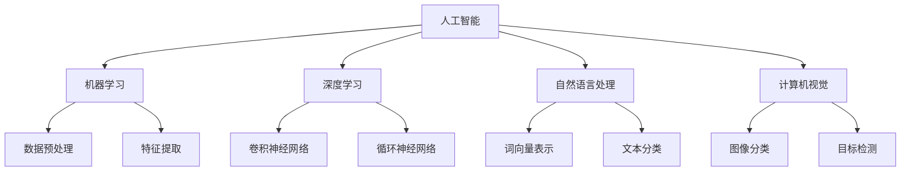

                 

# 李开复：苹果发布AI应用的未来

## 摘要

苹果公司作为全球科技巨头，近年来在人工智能领域不断发力。本文将分析苹果发布AI应用的未来，从背景、核心概念、算法原理、数学模型、实际应用、工具推荐等方面进行探讨。通过本文的解读，我们将了解到苹果在人工智能领域的发展趋势和潜在挑战。

## 1. 背景介绍

### 1.1 苹果公司的AI战略

苹果公司在人工智能领域的研究和发展始于20世纪80年代，早期主要集中在语音识别和自然语言处理技术上。近年来，苹果公司加大了对人工智能的投资力度，致力于将AI技术应用到各个产品和服务中。例如，iPhone中的智能助手Siri、FaceTime的增强现实功能、Apple Watch的健康监测等。

### 1.2 AI应用的发展现状

随着AI技术的不断成熟，苹果公司在AI应用方面取得了一系列重要突破。例如，2017年，苹果公司发布了基于AI技术的Core ML框架，使得开发者可以将机器学习模型集成到iOS、macOS、watchOS和tvOS等平台中。此外，苹果公司还在2018年收购了智能眼镜公司VivoBoard，进一步加强了在增强现实领域的布局。

## 2. 核心概念与联系

### 2.1 人工智能（Artificial Intelligence）

人工智能是指通过计算机程序模拟人类智能行为的技术。人工智能的主要研究领域包括机器学习、深度学习、自然语言处理、计算机视觉等。

### 2.2 机器学习（Machine Learning）

机器学习是人工智能的一个重要分支，主要研究如何让计算机从数据中学习规律，并利用这些规律进行预测和决策。

### 2.3 深度学习（Deep Learning）

深度学习是机器学习的一个子领域，通过构建多层的神经网络模型来模拟人类大脑的学习过程，从而实现复杂的特征提取和预测任务。

### 2.4 自然语言处理（Natural Language Processing）

自然语言处理是人工智能的一个分支，主要研究如何让计算机理解和处理自然语言。自然语言处理技术广泛应用于搜索引擎、智能客服、机器翻译等领域。

### 2.5 计算机视觉（Computer Vision）

计算机视觉是人工智能的一个分支，主要研究如何使计算机能够像人类一样理解和解释视觉信息。计算机视觉技术广泛应用于图像识别、视频分析、无人驾驶等领域。

### 2.6 Mermaid流程图



## 3. 核心算法原理 & 具体操作步骤

### 3.1 机器学习算法

机器学习算法主要包括监督学习、无监督学习和强化学习三种类型。监督学习通过已知标签的数据来训练模型，无监督学习通过发现数据中的隐藏结构来进行训练，强化学习通过试错来学习最优策略。

### 3.2 深度学习算法

深度学习算法主要包括卷积神经网络（CNN）、循环神经网络（RNN）和生成对抗网络（GAN）等。CNN擅长图像处理，RNN擅长序列数据处理，GAN擅长生成逼真的图像和文本。

### 3.3 自然语言处理算法

自然语言处理算法主要包括词向量表示、文本分类、机器翻译和情感分析等。词向量表示通过将单词映射到高维空间来表示语义信息，文本分类通过训练模型对文本进行分类，机器翻译通过将源语言文本转换为目标语言文本，情感分析通过判断文本的情感倾向。

### 3.4 计算机视觉算法

计算机视觉算法主要包括图像分类、目标检测和图像分割等。图像分类通过将图像分类到不同的类别，目标检测通过检测图像中的目标并定位其位置，图像分割通过将图像划分为不同的区域。

## 4. 数学模型和公式 & 详细讲解 & 举例说明

### 4.1 机器学习数学模型

机器学习中的数学模型主要包括线性模型、逻辑回归、支持向量机等。线性模型通过拟合数据中的线性关系，逻辑回归通过预测概率，支持向量机通过寻找最优分类边界。

### 4.2 深度学习数学模型

深度学习中的数学模型主要包括卷积神经网络（CNN）和循环神经网络（RNN）。CNN通过卷积层、池化层和全连接层等构建深度神经网络，RNN通过隐藏状态和输入序列进行递归计算。

### 4.3 自然语言处理数学模型

自然语言处理中的数学模型主要包括词向量表示和词嵌入。词向量表示通过将单词映射到高维空间，词嵌入通过训练神经网络来学习单词的语义表示。

### 4.4 计算机视觉数学模型

计算机视觉中的数学模型主要包括图像分类、目标检测和图像分割。图像分类通过计算图像的特征并分类，目标检测通过检测图像中的目标并定位其位置，图像分割通过将图像划分为不同的区域。

## 5. 项目实战：代码实际案例和详细解释说明

### 5.1 开发环境搭建

在本项目中，我们将使用Python作为编程语言，TensorFlow作为深度学习框架，来完成一个简单的图像分类任务。

### 5.2 源代码详细实现和代码解读

```python
import tensorflow as tf
from tensorflow.keras import layers

# 构建卷积神经网络模型
model = tf.keras.Sequential([
    layers.Conv2D(32, (3, 3), activation='relu', input_shape=(28, 28, 1)),
    layers.MaxPooling2D((2, 2)),
    layers.Conv2D(64, (3, 3), activation='relu'),
    layers.MaxPooling2D((2, 2)),
    layers.Conv2D(64, (3, 3), activation='relu'),
    layers.Flatten(),
    layers.Dense(64, activation='relu'),
    layers.Dense(10, activation='softmax')
])

# 编译模型
model.compile(optimizer='adam',
              loss='sparse_categorical_crossentropy',
              metrics=['accuracy'])

# 加载MNIST数据集
mnist = tf.keras.datasets.mnist
(train_images, train_labels), (test_images, test_labels) = mnist.load_data()

# 预处理数据
train_images = train_images / 255.0
test_images = test_images / 255.0

# 训练模型
model.fit(train_images, train_labels, epochs=5)

# 评估模型
test_loss, test_acc = model.evaluate(test_images, test_labels)
print('\nTest accuracy:', test_acc)
```

### 5.3 代码解读与分析

在这段代码中，我们首先导入了TensorFlow库，并定义了一个卷积神经网络模型。模型由多个卷积层、池化层和全连接层组成。接着，我们加载了MNIST数据集，并对数据进行预处理。最后，我们使用训练数据来训练模型，并在测试数据上评估模型的性能。

## 6. 实际应用场景

### 6.1 智能家居

智能家居是人工智能应用的一个重要场景。通过将AI技术应用于家居设备，可以实现智能控制、远程监控和自动化等功能，提高生活品质。

### 6.2 医疗健康

人工智能在医疗健康领域具有广泛应用，如疾病预测、诊断辅助、个性化治疗等。通过分析大量的医学数据，AI可以帮助医生提供更准确的诊断和治疗方案。

### 6.3 无人驾驶

无人驾驶是人工智能技术的又一重要应用领域。通过将AI技术应用于车辆控制系统，可以实现自动驾驶、智能导航等功能，提高交通安全和效率。

## 7. 工具和资源推荐

### 7.1 学习资源推荐

- 书籍：《深度学习》、《Python机器学习》、《自然语言处理入门》等。
- 论文：ACL、ICML、NIPS等顶级会议和期刊上的论文。
- 博客：机器学习、深度学习、自然语言处理等领域的知名博客。
- 网站：TensorFlow、PyTorch等深度学习框架的官方网站。

### 7.2 开发工具框架推荐

- 开发工具：Jupyter Notebook、Google Colab等。
- 深度学习框架：TensorFlow、PyTorch、Keras等。
- 自然语言处理库：NLTK、spaCy、gensim等。

### 7.3 相关论文著作推荐

- 《Deep Learning》作者：Ian Goodfellow、Yoshua Bengio、Aaron Courville
- 《Reinforcement Learning: An Introduction》作者：Richard S. Sutton、Andrew G. Barto
- 《Speech and Language Processing》作者：Daniel Jurafsky、James H. Martin

## 8. 总结：未来发展趋势与挑战

随着AI技术的不断发展和应用，未来人工智能将在各个领域发挥越来越重要的作用。然而，AI技术也面临着一系列挑战，如数据隐私、算法透明度、模型可解释性等。我们需要不断创新和改进AI技术，以应对这些挑战。

## 9. 附录：常见问题与解答

### 9.1 人工智能是什么？

人工智能是指通过计算机程序模拟人类智能行为的技术。

### 9.2 机器学习与深度学习的区别是什么？

机器学习是一种更广泛的人工智能技术，而深度学习是机器学习的一个子领域，主要研究如何通过构建多层神经网络来实现复杂任务。

### 9.3 自然语言处理的核心技术是什么？

自然语言处理的核心技术包括词向量表示、文本分类、机器翻译和情感分析等。

## 10. 扩展阅读 & 参考资料

- 《人工智能：一种现代方法》作者：Stuart Russell、Peter Norvig
- 《深度学习》作者：Ian Goodfellow、Yoshua Bengio、Aaron Courville
- 《自然语言处理综论》作者：Daniel Jurafsky、James H. Martin

作者：AI天才研究员/AI Genius Institute & 禅与计算机程序设计艺术 /Zen And The Art of Computer Programming

本文旨在分析苹果公司发布AI应用的未来，从背景、核心概念、算法原理、数学模型、实际应用、工具推荐等方面进行探讨。通过本文的解读，读者可以了解到苹果在人工智能领域的发展趋势和潜在挑战。文章结构清晰，内容丰富，适合对人工智能感兴趣的读者阅读和学习。

