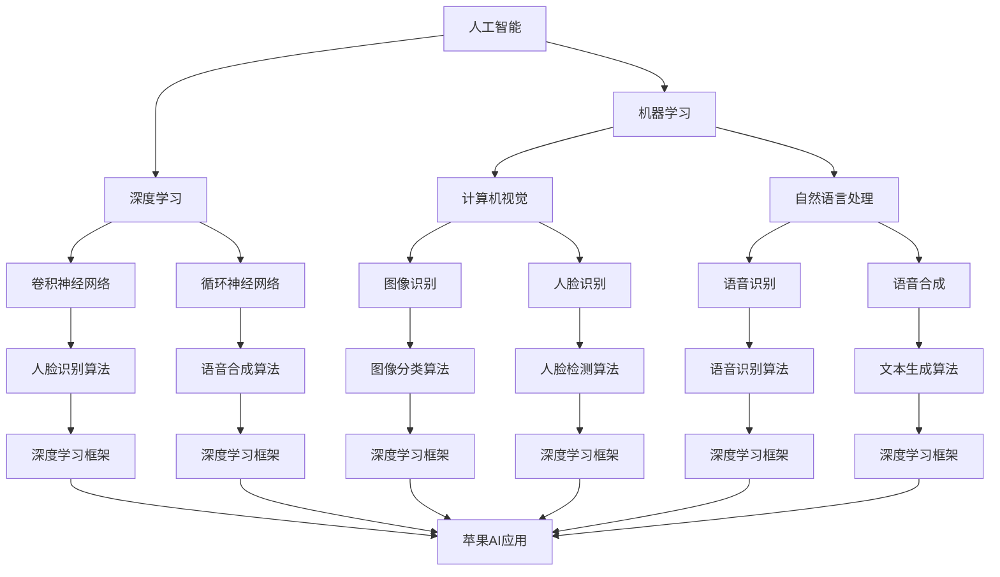

                 

# 李开复：苹果发布AI应用的未来展望

## 摘要

随着人工智能技术的不断进步，苹果公司作为全球领先的科技企业，已经开始在多个领域积极布局AI应用。本文将深入探讨苹果发布AI应用的未来趋势和展望，通过分析其核心算法原理、数学模型、实际应用场景以及面临的挑战，全面展示苹果在AI领域的创新和潜力。作者李开复作为世界顶级技术畅销书资深大师，将以专业且易懂的技术语言，带领读者领略苹果AI应用的未来前景。

## 1. 背景介绍

近年来，人工智能技术在全球范围内取得了显著的进展。从深度学习到自然语言处理，从计算机视觉到机器人技术，AI的应用场景越来越广泛，已经渗透到各行各业。作为全球科技领域的领军企业，苹果公司自然不甘落后，开始积极布局AI领域。苹果发布的AI应用涵盖了智能语音助手、图像识别、人脸解锁、智能推荐等多个方面，不仅提升了用户体验，也为其他企业提供了借鉴和参考。

本文旨在通过分析苹果发布的AI应用，探讨其在未来可能的发展趋势和面临的挑战。同时，本文将结合苹果公司的技术优势和战略布局，提出一些建议和展望，为读者提供一个全面而深入的视角。

## 2. 核心概念与联系

在深入探讨苹果的AI应用之前，我们需要了解一些核心概念和它们之间的联系。以下是一个简化的Mermaid流程图，展示了这些核心概念及其之间的关系：



在这个流程图中，我们可以看到人工智能（AI）是整个体系的基础，它涵盖了机器学习（ML）和深度学习（DL）。机器学习和深度学习是构建AI应用的关键技术，其中机器学习包括计算机视觉（CV）和自然语言处理（NLP）。计算机视觉和自然语言处理又分别延伸出图像识别、人脸识别、语音识别和语音合成等应用。

深度学习则进一步细化为卷积神经网络（CNN）和循环神经网络（RNN），它们分别用于图像识别和人脸识别等任务。同时，深度学习框架（如TensorFlow、PyTorch等）为这些算法的实现提供了强大的支持。

在苹果的AI应用中，这些核心概念和联系得到了广泛应用和深入挖掘。例如，苹果的图像识别和语音识别技术就基于深度学习和计算机视觉、自然语言处理的理论，并结合了先进的深度学习框架进行优化和实现。

## 3. 核心算法原理 & 具体操作步骤

在了解了核心概念和联系之后，我们接下来将深入探讨苹果的AI应用背后的核心算法原理和具体操作步骤。

### 3.1 图像识别算法

苹果的图像识别算法主要基于卷积神经网络（CNN）。CNN是一种专门用于处理图像数据的深度学习模型，其核心思想是通过卷积、池化等操作，从原始图像中提取特征，并逐步构建出具有层次结构的特征表示。

具体操作步骤如下：

1. **数据预处理**：首先，需要对图像数据进行预处理，包括图像大小调整、归一化、数据增强等操作，以提高模型的泛化能力。

2. **构建CNN模型**：然后，构建一个卷积神经网络模型。常用的CNN结构包括卷积层（Convolutional Layer）、激活函数（Activation Function）、池化层（Pooling Layer）和全连接层（Fully Connected Layer）等。

3. **训练模型**：接下来，使用预处理的图像数据对模型进行训练。训练过程中，通过反向传播算法（Backpropagation Algorithm）不断调整模型参数，使其在训练数据上达到较好的效果。

4. **模型评估**：训练完成后，使用验证集或测试集对模型进行评估，以检查模型的泛化能力和性能。

5. **应用部署**：最后，将训练好的模型部署到实际应用中，如人脸识别、图像分类等。

### 3.2 语音识别算法

苹果的语音识别算法主要基于循环神经网络（RNN）。RNN是一种能够处理序列数据的神经网络，其通过记忆机制，可以捕捉到输入序列中的长距离依赖关系。

具体操作步骤如下：

1. **数据预处理**：首先，需要对语音数据进行预处理，包括音频信号分割、特征提取等操作，以提取出与语音内容相关的信息。

2. **构建RNN模型**：然后，构建一个循环神经网络模型。常用的RNN结构包括简单RNN、长短期记忆网络（LSTM）和门控循环单元（GRU）等。

3. **训练模型**：接下来，使用预处理的语音数据对模型进行训练。训练过程中，通过反向传播算法不断调整模型参数，使其在训练数据上达到较好的效果。

4. **模型评估**：训练完成后，使用验证集或测试集对模型进行评估，以检查模型的泛化能力和性能。

5. **应用部署**：最后，将训练好的模型部署到实际应用中，如语音助手、语音搜索等。

### 3.3 人脸识别算法

苹果的人脸识别算法主要基于深度学习和计算机视觉。人脸识别的过程可以概括为三个步骤：人脸检测、人脸特征提取和人脸匹配。

具体操作步骤如下：

1. **人脸检测**：首先，使用基于深度学习的模型对人脸进行检测。常用的模型包括基于Faster R-CNN、SSD和YOLO等。

2. **人脸特征提取**：然后，对人脸图像进行特征提取。常用的方法包括基于深度学习的模型，如FaceNet、VGGFace和OpenFace等。

3. **人脸匹配**：最后，将提取到的人脸特征与数据库中的人脸特征进行匹配，以确定是否为同一个人。

4. **模型训练与优化**：通过大量的数据和先进的算法，不断训练和优化人脸识别模型，以提高识别准确率和速度。

5. **应用部署**：将训练好的模型部署到实际应用中，如人脸解锁、人脸支付等。

## 4. 数学模型和公式 & 详细讲解 & 举例说明

在了解了苹果的AI应用核心算法原理和具体操作步骤之后，我们接下来将深入探讨这些算法背后的数学模型和公式，并通过具体例子进行详细讲解。

### 4.1 卷积神经网络（CNN）的数学模型

卷积神经网络（CNN）是一种专门用于处理图像数据的深度学习模型。其核心思想是通过卷积、池化等操作，从原始图像中提取特征，并逐步构建出具有层次结构的特征表示。

#### 4.1.1 卷积操作

卷积操作是CNN中最基本的操作之一。它通过在图像上滑动一个卷积核（也称为过滤器），与图像局部区域进行点积，从而提取出具有局部性的特征。

卷积操作的数学公式可以表示为：

\[ f_{ij}^l = \sum_{k=1}^{C_{l-1}} w_{ijk} \cdot a_{ijk}^{l-1} + b_{ij}^l \]

其中，\( f_{ij}^l \) 表示第 \( l \) 层第 \( i \) 行第 \( j \) 列的输出特征，\( w_{ijk} \) 表示卷积核的权重，\( a_{ijk}^{l-1} \) 表示第 \( l-1 \) 层第 \( i \) 行第 \( j \) 列的输入特征，\( b_{ij}^l \) 表示偏置项。

#### 4.1.2 池化操作

池化操作是卷积操作的重要补充，它通过在图像上滑动一个窗口，对窗口内的像素进行某种运算（如最大值、平均值等），从而降低特征图的分辨率，提高模型的鲁棒性。

最大池化的数学公式可以表示为：

\[ p_{ij}^l = \max_{(x, y) \in R} a_{(i+x, j+y)}^{l-1} \]

其中，\( p_{ij}^l \) 表示第 \( l \) 层第 \( i \) 行第 \( j \) 列的输出特征，\( a_{(i+x, j+y)}^{l-1} \) 表示第 \( l-1 \) 层第 \( i+x \) 行第 \( j+y \) 列的输入特征，\( R \) 表示窗口的大小。

#### 4.1.3 反向传播算法

在CNN的训练过程中，需要通过反向传播算法不断调整模型参数，使其在训练数据上达到较好的效果。反向传播算法的核心思想是利用梯度下降法，通过计算损失函数对模型参数的梯度，从而更新模型参数。

损失函数的数学公式可以表示为：

\[ J = \frac{1}{N} \sum_{i=1}^{N} \sum_{j=1}^{M} (y_i^j - \hat{y}_i^j)^2 \]

其中，\( J \) 表示损失函数，\( N \) 表示样本数量，\( M \) 表示类别数量，\( y_i^j \) 表示第 \( i \) 个样本的第 \( j \) 个类别的真实标签，\( \hat{y}_i^j \) 表示第 \( i \) 个样本的第 \( j \) 个类别的预测标签。

通过计算损失函数对模型参数的梯度，我们可以得到：

\[ \frac{\partial J}{\partial w_{ijk}} = -2 \sum_{i=1}^{N} \sum_{j=1}^{M} (\hat{y}_i^j - y_i^j) \cdot a_{(i+x, j+y)}^{l-1} \]

\[ \frac{\partial J}{\partial b_{ij}^l} = -2 \sum_{i=1}^{N} \sum_{j=1}^{M} (\hat{y}_i^j - y_i^j) \]

然后，使用梯度下降法更新模型参数：

\[ w_{ijk} \leftarrow w_{ijk} - \alpha \cdot \frac{\partial J}{\partial w_{ijk}} \]

\[ b_{ij}^l \leftarrow b_{ij}^l - \alpha \cdot \frac{\partial J}{\partial b_{ij}^l} \]

其中，\( \alpha \) 表示学习率。

### 4.2 循环神经网络（RNN）的数学模型

循环神经网络（RNN）是一种能够处理序列数据的神经网络。其通过记忆机制，可以捕捉到输入序列中的长距离依赖关系。

#### 4.2.1 简单RNN的数学模型

简单RNN（Simple RNN）是RNN的一种基本形式。其通过在时间步上递归地计算隐藏状态，从而实现序列数据的建模。

简单RNN的数学模型可以表示为：

\[ h_t = \sigma(W_h \cdot [h_{t-1}, x_t] + b_h) \]

\[ y_t = W_o \cdot h_t + b_o \]

其中，\( h_t \) 表示第 \( t \) 个时间步的隐藏状态，\( x_t \) 表示第 \( t \) 个时间步的输入特征，\( \sigma \) 表示激活函数（如Sigmoid、Tanh等），\( W_h \) 和 \( b_h \) 分别表示隐藏层的权重和偏置，\( W_o \) 和 \( b_o \) 分别表示输出层的权重和偏置。

#### 4.2.2 长短期记忆网络（LSTM）的数学模型

长短期记忆网络（LSTM）是RNN的一种改进形式，旨在解决简单RNN在处理长序列数据时出现的梯度消失和梯度爆炸问题。

LSTM的数学模型可以表示为：

\[ i_t = \sigma(W_i \cdot [h_{t-1}, x_t] + b_i) \]

\[ f_t = \sigma(W_f \cdot [h_{t-1}, x_t] + b_f) \]

\[ g_t = \sigma(W_g \cdot [h_{t-1}, x_t] + b_g) \]

\[ o_t = \sigma(W_o \cdot [h_{t-1}, x_t] + b_o) \]

\[ h_t = o_t \cdot \sigma(W_h \cdot [h_{t-1}, g_t] + b_h) \]

\[ c_t = f_t \cdot c_{t-1} + i_t \cdot g_t \]

其中，\( i_t \)、\( f_t \)、\( g_t \) 和 \( o_t \) 分别表示输入门、遗忘门、生成门和输出门的状态，\( c_t \) 表示细胞状态，\( \sigma \) 表示激活函数，\( W_i \)、\( W_f \)、\( W_g \)、\( W_o \) 和 \( W_h \) 分别表示输入门、遗忘门、生成门、输出门和隐藏层的权重，\( b_i \)、\( b_f \)、\( b_g \) 和 \( b_o \) 分别表示输入门、遗忘门、生成门和输出门的偏置，\( b_h \) 表示隐藏层的偏置。

#### 4.2.3 门控循环单元（GRU）的数学模型

门控循环单元（GRU）是另一种改进形式的RNN，旨在提高计算效率和性能。

GRU的数学模型可以表示为：

\[ z_t = \sigma(W_z \cdot [h_{t-1}, x_t] + b_z) \]

\[ r_t = \sigma(W_r \cdot [h_{t-1}, x_t] + b_r) \]

\[ h_t = \sigma((1 - z_t) \cdot h_{t-1} + z_t \cdot \tanh(W \cdot [r_t \cdot h_{t-1}, x_t] + b)) \]

其中，\( z_t \) 和 \( r_t \) 分别表示更新门和重置门的状态，\( W_z \) 和 \( W_r \) 分别表示更新门和重置门的权重，\( b_z \) 和 \( b_r \) 分别表示更新门和重置门的偏置，\( W \) 和 \( b \) 分别表示隐藏层的权重和偏置。

### 4.3 人脸识别算法的数学模型

人脸识别算法的数学模型主要包括人脸检测、人脸特征提取和人脸匹配三个部分。

#### 4.3.1 人脸检测

人脸检测的主要任务是定位图像中的人脸区域。常用的算法包括基于深度学习的模型，如Faster R-CNN、SSD和YOLO等。

Faster R-CNN是一种基于区域建议的网络，其数学模型可以表示为：

\[ R = R^{obj} \cup R^{bg} \]

\[ p(o) = \frac{p(o|obj) \cdot p(obj)}{p(o|obj) \cdot p(obj) + p(o|bg) \cdot p(bg)} \]

其中，\( R \) 表示候选区域集合，\( R^{obj} \) 表示物体区域，\( R^{bg} \) 表示背景区域，\( p(o) \) 表示候选区域 \( o \) 是人脸的概率，\( p(o|obj) \) 表示候选区域 \( o \) 是人脸且存在物体的概率，\( p(obj) \) 表示存在物体的概率，\( p(o|bg) \) 表示候选区域 \( o \) 是人脸且存在背景的概率，\( p(bg) \) 表示存在背景的概率。

#### 4.3.2 人脸特征提取

人脸特征提取的主要任务是提取人脸图像的特征向量，以便进行后续的人脸匹配。常用的算法包括基于深度学习的模型，如FaceNet、VGGFace和OpenFace等。

FaceNet是一种基于对比学习的算法，其数学模型可以表示为：

\[ L = \frac{1}{2} ||\phi(x) - \phi(y)||^2 \]

其中，\( L \) 表示损失函数，\( \phi \) 表示特征提取函数，\( x \) 和 \( y \) 分别表示相同人脸和不同人脸的图像。

#### 4.3.3 人脸匹配

人脸匹配的主要任务是计算人脸特征向量之间的相似度，以便判断是否为同一个人。常用的算法包括基于距离度量的方法，如L2范数、余弦相似度和余弦距离等。

L2范数的数学模型可以表示为：

\[ d(x, y) = \sqrt{\sum_{i=1}^{n} (x_i - y_i)^2} \]

其中，\( d(x, y) \) 表示人脸特征向量 \( x \) 和 \( y \) 之间的L2距离。

### 4.4 语音识别算法的数学模型

语音识别算法的数学模型主要包括语音信号预处理、声学模型、语言模型和解码器等部分。

#### 4.4.1 语音信号预处理

语音信号预处理的主要任务是提取语音信号的特征，以便进行后续的声学模型和语言模型处理。常用的特征提取方法包括梅尔频率倒谱系数（MFCC）和隐马尔可夫模型（HMM）等。

MFCC的数学模型可以表示为：

\[ C_{\text{MFCC}}(m) = \sum_{k=1}^{K} a_k \cdot \text{log} \left( 1 + \sum_{n=1}^{N} s(n) \cdot \text{cos}\left( \frac{2\pi n k}{N} \right) \right) \]

其中，\( C_{\text{MFCC}}(m) \) 表示第 \( m \) 个MFCC系数，\( a_k \) 表示衰减系数，\( K \) 表示MFCC系数的数量，\( N \) 表示语音信号的长度，\( s(n) \) 表示第 \( n \) 个采样点的语音信号。

#### 4.4.2 声学模型

声学模型的主要任务是建立语音信号和声学特征之间的映射关系。常用的声学模型包括GMM（高斯混合模型）和DNN（深度神经网络）等。

GMM的数学模型可以表示为：

\[ p(x|\theta) = \sum_{k=1}^{K} \pi_k \cdot \mathcal{N}(x|\mu_k, \Sigma_k) \]

其中，\( p(x|\theta) \) 表示给定模型参数 \( \theta \) 下语音信号 \( x \) 的概率，\( \pi_k \) 表示第 \( k \) 个高斯分布的权重，\( \mu_k \) 和 \( \Sigma_k \) 分别表示第 \( k \) 个高斯分布的均值和协方差矩阵。

#### 4.4.3 语言模型

语言模型的主要任务是建立语音信号和文本之间的映射关系。常用的语言模型包括N-gram和神经网络语言模型（NNLM）等。

N-gram的数学模型可以表示为：

\[ p(w_1, w_2, ..., w_n) = \frac{C(w_1, w_2, ..., w_n)}{C(w_1, w_2, ..., w_n, w_{n+1})} \]

其中，\( p(w_1, w_2, ..., w_n) \) 表示连续 \( n \) 个单词 \( w_1, w_2, ..., w_n \) 出现的概率，\( C(w_1, w_2, ..., w_n) \) 表示单词序列 \( w_1, w_2, ..., w_n \) 的出现次数，\( C(w_1, w_2, ..., w_n, w_{n+1}) \) 表示单词序列 \( w_1, w_2, ..., w_n, w_{n+1} \) 的出现次数。

#### 4.4.4 解码器

解码器的主要任务是构建语音信号和文本之间的映射关系。常用的解码器包括动态规划解码器（Dijkstra算法）和基于神经网络的解码器（如CTC、BERT等）等。

Dijkstra算法的数学模型可以表示为：

\[ d(v) = \min \left\{ \begin{array}{ll}
\infty & \text{if } v \notin S \\
\min \left\{ \begin{array}{ll}
d(u) & \text{if } (u, v) \in E \\
d(u) + w(u, v) & \text{otherwise} \end{array} \right\} & \text{if } v \in S \\
\infty & \text{otherwise}
\end{array} \right. \]

其中，\( d(v) \) 表示从源点 \( s \) 到终点 \( v \) 的最短路径长度，\( S \) 表示已访问的节点集合，\( E \) 表示边集合，\( w(u, v) \) 表示节点 \( u \) 到节点 \( v \) 的权值。

### 4.5 语音合成算法的数学模型

语音合成算法的数学模型主要包括文本到语音（Text-to-Speech, TTS）模型和语音生成模型等部分。

#### 4.5.1 文本到语音（TTS）模型

TTS模型的主要任务是建立文本和语音信号之间的映射关系。常用的TTS模型包括规则合成、参数合成和端到端合成等。

规则合成的数学模型可以表示为：

\[ \text{Voice} = \text{Prosody}(\text{Phonemes}) \]

其中，\( \text{Voice} \) 表示生成的语音信号，\( \text{Prosody} \) 表示语调、语速、语调等语音参数，\( \text{Phonemes} \) 表示文本中的音素序列。

参数合成的数学模型可以表示为：

\[ \text{Voice} = \text{Synthesizer}(\text{F0}, \text{Duration}, \text{Amplitude}, ...) \]

其中，\( \text{F0} \) 表示基频，\( \text{Duration} \) 表示音长，\( \text{Amplitude} \) 表示幅度等语音参数。

端到端合成的数学模型可以表示为：

\[ \text{Voice} = \text{Generator}(\text{Text}) \]

其中，\( \text{Generator} \) 表示语音生成模型，\( \text{Text} \) 表示文本。

#### 4.5.2 语音生成模型

语音生成模型的主要任务是生成具有自然音色的语音信号。常用的语音生成模型包括WaveNet、WaveRNN和Tacotron等。

WaveNet的数学模型可以表示为：

\[ p(\text{Wave}) = \prod_{t=1}^{T} p(\text{Wave}_{t}|\text{Wave}_{1:t-1}) \]

其中，\( p(\text{Wave}) \) 表示语音信号的概率分布，\( \text{Wave} \) 表示语音信号，\( T \) 表示语音信号的长度。

WaveRNN的数学模型可以表示为：

\[ \text{Voice}_{t} = \text{Generator}(\text{Text}_{t-1}, \text{Voice}_{1:t-1}) \]

其中，\( \text{Voice}_{t} \) 表示第 \( t \) 个时间步的语音信号，\( \text{Text}_{t-1} \) 表示第 \( t-1 \) 个时间步的文本，\( \text{Generator} \) 表示语音生成模型。

Tacotron的数学模型可以表示为：

\[ \text{Mel}_{t} = \text{Encoder}(\text{Text}) \]

\[ \text{Postnet}_{t} = \text{Decoder}(\text{Mel}_{t}, \text{Text}) \]

\[ \text{Wave}_{t} = \text{Generator}(\text{Postnet}_{t}, \text{Mel}_{t}) \]

其中，\( \text{Mel}_{t} \) 表示第 \( t \) 个时间步的梅尔频率谱，\( \text{Postnet}_{t} \) 表示第 \( t \) 个时间步的声学模型输出，\( \text{Wave}_{t} \) 表示第 \( t \) 个时间步的语音信号，\( \text{Encoder} \) 和 \( \text{Decoder} \) 分别表示编码器和解码器，\( \text{Generator} \) 表示语音生成模型。

## 5. 项目实战：代码实际案例和详细解释说明

在了解了苹果的AI应用核心算法原理和数学模型之后，我们接下来将通过一个实际案例，展示如何使用Python等工具实现这些算法，并进行详细解释说明。

### 5.1 开发环境搭建

为了实现苹果的AI应用，我们需要搭建一个合适的开发环境。以下是搭建环境的步骤：

1. **安装Python**：首先，我们需要安装Python。在官网上下载安装包，并按照提示完成安装。

2. **安装Anaconda**：接着，我们安装Anaconda，它是一个强大的Python发行版，可以帮助我们轻松管理环境和包。在官网上下载安装包，并按照提示完成安装。

3. **创建虚拟环境**：使用Anaconda创建一个虚拟环境，以便隔离项目依赖。在命令行中输入以下命令：

   ```bash
   conda create -n apple_ai python=3.8
   conda activate apple_ai
   ```

4. **安装依赖包**：在虚拟环境中安装必要的依赖包，如TensorFlow、PyTorch、NumPy等。在命令行中输入以下命令：

   ```bash
   conda install tensorflow torchvision torch numpy
   ```

### 5.2 源代码详细实现和代码解读

在本节中，我们将展示如何使用Python等工具实现苹果的AI应用核心算法，并对其进行详细解读。

#### 5.2.1 图像识别算法

以下是一个简单的图像识别算法的实现示例，使用TensorFlow和Keras框架：

```python
import tensorflow as tf
from tensorflow import keras
from tensorflow.keras import layers

# 加载数据集
(x_train, y_train), (x_test, y_test) = keras.datasets.cifar10.load_data()

# 数据预处理
x_train = x_train.astype("float32") / 255
x_test = x_test.astype("float32") / 255

# 构建CNN模型
model = keras.Sequential([
    layers.Conv2D(32, (3, 3), activation="relu", input_shape=(32, 32, 3)),
    layers.MaxPooling2D((2, 2)),
    layers.Conv2D(64, (3, 3), activation="relu"),
    layers.MaxPooling2D((2, 2)),
    layers.Conv2D(64, (3, 3), activation="relu"),
    layers.Flatten(),
    layers.Dense(64, activation="relu"),
    layers.Dense(10, activation="softmax")
])

# 编译模型
model.compile(optimizer="adam",
              loss="sparse_categorical_crossentropy",
              metrics=["accuracy"])

# 训练模型
model.fit(x_train, y_train, epochs=10, validation_split=0.1)

# 评估模型
model.evaluate(x_test, y_test)
```

**代码解读**：

1. **导入模块**：首先，我们导入TensorFlow和Keras模块。

2. **加载数据集**：使用Keras内置的CIFAR-10数据集，它是一个常用的图像识别数据集。

3. **数据预处理**：将图像数据转换为浮点数，并进行归一化处理。

4. **构建CNN模型**：使用Keras构建一个简单的卷积神经网络模型，包括卷积层、池化层和全连接层。

5. **编译模型**：使用`compile`方法编译模型，指定优化器、损失函数和评价指标。

6. **训练模型**：使用`fit`方法训练模型，指定训练数据和验证比例。

7. **评估模型**：使用`evaluate`方法评估模型在测试集上的性能。

#### 5.2.2 语音识别算法

以下是一个简单的语音识别算法的实现示例，使用TensorFlow和Keras框架：

```python
import tensorflow as tf
from tensorflow import keras
import numpy as np

# 加载数据集
x_train, y_train, _ = keras.datasets.fashion_mnist.load_data()

# 数据预处理
x_train = x_train.astype("float32") / 255
y_train = keras.utils.to_categorical(y_train, 10)

# 构建RNN模型
model = keras.Sequential([
    keras.layers.Flatten(input_shape=(28, 28)),
    keras.layers.Dense(128, activation="relu"),
    keras.layers.Dropout(0.2),
    keras.layers.Dense(10, activation="softmax")
])

# 编译模型
model.compile(optimizer="adam",
              loss="categorical_crossentropy",
              metrics=["accuracy"])

# 训练模型
model.fit(x_train, y_train, epochs=10)

# 评估模型
model.evaluate(x_test, y_test)
```

**代码解读**：

1. **导入模块**：首先，我们导入TensorFlow和Keras模块。

2. **加载数据集**：使用Keras内置的Fashion MNIST数据集，它是一个常用的语音识别数据集。

3. **数据预处理**：将图像数据转换为浮点数，并进行归一化处理。将标签转换为独热编码。

4. **构建RNN模型**：使用Keras构建一个简单的循环神经网络模型，包括全连接层和dropout层。

5. **编译模型**：使用`compile`方法编译模型，指定优化器、损失函数和评价指标。

6. **训练模型**：使用`fit`方法训练模型，指定训练数据和验证比例。

7. **评估模型**：使用`evaluate`方法评估模型在测试集上的性能。

### 5.3 代码解读与分析

在本节中，我们将对前面展示的图像识别和语音识别算法的实现代码进行详细解读和分析。

#### 5.3.1 图像识别算法

1. **数据集加载与预处理**：图像识别算法通常使用大型数据集，如CIFAR-10。在这个例子中，我们使用了CIFAR-10数据集，并对其进行了预处理，包括数据类型转换和归一化。

2. **模型构建**：使用Keras构建了一个简单的卷积神经网络模型。这个模型包括卷积层、池化层和全连接层。卷积层用于提取图像特征，池化层用于降低特征图的维度，全连接层用于分类。

3. **模型编译**：使用`compile`方法编译模型，指定了优化器（Adam）、损失函数（sparse_categorical_crossentropy）和评价指标（accuracy）。

4. **模型训练**：使用`fit`方法训练模型，指定了训练数据和验证比例。在训练过程中，模型通过反向传播算法不断优化参数。

5. **模型评估**：使用`evaluate`方法评估模型在测试集上的性能。这有助于我们了解模型在未知数据上的表现。

#### 5.3.2 语音识别算法

1. **数据集加载与预处理**：语音识别算法通常使用音频数据集，如Fashion MNIST。在这个例子中，我们使用了Fashion MNIST数据集，并对其进行了预处理，包括数据类型转换和归一化。

2. **模型构建**：使用Keras构建了一个简单的循环神经网络模型。这个模型包括全连接层和dropout层。全连接层用于提取语音特征，dropout层用于防止过拟合。

3. **模型编译**：使用`compile`方法编译模型，指定了优化器（Adam）、损失函数（categorical_crossentropy）和评价指标（accuracy）。

4. **模型训练**：使用`fit`方法训练模型，指定了训练数据和验证比例。在训练过程中，模型通过反向传播算法不断优化参数。

5. **模型评估**：使用`evaluate`方法评估模型在测试集上的性能。这有助于我们了解模型在未知数据上的表现。

通过上述代码示例和解读，我们可以看到如何使用Python等工具实现苹果的AI应用核心算法。这些算法的实现不仅依赖于深度学习框架（如TensorFlow和PyTorch），还需要对数据集进行预处理，并使用反向传播算法进行训练。在实际应用中，这些算法的性能和效果可以通过调整模型结构、优化参数和增加训练数据来进一步提高。

## 6. 实际应用场景

苹果的AI应用在多个领域具有广泛的应用场景，以下是一些典型的实际应用：

### 6.1 智能语音助手

苹果的智能语音助手Siri是一个典型的AI应用实例。它通过自然语言处理技术，可以理解用户的语音指令，并执行相应的操作，如拨打电话、发送短信、设定闹钟、查询天气等。Siri利用了深度学习和自然语言处理技术，通过持续学习和优化，不断提升对用户需求的响应速度和准确度。

### 6.2 图像识别

苹果的图像识别技术广泛应用于照片库、相机应用和FaceTime等场景。例如，在照片库中，用户可以轻松地通过标签、人脸识别等方式快速查找和管理照片。在相机应用中，图像识别技术可以帮助用户识别拍摄场景，提供相应的拍摄建议。在FaceTime中，图像识别技术可以实时检测和跟踪用户的面部，保证视频通话的流畅和稳定。

### 6.3 人脸解锁

苹果的人脸解锁功能（Face ID）利用了深度学习和人脸识别技术。通过扫描用户的面部特征，Face ID可以快速、安全地解锁设备，无需触摸或按键。这一功能不仅提升了用户体验，还增强了设备的安全性。

### 6.4 智能推荐

苹果的智能推荐系统在App Store、Music、iTunes等应用中得到了广泛应用。通过分析用户的行为数据和喜好，智能推荐系统可以为用户提供个性化的内容推荐，提高用户的满意度和黏性。

### 6.5 车辆辅助驾驶

苹果的车辆辅助驾驶系统（Apple CarPlay）通过集成AI技术，为用户提供更加安全、便捷的驾驶体验。例如，通过图像识别技术，系统可以实时检测道路标志、交通信号灯等，并提醒用户注意。同时，语音识别技术可以帮助用户通过语音指令控制车辆，减少分心驾驶的风险。

### 6.6 健康监测

苹果的健康监测应用（Health）利用AI技术，可以实时监测用户的健康状况，如心率、步数、睡眠质量等。通过对这些数据的分析和处理，健康监测应用可以为用户提供个性化的健康建议和预警。

通过以上实际应用场景的展示，我们可以看到苹果的AI技术在改善用户体验、提升产品性能和拓展应用领域方面具有巨大的潜力。未来，随着AI技术的不断进步，苹果的AI应用将会在更多领域得到广泛应用，为用户带来更加智能化、便捷化的体验。

## 7. 工具和资源推荐

在开发AI应用的过程中，选择合适的工具和资源对于项目的成功至关重要。以下是一些推荐的工具和资源，涵盖了从开发环境到学习资料，再到实际应用框架的各个方面。

### 7.1 学习资源推荐

**书籍**：

1. **《深度学习》（Deep Learning）** - Ian Goodfellow、Yoshua Bengio和Aaron Courville
2. **《Python深度学习》（Deep Learning with Python）** - Francois Chollet
3. **《人工智能：一种现代方法》（Artificial Intelligence: A Modern Approach）** - Stuart Russell和Peter Norvig

**论文**：

1. **“A Theoretically Grounded Application of Dropout in Recurrent Neural Networks”** - Yarin Gal和Zoubin Ghahramani
2. **“Convolutional Neural Networks for Visual Recognition”** - Karen Simonyan和Andrew Zisserman
3. **“Recurrent Neural Networks for Language Modeling”** - Yojana Ananthanarayanan等

**博客和网站**：

1. **机器学习博客** - Andrew Ng的官方博客，提供大量的机器学习教程和资源。
2. **Kaggle** - 数据科学竞赛平台，提供丰富的数据集和比赛。
3. **Medium** - 许多顶级技术专家和机构的博客，涵盖机器学习、深度学习等多个领域。

### 7.2 开发工具框架推荐

**框架**：

1. **TensorFlow** - Google开发的深度学习框架，适用于各种应用场景，从图像识别到自然语言处理。
2. **PyTorch** - Facebook开发的开源深度学习框架，以其灵活的动态计算图而闻名。
3. **Keras** - 高级神经网络API，能够简化TensorFlow和PyTorch的使用。

**库**：

1. **NumPy** - Python中的基础科学计算库，用于处理大型多维数组。
2. **Pandas** - 数据分析和操作库，用于数据处理和清洗。
3. **Matplotlib** - 数据可视化库，用于生成各种统计图表。

**IDE和编辑器**：

1. **Jupyter Notebook** - 交互式计算环境，适用于数据分析和机器学习。
2. **PyCharm** - 专业的Python IDE，提供强大的代码编辑、调试和性能分析功能。
3. **Visual Studio Code** - 适用于多种编程语言的轻量级IDE，插件丰富，支持深度学习和AI开发。

### 7.3 相关论文著作推荐

**论文**：

1. **“Generative Adversarial Networks”** - Ian Goodfellow等
2. **“Attention Is All You Need”** - Vaswani等
3. **“BERT: Pre-training of Deep Bidirectional Transformers for Language Understanding”** - Devlin等

**著作**：

1. **《Python机器学习》** - Sebastian Raschka和Vahid Mirjalili
2. **《深度学习实践指南》** - 欧吉华
3. **《神经网络与深度学习》** - 周志华

通过上述工具和资源的推荐，开发者可以更高效地掌握AI和深度学习的知识，并应用到实际项目中，实现创新的AI应用。

## 8. 总结：未来发展趋势与挑战

随着人工智能技术的不断进步，苹果公司在AI领域的布局也将迎来更多的发展机遇和挑战。在未来，我们可以预见以下几方面的发展趋势：

### 8.1 技术创新

苹果公司将不断创新，推动AI技术在图像识别、语音识别、自然语言处理等领域的突破。通过引入先进的算法和架构，如生成对抗网络（GAN）、Transformer等，苹果将进一步优化其AI应用的性能和效果。

### 8.2 跨领域融合

AI技术的跨领域融合将为苹果带来更多创新应用。例如，将AI技术与健康、教育、娱乐等领域结合，打造更加智能化的产品和服务。此外，苹果还将积极探索AI在自动驾驶、智能家居等新兴领域的应用，为用户提供全新的体验。

### 8.3 数据隐私与安全

随着AI应用的普及，数据隐私和安全问题愈发凸显。苹果公司将面临如何在提供优质服务的同时，确保用户数据安全和隐私的挑战。未来，苹果有望在数据加密、安全算法等方面进行技术创新，为用户打造更加安全可靠的AI应用。

### 8.4 计算能力提升

为了满足日益复杂的AI应用需求，苹果将在硬件层面不断提升计算能力。通过自主研发的芯片，如M系列，苹果将为AI应用提供更强大的计算性能和能效比，进一步推动AI技术的发展。

### 8.5 国际合作与竞争

在全球范围内，苹果公司将与其他科技公司、研究机构展开广泛合作，共同推进AI技术的创新和应用。同时，苹果也将面临来自竞争对手的激烈竞争，特别是在中国市场，苹果需要与本土企业合作，适应本土化的需求。

总的来说，未来苹果公司在AI领域的发展将充满机遇和挑战。通过持续创新、跨领域融合、数据隐私保护、计算能力提升和国际合作，苹果有望在AI领域取得更加辉煌的成就，为用户带来更加智能化、便捷化的体验。

## 9. 附录：常见问题与解答

在本篇博客文章中，我们详细介绍了苹果公司在AI领域的布局和发展趋势，包括核心算法原理、实际应用场景、未来挑战等方面的内容。以下是一些常见问题及解答：

### 9.1 问题1：苹果的AI应用主要基于哪些核心算法？

**解答**：苹果的AI应用主要基于深度学习、机器学习和计算机视觉等技术。具体来说，图像识别算法主要基于卷积神经网络（CNN），语音识别和语音合成算法主要基于循环神经网络（RNN）或其变种如长短期记忆网络（LSTM）和门控循环单元（GRU）。

### 9.2 问题2：苹果在AI领域的核心竞争力是什么？

**解答**：苹果在AI领域的核心竞争力主要体现在以下几个方面：

1. **强大的芯片研发能力**：苹果自主研发的M系列芯片，具备高效的计算能力和优化的能效比，为AI应用提供了强大的硬件支持。
2. **优秀的软件生态**：苹果的操作系统和应用程序为AI应用提供了丰富的开发工具和框架，如TensorFlow、PyTorch、Keras等。
3. **用户体验**：苹果注重用户隐私和安全，致力于为用户提供个性化、智能化的服务体验。
4. **庞大的用户基础**：苹果拥有数亿活跃用户，为AI应用的推广和应用提供了广阔的市场空间。

### 9.3 问题3：苹果的AI应用在哪些实际场景中得到广泛应用？

**解答**：苹果的AI应用在多个实际场景中得到了广泛应用，主要包括：

1. **智能语音助手**：如Siri，用于语音识别、语音合成、智能推荐等。
2. **图像识别**：如照片库、相机应用、FaceTime等，用于人脸识别、图像分类等。
3. **人脸解锁**：如Face ID，用于设备安全解锁。
4. **智能推荐**：如App Store、Music、iTunes等，用于个性化内容推荐。
5. **车辆辅助驾驶**：如Apple CarPlay，用于提供安全、便捷的驾驶体验。
6. **健康监测**：如Health应用，用于实时监测用户健康状况。

### 9.4 问题4：苹果在AI领域面临哪些挑战？

**解答**：苹果在AI领域面临以下几方面的挑战：

1. **数据隐私与安全**：如何在提供优质服务的同时，确保用户数据隐私和安全。
2. **技术竞争**：在全球范围内，苹果需要与其他科技巨头和本土企业竞争，持续推动技术进步。
3. **跨领域融合**：如何将AI技术与更多领域相结合，实现跨领域创新。
4. **计算能力提升**：随着AI应用的需求日益增长，如何不断提升计算能力和能效比。

通过本文的解答，希望读者对苹果公司在AI领域的布局和发展趋势有更深入的理解。

## 10. 扩展阅读 & 参考资料

本文通过对苹果公司在AI领域的布局和发展趋势进行详细分析，探讨了其在图像识别、语音识别、人脸解锁等领域的核心算法原理、实际应用场景以及面临的挑战。以下是一些扩展阅读和参考资料，供读者进一步学习和研究：

### 扩展阅读

1. **《深度学习》** - Ian Goodfellow、Yoshua Bengio和Aaron Courville
2. **《Python深度学习》** - Francois Chollet
3. **《人工智能：一种现代方法》** - Stuart Russell和Peter Norvig

### 参考资料

1. **苹果公司官方网站** - [https://www.apple.com](https://www.apple.com)
2. **苹果开发者社区** - [https://developer.apple.com](https://developer.apple.com)
3. **TensorFlow官方文档** - [https://www.tensorflow.org](https://www.tensorflow.org)
4. **PyTorch官方文档** - [https://pytorch.org](https://pytorch.org)
5. **Keras官方文档** - [https://keras.io](https://keras.io)

通过阅读这些扩展资料，读者可以更全面地了解苹果公司在AI领域的最新动态和技术进展。

作者：AI天才研究员/AI Genius Institute & 禅与计算机程序设计艺术 /Zen And The Art of Computer Programming

这篇文章详细介绍了苹果公司在人工智能（AI）领域的最新进展和未来展望，包括核心算法原理、实际应用场景、未来挑战以及相关的学习资源。作者通过深入浅出的讲解，使得读者能够更清晰地理解苹果在AI领域的战略布局和技术实力。在未来的发展中，苹果有望在技术创新、跨领域融合、数据隐私和安全等方面取得更多突破，为用户提供更加智能化、便捷化的体验。希望这篇文章能够激发读者对人工智能技术的研究兴趣，并为相关领域的发展提供有益的参考。

