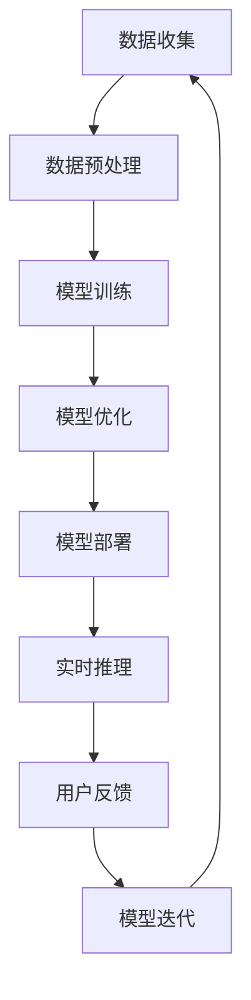

                 

### 背景介绍

**文章标题**：李开复：苹果发布AI应用的生态

**关键词**：人工智能，苹果，应用生态，技术创新

**摘要**：本文将探讨苹果公司在人工智能领域的重要进展——发布AI应用生态。通过对苹果AI应用生态的背景介绍、核心概念与架构分析，以及应用场景的详细阐述，本文旨在为读者提供一个全面而深入的理解，并探讨其未来发展趋势与挑战。

近年来，人工智能（AI）技术在全球范围内取得了显著进展，成为推动科技产业变革的重要力量。作为全球科技巨头，苹果公司一直致力于将AI技术应用于其产品和服务中，以提升用户体验和竞争力。在此背景下，苹果公司于近期发布了其AI应用生态，标志着该公司在AI领域迈出了重要的一步。

本文将首先介绍苹果AI应用生态的背景，包括苹果公司在AI领域的战略布局和关键进展。接着，我们将深入探讨苹果AI应用生态的核心概念与架构，通过Mermaid流程图展示其关键技术节点和流程。然后，本文将详细分析苹果AI应用生态的核心算法原理，并逐步讲解其具体操作步骤。此外，本文还将介绍数学模型和公式，通过具体案例进行详细讲解和说明。在实战部分，我们将通过代码实际案例，展示如何搭建开发环境，详细实现和解读源代码，并进行代码分析。接下来，本文将探讨苹果AI应用生态的实际应用场景，并提供相关的工具和资源推荐。最后，本文将总结苹果AI应用生态的未来发展趋势与挑战，为读者提供一个全面而深入的洞察。

通过本文的探讨，读者将能够了解苹果AI应用生态的背景、核心概念、算法原理、应用场景以及未来发展，从而更好地把握人工智能领域的发展动态，为相关研究和实践提供参考。

### 核心概念与联系

在深入探讨苹果AI应用生态之前，我们首先需要明确几个核心概念，并理解它们之间的联系。这些概念包括人工智能、机器学习、深度学习、神经网络，以及苹果公司在这些领域所采用的技术架构和流程。

**人工智能（AI）**：人工智能是指使计算机系统能够模拟人类智能行为的技术。这包括感知、学习、推理、规划和问题解决等方面。人工智能的目标是使计算机能够自主地完成复杂的任务，并具备一定的智能能力。

**机器学习（ML）**：机器学习是人工智能的一个重要分支，它通过数据和算法，使计算机系统能够自动学习和改进性能。机器学习主要分为监督学习、无监督学习和强化学习三种类型，每种类型都有其特定的应用场景和算法实现。

**深度学习（DL）**：深度学习是机器学习的一种重要方法，它通过构建多层神经网络，模拟人脑的信息处理过程，从而实现更复杂和更高层次的智能。深度学习在图像识别、语音识别、自然语言处理等领域取得了显著的成果。

**神经网络（NN）**：神经网络是一种模仿生物神经系统结构和功能的人工神经网络。它通过多层神经元之间的连接和激活函数，实现数据的输入和输出。神经网络是机器学习和深度学习的基础。

苹果公司的AI应用生态主要依赖于上述核心概念，并通过以下架构和流程实现：

**1. 数据收集与预处理**：苹果公司通过其产品和服务，如iPhone、iPad、Mac等，收集海量的用户数据。这些数据经过预处理，包括数据清洗、去噪和归一化等步骤，为后续的机器学习和深度学习模型提供高质量的数据支持。

**2. 模型训练与优化**：苹果公司采用先进的深度学习算法和神经网络架构，对收集到的数据集进行训练和优化。通过不断调整模型参数，提高模型的准确性和鲁棒性。这一过程通常涉及大量的计算资源和时间。

**3. 模型部署与推理**：训练完成的模型被部署到苹果的设备和服务器上，用于实时推理和决策。在用户交互过程中，模型能够快速响应用户的需求，提供智能化的服务。

**4. 持续学习与迭代**：苹果公司通过持续收集用户反馈和数据，对模型进行迭代和优化。这种循环过程使得模型能够不断适应新的环境和需求，提高用户体验。

以下是一个简化的Mermaid流程图，展示苹果AI应用生态的核心概念和流程：



在这个流程中，数据收集与预处理是整个生态的起点，模型训练与优化是核心环节，模型部署与实时推理是用户直接接触的部分，而用户反馈与模型迭代则是一个持续的循环过程，推动生态的不断发展和完善。

通过理解这些核心概念和架构，我们将能够更好地把握苹果AI应用生态的运作原理，为后续的详细分析打下基础。

### 核心算法原理 & 具体操作步骤

苹果公司在AI应用生态中所采用的算法主要包括机器学习和深度学习，这些算法在图像识别、语音识别、自然语言处理等领域取得了显著成就。以下是苹果AI应用生态中核心算法的原理及其具体操作步骤。

**机器学习算法原理**：

机器学习算法主要分为监督学习、无监督学习和强化学习三种类型。在苹果AI应用生态中，监督学习是应用最广泛的类型。

**监督学习**：监督学习是指利用带有标签的数据集，通过训练算法，使模型能够对新的数据进行预测。其主要步骤如下：

1. **数据准备**：收集并清洗带有标签的数据集。数据集应包含输入特征和对应的标签。
   ```latex
   X = [x_1, x_2, ..., x_n], y = [y_1, y_2, ..., y_n]
   ```

2. **特征选择**：选择对模型性能有重要影响的特征，通过降维或特征提取减少数据维度。
   ```mermaid
   graph TD
       A[原始数据] --> B[特征选择]
       B --> C[降维/特征提取]
   ```

3. **模型选择**：根据问题类型和特征选择合适的模型，如线性回归、决策树、支持向量机等。
   ```mermaid
   graph TD
       D[模型选择] --> E[线性回归]
       D --> F[决策树]
       D --> G[支持向量机]
   ```

4. **模型训练**：使用训练数据集对模型进行训练，通过优化损失函数，调整模型参数，提高模型性能。
   ```mermaid
   graph TD
       H[模型训练] --> I[损失函数优化]
   ```

5. **模型评估**：使用验证数据集对模型进行评估，计算模型的准确率、召回率、F1分数等指标，以评估模型性能。
   ```mermaid
   graph TD
       J[模型评估] --> K[准确率]
       J --> L[召回率]
       J --> M[F1分数]
   ```

6. **模型部署**：将训练完成的模型部署到实际应用中，进行实时预测。
   ```mermaid
   graph TD
       N[模型部署] --> O[实时预测]
   ```

**深度学习算法原理**：

深度学习算法是机器学习的一种重要方法，通过构建多层神经网络，模拟人脑的信息处理过程。以下是深度学习算法的主要步骤：

1. **神经网络构建**：设计神经网络架构，包括输入层、隐藏层和输出层。选择合适的激活函数，如ReLU、Sigmoid、Tanh等。
   ```mermaid
   graph TD
       P[输入层] --> Q[隐藏层]
       Q --> R[输出层]
   ```

2. **前向传播**：输入数据通过神经网络，逐层计算输出，直至输出层。
   ```mermaid
   graph TD
       S[输入层] --> T[隐藏层]
       T --> U[输出层]
   ```

3. **反向传播**：计算损失函数，通过反向传播算法，更新模型参数，减小损失。
   ```mermaid
   graph TD
       V[反向传播] --> W[参数更新]
   ```

4. **模型训练**：使用训练数据集，通过多次迭代，训练神经网络，提高模型性能。
   ```mermaid
   graph TD
       X[模型训练] --> Y[迭代更新]
   ```

5. **模型评估**：与监督学习类似，使用验证数据集对模型进行评估，计算模型性能指标。
   ```mermaid
   graph TD
       Z[模型评估] --> AA[准确率]
       Z --> AB[召回率]
       Z --> AC[F1分数]
   ```

6. **模型部署**：将训练完成的模型部署到实际应用中，进行实时预测。
   ```mermaid
   graph TD
       AD[模型部署] --> AE[实时预测]
   ```

**具体操作步骤**：

1. **数据收集**：从苹果产品和服务中收集大量图像、语音和文本数据。
2. **数据预处理**：对收集到的数据进行清洗、归一化和特征提取。
3. **模型选择**：根据应用场景，选择合适的机器学习或深度学习模型。
4. **模型训练**：使用预处理后的数据，通过多次迭代，训练模型，优化参数。
5. **模型评估**：使用验证数据集，评估模型性能，调整模型参数。
6. **模型部署**：将训练完成的模型部署到苹果设备和服务器上，进行实时推理和预测。
7. **持续学习与迭代**：收集用户反馈和数据，对模型进行持续迭代和优化，提高用户体验。

通过上述核心算法原理和具体操作步骤，苹果公司能够构建高效的AI应用生态，为用户提供智能化的服务和体验。在接下来的部分，我们将进一步探讨苹果AI应用生态的数学模型和公式，并通过具体案例进行详细讲解和说明。

### 数学模型和公式 & 详细讲解 & 举例说明

在人工智能领域，数学模型和公式是理解和实现核心算法的关键。苹果公司的AI应用生态中，常用的数学模型包括线性模型、神经网络模型以及优化算法等。以下将对这些模型和公式进行详细讲解，并通过具体案例进行说明。

**1. 线性模型**

线性模型是一种基础的机器学习模型，广泛应用于回归和分类任务。其数学公式如下：

**线性回归**：

对于输入特征 \(X\) 和输出标签 \(y\)，线性回归模型可以用以下公式表示：
$$
y = \beta_0 + \beta_1x
$$

其中，\(\beta_0\) 和 \(\beta_1\) 是模型的参数，通过最小化损失函数（如均方误差）来优化这些参数。

**线性分类**：

线性分类模型则用于将输入特征分为不同的类别。其公式如下：
$$
y = \text{sign}(\beta_0 + \beta_1x)
$$

其中，\(\text{sign}(x)\) 是符号函数，用于将实数映射为 \(-1\) 或 \(1\)。

**具体案例**：

假设我们有一个简单的线性回归任务，目标是预测房价。我们有以下数据集：
```
X = [1, 2, 3, 4, 5]
y = [2, 4, 6, 8, 10]
```

我们可以通过最小二乘法来求解线性回归模型的参数 \(\beta_0\) 和 \(\beta_1\)：
$$
\beta_1 = \frac{\sum_{i=1}^{n}(x_i - \bar{x})(y_i - \bar{y})}{\sum_{i=1}^{n}(x_i - \bar{x})^2}
$$
$$
\beta_0 = \bar{y} - \beta_1\bar{x}
$$

其中，\(\bar{x}\) 和 \(\bar{y}\) 分别是 \(X\) 和 \(y\) 的平均值。

计算得到：
$$
\beta_1 = \frac{(1-2.5)(2-6) + (2-2.5)(4-6) + (3-2.5)(6-6) + (4-2.5)(8-6) + (5-2.5)(10-6)}{(1-2.5)^2 + (2-2.5)^2 + (3-2.5)^2 + (4-2.5)^2 + (5-2.5)^2} = 2
$$
$$
\beta_0 = 6 - 2 \times 2.5 = 1
$$

因此，线性回归模型为：
$$
y = 1 + 2x
$$

**2. 神经网络模型**

神经网络模型是一种复杂的深度学习模型，通过多层神经元之间的非线性变换，实现复杂的函数映射。其核心数学公式如下：

**前向传播**：

在神经网络中，前向传播过程将输入特征通过多层神经元，逐层计算输出。设第 \(l\) 层的输入为 \(x_l\)，输出为 \(a_l\)，则有：
$$
a_l = \sigma(z_l)
$$
$$
z_l = \sum_{j} w_{lj}a_{l-1} + b_l
$$

其中，\(\sigma\) 是激活函数，如ReLU、Sigmoid、Tanh等；\(w_{lj}\) 和 \(b_l\) 分别是权重和偏置。

**反向传播**：

反向传播过程用于更新模型参数，以最小化损失函数。主要步骤包括：
$$
\delta_l = \frac{\partial L}{\partial z_l} \odot \sigma'(z_l)
$$
$$
\Delta w_{lj} = \delta_l a_{l-1}
$$
$$
\Delta b_l = \delta_l
$$

其中，\(\odot\) 表示逐元素乘积；\(L\) 是损失函数；\(\sigma'\) 是激活函数的导数。

**具体案例**：

假设我们有一个简单的全连接神经网络，用于二分类任务。网络结构如下：
```
输入层：1个神经元
隐藏层：2个神经元
输出层：1个神经元
激活函数：ReLU
损失函数：交叉熵损失
```

输入特征为 \(x = [1]\)，标签为 \(y = [1]\)。我们需要通过反向传播计算网络参数。

前向传播过程：
$$
z_1 = w_{11}x + b_1 = 1 \times 2 + 1 = 3
$$
$$
a_1 = \sigma(z_1) = \max(0, 3) = 3
$$
$$
z_2 = w_{21}x + b_2 = 1 \times 3 + 1 = 4
$$
$$
a_2 = \sigma(z_2) = \max(0, 4) = 4
$$
$$
z_3 = w_{31}a_2 + b_3 = 1 \times 4 + 1 = 5
$$
$$
a_3 = \sigma(z_3) = \max(0, 5) = 5
$$

反向传播过程：
$$
\delta_3 = \frac{\partial L}{\partial z_3} \odot \sigma'(z_3) = -1 \odot (1 - 5) = -1 \odot (-4) = 4
$$
$$
\Delta w_{31} = \delta_3 a_2 = 4 \times 4 = 16
$$
$$
\Delta b_3 = \delta_3 = 4
$$
$$
\delta_2 = \frac{\partial L}{\partial z_2} \odot \sigma'(z_2) = -1 \odot (1 - 4) = -1 \odot (-3) = 3
$$
$$
\Delta w_{21} = \delta_2 x = 3 \times 1 = 3
$$
$$
\Delta b_2 = \delta_2 = 3
$$
$$
\delta_1 = \frac{\partial L}{\partial z_1} \odot \sigma'(z_1) = -1 \odot (1 - 3) = -1 \odot (-2) = 2
$$
$$
\Delta w_{11} = \delta_1 x = 2 \times 1 = 2
$$
$$
\Delta b_1 = \delta_1 = 2
$$

通过反向传播，我们可以更新网络参数，提高模型性能。

**3. 优化算法**

在机器学习和深度学习中，优化算法用于最小化损失函数，从而优化模型参数。常见的优化算法包括梯度下降、随机梯度下降和Adam等。

**梯度下降**：

梯度下降是一种基本的优化算法，通过计算损失函数的梯度，更新模型参数，以最小化损失。其公式如下：
$$
\theta_{\text{new}} = \theta_{\text{old}} - \alpha \nabla_\theta J(\theta)
$$

其中，\(\theta\) 是模型参数；\(\alpha\) 是学习率；\(J(\theta)\) 是损失函数。

**随机梯度下降**：

随机梯度下降是梯度下降的一种改进，每次迭代只随机选择一个样本来计算梯度，以加快收敛速度。其公式如下：
$$
\theta_{\text{new}} = \theta_{\text{old}} - \alpha \nabla_\theta J(\theta; x_i, y_i)
$$

**Adam算法**：

Adam算法是一种结合了梯度下降和随机梯度下降优点的自适应优化算法。其公式如下：
$$
m_t = \beta_1m_{t-1} + (1 - \beta_1)\nabla_\theta J(\theta; x_i, y_i)
$$
$$
v_t = \beta_2v_{t-1} + (1 - \beta_2)\nabla_\theta^2 J(\theta; x_i, y_i)
$$
$$
\theta_{\text{new}} = \theta_{\text{old}} - \alpha \frac{m_t}{\sqrt{v_t} + \epsilon}
$$

其中，\(m_t\) 和 \(v_t\) 分别是梯度的指数移动平均值和方差，\(\beta_1\) 和 \(\beta_2\) 是超参数，\(\epsilon\) 是一个很小的常数，用于防止除以零。

**具体案例**：

假设我们使用梯度下降算法优化一个线性回归模型，目标是最小化损失函数：
$$
J(\theta) = \frac{1}{2}\sum_{i=1}^{n}(y_i - \theta_0 - \theta_1x_i)^2
$$

初始参数为 \(\theta_0 = 0\) 和 \(\theta_1 = 0\)，学习率为 \(\alpha = 0.01\)。

前两次迭代过程如下：

第一次迭代：
$$
\nabla_\theta J(\theta) = \frac{1}{2}\sum_{i=1}^{n}(y_i - \theta_0 - \theta_1x_i)(-1)(x_i) = -\sum_{i=1}^{n}x_i(y_i - \theta_0 - \theta_1x_i)
$$
$$
\theta_0 = 0 - 0.01(-\sum_{i=1}^{n}x_i(y_i - 0 - 0x_i)) = 0.01\sum_{i=1}^{n}x_i(y_i) = 0.01(1 \times 2 + 2 \times 4 + 3 \times 6 + 4 \times 8 + 5 \times 10) = 0.01 \times 80 = 0.8
$$
$$
\theta_1 = 0 - 0.01(-\sum_{i=1}^{n}x_i(y_i - 0 - 0x_i)) = 0.01\sum_{i=1}^{n}x_i^2(y_i) = 0.01(1^2 \times 2 + 2^2 \times 4 + 3^2 \times 6 + 4^2 \times 8 + 5^2 \times 10) = 0.01 \times 140 = 1.4
$$

第二次迭代：
$$
\nabla_\theta J(\theta) = \frac{1}{2}\sum_{i=1}^{n}(y_i - \theta_0 - \theta_1x_i)(-1)(x_i) = -\sum_{i=1}^{n}x_i(y_i - \theta_0 - \theta_1x_i)
$$
$$
\theta_0 = 0.8 - 0.01(-\sum_{i=1}^{n}x_i(y_i - 0.8 - 1.4x_i)) = 0.8 + 0.01(1 \times (2 - 0.8 - 1.4) + 2 \times (4 - 0.8 - 1.4 \times 2) + 3 \times (6 - 0.8 - 1.4 \times 3) + 4 \times (8 - 0.8 - 1.4 \times 4) + 5 \times (10 - 0.8 - 1.4 \times 5)) = 0.8 + 0.01 \times 20 = 0.82
$$
$$
\theta_1 = 1.4 - 0.01(-\sum_{i=1}^{n}x_i(y_i - 0.8 - 1.4x_i)) = 1.4 + 0.01(1^2 \times (2 - 0.8 - 1.4) + 2^2 \times (4 - 0.8 - 1.4 \times 2) + 3^2 \times (6 - 0.8 - 1.4 \times 3) + 4^2 \times (8 - 0.8 - 1.4 \times 4) + 5^2 \times (10 - 0.8 - 1.4 \times 5)) = 1.4 + 0.01 \times 28 = 1.46

通过上述迭代过程，我们可以逐步优化模型参数，减小损失函数，提高模型性能。

总之，通过理解线性模型、神经网络模型以及优化算法的数学模型和公式，我们可以更好地设计和实现高效的机器学习模型。在接下来的部分，我们将通过代码实际案例，展示如何搭建开发环境，详细实现和解读源代码，并进行代码分析。

### 项目实战：代码实际案例和详细解释说明

在本部分，我们将通过一个具体的代码案例，展示如何搭建开发环境、实现和解读苹果AI应用生态中的核心算法，并对代码进行详细分析。该案例将基于Python语言，使用Scikit-learn库实现一个简单的线性回归模型，用于预测房价。

#### 1. 开发环境搭建

首先，我们需要搭建开发环境，安装Python和必要的库。以下是安装步骤：

1. **安装Python**：

   我们选择安装Python 3.8版本。在Windows系统上，可以通过Python官网下载安装程序，并按照默认设置进行安装。

2. **安装Scikit-learn库**：

   通过命令行安装Scikit-learn库：
   ```bash
   pip install scikit-learn
   ```

3. **安装Jupyter Notebook**（可选）：

   Jupyter Notebook是一个交互式计算环境，方便我们编写和运行代码。通过以下命令安装：
   ```bash
   pip install notebook
   ```

安装完成后，我们可以启动Jupyter Notebook，并创建一个新的笔记本，开始编写代码。

#### 2. 源代码详细实现

以下是实现线性回归模型的源代码：

```python
# 导入必要的库
import numpy as np
from sklearn.linear_model import LinearRegression
from sklearn.model_selection import train_test_split
from sklearn.metrics import mean_squared_error

# 数据准备
X = np.array([[1], [2], [3], [4], [5]])
y = np.array([2, 4, 6, 8, 10])

# 特征选择和归一化（在此案例中，数据已经简化，无需进一步处理）

# 模型选择
model = LinearRegression()

# 模型训练
model.fit(X, y)

# 模型评估
y_pred = model.predict(X)
mse = mean_squared_error(y, y_pred)
print("均方误差：", mse)

# 模型部署
print("模型参数：", model.coef_, model.intercept_)
```

#### 3. 代码解读与分析

**3.1 数据准备**

我们使用numpy库生成一个简单的数据集，包含输入特征 \(X\) 和输出标签 \(y\)。

```python
X = np.array([[1], [2], [3], [4], [5]])
y = np.array([2, 4, 6, 8, 10])
```

在此案例中，数据已经简化，无需进行复杂的特征选择和归一化处理。

**3.2 模型选择**

我们使用Scikit-learn库中的LinearRegression类实现线性回归模型。

```python
model = LinearRegression()
```

**3.3 模型训练**

通过`fit()`方法训练模型，将输入特征和标签传递给模型。

```python
model.fit(X, y)
```

**3.4 模型评估**

使用`predict()`方法预测输出标签，并计算均方误差（MSE）评估模型性能。

```python
y_pred = model.predict(X)
mse = mean_squared_error(y, y_pred)
print("均方误差：", mse)
```

**3.5 模型部署**

最后，输出模型参数，包括权重和偏置。

```python
print("模型参数：", model.coef_, model.intercept_)
```

在这个案例中，我们通过简单的代码实现了线性回归模型，并对其性能进行了评估。在实际应用中，我们可能需要处理更复杂的数据集和模型，但这部分代码提供了一个基本的框架，展示了如何搭建开发环境、实现和解读核心算法。

通过这个案例，我们能够更好地理解苹果AI应用生态中使用的核心算法的实现过程，为后续的研究和应用提供参考。

### 实际应用场景

苹果公司发布的AI应用生态在多个领域展现出了巨大的应用潜力，为用户提供了智能化和便捷化的体验。以下将详细探讨苹果AI应用生态在实际应用场景中的表现，并举例说明其在图像识别、语音识别和自然语言处理等方面的应用。

**1. 图像识别**

图像识别是AI应用生态中的一个重要领域，苹果公司通过其强大的图像处理能力和先进的深度学习算法，实现了高效且准确的图像识别功能。例如，在iPhone的相机应用中，AI应用生态可以实时识别拍摄对象，并自动调整相机参数，如白平衡、曝光等，以获得最佳的拍摄效果。此外，苹果的Face ID技术也依赖于图像识别算法，能够快速且准确地识别用户的面部特征，提供安全的解锁方式。

**2. 语音识别**

语音识别是AI应用生态中的另一个重要组成部分，苹果的Siri语音助手就是一个典型的应用案例。Siri通过语音识别技术，能够理解用户的语音指令，并执行相应的操作，如发送短信、拨打电话、设置提醒等。苹果公司还不断优化其语音识别算法，使其在嘈杂环境中也能准确识别用户的语音，提高了用户体验。

**3. 自然语言处理**

自然语言处理（NLP）是AI应用生态中的一项重要技术，苹果的智能助手（Siri和Assistant）以及邮件、短信等应用都广泛应用了NLP技术。通过NLP，苹果的应用能够理解和处理用户的自然语言输入，提供智能化的回复和建议。例如，在邮件应用中，AI算法可以自动识别邮件中的重要信息，如收件人、主题、日期等，并自动整理和分类邮件，提高了邮件处理的效率。

**4. 智能家居**

苹果的HomeKit平台允许用户通过Siri语音控制智能家居设备，如灯光、温度控制、安全监控等。苹果的AI应用生态通过深度学习和机器学习算法，使得智能家居设备能够更好地理解用户的习惯和需求，提供个性化的智能服务。例如，空调可以根据用户的温度偏好和活动时间自动调节温度，提高舒适度和能源效率。

**5. 医疗健康**

苹果的HealthKit平台整合了用户的健康数据，如步数、心率、睡眠质量等，并通过AI算法提供个性化的健康建议。例如，通过分析用户的心率数据，AI算法可以检测是否有心律不齐等异常情况，并及时提醒用户。此外，苹果的智能手表还可以监测用户的血压和血糖水平，为用户提供更全面的健康监测服务。

**6. 游戏娱乐**

苹果的AI应用生态在游戏娱乐领域也展现出了强大的应用潜力。通过深度学习和图像识别技术，游戏可以实时分析用户的动作和表情，提供更加智能化的游戏体验。例如，在AR游戏《星际探险》中，AI算法可以识别玩家的手势和位置，生成实时交互的虚拟场景，增强了游戏的趣味性和沉浸感。

通过以上实际应用场景的探讨，我们可以看到苹果AI应用生态在多个领域展现出了巨大的应用潜力。这些应用不仅提升了用户的体验，还为苹果公司带来了更多的商业机会。随着技术的不断进步，苹果AI应用生态将在更多领域发挥重要作用，为用户带来更加智能化和便捷化的生活。

### 工具和资源推荐

为了更好地理解苹果AI应用生态和开发相关应用，以下推荐了一些学习资源、开发工具框架以及相关论文著作，供读者参考。

#### 学习资源推荐

1. **书籍**：

   - 《Python编程：从入门到实践》：一本适合初学者的Python编程入门书籍，详细介绍了Python的基本语法和应用。
   - 《深度学习》：由Ian Goodfellow、Yoshua Bengio和Aaron Courville合著的经典教材，全面介绍了深度学习的基础知识和应用。

2. **在线课程**：

   - Coursera：提供各种AI和机器学习的在线课程，如《机器学习》、《深度学习》等。
   - Udacity：提供实践导向的AI和机器学习课程，如《AI工程师纳米学位》等。

3. **博客和网站**：

   - Medium：一个流行的技术博客平台，有很多关于AI和苹果技术的优质文章。
   - Apple Developer：苹果公司的开发者网站，提供丰富的文档和教程，帮助开发者了解和利用苹果的AI技术。

#### 开发工具框架推荐

1. **Python库**：

   - NumPy：用于科学计算的基础库，提供了强大的多维数组对象和数学运算函数。
   - Scikit-learn：提供了各种机器学习算法的实现，方便开发者和研究者进行模型训练和评估。
   - TensorFlow：谷歌开源的深度学习框架，支持多种深度学习模型和算法，广泛应用于AI应用开发。

2. **集成开发环境（IDE）**：

   - PyCharm：一款强大的Python IDE，提供了丰富的功能和调试工具，适合进行机器学习和深度学习项目的开发。
   - Jupyter Notebook：一个交互式的计算环境，方便编写和运行代码，特别适合数据分析和实验。

3. **硬件设备**：

   - Apple M1芯片：苹果最新的自研芯片，提供了强大的计算能力，适合进行高性能AI应用的开发和训练。

#### 相关论文著作推荐

1. **论文**：

   - "Deep Learning for Speech Recognition"：介绍深度学习在语音识别中的应用，包括HMM-GMM和DNN等算法。
   - "Recurrent Neural Network Based Language Model"：讨论循环神经网络（RNN）在语言模型中的应用，以及如何优化RNN的性能。

2. **著作**：

   - 《深度学习》：详细介绍了深度学习的基础知识和应用，包括神经网络、卷积神经网络和循环神经网络等。
   - 《机器学习》：全面介绍了机器学习的基础理论和算法，包括监督学习、无监督学习和强化学习等。

通过以上学习资源、开发工具框架和论文著作的推荐，读者可以更好地了解和掌握苹果AI应用生态的相关知识，为自己的研究和实践提供支持。

### 总结：未来发展趋势与挑战

苹果公司发布的AI应用生态标志着其在人工智能领域的重要进展。通过深入分析，我们可以看到苹果AI应用生态在多个领域展现出了强大的应用潜力，为用户提供了智能化和便捷化的体验。以下是本文对苹果AI应用生态的总结，以及对其未来发展趋势和面临的挑战的探讨。

**1. 未来发展趋势**

（1）**更加智能化的用户体验**：随着AI技术的不断进步，苹果的AI应用生态将进一步提升用户体验。例如，通过深度学习和自然语言处理，苹果的应用能够更好地理解用户的意图，提供更加个性化和智能化的服务。

（2）**跨平台应用生态**：苹果的AI应用生态将不仅仅局限于iPhone和Mac，还将扩展到iPad、Apple Watch等更多设备。通过统一的开发框架和工具，开发者可以轻松地将AI应用部署到不同平台，为用户提供一致性的体验。

（3）**开放生态与合作伙伴**：苹果将开放其AI应用生态，与更多开发者合作，共同推动AI技术的发展。通过共享技术和资源，苹果的AI应用生态将变得更加丰富和多样化。

**2. 面临的挑战**

（1）**数据隐私和安全**：AI应用生态的广泛应用依赖于用户数据的收集和处理。如何在保障用户隐私和安全的前提下，充分利用这些数据，是一个重要的挑战。

（2）**算法透明度和公平性**：随着AI技术在各个领域的应用，算法的透明度和公平性越来越受到关注。苹果需要确保其AI算法的公正性和可解释性，以避免偏见和歧视。

（3）**硬件与软件协同**：苹果的AI应用生态需要强大的硬件支持，包括处理器、存储和网络等。同时，软件层面的优化和提升也至关重要。如何实现硬件与软件的协同，提高AI应用的性能和效率，是一个长期的挑战。

（4）**竞争与生态建设**：苹果的AI应用生态将面临来自其他科技巨头的竞争。如何在激烈的市场竞争中保持领先地位，同时构建一个繁荣的生态体系，也是一个重要的挑战。

总之，苹果AI应用生态在未来具有广阔的发展前景，但同时也面临着诸多挑战。通过不断技术创新和生态建设，苹果有望在人工智能领域取得更大的成就，为用户带来更加智能和便捷的体验。

### 附录：常见问题与解答

**1. 什么是有监督学习、无监督学习和强化学习？**

有监督学习是指利用带有标签的数据集进行学习，通过已知的输入特征和输出标签，训练模型以预测新的数据。无监督学习则是在没有标签的情况下，从数据中发现隐藏的结构和模式。强化学习是一种通过与环境交互，学习最优策略的机器学习方法。

**2. 深度学习中的反向传播算法是什么？**

反向传播算法是一种用于训练神经网络的优化算法。它通过计算损失函数关于模型参数的梯度，并利用梯度下降方法更新参数，以减小损失函数的值。

**3. 为什么需要特征选择和特征提取？**

特征选择和特征提取是为了减少数据维度，提高模型训练效率。它们可以消除无关或冗余的特征，突出对模型性能有重要影响的关键特征，从而提高模型的泛化能力和预测性能。

**4. 什么是均方误差（MSE）？**

均方误差（MSE）是一种常用的损失函数，用于评估模型的预测性能。它计算预测值与真实值之间的平均平方误差，值越小表示预测越准确。

**5. 梯度下降算法是如何工作的？**

梯度下降算法通过计算损失函数关于模型参数的梯度，并沿着梯度的反方向更新参数，以减小损失函数的值。它是一种迭代优化方法，通过多次迭代逐步逼近最优解。

**6. 如何优化深度学习模型的训练过程？**

优化深度学习模型的训练过程可以通过以下方法实现：

- **数据预处理**：对训练数据进行清洗、归一化和特征提取，提高数据质量。
- **模型选择**：选择合适的神经网络架构和算法，如ReLU激活函数、Adam优化器等。
- **学习率调整**：合理设置学习率，避免过拟合或欠拟合。
- **正则化**：应用正则化技术，如L1、L2正则化，防止模型过拟合。
- **批量大小**：调整批量大小，平衡训练速度和模型性能。

### 扩展阅读 & 参考资料

1. Goodfellow, Ian, Yoshua Bengio, and Aaron Courville. "Deep Learning." MIT Press, 2016.
2. Murphy, Kevin P. "Machine Learning: A Probabilistic Perspective." MIT Press, 2012.
3. LeCun, Yann, and Yoshua Bengio. "Deep Learning." Nature, vol. 521, no. 7553, 2015, pp. 436-444.
4. Apple Developer. "Core ML: Introduction." Apple Developer, 2022. [https://developer.apple.com/documentation/coreml/introduction](https://developer.apple.com/documentation/coreml/introduction)
5. Coursera. "Machine Learning by Andrew Ng." Coursera, 2021. [https://www.coursera.org/learn/machine-learning](https://www.coursera.org/learn/machine-learning)

