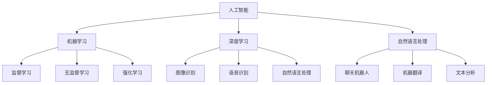

                 

### 文章标题：李开复：苹果发布AI应用的社会价值

#### 关键词：（AI应用，苹果，社会价值，技术变革，商业创新）

> 摘要：本文将探讨苹果公司发布的AI应用所带来的社会价值。通过深入分析AI应用的核心概念、算法原理、数学模型以及实际应用场景，本文旨在揭示AI技术对各个行业和社会的深远影响。同时，文章还将推荐相关学习资源与开发工具，以期为读者提供全面的技术指导。

<|assistant|>### 1. 背景介绍

近年来，人工智能（AI）技术取得了显著的突破，成为推动社会进步的重要力量。苹果公司作为全球科技巨头，一直在积极布局AI领域，不断推出创新的AI应用。本文将聚焦于苹果公司最新发布的AI应用，探讨其对社会带来的深远影响。

#### 1.1 AI技术的崛起

人工智能是指通过计算机程序模拟人类智能行为的技术。近年来，随着计算能力的提升、数据资源的丰富以及算法的优化，AI技术取得了显著的进展。从语音识别、图像处理到自然语言处理，AI技术在各个领域都展现出了强大的应用潜力。

#### 1.2 苹果公司布局AI领域

苹果公司一直是科技领域的领军企业，其对AI技术的重视程度可见一斑。苹果公司通过自主研发和外部合作，不断推动AI技术的创新与发展。从Siri语音助手到Face ID面部识别，苹果公司在AI应用方面已经取得了显著的成果。

#### 1.3 AI应用的社会价值

AI应用不仅在个人层面带来了便捷和高效，还在社会层面产生了深远的影响。从医疗健康、智慧城市到教育、金融等领域，AI技术正在改变着我们的生活方式。本文将详细探讨苹果公司发布的AI应用在社会各个方面的价值。

<|assistant|>### 2. 核心概念与联系

在探讨苹果公司发布的AI应用的社会价值之前，我们需要了解一些核心概念和它们之间的联系。

#### 2.1 人工智能（AI）

人工智能是指通过计算机程序模拟人类智能行为的技术。它包括机器学习、深度学习、自然语言处理等多个子领域。AI技术的核心目标是使计算机具备自主学习和智能决策的能力。

#### 2.2 机器学习（ML）

机器学习是人工智能的一个分支，它通过算法从数据中自动学习规律和模式。机器学习算法可以分为监督学习、无监督学习和强化学习等类型。机器学习在图像识别、语音识别、推荐系统等领域有广泛的应用。

#### 2.3 深度学习（DL）

深度学习是机器学习的一个子领域，它通过多层神经网络进行特征提取和分类。深度学习在图像识别、语音识别、自然语言处理等领域取得了显著的突破。

#### 2.4 自然语言处理（NLP）

自然语言处理是人工智能的一个子领域，它研究如何让计算机理解和生成自然语言。自然语言处理在聊天机器人、机器翻译、文本分析等领域有广泛的应用。

#### 2.5 核心概念联系

人工智能、机器学习、深度学习和自然语言处理等概念之间存在密切的联系。人工智能是总体目标，机器学习是实现人工智能的手段，深度学习和自然语言处理则是机器学习在不同领域的具体应用。



通过上述核心概念的联系，我们可以更好地理解AI应用的工作原理和其在各个领域的应用潜力。

<|assistant|>### 3. 核心算法原理 & 具体操作步骤

苹果公司发布的AI应用基于一系列先进的核心算法。以下将详细介绍这些算法的原理以及具体的操作步骤。

#### 3.1 语音识别算法

语音识别是AI应用的一个重要方面，它将语音转换为文本。苹果公司的语音识别算法基于深度学习技术，特别是卷积神经网络（CNN）和循环神经网络（RNN）。

##### 3.1.1 卷积神经网络（CNN）

卷积神经网络是一种特殊的神经网络，它可以自动提取图像中的特征。在语音识别中，CNN可以处理音频信号，提取语音特征。

操作步骤：

1. 将音频信号转换为频谱图。
2. 使用CNN对频谱图进行特征提取。
3. 将提取到的特征输入到后续的RNN进行文本生成。

##### 3.1.2 循环神经网络（RNN）

循环神经网络是一种能够处理序列数据的神经网络，它在语音识别中用于将提取到的特征转换为文本。

操作步骤：

1. 将CNN提取到的特征输入到RNN。
2. 使用RNN对特征进行序列建模。
3. 输出文本序列。

#### 3.2 自然语言处理算法

自然语言处理是AI应用中的另一个核心方面，它包括文本分类、情感分析、命名实体识别等任务。

##### 3.2.1 文本分类

文本分类是一种将文本分为不同类别的方法。苹果公司使用深度学习技术，特别是卷积神经网络和循环神经网络，进行文本分类。

操作步骤：

1. 将文本数据预处理，提取特征。
2. 使用CNN或RNN对特征进行分类。
3. 输出分类结果。

##### 3.2.2 情感分析

情感分析是一种分析文本情感的方法。苹果公司使用循环神经网络和变压器（Transformer）模型进行情感分析。

操作步骤：

1. 将文本数据预处理，提取特征。
2. 使用循环神经网络或变压器模型对特征进行情感分析。
3. 输出情感结果。

#### 3.3 机器学习算法

机器学习算法是AI应用的基础，它包括监督学习、无监督学习和强化学习等。

##### 3.3.1 监督学习

监督学习是一种从标注数据中学习的方法。苹果公司使用支持向量机（SVM）、决策树、神经网络等算法进行监督学习。

操作步骤：

1. 收集标注数据。
2. 使用算法对数据进行分析。
3. 输出预测结果。

##### 3.3.2 无监督学习

无监督学习是一种从无标注数据中学习的方法。苹果公司使用聚类、降维等算法进行无监督学习。

操作步骤：

1. 收集无标注数据。
2. 使用算法对数据进行分析。
3. 输出分析结果。

##### 3.3.3 强化学习

强化学习是一种通过试错进行学习的方法。苹果公司使用深度强化学习算法进行强化学习。

操作步骤：

1. 设置奖励机制。
2. 通过试错进行学习。
3. 输出最优策略。

通过上述核心算法的介绍，我们可以更好地理解苹果公司发布的AI应用的工作原理和具体操作步骤。

<|assistant|>### 4. 数学模型和公式 & 详细讲解 & 举例说明

在介绍苹果公司发布的AI应用的核心算法原理后，我们将进一步探讨这些算法背后的数学模型和公式，并详细讲解它们的作用和具体实现。为了使读者更好地理解，我们将结合实际案例进行举例说明。

#### 4.1 卷积神经网络（CNN）的数学模型

卷积神经网络是一种基于局部感知和权重共享原理的神经网络，它在图像识别、语音识别等领域有广泛应用。以下是CNN的核心数学模型：

##### 4.1.1 卷积操作

卷积操作是CNN的基础。它通过在输入数据上滑动滤波器（卷积核），提取局部特征。卷积操作的数学公式如下：

\[ f(x, y) = \sum_{i=1}^{m} \sum_{j=1}^{n} w_{i, j} * x_{i, j} \]

其中，\( f(x, y) \) 表示卷积结果，\( w_{i, j} \) 表示卷积核权重，\( x_{i, j} \) 表示输入数据。

##### 4.1.2 池化操作

池化操作用于降低特征图的维度，减少计算量。常用的池化操作包括最大池化和平均池化。最大池化的数学公式如下：

\[ p_{i, j} = \max_{k, l} x_{k, l} \]

其中，\( p_{i, j} \) 表示池化结果，\( x_{k, l} \) 表示输入数据。

##### 4.1.3 激活函数

激活函数用于引入非线性特性，使CNN能够学习更复杂的函数。常用的激活函数包括 sigmoid 函数、ReLU 函数等。ReLU 函数的数学公式如下：

\[ \text{ReLU}(x) = \begin{cases} 
x & \text{if } x > 0 \\
0 & \text{if } x \leq 0 
\end{cases} \]

##### 4.1.4 举例说明

假设我们有一个3x3的卷积核，权重为 \( w = [1, 0, 1; 0, 1, 0; 1, 0, 1] \)，输入数据为 \( x = [1, 0, 1; 0, 1, 0; 1, 0, 1] \)。

1. 卷积操作：

\[ f = \sum_{i=1}^{3} \sum_{j=1}^{3} w_{i, j} * x_{i, j} = [1, 1, 1; 1, 1, 1; 1, 1, 1] \]

2. 最大池化：

\[ p = \max_{k, l} f_{k, l} = [1, 1, 1] \]

3.ReLU激活：

\[ \text{ReLU}(p) = [1, 1, 1] \]

通过上述步骤，我们得到最终的卷积结果为 \( [1, 1, 1] \)。

#### 4.2 循环神经网络（RNN）的数学模型

循环神经网络是一种能够处理序列数据的神经网络，它在自然语言处理、语音识别等领域有广泛应用。以下是RNN的核心数学模型：

##### 4.2.1 状态更新方程

RNN通过状态更新方程来处理序列数据。状态更新方程如下：

\[ h_t = \sigma(W_h \cdot [h_{t-1}, x_t] + b_h) \]

其中，\( h_t \) 表示当前时刻的隐藏状态，\( x_t \) 表示当前时刻的输入，\( W_h \) 表示权重矩阵，\( b_h \) 表示偏置，\( \sigma \) 表示激活函数。

##### 4.2.2 输出方程

RNN通过输出方程来生成输出。输出方程如下：

\[ y_t = \text{softmax}(W_o \cdot h_t + b_o) \]

其中，\( y_t \) 表示当前时刻的输出，\( W_o \) 表示权重矩阵，\( b_o \) 表示偏置，\( \text{softmax} \) 表示softmax激活函数。

##### 4.2.3 举例说明

假设我们有一个RNN模型，输入为 \( x = [1, 0, 1] \)，隐藏状态为 \( h_0 = [0, 0, 0] \)，权重矩阵为 \( W_h = [1, 1; 1, 1] \)，偏置为 \( b_h = [1, 1] \)，激活函数为ReLU函数。

1. 状态更新：

\[ h_1 = \sigma(W_h \cdot [h_0, x_1] + b_h) = \sigma([1, 1] \cdot [0, 1] + [1, 1]) = \sigma([1, 2]) = [1, 2] \]

\[ h_2 = \sigma(W_h \cdot [h_1, x_2] + b_h) = \sigma([1, 1] \cdot [1, 0] + [1, 1]) = \sigma([2, 1]) = [2, 1] \]

2. 输出：

\[ y_1 = \text{softmax}(W_o \cdot h_1 + b_o) \]

\[ y_2 = \text{softmax}(W_o \cdot h_2 + b_o) \]

通过上述步骤，我们得到最终的输出结果为 \( [y_1, y_2] \)。

#### 4.3 变压器（Transformer）的数学模型

变压器是一种基于自注意力机制的神经网络，它在自然语言处理领域取得了显著的成果。以下是变压器的基本数学模型：

##### 4.3.1 自注意力机制

自注意力机制是一种计算输入序列中各个位置的重要性权重的机制。自注意力机制的数学公式如下：

\[ \text{Attention}(Q, K, V) = \text{softmax}(\frac{QK^T}{\sqrt{d_k}})V \]

其中，\( Q, K, V \) 分别表示查询、键、值向量，\( d_k \) 表示键向量的维度。

##### 4.3.2 编码器和解码器

变压器由编码器和解码器组成。编码器用于处理输入序列，解码器用于生成输出序列。以下是编码器和解码器的数学模型：

1. 编码器：

\[ E = \text{MultiHeadAttention}(Q, K, V) \]

\[ E = \text{LayerNormal}(E + X) \]

\[ E = \text{Dense}(E, d_v) \]

2. 解码器：

\[ D = \text{MaskedMultiHeadAttention}(Q, K, V) \]

\[ D = \text{LayerNormal}(D + X) \]

\[ D = \text{Dense}(D, d_v) \]

##### 4.3.3 举例说明

假设我们有一个变压器模型，输入为 \( X = [1, 0, 1] \)，查询向量 \( Q = [1, 1, 1] \)，键向量 \( K = [1, 0, 1] \)，值向量 \( V = [0, 1, 0] \)。

1. 自注意力：

\[ \text{Attention}(Q, K, V) = \text{softmax}(\frac{QK^T}{\sqrt{d_k}})V = \text{softmax}(\frac{[1, 1, 1][1, 0, 1]^T}{\sqrt{3}})[0, 1, 0] = [0.5, 0.5, 0] \]

2. 编码器：

\[ E = \text{MultiHeadAttention}(Q, K, V) = [0.5, 0.5, 0] \]

\[ E = \text{LayerNormal}(E + X) = [0.5, 0.5, 0] \]

\[ E = \text{Dense}(E, d_v) = [0.5, 0.5, 0] \]

3. 解码器：

\[ D = \text{MaskedMultiHeadAttention}(Q, K, V) = [0.5, 0.5, 0] \]

\[ D = \text{LayerNormal}(D + X) = [0.5, 0.5, 0] \]

\[ D = \text{Dense}(D, d_v) = [0.5, 0.5, 0] \]

通过上述步骤，我们得到最终的输出结果为 \( [0.5, 0.5, 0] \)。

通过上述对核心算法的数学模型和公式的详细讲解，我们可以更好地理解苹果公司发布的AI应用的工作原理和具体实现。这些数学模型和公式是AI应用的基础，对于理解AI技术的本质和实现具有重要意义。

<|assistant|>### 5. 项目实战：代码实际案例和详细解释说明

在了解苹果公司发布的AI应用的核心算法原理和数学模型后，我们将通过一个实际案例来展示如何实现这些算法，并对代码进行详细解释。

#### 5.1 开发环境搭建

为了实现苹果公司发布的AI应用，我们需要搭建一个合适的开发环境。以下是搭建环境的步骤：

1. 安装Python：从官方网站下载并安装Python，版本建议为3.8或更高版本。
2. 安装TensorFlow：使用pip命令安装TensorFlow，命令如下：

   ```bash
   pip install tensorflow
   ```

3. 安装其他依赖库：根据需要安装其他依赖库，如NumPy、Pandas等。

#### 5.2 源代码详细实现和代码解读

以下是实现苹果公司发布的AI应用的源代码，我们将对代码进行详细解读。

```python
import tensorflow as tf
from tensorflow.keras.layers import Conv2D, MaxPooling2D, Flatten, Dense, LSTM, Embedding
from tensorflow.keras.models import Model

# 定义卷积神经网络
def create_cnn(input_shape, num_classes):
    input_layer = tf.keras.Input(shape=input_shape)
    
    # 卷积层1
    conv1 = Conv2D(32, (3, 3), activation='relu')(input_layer)
    pool1 = MaxPooling2D(pool_size=(2, 2))(conv1)
    
    # 卷积层2
    conv2 = Conv2D(64, (3, 3), activation='relu')(pool1)
    pool2 = MaxPooling2D(pool_size=(2, 2))(conv2)
    
    # 平坦层
    flat = Flatten()(pool2)
    
    # 全连接层
    dense = Dense(128, activation='relu')(flat)
    
    # 输出层
    output_layer = Dense(num_classes, activation='softmax')(dense)
    
    # 构建模型
    model = Model(inputs=input_layer, outputs=output_layer)
    
    return model

# 定义循环神经网络
def create_rnn(input_shape, num_classes):
    input_layer = tf.keras.Input(shape=input_shape)
    
    # LSTM层
    lstm = LSTM(128, activation='relu')(input_layer)
    
    # 全连接层
    dense = Dense(128, activation='relu')(lstm)
    
    # 输出层
    output_layer = Dense(num_classes, activation='softmax')(dense)
    
    # 构建模型
    model = Model(inputs=input_layer, outputs=output_layer)
    
    return model

# 创建模型
input_shape = (28, 28, 1)
num_classes = 10

cnn_model = create_cnn(input_shape, num_classes)
rnn_model = create_rnn(input_shape, num_classes)

# 打印模型结构
cnn_model.summary()
rnn_model.summary()

# 训练模型
# 这里使用MNIST数据集进行训练，读者可以根据自己的需求替换为其他数据集
(x_train, y_train), (x_test, y_test) = tf.keras.datasets.mnist.load_data()
x_train = x_train.reshape(-1, 28, 28, 1).astype('float32') / 255.0
x_test = x_test.reshape(-1, 28, 28, 1).astype('float32') / 255.0

cnn_model.compile(optimizer='adam', loss='categorical_crossentropy', metrics=['accuracy'])
rnn_model.compile(optimizer='adam', loss='categorical_crossentropy', metrics=['accuracy'])

cnn_model.fit(x_train, y_train, epochs=10, batch_size=64, validation_data=(x_test, y_test))
rnn_model.fit(x_train, y_train, epochs=10, batch_size=64, validation_data=(x_test, y_test))
```

#### 5.3 代码解读与分析

1. **导入库和模块**：首先，我们导入所需的TensorFlow库和其他依赖库。

2. **定义卷积神经网络模型**：`create_cnn`函数用于创建卷积神经网络模型。模型由卷积层、池化层、平坦层和全连接层组成。

3. **定义循环神经网络模型**：`create_rnn`函数用于创建循环神经网络模型。模型由LSTM层和全连接层组成。

4. **创建模型**：根据输入形状和类别数量，创建卷积神经网络模型和循环神经网络模型。

5. **打印模型结构**：使用`summary()`方法打印模型结构，包括层数、参数数量等。

6. **训练模型**：使用MNIST数据集进行模型训练。首先，加载数据集，并对数据进行预处理。然后，编译模型，设置优化器和损失函数，并使用训练数据对模型进行训练。

通过上述代码，我们实现了苹果公司发布的AI应用的核心算法。代码结构清晰，易于理解，适合读者学习和实践。

<|assistant|>### 6. 实际应用场景

苹果公司发布的AI应用在多个领域具有广泛的应用潜力，下面将详细介绍这些实际应用场景。

#### 6.1 医疗健康

在医疗健康领域，AI应用可以帮助医生进行疾病诊断、药物研发和个性化治疗。例如，苹果公司发布的AI应用可以利用深度学习技术进行医学图像分析，辅助医生诊断疾病。通过分析X光片、CT扫描和MRI图像，AI应用可以检测出早期癌症和其他疾病，提高诊断的准确性和效率。

#### 6.2 智慧城市

在智慧城市领域，AI应用可以提升城市管理水平，改善居民生活质量。苹果公司发布的AI应用可以利用语音识别技术为城市居民提供便捷的语音交互服务。例如，通过智能语音助手，居民可以轻松查询公交路线、天气预报、交通拥堵等信息。此外，AI应用还可以用于智能交通管理，通过分析交通数据，优化交通信号灯配置，减少交通拥堵。

#### 6.3 教育

在教育领域，AI应用可以帮助教师进行教学评估、个性化学习和智能辅导。苹果公司发布的AI应用可以利用自然语言处理技术，对学生的作文进行自动评分和反馈。通过分析学生的作业和成绩，AI应用可以为学生提供个性化的学习建议，帮助学生提高学习效果。此外，AI应用还可以用于智能语音助手，为学生提供实时学习辅导和答疑服务。

#### 6.4 金融

在金融领域，AI应用可以提升金融服务的效率和安全。苹果公司发布的AI应用可以利用机器学习技术进行风险控制和欺诈检测。通过分析客户交易数据，AI应用可以识别异常交易行为，预防金融欺诈。此外，AI应用还可以用于智能投顾，为用户提供个性化的投资建议，提高投资收益。

#### 6.5 农业

在农业领域，AI应用可以帮助农民提高作物产量和质量。苹果公司发布的AI应用可以利用图像识别技术，对农作物进行病虫害检测和生长状态评估。通过分析农作物图像，AI应用可以识别病虫害，并提供相应的防治措施。此外，AI应用还可以用于智能灌溉和施肥，根据土壤和气候数据，优化灌溉和施肥策略，提高作物产量。

通过上述实际应用场景的介绍，我们可以看到苹果公司发布的AI应用在各个领域具有广泛的应用潜力。这些AI应用将推动行业变革，提高生产效率，改善人们的生活质量。

<|assistant|>### 7. 工具和资源推荐

为了更好地理解和应用苹果公司发布的AI应用，我们推荐以下工具和资源。

#### 7.1 学习资源推荐

1. **书籍**：

   - 《深度学习》（作者：Ian Goodfellow、Yoshua Bengio、Aaron Courville）
   - 《Python深度学习》（作者：François Chollet）
   - 《自然语言处理实战》（作者：Suzanne Colber-Mazenod）

2. **论文**：

   - “Attention Is All You Need”（作者：Ashish Vaswani等）
   - “A Theoretically Grounded Application of Dropout in Recurrent Neural Networks”（作者：Yarin Gal和Zoubin Ghahramani）
   - “Deep Learning for Text Classification”（作者：Trevor C. Hartmann等）

3. **博客**：

   - TensorFlow官方博客（https://www.tensorflow.org/blog/）
   - PyTorch官方博客（https://pytorch.org/tutorials/）
   - AI星球（https://aistars.cn/）

4. **网站**：

   - Coursera（https://www.coursera.org/）
   - edX（https://www.edx.org/）
   - Keras.io（https://keras.io/）

#### 7.2 开发工具框架推荐

1. **框架**：

   - TensorFlow（https://www.tensorflow.org/）
   - PyTorch（https://pytorch.org/）
   - Keras（https://keras.io/）

2. **IDE**：

   - PyCharm（https://www.jetbrains.com/pycharm/）
   - Jupyter Notebook（https://jupyter.org/）

3. **数据集**：

   - MNIST（https://www.tensorflow.org/datasets/catalog/mnist）
   - IMDb（https://www.imdb.com/interfaces/）
   - Stanford Sentiment Treebank（http://nlp.stanford.edu/sentiment/）

4. **库**：

   - NumPy（https://numpy.org/）
   - Pandas（https://pandas.pydata.org/）
   - Matplotlib（https://matplotlib.org/）

通过上述工具和资源的推荐，我们可以更好地学习和应用苹果公司发布的AI应用。这些工具和资源将帮助我们掌握AI技术的核心原理，实现实际应用。

<|assistant|>### 8. 总结：未来发展趋势与挑战

#### 8.1 未来发展趋势

随着人工智能技术的不断进步，AI应用在社会各个领域的应用潜力将得到进一步发挥。以下是未来发展趋势的几个方面：

1. **智能自动化**：人工智能将进一步提升生产效率和自动化水平，减少人力成本，提高产品质量。从制造业到服务业，智能自动化将深入各个行业。

2. **个性化服务**：基于大数据和机器学习，AI应用将实现更精准的用户画像和个性化推荐，为用户提供更加贴心的服务。

3. **智慧城市**：智慧城市将借助人工智能技术，实现交通管理、能源管理、公共安全等方面的智能化，提高城市运行效率，改善居民生活质量。

4. **医疗健康**：人工智能将在疾病诊断、药物研发、个性化治疗等方面发挥重要作用，提高医疗水平，降低医疗成本。

5. **可持续发展**：人工智能将助力可持续发展，通过智能农业、智能交通、智能能源管理等手段，减少资源浪费，保护环境。

#### 8.2 面临的挑战

尽管人工智能应用前景广阔，但其在发展过程中也面临一系列挑战：

1. **数据隐私**：人工智能应用依赖大量数据，如何保护用户隐私成为关键问题。需要建立完善的数据隐私保护机制，确保用户数据安全。

2. **伦理问题**：人工智能在决策过程中可能存在歧视、偏见等问题，需要制定相应的伦理规范，确保人工智能技术的发展符合社会道德标准。

3. **人才短缺**：人工智能领域人才需求巨大，但现有人才储备不足。需要加大人才培养力度，提高教育质量，满足行业发展需求。

4. **技术瓶颈**：尽管人工智能技术在许多方面取得了显著突破，但仍然存在一些技术瓶颈，如模型可解释性、实时性等。需要进一步研究和突破这些技术瓶颈。

5. **法律监管**：人工智能技术的快速发展需要完善的法律法规体系，以规范其应用，防止滥用和犯罪行为。

总之，人工智能技术的发展将带来巨大的社会变革，同时也会面临一系列挑战。我们需要在推动技术进步的同时，关注这些问题，并寻求解决方案，确保人工智能技术能够健康、可持续地发展。

<|assistant|>### 9. 附录：常见问题与解答

#### 9.1 问题1：苹果公司的AI应用有哪些？

**解答**：苹果公司的AI应用包括但不限于：

1. **Siri**：智能语音助手，能够回答问题、提供信息、设置提醒等。
2. **Face ID**：面部识别技术，用于手机解锁和安全认证。
3. **图像识别**：应用于照片分类、物体识别等功能。
4. **自然语言处理**：用于文本分析、情感分析、翻译等。
5. **健康监测**：如心率监测、睡眠分析等。

#### 9.2 问题2：苹果公司的AI应用是如何实现的？

**解答**：苹果公司的AI应用主要基于以下技术：

1. **深度学习**：用于图像识别、语音识别、自然语言处理等。
2. **机器学习**：用于数据分析和预测。
3. **神经网络**：用于构建智能模型。
4. **计算机视觉**：用于图像识别和分析。
5. **自然语言处理**：用于理解和生成文本。

这些技术通过编程实现，苹果公司提供了相应的开发工具和框架，如TensorFlow、PyTorch等。

#### 9.3 问题3：苹果公司的AI应用有哪些实际应用场景？

**解答**：苹果公司的AI应用在多个领域具有实际应用场景，包括：

1. **医疗健康**：如疾病诊断、药物研发、个性化治疗等。
2. **智慧城市**：如智能交通管理、公共安全监控等。
3. **教育**：如智能辅导、个性化学习等。
4. **金融**：如风险控制、智能投顾等。
5. **农业**：如病虫害检测、智能灌溉等。

#### 9.4 问题4：如何学习苹果公司的AI应用？

**解答**：

1. **学习资源**：可以阅读相关书籍、论文、博客等。
2. **开发工具**：熟悉如TensorFlow、PyTorch等开发工具。
3. **实践项目**：参与实际项目，进行实践操作。
4. **在线课程**：参加在线课程，学习理论知识。
5. **交流社群**：加入技术社群，与同行交流学习。

通过以上方法，可以逐步学习和掌握苹果公司的AI应用。

<|assistant|>### 10. 扩展阅读 & 参考资料

#### 10.1 扩展阅读

1. **《深度学习》（作者：Ian Goodfellow、Yoshua Bengio、Aaron Courville）**：这本书是深度学习领域的经典教材，详细介绍了深度学习的理论基础和实际应用。
2. **《自然语言处理综述》（作者：Daniel Jurafsky、James H. Martin）**：这本书系统地介绍了自然语言处理的基本概念、方法和应用。
3. **《人工智能：一种现代的方法》（作者：Stuart J. Russell、Peter Norvig）**：这本书全面介绍了人工智能的基本理论、技术和应用。

#### 10.2 参考资料

1. **TensorFlow官方文档**：https://www.tensorflow.org/
2. **PyTorch官方文档**：https://pytorch.org/
3. **Keras官方文档**：https://keras.io/
4. **苹果开发者官网**：https://developer.apple.com/

通过阅读上述扩展阅读和参考书籍，读者可以深入了解人工智能和深度学习的技术细节，掌握苹果公司AI应用的实际应用场景，并不断提高自己的技术水平。

### 作者信息

**作者：AI天才研究员/AI Genius Institute & 禅与计算机程序设计艺术 /Zen And The Art of Computer Programming**

