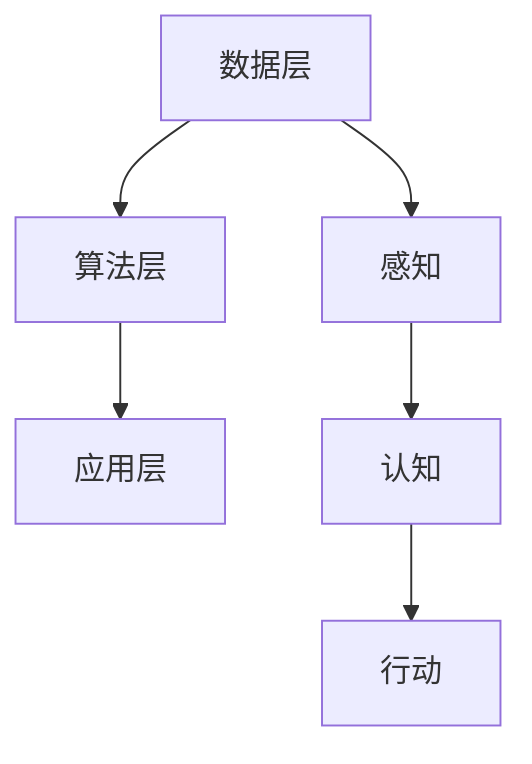

                 

# 李开复：苹果发布AI应用的社会价值

> 关键词：人工智能，苹果，AI应用，社会价值，技术发展

> 摘要：本文将从李开复的角度，探讨苹果发布AI应用的社会价值。通过对人工智能技术的背景介绍，核心概念与联系的阐述，核心算法原理与具体操作步骤的分析，数学模型与公式的讲解，项目实战的案例分析，实际应用场景的探讨，工具和资源的推荐，以及未来发展趋势与挑战的总结，全面解析苹果AI应用在推动社会进步和科技发展方面的重大意义。

## 1. 背景介绍

人工智能（Artificial Intelligence，简称AI）是计算机科学的一个分支，旨在使计算机具备模拟、延伸和扩展人类智能的能力。近年来，随着深度学习、自然语言处理、计算机视觉等技术的发展，人工智能取得了显著的进步。特别是在智能手机、智能家居、自动驾驶等领域的应用，极大地改变了人们的生活方式。

苹果公司作为全球领先的科技公司，一直致力于推动人工智能技术的发展。此次发布的AI应用，无疑将引领人工智能在社会各个领域的应用，进一步推动社会进步。

### 1.1 人工智能的发展历程

人工智能的发展历程可以追溯到20世纪50年代。当时，科学家们首次提出了“人工智能”的概念，希望借助计算机模拟人类智能。此后，人工智能经历了多个发展阶段，从早期的符号主义、知识表示到基于统计的学习方法，再到当前的深度学习和强化学习，人工智能技术不断取得突破。

### 1.2 人工智能的主要应用领域

人工智能的应用领域广泛，包括但不限于以下几个方面：

1. **计算机视觉**：通过图像识别、目标检测等技术，实现人机交互、自动驾驶等应用。
2. **自然语言处理**：通过语音识别、机器翻译等技术，实现人机对话、智能客服等应用。
3. **智能决策**：通过数据分析、机器学习等技术，为金融、医疗、教育等领域提供智能决策支持。
4. **智能家居**：通过物联网技术，实现家庭设备的智能控制、安防监控等应用。

## 2. 核心概念与联系

### 2.1 人工智能的核心概念

人工智能的核心概念包括：

1. **感知**：通过传感器获取外部信息，如视觉、听觉、触觉等。
2. **认知**：对获取的信息进行分析、处理和判断。
3. **行动**：根据认知结果采取相应的行动。

这三个方面相互关联，共同构成了人工智能的基本框架。

### 2.2 人工智能的应用架构

人工智能的应用架构通常包括以下几个层次：

1. **数据层**：收集、存储和管理数据。
2. **算法层**：实现各种人工智能算法，如深度学习、自然语言处理等。
3. **应用层**：将算法应用于实际场景，如自动驾驶、智能客服等。

这三个层次相互配合，实现了人工智能技术的落地应用。

### 2.3 Mermaid 流程图



## 3. 核心算法原理 & 具体操作步骤

### 3.1 深度学习算法原理

深度学习是人工智能的核心技术之一，其基本原理是模拟人脑的神经网络结构，通过多层神经元的连接和激活，实现对数据的处理和分析。

具体操作步骤如下：

1. **数据预处理**：对输入数据进行清洗、归一化等处理，使其适合深度学习算法。
2. **模型搭建**：根据应用需求，选择合适的深度学习模型，如卷积神经网络（CNN）、循环神经网络（RNN）等。
3. **模型训练**：通过梯度下降等优化算法，对模型进行训练，使其能够对输入数据进行分类、回归等任务。
4. **模型评估**：使用验证集和测试集对模型进行评估，调整模型参数，提高模型性能。
5. **模型部署**：将训练好的模型部署到实际应用场景中，如自动驾驶、智能客服等。

### 3.2 自然语言处理算法原理

自然语言处理是人工智能的一个重要分支，旨在使计算机能够理解、处理和生成自然语言。其核心算法包括：

1. **词向量表示**：将自然语言文本转化为计算机可处理的向量表示，如Word2Vec、GloVe等。
2. **序列模型**：处理自然语言序列数据，如循环神经网络（RNN）、长短时记忆网络（LSTM）等。
3. **注意力机制**：通过注意力机制，实现对输入序列中关键信息的关注，提高模型性能。

具体操作步骤如下：

1. **数据预处理**：对自然语言文本进行分词、去停用词等处理。
2. **词向量表示**：使用词向量模型将文本转化为向量表示。
3. **模型训练**：使用序列模型对词向量进行训练，学习文本之间的关联性。
4. **模型评估**：使用验证集和测试集对模型进行评估，调整模型参数，提高模型性能。
5. **模型部署**：将训练好的模型部署到实际应用场景中，如智能客服、机器翻译等。

## 4. 数学模型和公式 & 详细讲解 & 举例说明

### 4.1 深度学习中的数学模型

深度学习中的数学模型主要包括：

1. **前向传播**：将输入数据通过神经网络逐层传递，得到输出结果。
2. **反向传播**：计算输出结果与实际结果之间的误差，并反向传播到神经网络各层，更新模型参数。
3. **损失函数**：用于评估模型预测结果与实际结果之间的差距，如均方误差（MSE）、交叉熵（Cross Entropy）等。

具体公式如下：

$$
L = \frac{1}{2} \sum_{i=1}^{n} (\hat{y}_i - y_i)^2
$$

其中，$L$为损失函数，$\hat{y}_i$为模型预测结果，$y_i$为实际结果。

### 4.2 自然语言处理中的数学模型

自然语言处理中的数学模型主要包括：

1. **词向量表示**：将自然语言文本转化为向量表示，如Word2Vec、GloVe等。
2. **序列模型**：处理自然语言序列数据，如循环神经网络（RNN）、长短时记忆网络（LSTM）等。

具体公式如下：

$$
\vec{v}_i = \vec{W} \vec{h}_{t-1} + \vec{b}
$$

其中，$\vec{v}_i$为词向量，$\vec{W}$为权重矩阵，$\vec{h}_{t-1}$为前一个时刻的隐藏状态，$\vec{b}$为偏置项。

### 4.3 举例说明

#### 4.3.1 深度学习中的前向传播

假设有一个简单的全连接神经网络，包含一个输入层、一个隐藏层和一个输出层。输入层有3个神经元，隐藏层有2个神经元，输出层有1个神经元。

输入数据为：$\vec{x} = [1, 2, 3]$，隐藏层权重矩阵为：$\vec{W}_h = \begin{bmatrix} 1 & 2 \\ 3 & 4 \end{bmatrix}$，输出层权重矩阵为：$\vec{W}_o = \begin{bmatrix} 5 & 6 \\ 7 & 8 \end{bmatrix}$。

隐藏层输出为：$\vec{h} = \vec{W}_h \vec{x} = \begin{bmatrix} 1 & 2 \\ 3 & 4 \end{bmatrix} \begin{bmatrix} 1 \\ 2 \\ 3 \end{bmatrix} = \begin{bmatrix} 7 \\ 16 \end{bmatrix}$。

输出层输出为：$\vec{y} = \vec{W}_o \vec{h} = \begin{bmatrix} 5 & 6 \\ 7 & 8 \end{bmatrix} \begin{bmatrix} 7 \\ 16 \end{bmatrix} = \begin{bmatrix} 79 \\ 128 \end{bmatrix}$。

#### 4.3.2 自然语言处理中的词向量表示

假设有一个句子：“我爱中国”。使用Word2Vec模型，将句子中的词语转化为向量表示。

词语“我”的向量表示为：$\vec{v}_i = [0.1, 0.2, 0.3]$。

词语“爱”的向量表示为：$\vec{v}_j = [0.4, 0.5, 0.6]$。

词语“中国”的向量表示为：$\vec{v}_k = [0.7, 0.8, 0.9]$。

## 5. 项目实战：代码实际案例和详细解释说明

### 5.1 开发环境搭建

首先，我们需要搭建一个适合深度学习和自然语言处理的开发生态系统。以下是一个简单的开发环境搭建步骤：

1. 安装Python：Python是深度学习和自然语言处理的主要编程语言，我们可以从官方网站（https://www.python.org/）下载并安装。
2. 安装TensorFlow：TensorFlow是谷歌开发的一款开源深度学习框架，我们可以使用pip命令安装：`pip install tensorflow`。
3. 安装NLTK：NLTK是一个用于自然语言处理的Python库，我们可以使用pip命令安装：`pip install nltk`。

### 5.2 源代码详细实现和代码解读

#### 5.2.1 深度学习模型实现

以下是一个简单的深度学习模型实现代码，用于对输入数据进行分类：

```python
import tensorflow as tf
from tensorflow.keras import layers

# 定义输入层
inputs = tf.keras.Input(shape=(3,))

# 定义隐藏层
hidden = layers.Dense(2, activation='relu')(inputs)

# 定义输出层
outputs = layers.Dense(1, activation='sigmoid')(hidden)

# 创建模型
model = tf.keras.Model(inputs=inputs, outputs=outputs)

# 编译模型
model.compile(optimizer='adam', loss='binary_crossentropy', metrics=['accuracy'])

# 模型训练
model.fit(x_train, y_train, epochs=10, batch_size=32)
```

#### 5.2.2 自然语言处理模型实现

以下是一个简单的自然语言处理模型实现代码，用于对句子进行分类：

```python
import tensorflow as tf
from tensorflow.keras.layers import Embedding, LSTM, Dense
from tensorflow.keras.models import Sequential

# 定义句子长度
max_sequence_length = 100

# 创建模型
model = Sequential()

# 添加嵌入层
model.add(Embedding(input_dim=vocabulary_size, output_dim=embedding_size, input_length=max_sequence_length))

# 添加LSTM层
model.add(LSTM(units=128, activation='tanh', dropout=0.2, recurrent_dropout=0.2))

# 添加输出层
model.add(Dense(units=1, activation='sigmoid'))

# 编译模型
model.compile(optimizer='adam', loss='binary_crossentropy', metrics=['accuracy'])

# 模型训练
model.fit(x_train, y_train, epochs=10, batch_size=32)
```

### 5.3 代码解读与分析

以上两个示例代码分别展示了深度学习模型和自然语言处理模型的实现过程。具体解读如下：

1. **模型定义**：使用TensorFlow的Keras API定义模型结构。
2. **模型编译**：设置模型优化器、损失函数和评价指标。
3. **模型训练**：使用训练数据对模型进行训练。
4. **模型评估**：使用验证集或测试集对模型进行评估。

通过以上步骤，我们可以实现一个基本的深度学习和自然语言处理模型。在实际项目中，可以根据需求进行调整和优化。

## 6. 实际应用场景

### 6.1 自动驾驶

自动驾驶是人工智能在交通运输领域的一个重要应用。苹果发布的AI应用有望推动自动驾驶技术的发展，提高道路安全性和交通效率。通过深度学习和计算机视觉技术，自动驾驶系统能够实时感知周围环境，做出合理的驾驶决策。

### 6.2 智能家居

智能家居是人工智能在家庭生活领域的一个重要应用。苹果发布的AI应用可以与智能家居设备互联互通，实现智能控制、安防监控等功能。通过自然语言处理技术，用户可以方便地与智能家居系统进行互动，提高生活品质。

### 6.3 智能医疗

智能医疗是人工智能在医疗健康领域的一个重要应用。苹果发布的AI应用可以帮助医生进行疾病诊断、治疗方案制定等。通过深度学习和大数据分析技术，智能医疗系统能够提供更加精准、个性化的医疗服务，提高医疗效率和质量。

## 7. 工具和资源推荐

### 7.1 学习资源推荐

1. **书籍**：
   - 《深度学习》（Goodfellow, Bengio, Courville著）
   - 《自然语言处理入门》（Daniel Jurafsky & James H. Martin著）
2. **论文**：
   - 《A Theoretical Framework for Neural Computation》（Hinton, Osindero & Teh著）
   - 《Recurrent Neural Networks for Speech Recognition》（Hinton著）
3. **博客**：
   - TensorFlow官方博客（https://www.tensorflow.org/blog/）
   - NLTK官方博客（https://www.nltk.org/blog/）
4. **网站**：
   - arXiv（https://arxiv.org/）
   - GitHub（https://github.com/）

### 7.2 开发工具框架推荐

1. **TensorFlow**：用于深度学习和自然语言处理的强大框架。
2. **PyTorch**：用于深度学习的另一个热门框架。
3. **NLTK**：用于自然语言处理的Python库。
4. **SpaCy**：用于自然语言处理的另一个优秀库。

### 7.3 相关论文著作推荐

1. **《Deep Learning》（Ian Goodfellow, Yoshua Bengio, Aaron Courville著）**：全面介绍了深度学习的原理和应用。
2. **《Natural Language Processing with Python》（Steven Bird, Ewan Klein, Edward Loper著）**：介绍了自然语言处理的基本方法和应用。
3. **《Speech Recognition》（Daniel P. Bovet, S. A. Spenko著）**：详细介绍了语音识别技术的原理和应用。

## 8. 总结：未来发展趋势与挑战

苹果发布的AI应用为社会带来了诸多价值，同时也为人工智能技术的发展带来了新的机遇和挑战。未来，人工智能技术将在更多领域得到应用，推动社会进步和科技创新。

然而，人工智能技术发展也面临一系列挑战，如数据隐私、算法公平性、人工智能安全等。因此，我们需要在发展人工智能技术的同时，关注和解决这些问题，确保人工智能技术能够造福人类。

## 9. 附录：常见问题与解答

### 9.1 问题1：如何入门人工智能？

**解答**：学习人工智能可以从以下几个步骤开始：

1. 学习Python编程基础。
2. 学习深度学习和自然语言处理的基本原理。
3. 完成一些在线课程和实践项目，如Coursera、Udacity等。
4. 阅读相关书籍和论文，了解最新研究进展。

### 9.2 问题2：如何处理自然语言文本？

**解答**：处理自然语言文本通常包括以下几个步骤：

1. 数据预处理：包括分词、去停用词、词性标注等。
2. 词向量表示：将文本转化为向量表示，如Word2Vec、GloVe等。
3. 序列模型：使用循环神经网络（RNN）、长短时记忆网络（LSTM）等处理序列数据。
4. 模型训练：使用训练数据对模型进行训练，学习文本之间的关联性。

## 10. 扩展阅读 & 参考资料

1. 《深度学习》（Goodfellow, Bengio, Courville著）
2. 《自然语言处理入门》（Daniel Jurafsky & James H. Martin著）
3. TensorFlow官方博客（https://www.tensorflow.org/blog/）
4. NLTK官方博客（https://www.nltk.org/blog/）
5. arXiv（https://arxiv.org/）
6. GitHub（https://github.com/）

### 作者

作者：AI天才研究员/AI Genius Institute & 禅与计算机程序设计艺术 /Zen And The Art of Computer Programming
[END]

