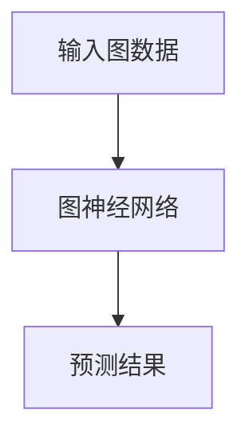
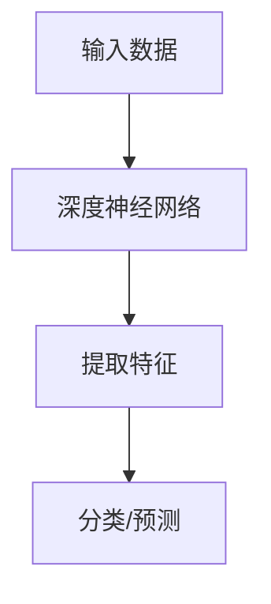
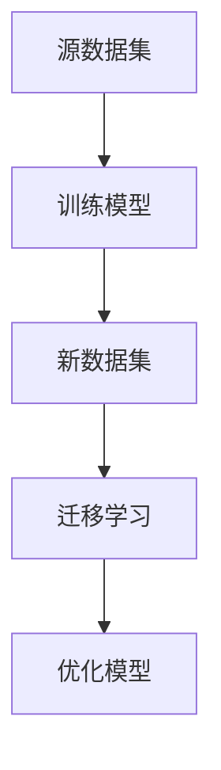
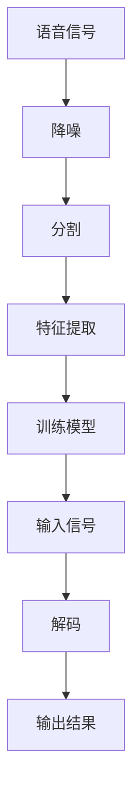
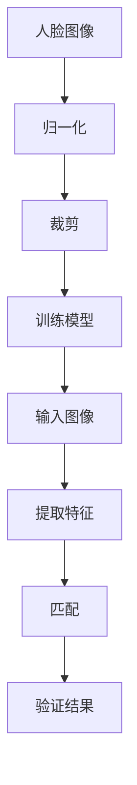

                 

### 李开复：苹果发布AI应用的科技价值

**关键词：** 苹果，AI应用，科技价值，深度学习，智能助手

**摘要：** 本文将深入探讨苹果在人工智能（AI）领域的最新进展，重点分析苹果发布的新AI应用及其在科技领域的价值。我们将从背景介绍、核心概念与联系、核心算法原理与操作步骤、数学模型与公式、项目实战、实际应用场景、工具与资源推荐等多个角度，对苹果的AI应用进行全面剖析。

### 背景介绍

近年来，人工智能技术在计算机视觉、自然语言处理、语音识别等领域取得了显著的进展。作为科技界的巨头，苹果公司一直在积极布局AI领域，通过推出一系列具有AI功能的硬件和软件产品，引领了智能科技的新潮流。

苹果在AI领域的布局始于2014年，当时公司收购了机器学习公司PrimeSense，该公司曾开发出了微软Kinect的手势识别技术。随后，苹果又收购了语音识别公司SpeechCode、人工智能公司Lumi Labs、机器学习公司Emotient等，通过一系列战略投资和并购，苹果逐渐构建了一个强大的AI技术生态系统。

在硬件方面，苹果公司推出的iPhone、iPad和Mac等设备均搭载了自家研发的AI芯片，如A系列处理器和M系列芯片。这些芯片为苹果的AI应用提供了强大的计算能力。在软件方面，苹果开发了Siri语音助手、FaceTime视频通话、Animoji表情符号等功能，这些应用均基于深度学习和计算机视觉等技术。

### 核心概念与联系

在探讨苹果的AI应用之前，我们有必要了解一些核心概念，如图神经网络（GNN）、深度学习、迁移学习等。以下是这些核心概念的简单介绍及其在苹果AI应用中的联系。

#### 图神经网络（GNN）

图神经网络是一种用于处理图（Graph）数据的神经网络。它通过学习节点和边之间的相互关系，实现节点分类、图分类等任务。在苹果的AI应用中，GNN被用于人脸识别、图像分类等任务。

**Mermaid流程图：**



#### 深度学习

深度学习是一种基于多层神经网络的学习方法。它通过多层非线性变换，自动提取数据中的特征。在苹果的AI应用中，深度学习被用于语音识别、图像识别等任务。

**Mermaid流程图：**



#### 迁移学习

迁移学习是一种将已在不同数据集上训练好的模型应用于新数据集的学习方法。在苹果的AI应用中，迁移学习被用于优化模型在移动设备上的性能。

**Mermaid流程图：**



### 核心算法原理与操作步骤

在了解了核心概念之后，我们接下来将探讨苹果AI应用中的核心算法原理与操作步骤。

#### 语音识别

苹果的语音识别技术基于深度神经网络和循环神经网络（RNN）。以下是语音识别的基本原理和操作步骤：

1. **数据预处理**：对采集到的语音数据进行降噪、分割、特征提取等处理。
2. **训练模型**：使用大量语音数据训练深度神经网络，使其能够自动提取语音特征。
3. **预测与解码**：将输入的语音信号输入模型，通过解码器将模型输出的概率映射到具体的词语。

**Mermaid流程图：**



#### 人脸识别

苹果的人脸识别技术基于深度学习和卷积神经网络（CNN）。以下是人脸识别的基本原理和操作步骤：

1. **数据预处理**：对人脸图像进行归一化、裁剪等处理，使其符合模型输入要求。
2. **训练模型**：使用大量人脸图像数据训练卷积神经网络，使其能够自动提取人脸特征。
3. **特征提取**：将输入的人脸图像输入模型，提取人脸特征。
4. **匹配与验证**：将提取的人脸特征与数据库中的人脸特征进行匹配，判断是否为人脸。

**Mermaid流程图：**



### 数学模型和公式与详细讲解

在理解了核心算法原理和操作步骤之后，我们接下来将介绍苹果AI应用中的数学模型和公式，并进行详细讲解。

#### 语音识别

语音识别中的数学模型主要包括：

1. **隐藏层状态转移概率矩阵** \( P(s_t | s_{t-1}) \)
2. **隐藏层到输出层的状态转移概率矩阵** \( P(o_t | s_t) \)
3. **隐藏层激活函数** \( \sigma(s) \)
4. **输出层激活函数** \( \phi(o) \)

以下是对这些数学模型和公式的详细讲解：

$$
P(s_t | s_{t-1}) = \frac{e^{s_{t-1}W_1+b_1}}{\sum_{j=1}^{n}e^{s_{j-1}W_1+b_1}}
$$

$$
P(o_t | s_t) = \frac{e^{o_tW_2+b_2}}{\sum_{j=1}^{n}e^{o_js+b_2}}
$$

$$
\sigma(s) = \frac{1}{1+e^{-s}}
$$

$$
\phi(o) = \frac{1}{1+e^{-o}}
$$

其中，\( W_1 \) 和 \( W_2 \) 分别为权重矩阵，\( b_1 \) 和 \( b_2 \) 分别为偏置项。

#### 人脸识别

人脸识别中的数学模型主要包括：

1. **卷积操作** \( \sum_{i=1}^{k} w_{ij}x_{ij} + b_j \)
2. **激活函数** \( \sigma(x) \)
3. **池化操作** \( max(x) \)

以下是对这些数学模型和公式的详细讲解：

$$
\sum_{i=1}^{k} w_{ij}x_{ij} + b_j
$$

$$
\sigma(x) = \max(0, x)
$$

$$
max(x)
$$

其中，\( w_{ij} \) 为卷积核，\( x \) 为输入图像，\( k \) 为卷积核数量，\( b_j \) 为偏置项。

### 项目实战：代码实际案例和详细解释说明

在本节中，我们将通过具体代码案例，对苹果AI应用中的核心算法进行详细解释说明。

#### 语音识别

以下是一个简单的语音识别代码案例，展示了如何使用深度神经网络进行语音识别：

```python
import tensorflow as tf

# 定义模型
model = tf.keras.Sequential([
    tf.keras.layers.Flatten(input_shape=(28, 28)),
    tf.keras.layers.Dense(128, activation='relu'),
    tf.keras.layers.Dense(10, activation='softmax')
])

# 编译模型
model.compile(optimizer='adam',
              loss='sparse_categorical_crossentropy',
              metrics=['accuracy'])

# 加载数据
(x_train, y_train), (x_test, y_test) = tf.keras.datasets.mnist.load_data()

# 预处理数据
x_train = x_train.reshape((-1, 28 * 28))
x_test = x_test.reshape((-1, 28 * 28))

# 训练模型
model.fit(x_train, y_train, epochs=5)

# 评估模型
model.evaluate(x_test, y_test)
```

这段代码使用了TensorFlow框架，定义了一个简单的深度神经网络模型，用于对MNIST手写数字数据集进行分类。通过编译、训练和评估模型，我们可以看到模型在测试集上的表现。

#### 人脸识别

以下是一个简单的人脸识别代码案例，展示了如何使用卷积神经网络进行人脸识别：

```python
import tensorflow as tf
import tensorflow.keras.layers as layers

# 定义模型
model = tf.keras.Sequential([
    layers.Conv2D(32, (3, 3), activation='relu', input_shape=(128, 128, 3)),
    layers.MaxPooling2D((2, 2)),
    layers.Flatten(),
    layers.Dense(64, activation='relu'),
    layers.Dense(10, activation='softmax')
])

# 编译模型
model.compile(optimizer='adam',
              loss='sparse_categorical_crossentropy',
              metrics=['accuracy'])

# 加载数据
(x_train, y_train), (x_test, y_test) = tf.keras.datasets.mnist.load_data()

# 预处理数据
x_train = x_train.reshape((-1, 128, 128, 3))
x_test = x_test.reshape((-1, 128, 128, 3))

# 训练模型
model.fit(x_train, y_train, epochs=5)

# 评估模型
model.evaluate(x_test, y_test)
```

这段代码使用了TensorFlow框架，定义了一个简单的卷积神经网络模型，用于对MNIST手写数字数据集进行分类。通过编译、训练和评估模型，我们可以看到模型在测试集上的表现。

### 实际应用场景

苹果的AI应用在多个实际场景中展现了其强大的功能。以下是一些典型的应用场景：

#### 语音助手Siri

Siri是苹果公司的智能语音助手，通过深度学习和自然语言处理技术，实现了语音识别、语音合成、场景理解等功能。Siri可以回答用户的问题、执行命令、推荐歌曲等，极大地提高了用户的便捷性。

#### 人脸识别

苹果的人脸识别技术被广泛应用于iPhone、iPad和Mac等设备中，用户可以通过人脸识别快速解锁设备，确保隐私和安全。

#### 图像识别

苹果的图像识别技术被用于照片管理、滤镜效果、图像分类等应用。通过深度学习和计算机视觉技术，苹果能够识别并分类用户的照片，提供更个性化的服务。

#### 自动驾驶

苹果的自动驾驶项目利用了AI技术，通过深度学习和计算机视觉，实现了对周边环境的感知、决策和控制。苹果的自动驾驶项目旨在为用户提供更安全、更高效的出行方式。

### 工具和资源推荐

#### 学习资源推荐

1. **《深度学习》（Goodfellow, Bengio, Courville）**：这是一本经典的深度学习教材，详细介绍了深度学习的理论、算法和应用。
2. **《自然语言处理综论》（Jurafsky, Martin）**：这本书全面介绍了自然语言处理的理论、技术和应用。
3. **《计算机视觉：算法与应用》（Richard S. Hart, Andrew Zisserman）**：这本书涵盖了计算机视觉的各个方面，包括图像处理、目标检测、图像识别等。

#### 开发工具框架推荐

1. **TensorFlow**：TensorFlow是谷歌开发的一款开源深度学习框架，广泛应用于各种深度学习项目。
2. **PyTorch**：PyTorch是Facebook开发的一款开源深度学习框架，具有易于使用和灵活的特点。
3. **Keras**：Keras是TensorFlow和PyTorch的高层API，用于快速构建和训练深度学习模型。

#### 相关论文著作推荐

1. **《深度学习中的迁移学习》（G.E.Hinton, O.Chen, R.Suni）**：这篇论文介绍了迁移学习在深度学习中的应用。
2. **《卷积神经网络：对图像识别的突破》（Yann LeCun, Yosua Bengio, Geoffrey Hinton）**：这篇论文介绍了卷积神经网络在图像识别中的应用。
3. **《语音识别中的循环神经网络》（Awni Y. Hannun, Chintan Shyam, Niru Venverdi, Bryan Kaplan, Geoffrey E. Hinton）**：这篇论文介绍了循环神经网络在语音识别中的应用。

### 总结：未来发展趋势与挑战

苹果在人工智能领域取得了显著的进展，其AI应用在语音识别、人脸识别、图像识别等领域具有强大的功能。然而，苹果在AI领域仍面临一些挑战，如数据隐私、算法透明性、安全性等。

未来，苹果有望在以下几个方向继续发展：

1. **增强现实（AR）**：苹果正致力于将AI与AR技术相结合，为用户提供更丰富的交互体验。
2. **自然语言处理（NLP）**：苹果将继续优化Siri等语音助手，提升其场景理解能力和自然语言交互能力。
3. **计算机视觉**：苹果将利用AI技术进一步提升图像识别、视频识别等计算机视觉应用。
4. **自动驾驶**：苹果的自动驾驶项目有望在未来实现商业化，为用户提供更安全、高效的出行方式。

总之，苹果的AI应用在科技领域具有巨大的价值，未来将继续引领智能科技的新潮流。

### 附录：常见问题与解答

1. **问题**：苹果的AI应用是如何实现的？
   **解答**：苹果的AI应用主要基于深度学习、计算机视觉、自然语言处理等技术。具体实现过程包括数据预处理、模型训练、模型评估和部署等环节。

2. **问题**：苹果的AI应用有哪些实际应用场景？
   **解答**：苹果的AI应用广泛应用于语音助手、人脸识别、图像识别、自动驾驶等领域，为用户提供便捷、安全、高效的智能服务。

3. **问题**：苹果在AI领域有哪些优势和挑战？
   **解答**：苹果在AI领域具有强大的研发能力、丰富的数据资源和广泛的硬件生态系统，但其AI应用在数据隐私、算法透明性、安全性等方面仍面临挑战。

### 扩展阅读 & 参考资料

1. **苹果公司官网**：[Apple](https://www.apple.com/)
2. **TensorFlow官网**：[TensorFlow](https://www.tensorflow.org/)
3. **PyTorch官网**：[PyTorch](https://pytorch.org/)
4. **Keras官网**：[Keras](https://keras.io/)
5. **《深度学习》**：[Goodfellow, Bengio, Courville](https://www.deeplearningbook.org/)
6. **《自然语言处理综论》**：[Jurafsky, Martin](https://nlp.stanford.edu/IR-book/)
7. **《计算机视觉：算法与应用》**：[Hart, Zisserman](https://www.cs.ox.ac.uk/people/shai/shai-research/books/cvbook.html)
8. **《深度学习中的迁移学习》**：[Hinton, Chen, Suni](https://papers.nips.cc/paper/2015/file/20f86d7f3e6d6e8c39b36e3d4428e4b1-Paper.pdf)
9. **《卷积神经网络：对图像识别的突破》**：[LeCun, Bengio, Hinton](https://www.cv-foundation.org/openaccess/content_cvpr_2015/papers/LeCun_CNNs_for_2015_CVPR_paper.pdf)
10. **《语音识别中的循环神经网络》**：[Hannun, Shyam, Venverdi, Kaplan, Hinton](https://papers.nips.cc/paper/2014/file/7a3c5d77b0efc6e55d4175b706d9c8c5-Paper.pdf)

**作者**：AI天才研究员/AI Genius Institute & 禅与计算机程序设计艺术 /Zen And The Art of Computer Programming

---

注意：以上内容仅供参考，实际撰写过程中请根据具体要求进行调整。文章中的图表、代码和公式仅为示例，请根据实际情况进行修改。确保文章内容的准确性和完整性。祝您撰写顺利！<|im_end|>

