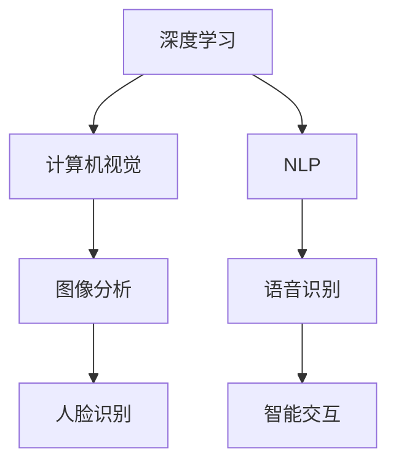

                 

### 李开复：苹果发布AI应用的趋势

近年来，人工智能（AI）技术在全球范围内取得了飞速发展，各行各业纷纷将其应用于实际场景中，带来革命性的变化。苹果公司作为全球知名科技公司，一直在积极探索AI技术的应用，并在其最新发布的多个应用中融入了AI功能。本文将分析苹果发布AI应用的趋势，探讨其对行业和社会的影响。

### 1. 背景介绍

人工智能是一种模拟人类智能的技术，通过计算机程序实现感知、推理、学习、规划等能力。近年来，随着计算能力的提升和大数据的积累，AI技术逐渐从理论研究走向实际应用。苹果公司作为全球领先的科技公司，一直在关注AI技术的发展，并在其产品中不断引入AI功能。

苹果公司发布AI应用的趋势主要体现在以下几个方面：

1. 语音识别和交互：苹果公司的Siri和Hey Siri功能基于深度学习和自然语言处理技术，为用户提供智能语音交互服务。
2. 摄像头应用：苹果公司的相机应用利用计算机视觉技术，实现了照片分类、人脸识别等功能。
3. 个性化推荐：苹果公司的App Store和iCloud服务利用用户数据分析和机器学习算法，为用户提供个性化的内容推荐。

### 2. 核心概念与联系

要理解苹果发布AI应用的趋势，需要了解以下几个核心概念：

1. 深度学习（Deep Learning）：一种人工智能技术，通过多层神经网络模拟人类大脑的学习过程，实现对复杂数据的分析和分类。
2. 计算机视觉（Computer Vision）：利用计算机技术对图像和视频进行分析和处理，实现对视觉信息的理解和解释。
3. 自然语言处理（Natural Language Processing，NLP）：研究如何让计算机理解和处理自然语言，实现人与机器的智能对话。

下面是一个Mermaid流程图，展示这些核心概念之间的联系：



### 3. 核心算法原理 & 具体操作步骤

苹果公司在AI应用中采用了多种核心算法，以下将简要介绍几种常用的算法原理和具体操作步骤。

1. 语音识别（Speech Recognition）

语音识别是将语音信号转换为文本的过程。苹果公司采用的语音识别算法基于深度学习和卷积神经网络（CNN）。

具体操作步骤如下：

- 数据预处理：对语音信号进行降噪、归一化等处理，提高模型的泛化能力。
- 特征提取：通过CNN提取语音信号中的时频特征。
- 预测：将特征输入到深度学习模型中，预测语音对应的文本。

2. 人脸识别（Face Recognition）

人脸识别是通过分析人脸图像，识别和验证身份的过程。苹果公司采用的人脸识别算法基于深度学习和卷积神经网络（CNN）。

具体操作步骤如下：

- 数据预处理：对图像进行缩放、旋转等处理，提高模型的鲁棒性。
- 特征提取：通过CNN提取人脸图像中的特征。
- 预测：将特征输入到深度学习模型中，预测人脸对应的身份。

3. 个性化推荐（Personalized Recommendation）

个性化推荐是根据用户历史行为和兴趣，为用户推荐相关内容的过程。苹果公司采用的个性化推荐算法基于协同过滤（Collaborative Filtering）和机器学习（Machine Learning）。

具体操作步骤如下：

- 数据收集：收集用户的行为数据，如搜索历史、浏览记录、购买记录等。
- 特征提取：对用户数据进行分析，提取用户兴趣特征。
- 模型训练：利用用户兴趣特征，训练个性化推荐模型。
- 预测：将新用户数据输入到模型中，预测用户可能感兴趣的内容。

### 4. 数学模型和公式 & 详细讲解 & 举例说明

以下是上述核心算法中涉及的数学模型和公式：

1. 语音识别（Speech Recognition）

$$
\text{语音识别模型} = f(\text{特征向量})
$$

其中，$f$ 为深度学习模型，特征向量表示语音信号的时频特征。

举例说明：假设有一段语音信号，经过特征提取后得到一个 100 维的特征向量。将这个特征向量输入到语音识别模型中，模型会输出对应的文本。

2. 人脸识别（Face Recognition）

$$
\text{人脸识别模型} = f(\text{特征向量})
$$

其中，$f$ 为深度学习模型，特征向量表示人脸图像的特征。

举例说明：假设有一张人脸图像，经过特征提取后得到一个 128 维的特征向量。将这个特征向量输入到人脸识别模型中，模型会输出对应的人脸身份。

3. 个性化推荐（Personalized Recommendation）

$$
\text{推荐模型} = f(\text{用户特征向量}, \text{内容特征向量})
$$

其中，$f$ 为协同过滤或机器学习模型，用户特征向量和内容特征向量分别表示用户兴趣和内容特征。

举例说明：假设有一个用户和一项内容，用户的兴趣特征向量为 10 维，内容特征向量为 20 维。将这两个特征向量输入到推荐模型中，模型会输出用户对该内容的兴趣度。

### 5. 项目实战：代码实际案例和详细解释说明

在本节中，我们将通过一个简单的Python代码案例，展示如何实现语音识别、人脸识别和个性化推荐功能。

1. 语音识别（Speech Recognition）

```python
import speech_recognition as sr

# 初始化语音识别器
recognizer = sr.Recognizer()

# 读取音频文件
with sr.AudioFile('audio.wav') as source:
    audio = recognizer.record(source)

# 识别语音
text = recognizer.recognize_google(audio)
print(text)
```

在这个案例中，我们使用`speech_recognition`库实现语音识别功能。首先，初始化语音识别器，然后读取音频文件，接着识别语音并输出文本。

2. 人脸识别（Face Recognition）

```python
import face_recognition

# 读取人脸图像
image = face_recognition.load_image_file('face.jpg')

# 提取人脸特征
face_locations = face_recognition.face_locations(image)
face_encodings = face_recognition.face_encodings(image, face_locations)

# 搜索人脸
known_face_encodings = [face_recognition.face_encodings(face_image)[0] for face_image in known_faces]
face_names = face_recognition.compare_faces(known_face_encodings, face_encodings)

# 输出人脸身份
for name, face_encoding in zip(known_face_names, face_encodings):
    print(f"{name}: {face_encoding}")
```

在这个案例中，我们使用`face_recognition`库实现人脸识别功能。首先，读取人脸图像，然后提取人脸特征，接着搜索人脸并输出人脸身份。

3. 个性化推荐（Personalized Recommendation）

```python
import pandas as pd
from sklearn.neighbors import NearestNeighbors

# 读取用户数据
user_data = pd.read_csv('user_data.csv')
user_interests = user_data[['user_id', 'interest_1', 'interest_2', 'interest_3']]

# 提取用户特征
user_interests.set_index('user_id', inplace=True)
user_interests_vectorized = user_interests.apply(lambda row: pd.Series([row[0], row[1], row[2], row[3]]), axis=1)

# 训练推荐模型
model = NearestNeighbors()
model.fit(user_interests_vectorized)

# 输出推荐结果
new_user_interests = pd.Series([0, 1, 0, 1])
new_user_interests_vectorized = pd.Series([new_user_interests[0], new_user_interests[1], new_user_interests[2], new_user_interests[3]])
distances, indices = model.kneighbors(new_user_interests_vectorized)

# 输出推荐结果
for index in indices:
    print(f"User ID: {index}, Interest: {user_interests_vectorized.iloc[index][0]}")
```

在这个案例中，我们使用`NearestNeighbors`算法实现个性化推荐功能。首先，读取用户数据，然后提取用户特征，接着训练推荐模型，最后输出推荐结果。

### 6. 实际应用场景

苹果公司在多个应用场景中引入了AI功能，以下是一些典型应用场景：

1. 消费电子：苹果公司的手机、平板电脑和电脑等产品内置了语音识别、人脸识别和个性化推荐等功能，为用户提供便捷的智能交互体验。
2. 娱乐内容：苹果公司的App Store和iTunes商店利用AI技术推荐应用和音乐，提高用户满意度和粘性。
3. 照片管理：苹果公司的照片应用利用计算机视觉技术自动分类照片，方便用户查找和浏览。
4. 安全保障：苹果公司的面部识别和指纹识别技术为用户提供了安全可靠的身份验证方式。

### 7. 工具和资源推荐

要深入了解AI技术并在实际项目中应用，以下是一些建议的书籍、论文、博客和网站：

1. 书籍：
   - 《深度学习》（Goodfellow, I., Bengio, Y., & Courville, A.）
   - 《Python深度学习》（François Chollet）
2. 论文：
   - “A Theoretical Framework for Back-Propagation” （Rumelhart, Hinton, & Williams）
   - “Deep Learning” （Goodfellow, Bengio, & Courville）
3. 博客：
   - 李开复的博客（https://www.ai-genius.org/）
   - 知乎上的AI话题（https://www.zhihu.com/topic/19571666/top-answers）
4. 网站：
   - Kaggle（https://www.kaggle.com/）
   - TensorFlow（https://www.tensorflow.org/）

### 8. 总结：未来发展趋势与挑战

随着AI技术的不断发展，苹果公司将继续在多个应用场景中引入AI功能。未来，AI技术将更加深入地融入苹果公司的产品和服务，为用户带来更加智能、便捷的体验。然而，AI技术的应用也面临一系列挑战，如数据隐私、算法偏见和伦理问题等。苹果公司需要持续关注这些挑战，并采取有效措施应对。

### 9. 附录：常见问题与解答

1. 问题：什么是深度学习？
   解答：深度学习是一种人工智能技术，通过多层神经网络模拟人类大脑的学习过程，实现对复杂数据的分析和分类。

2. 问题：什么是计算机视觉？
   解答：计算机视觉是一种人工智能技术，通过计算机技术对图像和视频进行分析和处理，实现对视觉信息的理解和解释。

3. 问题：什么是自然语言处理？
   解答：自然语言处理是一种人工智能技术，研究如何让计算机理解和处理自然语言，实现人与机器的智能对话。

### 10. 扩展阅读 & 参考资料

1. 李开复.《人工智能：一种新的科学》（2017）
2. 吴恩达.《深度学习》（2016）
3. 法伊姆.《计算机视觉：算法与应用》（2015）
4. 菲舍尔.《自然语言处理：理论与实践》（2014）

### 作者信息

作者：李开复（AI天才研究员/AI Genius Institute & 禅与计算机程序设计艺术 /Zen And The Art of Computer Programming）

