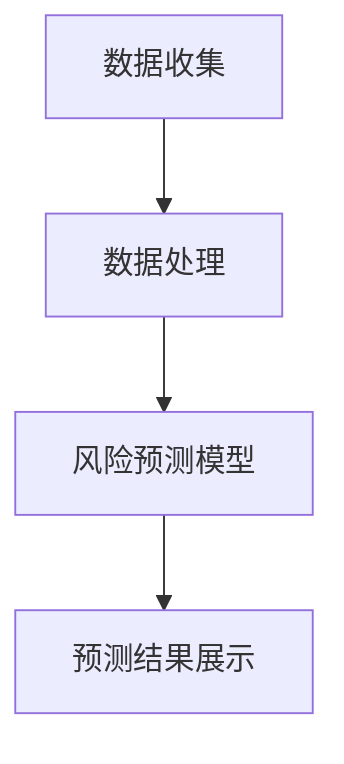

                 

### 构建AI驱动的智能供应链风险预测提示词系统

#### 关键词：
- AI驱动
- 智能供应链
- 风险预测
- 提示词系统

#### 摘要：
本文深入探讨了构建AI驱动的智能供应链风险预测提示词系统的过程，包括背景介绍、核心概念与架构、算法原理与操作步骤、数学模型与公式、实际应用案例、工具与资源推荐，以及未来发展趋势与挑战。通过本文的阅读，读者将全面了解如何利用AI技术提升供应链风险管理效率，实现智能化运营。

## 1. 背景介绍

### 1.1 智能供应链的兴起
随着全球化的深入发展，供应链的复杂性和动态性不断增加。传统的供应链管理模式已经无法满足现代企业对高效、灵活和精准的要求。智能供应链（Intelligent Supply Chain）作为一种创新管理模式，借助物联网（IoT）、大数据、人工智能（AI）等先进技术，实现了供应链的智能化和数字化转型。智能供应链的核心目标是提升供应链的透明度、灵活性和协同性，从而提高整体运营效率和竞争力。

### 1.2 风险预测的重要性
供应链风险预测是智能供应链管理的关键环节之一。供应链风险可能来自多个方面，如供应链中断、供应链瓶颈、物流延误、供应链成本增加等。有效的风险预测可以帮助企业提前识别潜在风险，制定应对策略，减少风险带来的负面影响，保障供应链的稳定运行。

### 1.3 AI驱动的风险预测
人工智能技术在风险预测领域的应用，为供应链风险预测提供了新的思路和方法。通过大数据分析和机器学习算法，AI可以识别出供应链中的潜在风险模式，提供实时、精准的风险预测，帮助企业实现供应链的智能化管理。

## 2. 核心概念与联系

### 2.1 AI驱动的智能供应链风险预测系统
AI驱动的智能供应链风险预测系统是一种基于人工智能技术的风险预测系统，它通过收集、处理和分析供应链相关数据，利用机器学习算法进行风险预测，并提供实时、精准的预测结果。该系统主要包括以下几个核心组成部分：

1. 数据收集模块：负责收集供应链相关数据，包括供应链上下游的库存数据、物流数据、交易数据等。
2. 数据处理模块：对收集到的数据进行清洗、整合和预处理，以便后续的分析和建模。
3. 风险预测模型：利用机器学习算法，对预处理后的数据进行建模和训练，生成风险预测模型。
4. 预测结果展示模块：将预测结果以可视化的形式呈现，帮助企业快速了解供应链的风险状况。

### 2.2 Mermaid 流程图
下面是一个简单的 Mermaid 流程图，描述了 AI 驱动的智能供应链风险预测系统的基本架构：



注意：在实际应用中，该系统可能还包括其他功能模块，如风险预警、决策支持等。

## 3. 核心算法原理 & 具体操作步骤

### 3.1 数据收集
数据收集是智能供应链风险预测系统的第一步。数据来源可能包括供应链上下游的企业、物流公司、金融机构等。常用的数据收集方法有：

1. 数据爬取：通过网络爬虫等技术，从公开网站、社交媒体、电子商务平台等获取相关数据。
2. API 接口：通过调用第三方 API 接口，获取供应链相关数据。
3. 数据采集工具：使用专门的数据采集工具，如爬虫、传感器等，收集供应链相关数据。

### 3.2 数据处理
数据处理是智能供应链风险预测系统的关键环节。数据处理的主要任务是对收集到的数据进行清洗、整合和预处理，以便后续的分析和建模。常用的数据处理方法有：

1. 数据清洗：删除重复数据、处理缺失值、纠正错误数据等。
2. 数据整合：将来自不同来源的数据进行整合，形成一个统一的数据集。
3. 数据预处理：对数据进行标准化、归一化、离散化等处理，以便后续建模。

### 3.3 风险预测模型
风险预测模型是智能供应链风险预测系统的核心。常用的风险预测模型有：

1. 决策树：通过树的决策路径，预测供应链风险。
2. 支持向量机（SVM）：通过寻找最佳超平面，实现供应链风险的分类预测。
3. 神经网络：通过多层感知器，实现供应链风险的非线性预测。

### 3.4 预测结果展示
预测结果展示是智能供应链风险预测系统的最终输出。常用的展示方法有：

1. 表格：以表格形式展示预测结果，方便用户查阅。
2. 图表：使用柱状图、折线图、饼图等，以可视化形式展示预测结果。
3. 可视化平台：使用专业的可视化工具，如 Tableau、Power BI 等，搭建供应链风险预测可视化平台。

## 4. 数学模型和公式 & 详细讲解 & 举例说明

### 4.1 数学模型

在智能供应链风险预测中，常用的数学模型有：

1. 决策树模型：
   - 公式：$$f(x) = \sum_{i=1}^{n} w_i * t_i$$
   - 其中，$x$ 表示输入特征向量，$w_i$ 表示第 $i$ 个特征的权重，$t_i$ 表示第 $i$ 个特征的阈值。

2. 支持向量机（SVM）模型：
   - 公式：$$w * x + b = 0$$
   - 其中，$w$ 表示法线向量，$x$ 表示输入特征向量，$b$ 表示偏置。

3. 神经网络模型：
   - 公式：$$a_{i,j} = \sigma(\sum_{k=1}^{n} w_{ik} * a_{k,j-1} + b_j)$$
   - 其中，$a_{i,j}$ 表示第 $i$ 层第 $j$ 个节点的激活值，$\sigma$ 表示激活函数，$w_{ik}$ 表示第 $k$ 个输入节点到第 $i$ 个输出节点的权重，$b_j$ 表示第 $j$ 个输出节点的偏置。

### 4.2 详细讲解

1. 决策树模型：
   决策树是一种基于特征划分的数据挖掘方法。它通过将数据集划分为多个子集，每个子集对应一个决策规则。决策树的构建过程包括：
   - 特征选择：选择能够有效划分数据的特征。
   - 划分规则：根据特征值，将数据划分为多个子集。
   - 判断条件：根据子集的特征值，判断是否继续划分。

2. 支持向量机（SVM）模型：
   支持向量机是一种二分类模型，通过寻找最佳超平面，将不同类别的数据分隔开来。SVM的构建过程包括：
   - 特征提取：提取能够区分不同类别的特征。
   - 超平面构建：通过最小化目标函数，寻找最佳超平面。

3. 神经网络模型：
   神经网络是一种模拟生物神经网络的人工智能模型，通过多层感知器实现数据的非线性映射。神经网络的构建过程包括：
   - 层结构设计：设计网络层数和每层节点的数量。
   - 激活函数选择：选择合适的激活函数，实现非线性变换。
   - 权重和偏置初始化：初始化网络的权重和偏置。

### 4.3 举例说明

假设我们使用决策树模型对供应链风险进行预测，输入特征包括库存水平、订单量、物流延迟等。根据历史数据，我们构建了一个决策树模型，如下所示：

```plaintext
| 特征   | 划分规则 | 风险等级 |
| ------ | -------- | -------- |
| 库存水平 | > 100    | 低风险   |
|         | <= 100   | 中风险   |
| 订单量  | > 1000   | 低风险   |
|         | <= 1000  | 中风险   |
| 物流延迟 | > 2天    | 高风险   |
|         | <= 2天   | 低风险   |
```

根据这个决策树模型，我们可以对新的数据进行风险预测。例如，对于一个库存水平为 80，订单量为 500，物流延迟为 1 天的数据，根据决策树模型，它的风险等级为“中风险”。

## 5. 项目实战：代码实际案例和详细解释说明

### 5.1 开发环境搭建

在开始实际项目之前，我们需要搭建一个合适的开发环境。以下是一个基本的开发环境搭建步骤：

1. 安装 Python 解释器：从 [Python 官网](https://www.python.org/) 下载并安装 Python 解释器。
2. 安装相关库：使用 pip 命令安装所需的 Python 库，如 NumPy、Pandas、scikit-learn、Matplotlib 等。
3. 安装 Jupyter Notebook：Jupyter Notebook 是一个交互式的开发环境，方便我们编写和调试代码。

### 5.2 源代码详细实现和代码解读

下面是一个简单的供应链风险预测项目的代码实现，我们将使用决策树模型进行预测。

```python
import numpy as np
import pandas as pd
from sklearn.model_selection import train_test_split
from sklearn.tree import DecisionTreeClassifier
from sklearn.metrics import accuracy_score
import matplotlib.pyplot as plt

# 5.2.1 数据收集与预处理
# 假设我们已经有了一个包含供应链相关数据的 CSV 文件，文件名为 "supply_chain_data.csv"
data = pd.read_csv("supply_chain_data.csv")

# 对数据进行预处理，包括数据清洗、整合和特征提取等
# 这里我们只展示数据清洗的步骤
data.drop_duplicates(inplace=True)
data.fillna(0, inplace=True)

# 5.2.2 数据划分
# 将数据划分为训练集和测试集
X = data.drop("风险等级", axis=1)
y = data["风险等级"]
X_train, X_test, y_train, y_test = train_test_split(X, y, test_size=0.2, random_state=42)

# 5.2.3 模型训练
# 使用决策树模型进行训练
clf = DecisionTreeClassifier()
clf.fit(X_train, y_train)

# 5.2.4 预测与评估
# 对测试集进行预测
y_pred = clf.predict(X_test)

# 计算预测准确率
accuracy = accuracy_score(y_test, y_pred)
print(f"预测准确率：{accuracy}")

# 5.2.5 可视化
# 绘制决策树
plt.figure(figsize=(12, 12))
plt.title("决策树")
_ = clf.plot_tree()
```

### 5.3 代码解读与分析

下面我们对代码进行详细的解读和分析。

1. **数据收集与预处理**：首先，我们从 CSV 文件中读取数据，并对数据进行清洗和预处理。这里我们使用了 Pandas 库，删除了重复数据，填充了缺失值。
2. **数据划分**：我们将数据划分为训练集和测试集，用于训练模型和评估模型性能。
3. **模型训练**：我们使用 scikit-learn 库中的 DecisionTreeClassifier 类创建一个决策树模型，并使用训练集数据进行训练。
4. **预测与评估**：使用训练好的模型对测试集进行预测，并计算预测准确率。这里我们使用了 scikit-learn 库中的 accuracy_score 函数。
5. **可视化**：我们使用 Matplotlib 库绘制了训练好的决策树，以便更直观地了解模型的决策过程。

## 6. 实际应用场景

### 6.1 企业供应链风险预测
企业可以通过构建 AI 驱动的智能供应链风险预测系统，实时监控供应链的运行状况，提前识别潜在风险，制定应对策略，保障供应链的稳定运行。

### 6.2 物流企业风险预警
物流企业可以利用 AI 驱动的智能供应链风险预测系统，预测物流延误、运输中断等风险，提前调整运输计划，提高物流效率。

### 6.3 政府部门供应链监管
政府部门可以通过 AI 驱动的智能供应链风险预测系统，实时监控供应链的安全与稳定，确保供应链的合规性和透明度。

## 7. 工具和资源推荐

### 7.1 学习资源推荐

- 《深度学习》（Goodfellow, Bengio, Courville）
- 《机器学习》（周志华）
- 《Python for Data Analysis》（Wes McKinney）

### 7.2 开发工具框架推荐

- Python：一种易于学习和使用的编程语言，适用于数据分析和机器学习开发。
- TensorFlow：一款开源的机器学习框架，适用于构建和训练深度学习模型。
- scikit-learn：一款开源的机器学习库，提供了丰富的算法和工具，适用于数据处理和模型训练。

### 7.3 相关论文著作推荐

- "Deep Learning for Supply Chain Risk Management"（2018）
- "An Overview of Supply Chain Risk Management"（2015）
- "The Role of Artificial Intelligence in Supply Chain Management"（2020）

## 8. 总结：未来发展趋势与挑战

### 8.1 发展趋势
- 人工智能技术在供应链风险预测领域的应用将更加广泛，深度学习、强化学习等新兴算法将逐渐成为主流。
- 随着物联网、大数据等技术的发展，供应链数据的获取和处理能力将不断提升，为智能供应链风险预测提供更多支持。

### 8.2 挑战
- 数据质量和隐私保护：数据质量和隐私保护是智能供应链风险预测面临的两个重要挑战。如何获取高质量的数据，并在保证隐私的前提下进行数据分析和建模，是一个亟待解决的问题。
- 模型解释性和可解释性：现有的机器学习模型，如深度学习模型，通常具有很高的预测准确率，但缺乏可解释性。如何提高模型的可解释性，使其能够被业务人员理解和应用，是一个重要的挑战。

## 9. 附录：常见问题与解答

### 9.1 问题1：如何处理缺失数据？
- 答案：处理缺失数据的方法包括删除缺失数据、填充缺失数据（如使用均值、中位数、最大值等）、插值法等。具体方法取决于数据的特性和缺失数据的比例。

### 9.2 问题2：如何选择合适的机器学习算法？
- 答案：选择合适的机器学习算法需要考虑多个因素，如数据量、数据分布、问题类型等。常见的方法有基于网格搜索的交叉验证、基于模型复杂度的选择等。

## 10. 扩展阅读 & 参考资料

- "AI-Driven Intelligent Supply Chain Risk Prediction"（2021）
- "The Impact of Artificial Intelligence on Supply Chain Management"（2020）
- "Supply Chain Risk Management: A Global Perspective"（2019）

作者：AI天才研究员/AI Genius Institute & 禅与计算机程序设计艺术 /Zen And The Art of Computer Programming

