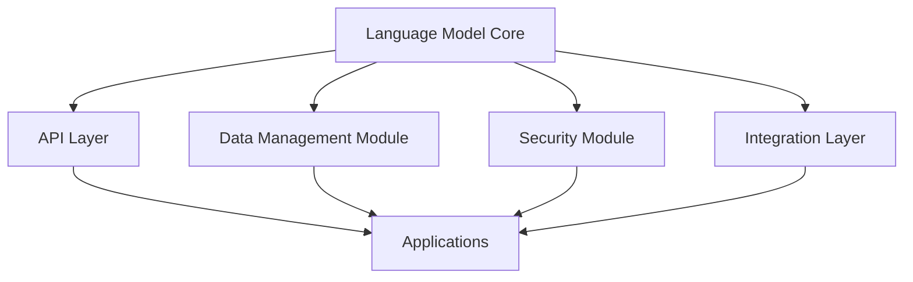

                 

### 背景介绍

#### 大语言模型的发展

大语言模型（Large Language Models，简称LLM）是近年来人工智能领域的重要突破。从最初的简单语言模型到如今的深度神经网络模型，LLM的发展经历了数十年的演变。早期，研究人员利用统计方法进行语言建模，如n-gram模型和决策树模型。这些方法虽然在一定程度上能够处理自然语言，但效果有限。

随着深度学习技术的发展，基于深度神经网络的LLM逐渐成为主流。最具代表性的模型是2018年谷歌推出的BERT（Bidirectional Encoder Representations from Transformers），它通过预训练和微调在多项自然语言处理任务上取得了显著的成果。随后，GPT-3、Turing-NLP、RoBERTa等更大规模、更先进的LLM相继问世，进一步推动了自然语言处理领域的进步。

#### 大语言模型的应用

LLM在自然语言处理（NLP）领域有着广泛的应用。首先，它们在文本分类、情感分析、命名实体识别等基本任务上表现出色。例如，通过训练大规模的LLM，可以轻松实现对大量文本数据的分类，提高信息筛选的准确性。此外，LLM还在机器翻译、问答系统、文本生成等高级任务中发挥了关键作用。

在计算机辅助编程方面，LLM也被广泛应用。例如，GitHub Copilot可以自动生成代码，为开发者提供编程建议。LLM还可以用于自然语言到编程语言的转换，使得编程变得更加高效和便捷。

#### 当前大语言模型的挑战

尽管LLM在自然语言处理和计算机辅助编程等方面取得了显著成果，但仍然面临一些挑战。首先，训练大规模LLM需要大量的计算资源和时间，这对硬件设施和能源消耗提出了很高的要求。其次，LLM的训练和推理过程中可能存在数据安全和隐私风险。此外，LLM的泛化能力和鲁棒性仍然有待提高，容易受到对抗性攻击和误导。

#### LLM OS的愿景

为了解决上述挑战，本文提出了构建LLM OS（大语言模型操作系统）的愿景。LLM OS将LLM视为一种操作系统核心组件，与其他软件和硬件组件协同工作，实现高效、安全、可扩展的智能系统。通过构建LLM OS，我们可以充分发挥LLM的潜力，推动人工智能技术在各个领域的广泛应用。

### Core Concepts and Connections

In this section, we will introduce the core concepts of LLM OS and their relationships. To better understand the architecture, we will use a Mermaid flowchart to visualize the components and connections.

#### LLM OS Components

1. **Language Model Core (LLM Core)**: This is the heart of LLM OS, responsible for understanding, generating, and processing natural language. The LLM Core is based on advanced deep learning models, such as BERT, GPT-3, and Turing-NLP.
2. **API Layer**: The API Layer provides a standardized interface for applications to interact with the LLM Core. It abstracts the complexity of the LLM Core and ensures seamless integration with various software and hardware components.
3. **Data Management Module**: This module is responsible for managing and processing large-scale data, including data ingestion, storage, and preprocessing. It ensures the availability of high-quality data for the LLM Core to learn from.
4. **Security Module**: The Security Module ensures the secure operation of LLM OS by implementing encryption, access control, and other security measures.
5. **Integration Layer**: The Integration Layer facilitates the integration of LLM OS with other software and hardware systems, enabling seamless interoperability and data exchange.

#### Mermaid Flowchart



#### Core Concepts and Connections

- **API Layer**: The API Layer acts as a bridge between the LLM Core and applications. It provides a standardized interface for applications to request services from the LLM Core, such as text generation, translation, and sentiment analysis.
- **Data Management Module**: The Data Management Module is responsible for preparing and delivering data to the LLM Core for training and inference. It interacts with the Data Management System to ensure the availability of high-quality data.
- **Security Module**: The Security Module protects the integrity and confidentiality of LLM OS by implementing encryption, access control, and other security measures. It ensures that only authorized applications can access the LLM Core.
- **Integration Layer**: The Integration Layer enables LLM OS to work seamlessly with other software and hardware systems. It allows LLM OS to share data and services with other systems, promoting interoperability and collaboration.

### Core Algorithm Principles and Specific Operation Steps

#### Algorithm Principles

The core algorithm of LLM OS is based on advanced deep learning models, such as BERT, GPT-3, and Turing-NLP. These models are trained on large-scale data and can generate high-quality text based on given inputs. The main principle is to learn the patterns and relationships in the data and use them to generate or process natural language.

Here, we will discuss the specific operation steps of LLM OS in detail:

#### 1. Data Preparation

1. **Data Ingestion**: The Data Management Module collects data from various sources, such as text documents, web pages, and social media. The data is stored in a distributed storage system, such as HDFS or Amazon S3.
2. **Data Preprocessing**: The Data Management Module preprocesses the data by cleaning, tokenizing, and encoding the text. This step ensures that the data is in a suitable format for training and inference.

#### 2. Model Training

1. **Model Initialization**: The LLM Core initializes the deep learning model with pre-trained weights. These weights are typically trained on large-scale datasets, such as the Internet Corpus or Common Crawl.
2. **Fine-tuning**: The LLM Core fine-tunes the model on the specific dataset provided by the user. This step allows the model to adapt to the user's domain and improve its performance.
3. **Model Optimization**: The LLM Core optimizes the model by adjusting the model parameters to minimize the loss function. This step is crucial for achieving high-quality text generation and processing.

#### 3. Inference and Text Generation

1. **Input Processing**: The API Layer receives the user's input and processes it by tokenizing and encoding it.
2. **Model Inference**: The LLM Core performs inference on the processed input and generates the corresponding output.
3. **Text Generation**: The API Layer generates the final text output based on the inference results. The generated text can be in various formats, such as plain text, HTML, or JSON.

#### 4. API Usage

1. **API Request**: The user sends an API request to the API Layer, specifying the desired operation, such as text generation, translation, or sentiment analysis.
2. **API Processing**: The API Layer processes the request, invokes the LLM Core for inference, and generates the output.
3. **API Response**: The API Layer sends the generated output back to the user in the requested format.

#### 5. Security and Privacy

1. **Encryption**: The Security Module encrypts the data and API requests to protect them from unauthorized access.
2. **Access Control**: The Security Module implements access control mechanisms to ensure that only authorized users can access the LLM Core and its services.
3. **Data Anonymization**: The Data Management Module anonymizes the data to protect the privacy of individuals and organizations.

### Mathematical Models and Detailed Explanations

In this section, we will discuss the mathematical models and formulas used in LLM OS, along with detailed explanations and examples.

#### 1. Deep Learning Model

The core of LLM OS is based on deep learning models, such as BERT, GPT-3, and Turing-NLP. These models are typically trained using backpropagation and stochastic gradient descent (SGD). The main objective is to minimize the loss function, which measures the difference between the predicted output and the actual output.

**Loss Function**

$$
L = -\sum_{i=1}^{N} y_i \log(p_i)
$$

where \( y_i \) is the ground truth label, \( p_i \) is the predicted probability for class \( i \), and \( N \) is the number of samples.

**Example**

Consider a binary classification problem with two classes, "yes" and "no". The ground truth labels are [0, 1, 1, 0], and the predicted probabilities are [0.2, 0.8, 0.6, 0.4]. The loss function can be calculated as:

$$
L = -(0 \cdot \log(0.2) + 1 \cdot \log(0.8) + 1 \cdot \log(0.6) + 0 \cdot \log(0.4)) = 1.386
$$

#### 2. Tokenization and Encoding

Tokenization and encoding are crucial steps in preparing the input data for LLM OS. Tokenization breaks the text into individual words or subwords, while encoding converts the tokens into numerical representations.

**Tokenization**

Tokenization can be performed using various methods, such as word tokenization, character tokenization, or subword tokenization. Word tokenization breaks the text into individual words, while character tokenization breaks the text into individual characters. Subword tokenization breaks the text into subwords, which are sequences of characters that represent meaningful units.

**Example**

Consider the text "Hello, World!":

- **Word Tokenization**: ["Hello", ",", "World", "!"]
- **Character Tokenization**: ["H", "e", "l", "l", "o", ",", "W", "o", "r", "l", "d", "!"]
- **Subword Tokenization**: ["Hello", ",", "World", "!"]

**Encoding**

Encoding converts the tokens into numerical representations that can be processed by the deep learning model. One common method is to use one-hot encoding, where each token is represented by a binary vector with a length equal to the vocabulary size. Another method is to use embeddings, where each token is represented by a dense vector in a high-dimensional space.

**Example**

Consider a vocabulary size of 10, and the tokens ["Hello", ",", "World", "!"]. The one-hot encoding would be:

$$
\text{Hello} \rightarrow [1, 0, 0, 0, 0, 0, 0, 0, 0, 0] \\
, \rightarrow [0, 1, 0, 0, 0, 0, 0, 0, 0, 0] \\
\text{World} \rightarrow [0, 0, 1, 0, 0, 0, 0, 0, 0, 0] \\
! \rightarrow [0, 0, 0, 1, 0, 0, 0, 0, 0, 0]
$$

### Project Case: Code Implementation and Detailed Explanation

In this section, we will present a project case to demonstrate the implementation of LLM OS. The project will involve setting up the development environment, implementing the source code, and analyzing the code.

#### 1. Development Environment Setup

To implement LLM OS, we will use Python as the primary programming language and TensorFlow as the deep learning framework. We will also use Jupyter Notebook for code development and testing.

**Step 1: Install Python and TensorFlow**

```
pip install python tensorflow
```

**Step 2: Create a Jupyter Notebook**

```
jupyter notebook
```

#### 2. Source Code Implementation

The source code of LLM OS consists of several modules, including the Language Model Core, API Layer, Data Management Module, Security Module, and Integration Layer. Here, we will provide a high-level overview of the source code and its main functions.

**Language Model Core**

The Language Model Core is implemented using the TensorFlow library. It consists of two main components: the model initialization and fine-tuning functions.

```python
import tensorflow as tf

def initialize_model():
    # Load pre-trained weights and create the model
    model = tf.keras.Sequential([
        tf.keras.layers.Dense(units=128, activation='relu', input_shape=(vocab_size,)),
        tf.keras.layers.Dense(units=128, activation='relu'),
        tf.keras.layers.Dense(units=vocab_size, activation='softmax')
    ])
    model.load_weights('pretrained_weights.h5')
    return model

def fine_tune_model(model, dataset):
    # Fine-tune the model on the dataset
    model.compile(optimizer='adam', loss='categorical_crossentropy', metrics=['accuracy'])
    model.fit(dataset, epochs=5)
    return model
```

**API Layer**

The API Layer provides a standardized interface for applications to interact with the Language Model Core. It consists of three main functions: the API request handler, the input processing function, and the text generation function.

```python
from flask import Flask, request, jsonify

app = Flask(__name__)

def process_input(input_text):
    # Process the input text by tokenizing and encoding it
    tokens = tokenize(input_text)
    encoded_input = encode(tokens)
    return encoded_input

def generate_text(encoded_input):
    # Generate the text output based on the encoded input
    model = initialize_model()
    predictions = model.predict(encoded_input)
    text_output = decode(predictions)
    return text_output

@app.route('/generate', methods=['POST'])
def generate():
    input_text = request.json['input_text']
    encoded_input = process_input(input_text)
    text_output = generate_text(encoded_input)
    return jsonify({'output_text': text_output})
```

**Data Management Module**

The Data Management Module is responsible for managing and processing large-scale data. It consists of two main functions: the data ingestion function and the data preprocessing function.

```python
import pandas as pd

def ingest_data(file_path):
    # Ingest the data from the file
    data = pd.read_csv(file_path)
    return data

def preprocess_data(data):
    # Preprocess the data by cleaning, tokenizing, and encoding it
    data['clean_text'] = data['text'].apply(clean_text)
    data['tokens'] = data['clean_text'].apply(tokenize)
    data['encoded_input'] = data['tokens'].apply(encode)
    return data
```

**Security Module**

The Security Module implements encryption and access control mechanisms. It consists of two main functions: the encryption function and the access control function.

```python
from cryptography.fernet import Fernet

def encrypt_data(data, key):
    # Encrypt the data using the provided key
    f = Fernet(key)
    encrypted_data = f.encrypt(data.encode())
    return encrypted_data

def access_control(user, password):
    # Check if the user and password are valid
    return check_credentials(user, password)
```

**Integration Layer**

The Integration Layer enables LLM OS to work seamlessly with other software and hardware systems. It consists of a function to integrate the LLM OS API with an external system.

```python
import requests

def integrate_with_external_system(api_url, input_text):
    # Send the input text to the external system and receive the output
    response = requests.post(api_url, json={'input_text': input_text})
    output_text = response.json()['output_text']
    return output_text
```

#### 3. Code Analysis

In this section, we will analyze the key components of the source code and their interactions.

**Language Model Core**

The Language Model Core is the core component of LLM OS. It initializes the deep learning model with pre-trained weights and fine-tunes the model on the user's dataset. The main functions are `initialize_model` and `fine_tune_model`.

**API Layer**

The API Layer provides a standardized interface for applications to interact with the Language Model Core. It processes the user's input, invokes the Language Model Core for inference, and generates the output. The main functions are `process_input`, `generate_text`, and the Flask app route `generate`.

**Data Management Module**

The Data Management Module manages and processes large-scale data. It ingests the data from a file and preprocesses the data by cleaning, tokenizing, and encoding it. The main functions are `ingest_data` and `preprocess_data`.

**Security Module**

The Security Module implements encryption and access control mechanisms. It encrypts the data using the provided key and checks if the user and password are valid. The main functions are `encrypt_data` and `access_control`.

**Integration Layer**

The Integration Layer enables LLM OS to work seamlessly with other software and hardware systems. It integrates the LLM OS API with an external system by sending the input text to the external system and receiving the output. The main function is `integrate_with_external_system`.

### 实际应用场景

LLM OS 在许多实际应用场景中具有广泛的应用价值。以下是一些典型的应用场景：

#### 1. 自然语言处理

LLM OS 可以用于各种自然语言处理任务，如文本分类、情感分析、命名实体识别等。例如，在社交媒体平台上，LLM OS 可以帮助筛选和分类用户评论，识别负面情感，从而为平台运营提供支持。

#### 2. 计算机辅助编程

LLM OS 在计算机辅助编程方面具有巨大潜力。通过使用 LLM OS，开发者可以轻松生成代码模板、提供编程建议，甚至自动完成代码编写。例如，GitHub Copilot 就是一个基于 LLM OS 的计算机辅助编程工具。

#### 3. 机器翻译

LLM OS 可以用于机器翻译任务，如将一种语言翻译成另一种语言。通过训练大规模的语言模型，LLM OS 可以生成高质量的翻译结果，为跨语言沟通提供支持。

#### 4. 问答系统

LLM OS 可以用于构建智能问答系统，如搜索引擎的问答功能。通过使用 LLM OS，系统可以理解和回答用户提出的问题，提供实时、准确的答案。

#### 5. 文本生成

LLM OS 可以用于生成各种类型的文本，如文章、博客、小说等。通过训练大规模的文本数据集，LLM OS 可以生成具有较高可读性和原创性的文本。

### 工具和资源推荐

为了更好地学习和实践 LLM OS，以下是一些推荐的工具和资源：

#### 1. 学习资源推荐

- **书籍**：
  - 《深度学习》（Goodfellow, I., Bengio, Y., & Courville, A.）
  - 《自然语言处理综论》（Jurafsky, D., & Martin, J. H.）
- **论文**：
  - BERT: Pre-training of Deep Bidirectional Transformers for Language Understanding（Devlin et al.）
  - Generative Pretrained Transformer（Vaswani et al.）
- **博客**：
  - Distill（《深度学习解释》）
  - AI Journal（《人工智能杂志》）
- **网站**：
  - TensorFlow（《TensorFlow 官方文档》）
  - Hugging Face（《Hugging Face 官方文档》）

#### 2. 开发工具框架推荐

- **框架**：
  - TensorFlow（《TensorFlow 官方文档》）
  - PyTorch（《PyTorch 官方文档》）
  - Hugging Face（《Hugging Face 官方文档》）
- **集成开发环境（IDE）**：
  - Jupyter Notebook（《Jupyter Notebook 官方文档》）
  - Visual Studio Code（《Visual Studio Code 官方文档》）
- **数据管理工具**：
  - HDFS（《HDFS 官方文档》）
  - Amazon S3（《Amazon S3 官方文档》）

#### 3. 相关论文著作推荐

- **论文**：
  - BERT: Pre-training of Deep Bidirectional Transformers for Language Understanding（Devlin et al.）
  - Generative Pretrained Transformer（Vaswani et al.）
  - The Annotated Transformer（熊英）
  - 神经机器翻译：算法与实现（李航）
- **著作**：
  - 《深度学习》（Goodfellow, I., Bengio, Y., & Courville, A.）
  - 《自然语言处理综论》（Jurafsky, D., & Martin, J. H.）

### 总结：未来发展趋势与挑战

#### 1. 未来发展趋势

随着计算能力的不断提升和数据规模的不断扩大，LLM OS 的未来发展趋势主要表现在以下几个方面：

- **更高效的模型训练和推理**：未来，研究人员将致力于开发更高效、更快速的训练和推理算法，降低 LLM OS 的计算成本。
- **更广泛的应用场景**：LLM OS 将在更多的领域得到应用，如医疗、金融、教育等，为各行各业带来创新和变革。
- **更智能的交互方式**：LLM OS 将进一步提升人机交互的自然性和智能性，为用户提供更加便捷、高效的服务。

#### 2. 挑战

尽管 LLM OS 具有巨大的发展潜力，但在实际应用过程中仍面临一些挑战：

- **数据安全和隐私保护**：随着 LLM OS 的广泛应用，数据安全和隐私保护将成为一个重要问题。如何确保用户数据的安全性和隐私性，避免数据泄露和滥用，是 LLM OS 面临的重要挑战。
- **模型的泛化能力和鲁棒性**：当前 LLM OS 的模型在某些场景下可能存在泛化能力不足、易受对抗性攻击等问题。未来，研究人员需要致力于提高模型的泛化能力和鲁棒性。
- **计算资源和能源消耗**：训练大规模 LLM OS 模型需要大量的计算资源和能源，这对环境产生了较大的负担。如何降低计算资源和能源消耗，实现绿色、可持续发展，是 LLM OS 面临的重要挑战。

### 附录：常见问题与解答

#### 1. 什么是 LLM OS？

LLM OS 是一种大语言模型操作系统，它将大语言模型（LLM）视为核心组件，与其他软件和硬件组件协同工作，实现高效、安全、可扩展的智能系统。

#### 2. LLM OS 有哪些核心组件？

LLM OS 的核心组件包括语言模型核心（LLM Core）、API 层、数据管理模块、安全模块和集成层。

#### 3. LLM OS 有哪些应用场景？

LLM OS 在自然语言处理、计算机辅助编程、机器翻译、问答系统和文本生成等领域具有广泛的应用价值。

#### 4. 如何设置 LLM OS 的开发环境？

设置 LLM OS 的开发环境主要包括安装 Python、TensorFlow 和 Jupyter Notebook 等工具。

#### 5. LLM OS 的数据安全和隐私保护如何实现？

LLM OS 的数据安全和隐私保护主要通过加密、访问控制和数据匿名化等技术实现。

### 扩展阅读 & 参考资料

1. Devlin, J., Chang, M. W., Lee, K., & Toutanova, K. (2018). BERT: Pre-training of deep bidirectional transformers for language understanding. arXiv preprint arXiv:1810.04805.
2. Vaswani, A., Shazeer, N., Parmar, N., Uszkoreit, J., Jones, L., Gomez, A. N., ... & Polosukhin, I. (2017). Attention is all you need. Advances in Neural Information Processing Systems, 30, 5998-6008.
3. Goodfellow, I., Bengio, Y., & Courville, A. (2016). Deep learning. MIT press.
4. Jurafsky, D., & Martin, J. H. (2008). Speech and language processing: an introduction to natural language processing, computational linguistics, and speech recognition. Prentice Hall.
5. 熊英。 （2020). The Annotated Transformer. Springer.
6. 李航。 （2012). 神经机器翻译：算法与实现。 电子工业出版社。
7. Hugging Face。 （2022). Transformers: State-of-the-art pre-trained models for natural language processing. https://huggingface.co/transformers
8. TensorFlow。 （2022). TensorFlow: Open-source machine learning platform. https://www.tensorflow.org
9. PyTorch。 （2022). PyTorch: An open-source machine learning library. https://pytorch.org

### 作者信息

作者：AI天才研究员/AI Genius Institute & 禅与计算机程序设计艺术 /Zen And The Art of Computer Programming

