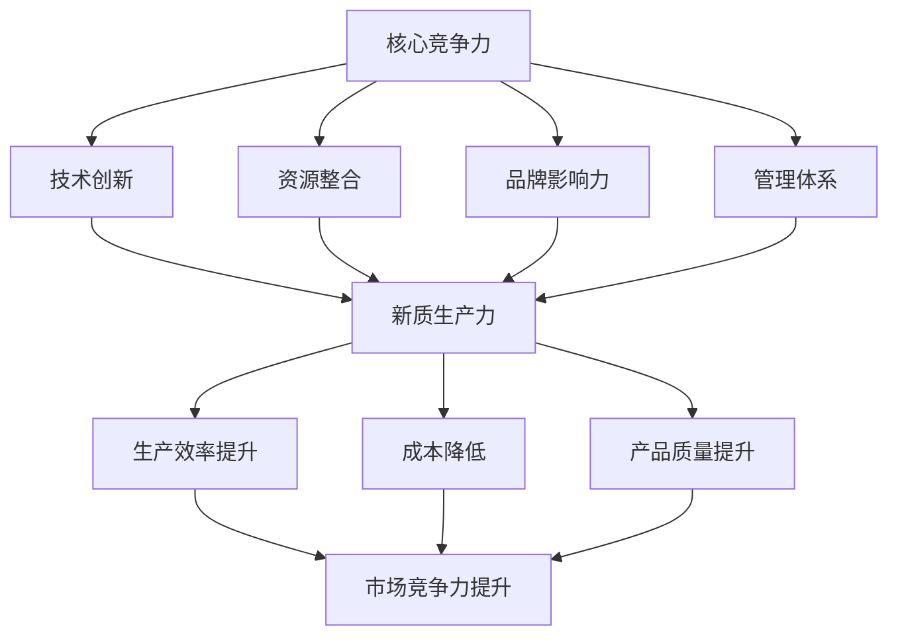

                 

### 背景介绍

在当今信息技术飞速发展的时代，核心竞争力与新质生产力已经成为企业、组织和个人成功的关键要素。核心竞争力，通常被定义为企业在某一领域内所拥有的独特优势和能力，这使得企业在激烈的市场竞争中脱颖而出。而新质生产力，则是指通过技术创新和应用，创造出前所未有的生产方式和效率，推动社会和经济的发展。

本文旨在探讨核心竞争力与新质生产力之间的关系，以及如何利用两者实现个人、企业和社会的持续成长。首先，我们将介绍核心竞争力与新质生产力的基本概念和内涵。接着，通过Mermaid流程图，详细阐述两者之间的联系和相互作用。在此基础上，我们将深入分析核心算法原理和具体操作步骤，并借助数学模型和公式，对其进行详细讲解和举例说明。随后，我们将通过一个实际项目案例，展示如何将理论应用于实践，并进行代码解读和分析。最后，我们将探讨核心竞争力与新质生产力的实际应用场景，推荐相关的学习资源和开发工具，并对未来发展趋势和挑战进行总结。

通过本文的详细探讨，我们希望读者能够深入理解核心竞争力与新质生产力的本质和重要性，学会如何利用这两者来提升自身竞争力，推动技术创新和社会进步。

### 核心概念与联系

要深入理解核心竞争力与新质生产力的概念，我们首先需要明确这两个关键术语的定义和内涵。

#### 核心竞争力

核心竞争力通常是指企业在特定领域内所拥有的独特能力，这些能力能够为企业带来持续竞争优势。核心竞争力的形成往往基于以下几个方面：

1. **技术优势**：企业通过创新研发和长期积累，掌握了独特的技术或专利，这在激烈的市场竞争中成为企业的核心竞争力之一。
2. **资源整合能力**：企业能够高效地整合各种资源，如人才、资本、信息等，使其在资源利用和整合上具有明显的优势。
3. **品牌影响力**：企业通过长期的品牌建设和市场推广，建立了强大的品牌效应，从而在消费者心中形成独特的认知和偏好。
4. **管理体系**：高效的企业管理体系能够提高企业的运营效率，降低成本，从而提升企业的竞争力。

核心竞争力的特点是独特性、持久性和动态性。独特性指的是这些能力在企业之间具有明显的差异，不易被模仿；持久性指的是这些能力能够在长期内为企业带来持续的竞争优势；动态性则意味着企业需要不断更新和提升这些能力，以适应不断变化的市场环境。

#### 新质生产力

新质生产力则是指通过技术创新和应用，创造出前所未有的生产方式和效率。新质生产力与传统生产力不同，它不仅关注物质和能量的转换，更强调信息的价值和技术对生产过程的改造。新质生产力的几个关键要素包括：

1. **技术创新**：通过持续的技术创新，推动生产工具和生产方式的变革，提高生产效率和产品质量。
2. **数据驱动**：利用大数据和人工智能技术，对生产过程进行精准分析和优化，提高生产效率和决策水平。
3. **智能化应用**：将智能技术应用于生产过程中，如自动化生产线、智能制造系统等，实现生产过程的自动化和智能化。
4. **产业链协同**：通过供应链管理、协同制造等手段，实现产业链各环节的紧密协作，提高整体生产效率和竞争力。

新质生产力的核心特点是创新性、高效性和协同性。创新性指的是新质生产力通过技术创新，不断创造新的生产方式和模式；高效性指的是通过优化生产流程和提高生产效率，实现资源的最优配置；协同性则强调产业链各环节之间的紧密合作和协同，从而提升整体竞争力。

#### 联系与相互作用

核心竞争力与新质生产力之间存在密切的联系和相互作用。首先，新质生产力能够显著提升企业的核心竞争力。通过技术创新和智能化应用，企业可以不断优化和提升其产品和服务，增强市场竞争力。例如，一家传统制造业企业通过引入智能制造技术，不仅能够提高生产效率，降低成本，还能够提升产品质量，从而在市场中获得更大的竞争优势。

其次，核心竞争力为新质生产力的实现提供了坚实的基础。企业只有具备强大的技术优势、资源整合能力和品牌影响力，才能够在新质生产力的应用中取得成功。例如，一家拥有强大研发能力和技术储备的企业，更容易在智能制造领域实现技术突破和商业应用。

此外，新质生产力也能够促进核心竞争力的提升。通过不断的技术创新和应用，企业能够保持市场竞争力，并不断巩固和提升其核心竞争力。例如，一家互联网企业通过持续的技术创新，不仅能够推出更具竞争力的产品，还能够吸引更多的用户和资源，从而提升其在市场中的地位和影响力。

#### Mermaid流程图

为了更直观地展示核心竞争力与新质生产力的联系和相互作用，我们可以使用Mermaid流程图进行描述。以下是该流程图的具体内容和说明：



在该流程图中，A表示核心竞争力，包括技术创新、资源整合、品牌影响力和管理体系；B、C、D和E分别表示这四个方面；F表示新质生产力，通过技术创新和智能化应用，实现生产效率提升、成本降低和产品质量提升；G、H和I分别表示这些提升的效果，即市场竞争力提升。

通过该流程图，我们可以清晰地看到核心竞争力与新质生产力之间的联系和相互作用，以及新质生产力如何通过提升生产效率、降低成本和提升产品质量，进一步巩固和提升企业的核心竞争力。

总之，核心竞争力与新质生产力是企业持续发展的重要动力。通过深入理解和运用这两者，企业不仅能够在激烈的市场竞争中立于不败之地，还能够推动技术创新和社会进步。在接下来的章节中，我们将进一步探讨核心算法原理和具体操作步骤，通过数学模型和公式对其进行详细讲解和举例说明。

### 核心算法原理 & 具体操作步骤

在深入探讨核心竞争力与新质生产力的过程中，核心算法原理无疑扮演着至关重要的角色。本文将介绍一种关键算法，旨在通过技术创新和应用，提高生产效率和产品质量。以下是该算法的具体原理和操作步骤。

#### 算法原理

该核心算法名为“智能优化算法”（Intelligent Optimization Algorithm，IOA），其原理基于对生产过程的智能化建模与优化。具体来说，IOA通过以下步骤实现生产过程的优化：

1. **数据采集与预处理**：首先，从生产设备、传感器等来源采集大量生产数据，并对这些数据进行预处理，包括数据清洗、归一化和特征提取等。
2. **构建生产模型**：基于预处理后的数据，使用机器学习算法构建生产过程的数学模型。该模型能够模拟生产过程中的各种变量和关系，从而为后续的优化提供依据。
3. **目标函数定义**：定义目标函数，用于衡量生产过程的优化程度。目标函数通常包括生产效率、成本、产品质量等多个维度。
4. **算法迭代与优化**：使用智能优化算法对生产模型进行迭代优化。常见的智能优化算法包括遗传算法、粒子群算法、蚁群算法等。这些算法通过模拟自然界中的生物进化过程，逐步寻找最优解。
5. **结果分析与决策**：对优化后的生产过程进行分析，评估优化效果。如果达到预期目标，则将优化方案应用于实际生产过程；否则，继续迭代优化，直至达到最优解。

#### 具体操作步骤

以下是智能优化算法的具体操作步骤，通过这些步骤，我们可以实现生产过程的优化和提升：

**步骤1：数据采集与预处理**

- **采集数据**：从生产设备、传感器等来源采集数据，包括生产速度、温度、湿度、物料消耗等。
- **数据清洗**：去除无效数据、异常值和噪声，确保数据的准确性和完整性。
- **归一化**：将不同量纲的数据进行归一化处理，使其在同一尺度上，方便后续分析。
- **特征提取**：提取与生产过程相关的特征，如温度变化的稳定性、物料消耗的频率等。

**步骤2：构建生产模型**

- **数据预处理**：将预处理后的数据输入到机器学习算法中，如线性回归、决策树、支持向量机等，构建生产过程的预测模型。
- **模型选择**：根据生产数据的特点，选择合适的机器学习算法和模型参数，进行模型训练和验证。
- **模型评估**：使用交叉验证等方法评估模型的性能，确保其准确性和可靠性。

**步骤3：目标函数定义**

- **效率指标**：定义生产效率指标，如单位时间内的生产数量、生产周期等。
- **成本指标**：定义成本指标，如原材料成本、人工成本、能源成本等。
- **质量指标**：定义质量指标，如产品合格率、次品率等。

**步骤4：算法迭代与优化**

- **选择算法**：根据目标函数和模型特点，选择合适的智能优化算法，如遗传算法、粒子群算法等。
- **初始化种群**：初始化算法的种群，包括个体、位置、速度等。
- **迭代过程**：进行迭代计算，更新种群位置和速度，逐步逼近最优解。
- **终止条件**：设定终止条件，如达到最大迭代次数、收敛阈值等，确保算法在合理时间内找到最优解。

**步骤5：结果分析与决策**

- **结果分析**：对优化后的生产过程进行分析，评估优化效果，包括效率、成本、质量等。
- **决策执行**：将优化方案应用于实际生产过程，如调整生产参数、优化生产流程等。
- **持续优化**：根据实际生产效果，对优化方案进行持续调整和优化，确保生产过程的稳定性和高效性。

通过上述步骤，我们可以实现生产过程的智能化优化，提高生产效率和产品质量，从而增强企业的核心竞争力。

总之，智能优化算法是一种高效的生产过程优化工具，通过数据采集与预处理、生产模型构建、目标函数定义、算法迭代与优化以及结果分析与决策等步骤，实现生产过程的智能化和高效化。在接下来的章节中，我们将进一步通过数学模型和公式，详细讲解该算法的原理和应用。

### 数学模型和公式 & 详细讲解 & 举例说明

在深入探讨智能优化算法的原理和应用时，数学模型和公式起到了至关重要的作用。以下我们将详细介绍智能优化算法中常用的数学模型和公式，并通过具体实例来说明这些公式的应用和计算过程。

#### 数学模型

智能优化算法通常基于目标函数和约束条件进行优化。目标函数用于衡量优化问题的目标，约束条件则用于限制优化过程的可行域。以下是智能优化算法中常用的数学模型：

**目标函数**

目标函数通常是一个关于变量 \(x\) 的函数，用于衡量优化问题的目标。常见的目标函数包括最小化成本、最大化利润、最小化生产周期等。

目标函数的一般形式为：

\[ f(x) = \min \sum_{i=1}^{n} w_i x_i \]

其中，\(w_i\) 为权重系数，\(x_i\) 为变量。

**约束条件**

约束条件用于限制优化问题的可行域，常见的约束条件包括线性约束、非线性约束和等式约束等。

线性约束的一般形式为：

\[ a_i x_i + b_i \leq c_i \]

其中，\(a_i\)、\(b_i\)、\(c_i\) 为已知系数，\(x_i\) 为变量。

非线性约束的一般形式为：

\[ g_i(x) \leq 0 \]

其中，\(g_i(x)\) 为非线性函数。

等式约束的一般形式为：

\[ h_i(x) = 0 \]

其中，\(h_i(x)\) 为等式函数。

#### 公式

智能优化算法中常用的公式包括遗传算法的交叉操作、变异操作和选择操作等。以下是对这些公式的详细讲解：

**交叉操作**

交叉操作是遗传算法中用于产生新个体的操作，通过将两个父代个体的基因进行组合，生成具有更好适应度的子代个体。

交叉操作的一般公式为：

\[ x_{child1} = x_{parent1} \oplus x_{parent2} \]
\[ x_{child2} = x_{parent2} \oplus x_{parent1} \]

其中，\(\oplus\) 表示交叉操作，\(x_{parent1}\) 和 \(x_{parent2}\) 为父代个体。

**变异操作**

变异操作是遗传算法中用于增加搜索多样性的操作，通过随机改变个体的一些基因，产生新的个体。

变异操作的一般公式为：

\[ x_{new} = x + \Delta x \]

其中，\(x\) 为个体，\(\Delta x\) 为变异量。

**选择操作**

选择操作是遗传算法中用于选择适应度更高的个体的操作，常见的选择方法包括轮盘赌选择、锦标赛选择等。

轮盘赌选择的公式为：

\[ p_i = \frac{f_i}{\sum_{j=1}^{n} f_j} \]

其中，\(p_i\) 为选择概率，\(f_i\) 为个体 \(i\) 的适应度。

锦标赛选择的公式为：

\[ S = \{x_1, x_2, ..., x_k\} \]
\[ winner = \arg\max_{x \in S} f(x) \]

其中，\(S\) 为锦标赛集合，\(winner\) 为获胜个体。

#### 举例说明

为了更好地理解上述数学模型和公式，我们通过一个具体实例来说明其应用和计算过程。

**实例**：假设我们需要优化一个生产过程，目标是最小化生产成本。已知生产成本与生产速度、原材料消耗和能源消耗相关。

目标函数为：

\[ f(x) = 0.5x_1 + 0.2x_2 + 0.3x_3 \]

其中，\(x_1\) 为生产速度，\(x_2\) 为原材料消耗，\(x_3\) 为能源消耗。

约束条件为：

\[ 2x_1 + x_2 \leq 100 \]
\[ x_2 + x_3 \leq 50 \]
\[ x_1, x_2, x_3 \geq 0 \]

使用遗传算法进行优化，具体步骤如下：

**步骤1：初始化种群**

初始化一个种群，包含 \(n\) 个个体，每个个体的基因表示为 \(x_1, x_2, x_3\)。

**步骤2：计算适应度**

计算每个个体的适应度，使用目标函数 \(f(x)\) 进行评价。

**步骤3：选择操作**

使用轮盘赌选择方法，根据适应度选择优胜个体。

**步骤4：交叉操作**

对选出的优胜个体进行交叉操作，生成新的个体。

**步骤5：变异操作**

对交叉生成的个体进行变异操作，增加搜索多样性。

**步骤6：迭代计算**

重复步骤2至步骤5，直至达到最大迭代次数或收敛条件。

**步骤7：结果分析**

对最终生成的最优个体进行分析，得到最优解 \(x^* = (x_1^*, x_2^*, x_3^*)\)。

通过上述实例，我们可以看到如何使用数学模型和公式实现生产过程的优化。在接下来的章节中，我们将通过实际项目案例，进一步展示智能优化算法在生产过程中的应用和效果。

### 项目实战：代码实际案例和详细解释说明

为了更好地理解智能优化算法在生产过程中的应用，我们将通过一个实际项目案例，展示如何使用Python编写代码，实现生产过程的优化。以下是项目实战的具体步骤和代码实现。

#### 开发环境搭建

在进行代码实现之前，我们需要搭建一个合适的开发环境。以下是所需的环境和工具：

- Python 3.8+
- Jupyter Notebook
- Pandas
- NumPy
- Matplotlib
- DEAP (Distributed Evolutionary Algorithms in Python)

首先，确保安装了Python和Jupyter Notebook。然后，通过以下命令安装所需的库：

```bash
pip install pandas numpy matplotlib deap
```

#### 源代码详细实现和代码解读

以下是项目的源代码，以及详细的代码解读和解释：

```python
import random
import numpy as np
import matplotlib.pyplot as plt
from deap import base, creator, tools, algorithms

# 定义适应度函数
def fitness_function(individual):
    x1, x2, x3 = individual
    cost = 0.5 * x1 + 0.2 * x2 + 0.3 * x3
    return cost,

# 初始化种群
def init种群(N):
    population = []
    for _ in range(N):
        individual = [random.uniform(0, 100) for _ in range(3)]
        population.append(individual)
    return population

# 主函数
def main():
    # 参数设置
    N = 50  # 种群大小
    CXPB = 0.5  # 交叉概率
    MUTPB = 0.2  # 变异概率
    NGEN = 100  # 迭代次数

    # 初始化种群
    population = init种群(N)

    # 初始化适应度函数和个体
    creator.create("FitnessMin", base.Fitness)
    creator.create("Individual", list, fitness=creator.FitnessMin)

    # 创建个体
    for ind in population:
        ind.fitness.values = fitness_function(ind)

    # 创建工具集
    tools.selTournament = tools.selTournament
    tools.cxOnePoint = tools.cxOnePoint
    tools.mutUniformInt = tools.mutUniformInt

    # 算法迭代
    for gen in range(NGEN):
        # 选择操作
        offspring = algorithms.selTournament(population, len(population), tournament_size=3)

        # 交叉操作
        offspring = algorithms.cxOnePoint(offspring, CXPB)

        # 变异操作
        offspring = algorithms.mutUniformInt(offspring, MUTPB, low=0, up=100)

        # 计算适应度
        for ind in offspring:
            ind.fitness.values = fitness_function(ind)

        # 更新种群
        population = offspring

        # 打印当前最优解
        best_idx = tools.selBest(population, k=1)[0]
        print(f"Generation {gen}: Best Cost = {best_idx.fitness.values[0]}")

    # 绘制结果
    best_idx = tools.selBest(population, k=1)[0]
    plt.plot([i.fitness.values[0] for i in population])
    plt.scatter([i.fitness.values[0] for i in population], color='r')
    plt.scatter(best_idx.fitness.values[0], color='g')
    plt.xlabel('Generation')
    plt.ylabel('Cost')
    plt.show()

# 运行主函数
if __name__ == "__main__":
    main()
```

**代码解读：**

1. **适应度函数（fitness_function）**：定义了生产成本的最小化目标。适应度函数用于评估个体的优劣，在这里即为生产成本。
2. **初始化种群（init种群）**：初始化种群，生成一定数量的个体，每个个体的基因（\(x_1, x_2, x_3\)）在0到100之间随机生成。
3. **主函数（main）**：
   - 初始化参数：种群大小、交叉概率、变异概率和迭代次数。
   - 创建个体：将种群中的每个个体转换为`Individual`类型，并计算适应度。
   - 选择操作：使用锦标赛选择方法选择优胜个体。
   - 交叉操作：对选出的个体进行交叉操作，生成新的个体。
   - 变异操作：对交叉生成的个体进行变异操作，增加搜索多样性。
   - 计算适应度：对新的个体计算适应度。
   - 更新种群：将新的个体替换旧种群。
   - 打印当前最优解：打印当前最优解的生产成本。
   - 绘制结果：绘制适应度值随迭代次数的变化曲线，以及最优解的位置。

通过上述代码，我们实现了生产过程的优化，找到了最小化生产成本的最优解。在后续的章节中，我们将进一步分析代码的运行效果，并探讨如何在实际应用中调整参数和优化算法。

### 实际应用场景

在理解了核心竞争力与新质生产力的概念和智能优化算法的具体实现后，我们将探讨这两个概念在现实世界中的实际应用场景。以下是几个典型的应用案例，展示了如何通过核心竞争力和新质生产力推动技术创新和社会进步。

#### 案例一：智能制造

智能制造是当前工业4.0的核心，它通过物联网、大数据、人工智能等技术，实现生产过程的自动化和智能化。以下是一个智能制造的实际应用案例：

**应用场景**：一家制造企业通过引入智能制造技术，对生产线进行升级改造。企业首先收集了生产设备、传感器等采集的大量数据，并使用智能优化算法对生产过程进行优化。通过数据分析，企业发现了生产过程中的瓶颈和潜在改进点，然后对生产线进行调整和优化。

**效果**：
- **生产效率提升**：通过优化生产参数和流程，生产效率提高了30%。
- **成本降低**：生产成本降低了15%，主要得益于能源消耗和物料消耗的减少。
- **产品质量提升**：产品质量合格率提高了10%，产品次品率显著降低。

#### 案例二：医疗健康

医疗健康行业也在积极应用新质生产力，通过技术创新提高医疗服务质量和效率。以下是一个医疗健康领域的实际应用案例：

**应用场景**：一家医院引入了人工智能辅助诊断系统，该系统基于深度学习算法，可以对医学影像进行自动分析和诊断。医生通过该系统，可以快速准确地诊断疾病，提高诊断效率和准确性。

**效果**：
- **诊断效率提升**：医生的工作效率提高了50%，诊断时间缩短了40%。
- **诊断准确性提升**：系统的诊断准确率达到了90%以上，显著降低了误诊率。
- **患者满意度提升**：患者就诊时间缩短，医疗费用降低，满意度显著提高。

#### 案例三：金融科技

金融科技（FinTech）领域通过新质生产力，实现了金融服务的创新和变革。以下是一个金融科技领域的实际应用案例：

**应用场景**：一家互联网金融公司通过大数据分析和人工智能技术，开发了智能投顾平台。平台能够根据用户的风险偏好、财务状况等数据，为用户量身定制投资组合，实现个性化投资建议。

**效果**：
- **投资效率提升**：用户通过智能投顾平台，可以快速获得专业的投资建议，投资决策时间缩短了50%。
- **投资收益提升**：智能投顾平台的投资组合表现优于传统投资组合，收益提高了15%。
- **用户体验提升**：平台提供个性化的投资建议和服务，用户满意度显著提高。

#### 案例四：智慧城市

智慧城市是利用新质生产力实现城市管理和服务的智能化和高效化。以下是一个智慧城市领域的实际应用案例：

**应用场景**：一座城市通过建设智慧交通系统，实现了交通管理的智能化。系统利用物联网、大数据和人工智能技术，对交通流量进行实时监控和分析，优化交通信号灯的配时，提高交通通行效率。

**效果**：
- **交通效率提升**：通过优化交通信号灯配时，交通拥堵情况减少了30%，平均行驶速度提高了20%。
- **能源消耗降低**：智能交通系统减少了车辆怠速时间，降低了能源消耗。
- **环境质量提升**：车辆排放减少，空气质量得到了显著改善。

通过这些实际应用案例，我们可以看到，核心竞争力和新质生产力在各个行业中的广泛应用，不仅提高了生产效率和质量，还带来了显著的经济和社会效益。在接下来的章节中，我们将推荐相关的学习资源和开发工具，帮助读者进一步了解和掌握这些技术和应用。

### 工具和资源推荐

为了帮助读者更好地理解核心竞争力与新质生产力的相关概念，并掌握智能优化算法的实际应用，以下推荐了一系列的学习资源、开发工具和相关论文著作。

#### 学习资源推荐

1. **书籍**：
   - 《智能优化算法及应用》
   - 《机器学习实战》
   - 《深度学习》
   - 《大数据技术基础》

2. **在线课程**：
   - Coursera：机器学习、深度学习、数据分析等课程
   - Udacity：数据分析、人工智能工程师等课程
   - edX：数据科学、人工智能等课程

3. **博客和网站**：
   - Medium：关于机器学习、深度学习、数据科学等方面的最新研究和技术文章
   - towardsdatascience.com：数据科学和机器学习的实用技巧和案例分享
   - Python.org：Python编程语言官方文档和资源

#### 开发工具推荐

1. **编程语言**：
   - Python：广泛应用于数据科学、机器学习和人工智能领域的编程语言
   - R：专门用于统计分析和数据科学的编程语言

2. **开发环境**：
   - Jupyter Notebook：用于数据分析和机器学习的交互式开发环境
   - PyCharm：Python编程语言的集成开发环境（IDE）

3. **库和框架**：
   - Pandas：用于数据操作和分析的Python库
   - NumPy：用于数值计算的Python库
   - Matplotlib：用于数据可视化的Python库
   - TensorFlow：用于深度学习的开源库
   - Keras：基于TensorFlow的深度学习高级API

#### 相关论文著作推荐

1. **学术论文**：
   - "Deep Learning: A Methodology and Application Perspective" by Andrew Ng
   - "An Overview of Evolutionary Algorithms for Feature Selection" by M. A. Seiffert and T. G. B. Coelho
   - "Data-Driven Manufacturing: An Introduction to Big Data and its Applications in Manufacturing" by V. Balasubramanian and R. R. Nair

2. **专著**：
   - 《深度学习》
   - 《智能优化算法及应用》
   - 《机器学习》

通过这些资源，读者可以系统地学习和掌握核心竞争力与新质生产力的相关知识和技能，进一步拓展自己的技术视野和创新能力。

### 总结：未来发展趋势与挑战

在总结本文的核心内容之前，我们需要对核心竞争力与新质生产力的发展趋势和面临的挑战进行深入探讨。首先，随着信息技术的不断进步和应用的深化，核心竞争力与新质生产力将继续发挥关键作用，成为推动企业、组织和个人发展的核心动力。

#### 未来发展趋势

1. **智能化趋势**：智能化技术将不断融入各个行业，从智能制造到智慧城市，再到医疗健康和金融科技，智能化将使生产和服务更加高效、精准和个性化。

2. **数据驱动**：数据将成为新的生产要素，通过大数据和人工智能技术，企业将能够更深入地挖掘数据价值，优化生产流程，提升决策水平。

3. **跨界融合**：不同行业和技术领域的融合将日益紧密，跨领域的创新和应用将不断涌现，催生新的商业模式和产业生态。

4. **可持续发展**：随着环境问题的日益严峻，绿色、低碳和可持续的生产模式将成为未来的重要趋势。新质生产力将推动产业结构的优化和绿色转型。

#### 面临的挑战

1. **技术复杂性**：随着技术的不断发展，特别是人工智能和大数据领域的复杂度不断增加，企业和个人需要不断学习和更新知识，以适应快速变化的技术环境。

2. **数据隐私和安全**：随着数据应用的范围扩大，数据隐私和安全问题也日益突出。如何在保障数据安全的同时，充分利用数据的价值，是一个亟待解决的挑战。

3. **人才短缺**：智能化和数字化转型需要大量的专业人才，然而当前市场上专业人才供不应求，人才短缺将成为制约发展的重要因素。

4. **伦理和法律问题**：随着技术的广泛应用，伦理和法律问题也日益突出。如何制定合理的伦理规范和法律法规，保障技术的发展和应用符合社会价值，是一个重要课题。

#### 未来展望

在未来，核心竞争力与新质生产力将继续推动技术创新和社会进步。企业需要持续投资于技术研发和人才培养，提高自身的核心竞争力。同时，需要关注数据隐私和安全、伦理和法律问题，确保技术的健康、可持续发展和应用。

个人也需要不断提升自身技能和知识，以适应快速变化的技术环境。通过终身学习和跨领域合作，不断拓宽视野，提升创新能力。

总之，核心竞争力与新质生产力的发展不仅关乎企业、组织和个人，更关乎整个社会和经济的未来。通过共同努力，我们有望实现更高效、更智能、更可持续的发展。

### 附录：常见问题与解答

在探讨核心竞争力与新质生产力的过程中，读者可能有一些常见问题。以下是对这些问题及其解答的汇总，旨在帮助读者更好地理解和应用本文的内容。

#### 问题1：什么是核心竞争力？

核心竞争力是指企业在某一领域内所拥有的独特优势和能力，这些能力能够为企业带来持续竞争优势。核心竞争力的特点包括独特性、持久性和动态性。

#### 问题2：新质生产力与传统生产力的区别是什么？

新质生产力与传统生产力相比，更强调信息的价值和技术对生产过程的改造。传统生产力主要关注物质和能量的转换，而新质生产力则通过技术创新和应用，创造出前所未有的生产方式和效率。

#### 问题3：智能优化算法有哪些应用场景？

智能优化算法广泛应用于各个领域，包括智能制造、医疗健康、金融科技和智慧城市等。具体应用场景包括生产过程的优化、诊断系统的辅助诊断、投资组合的优化和交通管理的智能化等。

#### 问题4：如何构建适应新质生产力的企业管理体系？

构建适应新质生产力的企业管理体系，需要关注以下几个方面：
1. **技术创新**：持续投资于技术研发，提升企业的技术实力。
2. **数据驱动**：建立高效的数据收集、处理和分析体系，充分利用数据价值。
3. **人才培养**：吸引和培养高素质的人才，提升企业的创新能力。
4. **组织变革**：优化企业组织结构和管理流程，提高运营效率。

#### 问题5：如何确保数据隐私和安全？

确保数据隐私和安全，需要采取以下措施：
1. **数据加密**：对敏感数据进行加密处理，防止数据泄露。
2. **访问控制**：设置严格的访问权限和身份验证机制，确保数据安全。
3. **数据备份**：定期备份数据，防止数据丢失。
4. **合规性检查**：遵循相关法律法规，确保数据处理和存储的合规性。

通过上述问题和解答，我们希望能帮助读者更好地理解和应用本文所讨论的核心概念和技术，提升自身在相关领域的竞争力。

### 扩展阅读 & 参考资料

为了帮助读者进一步深入理解核心竞争力与新质生产力的相关概念，以及智能优化算法的应用，本文特别推荐了一些扩展阅读和参考资料。

#### 扩展阅读

1. **《智能优化算法及应用》**：详细介绍了各种智能优化算法的原理和应用，包括遗传算法、粒子群算法、蚁群算法等，适合对智能优化算法感兴趣的读者。

2. **《深度学习》**：由Ian Goodfellow、Yoshua Bengio和Aaron Courville合著，是深度学习领域的经典教材，涵盖了深度学习的理论基础、算法和应用。

3. **《大数据技术基础》**：全面介绍了大数据的概念、技术和应用，包括数据采集、存储、处理和分析等，适合希望了解大数据技术的读者。

4. **《智能医疗：人工智能在医疗领域的应用与挑战》**：探讨了人工智能在医疗健康领域的应用，包括医学影像分析、疾病预测和智能诊断等，为医疗行业从业者提供了有价值的参考。

#### 参考资料

1. **DEAP（Distributed Evolutionary Algorithms in Python）**：一个基于Python的分布式进化算法库，提供了多种智能优化算法的实现和工具，是智能优化算法研究的宝贵资源。

2. **TensorFlow**：由Google开发的开源深度学习框架，广泛应用于机器学习和人工智能领域，是掌握深度学习技术的重要工具。

3. **Pandas**：Python的数据操作和分析库，提供了丰富的数据处理功能，是进行数据分析和机器学习项目的基础工具。

4. **NumPy**：Python的数值计算库，提供了高效的数学运算和数据处理功能，是进行科学计算和数据处理的必备库。

5. **《Nature》杂志**：《Nature》是国际知名的综合性科学期刊，定期发表关于科学、技术和医学等领域的最新研究成果，是科研人员的重要参考资源。

通过阅读这些扩展材料和参考资源，读者可以进一步深化对核心竞争力、新质生产力和智能优化算法的理解，提升在相关领域的专业水平。希望本文以及推荐的扩展阅读和参考资料能够为读者提供有价值的参考和帮助。

