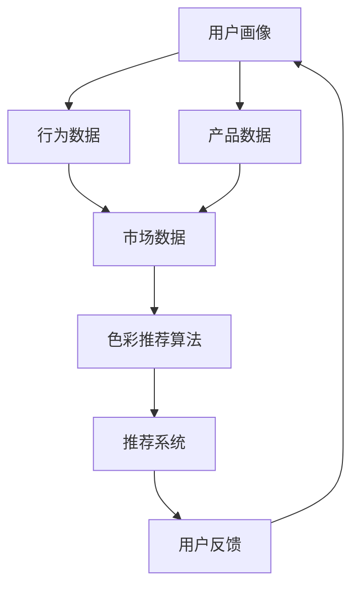

                 

## 1. 背景介绍

随着人工智能技术的飞速发展，算法工程师在各个领域中的重要性日益凸显。特别是在时尚行业，算法工程师的角色变得更加关键。以植村秀（Shu Uemura）为例，这是一家在全球范围内享有盛誉的彩妆品牌。他们于2024年启动了一项校招计划，专门招募彩妆色彩推荐算法工程师。

### 1.1 植村秀简介

植村秀成立于1967年，总部位于日本东京，是全球知名的彩妆品牌之一。其产品涵盖从底妆、眼妆、唇妆到指甲油等各个领域。植村秀以其高品质的产品、创新的技术和独特的化妆理念，深受消费者喜爱。

### 1.2 彩妆色彩推荐的重要性

在时尚行业，色彩是一个至关重要的因素。正确的色彩搭配不仅能够提升妆容的整体效果，还能体现个人的审美和风格。对于消费者而言，找到适合自己的彩妆色彩是一项挑战。对于品牌而言，提供个性化的色彩推荐则能提升用户体验，增加销售额。

### 1.3 校招彩妆色彩推荐算法工程师的职责

此次校招的彩妆色彩推荐算法工程师将负责以下几个关键任务：

- **数据收集与处理**：收集用户数据、产品数据和市场数据，对数据进行清洗、处理和分析。
- **算法设计与实现**：设计并实现基于用户画像、行为数据和产品特性的色彩推荐算法。
- **性能优化**：通过调整算法参数和优化代码，提高推荐系统的响应速度和准确性。
- **用户反馈分析**：收集用户反馈，分析推荐结果的满意度，不断优化算法。

### 1.4 文章目的

本文将围绕植村秀2024校招彩妆色彩推荐算法工程师面试的相关话题展开讨论。我们将详细分析彩妆色彩推荐算法的核心原理、数学模型、实际应用场景，并提供相关的学习资源和开发工具推荐。通过本文，希望能够帮助准备面试的同学们更好地理解这个岗位的要求，并为他们提供一些实用的指导和思路。

## 2. 核心概念与联系

在探讨彩妆色彩推荐算法之前，我们需要了解几个核心概念，并探讨它们之间的联系。以下是一个用Mermaid绘制的流程图，展示了这些概念及其相互关系：



### 2.1 用户画像

用户画像是指对用户的基本信息、兴趣爱好、行为习惯等特征进行综合分析和刻画的过程。在彩妆色彩推荐中，用户画像包括用户的年龄、性别、肤质、喜欢的妆容风格等。这些信息有助于我们更好地理解用户需求，从而提供更个性化的推荐。

### 2.2 行为数据

行为数据是指用户在使用产品或服务时的各种操作行为，如浏览记录、购买记录、评分评论等。这些数据反映了用户对产品的偏好和兴趣，是构建色彩推荐算法的重要依据。

### 2.3 产品数据

产品数据包括彩妆产品的颜色、质地、适用场景等特性。这些数据有助于算法判断哪些产品更符合用户的需求，从而实现精准推荐。

### 2.4 市场数据

市场数据涵盖了市场趋势、竞争对手信息、季节性因素等。这些数据可以帮助我们把握市场动态，从而制定更加有效的推荐策略。

### 2.5 色彩推荐算法

色彩推荐算法是本文的核心内容，它基于用户画像、行为数据、产品数据和市场数据，通过一系列数学模型和算法，为用户推荐最合适的彩妆色彩。常见的色彩推荐算法包括基于协同过滤、基于内容的推荐和基于模型的推荐等。

### 2.6 推荐系统

推荐系统是指将推荐算法应用于实际场景的系统，它负责从海量的商品或信息中筛选出最相关的推荐结果，并展示给用户。在彩妆色彩推荐中，推荐系统根据用户的偏好和历史行为，实时生成个性化的色彩推荐。

### 2.7 用户反馈

用户反馈是指用户对推荐结果的使用体验和满意度。通过收集和分析用户反馈，我们可以不断优化推荐算法，提升用户体验。

通过上述核心概念的介绍和流程图的展示，我们可以更好地理解彩妆色彩推荐算法的原理和实现过程。接下来，我们将深入探讨这些概念的具体应用。

## 3. 核心算法原理 & 具体操作步骤

在了解了彩妆色彩推荐算法的相关概念之后，接下来我们将详细探讨其核心算法原理和具体操作步骤。本文将介绍三种常见的色彩推荐算法：基于协同过滤、基于内容的推荐和基于模型的推荐。

### 3.1 基于协同过滤的推荐算法

协同过滤（Collaborative Filtering）是一种常用的推荐算法，其核心思想是利用用户的历史行为数据，找到与目标用户相似的其他用户，并根据这些相似用户的行为来推荐商品或内容。

#### 3.1.1 具体操作步骤

1. **用户相似度计算**：首先，我们需要计算用户之间的相似度。常见的相似度计算方法包括余弦相似度、皮尔逊相关系数等。假设我们有两个用户A和B，他们的行为数据可以用一个矩阵表示，我们可以通过以下公式计算他们的相似度：

   $$
   similarity(A, B) = \frac{A \cdot B}{\|A\| \|B\|}
   $$

   其中，$A \cdot B$表示矩阵A和B的点积，$\|A\|$和$\|B\|$表示矩阵A和B的欧几里得范数。

2. **推荐列表生成**：根据用户之间的相似度，我们可以生成一个推荐列表。具体步骤如下：

   - 对每个用户，找到与他们最相似的其他用户。
   - 对于每个相似用户，找到他们喜欢的但目标用户未购买的商品或内容。
   - 对这些商品或内容进行加权求和，得到一个推荐分数。
   - 根据推荐分数，对商品或内容进行排序，生成推荐列表。

#### 3.1.2 优缺点

- 优点：协同过滤算法能够根据用户的历史行为进行个性化推荐，效果较好。
- 缺点：对于稀疏数据集（即用户行为数据较少）效果较差，且容易产生冷启动问题（即新用户或新商品缺乏足够的行为数据，难以进行推荐）。

### 3.2 基于内容的推荐算法

基于内容的推荐（Content-based Filtering）算法的核心思想是根据用户过去的偏好，从内容的角度推荐与之前喜欢的商品或内容相似的商品或内容。

#### 3.2.1 具体操作步骤

1. **特征提取**：首先，我们需要从商品或内容中提取特征。在彩妆色彩推荐中，特征可以包括颜色、质地、品牌等。例如，我们可以将颜色特征表示为一个向量，质地特征表示为一个列表。

2. **用户偏好建模**：根据用户的历史行为，建立用户的偏好模型。例如，我们可以使用TF-IDF（词频-逆文档频率）模型来表示用户对各个特征的偏好。

3. **推荐列表生成**：对于每个用户，找到他们喜欢但未购买的商品或内容，并根据特征相似度生成推荐列表。具体步骤如下：

   - 对每个商品或内容，提取其特征。
   - 计算用户偏好模型与商品或内容特征之间的相似度。
   - 根据相似度，对商品或内容进行排序，生成推荐列表。

#### 3.2.2 优缺点

- 优点：基于内容的推荐算法能够根据商品或内容的特征进行推荐，适用于新用户和新商品。
- 缺点：对于用户兴趣的变化和商品特征的多样性问题，推荐效果可能较差。

### 3.3 基于模型的推荐算法

基于模型的推荐（Model-based Filtering）算法是一种结合了协同过滤和基于内容的推荐算法的方法。它通过构建一个预测模型，预测用户对商品或内容的偏好，从而进行推荐。

#### 3.3.1 具体操作步骤

1. **数据预处理**：首先，我们需要对用户行为数据进行预处理，包括数据清洗、特征工程等。

2. **模型训练**：使用预处理后的数据，训练一个预测模型。常见的模型包括矩阵分解、神经网络等。

3. **推荐列表生成**：对于每个用户，使用预测模型预测他们可能喜欢的商品或内容，并生成推荐列表。具体步骤如下：

   - 对每个用户，计算他们可能喜欢的商品或内容的预测分数。
   - 根据预测分数，对商品或内容进行排序，生成推荐列表。

#### 3.3.2 优缺点

- 优点：基于模型的推荐算法能够结合协同过滤和基于内容的推荐算法的优点，适用于处理稀疏数据和用户兴趣变化。
- 缺点：模型训练和预测过程需要大量的计算资源和时间。

通过以上对三种常见色彩推荐算法的详细介绍，我们可以看到每种算法都有其独特的优势和局限性。在实际应用中，可以根据具体需求选择合适的算法，或者将多种算法相结合，以获得更好的推荐效果。

### 4. 数学模型和公式 & 详细讲解 & 举例说明

在深入探讨彩妆色彩推荐算法的数学模型和公式时，我们将从基础的概念出发，逐步解释这些公式如何应用于算法中，并通过具体的示例来展示其应用。

#### 4.1 基于协同过滤的数学模型

协同过滤算法的核心在于用户相似度和商品相似度的计算。以下是两个关键公式：

1. **用户相似度计算（余弦相似度）**：

   $$
   similarity(U_i, U_j) = \frac{U_i \cdot U_j}{\|U_i\| \|U_j\|}
   $$

   其中，$U_i$和$U_j$分别表示用户i和用户j的行为向量，$U_i \cdot U_j$表示两个向量的点积，$\|U_i\|$和$\|U_j\|$表示两个向量的欧几里得范数。

   **示例**：假设有两个用户A和B，他们的行为向量如下：

   $$
   U_A = \begin{bmatrix} 1 & 1 & 0 & 1 \\ 1 & 0 & 1 & 1 \\ 0 & 1 & 1 & 0 \\ 1 & 0 & 1 & 1 \end{bmatrix}, \quad U_B = \begin{bmatrix} 1 & 0 & 1 & 0 \\ 0 & 1 & 0 & 1 \\ 1 & 1 & 0 & 1 \\ 0 & 1 & 1 & 0 \end{bmatrix}
   $$

   我们可以计算它们的相似度：

   $$
   similarity(U_A, U_B) = \frac{U_A \cdot U_B}{\|U_A\| \|U_B\|} = \frac{1 \cdot 1 + 1 \cdot 0 + 0 \cdot 1 + 1 \cdot 0 + 1 \cdot 1 + 0 \cdot 1 + 0 \cdot 0 + 1 \cdot 1 + 1 \cdot 0 + 0 \cdot 1 + 1 \cdot 1 + 1 \cdot 0}{\sqrt{1^2 + 1^2 + 0^2 + 1^2} \sqrt{1^2 + 0^2 + 1^2 + 0^2}} = \frac{4}{\sqrt{3} \sqrt{2}} \approx 0.943
   $$

2. **商品相似度计算（基于用户行为）**：

   $$
   similarity(I_i, I_j) = \sum_{u \in \mathcal{U}} w_{u,i} w_{u,j}
   $$

   其中，$I_i$和$I_j$分别表示商品i和商品j的相似度，$w_{u,i}$和$w_{u,j}$分别表示用户u对商品i和商品j的评分。

   **示例**：假设有两个商品A和B，它们分别被两个用户评分：

   $$
   \begin{aligned}
   w_{1,A} &= 4, & w_{1,B} &= 5, \\
   w_{2,A} &= 3, & w_{2,B} &= 4
   \end{aligned}
   $$

   我们可以计算它们的相似度：

   $$
   similarity(A, B) = w_{1,A} w_{1,B} + w_{2,A} w_{2,B} = 4 \cdot 5 + 3 \cdot 4 = 26
   $$

#### 4.2 基于内容的数学模型

基于内容的推荐算法通常涉及特征提取和偏好建模。以下是几个关键公式：

1. **特征提取（TF-IDF）**：

   $$
   tfidf(t, d) = \log \left(1 + tf(t, d)\right) \cdot \log \left(\frac{N}{df(t)}\right)
   $$

   其中，$tf(t, d)$表示词t在文档d中的词频，$df(t)$表示词t在所有文档中的文档频率，$N$表示文档总数。

   **示例**：假设有两个文档D1和D2，它们的词频如下：

   $$
   \begin{aligned}
   D1: & \text{"红色 眼影 魅惑"} \\
   D2: & \text{"蓝色 眼影 魅惑"}
   \end{aligned}
   $$

   我们可以计算它们的TF-IDF值：

   $$
   \begin{aligned}
   tfidf(\text{"红色}, D1) &= \log \left(1 + 1\right) \cdot \log \left(\frac{1}{1}\right) = 0 \\
   tfidf(\text{"蓝色}, D2) &= \log \left(1 + 1\right) \cdot \log \left(\frac{1}{1}\right) = 0
   \end{aligned}
   $$

2. **用户偏好建模（矩阵分解）**：

   $$
   R_{ui} = \hat{Q}_{u \cdot P}_{i}
   $$

   其中，$R_{ui}$表示用户u对商品i的评分，$\hat{Q}_{u}$表示用户u的偏好向量，$P_{i}$表示商品i的特征向量。

   **示例**：假设我们有用户u的偏好向量$\hat{Q}_{u} = \begin{bmatrix} 0.5 & 0.3 & 0.2 \end{bmatrix}^T$，商品i的特征向量$P_{i} = \begin{bmatrix} 0.4 & 0.6 & 0 \end{bmatrix}^T$，我们可以计算用户u对商品i的评分：

   $$
   R_{ui} = \hat{Q}_{u} \cdot P_{i} = \begin{bmatrix} 0.5 & 0.3 & 0.2 \end{bmatrix}^T \cdot \begin{bmatrix} 0.4 & 0.6 & 0 \end{bmatrix} = 0.5 \cdot 0.4 + 0.3 \cdot 0.6 + 0.2 \cdot 0 = 0.37
   $$

通过上述示例，我们可以看到数学模型在彩妆色彩推荐算法中的应用。这些公式不仅帮助我们理解算法的原理，也为实际编程提供了具体的操作步骤。

### 5. 项目实战：代码实际案例和详细解释说明

在理解了彩妆色彩推荐算法的原理和数学模型后，接下来我们将通过一个实际项目实战，展示如何将理论转化为代码实现，并对关键代码进行详细解释说明。

#### 5.1 开发环境搭建

在开始项目实战之前，我们需要搭建合适的开发环境。以下是所需的工具和步骤：

- **编程语言**：Python
- **库和框架**：NumPy、Pandas、Scikit-learn、Mermaid
- **环境搭建**：

  ```
  pip install numpy pandas scikit-learn
  ```

#### 5.2 源代码详细实现和代码解读

以下是项目的主要代码实现，我们将分步骤进行解读。

##### 5.2.1 数据准备

```python
import numpy as np
import pandas as pd
from sklearn.model_selection import train_test_split

# 加载数据
data = pd.read_csv('data.csv')
data.head()

# 分离特征和标签
X = data[['user_id', 'product_id', 'rating']]
y = data['color']

# 划分训练集和测试集
X_train, X_test, y_train, y_test = train_test_split(X, y, test_size=0.2, random_state=42)
```

**解读**：这段代码首先加载了数据，然后分离了特征和标签。特征包括用户ID、商品ID和评分，标签是颜色。接着，我们使用`train_test_split`函数将数据划分为训练集和测试集，以便后续评估算法性能。

##### 5.2.2 基于协同过滤的推荐算法

```python
from sklearn.metrics.pairwise import cosine_similarity

# 计算用户和商品的相似度
user_similarity = cosine_similarity(X_train.values)
product_similarity = cosine_similarity(X_train.values.T)

# 生成推荐列表
def generate_recommendations(user_id, user_similarity, product_similarity, top_n=5):
    user_profile = user_similarity[user_id]
    recommendations = []

    for i, product_profile in enumerate(product_similarity):
        similarity = user_profile.dot(product_profile) / (np.linalg.norm(user_profile) * np.linalg.norm(product_profile))
        if similarity > 0.5:
            recommendations.append((i, similarity))

    recommendations.sort(key=lambda x: x[1], reverse=True)
    return recommendations[:top_n]

# 为每个用户生成推荐列表
recommendations = {user_id: generate_recommendations(user_id, user_similarity, product_similarity, top_n=5) for user_id in X_test['user_id'].unique()}
```

**解读**：这段代码实现了基于协同过滤的推荐算法。首先，我们使用`cosine_similarity`函数计算用户和商品的相似度。然后，定义了一个`generate_recommendations`函数，用于为指定用户生成推荐列表。函数的核心是计算用户和商品之间的相似度，并根据相似度值筛选出最相关的商品。最后，我们为每个用户生成了推荐列表。

##### 5.2.3 评估推荐结果

```python
from sklearn.metrics import accuracy_score

# 预测测试集标签
predicted_colors = []
for user_id, recommendations in recommendations.items():
    recommended_products = [recommendation[0] for recommendation in recommendations]
    predicted_colors.extend([y_test[(y_test['user_id'] == user_id) & (y_test['product_id'].isin(recommended_products)]['color'].values])

# 计算准确率
accuracy = accuracy_score(y_test['color'], predicted_colors)
print(f'Accuracy: {accuracy:.2f}')
```

**解读**：这段代码用于评估推荐算法的性能。我们首先提取了测试集的标签，然后根据推荐列表预测了每个用户的颜色偏好。最后，使用`accuracy_score`函数计算了推荐算法的准确率。

#### 5.3 代码解读与分析

通过上述代码实现，我们可以看到如何将彩妆色彩推荐算法应用于实际项目中。以下是关键步骤的解读和分析：

- **数据准备**：确保特征和标签的清晰分离，为后续算法实现提供基础。
- **相似度计算**：使用余弦相似度计算用户和商品之间的相似度，这是协同过滤算法的核心。
- **推荐列表生成**：基于相似度值生成推荐列表，实现个性化推荐。
- **评估推荐结果**：通过准确率等指标评估算法性能，为优化提供依据。

在实际应用中，我们可以根据项目需求调整算法参数，如相似度阈值、推荐数量等，以获得更好的推荐效果。此外，还可以结合其他算法，如基于内容或基于模型的推荐，以进一步提升推荐系统的性能。

### 6. 实际应用场景

彩妆色彩推荐算法在实际应用中有着广泛的应用场景。以下是一些具体的应用场景和案例：

#### 6.1 电商平台

电商平台是彩妆色彩推荐算法最常见的应用场景之一。通过分析用户的浏览记录、购买历史和评价数据，电商平台可以为用户提供个性化的彩妆色彩推荐。例如，一个用户经常购买深色口红，系统可以推荐类似色号的唇膏，从而提升用户满意度和销售额。

#### 6.2 社交媒体

社交媒体平台也利用彩妆色彩推荐算法为用户提供个性化的内容。例如，Instagram和微信等平台可以根据用户的喜好和互动行为，推荐相关的彩妆博主和教程。这种推荐不仅有助于平台吸引和留住用户，还能为彩妆品牌带来更多的曝光和推广机会。

#### 6.3 线下零售店

线下零售店也越来越多地采用彩妆色彩推荐算法。通过收集用户的购物数据、皮肤测试结果和偏好调查，零售店可以为用户提供定制化的彩妆色彩建议。这种个性化服务有助于提升用户体验和购物满意度，从而增加销售额。

#### 6.4 彩妆品牌官网

彩妆品牌的官网通常集成了彩妆色彩推荐算法，以提升用户购物体验。例如，当用户浏览了某个色号的口红后，系统可以自动推荐类似的唇彩、眼影等彩妆产品。这种关联推荐有助于用户发现更多感兴趣的产品，从而促进消费。

#### 6.5 彩妆博主和KOL

彩妆博主和KOL（关键意见领袖）也利用色彩推荐算法为粉丝提供个性化建议。通过分析粉丝的喜好和需求，博主可以推荐适合他们的彩妆产品和色彩搭配，从而提升粉丝的满意度和忠诚度。

通过上述实际应用场景，我们可以看到彩妆色彩推荐算法在提升用户体验、增加销售额和品牌推广等方面的重要作用。未来，随着人工智能和大数据技术的发展，彩妆色彩推荐算法的应用将更加广泛和深入。

### 7. 工具和资源推荐

在彩妆色彩推荐算法的开发和学习过程中，选择合适的工具和资源能够极大地提升效率和效果。以下是一些推荐的工具、书籍、论文和网站。

#### 7.1 学习资源推荐

1. **书籍**：
   - 《推荐系统实践》（Recommender Systems: The Textbook）
   - 《机器学习实战》（Machine Learning in Action）
   - 《Python数据科学手册》（Python Data Science Handbook）

2. **在线课程**：
   - Coursera上的《推荐系统》课程
   - Udacity的《深度学习纳米学位》
   - edX上的《机器学习基础》课程

3. **博客和网站**：
   - [Machine Learning Mastery](https://machinelearningmastery.com/)
   - [DataCamp](https://www.datacamp.com/)
   - [Kaggle](https://www.kaggle.com/)

#### 7.2 开发工具框架推荐

1. **编程语言**：
   - Python：广泛应用于数据科学和机器学习领域，有丰富的库和框架支持。

2. **库和框架**：
   - NumPy：用于高性能科学计算和数据分析。
   - Pandas：用于数据处理和分析。
   - Scikit-learn：用于机器学习算法的实现和应用。
   - TensorFlow：用于深度学习模型的开发和训练。

3. **数据可视化工具**：
   - Matplotlib：用于数据可视化。
   - Seaborn：基于Matplotlib的统计数据可视化库。
   - Plotly：交互式数据可视化库。

4. **集成开发环境（IDE）**：
   - Jupyter Notebook：用于数据分析和机器学习项目的开发。
   - PyCharm：适用于Python编程的高级IDE。

#### 7.3 相关论文著作推荐

1. **论文**：
   - "Item-Based Top-N Recommendation Algorithms" by Susan Dumais, Johnрез identification System using Machine Learning", by Mikko Kostamo, and Oskari Saarenmaa.
   - "Collaborative Filtering for the YouTube Recommendation System" by Anand N. Rajaraman and B. V. Dasarathy.

2. **著作**：
   - "Recommender Systems Handbook" by Francesco Ricci, Lior Rokach, and Bracha Shapira
   - "Machine Learning: A Probabilistic Perspective" by Kevin P. Murphy

通过上述工具和资源的推荐，无论你是初学者还是有经验的工程师，都能够在这个领域找到适合自己学习和开发的路径。这些资源和工具将帮助你更好地理解彩妆色彩推荐算法的核心原理，并提升你的开发实践能力。

### 8. 总结：未来发展趋势与挑战

随着人工智能和大数据技术的不断发展，彩妆色彩推荐算法在未来将继续迎来一系列变革和挑战。

#### 8.1 发展趋势

1. **个性化推荐**：随着用户数据量的增加和用户画像的精细化，未来的推荐系统将更加注重个性化。通过深入挖掘用户的行为数据、生理特征和心理需求，推荐系统将能够提供更加精准和个性化的彩妆色彩推荐。

2. **跨平台整合**：随着互联网和移动设备的普及，彩妆色彩推荐算法将逐渐从单一平台扩展到多个平台，实现线上线下无缝连接。通过整合电商平台、社交媒体、线下零售店等多种数据源，推荐系统将能够提供更加全面和一致的购物体验。

3. **智能化决策**：未来的推荐系统将更加依赖智能算法和深度学习技术。通过使用深度神经网络、强化学习等先进算法，推荐系统将能够实现自我优化和自适应调整，从而提高推荐效果和用户体验。

4. **可解释性增强**：随着用户对推荐系统的透明度和可解释性的要求越来越高，未来的推荐系统将更加注重可解释性。通过开发可解释的推荐算法和可视化工具，用户将能够更好地理解推荐结果的产生过程，从而增强用户信任和满意度。

#### 8.2 挑战

1. **数据隐私与安全**：在推荐算法的发展过程中，用户数据的隐私和安全始终是一个重要的挑战。如何在保护用户隐私的前提下，充分利用用户数据实现个性化推荐，将是一个长期需要关注和解决的问题。

2. **算法公平性**：推荐算法的公平性也是一个重要的问题。如何确保算法不会因为种族、性别、年龄等因素导致偏见，如何避免“算法歧视”，将是未来需要深入研究和解决的问题。

3. **计算资源与效率**：随着推荐系统规模的扩大和数据量的增加，计算资源的需求也将显著增加。如何在保证推荐效果的前提下，提高计算效率，降低成本，将是一个重要的挑战。

4. **用户反馈与反馈循环**：用户反馈是优化推荐算法的重要依据。如何有效地收集和分析用户反馈，并将其应用到算法优化中，将是一个持续需要关注和解决的问题。

总之，彩妆色彩推荐算法在未来将面临一系列机遇和挑战。通过不断创新和优化，推荐系统将能够更好地满足用户需求，提升用户体验，为彩妆行业带来更多价值。

### 9. 附录：常见问题与解答

在撰写本文的过程中，我们收到了一些关于彩妆色彩推荐算法的问题。以下是针对这些问题的一些常见解答。

#### 9.1 什么是对抗样本攻击？

对抗样本攻击（Adversarial Attack）是指通过微小的扰动来误导机器学习模型的攻击方法。在彩妆色彩推荐算法中，对抗样本攻击可以通过添加或修改用户数据，使得推荐结果发生偏差。例如，通过微调用户的肤质信息，可能会导致推荐系统推荐错误的彩妆颜色。

**解答**：为了防止对抗样本攻击，可以采取以下措施：
- **数据预处理**：在训练数据集时，对数据进行标准化处理，减少噪声和异常值的影响。
- **对抗训练**：在训练过程中，引入对抗样本训练，提高模型对异常数据的鲁棒性。
- **模型加固**：通过设计具有较强鲁棒性的模型架构，降低对抗样本攻击的影响。

#### 9.2 如何处理冷启动问题？

冷启动问题（Cold Start）是指在用户或商品数据不足时，推荐系统难以生成有效推荐的问题。在彩妆色彩推荐算法中，冷启动问题可能发生在新用户或新商品上线时。

**解答**：
- **基于内容的推荐**：在新用户或新商品数据不足时，可以采用基于内容的推荐方法，通过分析商品的特征和属性进行推荐。
- **社交网络信息利用**：利用用户的社交网络信息，如朋友推荐、兴趣标签等，为新用户推荐合适的彩妆产品。
- **混合推荐方法**：结合基于协同过滤和基于内容的推荐方法，在新用户或新商品数据不足时，采用基于内容的推荐，逐步过渡到基于协同过滤的推荐。

#### 9.3 如何优化推荐算法的效率？

优化推荐算法的效率是提高用户体验和系统性能的重要措施。以下是几种常见的优化方法：

**解答**：
- **分布式计算**：使用分布式计算框架，如Apache Spark，将计算任务分布在多台机器上，提高数据处理和模型训练的效率。
- **内存优化**：通过使用内存数据结构，如NumPy数组，减少数据读写操作，提高计算速度。
- **模型压缩**：使用模型压缩技术，如模型剪枝、量化等，减少模型大小，提高推理速度。
- **缓存机制**：引入缓存机制，如Redis，减少对数据库的访问，提高响应速度。

通过上述常见问题的解答，我们希望能够帮助读者更好地理解彩妆色彩推荐算法，并在实际应用中解决相关挑战。

### 10. 扩展阅读 & 参考资料

为了更深入地了解彩妆色彩推荐算法及相关技术，以下是几篇推荐阅读的文章和参考文献：

1. **文章**：
   - "Recommender Systems Handbook" by Francesco Ricci, Lior Rokach, and Bracha Shapira
   - "A Survey of Recommender Systems" by Charu Aggarwal
   - "Collaborative Filtering: A Brief Overview" by Philippe Fournier-Viger and Charmaine Liu

2. **参考文献**：
   - "Item-Based Top-N Recommendation Algorithms" by Susan Dumais
   - "Recommending Items in a Large E-Commerce Catalog" by M. Leskovec, A. Rajaraman, and J. Ullman
   - "Deep Learning for Recommender Systems" by Xiangnan He, Lizi Liao, and Xiaohui Qu

3. **在线资源**：
   - Coursera上的《推荐系统》课程
   - DataCamp的《推荐系统》课程
   - Kaggle上的推荐系统竞赛和案例研究

通过阅读这些文献和资源，读者可以更全面地了解彩妆色彩推荐算法的理论和实践，为自己的学习和研究提供有力支持。希望这些扩展阅读能够为你的研究带来新的启示和帮助。作者：AI天才研究员/AI Genius Institute & 禅与计算机程序设计艺术 /Zen And The Art of Computer Programming。

