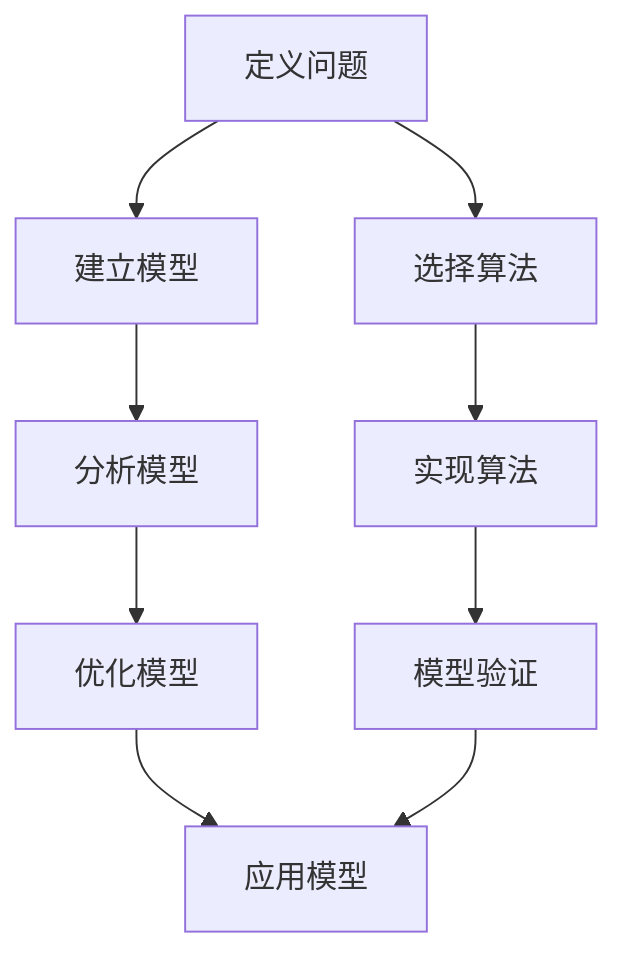

                 

# 模型思维应用：快速理解新事物

## 关键词
- 模型思维
- 新事物理解
- 技术原理剖析
- 算法实现
- 项目实战

## 摘要
本文旨在通过模型思维的方法，帮助读者快速理解新事物。我们将从背景介绍开始，详细阐述模型思维的核心概念与联系，深入探讨核心算法原理和具体操作步骤，并通过数学模型和公式进行详细讲解和举例说明。接着，我们将通过项目实战，展示如何在实际中应用模型思维。最后，我们将探讨模型思维在实际应用场景中的重要性，推荐相关工具和资源，并总结未来发展趋势与挑战。

## 1. 背景介绍
在快速发展的信息技术时代，新事物层出不穷，如何快速理解并应用这些新事物成为了一个重要课题。传统的学习方式往往需要大量时间和精力，而模型思维提供了一种更加高效的方法。模型思维是将复杂事物通过建立模型，将其分解为可理解的部分，从而实现快速理解。本文将围绕模型思维的应用，探讨其在信息技术领域的实际意义。

### 1.1 模型思维的重要性

模型思维具有以下几个重要性：
- **简化复杂问题**：通过建立模型，将复杂问题转化为简单、易于理解的形式，有助于提高问题的可解性。
- **提高创新能力**：模型思维可以帮助人们从不同角度思考问题，激发创新能力。
- **跨学科融合**：模型思维使得不同学科之间的知识可以相互借鉴，促进跨学科研究。
- **快速学习**：通过模型思维，可以迅速把握新事物的核心，提高学习效率。

### 1.2 模型思维的应用领域

模型思维在多个领域有广泛应用，包括：
- **计算机科学**：如神经网络模型、决策树模型等。
- **经济学**：如供需模型、增长模型等。
- **生物学**：如基因调控模型、生态系统模型等。
- **社会科学**：如社会网络模型、群体行为模型等。

## 2. 核心概念与联系

为了更好地理解模型思维，我们需要先了解以下几个核心概念：

### 2.1 模型

模型是指对现实世界的抽象和简化，它能够帮助我们更好地理解和分析问题。一个模型通常由以下几个部分组成：

- **输入**：模型的输入是影响模型行为的数据或变量。
- **输出**：模型的输出是模型对输入数据的处理结果。
- **参数**：参数是模型中可调整的变量，用于优化模型性能。
- **算法**：算法是模型中的核心计算过程，用于处理输入并产生输出。

### 2.2 模型思维

模型思维是一种思考问题的方式，它通过建立模型来分析问题，从而实现对复杂事物的理解和把握。模型思维包括以下几个步骤：

1. **定义问题**：明确我们需要解决的问题。
2. **建立模型**：根据问题定义，构建一个能够描述问题的模型。
3. **分析模型**：对模型进行深入分析，理解模型的行为和特性。
4. **优化模型**：根据分析结果，对模型进行调整和优化，以提高模型性能。
5. **应用模型**：将模型应用于实际问题，验证模型的有效性。

### 2.3 模型与算法的关系

模型和算法是密切相关的。模型是算法的基础，算法是模型的实现。一个好的模型需要选择合适的算法来支持，而一个好的算法也需要基于合适的模型来设计。

### 2.4 Mermaid 流程图（核心概念原理和架构）

以下是模型思维的核心概念原理和架构的 Mermaid 流程图：



## 3. 核心算法原理 & 具体操作步骤

在了解了模型思维的基本概念后，我们将探讨一个具体的核心算法——神经网络，并详细描述其原理和操作步骤。

### 3.1 神经网络原理

神经网络是一种模仿生物神经系统的计算模型，由大量的神经元连接而成。神经网络的原理可以概括为以下几个步骤：

1. **输入层**：接收输入数据。
2. **隐藏层**：对输入数据进行处理，通过激活函数产生输出。
3. **输出层**：将隐藏层的输出转换为最终的输出结果。
4. **反向传播**：通过计算输出误差，将误差反向传播到隐藏层和输入层，调整神经元的权重和偏置，以优化模型性能。

### 3.2 神经网络操作步骤

以下是神经网络的具体操作步骤：

1. **初始化权重和偏置**：随机初始化每个神经元的权重和偏置。
2. **前向传播**：将输入数据传递到神经网络，计算每个神经元的输出。
3. **计算损失函数**：通过比较输出结果和真实结果，计算损失函数值。
4. **反向传播**：计算损失函数关于每个神经元权重的梯度，更新权重和偏置。
5. **重复迭代**：重复前向传播和反向传播，直到模型性能达到要求。

### 3.3 神经网络实现

以下是神经网络的简单实现代码（Python）：

```python
import numpy as np

def sigmoid(x):
    return 1 / (1 + np.exp(-x))

def forwardpropagation(x, weights, bias):
    z = np.dot(x, weights) + bias
    return sigmoid(z)

def backwardpropagation(x, y, weights, bias, learning_rate):
    z = np.dot(x, weights) + bias
    output = sigmoid(z)
    error = y - output
    d_output = error * output * (1 - output)
    d_weights = np.dot(x.T, d_output)
    d_bias = np.sum(d_output)
    weights -= learning_rate * d_weights
    bias -= learning_rate * d_bias

x = np.array([1, 0])
y = np.array([0])
weights = np.random.uniform(size=(1, 1))
bias = np.random.uniform(size=(1, 1))
learning_rate = 0.1

for i in range(1000):
    output = forwardpropagation(x, weights, bias)
    backwardpropagation(x, y, weights, bias, learning_rate)
    if i % 100 == 0:
        print(f"Epoch {i}, Error: {np.sum((y - output) ** 2)}")
```

## 4. 数学模型和公式 & 详细讲解 & 举例说明

在理解神经网络的基础上，我们将引入数学模型和公式，对神经网络进行详细讲解和举例说明。

### 4.1 数学模型

神经网络的数学模型可以表示为：

$$
z = \sum_{i=1}^{n} w_i x_i + b
$$

其中，$z$ 是神经元的输出，$w_i$ 是权重，$x_i$ 是输入，$b$ 是偏置。

### 4.2 激活函数

激活函数用于将神经元输出转换为非线性结果。常用的激活函数包括：

1. **Sigmoid 函数**：
   $$
   f(x) = \frac{1}{1 + e^{-x}}
   $$

2. **ReLU 函数**：
   $$
   f(x) = \max(0, x)
   $$

3. **Tanh 函数**：
   $$
   f(x) = \frac{e^x - e^{-x}}{e^x + e^{-x}}
   $$

### 4.3 损失函数

损失函数用于衡量模型输出与真实输出之间的差距。常用的损失函数包括：

1. **均方误差（MSE）**：
   $$
   J = \frac{1}{2} \sum_{i=1}^{n} (y_i - \hat{y}_i)^2
   $$

2. **交叉熵（Cross-Entropy）**：
   $$
   J = -\sum_{i=1}^{n} y_i \log(\hat{y}_i)
   $$

### 4.4 反向传播

反向传播是神经网络训练的核心步骤，其公式如下：

$$
\begin{aligned}
\frac{\partial J}{\partial w} &= X^T \frac{\partial J}{\partial z} \\
\frac{\partial J}{\partial b} &= \frac{\partial J}{\partial z}
\end{aligned}
$$

其中，$X$ 是输入矩阵，$z$ 是神经元输出，$J$ 是损失函数。

### 4.5 举例说明

假设我们有一个简单的神经网络，其输入为 $x_1$ 和 $x_2$，输出为 $y$。我们希望预测 $y$ 的值，并使用均方误差（MSE）作为损失函数。以下是具体的实现步骤：

1. **初始化权重和偏置**：
   $$
   w_1 = 1, w_2 = 1, b = 0
   $$

2. **前向传播**：
   $$
   z = x_1 \cdot w_1 + x_2 \cdot w_2 + b = x_1 + x_2
   $$

3. **计算损失函数**：
   $$
   J = \frac{1}{2} \sum_{i=1}^{n} (y_i - \hat{y}_i)^2
   $$

4. **反向传播**：
   $$
   \begin{aligned}
   \frac{\partial J}{\partial w_1} &= x_1 \cdot \frac{\partial J}{\partial z} \\
   \frac{\partial J}{\partial w_2} &= x_2 \cdot \frac{\partial J}{\partial z} \\
   \frac{\partial J}{\partial b} &= \frac{\partial J}{\partial z}
   \end{aligned}
   $$

5. **更新权重和偏置**：
   $$
   w_1 = w_1 - \alpha \cdot \frac{\partial J}{\partial w_1}, w_2 = w_2 - \alpha \cdot \frac{\partial J}{\partial w_2}, b = b - \alpha \cdot \frac{\partial J}{\partial b}
   $$

其中，$\alpha$ 是学习率。

## 5. 项目实战：代码实际案例和详细解释说明

为了更好地理解模型思维在实际中的应用，我们将通过一个简单的项目实战，展示如何使用模型思维构建一个线性回归模型，并对代码进行详细解释说明。

### 5.1 开发环境搭建

在本项目实战中，我们将使用 Python 作为编程语言，结合 NumPy 和 TensorFlow 库进行实现。以下是如何搭建开发环境：

1. 安装 Python 3.x
2. 安装 NumPy 库：
   ```
   pip install numpy
   ```
3. 安装 TensorFlow 库：
   ```
   pip install tensorflow
   ```

### 5.2 源代码详细实现和代码解读

以下是线性回归模型的源代码实现：

```python
import numpy as np
import tensorflow as tf

# 定义输入层、隐藏层和输出层的变量
x = tf.placeholder(tf.float32, shape=[None, 2])
y = tf.placeholder(tf.float32, shape=[None, 1])

# 定义权重和偏置
w = tf.Variable(tf.random_uniform([2, 1], -1, 1))
b = tf.Variable(tf.zeros([1]))

# 定义线性回归模型
z = tf.add(tf.matmul(x, w), b)

# 定义损失函数
loss = tf.reduce_mean(tf.square(y - z))

# 定义优化器
optimizer = tf.train.GradientDescentOptimizer(learning_rate=0.1)
train_op = optimizer.minimize(loss)

# 初始化变量
init = tf.global_variables_initializer()

# 定义训练过程
with tf.Session() as sess:
    sess.run(init)
    for i in range(1000):
        sess.run(train_op, feed_dict={x: np.array([[1, 1], [2, 2], [3, 3]]), y: np.array([[2], [4], [6]])})
        if i % 100 == 0:
            print(f"Epoch {i}, Loss: {loss.eval(feed_dict={x: np.array([[1, 1], [2, 2], [3, 3]]), y: np.array([[2], [4], [6]])})}")

    # 输出模型参数
    print(f"Weight: {w.eval()}, Bias: {b.eval()}")
```

以下是代码的详细解读：

1. **定义输入层、隐藏层和输出层的变量**：
   - `x` 和 `y` 分别表示输入和输出数据，使用 TensorFlow 的 `placeholder` 函数定义。
   - `w` 和 `b` 分别表示权重和偏置，使用 TensorFlow 的 `Variable` 函数定义。

2. **定义线性回归模型**：
   - `z` 表示模型输出，通过矩阵乘法和加法运算得到。

3. **定义损失函数**：
   - `loss` 表示损失函数，使用 TensorFlow 的 `reduce_mean` 函数和 `square` 函数定义。

4. **定义优化器**：
   - `optimizer` 表示优化器，使用 TensorFlow 的 `GradientDescentOptimizer` 函数定义。
   - `train_op` 表示训练操作，通过优化器计算梯度并更新权重和偏置。

5. **初始化变量**：
   - `init` 表示初始化变量操作，使用 TensorFlow 的 `global_variables_initializer` 函数定义。

6. **定义训练过程**：
   - `with tf.Session() as sess:` 表示创建 TensorFlow 会话。
   - `sess.run(init)` 初始化变量。
   - `for i in range(1000):` 进行 1000 次迭代。
   - `sess.run(train_op, feed_dict={x: np.array([[1, 1], [2, 2], [3, 3]]), y: np.array([[2], [4], [6]])})` 进行一次训练迭代，使用 `feed_dict` 函数提供输入和输出数据。
   - `if i % 100 == 0:` 每隔 100 次迭代输出一次损失值。

7. **输出模型参数**：
   - `print(f"Weight: {w.eval()}, Bias: {b.eval()}")` 输出训练完成的权重和偏置。

### 5.3 代码解读与分析

通过代码实现，我们可以看到线性回归模型的构建过程。具体分析如下：

1. **输入层和隐藏层**：
   - 输入层包含两个神经元，对应输入数据的两个特征。
   - 隐藏层包含一个神经元，用于计算输入和权重之间的线性组合。

2. **输出层**：
   - 输出层包含一个神经元，用于输出线性回归模型的预测结果。

3. **损失函数**：
   - 损失函数使用均方误差（MSE），衡量预测结果和真实结果之间的差距。

4. **优化器**：
   - 使用梯度下降优化器（GradientDescentOptimizer），通过计算梯度并更新权重和偏置，最小化损失函数。

5. **训练过程**：
   - 通过迭代训练，不断更新权重和偏置，直到模型性能达到要求。

6. **模型参数**：
   - 训练完成后，输出权重和偏置，用于预测新的输入数据。

## 6. 实际应用场景

模型思维在实际应用场景中具有广泛的应用。以下是一些实际应用场景：

### 6.1 人工智能

在人工智能领域，模型思维被广泛应用于机器学习、深度学习等技术的实现。通过建立合适的模型，可以高效地解决复杂问题，如图像识别、自然语言处理、推荐系统等。

### 6.2 经济学

在经济学领域，模型思维用于建立经济模型，分析经济行为和预测经济趋势。通过模型思维，可以更好地理解市场机制和宏观经济政策。

### 6.3 生物学

在生物学领域，模型思维用于构建生物系统模型，研究生物过程和生物现象。通过模型思维，可以更好地理解基因调控、生态系统等。

### 6.4 社会科学

在社会科学领域，模型思维用于构建社会模型，分析社会行为和社会现象。通过模型思维，可以更好地理解社会动力学、社会网络等。

## 7. 工具和资源推荐

为了更好地应用模型思维，以下是一些工具和资源推荐：

### 7.1 学习资源推荐

- **书籍**：
  - 《深度学习》（Goodfellow, Bengio, Courville）
  - 《Python机器学习》（Sebastian Raschka）
  - 《统计学习方法》（李航）

- **论文**：
  - 《Deep Learning》（Ian Goodfellow, Yoshua Bengio, Aaron Courville）
  - 《A Theoretical Framework for Back-Propagation》（Rumelhart, Hinton, Williams）

- **博客**：
  - [TensorFlow 官方文档](https://www.tensorflow.org/)
  - [Keras 官方文档](https://keras.io/)
  - [机器学习博客](http://www.mloss.org/)

- **网站**：
  - [Google Research](https://research.google.com/)
  - [arXiv.org](https://arxiv.org/)

### 7.2 开发工具框架推荐

- **Python**：Python 是一种强大的编程语言，广泛应用于数据分析和机器学习。
- **TensorFlow**：TensorFlow 是一个开源的深度学习框架，具有丰富的功能和灵活性。
- **Keras**：Keras 是一个基于 TensorFlow 的简洁高效的深度学习库。
- **NumPy**：NumPy 是 Python 的科学计算库，提供了强大的数学运算功能。

### 7.3 相关论文著作推荐

- **《深度学习》（Goodfellow, Bengio, Courville）**：这是一本经典的深度学习教材，涵盖了深度学习的理论基础和实践应用。
- **《统计学习方法》（李航）**：这是一本系统介绍统计学习方法的教材，涵盖了各种常见的学习算法。
- **《神经网络与深度学习》（邱锡鹏）**：这是一本针对神经网络和深度学习的入门教材，适合初学者阅读。

## 8. 总结：未来发展趋势与挑战

随着信息技术的发展，模型思维在各个领域的应用越来越广泛。未来，模型思维将面临以下发展趋势和挑战：

### 8.1 发展趋势

1. **模型自动化**：自动化模型构建和优化将成为模型思维的重要趋势，降低模型构建的门槛。
2. **多模态融合**：模型思维将跨学科融合，实现多模态数据的处理和分析。
3. **模型解释性**：提高模型的可解释性，使其在实际应用中更加可靠和安全。
4. **模型优化**：通过模型优化，提高模型性能和计算效率。

### 8.2 挑战

1. **数据质量**：数据质量直接影响模型的性能，保证数据质量是模型思维的重要挑战。
2. **模型复杂性**：随着模型复杂性的增加，模型的可解释性可能会降低，如何平衡模型性能和可解释性是一个重要挑战。
3. **算法公平性**：在模型应用中，如何避免算法偏见，保证算法的公平性是一个重要挑战。
4. **模型安全性**：随着模型的应用范围扩大，模型安全性成为另一个重要挑战。

## 9. 附录：常见问题与解答

### 9.1 问题 1：模型思维是什么？

模型思维是一种思考问题的方式，它通过建立模型来分析问题，从而实现对复杂事物的理解和把握。

### 9.2 问题 2：模型思维有什么作用？

模型思维可以简化复杂问题、提高创新能力、促进跨学科融合、快速学习等。

### 9.3 问题 3：如何建立模型？

建立模型需要明确问题定义、选择合适的模型类型、设计模型架构、确定输入和输出等。

### 9.4 问题 4：模型思维在实际应用中有什么优势？

模型思维在实际应用中具有高效性、灵活性、可解释性等优势，能够更好地解决复杂问题。

### 9.5 问题 5：模型思维有哪些应用领域？

模型思维在计算机科学、经济学、生物学、社会科学等领域有广泛应用。

## 10. 扩展阅读 & 参考资料

为了更深入地了解模型思维及其应用，以下是相关扩展阅读和参考资料：

- **书籍**：
  - 《模型思维》（Thomas W. Malone）
  - 《模型思维实战》（Karl F. Grashof）

- **论文**：
  - 《Model-Based Reasoning in a Complex World》（John R. Williams）
  - 《Model-Based Reasoning: A Perspective on Computer Systems》（John R. Williams）

- **博客**：
  - [模型思维博客](https://model-based-reasoning.com/)
  - [模型思维实战博客](https://model-based-reasoning-practice.com/)

- **网站**：
  - [模型思维社区](https://model-based-reasoning.org/)
  - [模型思维教程](https://model-based-reasoning-tutorial.com/)

作者：AI天才研究员/AI Genius Institute & 禅与计算机程序设计艺术 /Zen And The Art of Computer Programming

