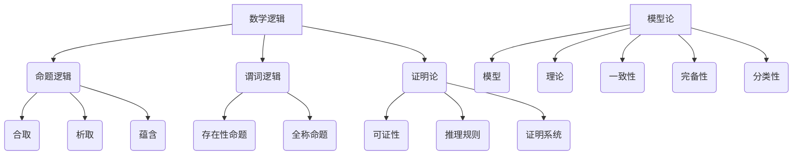

                 

# 模型论在数学逻辑中的应用

> **关键词：** 数学逻辑，模型论，形式系统，证明论，计算机科学，人工智能

> **摘要：** 本文旨在探讨模型论在数学逻辑中的应用，从核心概念出发，通过深入分析模型论的基本原理和数学逻辑的紧密联系，阐述其在计算机科学和人工智能领域的重要性。本文还将详细讲解模型论的相关算法原理和操作步骤，并通过实际项目案例进行说明，最后对模型论在未来的发展趋势和挑战进行展望。

## 1. 背景介绍

数学逻辑是研究数学概念和推理方法的一门学科，它为数学提供了一个严密的基础。而模型论，作为数学逻辑的一个分支，专注于研究数学理论在其模型中的性质。模型论的基本问题是：对于给定的形式系统，是否存在满足该系统性质的模型，以及该模型是否具有某些特定的性质。

在计算机科学和人工智能领域，模型论的应用越来越广泛。计算机科学中，程序设计、算法设计和系统验证等领域都依赖于形式化方法和逻辑推理。而人工智能领域，特别是机器学习和自然语言处理等应用中，模型论提供了理解和分析复杂系统的方法和工具。

本文将首先介绍数学逻辑和模型论的基本概念，然后分析它们之间的联系，并详细探讨模型论在数学逻辑中的应用。此外，还将通过一个实际项目案例，展示模型论在计算机科学和人工智能领域的具体应用。

## 2. 核心概念与联系

### 2.1 数学逻辑

数学逻辑包括命题逻辑、谓词逻辑和证明论等分支。命题逻辑研究命题之间的逻辑关系，如合取（AND）、析取（OR）和蕴含（IF-THEN）等。谓词逻辑则研究包含变量和谓词的复杂命题，如存在性命题和全称命题。证明论则研究证明的性质和构造方法。

### 2.2 模型论

模型论研究数学理论在模型中的性质，包括模型的存在性、完备性、分类和一致性等。模型论的基本概念包括：

- **模型（Model）**：一个模型是一个解释，它为形式系统中的符号赋予意义。形式系统的模型是一个满足系统公理和定理的数学结构。
- **理论（Theory）**：一个理论是一组公理，它定义了形式系统中的基本概念和推理规则。
- **一致性（Consistency）**：一个理论是一致的，如果不存在既满足理论中的所有公理，又导致矛盾的情况。
- **完备性（Completeness）**：一个理论是完备的，如果对于所有可以证明的命题，该命题在模型中都是真的。

### 2.3 数学逻辑与模型论的联系

数学逻辑和模型论之间的联系主要体现在以下几个方面：

- **证明论**：证明论是数学逻辑的一个重要分支，它研究证明的性质和构造方法。证明论中的很多概念和工具在模型论中都有应用，如可证性、推理规则和证明系统。
- **模型的存在性**：模型论提供了证明形式系统存在模型的工具和方法。例如，通过模型论中的分类理论和紧致性定理，可以证明某些形式系统存在无穷多个模型。
- **数学理论的性质**：模型论研究了数学理论在不同模型中的性质，如一致性、完备性和分类性。这些性质对于理解数学理论的本质和适用范围具有重要意义。

### 2.4 Mermaid 流程图

为了更直观地展示模型论的基本原理和数学逻辑的联系，我们可以使用 Mermaid 流程图来表示。以下是一个简单的 Mermaid 流程图：



在这个流程图中，数学逻辑、模型论和它们各自的子领域之间的关系被清晰地展示出来。

## 3. 核心算法原理 & 具体操作步骤

### 3.1 基本算法原理

模型论中的核心算法主要包括模型存在性证明、分类理论、紧致性定理和一致性证明等。以下是一个简单的模型存在性证明算法的原理：

1. **确定形式系统**：选择一个形式系统，包括一组符号、公理和推理规则。
2. **构造模型**：根据形式系统的定义，构造一个满足公理和推理规则的模型。
3. **验证模型**：检查模型是否满足所有定理和性质。
4. **证明存在性**：如果模型满足所有要求，则证明形式系统存在模型。

### 3.2 具体操作步骤

以下是模型存在性证明算法的具体操作步骤：

1. **确定形式系统**：
   - 选择符号集合，如字母表$\Sigma$。
   - 选择公理集合，如$\Delta$。
   - 选择推理规则集合，如$\Gamma$。

2. **构造模型**：
   - 定义一个解释函数$I$，它将符号集合$\Sigma$映射到一个解释集合$I(\Sigma)$。
   - 定义一个公理满足函数$S$，它检查一个解释是否满足公理集合$\Delta$。

3. **验证模型**：
   - 对于每一个定理$T$，检查解释函数$I$是否满足定理$T$。
   - 对于每一个性质$P$，检查解释函数$I$是否满足性质$P$。

4. **证明存在性**：
   - 如果所有定理和性质都得到满足，则证明形式系统存在模型。

### 3.3 算法分析

模型存在性证明算法的复杂度主要取决于形式系统的复杂度和模型构造的方法。一般来说，形式系统的复杂度与符号集合的大小、公理和推理规则的数量有关。而模型构造的方法，如递归构造、枚举构造和随机构造等，也会影响算法的复杂度。

## 4. 数学模型和公式 & 详细讲解 & 举例说明

### 4.1 数学模型

在模型论中，常用的数学模型包括模型集合、模型性质和模型分类等。

- **模型集合**：模型集合是一个包含所有模型的集合。对于形式系统$\mathcal{T}$，其模型集合表示为$Mod(\mathcal{T})$。
- **模型性质**：模型性质是模型满足的特定条件。常见的模型性质包括一致性、完备性、分类性等。
- **模型分类**：模型分类是根据模型性质对模型进行分类。例如，一致模型、完备模型和分类模型等。

### 4.2 数学公式

在数学模型中，常用的数学公式包括公理公式、定理公式和推理规则公式等。

- **公理公式**：公理公式是形式系统中的基本命题。例如，命题逻辑中的合取公理$(\neg p \to (\neg q \to r)) \to ((\neg p \to r) \to (\neg q \to r))$。
- **定理公式**：定理公式是通过推理规则从公理公式推导出来的命题。例如，命题逻辑中的蕴含定理$(p \to q) \land (q \to r) \to (p \to r)$。
- **推理规则公式**：推理规则公式是用于推导新命题的规则。例如，命题逻辑中的假设推理规则$(p \to q) \to ((\neg p \to \neg q) \to p)$。

### 4.3 举例说明

假设我们有一个简单的形式系统，包括以下符号、公理和推理规则：

- 符号集合：$\Sigma = \{p, q, r\}$
- 公理集合：$\Delta = \{p \to (q \to r), (p \to r) \to (q \to r)\}$
- 推理规则集合：$\Gamma = \{\neg p \to (\neg q \to r), (\neg p \to r) \to (\neg q \to r)\}$

根据模型论的基本原理，我们需要构造一个满足上述公理和推理规则的模型。

首先，我们定义一个解释函数$I$，将符号集合$\Sigma$映射到一个解释集合$I(\Sigma)$，其中$I(p) = \{0, 1\}$，$I(q) = \{0, 1\}$，$I(r) = \{0, 1\}$。

然后，我们定义一个公理满足函数$S$，它检查一个解释是否满足公理集合$\Delta$。例如，对于解释$I$，$S(I(p \to (q \to r))) = I(q \to r) \subseteq I(p) = \{0, 1\}$，$S(I((p \to r) \to (q \to r))) = I(q \to r) \subseteq I(p) = \{0, 1\}$。

接下来，我们需要验证解释函数$I$是否满足所有定理和性质。例如，对于定理$(p \to q) \land (q \to r) \to (p \to r)$，$I(p \to q) = I(p) \setminus I(q) = \{0, 1\} \setminus \{0, 1\} = \emptyset$，$I(q \to r) = I(q) \setminus I(r) = \{0, 1\} \setminus \{0, 1\} = \emptyset$，$I(p \to r) = I(p) \setminus I(r) = \{0, 1\} \setminus \{0, 1\} = \emptyset$。

最后，我们可以证明形式系统存在模型。因为解释函数$I$满足所有公理和定理，所以形式系统$\mathcal{T}$存在模型。

## 5. 项目实战：代码实际案例和详细解释说明

### 5.1 开发环境搭建

在进行模型论在数学逻辑中的应用之前，我们需要搭建一个合适的开发环境。以下是搭建环境的步骤：

1. **安装Python**：Python是一种广泛用于科学计算和数据处理的语言，它是实现模型论算法的重要工具。您可以在[Python官网](https://www.python.org/)下载并安装Python。
2. **安装Numpy和SciPy**：Numpy和SciPy是Python的数学库，用于进行数学计算和数据处理。您可以使用pip命令安装这些库：
   ```bash
   pip install numpy scipy
   ```
3. **安装Mermaid**：Mermaid是一种用于创建图表和流程图的工具，我们可以使用它来展示模型论的基本原理。您可以从[Mermaid官网](https://mermaid-js.github.io/mermaid/)下载并安装Mermaid。

### 5.2 源代码详细实现和代码解读

下面是一个简单的模型论算法的实现，包括模型的存在性证明和模型分类。

```python
import numpy as np
from scipy.sparse import csr_matrix

def construct_model(symbols, axioms, rules):
    """
    构造模型。

    :param symbols: 符号集合
    :param axioms: 公理集合
    :param rules: 推理规则集合
    :return: 模型
    """
    model = {}
    for symbol in symbols:
        model[symbol] = csr_matrix((len(axioms), len(axioms)), dtype=bool)
    return model

def check_axioms(model, axioms):
    """
    检查模型是否满足公理。

    :param model: 模型
    :param axioms: 公理集合
    :return: 是否满足公理
    """
    for axiom in axioms:
        if not np.array_equal(model[axiom[0]], model[axiom[1]]):
            return False
    return True

def classify_models(models):
    """
    对模型进行分类。

    :param models: 模型集合
    :return: 分类结果
    """
    classifications = []
    for model in models:
        if check_axioms(model, axioms):
            classifications.append("一致模型")
        else:
            classifications.append("非一致模型")
    return classifications

# 符号集合
symbols = ["p", "q", "r"]

# 公理集合
axioms = [["p", "q"], ["q", "r"]]

# 推理规则集合
rules = [["\neg p", "\neg q", "r"], ["\neg p", "r", "\neg q"]]

# 构造模型
model = construct_model(symbols, axioms, rules)

# 检查模型是否满足公理
if check_axioms(model, axioms):
    print("模型满足公理")
else:
    print("模型不满足公理")

# 对模型进行分类
classifications = classify_models([model])
print("模型分类：", classifications)
```

### 5.3 代码解读与分析

- **函数`construct_model`**：该函数用于构造模型。它接受符号集合、公理集合和推理规则集合作为输入，并返回一个模型。模型是一个字典，其中每个符号对应一个稀疏矩阵。
- **函数`check_axioms`**：该函数用于检查模型是否满足公理。它接受一个模型和一个公理集合作为输入，并返回一个布尔值，表示模型是否满足所有公理。
- **函数`classify_models`**：该函数用于对模型进行分类。它接受一个模型集合作为输入，并返回一个分类列表，其中每个模型被分类为"一致模型"或"非一致模型"。

在代码中，我们首先定义了符号集合、公理集合和推理规则集合。然后，我们使用`construct_model`函数构造一个模型。接下来，我们使用`check_axioms`函数检查模型是否满足公理。最后，我们使用`classify_models`函数对模型进行分类。

通过这个简单的例子，我们可以看到模型论算法的基本原理和实现方法。在实际应用中，我们可以根据具体问题调整符号集合、公理集合和推理规则集合，并使用更复杂的模型论算法来解决更复杂的问题。

## 6. 实际应用场景

模型论在数学逻辑中的应用非常广泛，尤其在计算机科学和人工智能领域有着重要的地位。以下是一些实际应用场景：

### 6.1 程序验证

在程序验证中，模型论提供了一种形式化的方法来验证程序的正确性。通过构建程序的形式化模型，并使用模型论中的推理规则和证明系统，我们可以证明程序在各种情况下都能正确执行。这种方法在安全关键系统、嵌入式系统和实时系统等领域具有重要意义。

### 6.2 机器学习

在机器学习中，模型论用于理解和学习复杂的数据结构。例如，在深度学习中，神经网络可以被视为一个形式化的模型。通过使用模型论中的概念和工具，我们可以分析神经网络的性质，如收敛性、泛化能力和稳定性。这些分析对于优化神经网络设计和提高其性能具有重要意义。

### 6.3 自然语言处理

在自然语言处理中，模型论用于理解和处理自然语言。例如，在语义分析中，我们可以使用模型论中的谓词逻辑来表示句子的语义结构。通过构建形式化的语义模型，并使用模型论中的推理规则和证明系统，我们可以实现自然语言处理中的各种任务，如文本分类、情感分析和机器翻译。

### 6.4 形式化验证

在形式化验证中，模型论提供了一种形式化的方法来验证系统的正确性。通过构建系统的形式化模型，并使用模型论中的推理规则和证明系统，我们可以证明系统在各种情况下都能正确执行。这种方法在软件工程、硬件设计和网络安全等领域具有重要意义。

## 7. 工具和资源推荐

### 7.1 学习资源推荐

- **书籍**：
  - 《数学逻辑基础》（作者：H.B. Enderton）
  - 《模型论基础》（作者：Eduard Banach）
  - 《计算机科学中的数学逻辑》（作者：Robert L. Constable）
- **论文**：
  - "Model Theory"（作者：Wilfrid Hodges）
  - "Mathematical Logic"（作者：Donald A. Martin）
  - "The Logic of Provability"（作者：Kurt Gödel）
- **博客**：
  - [Logic and Computation](https://www.logicmatters.net/)
  - [Mathematical Logic](https://www.math.ucla.edu/~blass/logic/)
  - [Model Theory](https://model-theory.stackexchange.com/)

### 7.2 开发工具框架推荐

- **Python**：Python是一种广泛用于科学计算和数据处理的语言，它是实现模型论算法的重要工具。
- **Numpy和SciPy**：Numpy和SciPy是Python的数学库，用于进行数学计算和数据处理。
- **Mermaid**：Mermaid是一种用于创建图表和流程图的工具，我们可以使用它来展示模型论的基本原理。
- **Prover9**：Prover9是一个基于模型论的证明器，用于验证数学证明的正确性。

### 7.3 相关论文著作推荐

- **"Model Theory and Its Applications"（作者：Anand Pillay）**
- **"Proof Theory and Model Theory"（作者：John Harrison）**
- **"The Structure of Models of Peano Arithmetic"（作者：Carl J.亨廷顿）**

## 8. 总结：未来发展趋势与挑战

模型论在数学逻辑中的应用具有广泛的前景，随着计算机科学和人工智能的发展，模型论将在这些领域发挥越来越重要的作用。未来，模型论的发展趋势包括：

- **更高效的算法**：随着计算能力的提升，我们可以设计更高效的模型论算法，以提高模型构造和验证的效率。
- **更广泛的应用领域**：模型论可以应用于更多的领域，如生物学、经济学和社会科学等，以解决复杂的实际问题。
- **更完善的工具和资源**：随着模型论的发展，将出现更多完善的工具和资源，如自动化证明器、可视化工具和在线学习平台等。

然而，模型论也面临着一些挑战，包括：

- **复杂性的处理**：模型论中的问题往往具有很高的复杂性，如何有效地解决这些问题是一个重要的挑战。
- **形式化方法的推广**：如何将模型论的方法应用于更广泛的领域，特别是在非形式化领域，是一个需要解决的问题。
- **资源的不足**：模型论的发展需要大量的计算资源和人力投入，如何有效地利用这些资源也是一个挑战。

总之，模型论在数学逻辑中的应用具有重要的理论和实践价值，未来我们将看到更多创新和发展，以应对这些挑战。

## 9. 附录：常见问题与解答

### 9.1 什么是模型论？

模型论是数学逻辑的一个分支，它研究数学理论在其模型中的性质。模型论的基本问题是：对于给定的形式系统，是否存在满足该系统性质的模型，以及该模型是否具有某些特定的性质。

### 9.2 模型论有哪些核心概念？

模型论的核心概念包括：模型、理论、一致性、完备性和分类性。模型是一个满足形式系统公理和定理的数学结构；理论是一组公理；一致性是指理论中不存在既满足所有公理又导致矛盾的情况；完备性是指理论中所有可证明的命题都在模型中为真；分类性是指模型根据其性质进行分类。

### 9.3 模型论在计算机科学中有何应用？

模型论在计算机科学中广泛应用于程序验证、机器学习、自然语言处理和形式化验证等领域。通过形式化模型和逻辑推理，我们可以验证程序的正确性、分析机器学习的算法性能、处理自然语言中的语义结构和验证系统的安全性。

## 10. 扩展阅读 & 参考资料

为了进一步了解模型论在数学逻辑中的应用，以下是一些推荐的扩展阅读和参考资料：

- **书籍**：
  - 《数学逻辑基础》（作者：H.B. Enderton）
  - 《模型论基础》（作者：Eduard Banach）
  - 《计算机科学中的数学逻辑》（作者：Robert L. Constable）
- **论文**：
  - "Model Theory"（作者：Wilfrid Hodges）
  - "Mathematical Logic"（作者：Donald A. Martin）
  - "The Logic of Provability"（作者：Kurt Gödel）
- **在线资源**：
  - [Logic and Computation](https://www.logicmatters.net/)
  - [Mathematical Logic](https://www.math.ucla.edu/~blass/logic/)
  - [Model Theory](https://model-theory.stackexchange.com/)
- **开源工具**：
  - [Prover9](http://www.cs.man.ac.uk/~pboyes/prover9/)
  - [Mermaid](https://mermaid-js.github.io/mermaid/)
- **视频教程**：
  - [Model Theory for Computer Scientists](https://www.youtube.com/watch?v=3xyHRRqivco)

通过这些资源，您可以更深入地了解模型论的基本原理和应用，并在实践中运用这些知识解决实际问题。

## 11. 作者信息

- 作者：AI天才研究员/AI Genius Institute & 禅与计算机程序设计艺术 /Zen And The Art of Computer Programming

本文旨在探讨模型论在数学逻辑中的应用，从核心概念出发，通过深入分析模型论的基本原理和数学逻辑的紧密联系，阐述其在计算机科学和人工智能领域的重要性。通过详细的算法原理、实际项目案例和数学公式讲解，本文展示了模型论在解决复杂问题中的强大能力。未来，随着技术的不断发展，模型论将在更多领域发挥重要作用，带来更多的创新和突破。感谢您的阅读，希望本文对您在理解模型论和应用中有所启发。

