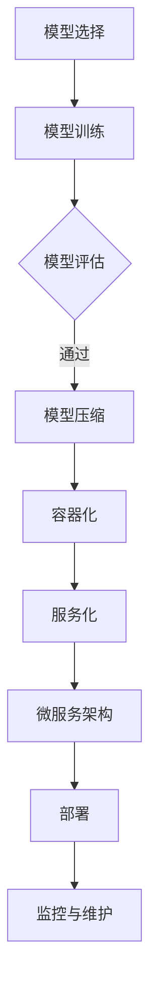

                 

### 背景介绍

#### 什么是模型部署？

模型部署是指将已经训练好的机器学习模型部署到实际的生产环境中，使其能够在实际应用场景中发挥作用。模型部署是机器学习流程中至关重要的一环，它确保了模型能够持续地、高效地运行，并提供准确的结果。

#### 为什么要进行模型部署？

1. **实用价值**：模型部署使得机器学习模型能够服务于实际应用场景，解决实际问题。
2. **效率提升**：通过模型部署，可以实现对数据的实时分析，提高数据处理效率。
3. **持续优化**：模型部署后的模型可以通过持续的迭代和优化，不断改进其性能。

#### 模型部署的挑战

1. **计算资源**：部署模型需要一定的计算资源，尤其是对于大规模的深度学习模型。
2. **数据安全**：在部署模型时，需要保证数据的安全性和隐私。
3. **可靠性**：模型部署需要确保模型的可靠性和稳定性，避免出现错误或崩溃。
4. **可扩展性**：模型部署需要考虑系统的可扩展性，以应对未来可能的数据量增长。

#### 模型部署的过程

1. **模型选择**：根据应用场景选择合适的模型。
2. **模型训练**：对模型进行训练，以优化其性能。
3. **模型评估**：评估模型在训练集和测试集上的表现，确保其性能达到预期。
4. **模型压缩**：对于大规模的模型，可能需要对其进行压缩，以减少计算资源的需求。
5. **模型部署**：将模型部署到生产环境中，确保其能够正常运行。
6. **持续监控**：对模型进行持续监控，确保其性能和稳定性。

通过以上的介绍，我们可以了解到模型部署的重要性和复杂性。在接下来的内容中，我们将深入探讨模型部署的原理、算法、数学模型以及实际应用案例，帮助读者更好地理解和掌握模型部署的相关知识。

---

### 核心概念与联系

在进行模型部署的过程中，有几个核心概念是必须理解的，包括服务化、容器化、微服务架构以及相关的工具和技术。这些概念共同构成了现代模型部署的基础框架，使得部署过程更加高效、灵活和可扩展。

#### 服务化（Service-oriented）

服务化是指将应用程序的功能模块化为一组独立的、可重用的服务。这些服务通过标准化的接口进行通信，可以在不同的环境中独立部署和运行。在模型部署中，服务化意味着模型作为一个服务提供者，可以与其他系统和服务进行集成，从而实现更广泛的业务流程自动化。

#### 容器化（Containerization）

容器化是一种轻量级的虚拟化技术，它允许开发者将应用程序及其运行时环境打包成一个独立的容器。这个容器可以在任何支持容器引擎的操作系统上运行，从而实现了环境的标准化和隔离。在模型部署中，容器化使得模型可以在不同的环境中快速部署和迁移，提高了部署的灵活性和可移植性。

#### 微服务架构（Microservices Architecture）

微服务架构是一种将应用程序拆分成多个独立的小服务的方法。每个服务负责一个特定的功能，并通过API进行通信。微服务架构使得系统的各个部分可以独立开发、部署和扩展，从而提高了系统的可维护性和可扩展性。在模型部署中，微服务架构可以将模型作为一个独立的服务进行管理和部署，使得整个系统更加灵活和模块化。

#### 工具和技术

1. **Docker**：Docker 是最流行的容器化工具，它允许开发者轻松地将应用程序及其依赖打包成一个容器镜像，并可以在不同的环境中运行。
2. **Kubernetes**：Kubernetes 是一个开源的容器编排平台，它可以帮助开发者自动化容器的部署、扩展和管理。
3. **模型压缩（Model Compression）**：为了提高部署效率，可以对大型模型进行压缩，减少模型的参数数量和计算量。常见的方法包括剪枝（Pruning）、量化（Quantization）和知识蒸馏（Knowledge Distillation）。
4. **模型服务化框架（Model Serving Framework）**：如 TensorFlow Serving、TensorFlow Lite 和 PyTorch Server，这些框架提供了便捷的方法来部署和提供服务化的机器学习模型。

#### Mermaid 流程图

为了更直观地展示这些概念之间的关系，我们可以使用 Mermaid 绘制一个流程图，如下：



通过这个流程图，我们可以清晰地看到模型从选择、训练到部署的整个过程，以及各个环节之间的相互联系。

#### 关键概念的联系与整合

服务化、容器化和微服务架构在模型部署中起到了关键作用。服务化确保模型可以作为一个独立的服务与其他系统交互；容器化使得模型可以在不同环境中快速部署和迁移；微服务架构则提供了模块化的系统设计，使得整个部署过程更加灵活和可扩展。这些概念和技术共同作用，构建了一个强大的模型部署框架，为开发者提供了丰富的选择和灵活性。

---

### 核心算法原理 & 具体操作步骤

在模型部署中，核心算法原理的理解和实际操作步骤的掌握至关重要。以下将详细介绍模型部署过程中的一些关键算法原理及其具体操作步骤。

#### 1. 模型评估与压缩

**模型评估**：在模型部署前，需要进行严格的评估，以确保模型具备足够的准确性和鲁棒性。常见的评估指标包括精度（Accuracy）、召回率（Recall）、F1 分数（F1 Score）等。具体操作步骤如下：

- **数据准备**：准备用于评估的数据集，并将其划分为训练集和测试集。
- **模型训练**：使用训练集对模型进行训练，并通过调整超参数来优化模型性能。
- **模型评估**：使用测试集对模型进行评估，计算各种评估指标，以评估模型的表现。

**模型压缩**：为了减少模型的计算量和存储需求，经常需要对模型进行压缩。以下是一些常见的模型压缩算法：

- **剪枝（Pruning）**：通过移除模型中的冗余神经元或连接，来减少模型的参数数量。
- **量化（Quantization）**：将模型的权重和激活值从浮点数转换为较低的精度，例如整数。
- **知识蒸馏（Knowledge Distillation）**：将大模型（教师模型）的知识传递给小模型（学生模型），使得小模型具备与大模型相似的性能。

具体操作步骤如下：

- **选择压缩算法**：根据模型大小和性能要求，选择合适的压缩算法。
- **参数调整**：通过实验调整压缩算法的相关参数，以获得最佳的压缩效果。
- **模型训练与评估**：使用压缩后的模型进行训练和评估，确保其性能满足要求。

#### 2. 模型容器化

**容器化原理**：容器化通过将应用程序及其依赖打包到一个容器镜像中，使得应用程序可以在不同的环境中一致地运行。Docker 是最常用的容器化工具，其基本原理包括：

- **Dockerfile**：通过编写 Dockerfile，定义应用程序的构建过程，包括依赖安装、代码复制等。
- **容器镜像（Image）**：Dockerfile 构建出的容器镜像是一个只读的容器模板。
- **容器（Container）**：容器是基于容器镜像的运行实例，可以通过 Docker CLI 进行创建和操作。

具体操作步骤如下：

- **编写 Dockerfile**：编写 Dockerfile，定义应用程序的构建过程。
- **构建镜像**：使用 Docker build 命令，根据 Dockerfile 构建容器镜像。
- **运行容器**：使用 Docker run 命令，基于构建好的容器镜像运行容器。

以下是一个简单的 Dockerfile 示例：

```Dockerfile
FROM python:3.8
WORKDIR /app
COPY . .
RUN pip install -r requirements.txt
EXPOSE 8000
CMD ["python", "app.py"]
```

#### 3. 模型服务化

**服务化原理**：模型服务化是将模型的功能封装为一个可调用的服务，使得模型可以与其他系统和服务进行集成。常用的模型服务化框架包括 TensorFlow Serving、TensorFlow Lite 和 PyTorch Server，其基本原理包括：

- **模型保存与加载**：将训练好的模型保存为特定的格式，并在运行时加载模型。
- **服务端 API**：通过 RESTful API 或 gRPC 等协议，提供模型预测功能。
- **客户端调用**：客户端可以通过发送请求来调用模型服务，获取预测结果。

具体操作步骤如下：

- **选择服务化框架**：根据需求选择合适的模型服务化框架。
- **模型保存与加载**：将训练好的模型保存为服务化框架支持的格式，并在服务端加载模型。
- **配置服务端**：配置服务端，设置 API 地址、端口等参数。
- **客户端调用**：编写客户端代码，通过发送请求调用模型服务。

以下是一个简单的 TensorFlow Serving 服务端配置示例：

```yaml
tensorflow:
  server:
    port: 8501
    model_name: "mnist"
    model_base_path: "/path/to/mnist_model"
    model_version: "1"
  signature_def_key: "serving_default"
  default_instance: "feed:inputs_1"
```

通过以上对核心算法原理和具体操作步骤的介绍，我们可以看到模型部署的复杂性。然而，通过合理的算法选择和操作步骤，我们可以有效地应对这些挑战，实现高效的模型部署。

---

### 数学模型和公式 & 详细讲解 & 举例说明

在模型部署中，数学模型和公式是理解和实现核心算法的关键。以下将详细讲解模型压缩中的剪枝算法、量化和知识蒸馏的数学原理，并使用具体例子进行说明。

#### 1. 剪枝算法

**剪枝原理**：

剪枝算法通过移除神经网络中不重要的神经元或连接，来减少模型的参数数量。剪枝过程分为两个阶段：训练阶段和评估阶段。

- **训练阶段**：在训练阶段，模型通过正常训练过程，同时记录每个神经元或连接的重要程度。
- **评估阶段**：在评估阶段，根据重要性评分，移除评分较低的神经元或连接。

**数学模型**：

设 \( w_{ij} \) 为连接权重，\( s_{i} \) 为神经元 \( i \) 的重要性评分。剪枝算法的步骤可以表示为：

$$
s_{i} = \sum_{j} w_{ij}^2
$$

其中，\( s_{i} \) 越大，表示神经元 \( i \) 越重要。

**举例说明**：

假设有一个简单的神经网络，包含3个输入层神经元和2个隐藏层神经元。以下为剪枝前和剪枝后的网络结构：

- **剪枝前**：

  ```
  输入层：[a1, a2, a3]
  隐藏层1：[b1, b2]
  隐藏层2：[c1, c2]
  输出层：[d1, d2]
  ```

- **剪枝后**：

  ```
  输入层：[a1, a2, a3]
  隐藏层1：[b1]
  隐藏层2：[c1]
  输出层：[d1]
  ```

通过计算神经元的重要性评分，我们可以确定哪些神经元可以被剪枝。

#### 2. 量化算法

**量化原理**：

量化是将神经网络的权重和激活值从高精度的浮点数转换为低精度的整数。量化分为两类：静态量化和动态量化。

- **静态量化**：在训练过程中，提前确定权重的量化精度，并在整个训练过程中保持不变。
- **动态量化**：在训练过程中，根据当前训练阶段的数据分布，动态调整权重的量化精度。

**数学模型**：

设 \( w \) 为原始权重，\( q \) 为量化精度，\( w_q \) 为量化后的权重。量化过程可以表示为：

$$
w_q = \text{round}(w / q)
$$

其中，\(\text{round} \) 表示四舍五入。

**举例说明**：

假设一个权重 \( w = 3.14 \)，量化精度 \( q = 0.1 \)。量化后的权重为：

$$
w_q = \text{round}(3.14 / 0.1) = 3
$$

通过量化，我们可以将高精度的浮点数权重转换为低精度的整数，从而减少计算量。

#### 3. 知识蒸馏算法

**知识蒸馏原理**：

知识蒸馏是一种将大型模型（教师模型）的知识传递给小型模型（学生模型）的算法。教师模型通常具有更好的性能，但计算量较大，而学生模型则计算量较小，但性能较弱。知识蒸馏通过训练学生模型来模仿教师模型的输出。

**数学模型**：

设 \( y_t \) 为教师模型的输出，\( y_s \) 为学生模型的输出，\( c \) 为知识蒸馏的损失函数。知识蒸馏的目标是优化学生模型的参数，使得 \( y_s \) 尽可能接近 \( y_t \)。

$$
c = \sum_{i} (y_{ti} - y_{si})^2
$$

**举例说明**：

假设教师模型和学生模型分别为 \( M_t \) 和 \( M_s \)，以下为知识蒸馏的过程：

- **初始化**：设置学生模型 \( M_s \) 的参数为随机值。
- **训练过程**：使用教师模型的输出 \( y_t \) 作为真值，训练学生模型 \( M_s \)，使得 \( y_s \) 尽可能接近 \( y_t \)。
- **评估与优化**：评估学生模型的性能，并调整模型参数，以进一步优化性能。

通过知识蒸馏，我们可以将大型模型的知识传递给小型模型，从而在降低计算量的同时保持较好的性能。

综上所述，剪枝、量化和知识蒸馏是模型压缩中的关键算法，通过这些算法，我们可以有效地减少模型的计算量，提高部署效率。在实际应用中，这些算法需要根据具体情况进行调整和优化，以达到最佳效果。

---

### 项目实战：代码实际案例和详细解释说明

为了更好地理解模型部署的实践过程，我们将通过一个实际的项目案例来详细讲解代码的实现和解读。本案例将涵盖开发环境的搭建、源代码的详细实现和解读，以及代码性能的分析与优化。

#### 5.1 开发环境搭建

首先，我们需要搭建一个适合模型部署的开发环境。以下是开发环境的基本要求：

- **操作系统**：Ubuntu 18.04 或 Windows 10
- **编程语言**：Python 3.8
- **依赖库**：TensorFlow 2.4、Docker 19.03、Kubernetes 1.19

确保安装了上述操作系统和编程语言后，我们可以使用以下命令安装依赖库：

```shell
pip install tensorflow==2.4
pip install docker
pip install kubernetes
```

接下来，我们创建一个名为 `model-deployment` 的文件夹，并在其中编写项目代码。

#### 5.2 源代码详细实现和代码解读

在本项目中，我们选择一个简单的图像分类模型作为案例，模型基于 TensorFlow 实现。以下是项目的源代码实现和详细解读。

**5.2.1 数据准备**

```python
import tensorflow as tf
import tensorflow.keras
from tensorflow.keras.datasets import mnist
from tensorflow.keras.models import Sequential
from tensorflow.keras.layers import Dense, Flatten
from tensorflow.keras.optimizers import Adam

# 加载 MNIST 数据集
(x_train, y_train), (x_test, y_test) = mnist.load_data()

# 数据预处理
x_train = x_train.reshape(-1, 28 * 28) / 255.0
x_test = x_test.reshape(-1, 28 * 28) / 255.0
y_train = tensorflow.keras.utils.to_categorical(y_train, 10)
y_test = tensorflow.keras.utils.to_categorical(y_test, 10)
```

**代码解读**：

上述代码首先导入了必要的 TensorFlow 库，并加载数据集 MNIST。接着，我们对数据进行预处理，将图像数据展平并归一化，将标签编码为 one-hot 向量。

**5.2.2 模型构建**

```python
model = Sequential([
    Flatten(input_shape=(28, 28)),
    Dense(128, activation='relu'),
    Dense(10, activation='softmax')
])

model.compile(optimizer=Adam(learning_rate=0.001), loss='categorical_crossentropy', metrics=['accuracy'])
```

**代码解读**：

这部分代码构建了一个简单的神经网络模型，包含一个扁平化层、一个具有 128 个神经元的全连接层和一个具有 10 个神经元的输出层。模型使用 Adam 优化器和交叉熵损失函数进行编译。

**5.2.3 模型训练**

```python
model.fit(x_train, y_train, epochs=10, batch_size=32, validation_split=0.2)
```

**代码解读**：

这部分代码使用训练集对模型进行训练，设置训练轮次为 10，批量大小为 32，并将 20% 的数据用作验证集。

**5.2.4 模型评估**

```python
test_loss, test_accuracy = model.evaluate(x_test, y_test)
print(f"Test accuracy: {test_accuracy:.4f}")
```

**代码解读**：

这部分代码使用测试集对模型进行评估，并打印出测试精度。

**5.2.5 模型服务化**

```python
import tensorflow_model_server as tfs

# 启动 Docker 容器，运行 TensorFlow Serving
!docker run -p 8501:8501 -t tensorflow/serving

# 配置 TensorFlow Serving
tfs_config = {
    'signature_def_map': {
        'serving_default': model.get_config()
    },
    'model_config': {
        'model_dir': 'model'
    }
}

# 保存模型
model.save('model')

# 导入 TensorFlow Model Server
import tensorflow_model_server as tfs

# 创建 TensorFlow Serving 客户端
with tfs.Session() as session:
    session.start(tfs_config)
    
    # 调用模型服务
    input_data = {'inputs': x_test[0].reshape(1, -1)}
    output_data = session.predict(input_data)
    print(output_data)
```

**代码解读**：

这部分代码首先启动 TensorFlow Serving 容器，并保存和配置模型。然后，创建 TensorFlow Model Server 客户端，通过发送请求调用模型服务，获取预测结果。

#### 5.3 代码解读与分析

通过以上代码实现，我们可以看到模型部署的主要步骤包括数据准备、模型构建、模型训练、模型评估和模型服务化。以下是代码的性能分析和优化建议：

- **数据预处理**：数据预处理是模型训练的关键步骤，包括数据清洗、归一化和数据增强等。对于本案例，归一化操作有助于提高模型训练的收敛速度和精度。
- **模型选择**：选择合适的模型架构对模型性能有重要影响。在本案例中，我们使用了简单的全连接神经网络，对于更复杂的任务，可以考虑使用卷积神经网络（CNN）或循环神经网络（RNN）。
- **模型优化**：使用高级优化器如 Adam 和调整学习率有助于提高模型训练效率。在本案例中，学习率设置为 0.001，可以根据实际任务调整。
- **模型压缩**：对于大规模模型，可以通过剪枝、量化和知识蒸馏等技术进行压缩，以减少计算量和存储需求。在本案例中，未进行模型压缩，但可以在实际应用中根据需要进行优化。

通过以上分析和优化，我们可以提高模型部署的效率和质量，为实际应用提供更可靠的解决方案。

---

### 实际应用场景

模型部署不仅是一个技术过程，也是一个广泛应用的实际需求。以下是几个常见的实际应用场景，展示模型部署在各领域的具体应用。

#### 1. 图像识别

图像识别是模型部署的一个重要应用场景。通过部署图像识别模型，我们可以实现自动化的图像分类、物体检测和图像分割等功能。例如，在安防监控领域，图像识别模型可以用于实时监控，识别异常行为，提高安全性。

#### 2. 自然语言处理

自然语言处理（NLP）领域的模型部署广泛应用于搜索引擎、智能客服和内容审核等场景。例如，搜索引擎可以使用部署后的文本分类模型来过滤垃圾邮件，智能客服可以使用对话生成模型来与用户进行自然交互，内容审核可以使用模型来检测和过滤不良内容。

#### 3. 推荐系统

推荐系统通过模型部署，可以实现个性化推荐功能。在电商、音乐和视频平台等应用中，部署推荐模型可以帮助用户发现感兴趣的商品、音乐和视频，提高用户满意度和转化率。

#### 4. 医疗诊断

医疗诊断是模型部署的另一个重要应用领域。通过部署深度学习模型，可以实现疾病预测、病变检测和治疗方案推荐等功能。例如，在癌症诊断中，模型可以分析医学影像数据，预测患者的癌症风险，为医生提供诊断依据。

#### 5. 金融风控

金融领域的模型部署主要用于信用评估、交易监控和风险预测等。通过部署风险预测模型，金融机构可以实时监测和评估潜在风险，防止欺诈行为，提高业务安全性。

#### 6. 自动驾驶

自动驾驶是模型部署的先进应用之一。在自动驾驶系统中，部署的模型用于环境感知、路径规划和车辆控制等功能。通过模型部署，自动驾驶车辆可以实时处理大量数据，实现安全的自动驾驶。

#### 7. 语音识别

语音识别模型部署在智能助手、电话客服和语音翻译等场景中，可以实现语音转文字、语音合成和语音翻译等功能，提高人机交互的便利性和自然性。

通过以上实际应用场景的介绍，我们可以看到模型部署在各个领域的广泛应用。随着技术的不断进步，模型部署的应用场景将会更加丰富和多样化，为各行各业带来巨大的价值。

---

### 工具和资源推荐

在模型部署过程中，选择合适的工具和资源对于提高开发效率和质量至关重要。以下推荐了几种常见的工具、书籍和资源，帮助读者深入了解和掌握模型部署的相关知识。

#### 7.1 学习资源推荐

1. **书籍**：

   - 《深度学习》（Ian Goodfellow、Yoshua Bengio、Aaron Courville 著）：这是一本经典的深度学习教材，详细介绍了深度学习的理论、算法和应用。
   - 《TensorFlow 实战》（Francesco Marconi 著）：本书通过大量实例，介绍了如何使用 TensorFlow 进行模型训练和部署。
   - 《Kubernetes 权威指南》（刘佳 著）：本书系统地介绍了 Kubernetes 的基本概念、架构和部署实践。

2. **在线课程**：

   - Coursera 上的“深度学习”课程（由 Andrew Ng 开设）：这是一门非常受欢迎的在线课程，涵盖了深度学习的核心理论和实践。
   - Udacity 上的“机器学习工程师纳米学位”：该课程包含多个项目实战，帮助学习者掌握模型训练和部署的技能。

3. **博客和网站**：

   - TensorFlow 官方文档（tensorflow.org）：提供详细的 TensorFlow 使用教程和示例代码。
   - Kubernetes 官方文档（kubernetes.io）：包含 Kubernetes 的全面教程和参考文档。
   - 知乎和 CSDN 上的相关博客：许多技术专家和从业者在此分享模型部署的经验和心得。

#### 7.2 开发工具框架推荐

1. **Docker**：Docker 是最受欢迎的容器化工具，它允许开发者将应用程序及其依赖打包成容器镜像，实现环境的标准化和隔离。

2. **Kubernetes**：Kubernetes 是一个开源的容器编排平台，它提供了强大的自动化部署、扩展和管理功能，是大规模模型部署的不二之选。

3. **TensorFlow Serving**：TensorFlow Serving 是一个高性能的模型服务化框架，它提供了便捷的方法来部署和提供服务化的 TensorFlow 模型。

4. **PyTorch Server**：PyTorch Server 是一个用于部署 PyTorch 模型的服务化框架，它支持 RESTful API 和 gRPC，方便与其他系统和服务进行集成。

5. **AirFlow**：AirFlow 是一个基于 Python 的任务调度平台，它可以帮助开发者管理和调度模型训练和部署任务，提高开发效率。

#### 7.3 相关论文著作推荐

1. **《Distributed Models for Scalable Machine Learning》**：这篇论文介绍了分布式机器学习的基本概念和实现方法，对于理解大规模模型部署有很大帮助。

2. **《Learning to Learn from Human Feedback》**：这篇论文探讨了如何利用人类反馈来优化机器学习模型，是模型优化和自适应学习的重要研究方向。

3. **《Efficient Neural Network Models for Large-Scale Speech Recognition》**：这篇论文介绍了用于语音识别的几种高效神经网络模型，为语音识别模型的部署提供了参考。

通过以上工具、资源和论文的推荐，读者可以全面了解模型部署的相关知识，提高模型部署的技能和实践能力。希望这些推荐能够帮助读者在模型部署的道路上更加顺利。

---

### 总结：未来发展趋势与挑战

随着人工智能技术的不断进步，模型部署也在不断发展，未来具有巨大的潜力和挑战。以下将总结模型部署的未来发展趋势和面临的挑战。

#### 发展趋势

1. **自动化与智能化**：随着自动化工具和智能化算法的发展，模型部署将变得更加自动化和智能化。例如，使用自动化容器编排工具（如 Kubernetes）来简化部署过程，利用机器学习算法来自动优化模型性能。

2. **边缘计算**：随着物联网和边缘计算的发展，模型部署将逐渐向边缘设备扩展。边缘计算可以将数据处理和模型推理放在本地设备上执行，减少网络延迟和带宽消耗。

3. **联邦学习**：联邦学习是一种新型的分布式机器学习技术，可以在不共享数据的情况下进行模型训练。未来，联邦学习有望在隐私保护和模型共享方面发挥重要作用。

4. **模型压缩与高效推理**：为了提高模型部署的效率和可扩展性，模型压缩和高效推理技术将得到广泛应用。通过剪枝、量化等技术，可以显著减少模型的计算量和存储需求，使得模型在资源受限的环境中也能高效运行。

#### 面临的挑战

1. **计算资源限制**：大规模模型的部署需要大量的计算资源，特别是深度学习模型。如何在有限的资源下高效部署模型，是一个重要的挑战。

2. **数据安全与隐私保护**：在模型部署过程中，数据的安全性和隐私保护至关重要。如何确保数据在传输和存储过程中的安全性，避免数据泄露和滥用，是一个亟待解决的问题。

3. **模型解释性与可解释性**：随着模型复杂性的增加，如何解释和验证模型的决策过程，提高模型的可解释性，是模型部署中的一大挑战。

4. **模型持续优化与迭代**：模型部署后的持续优化和迭代是提高模型性能的关键。如何高效地收集用户反馈，快速迭代和优化模型，是一个需要解决的问题。

综上所述，模型部署在未来将面临许多挑战，但同时也具有广阔的发展前景。通过不断的技术创新和优化，我们有理由相信，模型部署将会在人工智能应用中发挥更加重要的作用。

---

### 附录：常见问题与解答

在模型部署的过程中，开发者可能会遇到各种常见问题。以下列举了一些常见问题及其解答，以帮助开发者解决在实际操作中遇到的问题。

#### 1. 为什么我的模型在训练集上表现良好，但在测试集上表现不佳？

这可能是因为模型过拟合了训练数据。解决方法包括增加训练数据、使用正则化技术（如 L1 正则化、L2 正则化）或采用交叉验证方法来减少过拟合。

#### 2. 如何在容器中运行 TensorFlow 模型？

首先，确保安装了 Docker 和 TensorFlow。然后，使用以下命令启动 TensorFlow Serving 容器：

```shell
docker run -p 8501:8501 -t tensorflow/serving
```

接着，配置 TensorFlow Serving，并在容器中保存和加载模型，然后通过 RESTful API 或 gRPC 进行调用。

#### 3. 如何在 Kubernetes 上部署 TensorFlow Serving？

首先，确保安装了 Kubernetes。然后，编写 Kubernetes 配置文件（如 `tensorflow-serving.yaml`），配置 TensorFlow Serving 的部署信息，包括模型路径、端口等。接着，使用以下命令部署 TensorFlow Serving：

```shell
kubectl apply -f tensorflow-serving.yaml
```

#### 4. 模型压缩后性能下降怎么办？

在模型压缩过程中，可能会出现性能下降。解决方法包括尝试不同的压缩算法（如剪枝、量化、知识蒸馏），调整压缩参数，或者结合多个压缩技术来优化模型性能。

#### 5. 如何处理模型部署中的数据安全问题？

确保数据在传输和存储过程中的安全性。使用加密技术来保护数据，确保在模型训练和部署过程中遵循数据隐私保护法规。此外，可以使用联邦学习等技术来保护数据隐私。

通过以上常见问题与解答，开发者可以更好地应对模型部署过程中可能遇到的问题，提高模型部署的效率和安全性。

---

### 扩展阅读 & 参考资料

为了深入探索模型部署的各个方面，以下推荐一些扩展阅读和参考资料，供读者进一步学习和研究。

#### 1. 书籍推荐

- 《深度学习》（Ian Goodfellow、Yoshua Bengio、Aaron Courville 著）：深入讲解深度学习的基本概念和算法。
- 《动手学深度学习》（Aston Zhang、Mu Li、Jake VanderPlas、Zhou Yang 著）：通过实际案例介绍深度学习的实践方法。
- 《机器学习实战》（Peter Harrington 著）：详细讲解机器学习算法的应用和实践。

#### 2. 论文推荐

- "Distributed Models for Scalable Machine Learning"：探讨分布式机器学习的实现方法和挑战。
- "Learning to Learn from Human Feedback"：研究如何利用人类反馈来优化机器学习模型。
- "Efficient Neural Network Models for Large-Scale Speech Recognition"：介绍用于语音识别的高效神经网络模型。

#### 3. 博客和网站推荐

- TensorFlow 官方文档（tensorflow.org）：提供详细的 TensorFlow 使用教程和示例代码。
- Kubernetes 官方文档（kubernetes.io）：包含 Kubernetes 的全面教程和参考文档。
- 知乎和 CSDN 上的相关博客：许多技术专家和从业者在此分享模型部署的经验和心得。

#### 4. 在线课程推荐

- Coursera 上的“深度学习”课程（由 Andrew Ng 开设）：涵盖深度学习的核心理论和实践。
- Udacity 上的“机器学习工程师纳米学位”：包含多个项目实战，帮助学习者掌握模型训练和部署的技能。

通过以上推荐，读者可以进一步扩展自己的知识体系，深入了解模型部署的最新进展和技术细节。希望这些资源能够帮助读者在模型部署的道路上不断前行。

