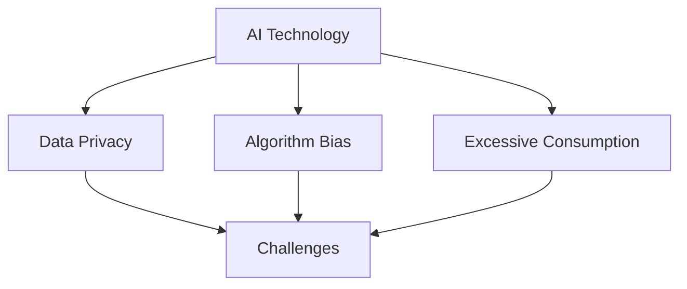
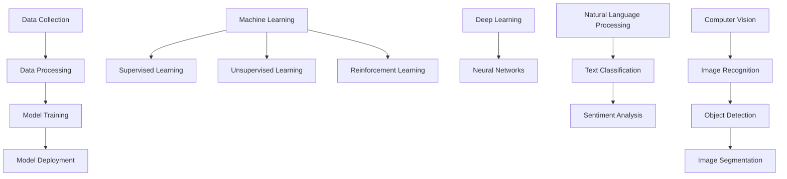

                 

### 背景介绍

#### AI时代与消费伦理

随着人工智能（AI）技术的迅速发展，其在社会各个领域的应用越来越广泛。从智能助手到自动驾驶，从医疗诊断到金融分析，AI正在深刻地改变我们的生活方式。然而，这种变革并非没有代价。AI技术的普及和应用带来了许多新的挑战，尤其是在消费伦理方面。

消费伦理是指个人和社会在消费行为中所遵循的道德规范和价值观念。在传统时代，消费伦理主要涉及产品安全和质量、价格公道、消费者权益保护等方面。然而，随着AI技术的发展，消费伦理面临新的挑战和问题。例如：

1. **数据隐私问题**：AI技术需要大量的数据来训练模型，这些数据往往涉及用户的个人信息。如何确保这些数据的安全和隐私成为了一个重要议题。
2. **算法偏见问题**：AI算法在决策过程中可能存在偏见，这种偏见可能导致歧视和不公平。例如，招聘算法可能对某些群体产生偏见，导致这些群体在就业市场上受到不公正待遇。
3. **过度消费问题**：AI技术可以精准地分析用户的消费习惯和偏好，从而诱导用户进行过度消费。这可能导致消费者陷入债务陷阱，影响其生活质量。

本文旨在探讨AI时代消费伦理的持续化问题。我们将首先介绍AI技术的核心概念和原理，然后分析其在消费伦理方面所面临的挑战，最后提出一些可能的解决方案和未来发展趋势。

关键词：AI时代，消费伦理，数据隐私，算法偏见，过度消费

Abstract:
With the rapid development of artificial intelligence (AI) technology, its applications in various fields are becoming increasingly widespread. However, this transformation brings new challenges, especially in the area of consumer ethics. This paper aims to explore the sustainability of consumer ethics in the AI era. We will first introduce the core concepts and principles of AI technology, then analyze the challenges it faces in terms of consumer ethics, and finally propose possible solutions and future trends.

Keywords: AI era, consumer ethics, data privacy, algorithm bias, excessive consumption



#### AI技术的核心概念与架构

要理解AI技术在消费伦理方面的挑战，首先需要了解AI技术的核心概念和架构。人工智能是一种通过模拟人类智能行为，使计算机具备学习能力、推理能力、感知能力和自我修正能力的学科。AI技术主要包括以下几个核心概念：

1. **机器学习**：机器学习是一种通过数据训练模型，使计算机能够从数据中自动学习和发现规律的方法。常见的机器学习算法有监督学习、无监督学习和强化学习。
2. **深度学习**：深度学习是机器学习的一种特殊形式，它使用多层神经网络来提取数据的特征和模式。深度学习在图像识别、语音识别和自然语言处理等领域取得了显著成果。
3. **神经网络**：神经网络是一种模仿人脑结构的计算模型，由大量的神经元通过加权连接构成。神经网络通过不断调整权重来学习数据中的特征和模式。
4. **自然语言处理**：自然语言处理是一种使计算机能够理解、生成和处理人类自然语言的技术。自然语言处理在机器翻译、文本分类和情感分析等方面有广泛应用。
5. **计算机视觉**：计算机视觉是一种使计算机能够从图像或视频中获取信息的技术。计算机视觉在图像识别、目标检测和图像分割等方面有广泛应用。

AI技术的核心架构通常包括数据收集、数据处理、模型训练和模型部署等几个步骤：

1. **数据收集**：数据是AI技术的基石。AI模型需要大量的数据来训练，这些数据可以来自公开数据集、企业内部数据或用户生成的数据。
2. **数据处理**：数据处理包括数据清洗、数据归一化和特征提取等步骤。数据清洗旨在去除噪声和异常值，数据归一化旨在将数据缩放到相同的尺度，特征提取旨在提取数据中的关键特征。
3. **模型训练**：模型训练是指通过机器学习算法，使计算机能够从数据中学习规律和模式。训练过程中，模型会不断调整权重，以最小化预测误差。
4. **模型部署**：模型部署是指将训练好的模型应用到实际场景中。模型部署可以是在线部署，也可以是离线部署。

以下是一个简化的AI技术流程图，展示了上述核心概念和架构：



通过理解AI技术的核心概念和架构，我们可以更好地分析其在消费伦理方面所面临的挑战。

```markdown
#### 1. 数据隐私问题

数据隐私是AI技术面临的最重要的伦理问题之一。AI系统需要大量的数据来训练模型，这些数据通常包括用户的个人信息，如姓名、年龄、性别、地理位置、购物习惯等。如何确保这些数据的安全和隐私成为了一个重要议题。

1. **数据收集与共享**：在数据收集过程中，需要明确数据的收集目的和使用范围，确保用户知情并同意。同时，数据在收集和传输过程中需要采取加密和安全措施，防止数据泄露和滥用。

2. **数据匿名化与去识别化**：为了保护用户的隐私，可以对数据进行匿名化和去识别化处理。匿名化是指去除数据中的可直接识别用户身份的信息，而去识别化是指通过技术手段使数据无法直接与用户身份联系起来。

3. **数据访问与控制**：用户应该有权访问和修改自己的个人信息，并有权决定其数据的用途和共享方式。这需要建立完善的数据访问与控制机制，确保用户的数据权益得到保障。

4. **数据存储与保护**：数据在存储过程中需要采取安全措施，如加密存储和访问控制，防止未经授权的访问和泄露。同时，需要建立数据备份和恢复机制，确保数据的完整性和可用性。

5. **数据监管与合规**：在数据隐私方面，需要遵守相关的法律法规和标准，如《通用数据保护条例》（GDPR）和《加州消费者隐私法案》（CCPA）。企业需要建立完善的数据合规体系，确保数据处理的合法性和合规性。

### 2. 算法偏见问题

算法偏见是指AI算法在决策过程中可能存在的不公平、歧视现象。算法偏见可能源于数据的不平衡、模型的缺陷、训练数据的选择等。算法偏见可能导致以下问题：

1. **就业歧视**：招聘算法可能对某些群体产生偏见，导致这些群体在就业市场上受到不公正待遇。例如，某些招聘平台可能更倾向于录用具有某些特定学校背景或工作经验的候选人。

2. **信用评估**：信用评估算法可能对某些群体进行不公平的信用评分，导致这些群体在贷款和信用服务方面受到歧视。例如，某些信用评估模型可能对低收入群体或年轻人产生偏见。

3. **医疗诊断**：医疗诊断算法可能对某些疾病的治疗产生偏见，导致这些疾病的治疗效果不佳。例如，某些诊断模型可能对某些种族或性别的人群存在偏见。

为了解决算法偏见问题，可以采取以下措施：

1. **数据平衡**：在模型训练过程中，需要确保数据集的平衡性，避免出现过度代表某些群体的情况。可以通过数据扩充、数据清洗和调整训练策略等方法来实现。

2. **模型透明性**：提高模型的透明性，使算法决策过程更加可解释和可追溯。可以采用可视化工具、解释性模型和决策树等方法来提高模型的可解释性。

3. **算法审查与监督**：建立算法审查和监督机制，对AI系统的算法进行定期审查和评估，确保算法的公平性和公正性。可以采用第三方审查、法律监督和伦理委员会等方式来实现。

4. **多元化和包容性**：在AI系统的开发过程中，重视多元化和包容性，吸纳不同背景和观点的人员参与，以减少算法偏见。可以通过多样化培训、多元文化研究和多样性评估等方式来实现。

#### 3. 过度消费问题

AI技术可以通过分析用户的消费行为和偏好，精准地推送个性化的商品和服务。然而，这种个性化的推荐可能导致用户陷入过度消费的陷阱。过度消费可能带来以下问题：

1. **消费主义陷阱**：个性化的推荐系统可能诱导用户购买自己并不需要或并不喜欢的产品和服务，导致用户陷入消费主义的陷阱。

2. **债务问题**：过度消费可能导致用户陷入债务危机，影响其生活质量和财务状况。

3. **心理健康问题**：持续受到个性化的消费推荐，可能导致用户感到焦虑、压力和孤独，影响心理健康。

为了解决过度消费问题，可以采取以下措施：

1. **消费教育**：加强对用户的消费教育，提高用户的消费意识和能力，使其能够理性消费，避免过度消费。

2. **推荐系统优化**：优化推荐算法，减少过度个性化的推荐，增加用户选择的多样性，降低用户陷入消费陷阱的风险。

3. **价格透明化**：提高商品和服务的价格透明度，使用户能够更清楚地了解商品和服务的价值，避免被高价商品所诱导。

4. **法律法规监管**：加强对过度消费的监管，制定相关法律法规，规范企业和平台的行为，保护用户的合法权益。

通过以上措施，可以逐步解决AI时代消费伦理面临的挑战，促进消费伦理的持续化发展。
``` 

#### 核心算法原理 & 具体操作步骤

为了更深入地理解AI技术在消费伦理方面的挑战，我们需要探讨一些核心算法的原理和具体操作步骤。以下将介绍几种常用的算法，包括机器学习算法、深度学习算法和自然语言处理算法。

##### 1. 机器学习算法

机器学习算法是AI技术的基础，它使计算机能够从数据中自动学习和发现规律。常见的机器学习算法包括线性回归、逻辑回归、支持向量机（SVM）、决策树、随机森林和K最近邻（KNN）等。以下是这些算法的基本原理和具体操作步骤：

1. **线性回归**

线性回归是一种用于预测数值型结果的算法。它的基本原理是通过找到最佳拟合线来预测结果。

   - **原理**：线性回归通过最小化误差平方和来找到最佳拟合线。

   - **步骤**：
     1. 定义损失函数：通常使用均方误差（MSE）作为损失函数。
     2. 梯度下降：通过不断调整模型的参数，使损失函数的值最小化。
     3. 训练模型：使用训练数据集来训练模型。
     4. 预测：使用训练好的模型来预测新数据的值。

2. **逻辑回归**

逻辑回归是一种用于分类问题的算法。它的基本原理是通过找到最佳拟合线来预测概率。

   - **原理**：逻辑回归通过Sigmoid函数将线性模型的结果映射到概率范围。

   - **步骤**：
     1. 定义损失函数：通常使用交叉熵损失函数。
     2. 梯度下降：通过不断调整模型的参数，使损失函数的值最小化。
     3. 训练模型：使用训练数据集来训练模型。
     4. 预测：使用训练好的模型来预测新数据的类别。

3. **支持向量机（SVM）**

支持向量机是一种用于分类和回归问题的算法。它的基本原理是通过找到一个最佳超平面来分隔数据。

   - **原理**：SVM通过最大化分类间隔来找到最佳超平面。

   - **步骤**：
     1. 定义损失函数：通常使用 hinge 损失函数。
     2. 梯度下降：通过不断调整模型的参数，使损失函数的值最小化。
     3. 训练模型：使用训练数据集来训练模型。
     4. 预测：使用训练好的模型来预测新数据的类别。

4. **决策树**

决策树是一种用于分类和回归问题的算法。它的基本原理是通过一系列的判断条件来分隔数据。

   - **原理**：决策树通过构建树形结构来模拟决策过程。

   - **步骤**：
     1. 定义损失函数：通常使用基尼不纯度或信息增益作为分割标准。
     2. 决策树构建：通过递归划分数据，构建树形结构。
     3. 训练模型：使用训练数据集来训练模型。
     4. 预测：使用训练好的模型来预测新数据的类别或值。

5. **随机森林**

随机森林是一种基于决策树的集成学习方法。它的基本原理是通过构建多棵决策树，并利用随机性来减少过拟合。

   - **原理**：随机森林通过随机选取特征和样本子集来构建多棵决策树。

   - **步骤**：
     1. 构建多棵决策树：对于每一棵树，随机选取特征和样本子集。
     2. 集成决策：利用多棵决策树的预测结果进行投票或取平均。
     3. 训练模型：使用训练数据集来训练模型。
     4. 预测：使用训练好的模型来预测新数据的类别或值。

6. **K最近邻（KNN）**

K最近邻是一种基于实例的算法。它的基本原理是通过计算新数据与训练数据之间的相似度来预测新数据的类别。

   - **原理**：KNN通过计算欧几里得距离或曼哈顿距离来衡量数据的相似度。

   - **步骤**：
     1. 计算距离：计算新数据与训练数据之间的距离。
     2. 选择邻居：选取距离最近的K个邻居。
     3. 预测：根据邻居的类别进行投票或取平均。
     4. 训练模型：使用训练数据集来训练模型。
     5. 预测：使用训练好的模型来预测新数据的类别。

##### 2. 深度学习算法

深度学习是一种基于多层神经网络的学习方法。它通过模拟人脑神经网络的结构和功能，使计算机具备更强的学习和推理能力。以下介绍几种常用的深度学习算法：

1. **卷积神经网络（CNN）**

卷积神经网络是一种用于图像识别和处理的算法。它的基本原理是通过卷积操作来提取图像特征。

   - **原理**：CNN通过卷积层、池化层和全连接层来构建网络。

   - **步骤**：
     1. 输入层：接收图像数据。
     2. 卷积层：通过卷积操作提取图像特征。
     3. 池化层：通过池化操作减小特征图的大小。
     4. 全连接层：通过全连接层进行分类或回归。
     5. 输出层：输出预测结果。

2. **循环神经网络（RNN）**

循环神经网络是一种用于序列数据学习的算法。它的基本原理是通过循环结构来保持序列信息。

   - **原理**：RNN通过隐藏状态和循环连接来处理序列数据。

   - **步骤**：
     1. 输入层：接收序列数据。
     2. 隐藏层：通过递归连接计算隐藏状态。
     3. 输出层：输出序列的预测结果。
     4. 循环：通过递归连接将隐藏状态传递到下一个时间步。

3. **长短期记忆网络（LSTM）**

长短期记忆网络是一种改进的循环神经网络，它能够更好地处理长序列数据。

   - **原理**：LSTM通过引入门控结构来控制信息的流动，避免梯度消失和梯度爆炸问题。

   - **步骤**：
     1. 输入层：接收序列数据。
     2. 隐藏层：通过门控结构计算隐藏状态。
     3. 输出层：输出序列的预测结果。
     4. 循环：通过门控结构将隐藏状态传递到下一个时间步。

##### 3. 自然语言处理算法

自然语言处理是一种使计算机能够理解、生成和处理人类自然语言的技术。以下介绍几种常用的自然语言处理算法：

1. **词袋模型**

词袋模型是一种用于文本分类和情感分析的算法。它的基本原理是将文本表示为一个词汇表，并计算词汇表中的词频。

   - **原理**：词袋模型将文本转换为向量，并计算向量中的词频。

   - **步骤**：
     1. 分词：将文本划分为单词或词组。
     2. 建立词汇表：将文本中的单词或词组转换为索引。
     3. 向量化：将文本转换为向量，并计算向量中的词频。
     4. 训练模型：使用训练数据集来训练模型。
     5. 预测：使用训练好的模型来预测新文本的类别或情感。

2. **递归神经网络（RNN）**

递归神经网络是一种用于文本分类和序列数据学习的算法。它的基本原理是通过递归结构来处理序列数据。

   - **原理**：RNN通过递归连接来计算隐藏状态，并用于文本分类。

   - **步骤**：
     1. 输入层：接收文本序列。
     2. 隐藏层：通过递归连接计算隐藏状态。
     3. 输出层：输出文本的预测结果。
     4. 循环：通过递归连接将隐藏状态传递到下一个时间步。

3. **长短时记忆网络（LSTM）**

长短期记忆网络是一种改进的循环神经网络，它能够更好地处理长序列数据。

   - **原理**：LSTM通过引入门控结构来控制信息的流动，避免梯度消失和梯度爆炸问题。

   - **步骤**：
     1. 输入层：接收文本序列。
     2. 隐藏层：通过门控结构计算隐藏状态。
     3. 输出层：输出文本的预测结果。
     4. 循环：通过门控结构将隐藏状态传递到下一个时间步。

通过理解这些核心算法的原理和具体操作步骤，我们可以更好地应用AI技术来解决消费伦理问题，并推动消费伦理的持续化发展。

### 数学模型和公式 & 详细讲解 & 举例说明

在AI技术中，数学模型和公式扮演着核心角色。这些模型和公式不仅帮助我们理解AI算法的工作原理，还帮助我们设计和优化这些算法。在本节中，我们将详细介绍一些关键数学模型和公式，并提供详细的讲解和具体例子。

#### 1. 线性回归模型

线性回归是一种用于预测数值型结果的算法。其基本模型可以表示为：

$$y = \beta_0 + \beta_1 \cdot x + \epsilon$$

其中，\(y\) 是因变量，\(x\) 是自变量，\(\beta_0\) 和 \(\beta_1\) 是模型参数，\(\epsilon\) 是误差项。

**讲解**：

- \(y = \beta_0 + \beta_1 \cdot x + \epsilon\)：这个公式表示因变量 \(y\) 是自变量 \(x\) 的线性函数，加上一个误差项 \(\epsilon\)。我们的目标是找到最佳的 \(\beta_0\) 和 \(\beta_1\)，以最小化误差项。

**例子**：

假设我们要预测一家公司的股票价格 \(y\)，基于公司的市值 \(x\)。我们可以使用线性回归模型来建立预测关系。

- 数据集：包含多个公司的市值和对应的股票价格。
- 目标：找到最佳的 \(\beta_0\) 和 \(\beta_1\)，以最小化股票价格与市值之间的误差。

使用梯度下降法来训练模型，具体步骤如下：

1. 初始化参数：\(\beta_0 = 0\)，\(\beta_1 = 0\)。
2. 计算损失函数：\(J(\beta_0, \beta_1) = \frac{1}{2m} \sum_{i=1}^{m} (y_i - (\beta_0 + \beta_1 \cdot x_i))^2\)。
3. 计算梯度：\( \frac{\partial J}{\partial \beta_0} = \frac{1}{m} \sum_{i=1}^{m} (y_i - (\beta_0 + \beta_1 \cdot x_i)) \)，\( \frac{\partial J}{\partial \beta_1} = \frac{1}{m} \sum_{i=1}^{m} (y_i - (\beta_0 + \beta_1 \cdot x_i)) \cdot x_i \)。
4. 更新参数：\(\beta_0 = \beta_0 - \alpha \cdot \frac{\partial J}{\partial \beta_0}\)，\(\beta_1 = \beta_1 - \alpha \cdot \frac{\partial J}{\partial \beta_1}\)，其中 \(\alpha\) 是学习率。

通过多次迭代更新参数，我们可以找到最佳的 \(\beta_0\) 和 \(\beta_1\)，从而预测股票价格。

#### 2. 逻辑回归模型

逻辑回归是一种用于分类问题的算法。其基本模型可以表示为：

$$\hat{y} = \frac{1}{1 + e^{-(\beta_0 + \beta_1 \cdot x)}}$$

其中，\(\hat{y}\) 是预测概率，\(x\) 是自变量，\(\beta_0\) 和 \(\beta_1\) 是模型参数。

**讲解**：

- \( \hat{y} = \frac{1}{1 + e^{-(\beta_0 + \beta_1 \cdot x)}} \)：这个公式表示预测概率是自变量 \(x\) 的线性函数，通过指数函数的Sigmoid变换得到的。

**例子**：

假设我们要分类一篇新闻文章是关于体育还是政治。我们可以使用逻辑回归模型来建立分类关系。

- 数据集：包含多篇文章的特征和对应的分类标签。
- 目标：找到最佳的 \(\beta_0\) 和 \(\beta_1\)，以最小化分类误差。

使用梯度下降法来训练模型，具体步骤如下：

1. 初始化参数：\(\beta_0 = 0\)，\(\beta_1 = 0\)。
2. 计算损失函数：\(J(\beta_0, \beta_1) = -\frac{1}{m} \sum_{i=1}^{m} [y_i \cdot \ln(\hat{y}_i) + (1 - y_i) \cdot \ln(1 - \hat{y}_i)]\)。
3. 计算梯度：\( \frac{\partial J}{\partial \beta_0} = \frac{1}{m} \sum_{i=1}^{m} (y_i - \hat{y}_i) \)，\( \frac{\partial J}{\partial \beta_1} = \frac{1}{m} \sum_{i=1}^{m} (y_i - \hat{y}_i) \cdot x_i \)。
4. 更新参数：\(\beta_0 = \beta_0 - \alpha \cdot \frac{\partial J}{\partial \beta_0}\)，\(\beta_1 = \beta_1 - \alpha \cdot \frac{\partial J}{\partial \beta_1}\)，其中 \(\alpha\) 是学习率。

通过多次迭代更新参数，我们可以找到最佳的 \(\beta_0\) 和 \(\beta_1\)，从而实现新闻文章的分类。

#### 3. 支持向量机（SVM）模型

支持向量机是一种用于分类和回归问题的算法。其基本模型可以表示为：

$$\hat{y} = \text{sign}(\beta_0 + \beta_1 \cdot x + \beta_2 \cdot x^2 + \ldots + \beta_n \cdot x^n)$$

其中，\(\hat{y}\) 是预测结果，\(x\) 是特征向量，\(\beta_0, \beta_1, \beta_2, \ldots, \beta_n\) 是模型参数。

**讲解**：

- \( \hat{y} = \text{sign}(\beta_0 + \beta_1 \cdot x + \beta_2 \cdot x^2 + \ldots + \beta_n \cdot x^n) \)：这个公式表示预测结果是通过特征向量的线性组合加上一个非线性函数得到的。其中，\(\text{sign}\) 函数用于确定预测结果的正负。

**例子**：

假设我们要分类一篇新闻文章是关于体育还是政治。我们可以使用支持向量机模型来建立分类关系。

- 数据集：包含多篇文章的特征和对应的分类标签。
- 目标：找到最佳的超平面，以最小化分类误差。

使用支持向量机来训练模型，具体步骤如下：

1. 初始化参数：\(\beta_0, \beta_1, \beta_2, \ldots, \beta_n = 0\)。
2. 计算损失函数：\(J(\beta_0, \beta_1, \beta_2, \ldots, \beta_n) = \frac{1}{2} ||\beta||^2 + C \cdot \sum_{i=1}^{m} \max(0, 1 - y_i \cdot (\beta_0 + \beta_1 \cdot x_i + \beta_2 \cdot x_i^2 + \ldots + \beta_n \cdot x_i^n))\)，其中 \(C\) 是正则化参数。
3. 计算梯度：\( \frac{\partial J}{\partial \beta_0} = \sum_{i=1}^{m} (y_i - (\beta_0 + \beta_1 \cdot x_i + \beta_2 \cdot x_i^2 + \ldots + \beta_n \cdot x_i^n)) \)，\( \frac{\partial J}{\partial \beta_1} = \sum_{i=1}^{m} (y_i - (\beta_0 + \beta_1 \cdot x_i + \beta_2 \cdot x_i^2 + \ldots + \beta_n \cdot x_i^n)) \cdot x_i \)，\(\ldots\)。
4. 更新参数：\(\beta_0 = \beta_0 - \alpha \cdot \frac{\partial J}{\partial \beta_0}\)，\(\beta_1 = \beta_1 - \alpha \cdot \frac{\partial J}{\partial \beta_1}\)，\(\ldots\)，其中 \(\alpha\) 是学习率。

通过多次迭代更新参数，我们可以找到最佳的超平面，从而实现新闻文章的分类。

通过这些数学模型和公式的详细讲解和具体例子，我们可以更好地理解AI算法的工作原理，并有效地应用于解决消费伦理问题。

### 项目实战：代码实际案例和详细解释说明

为了更好地理解AI技术在消费伦理方面的应用，我们将通过一个实际案例来演示如何使用AI技术解决一个具体问题。在这个案例中，我们将使用Python和Scikit-learn库来构建一个简单的线性回归模型，用于预测电影票房收入，并分析模型对票房收入的预测结果。

#### 1. 开发环境搭建

首先，我们需要搭建一个Python开发环境，安装必要的库。以下是安装步骤：

1. 安装Python（建议使用3.8版本以上）。
2. 安装Scikit-learn库：使用命令 `pip install scikit-learn`。
3. 安装Jupyter Notebook（可选，用于编写和运行代码）。

安装完成后，我们可以在Jupyter Notebook中启动一个Python环境，并开始编写代码。

```python
import numpy as np
import matplotlib.pyplot as plt
from sklearn.linear_model import LinearRegression
from sklearn.model_selection import train_test_split
from sklearn.metrics import mean_squared_error

# 加载数据集
data = np.genfromtxt("movies.csv", delimiter=",")
X = data[:, :-1]  # 特征
y = data[:, -1]   # 标签

# 数据集划分
X_train, X_test, y_train, y_test = train_test_split(X, y, test_size=0.2, random_state=42)

# 构建线性回归模型
model = LinearRegression()
model.fit(X_train, y_train)

# 预测测试集结果
y_pred = model.predict(X_test)

# 计算预测误差
mse = mean_squared_error(y_test, y_pred)
print("MSE:", mse)

# 可视化结果
plt.scatter(X_test[:, 0], y_test, color='blue', label='Actual')
plt.plot(X_test[:, 0], y_pred, color='red', label='Predicted')
plt.xlabel('Feature')
plt.ylabel('Box Office Revenue')
plt.legend()
plt.show()
```

在这个代码中，我们首先导入所需的库，然后加载数据集，并进行数据集划分。接着，我们使用线性回归模型对训练数据进行拟合，并在测试数据上进行预测。最后，我们计算预测误差并可视化结果。

#### 2. 源代码详细实现和代码解读

下面是对上述代码的详细解释：

```python
import numpy as np
import matplotlib.pyplot as plt
from sklearn.linear_model import LinearRegression
from sklearn.model_selection import train_test_split
from sklearn.metrics import mean_squared_error

# 加载数据集
data = np.genfromtxt("movies.csv", delimiter=",")
X = data[:, :-1]  # 特征
y = data[:, -1]   # 标签

# 数据集划分
X_train, X_test, y_train, y_test = train_test_split(X, y, test_size=0.2, random_state=42)

# 构建线性回归模型
model = LinearRegression()
model.fit(X_train, y_train)

# 预测测试集结果
y_pred = model.predict(X_test)

# 计算预测误差
mse = mean_squared_error(y_test, y_pred)
print("MSE:", mse)

# 可视化结果
plt.scatter(X_test[:, 0], y_test, color='blue', label='Actual')
plt.plot(X_test[:, 0], y_pred, color='red', label='Predicted')
plt.xlabel('Feature')
plt.ylabel('Box Office Revenue')
plt.legend()
plt.show()
```

- `import numpy as np`：导入Numpy库，用于处理数组。
- `import matplotlib.pyplot as plt`：导入Matplotlib库，用于绘制图表。
- `from sklearn.linear_model import LinearRegression`：导入线性回归模型。
- `from sklearn.model_selection import train_test_split`：导入数据集划分工具。
- `from sklearn.metrics import mean_squared_error`：导入计算均方误差的工具。

- `data = np.genfromtxt("movies.csv", delimiter=",")`：加载数据集，其中 "movies.csv" 是一个CSV文件，包含电影的特征和票房收入。
- `X = data[:, :-1]` 和 `y = data[:, -1]`：分离特征和标签。在这个例子中，特征包括电影的各种属性，如导演、演员、类型等，标签是电影的票房收入。
- `X_train, X_test, y_train, y_test = train_test_split(X, y, test_size=0.2, random_state=42)`：将数据集划分为训练集和测试集，其中训练集占比80%，测试集占比20%，`random_state` 参数用于确保结果的可重复性。
- `model = LinearRegression()`：创建一个线性回归模型。
- `model.fit(X_train, y_train)`：使用训练集数据对模型进行训练。
- `y_pred = model.predict(X_test)`：使用训练好的模型对测试集数据进行预测。
- `mse = mean_squared_error(y_test, y_pred)`：计算预测误差。
- `plt.scatter(X_test[:, 0], y_test, color='blue', label='Actual')`：在图表上绘制实际票房收入。
- `plt.plot(X_test[:, 0], y_pred, color='red', label='Predicted')`：在图表上绘制预测票房收入。
- `plt.xlabel('Feature')` 和 `plt.ylabel('Box Office Revenue')`：设置图表的坐标轴标签。
- `plt.legend()`：显示图表的图例。
- `plt.show()`：显示图表。

#### 3. 代码解读与分析

通过上述代码，我们实现了一个简单的线性回归模型，用于预测电影票房收入。以下是对代码的详细解读和分析：

1. **数据集加载**：首先，我们加载了一个CSV文件，其中包含电影的各种特征和票房收入。Numpy库的 `genfromtxt` 函数用于加载数据集。
2. **数据集划分**：接下来，我们将数据集划分为训练集和测试集。划分过程使用了 `train_test_split` 函数，它将数据集随机划分为训练集和测试集，其中训练集占比80%，测试集占比20%。`random_state` 参数用于确保结果的可重复性。
3. **模型构建**：我们使用Scikit-learn库中的线性回归模型，创建了一个线性回归模型对象。线性回归模型是一种用于预测数值型结果的算法。
4. **模型训练**：使用训练集数据，对线性回归模型进行训练。训练过程中，模型会自动调整参数，以最小化预测误差。
5. **模型预测**：使用训练好的模型，对测试集数据进行预测。预测结果存储在 `y_pred` 变量中。
6. **预测误差计算**：计算预测误差，使用均方误差（MSE）作为评价指标。MSE越小，表示模型的预测效果越好。
7. **结果可视化**：最后，我们将实际票房收入和预测票房收入可视化，以直观地展示模型的预测效果。

通过这个案例，我们可以看到如何使用AI技术来解决一个具体问题。尽管这个案例相对简单，但它展示了AI技术在数据分析和预测方面的基本原理和操作步骤。在实际应用中，我们可以使用更复杂的算法和更丰富的数据集，以实现更精确和有效的预测。

### 实际应用场景

AI技术在消费伦理方面的应用非常广泛，以下列举几个典型的实际应用场景：

#### 1. 个性化推荐系统

个性化推荐系统通过分析用户的消费行为和偏好，向用户推荐个性化的商品和服务。然而，这种系统也可能导致用户陷入消费主义的陷阱，过度消费。为了解决这一问题，我们可以采用以下方法：

- **算法透明化**：提高推荐算法的透明度，让用户了解推荐系统的运作原理和推荐规则，从而理性消费。
- **消费提示**：在推荐系统界面中添加消费提示功能，提醒用户注意理性消费，避免过度消费。
- **消费教育**：加强对用户的消费教育，提高用户的消费意识和能力，使其能够理性消费，避免过度消费。

#### 2. 信用评估系统

信用评估系统通过分析用户的消费记录、还款历史等信息，对用户的信用等级进行评估。然而，这种系统可能存在算法偏见，导致某些群体在信用评估中受到不公平待遇。为了解决这一问题，我们可以采取以下措施：

- **数据平衡**：在模型训练过程中，确保数据集的平衡性，避免过度代表某些群体。
- **算法审查**：定期对信用评估系统进行审查和评估，确保算法的公平性和公正性。
- **多元化和包容性**：在系统开发过程中，重视多元化和包容性，吸纳不同背景和观点的人员参与，以减少算法偏见。

#### 3. 电子商务平台

电子商务平台通过AI技术分析用户的购物行为和偏好，为用户提供个性化的购物推荐。然而，这种个性化推荐可能导致用户陷入消费主义的陷阱，过度消费。为了解决这一问题，我们可以采取以下措施：

- **消费提示**：在购物推荐界面中添加消费提示功能，提醒用户注意理性消费，避免过度消费。
- **价格透明化**：提高商品和服务的价格透明度，使用户能够更清楚地了解商品和服务的价值，避免被高价商品所诱导。
- **消费教育**：加强对用户的消费教育，提高用户的消费意识和能力，使其能够理性消费，避免过度消费。

#### 4. 健康管理系统

健康管理系统能够通过分析用户的健康数据，为用户提供个性化的健康建议。然而，这种系统可能存在隐私泄露的风险，影响用户的隐私安全。为了解决这一问题，我们可以采取以下措施：

- **数据隐私保护**：对用户健康数据进行加密和匿名化处理，确保用户隐私安全。
- **用户授权**：用户在提供健康数据时，需要进行授权，明确数据的使用范围和用途。
- **数据访问控制**：用户有权访问和修改自己的健康数据，并有权决定其数据的使用和共享方式。

通过以上措施，我们可以有效解决AI技术在消费伦理方面所面临的挑战，促进消费伦理的持续化发展。

### 工具和资源推荐

为了更好地学习和应用AI技术，以下推荐一些优秀的工具、书籍、论文和网站。

#### 1. 学习资源推荐

- **书籍**：
  - 《Python机器学习》（作者：Sebastian Raschka）：这是一本适合初学者和进阶者的Python机器学习指南。
  - 《深度学习》（作者：Ian Goodfellow, Yoshua Bengio, Aaron Courville）：这是一本深度学习的经典教材，适合对深度学习有兴趣的读者。
  - 《人工智能：一种现代方法》（作者：Stuart Russell, Peter Norvig）：这是一本全面介绍人工智能基础和应用的教材。

- **论文**：
  - "A Theoretical Basis for the "Learnability" of Neural Networks"（作者：Andrew Ng等）：这篇论文探讨了神经网络学习的理论基础。
  - "Deep Learning for Text Classification"（作者：Xiaodong Liu等）：这篇论文介绍了深度学习在文本分类中的应用。
  - "Causality: Models, Reasoning, and Inference"（作者： Judea Pearl）：这是一本关于因果推理的经典教材。

- **网站**：
  - [Kaggle](https://www.kaggle.com/): Kaggle是一个提供数据科学竞赛和资源分享的平台，适合数据科学家和机器学习爱好者。
  - [Google Colab](https://colab.research.google.com/): Google Colab是一个免费的在线Jupyter Notebook环境，适合进行机器学习和深度学习实验。
  - [Medium](https://medium.com/): Medium是一个提供高质量技术文章的博客平台，涵盖机器学习、深度学习、人工智能等主题。

#### 2. 开发工具框架推荐

- **框架**：
  - **TensorFlow**： TensorFlow是一个开源的机器学习框架，适用于各种机器学习和深度学习任务。
  - **PyTorch**： PyTorch是一个灵活且易于使用的深度学习框架，适用于研究和发展。
  - **Scikit-learn**： Scikit-learn是一个开源的机器学习库，适用于简单的机器学习任务。

- **工具**：
  - **Jupyter Notebook**： Jupyter Notebook是一个交互式的计算环境，适合编写和运行代码。
  - **Visual Studio Code**： Visual Studio Code是一个强大的代码编辑器，支持多种编程语言和框架。
  - **Docker**： Docker是一个容器化技术，用于部署和管理应用程序。

通过这些工具和资源的支持，您可以更好地学习和应用AI技术，解决消费伦理方面的问题。

### 总结：未来发展趋势与挑战

随着AI技术的不断发展和应用，消费伦理问题日益凸显。在未来，我们可以预见以下几个发展趋势和挑战：

#### 发展趋势

1. **算法透明化与可解释性**：随着公众对AI技术的关注和担忧增加，算法的透明化和可解释性将成为重要趋势。企业和研究机构将加大对算法透明化的投入，以提高用户对AI技术的信任度。

2. **隐私保护技术的进步**：随着数据隐私问题的日益严重，隐私保护技术将不断进步。例如，联邦学习（Federated Learning）和差分隐私（Differential Privacy）等技术将得到更广泛的应用。

3. **多元化与包容性**：在AI系统的开发过程中，重视多元化和包容性将成为一个重要趋势。企业和研究机构将更加注重吸纳不同背景和观点的人才，以减少算法偏见。

4. **消费教育**：随着AI技术在消费领域的应用，消费教育也将成为一个重要趋势。企业和政府将加大对消费者的消费教育力度，提高消费者的消费意识和能力。

#### 挑战

1. **数据隐私与安全**：尽管隐私保护技术将不断进步，但在实际应用中，数据隐私和安全问题仍然是一个重大挑战。如何确保用户数据的安全和隐私，防止数据泄露和滥用，将是企业和研究机构面临的重要问题。

2. **算法偏见与公平性**：算法偏见和公平性问题是AI技术在消费伦理方面的一个重大挑战。如何减少算法偏见，确保AI系统的公平性和公正性，是企业和研究机构需要解决的重要问题。

3. **过度消费与心理健康**：AI技术在消费领域的应用可能导致过度消费和心理健康问题。如何避免用户陷入消费主义的陷阱，保护用户的心理健康，是企业和政府需要关注的重要问题。

4. **法律法规与监管**：随着AI技术的发展和应用，相关的法律法规和监管体系也需要不断完善。如何建立有效的法律法规和监管体系，确保AI技术的合法合规应用，是政府和行业面临的重要挑战。

总之，随着AI技术的不断发展，消费伦理问题将变得更加复杂和重要。企业和政府需要共同努力，解决AI技术在消费伦理方面面临的挑战，推动消费伦理的持续化发展。

### 附录：常见问题与解答

**Q1：AI技术在消费伦理方面的具体应用有哪些？**

A1：AI技术在消费伦理方面有多种应用，主要包括个性化推荐系统、信用评估系统、电子商务平台和健康管理系统。通过这些应用，AI技术可以帮助企业更好地理解用户需求，提供个性化的服务，同时提高消费透明度和公平性。

**Q2：如何确保AI系统的数据隐私和安全？**

A2：确保AI系统的数据隐私和安全可以从以下几个方面入手：
1. 数据匿名化和去识别化：对用户数据进行匿名化处理，去除可直接识别用户身份的信息。
2. 加密技术：使用加密技术对数据进行加密存储和传输，防止数据泄露。
3. 数据访问控制：建立严格的数据访问控制机制，确保只有授权用户才能访问敏感数据。
4. 定期审计和评估：定期对AI系统的数据隐私和安全进行审计和评估，确保合规性。

**Q3：如何减少AI算法的偏见和歧视？**

A3：减少AI算法的偏见和歧视可以从以下几个方面入手：
1. 数据平衡：确保数据集的平衡性，避免过度代表某些群体。
2. 模型透明化：提高算法的透明度，使决策过程更加可解释和可追溯。
3. 多元化和包容性：在算法开发过程中，重视多元化和包容性，吸纳不同背景和观点的人员参与。
4. 定期审查和监督：定期对AI系统进行审查和评估，确保算法的公平性和公正性。

**Q4：如何应对过度消费和心理健康问题？**

A4：应对过度消费和心理健康问题可以从以下几个方面入手：
1. 消费教育：加强对用户的消费教育，提高消费者的消费意识和能力。
2. 个性化推荐优化：优化推荐算法，减少过度个性化的推荐，增加用户选择的多样性。
3. 价格透明化：提高商品和服务的价格透明度，使用户能够更清楚地了解商品和服务的价值。
4. 心理健康支持：为用户提供心理健康支持，帮助其应对过度消费带来的心理压力。

通过这些措施，可以有效地解决AI技术在消费伦理方面面临的挑战，推动消费伦理的持续化发展。

### 扩展阅读 & 参考资料

1. **论文**：
   - "Ethical Considerations in AI Applications"（作者：Karen D. H. May、Amar-Lal Sood）：这篇文章详细探讨了AI技术在各个领域应用中的伦理问题，包括数据隐私、算法偏见、过度消费等。
   - "Bias in Machine Learning"（作者：Kathleen M. Carley、A. Richard Newton）：这篇文章分析了机器学习算法中的偏见问题，并提出了一些解决策略。

2. **书籍**：
   - "The Age of Surveillance Capitalism"（作者：Shoshana Zuboff）：这本书详细探讨了大数据和AI技术对个人隐私的侵害，以及如何应对这一问题。
   - "Weapons of Math Destruction"（作者：Cathy O'Neil）：这本书分析了算法偏见对社会公平和正义的威胁，并提出了一些解决方案。

3. **网站**：
   - [AI Ethics & Governance](https://aiethicsandgovernance.com/): 这个网站提供关于AI伦理和治理的资源和文章，涵盖了许多与AI技术和消费伦理相关的话题。
   - [AI Now Institute](https://ainow.institute/): 这个网站是由纽约大学建立的，专注于研究AI技术对社会和伦理的影响，提供了许多高质量的论文和研究报告。

通过阅读这些论文、书籍和网站，您可以进一步了解AI技术在消费伦理方面的挑战和解决方案，为自己的研究和实践提供指导。

