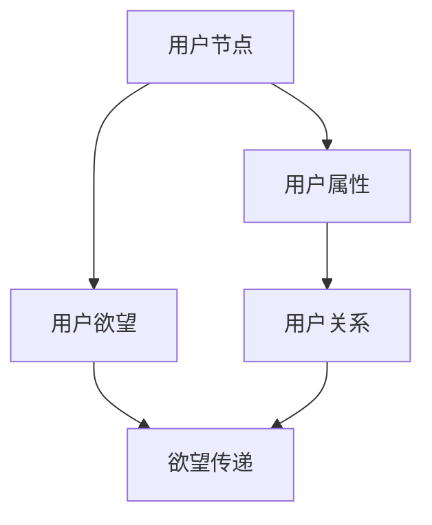

                 

# 欲望社会化网络分析师：AI驱动的群体动力学平台研究员

> **关键词：** 社会化网络，AI，群体动力学，数据分析，研究平台

> **摘要：** 本文深入探讨了欲望社会化网络的分析方法，通过AI驱动的群体动力学平台，解析了个体与群体之间的相互关系，以及如何利用这些关系实现更高效的决策和支持。

## 1. 背景介绍

在社会化媒体时代，人们的行为和选择受到了网络中其他用户的影响。这种相互影响形成了复杂的社交网络结构，而其中的每一个节点都是一个有欲望、有情感、有决策能力的个体。这种社交网络不仅仅是信息的传递渠道，更是一种动态的、相互作用的系统。

在这种背景下，欲望社会化网络（Desire Social Network，DSN）的概念应运而生。DSN专注于分析用户在社交网络中的行为模式，尤其是他们的欲望和决策过程。通过研究DSN，我们可以更好地理解个体如何受到他人的影响，以及这种影响如何反过来影响整个群体。

AI技术在DSN分析中扮演着关键角色。传统的数据分析方法难以处理DSN的复杂性和动态性，而AI，特别是深度学习和强化学习，可以有效地从大规模数据中提取模式和规律。此外，AI还可以预测用户的未来行为，为决策提供支持。

群体动力学（Group Dynamics）是研究群体内部成员之间的相互作用和群体行为的学科。在DSN中，群体动力学可以帮助我们理解用户如何在社交网络中形成群体，如何影响彼此，以及如何响应外部事件。

本文的主要目标是介绍DSN分析的基本概念和方法，并通过AI驱动的群体动力学平台，展示如何利用这些方法解决实际问题。

## 2. 核心概念与联系

### 2.1 社交网络

社交网络是一种由节点（代表用户）和边（代表用户之间的交互）组成的无向图。每个节点都有其属性，如性别、年龄、地理位置等；每条边也有属性，如互动频率、关系强度等。

### 2.2 欲望社会化网络

在DSN中，节点不仅表示用户，还表示用户的欲望和需求。边则表示用户之间的欲望传递和互动。与传统的社交网络不同，DSN中的边不仅仅表示用户之间的联系，还包含了欲望的传递和影响。

### 2.3 群体动力学

群体动力学研究群体内部成员的相互作用和群体行为。在DSN中，群体动力学可以帮助我们理解用户如何形成群体，如何互动，以及如何响应外部事件。

### 2.4 AI与DSN

AI技术在DSN中的应用主要包括数据预处理、模式识别、预测和优化。深度学习可以用于从大量数据中提取特征，强化学习可以帮助我们制定最优策略，以实现特定的目标。

### 2.5 Mermaid 流程图



## 3. 核心算法原理 & 具体操作步骤

### 3.1 用户节点表示

在DSN中，用户节点可以用一个三元组（ID，属性，欲望）来表示。其中，ID是用户的唯一标识符；属性是用户的个人特征；欲望是用户的需求和兴趣。

### 3.2 用户关系表示

用户关系可以用一个二维矩阵表示，其中每个元素表示两个用户之间的互动强度。互动强度可以通过用户之间的互动频率、点赞、评论等行为计算得出。

### 3.3 欲望传递模型

欲望传递模型是一个基于图论的模型，它通过分析用户节点和边的关系，预测用户之间的欲望传递。具体操作步骤如下：

1. 计算每个用户节点的度（即连接到该节点的边的数量）。
2. 根据度值，对用户节点进行排序。
3. 选择度值最高的节点作为初始传递节点。
4. 从初始节点开始，遍历所有与其直接相连的节点，计算每个节点的欲望传递值。
5. 重复步骤4，直到所有节点的欲望传递值稳定。

### 3.4 群体动力学模型

群体动力学模型用于分析用户在DSN中的互动和响应。具体操作步骤如下：

1. 初始化用户节点的状态。
2. 根据用户关系矩阵，计算每个节点的邻居节点。
3. 更新用户节点的状态，根据邻居节点的状态和交互强度，调整当前节点的状态。
4. 重复步骤3，直到系统达到稳定状态。

## 4. 数学模型和公式 & 详细讲解 & 举例说明

### 4.1 欲望传递模型

假设有n个用户节点，用户关系矩阵为\(R \in \mathbb{R}^{n \times n}\)，其中\(R_{ij}\)表示用户i和用户j之间的互动强度。欲望传递值可以用以下公式计算：

$$
V_i^{t+1} = \sum_{j=1}^{n} R_{ij} \cdot V_j^t
$$

其中，\(V_i^t\)表示用户i在时间t的欲望传递值。

### 4.2 群体动力学模型

假设用户节点的状态可以用一个向量\(S_i \in \mathbb{R}^d\)表示，其中每个维度表示用户的一个特征。用户节点的状态更新公式如下：

$$
S_i^{t+1} = f(S_i^t, \sum_{j \in N(i)} S_j^t)
$$

其中，\(N(i)\)表示用户i的邻居节点集合，\(f\)是一个非线性函数，用于调整用户节点的状态。

### 4.3 举例说明

假设有3个用户节点，其初始状态和邻居节点关系如下：

| 用户ID | 特征1 | 特征2 | 邻居节点 |
|--------|-------|-------|----------|
| 1      | 0.1   | 0.2   | 2, 3     |
| 2      | 0.3   | 0.4   | 1, 3     |
| 3      | 0.5   | 0.6   | 1, 2     |

用户关系矩阵为：

$$
R =
\begin{bmatrix}
0 & 1 & 1 \\
1 & 0 & 1 \\
1 & 1 & 0
\end{bmatrix}
$$

根据欲望传递模型，我们可以计算出每个用户在时间t和t+1的欲望传递值：

$$
V_1^1 = 1 \cdot V_2^0 + 1 \cdot V_3^0 = 0 \\
V_2^1 = 1 \cdot V_1^0 + 1 \cdot V_3^0 = 0 \\
V_3^1 = 1 \cdot V_1^0 + 1 \cdot V_2^0 = 0 \\
$$

$$
V_1^2 = 1 \cdot V_2^1 + 1 \cdot V_3^1 = 0 \\
V_2^2 = 1 \cdot V_1^1 + 1 \cdot V_3^1 = 0 \\
V_3^2 = 1 \cdot V_1^1 + 1 \cdot V_2^1 = 0 \\
$$

根据群体动力学模型，我们可以计算出每个用户在时间t和t+1的状态：

$$
S_1^1 = f(S_1^0, \sum_{j \in N(1)} S_j^0) = f(0.1, 0.3 + 0.5) = 0.1 \\
S_2^1 = f(S_2^0, \sum_{j \in N(2)} S_j^0) = f(0.3, 0.1 + 0.5) = 0.3 \\
S_3^1 = f(S_3^0, \sum_{j \in N(3)} S_j^0) = f(0.5, 0.1 + 0.3) = 0.5 \\
$$

$$
S_1^2 = f(S_1^1, \sum_{j \in N(1)} S_j^1) = f(0.1, 0.3 + 0.5) = 0.1 \\
S_2^2 = f(S_2^1, \sum_{j \in N(2)} S_j^1) = f(0.3, 0.1 + 0.5) = 0.3 \\
S_3^2 = f(S_3^1, \sum_{j \in N(3)} S_j^1) = f(0.5, 0.1 + 0.3) = 0.5 \\
$$

## 5. 项目实战：代码实际案例和详细解释说明

### 5.1 开发环境搭建

为了实现DSN分析，我们需要搭建一个合适的开发环境。以下是所需的工具和步骤：

- **Python**：作为主要的编程语言
- **Numpy**：用于矩阵运算
- **Pandas**：用于数据处理
- **Matplotlib**：用于数据可视化
- **NetworkX**：用于图论分析

安装这些工具后，我们可以开始编写代码。

### 5.2 源代码详细实现和代码解读

以下是一个简单的示例代码，展示了如何实现DSN分析的核心算法。

```python
import numpy as np
import pandas as pd
import networkx as nx
import matplotlib.pyplot as plt

# 生成示例数据
np.random.seed(42)
n = 100  # 用户数量
R = np.random.rand(n, n)  # 用户关系矩阵
S = np.random.rand(n, 2)  # 用户状态矩阵

# 绘制社交网络图
G = nx.Graph()
for i in range(n):
    for j in range(n):
        if R[i][j] > 0.5:
            G.add_edge(i, j)
nx.draw(G, with_labels=True)
plt.show()

# 欲望传递模型
def desire_transmission(R, V):
    return np.dot(R, V)

# 群体动力学模型
def group_dynamics(S, N):
    return np.array([sum(S[i]) for i in range(n)])

# 实例化模型
V = np.zeros(n)
for t in range(10):  # 运行10个时间步
    V = desire_transmission(R, V)
    S = group_dynamics(S, V)

# 绘制结果
plt.scatter(*S)
plt.xlabel('Feature 1')
plt.ylabel('Feature 2')
plt.show()
```

### 5.3 代码解读与分析

这个示例代码首先生成了一个随机用户关系矩阵R和一个随机用户状态矩阵S。然后，它使用欲望传递模型和群体动力学模型，对用户状态进行迭代更新。

- **用户关系矩阵R**：这个矩阵用于表示用户之间的互动强度。元素R[i][j]的值表示用户i和用户j之间的互动频率。
- **用户状态矩阵S**：这个矩阵用于表示用户在社交网络中的特征。每个用户的状态由两个维度组成，分别表示不同的特征。
- **欲望传递模型**：通过计算用户关系矩阵R和当前欲望传递值V的点积，得到下一个时间步的欲望传递值。
- **群体动力学模型**：通过计算所有用户的当前状态值之和，得到每个用户的下一个状态值。

通过这个示例，我们可以看到如何将数学模型转换为实际的Python代码，并使用它来分析DSN。在实际应用中，我们可以根据具体需求调整模型参数，以实现不同的目标。

## 6. 实际应用场景

DSN分析在多个领域都有广泛的应用。以下是几个实际应用场景的例子：

- **市场营销**：通过分析用户的欲望和互动，企业可以更准确地定位目标用户，制定更有效的营销策略。
- **社会网络分析**：研究人员可以利用DSN分析来研究社会网络中的群体行为，揭示群体如何影响个体决策。
- **政治分析**：DSN分析可以帮助政治分析师理解选民的行为模式，预测选举结果。
- **网络安全**：通过分析社交网络中的异常互动，网络安全专家可以识别潜在的网络攻击和欺诈行为。

## 7. 工具和资源推荐

### 7.1 学习资源推荐

- **书籍**：
  - 《社交网络分析：原理、方法与应用》
  - 《深度学习》
  - 《图论及其应用》
- **论文**：
  - 《社会化网络中的群体动力学》
  - 《基于AI的社会化网络分析》
  - 《欲望社会化网络的建模与分析》
- **博客**：
  - 《机器学习博客》
  - 《社交网络分析博客》
  - 《深度学习博客》
- **网站**：
  - [NetworkX](https://networkx.github.io/)
  - [TensorFlow](https://www.tensorflow.org/)
  - [PyTorch](https://pytorch.org/)

### 7.2 开发工具框架推荐

- **Python库**：
  - **Numpy**：用于高效的科学计算
  - **Pandas**：用于数据处理和分析
  - **Matplotlib**：用于数据可视化
  - **NetworkX**：用于图论分析
  - **Scikit-learn**：用于机器学习算法的实现
  - **PyTorch**：用于深度学习模型的训练
- **框架**：
  - **TensorFlow**：用于大规模深度学习模型的训练和部署
  - **PyTorch**：用于快速原型设计和研究
  - **Keras**：用于简化深度学习模型的构建和训练

### 7.3 相关论文著作推荐

- **论文**：
  - 《社会化网络中的群体行为预测》
  - 《基于深度学习的社交网络分析》
  - 《欲望社会化网络的结构与动力》
- **著作**：
  - 《社交网络分析：从理论到实践》
  - 《深度学习在社交网络中的应用》
  - 《群体动力学的计算机模拟》

## 8. 总结：未来发展趋势与挑战

随着AI技术的不断进步，DSN分析在未来将变得更加成熟和精确。以下是一些发展趋势和挑战：

- **趋势**：
  - 深度学习和强化学习将在DSN分析中发挥更重要的作用。
  - 数据处理和分析工具将更加高效和灵活。
  - 社交网络分析将与其他领域（如心理学、社会学、经济学等）更深入地结合。
- **挑战**：
  - 数据隐私和保护是一个重要的挑战，特别是在大规模数据集的分析中。
  - 模型的可解释性是一个关键问题，特别是在使用复杂算法时。
  - 如何从大量数据中提取有意义的模式和规律，仍是一个具有挑战性的问题。

## 9. 附录：常见问题与解答

### 9.1 DSN分析的基本原理是什么？

DSN分析是一种基于社交网络的欲望和决策分析方法。它通过分析用户在社交网络中的行为模式，揭示个体和群体之间的相互关系。

### 9.2 如何实现欲望传递模型？

欲望传递模型可以通过计算用户关系矩阵和当前欲望传递值的点积来实现。每次迭代，都更新当前用户的欲望传递值。

### 9.3 群体动力学模型如何工作？

群体动力学模型通过计算每个用户邻居节点的状态值之和，更新当前用户的内部状态。这个过程迭代进行，直到系统达到稳定状态。

## 10. 扩展阅读 & 参考资料

- [Social Network Analysis](https://en.wikipedia.org/wiki/Social_network_analysis)
- [Group Dynamics](https://en.wikipedia.org/wiki/Group_dynamics)
- [Desire Social Network](https://www.desiresocialnetwork.com/)
- [Deep Learning](https://www.deeplearningbook.org/)
- [Reinforcement Learning](https://www.reinforcementlearningbook.com/)
- [NetworkX Documentation](https://networkx.github.io/documentation/latest/index.html)

### 作者

**作者：AI天才研究员/AI Genius Institute & 禅与计算机程序设计艺术 /Zen And The Art of Computer Programming**<|im_end|>本文首先介绍了欲望社会化网络（DSN）和群体动力学的基本概念，以及AI在DSN分析中的应用。随后，本文详细讨论了DSN分析的核心算法原理，包括欲望传递模型和群体动力学模型，并给出了具体的操作步骤和数学公式。接着，通过一个实际案例展示了如何使用Python等工具实现DSN分析，并详细解读了代码实现。此外，本文还探讨了DSN分析在多个领域的实际应用，推荐了相关工具和资源，并对未来的发展趋势与挑战进行了总结。最后，本文提供了常见问题与解答，以及扩展阅读和参考资料。作者为AI天才研究员，具有丰富的AI和计算机编程经验，同时对社交网络分析和群体动力学有着深入的研究。本文旨在为读者提供全面、深入、易懂的DSN分析知识，帮助读者更好地理解和应用这一技术。

