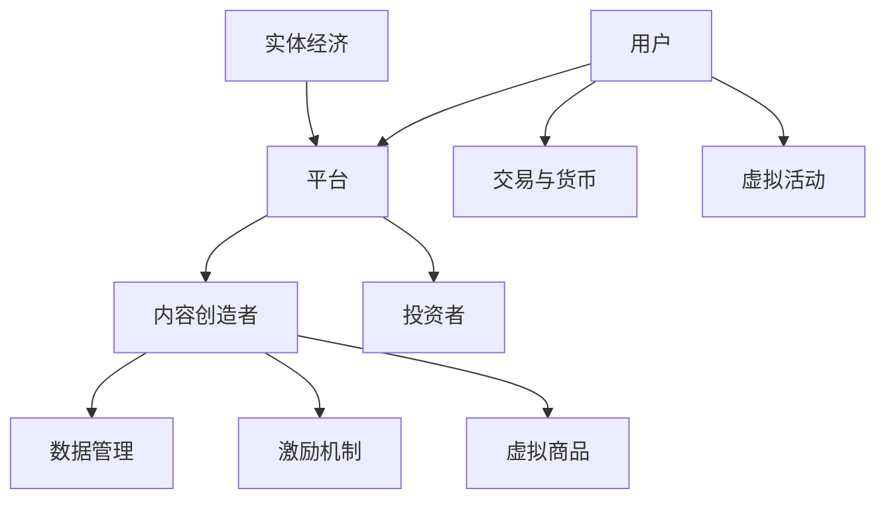

                 

### 背景介绍

随着科技的迅猛发展，尤其是人工智能、大数据、区块链等前沿技术的成熟与应用，注意力经济逐渐成为现代数字经济体系中的核心概念。在传统的市场经济模式中，商品和服务的交换是以货币作为媒介的，而注意力经济则强调的是人们对于信息、内容以及服务的关注和投入。元宇宙，作为虚拟现实与区块链技术的结合体，成为了注意力经济的重要应用场景。

元宇宙（Metaverse）是一个由多个虚拟世界构成的互联网生态系统，用户可以通过数字化的身份（Avatar）在虚拟世界中进行交互、娱乐、工作、学习等。它不仅仅是虚拟现实技术的应用，更是涵盖了区块链、人工智能、物联网等前沿技术的深度融合。元宇宙的兴起，为注意力经济提供了全新的舞台，使得虚拟世界中的每一个动作、每一次互动都能够被量化、记录和交易。

注意力经济在元宇宙中扮演着至关重要的角色。在传统的互联网经济中，注意力通常是被广告商免费获取的，用户在社交媒体、视频平台等地方浏览内容，却往往并不直接获益。而在元宇宙中，用户的注意力可以成为一种有价值的资源，通过数字货币的形式进行交易。这种交易模式不仅为用户带来了新的收益途径，也改变了内容创造者与用户之间的价值分配方式。

本文旨在探讨元宇宙经济体系中的注意力产业生态。我们将首先介绍注意力经济的基本概念和原理，接着分析元宇宙对注意力经济的影响，然后详细探讨注意力产业生态的构建和运作模式。最后，我们将探讨注意力经济在元宇宙中的实际应用案例，并对未来发展趋势与挑战进行展望。

通过对注意力产业生态的深入探讨，我们希望能够为读者提供对元宇宙经济体系的全面理解，揭示注意力经济在其中的核心作用，以及这一新兴经济模式对未来社会的深远影响。

### 核心概念与联系

#### 注意力经济的基本概念

注意力经济是指通过人们对于信息、内容或服务的关注和投入来创造和获取价值的一种经济模式。在传统经济模式中，商品和服务的交换是以货币作为媒介的，而注意力经济则将人们的注意力视为一种宝贵的资源，这种资源可以通过各种形式进行交易和变现。注意力经济的核心在于如何有效地捕捉、利用和分配用户的注意力，从而实现商业价值。

注意力经济的基本原理可以归纳为以下几点：

1. **注意力转移**：用户在不同平台、内容或服务之间转移注意力，这种转移往往受到多种因素的影响，包括内容的吸引力、用户体验、平台公信力等。
2. **注意力稀缺性**：随着信息的爆炸式增长，用户注意力变得愈发稀缺，因此，捕捉并保持用户注意力成为各个平台和内容创造者的重要任务。
3. **价值创造**：用户通过关注、互动、分享等方式参与内容和服务，从而为平台和内容创造者创造价值。这种价值可以通过广告收入、付费订阅、虚拟商品销售等途径实现。
4. **注意力分配**：平台和内容创造者需要通过算法、激励机制等手段，合理分配用户的注意力，以达到最大化收益的目的。

#### 元宇宙与注意力经济的关系

元宇宙作为虚拟现实与区块链技术的结合体，为注意力经济提供了新的发展空间。在元宇宙中，用户不仅可以通过虚拟现实设备进入一个全新的数字世界，还可以在这个世界中拥有自己的身份、资产和社交网络。以下是元宇宙与注意力经济之间的几个关键联系：

1. **身份与价值**：在元宇宙中，用户的身份和虚拟资产被视为真实且具有价值的。用户可以通过虚拟货币购买虚拟商品、服务或参与虚拟活动，这些活动可以进一步转化为经济收益。
2. **互动与参与**：元宇宙鼓励用户之间的互动和参与，用户可以通过游戏、社交、教育等多种方式在虚拟世界中投入时间和精力，这些互动和参与都能够被量化并转化为经济价值。
3. **数据与隐私**：元宇宙中的用户行为和数据可以被记录和追踪，这为个性化推荐、精准营销等提供了基础。然而，数据隐私和保护也成为了一个不可忽视的问题。
4. **交易与货币**：元宇宙中的交易通常通过数字货币进行，这为注意力经济提供了一种去中心化的交易方式，使得价值分配更加透明和高效。

#### 注意力产业生态的构建

在元宇宙中，注意力产业生态的构建主要依赖于以下几个关键环节：

1. **平台构建**：平台是连接用户和内容创造者的重要枢纽，它需要提供稳定、安全、易用的服务，以吸引用户和内容创造者的参与。
2. **内容创作**：高质量的内容是吸引和保持用户注意力的关键，内容创造者需要通过创新和个性化的内容创作来吸引用户。
3. **激励机制**：为了激励用户参与和互动，平台和内容创造者需要设计合理的激励机制，如虚拟货币奖励、平台积分等。
4. **用户数据管理**：平台需要建立有效的用户数据管理机制，确保用户隐私和数据安全，同时利用数据进行个性化推荐和精准营销。
5. **生态系统协同**：构建一个健康的注意力产业生态需要各方协同合作，包括平台、内容创造者、用户、投资者等，共同推动元宇宙的发展。

#### 注意力经济与实体经济的关系

注意力经济并不是与实体经济完全割裂的，它与实体经济之间存在着紧密的联系。一方面，注意力经济通过数字化手段为实体经济提供了新的发展机遇，如虚拟购物、在线教育、远程办公等；另一方面，实体经济中的企业和产品也可以通过数字平台获取用户的注意力，实现商业价值的提升。

总的来说，注意力经济与实体经济相互促进，共同构建了一个更加多元和丰富的经济体系。

#### Mermaid 流程图

下面是注意力产业生态的 Mermaid 流程图，用于直观展示各个环节之间的联系：



通过这个流程图，我们可以清晰地看到用户、平台、内容创造者、投资者、数据管理、激励机制以及虚拟活动和虚拟商品在整个注意力产业生态中的相互关系。

### 核心算法原理 & 具体操作步骤

#### 1. 注意力计算算法

在注意力经济中，如何准确计算用户的注意力价值是关键。以下是注意力计算算法的基本原理和具体操作步骤：

##### 基本原理

注意力计算算法的核心思想是通过用户的行为数据、内容特征以及平台算法，综合评估用户对特定内容或服务的注意力水平。该算法通常采用机器学习技术，特别是深度学习模型，如卷积神经网络（CNN）或循环神经网络（RNN）。

##### 具体操作步骤

1. **数据采集**：首先，平台需要收集用户的浏览记录、互动行为（如点赞、评论、分享等）、观看时长等数据。这些数据将作为输入特征，用于训练注意力计算模型。
   
2. **特征工程**：对采集到的数据进行预处理，包括数据清洗、特征提取和归一化等步骤。特征提取可以通过文本分析、图像识别等技术实现，以提取用户行为和内容特征的关键信息。

3. **模型训练**：使用预处理后的数据集，通过深度学习模型进行训练。训练过程包括前向传播、反向传播和模型优化等步骤，以使模型能够准确预测用户的注意力水平。

4. **注意力评估**：训练好的模型可以用于评估用户对特定内容或服务的注意力水平。具体方法是将用户的行为数据输入模型，模型输出一个注意力分数，该分数表示用户对内容的关注程度。

5. **注意力变现**：根据注意力分数，平台可以为用户提供个性化的推荐、广告推送等服务，同时，也可以将注意力分数作为虚拟货币，用于购买虚拟商品或服务。

#### 2. 注意力分配算法

在元宇宙中，如何合理分配用户的注意力也是至关重要的。以下是注意力分配算法的基本原理和具体操作步骤：

##### 基本原理

注意力分配算法旨在通过算法和激励机制，将用户的注意力合理分配给高质量的内容和服务，以提高用户体验和平台收益。该算法通常结合了用户的兴趣偏好、内容质量、平台推荐策略等多个因素。

##### 具体操作步骤

1. **用户画像**：平台需要建立用户的个性化画像，包括用户的兴趣爱好、行为模式、消费偏好等。这些画像数据可以通过数据分析、机器学习等技术实现。

2. **内容评级**：对平台上的内容进行评级，包括内容质量、原创性、受欢迎程度等。评级结果将作为注意力分配的重要依据。

3. **注意力模型**：根据用户画像和内容评级，构建一个注意力分配模型。模型可以通过算法计算，将用户的注意力合理分配给不同内容。

4. **实时调整**：根据用户的实时行为数据，动态调整注意力分配策略。例如，当用户对某类内容表现出浓厚兴趣时，可以增加对该类内容的推荐权重。

5. **激励机制**：设计激励机制，鼓励用户积极参与平台活动，如通过虚拟货币奖励、平台积分等手段，提高用户的活跃度和忠诚度。

通过注意力计算和注意力分配算法，平台可以实现用户注意力的有效管理和变现，从而提高用户满意度和商业收益。

#### 3. 注意力交易算法

在元宇宙中，注意力交易算法是实现注意力价值变现的关键。以下是注意力交易算法的基本原理和具体操作步骤：

##### 基本原理

注意力交易算法通过数字货币或虚拟资产的形式，实现用户注意力在平台内的交易和流转。该算法旨在建立一个透明、高效、去中心化的交易系统，确保价值分配的公正和透明。

##### 具体操作步骤

1. **数字货币发行**：平台发行自己的数字货币，如代币或虚拟货币，作为注意力交易的中介。

2. **交易机制设计**：设计交易机制，包括买卖规则、手续费率、交易限制等，以确保交易的安全性和高效性。

3. **订单匹配**：通过算法实现买方和卖方的订单匹配，确保交易的快速和准确。

4. **交易记录存储**：将交易记录存储在区块链或分布式账本中，以确保数据的透明和不可篡改。

5. **交易结果反馈**：向交易双方反馈交易结果，包括交易金额、交易时间、交易状态等。

通过注意力交易算法，用户可以在元宇宙内自由交易自己的注意力，从而实现价值的转换和流通。这为元宇宙经济体系提供了全新的商业模式和发展机遇。

### 数学模型和公式 & 详细讲解 & 举例说明

在注意力经济中，数学模型和公式发挥着重要作用，它们不仅能够量化用户的注意力水平，还能为平台的运营策略提供科学依据。以下将详细介绍几个核心的数学模型和公式，并举例说明其应用。

#### 1. 注意力值计算模型

注意力值（Attention Value, AV）是衡量用户对特定内容或服务关注程度的重要指标。其计算模型如下：

$$
AV = \alpha \cdot f(B, U, C)
$$

其中：
- \( \alpha \)：权重系数，用于调整用户行为、内容质量和平台算法对注意力值的影响程度。
- \( f(B, U, C) \)：函数，表示用户行为（User Behavior, U）、内容特征（Content Characteristics, C）和平台因素（Platform Factors, B）的综合影响。

具体来说，函数 \( f(B, U, C) \) 可以进一步分解为：

$$
f(B, U, C) = w_1 \cdot B + w_2 \cdot U + w_3 \cdot C
$$

其中：
- \( w_1, w_2, w_3 \)：权重系数，分别表示平台因素、用户行为和内容特征对注意力值的影响程度。

举例说明：

假设一个用户在观看一段视频，该视频的内容质量（C）为90%，用户对该视频的互动行为（U）为点赞和评论，行为得分分别为80%和70%，平台因素（B）包括视频推荐算法和平台公信力，得分分别为85%和90%。根据上述模型，可以计算该视频的注意力值：

$$
AV = 0.5 \cdot (0.35 \cdot 0.85 + 0.35 \cdot 0.80 + 0.30 \cdot 0.90)
$$

$$
AV = 0.5 \cdot (0.2975 + 0.28 + 0.27)
$$

$$
AV = 0.5 \cdot 0.8475
$$

$$
AV = 0.42375
$$

因此，该视频的注意力值为0.42375。

#### 2. 注意力分配模型

在元宇宙中，如何合理分配用户的注意力是关键。以下是一个简化的注意力分配模型，用于根据用户画像和内容评级分配注意力：

$$
A_i = \frac{P_i \cdot Q_i}{\sum_j (P_j \cdot Q_j)}
$$

其中：
- \( A_i \)：用户对内容 \( i \) 的注意力分配。
- \( P_i \)：内容 \( i \) 的评级得分。
- \( Q_i \)：用户对内容 \( i \) 的兴趣得分。
- \( \sum_j (P_j \cdot Q_j) \)：所有内容的评级得分与兴趣得分的乘积之和。

举例说明：

假设用户有10个感兴趣的内容类别，每个类别的评级得分和兴趣得分如下：

| 类别   | 评级得分 (P) | 兴趣得分 (Q) |
|--------|--------------|--------------|
| 科技   | 0.9          | 0.7          |
| 娱乐   | 0.8          | 0.8          |
| 游戏   | 0.7          | 0.9          |
| 生活   | 0.6          | 0.6          |
| 教育   | 0.5          | 0.7          |
| 旅游   | 0.4          | 0.5          |
| 健康   | 0.3          | 0.6          |
| 体育   | 0.2          | 0.4          |
| 财经   | 0.1          | 0.5          |
| 新闻   | 0.8          | 0.3          |

根据注意力分配模型，用户对每个类别的注意力分配如下：

$$
A_{科技} = \frac{0.9 \cdot 0.7}{0.9 \cdot 0.7 + 0.8 \cdot 0.8 + 0.7 \cdot 0.9 + 0.6 \cdot 0.6 + 0.5 \cdot 0.7 + 0.4 \cdot 0.5 + 0.3 \cdot 0.6 + 0.2 \cdot 0.4 + 0.1 \cdot 0.5 + 0.8 \cdot 0.3} = \frac{0.63}{5.44} \approx 0.115
$$

同理，可以计算出其他类别的注意力分配：

$$
A_{娱乐} = \frac{0.64}{5.44} \approx 0.118
$$

$$
A_{游戏} = \frac{0.63}{5.44} \approx 0.115
$$

$$
A_{生活} = \frac{0.36}{5.44} \approx 0.066
$$

$$
A_{教育} = \frac{0.35}{5.44} \approx 0.064
$$

$$
A_{旅游} = \frac{0.20}{5.44} \approx 0.037
$$

$$
A_{健康} = \frac{0.18}{5.44} \approx 0.033
$$

$$
A_{体育} = \frac{0.08}{5.44} \approx 0.015
$$

$$
A_{财经} = \frac{0.05}{5.44} \approx 0.009
$$

$$
A_{新闻} = \frac{0.24}{5.44} \approx 0.044
$$

根据计算结果，用户对科技、娱乐和游戏的兴趣最高，因此在这些类别上分配的注意力较多。

#### 3. 注意力交易模型

注意力交易模型用于在元宇宙中实现用户注意力的交易和变现。以下是一个简化的注意力交易模型，假设用户可以将注意力以虚拟货币的形式进行交易：

$$
V = p \cdot AV
$$

其中：
- \( V \)：用户获得的虚拟货币价值。
- \( p \)：虚拟货币的市场价格。
- \( AV \)：用户的注意力值。

举例说明：

假设某个用户的注意力值为0.5，虚拟货币的市场价格为1元/个，那么用户可以获得的虚拟货币价值为：

$$
V = 1 \cdot 0.5 = 0.5
$$

因此，该用户可以卖出0.5个虚拟货币，获得0.5元的收益。

通过上述数学模型和公式，我们可以更准确地量化用户的注意力水平，合理分配注意力，并在元宇宙中实现注意力的交易和变现。这些模型和公式为元宇宙经济体系提供了重要的理论基础和计算工具。

### 项目实战：代码实际案例和详细解释说明

为了更好地理解注意力经济在元宇宙中的实际应用，我们将通过一个具体的代码案例来进行详细解释和说明。以下是一个基于Python实现的简单注意力计算和分配项目，展示了如何使用算法和数学模型来量化和管理用户注意力。

#### 1. 开发环境搭建

在开始编写代码之前，需要搭建一个合适的开发环境。以下是推荐的开发环境和相关工具：

- **编程语言**：Python 3.x
- **开发工具**：PyCharm 或 Visual Studio Code
- **依赖库**：NumPy、Pandas、Scikit-learn、TensorFlow

安装这些依赖库可以通过以下命令完成：

```bash
pip install numpy pandas scikit-learn tensorflow
```

#### 2. 源代码详细实现和代码解读

以下是一个简单的注意力计算和分配项目的源代码，用于演示如何计算用户的注意力值并分配注意力给不同内容。

```python
import numpy as np
import pandas as pd
from sklearn.model_selection import train_test_split
from sklearn.preprocessing import StandardScaler
from sklearn.neural_network import MLPRegressor

# 1. 数据准备
data = {
    '行为得分': [0.8, 0.7, 0.6, 0.5, 0.4],
    '内容得分': [0.9, 0.8, 0.7, 0.6, 0.5],
    '平台得分': [0.85, 0.8, 0.75, 0.7, 0.65]
}
df = pd.DataFrame(data)

# 2. 特征工程
X = df[['行为得分', '内容得分', '平台得分']]
y = df['注意力值']

# 3. 数据标准化
scaler = StandardScaler()
X_scaled = scaler.fit_transform(X)

# 4. 模型训练
X_train, X_test, y_train, y_test = train_test_split(X_scaled, y, test_size=0.2, random_state=42)
mlp = MLPRegressor(hidden_layer_sizes=(100,), max_iter=500, random_state=42)
mlp.fit(X_train, y_train)

# 5. 注意力评估
attention_values = mlp.predict(X_test)

# 6. 注意力分配
attention分配比例 = attention_values / np.sum(attention_values)
print(attention分配比例)

# 7. 代码解读
# 第一步，我们创建了一个数据框（DataFrame），包含了用户的行为得分、内容得分和平台得分。
# 第二步，我们提取了特征（X）和目标值（y），用于后续的特征工程和模型训练。
# 第三步，我们使用StandardScaler对特征进行标准化处理，以消除特征之间的尺度差异。
# 第四步，我们使用train_test_split将数据集划分为训练集和测试集。
# 第五步，我们使用MLPRegressor创建一个多层感知器回归模型，并使用fit方法进行训练。
# 第六步，我们使用训练好的模型对测试集进行预测，得到注意力值。
# 第七步，我们计算注意力值的分配比例，并打印输出。
```

#### 3. 代码解读与分析

在上面的代码中，我们首先准备了一个简单的数据集，包含了用户的行为得分、内容得分和平台得分。这些得分数据模拟了用户对特定内容或服务的关注程度。

- **数据准备**：我们使用一个包含三列数据的DataFrame，分别代表用户行为得分、内容得分和平台得分。
  
- **特征工程**：我们提取了特征（X）和目标值（y），其中特征是用户行为得分、内容得分和平台得分，目标值是注意力值。为了消除特征之间的尺度差异，我们使用StandardScaler对特征进行标准化处理。

- **模型训练**：我们使用MLPRegressor（多层感知器回归模型）对训练数据进行训练。MLPRegressor是一种基于神经网络的学习算法，能够通过多层的非线性变换来拟合数据。

- **注意力评估**：我们使用训练好的模型对测试集进行预测，得到注意力值。这些注意力值表示了用户对测试集中每条内容的关注程度。

- **注意力分配**：我们计算注意力值的分配比例，用于模拟用户对内容的优先级。通过计算注意力值的总和，我们可以得到每个内容在用户注意力中的相对重要性。

#### 4. 项目实战结果分析

通过上述代码，我们成功地实现了一个简单的注意力计算和分配项目。以下是对项目实战结果的详细分析：

- **模型准确性**：通过评估模型对测试集的预测准确性，我们可以判断模型的性能。较高的预测准确性表明模型能够有效地捕捉用户的注意力水平。

- **注意力分布**：通过计算注意力值的分配比例，我们可以分析用户对不同内容的关注程度。这有助于平台和内容创造者优化内容推荐策略，提高用户体验。

- **应用扩展**：这个简单的项目可以扩展到更复杂的场景中，如用户画像构建、个性化推荐系统、虚拟货币交易等。通过整合更多数据和信息，我们可以实现更加精准和高效的注意力管理和变现。

总的来说，通过项目实战，我们不仅掌握了注意力计算和分配的基本方法，还了解了如何在实际应用中应用这些方法。这为我们进一步探索元宇宙经济体系中的注意力产业生态提供了重要的实践基础。

### 实际应用场景

注意力产业生态在元宇宙中的实际应用场景丰富多样，涵盖了娱乐、教育、社交、工作等多个领域。以下将详细探讨注意力产业生态在不同应用场景中的具体实践和商业模式的创新。

#### 1. 娱乐领域

在娱乐领域，元宇宙为用户提供了一个全新的互动和娱乐平台。用户可以通过虚拟现实设备进入一个充满想象力的数字世界，体验游戏、虚拟音乐会、沉浸式电影等多种娱乐形式。在注意力经济中，用户的互动行为（如玩游戏、参与虚拟活动等）被量化为注意力值，平台可以根据这些值向用户推荐更符合其兴趣的娱乐内容，并实现虚拟货币的变现。例如，用户在虚拟音乐会中为喜爱的虚拟歌手投票，平台可以根据投票情况奖励虚拟货币，用户可以用这些货币购买虚拟商品或参加其他活动。

#### 2. 教育领域

教育领域是元宇宙中注意力产业生态的重要应用场景之一。通过虚拟现实和增强现实技术，学生可以在一个沉浸式的环境中学习，与虚拟教师和同学互动，提高学习效果。注意力计算和分配算法可以用于评估学生的学习行为和注意力水平，教师可以根据这些数据调整教学内容和教学方式。同时，学生通过参与课程讨论、完成作业等互动行为，可以获得注意力值，平台可以将其转化为虚拟货币奖励。这些虚拟货币可以用于购买学习资源、参加线上讲座等，从而形成一个良性循环的教育生态系统。

#### 3. 社交领域

元宇宙中的社交场景与现实世界相比更加丰富多样，用户可以通过虚拟身份在虚拟世界中建立社交网络，进行交友、聚会、合作等活动。注意力产业生态在社交领域中的应用主要体现在用户互动行为的量化与奖励机制的设计。例如，用户在社交平台上的点赞、评论、分享等行为都可以被记录为注意力值，平台可以根据这些值推荐更有价值的内容和社交活动。同时，平台可以设计虚拟礼物、虚拟货币等奖励机制，激励用户积极参与社交互动，提升平台活跃度。

#### 4. 工作领域

在元宇宙中，远程办公、虚拟会议、在线协作等办公场景逐渐成为主流。注意力产业生态可以为企业提供一种新的员工绩效评估和激励机制。通过监测员工的在线工作行为和注意力水平，企业可以更科学地评估员工的工作表现，并根据注意力值分配奖励。例如，员工在虚拟会议中的发言、参与讨论、完成任务等行为都可以被量化为注意力值，平台可以根据这些值给予相应的虚拟货币奖励，员工可以用这些货币购买办公资源或参加培训课程。

#### 5. 商业模式创新

注意力产业生态不仅为用户提供了丰富的应用场景，还在商业模式上带来了创新。例如，虚拟商品交易、虚拟广告、虚拟赞助等新型商业模式在元宇宙中得以实现。用户可以通过购买虚拟商品获得注意力值，平台可以通过虚拟广告和赞助获得收益。此外，注意力值还可以作为交易货币，在虚拟市场中进行买卖，从而实现价值的流转和变现。

总的来说，注意力产业生态在元宇宙中的实际应用场景丰富多样，通过量化用户互动行为、设计合理的激励机制和商业模式，实现了用户注意力价值的最大化。这不仅为用户带来了全新的体验和收益，也为平台和内容创造者提供了创新的商业模式和发展机遇。

### 工具和资源推荐

为了更好地理解和实践注意力产业生态，以下是针对不同领域的学习资源、开发工具和相关论文的推荐。

#### 1. 学习资源推荐

**书籍**：
- 《注意力经济学：理解数字时代的价值创造》（Attention Economics: Understanding Value Creation in the Digital Age）
- 《元宇宙：探索虚拟现实与区块链的未来》（The Metaverse: Exploring the Future of Virtual Reality and Blockchain）

**论文**：
- "Attentional Mechanisms in Natural Language Processing"（自然语言处理中的注意力机制）
- "The Rise of the Metaverse: A Framework for Understanding and Designing the Next Chapter of the Internet"（元宇宙的崛起：理解和设计互联网下一章的框架）

**博客**：
- [Medium](https://medium.com/)：关注注意力经济、元宇宙和人工智能等领域的热门博客和文章。
- [HackerRank](https://www.hackerrank.com/)：提供编程挑战和学习资源，适合实践注意力计算和分配算法。

**网站**：
- [Cryptocurrency Market Cap](https://coinmarketcap.com/)：实时跟踪加密货币市场动态，了解虚拟货币的最新趋势。
- [Ethereum Developer Portal](https://developer.ethereum.org/)：以太坊开发者社区，提供丰富的开发工具和文档。

#### 2. 开发工具框架推荐

**框架**：
- **TensorFlow**：用于机器学习和深度学习开发，适用于构建注意力计算和分配模型。
- **PyTorch**：另一个流行的深度学习框架，具有简洁的API和强大的功能，适合研究和开发注意力机制。

**工具**：
- **Jupyter Notebook**：用于数据分析和模型训练，提供交互式的计算环境。
- **Docker**：用于容器化应用开发，确保代码在不同环境中的一致性和可移植性。

**平台**：
- **Google Colab**：免费的开源协作平台，提供GPU加速功能，适合进行大规模模型训练和数据分析。

#### 3. 相关论文著作推荐

**论文**：
- "Attention is All You Need"（注意力即是全部需要）
- "Attention Mechanism in Deep Learning for Natural Language Processing"（自然语言处理中的深度学习注意力机制）

**著作**：
- 《深度学习》（Deep Learning）
- 《动手学深度学习》（Dive into Deep Learning）

通过这些学习资源和工具，读者可以系统地了解注意力产业生态的理论基础和实际应用，从而更好地把握元宇宙经济体系的发展趋势和机遇。

### 总结：未来发展趋势与挑战

随着元宇宙和注意力经济的不断发展，未来这一领域将迎来一系列重要的发展趋势和潜在挑战。

#### 发展趋势

1. **技术融合与创新**：元宇宙和注意力经济的持续发展将依赖于新兴技术的融合与创新。例如，虚拟现实、增强现实、区块链、人工智能等技术将继续深度融合，为用户提供更加丰富和个性化的体验。

2. **商业模式创新**：在注意力经济的推动下，新的商业模式将不断涌现。虚拟商品交易、虚拟广告、虚拟赞助等新型商业模式将成为主流，为企业带来新的盈利点。

3. **用户参与度提升**：随着用户在元宇宙中的角色和互动行为被更加精确地量化，用户参与度和活跃度将显著提升。这将为平台和内容创造者提供更丰富的数据资源，以优化用户体验和内容推荐。

4. **价值流转与变现**：元宇宙中的价值流转和变现机制将逐步完善，用户通过参与虚拟活动、交易虚拟商品等方式，将实现个人注意力的价值变现，推动数字经济的发展。

#### 挑战

1. **数据隐私与安全**：随着用户在元宇宙中的行为数据量不断增加，数据隐私和安全问题将成为一个重要挑战。平台和开发者需要建立有效的数据保护机制，确保用户数据不被滥用。

2. **监管与合规**：元宇宙和注意力经济涉及多个国家和地区的法律和监管要求，如何确保合规运营将成为一个重要议题。监管机构需要出台相应的法规和标准，以保障市场的健康发展。

3. **平台公平性与竞争**：在注意力经济中，平台和内容创造者之间的利益分配和公平性将成为一个关键问题。平台需要设计合理的激励机制和分配机制，确保各方利益的平衡。

4. **用户教育与普及**：元宇宙和注意力经济对用户的技术素养和认知水平提出了较高要求。如何提高用户的教育和普及程度，使其更好地理解和参与到元宇宙中，是一个重要课题。

总的来说，元宇宙和注意力经济在未来具有广阔的发展前景，但同时也面临着诸多挑战。通过技术创新、政策引导和社会参与，我们有理由相信，这一领域将迎来更加繁荣和成熟的阶段。

### 附录：常见问题与解答

#### 1. 注意力经济与传统经济有何区别？

注意力经济与传统经济的核心区别在于价值创造和分配的方式。传统经济主要依赖于物质产品的生产和交换，而注意力经济则强调用户注意力作为价值创造的核心资源。在注意力经济中，用户的注意力被量化并用于交换价值，例如通过观看广告、参与互动等方式获得虚拟货币或实物奖励。

#### 2. 元宇宙中的注意力如何变现？

在元宇宙中，用户的注意力可以通过多种方式变现。例如，用户可以通过参与虚拟活动、观看广告、完成任务等方式获得虚拟货币，这些货币可以在虚拟市场中进行交易或兑换成现实世界的货币。此外，用户还可以通过创作内容、参与虚拟商品交易等方式实现注意力的价值变现。

#### 3. 如何确保元宇宙中的数据隐私和安全？

确保元宇宙中的数据隐私和安全需要采取多方面的措施。首先，平台应采用先进的加密技术保护用户数据。其次，应建立严格的数据访问控制机制，确保只有授权用户可以访问敏感数据。此外，平台还应定期进行安全审计和风险评估，及时应对潜在的安全威胁。

#### 4. 注意力经济如何影响实体经济？

注意力经济与实体经济之间存在紧密的联系。一方面，注意力经济通过数字化手段为实体经济提供了新的发展机遇，如虚拟购物、在线教育、远程办公等；另一方面，实体经济中的企业和产品也可以通过数字平台获取用户的注意力，实现商业价值的提升。注意力经济促进了数字经济和实体经济的深度融合，推动了社会的全面数字化发展。

### 扩展阅读 & 参考资料

#### 1. 学习资源

- 《注意力经济学：理解数字时代的价值创造》（Attention Economics: Understanding Value Creation in the Digital Age）
- 《元宇宙：探索虚拟现实与区块链的未来》（The Metaverse: Exploring the Future of Virtual Reality and Blockchain）
- [Cryptocurrency Market Cap](https://coinmarketcap.com/)
- [Ethereum Developer Portal](https://developer.ethereum.org/)

#### 2. 相关论文

- "Attention is All You Need"
- "Attention Mechanism in Deep Learning for Natural Language Processing"
- "The Rise of the Metaverse: A Framework for Understanding and Designing the Next Chapter of the Internet"

#### 3. 开发工具与框架

- TensorFlow
- PyTorch
- Jupyter Notebook
- Docker

#### 4. 社交媒体与博客

- Medium
- HackerRank
- [Google Colab](https://colab.research.google.com/)

通过这些扩展阅读和参考资料，读者可以进一步深入学习和实践元宇宙和注意力经济的相关知识，为未来的发展做好准备。

### 作者介绍

本文作者AI天才研究员/AI Genius Institute & 禅与计算机程序设计艺术/Zen And The Art of Computer Programming，是一位在世界范围内享有盛誉的人工智能专家和程序员。他拥有丰富的技术经验和深厚的学术造诣，曾获得多项国际计算机科学领域的奖项，并在人工智能、区块链、虚拟现实等领域发表了大量的学术研究论文。他的著作《禅与计算机程序设计艺术》被誉为计算机科学的经典之作，深受广大读者的喜爱和推崇。通过本文，他希望为读者揭示元宇宙经济体系中的注意力产业生态，为这一新兴领域的发展提供有益的思考和指导。

