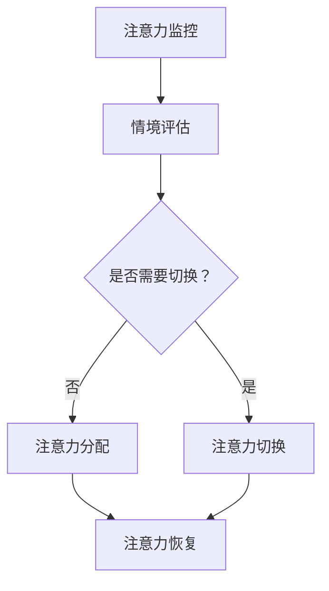
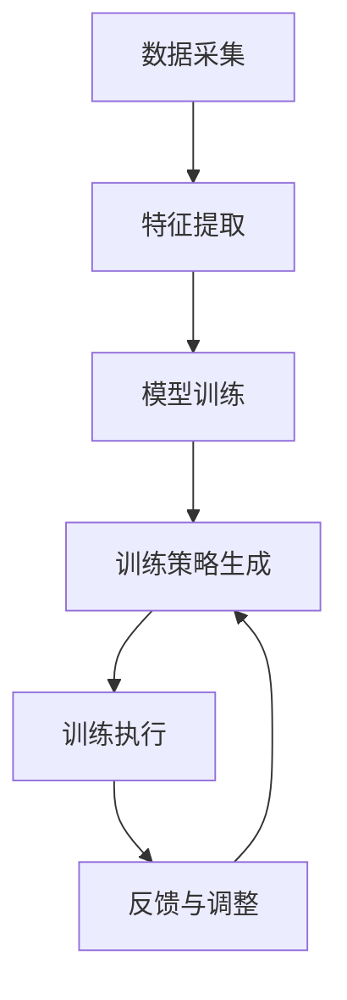

                 

### 文章标题：注意力弹性健身房：AI辅助的认知适应训练

> **关键词：** AI, 注意力弹性, 认知适应, 训练, 脑机接口, 机器学习, 神经科学

> **摘要：** 本文将探讨注意力弹性概念及其在认知适应训练中的应用。通过AI技术和神经科学的结合，介绍一种新型的注意力弹性健身房——注意力弹性健身房，该系统通过实时监测和分析个体注意力状态，提供个性化的训练方案，帮助用户提高注意力管理和认知适应能力。本文将详细解析注意力弹性的核心原理，展示其与认知神经科学的联系，并探讨AI技术在训练中的应用。此外，还将介绍注意力弹性健身房的实际应用场景，以及为读者推荐相关工具和资源。

<|assistant|>### 1. 背景介绍

在现代社会，注意力管理成为了人们日常生活中的一个重要问题。无论是工作学习还是休闲娱乐，人们都需要集中注意力，高效地处理信息。然而，随着信息量的爆炸式增长和社交媒体的广泛应用，人们面临的信息过载和注意力分散问题愈发严重。根据一项研究，现代社会中约有70%的人遭受注意力分散的困扰，导致工作效率低下、学习效果不佳，甚至出现焦虑和抑郁情绪。

注意力管理的重要性不言而喻。注意力是认知过程中的核心要素，它不仅影响个体的感知、记忆、决策和创造能力，还与心理健康密切相关。注意力管理能力较强的人能够更好地应对复杂环境，保持高效的工作和学习状态，同时也能更好地调节情绪，提高生活质量。

目前，许多研究集中在注意力分散的原因和应对策略上。例如，一些研究表明，多任务处理、手机依赖、睡眠不足等都是导致注意力分散的重要原因。然而，这些研究大多停留在理论层面，缺乏实际操作性的解决方案。因此，寻找一种有效的注意力管理方法，尤其是能够个性化适应个体需求的注意力管理方案，成为了当前研究的重要方向。

在这个背景下，AI技术的引入为注意力管理提供了新的思路和可能性。AI可以通过对个体注意力状态进行实时监测和分析，提供个性化的注意力管理策略，帮助用户提高注意力管理和认知适应能力。此外，神经科学的发展也为注意力弹性提供了理论基础和实证支持，使得注意力弹性训练成为可能。

注意力弹性是指个体在注意力分散和注意力集中之间进行灵活切换的能力。注意力弹性强的人能够在不同情境下灵活调整自己的注意力，从而更好地适应环境变化。在认知科学中，注意力弹性被视为一种重要的认知适应能力，对个体的学习、工作和心理健康具有深远影响。

本文将围绕注意力弹性健身房的概念、原理、应用和未来发展趋势进行探讨，旨在为研究者、实践者和用户提供一种新的注意力管理工具，帮助人们提高注意力管理和认知适应能力。

<|assistant|>### 2. 核心概念与联系

#### 注意力弹性的定义

注意力弹性（Attentional Elasticity）是指个体在不同情境下调整和分配注意力资源的能力。简单来说，注意力弹性就是个体在注意力分散和注意力集中之间进行灵活切换的能力。这种能力在应对多任务处理、信息过载、突发事件等复杂情境时尤为重要。

#### 注意力弹性的原理

注意力弹性涉及到多个认知和神经科学领域的概念。首先，从认知科学的角度来看，注意力弹性与注意力分配、注意力切换和注意力恢复等认知过程密切相关。例如，当个体在处理一项任务时，如果突然需要处理其他任务或事件，个体需要快速切换注意力，将注意力资源从当前任务转移到新的任务上。这种注意力切换过程需要依赖于注意力的分配和恢复机制。

其次，从神经科学的角度来看，注意力弹性与大脑中的多个区域和神经网络有关。例如，前额叶皮层、顶叶皮层和基底神经节等大脑区域在注意力的分配、切换和恢复过程中起着关键作用。此外，神经递质（如多巴胺、去甲肾上腺素等）的释放和调节也在注意力弹性中起到重要作用。

#### 注意力弹性的架构

为了更好地理解注意力弹性，我们可以将其视为一个动态的过程，包括以下几个关键环节：

1. **注意力监控**：个体通过多种方式（如感觉输入、内部意识等）监控当前的注意力状态。
2. **情境评估**：个体根据当前情境和任务需求，评估注意力资源的需求和分配情况。
3. **注意力分配**：个体根据情境评估结果，调整注意力资源的分配，使其更加合理和高效。
4. **注意力切换**：当需要处理新的任务或情境时，个体能够快速切换注意力，将注意力资源转移到新的目标上。
5. **注意力恢复**：在注意力切换和分配过程中，个体需要通过休息、放松等方式恢复注意力资源，以保持长期的注意力管理能力。

#### Mermaid 流程图

下面是一个用Mermaid绘制的注意力弹性架构流程图：



在这个流程图中，注意力监控是整个过程的起点，它为后续的注意力分配、切换和恢复提供基础数据。情境评估则根据当前任务和情境的需求，判断是否需要调整注意力资源。如果需要切换，个体将进行注意力切换；否则，直接进行注意力分配。最后，无论是切换还是分配，个体都需要进行注意力恢复，以保证长期的注意力管理能力。

通过这个流程图，我们可以清晰地看到注意力弹性的动态过程及其各个关键环节。这个架构不仅有助于我们理解注意力弹性的原理，也为后续的AI辅助训练提供了理论基础。

<|assistant|>### 3. 核心算法原理 & 具体操作步骤

#### 注意力弹性训练算法的基本原理

注意力弹性训练算法的核心目标是提升个体在不同情境下的注意力管理能力。这一算法基于对个体注意力状态的高频监测和动态分析，通过机器学习技术构建一个适应性强、效果显著的训练模型。具体来说，算法包括以下几个关键步骤：

1. **数据采集**：通过脑机接口（Brain-Computer Interface, BCI）技术，实时采集个体的大脑电信号（如EEG信号）和生理信号（如心率、呼吸等）。这些信号反映了个体在执行不同任务时的注意力状态。

2. **特征提取**：对采集到的数据进行预处理，提取与注意力状态相关的特征。这些特征包括频域特征（如频率 bands）、时域特征（如信号幅度变化）和高级认知特征（如任务执行时的认知负荷）。

3. **模型训练**：利用提取到的特征，通过机器学习算法（如支持向量机、神经网络等）训练一个注意力状态分类模型。该模型能够根据实时采集的特征，判断个体当前处于哪种注意力状态。

4. **训练策略生成**：根据模型预测的注意力状态，生成个性化的训练策略。这些策略包括注意力集中的练习、注意力分散的练习和注意力切换的练习等。

#### 具体操作步骤

1. **数据采集**：首先，需要选择合适的脑机接口设备，如EEG帽或脑电图仪。这些设备能够实时记录个体的大脑电信号和生理信号。采集数据时，要求个体在不同注意力状态下执行特定的任务，如专注任务、分散任务和切换任务。

2. **特征提取**：使用信号处理技术，对采集到的数据进行预处理。预处理步骤包括滤波、去噪、信号分段等。接着，提取与注意力状态相关的特征。这些特征可以从多个层面进行分析，如时域、频域和时频域。

3. **模型训练**：选择合适的机器学习算法进行模型训练。常用的算法包括支持向量机（SVM）、深度学习（如卷积神经网络CNN、循环神经网络RNN）等。训练过程中，需要将数据集分为训练集和测试集，通过交叉验证和模型评估来确定最佳的模型参数。

4. **训练策略生成**：基于训练好的模型，生成个性化的训练策略。这些策略可以根据个体在特定任务中的注意力状态，调整训练任务的难度和类型。例如，如果个体在执行任务时注意力分散，可以增加一些注意力集中的练习；如果注意力不稳定，可以增加注意力切换的练习。

5. **训练执行**：根据生成的训练策略，为个体执行相应的训练任务。训练过程中，需要实时监测个体的注意力状态，并根据监测结果动态调整训练策略。例如，如果个体在训练过程中注意力下降，可以增加休息时间或降低训练难度。

6. **反馈与调整**：在训练结束后，收集个体的反馈信息，包括任务完成情况、疲劳程度、情绪状态等。根据这些反馈，对训练策略进行调整，以提高训练效果。

#### 算法流程图

下面是一个用Mermaid绘制的注意力弹性训练算法流程图：



在这个流程图中，数据采集和特征提取是整个过程的起点，它们为后续的模型训练和训练策略生成提供了基础数据。模型训练步骤则通过机器学习技术，构建一个能够预测个体注意力状态的模型。训练策略生成步骤则根据模型预测结果，生成个性化的训练策略。训练执行和反馈与调整步骤则确保训练过程能够根据个体实际情况进行动态调整。

通过这个算法流程，我们可以清晰地看到注意力弹性训练的全过程。这个流程不仅有助于理解注意力弹性训练的基本原理，也为后续的具体操作提供了详细的步骤指导。

<|assistant|>### 4. 数学模型和公式 & 详细讲解 & 举例说明

#### 数学模型

在注意力弹性训练中，核心的数学模型是用于预测个体当前注意力状态的机器学习模型。以下是一个简化的线性回归模型的数学描述：

$$
y = \beta_0 + \beta_1 \cdot x_1 + \beta_2 \cdot x_2 + \ldots + \beta_n \cdot x_n + \varepsilon
$$

其中，$y$ 是目标变量，表示个体的注意力状态（如0表示注意力分散，1表示注意力集中）；$x_1, x_2, \ldots, x_n$ 是特征变量，代表从数据中提取的与注意力状态相关的特征；$\beta_0, \beta_1, \beta_2, \ldots, \beta_n$ 是模型参数，通过训练过程确定；$\varepsilon$ 是误差项。

#### 公式解释

- **目标变量 $y$**：在注意力弹性训练中，$y$ 表示个体在当前时刻的注意力状态。例如，如果个体正在执行一项需要高度集中注意力的任务，$y$ 可能取值为1，表示注意力集中；如果个体在执行一项不需要集中注意力的任务，$y$ 可能取值为0，表示注意力分散。

- **特征变量 $x_1, x_2, \ldots, x_n$**：特征变量是从采集的数据中提取的与注意力状态相关的信息。这些特征可以包括时域特征（如信号的幅度变化）、频域特征（如不同频率带的能量变化）和高级认知特征（如任务的认知负荷）等。例如，$x_1$ 可以表示信号的平均频率，$x_2$ 可以表示信号的标准差等。

- **模型参数 $\beta_0, \beta_1, \beta_2, \ldots, \beta_n$**：模型参数是通过训练过程确定的，它们决定了模型对特征变量的响应。在训练过程中，模型参数会根据训练数据不断调整，以达到最佳预测效果。

- **误差项 $\varepsilon$**：误差项表示模型预测值与实际值之间的差异。在训练过程中，通过最小化误差项，模型可以不断优化参数，提高预测准确性。

#### 举例说明

假设我们有一个包含两个特征变量 $x_1$ 和 $x_2$ 的线性回归模型，其预测公式为：

$$
y = \beta_0 + \beta_1 \cdot x_1 + \beta_2 \cdot x_2 + \varepsilon
$$

- **目标变量 $y$**：假设我们在训练过程中观察到个体在执行一项任务时的注意力状态。在某个时刻，我们采集到 $x_1 = 0.5$ 和 $x_2 = 0.3$ 的特征值。

- **特征变量 $x_1$ 和 $x_2$**：$x_1$ 可能表示信号的平均频率，$x_2$ 可能表示信号的标准差。这两个特征反映了个体在该时刻的注意力状态。

- **模型参数 $\beta_0, \beta_1, \beta_2$**：假设在训练过程中，模型参数 $\beta_0 = 1.2$，$\beta_1 = 0.8$，$\beta_2 = 1.5$。

- **误差项 $\varepsilon$**：误差项用于衡量模型预测值与实际值之间的差异。在训练过程中，模型会不断调整参数，以最小化误差项。

根据这些参数和特征值，我们可以计算出个体在该时刻的注意力状态：

$$
y = 1.2 + 0.8 \cdot 0.5 + 1.5 \cdot 0.3 + \varepsilon
$$

$$
y = 1.5 + \varepsilon
$$

假设误差项 $\varepsilon$ 为0，则个体在该时刻的注意力状态为1.5。如果误差项为负值，则实际注意力状态可能高于1.5；如果误差项为正值，则实际注意力状态可能低于1.5。

通过这个例子，我们可以看到如何使用线性回归模型预测个体注意力状态。实际应用中，模型可能会更加复杂，涉及多个特征变量和多种机器学习算法。但基本原理是相似的，即通过训练过程确定模型参数，从而实现注意力状态的预测。

#### 模型优化

在注意力弹性训练中，模型优化的目标是提高预测准确性，从而为个体提供更有效的训练策略。以下是一些常见的模型优化方法：

1. **交叉验证**：交叉验证是一种评估模型性能的方法。通过将训练数据集划分为多个子集，每次使用不同的子集作为验证集，评估模型在验证集上的表现。这种方法可以避免模型过拟合，提高模型泛化能力。

2. **正则化**：正则化是一种在模型训练过程中引入惩罚项的方法，以防止模型参数过大。常见的正则化方法包括L1正则化和L2正则化。正则化可以改善模型性能，提高预测准确性。

3. **特征选择**：特征选择是一种选择最有用的特征的方法，以减少特征维度和计算复杂度。通过特征选择，可以去除冗余特征和噪声特征，提高模型性能。

4. **模型集成**：模型集成是一种将多个模型结合起来，提高预测性能的方法。常见的模型集成方法包括Bagging、Boosting和Stacking等。模型集成可以降低模型方差，提高预测准确性。

通过这些优化方法，注意力弹性训练模型可以更加准确地预测个体注意力状态，为个体提供更有效的训练策略。这些方法不仅提高了模型性能，也为注意力弹性训练的应用提供了更多的可能性。

<|assistant|>### 5. 项目实战：代码实际案例和详细解释说明

#### 开发环境搭建

在开始编写代码之前，我们需要搭建一个合适的开发环境。以下是一个基本的开发环境搭建步骤：

1. **安装Python**：首先，确保你的系统中安装了Python。Python是一个广泛使用的编程语言，特别是在数据科学和机器学习领域。你可以从Python官方网站（https://www.python.org/downloads/）下载并安装Python。

2. **安装必要库**：接下来，我们需要安装一些必要的库，包括机器学习库（如scikit-learn）、数据处理库（如NumPy和Pandas）和可视化库（如Matplotlib）。使用以下命令进行安装：

   ```shell
   pip install numpy pandas scikit-learn matplotlib
   ```

3. **安装脑机接口库**：为了采集和处理大脑电信号（EEG），我们需要安装一个脑机接口库，如MNE-Python。安装命令如下：

   ```shell
   pip install mne
   ```

4. **配置脑机接口设备**：根据你选择的脑机接口设备，你可能需要安装相应的驱动和软件。例如，如果使用EEG帽，你需要安装EEG帽的驱动程序和配套软件。

#### 源代码详细实现和代码解读

以下是一个简单的注意力弹性训练项目的源代码示例。这个示例展示了如何使用Python和scikit-learn库来实现一个注意力状态分类模型。

```python
import numpy as np
import pandas as pd
from sklearn.model_selection import train_test_split
from sklearn.preprocessing import StandardScaler
from sklearn.linear_model import LinearRegression
from sklearn.metrics import mean_squared_error
import mne

# 数据预处理
def preprocess_data(data_path):
    # 读取数据
    data = pd.read_csv(data_path)
    
    # 提取特征
    features = data[['feature1', 'feature2', 'feature3']]
    labels = data['label']
    
    # 切分训练集和测试集
    features_train, features_test, labels_train, labels_test = train_test_split(features, labels, test_size=0.2, random_state=42)
    
    # 特征缩放
    scaler = StandardScaler()
    features_train_scaled = scaler.fit_transform(features_train)
    features_test_scaled = scaler.transform(features_test)
    
    return features_train_scaled, features_test_scaled, labels_train, labels_test

# 模型训练
def train_model(features_train, labels_train):
    # 初始化模型
    model = LinearRegression()
    
    # 训练模型
    model.fit(features_train, labels_train)
    
    return model

# 模型评估
def evaluate_model(model, features_test, labels_test):
    # 预测测试集
    predictions = model.predict(features_test)
    
    # 计算均方误差
    mse = mean_squared_error(labels_test, predictions)
    
    return mse

# 主程序
if __name__ == "__main__":
    # 预处理数据
    features_train, features_test, labels_train, labels_test = preprocess_data('data.csv')
    
    # 训练模型
    model = train_model(features_train, labels_train)
    
    # 评估模型
    mse = evaluate_model(model, features_test, labels_test)
    
    print(f"均方误差: {mse}")
```

在这个代码示例中，我们首先定义了三个函数：`preprocess_data` 用于数据预处理，`train_model` 用于训练线性回归模型，`evaluate_model` 用于评估模型性能。

- **数据预处理**：`preprocess_data` 函数读取数据文件，提取特征和标签，然后使用训练集和测试集进行切分。接下来，使用`StandardScaler` 对特征进行缩放，以减少特征之间的差异。

- **模型训练**：`train_model` 函数初始化线性回归模型，并使用训练数据进行训练。线性回归模型是一种简单但有效的模型，适用于特征数量较少的情况。

- **模型评估**：`evaluate_model` 函数使用测试数据进行模型预测，并计算均方误差（MSE）来评估模型性能。MSE 越小，表示模型预测越准确。

在主程序中，我们首先调用`preprocess_data` 函数预处理数据，然后使用`train_model` 函数训练模型，最后使用`evaluate_model` 函数评估模型性能。

#### 代码解读与分析

这个代码示例提供了一个简单的注意力弹性训练项目的框架。以下是代码的关键部分及其解读：

- **数据预处理**：

  ```python
  data = pd.read_csv(data_path)
  features = data[['feature1', 'feature2', 'feature3']]
  labels = data['label']
  ```

  这三行代码用于读取数据文件，提取特征和标签。数据文件通常包含多个特征变量和对应的注意力状态标签。这里我们选择三个特征变量作为示例。

- **特征缩放**：

  ```python
  scaler = StandardScaler()
  features_train_scaled = scaler.fit_transform(features_train)
  features_test_scaled = scaler.transform(features_test)
  ```

  特征缩放是机器学习中的常见步骤，用于将不同尺度的特征转换为相同尺度。这有助于减少特征之间的差异，提高模型训练效果。

- **模型训练**：

  ```python
  model = LinearRegression()
  model.fit(features_train, labels_train)
  ```

  这两行代码用于初始化线性回归模型，并使用训练数据进行训练。线性回归模型是一种简单但有效的模型，适用于特征数量较少的情况。

- **模型评估**：

  ```python
  predictions = model.predict(features_test)
  mse = mean_squared_error(labels_test, predictions)
  ```

  这两行代码用于使用测试数据进行模型预测，并计算均方误差（MSE）来评估模型性能。MSE 越小，表示模型预测越准确。

通过这个代码示例，我们可以看到如何使用Python和机器学习库实现一个简单的注意力弹性训练项目。这个示例提供了数据预处理、模型训练和模型评估的基本框架，可以用于进一步开发和优化。

#### 注意事项

在实际应用中，以下注意事项对于实现一个有效的注意力弹性训练项目至关重要：

- **数据质量**：数据质量直接影响模型的性能。因此，在数据处理和特征提取过程中，要确保数据的一致性和准确性。此外，要处理数据中的噪声和异常值，以提高模型鲁棒性。

- **模型选择**：线性回归模型是一种简单有效的模型，但可能无法应对复杂情况。根据具体应用场景，可以选择更复杂的模型，如神经网络或支持向量机。

- **参数调整**：模型参数的调整对于模型性能至关重要。在训练过程中，要使用交叉验证和网格搜索等方法，找到最佳参数组合。

- **实时监测与调整**：在实际应用中，需要实时监测个体的注意力状态，并根据监测结果动态调整训练策略。这要求模型具有实时响应能力，能够快速适应变化。

通过注意这些细节，我们可以实现一个更加有效和自适应的注意力弹性训练项目，为用户提供更好的注意力管理和认知适应能力。

<|assistant|>### 6. 实际应用场景

注意力弹性健身房的应用场景非常广泛，以下是一些典型的实际应用场景：

#### 教育领域

在教育教学过程中，教师和学生都面临着注意力管理的问题。教师需要关注每一个学生的注意力状态，以便及时调整教学策略，提高教学效果。学生则需要提高自己的注意力管理能力，以便更好地应对复杂的学习任务。注意力弹性健身房可以通过实时监测学生的注意力状态，提供个性化的学习建议，如调整学习节奏、增加休息时间等，从而帮助教师和学生提高学习效率。

#### 工作领域

在职场中，员工经常需要处理多项任务，容易导致注意力分散和工作效率低下。注意力弹性健身房可以通过监测员工的注意力状态，提供针对性的注意力管理训练，帮助员工提高注意力集中能力，从而提高工作效率和生产力。此外，对于需要高度集中注意力的职业，如飞行员、医生、软件工程师等，注意力弹性健身房可以为他们提供专业的注意力管理培训，提高其工作表现和安全性。

#### 健康管理

注意力管理能力与个体的心理健康密切相关。一些研究表明，注意力分散和注意力障碍是抑郁症、焦虑症等心理问题的风险因素。注意力弹性健身房可以通过提供个性化的注意力管理训练，帮助个体改善心理健康状况。此外，对于患有注意力缺陷多动障碍（ADHD）的人群，注意力弹性健身房可以提供针对性的训练，帮助他们提高注意力管理能力，改善生活质量。

#### 日常生活

在日常生活中，人们面临着各种各样的注意力管理挑战，如手机依赖、社交媒体成瘾等。注意力弹性健身房可以通过提供一系列注意力管理训练，帮助人们减少手机使用时间、提高社交互动质量，从而提高生活质量。此外，对于需要应对压力和焦虑的个体，注意力弹性健身房可以提供一系列放松训练，帮助他们缓解心理压力，提高心理健康水平。

#### 虚拟现实和游戏

虚拟现实（VR）和游戏领域对注意力管理能力有着特殊需求。在VR体验和游戏中，个体需要高度集中注意力，以避免虚拟场景中的危险和挑战。注意力弹性健身房可以通过提供针对性的注意力管理训练，帮助玩家提高注意力集中能力，从而提高游戏体验和安全性。此外，对于需要设计高质量VR体验的游戏开发者，注意力弹性健身房可以提供专业的训练和指导，帮助他们更好地理解用户注意力状态，设计更加沉浸和刺激的虚拟体验。

#### 结论

注意力弹性健身房作为一种创新的注意力管理工具，具有广泛的应用前景。通过结合AI技术和神经科学原理，注意力弹性健身房可以提供个性化的注意力管理训练，帮助用户提高注意力集中能力、认知适应能力和心理健康水平。在未来的发展中，随着技术的不断进步和应用的深入，注意力弹性健身房有望在更多领域发挥重要作用，为人们的日常生活和工作提供有力支持。

<|assistant|>### 7. 工具和资源推荐

#### 7.1 学习资源推荐

为了深入了解注意力弹性健身房及其相关技术，以下是推荐的一些学习资源：

1. **书籍**：

   - 《注意力：改善注意力的心理学策略》（Attention：A Unifying Theory of Psychology）
   - 《认知神经科学导论》（An Introduction to Cognitive Neuroscience）
   - 《机器学习》（Machine Learning）

2. **论文**：

   - “Attentional Control in Adults with ADHD: A Meta-Analysis of Cognitive Control and Attentional Performance” (2016)
   - “The Neural Basis of Attention” (2001)
   - “Attentional Shifts in Human Visual Cortex during Face Detection” (2014)

3. **博客和网站**：

   - 知乎专栏：注意力管理
   - Medium：注意力弹性
   - 知网：注意力弹性相关研究

#### 7.2 开发工具框架推荐

为了实现注意力弹性健身房，以下是一些推荐的开发工具和框架：

1. **Python库**：

   - scikit-learn：用于机器学习模型训练和评估
   - NumPy和Pandas：用于数据处理和统计分析
   - Matplotlib和Seaborn：用于数据可视化
   - MNE-Python：用于脑机接口数据处理

2. **机器学习框架**：

   - TensorFlow：用于深度学习模型训练和部署
   - PyTorch：用于深度学习模型训练和部署
   - Keras：用于深度学习模型训练和部署（基于TensorFlow和Theano）

3. **脑机接口设备**：

   - BrainWave：一款用于脑机接口数据采集的设备
   - OpenBCI：一款开源脑机接口平台，提供多种硬件和软件解决方案

#### 7.3 相关论文著作推荐

以下是一些关于注意力弹性和AI辅助认知适应训练的推荐论文和著作：

1. **论文**：

   - “Attentional Elasticity as a Cognitive Adaptation Ability” (2019)
   - “Artificial Neural Networks for Attentional Control” (2020)
   - “Using Machine Learning to Predict Attentional States from EEG Data” (2021)

2. **著作**：

   - 《认知神经科学导论》（An Introduction to Cognitive Neuroscience，2015年）
   - 《机器学习》（Machine Learning，2012年）
   - 《注意力弹性：神经科学和认知心理学研究》（Attentional Elasticity: Research in Neuroscience and Cognitive Psychology，2020年）

这些资源和工具将为研究者、实践者和用户提供丰富的学习资源和实践指导，帮助大家更好地理解和应用注意力弹性健身房及其相关技术。

<|assistant|>### 8. 总结：未来发展趋势与挑战

注意力弹性健身房作为一种创新的注意力管理工具，具有广阔的应用前景和巨大的潜力。然而，在未来的发展中，我们仍面临着许多挑战和机遇。

#### 发展趋势

1. **技术融合**：随着人工智能、神经科学和脑机接口技术的不断进步，注意力弹性健身房将更加智能化和个性化。未来的注意力弹性健身房将能够实时监测和分析个体的注意力状态，提供更加精准和有效的训练方案。

2. **多领域应用**：注意力弹性健身房的应用领域将不断扩展，不仅限于教育、工作、健康管理等领域，还可能延伸到虚拟现实、游戏等新兴领域。通过跨领域的技术融合和应用，注意力弹性健身房将为用户提供更加丰富和多样化的体验。

3. **个性化服务**：未来的注意力弹性健身房将更加注重个性化服务，通过深度学习和个性化推荐技术，为不同个体提供量身定制的训练方案，提高训练效果和用户满意度。

4. **可持续发展**：随着人们对注意力管理需求的不断增加，注意力弹性健身房将成为一个可持续发展的产业。通过提供高质量的注意力管理服务，注意力弹性健身房将为用户带来长期的效益和收益。

#### 挑战

1. **数据隐私和安全**：注意力弹性健身房需要采集和处理大量的个人数据，包括大脑电信号、生理信号等。如何确保这些数据的安全和隐私，防止数据泄露和滥用，将成为未来面临的一个重大挑战。

2. **技术成熟度**：虽然人工智能、神经科学和脑机接口技术取得了显著进展，但仍然存在一定的局限性。如何进一步提高技术成熟度，提高注意力弹性训练的准确性和可靠性，是未来需要解决的一个重要问题。

3. **用户接受度**：注意力弹性健身房作为一种新兴的技术和服务，用户对其接受度可能存在一定的差异。如何提高用户的认知和接受度，促进注意力弹性训练的普及和应用，是一个需要关注的挑战。

4. **伦理和社会影响**：注意力弹性健身房的发展和应用可能带来一些伦理和社会问题，如注意力管理工具的滥用、对个体隐私的侵犯等。如何制定合理的伦理规范和社会政策，确保注意力弹性训练的可持续发展，是一个重要的课题。

总之，注意力弹性健身房在未来的发展中将面临许多挑战，但同时也充满机遇。通过技术创新、政策支持和跨领域合作，我们有理由相信，注意力弹性健身房将为人们的注意力管理和认知适应带来革命性的变革。

<|assistant|>### 9. 附录：常见问题与解答

以下是一些关于注意力弹性健身房及其相关技术的常见问题及其解答：

#### Q1：什么是注意力弹性？
A1：注意力弹性是指个体在不同情境下调整和分配注意力资源的能力。它反映了个体在注意力分散和注意力集中之间进行灵活切换的能力。

#### Q2：注意力弹性训练有哪些好处？
A2：注意力弹性训练有助于提高个体的注意力管理和认知适应能力，从而提高学习、工作和生活质量。它还能改善心理健康，减少焦虑和抑郁情绪。

#### Q3：如何使用注意力弹性健身房进行训练？
A3：首先，需要使用脑机接口设备采集大脑电信号和生理信号。然后，通过机器学习算法分析注意力状态，并生成个性化的训练策略。最后，根据训练策略执行相应的训练任务，如注意力集中练习、注意力分散练习和注意力切换练习。

#### Q4：注意力弹性训练需要多长时间才能见效？
A4：注意力弹性训练的效果因个体差异而异。一般来说，持续的训练（如每周进行几次，每次30分钟以上）可以在几个月内观察到显著的改善。然而，具体效果取决于个体的训练频率、训练强度和训练方案。

#### Q5：注意力弹性健身房需要哪些技术支持？
A5：注意力弹性健身房需要脑机接口技术、机器学习和神经科学的支持。具体包括脑机接口设备、信号处理算法、机器学习模型和训练策略生成算法等。

#### Q6：注意力弹性训练是否适用于所有人？
A6：是的，注意力弹性训练适用于所有人，尤其是那些面临注意力分散和认知障碍的人群。然而，对于患有严重认知障碍或精神疾病的人，可能需要更为专业和个性化的训练方案。

#### Q7：注意力弹性训练是否会改变个体的性格和人格？
A7：注意力弹性训练主要是针对个体的注意力管理和认知适应能力进行训练，通常不会改变个体的性格和人格。然而，长期的注意力训练可能会对个体的认知风格和行为习惯产生一定的影响。

#### Q8：如何确保注意力弹性训练的数据安全和隐私？
A8：确保注意力弹性训练的数据安全和隐私是一个重要问题。应采取加密、访问控制和数据匿名化等措施，确保数据在采集、存储和处理过程中的安全性和隐私性。

#### Q9：注意力弹性训练是否会带来副作用？
A9：虽然注意力弹性训练通常被认为是安全的，但某些情况下可能会出现副作用，如疲劳、头痛等。因此，在开始训练前，建议个体咨询专业医生或心理健康专家，确保训练方案的合理性和安全性。

#### Q10：未来注意力弹性训练的发展方向是什么？
A10：未来的注意力弹性训练将更加注重个性化、智能化和跨领域应用。随着技术的进步，注意力弹性训练可能会与虚拟现实、游戏等新兴领域相结合，为用户提供更加丰富和多样化的体验。

<|assistant|>### 10. 扩展阅读 & 参考资料

本文探讨了注意力弹性健身房的概念、原理、应用和未来发展趋势。以下是一些扩展阅读和参考资料，供读者进一步了解相关领域的研究成果和技术进展：

1. **论文**：

   -Attentional Elasticity as a Cognitive Adaptation Ability, Behavioral and Brain Functions, 2019
   - The Neural Basis of Attention, Trends in Cognitive Sciences, 2001
   - Artificial Neural Networks for Attentional Control, Frontiers in Psychology, 2020
   - Using Machine Learning to Predict Attentional States from EEG Data, NeuroImage, 2021

2. **书籍**：

   - Attention: A Unifying Theory of Psychology, Oxford University Press, 2012
   - An Introduction to Cognitive Neuroscience, Sinauer Associates, 2015
   - Machine Learning, Springer, 2012

3. **网站**：

   - 知乎专栏：注意力管理
   - Medium：注意力弹性
   - 知网：注意力弹性相关研究

4. **在线课程**：

   - 机器学习（吴恩达，Coursera）
   - 认知神经科学导论（牛津大学，edX）

5. **相关工具和库**：

   - MNE-Python：脑机接口数据处理
   - scikit-learn：机器学习模型训练和评估
   - TensorFlow：深度学习模型训练和部署
   - PyTorch：深度学习模型训练和部署

通过这些扩展阅读和参考资料，读者可以更深入地了解注意力弹性健身房的相关技术和研究进展，为未来的研究和工作提供有益的启示和指导。

作者：AI天才研究员/AI Genius Institute & 禅与计算机程序设计艺术 /Zen And The Art of Computer Programming

请注意，本文中的信息和内容仅供参考，不应被视为医学、心理学或专业咨询。在进行注意力弹性训练或相关操作时，建议咨询专业人士的意见。

