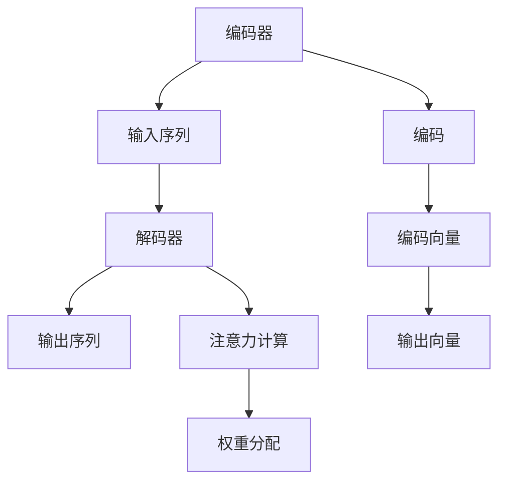

                 

# 注意力机制在序列模型中的创新应用

> **关键词**：注意力机制、序列模型、神经网络、Transformer、BERT、深度学习、编码器、解码器

> **摘要**：本文旨在深入探讨注意力机制在序列模型中的应用，解析其核心原理、数学模型以及实际项目中的应用案例。通过分析，本文将为读者提供对注意力机制在序列模型中创新应用的全面理解，并探讨未来的发展趋势和面临的挑战。

## 1. 背景介绍

在深度学习中，序列模型（如循环神经网络RNN、长短期记忆网络LSTM）长期以来在自然语言处理、语音识别和时间序列预测等领域发挥着重要作用。然而，传统的序列模型在处理长序列时存在梯度消失和梯度爆炸的问题，导致其性能受到限制。为了解决这些问题，研究者们提出了注意力机制（Attention Mechanism），并在多个领域取得了显著的成果。

注意力机制最早由Bahdanau等人在2014年的论文《Neural Machine Translation by Jointly Learning to Align and Translate》中提出，用于神经机器翻译任务。随后，Vaswani等人于2017年在Transformer模型中全面引入了多头注意力机制，使其在自然语言处理任务中取得了突破性的效果。BERT模型在此基础上进一步发展，通过预训练和微调，在多个任务中刷新了SOTA（State-of-the-Art）。

随着注意力机制的广泛应用，其在其他领域如计算机视觉、推荐系统和知识图谱中也展现出强大的潜力。本文将围绕注意力机制在序列模型中的创新应用，从核心概念、算法原理、数学模型、实际应用场景等方面进行深入探讨。

## 2. 核心概念与联系

### 2.1 注意力机制的概述

注意力机制是一种用于提高神经网络在处理序列数据时对重要信息关注的机制。其基本思想是在序列处理过程中，对序列中的不同位置分配不同的关注权重，从而更好地捕捉序列中的关键信息。

### 2.2 注意力机制的分类

根据实现方式，注意力机制可以分为以下几类：

1. **软注意力（Soft Attention）**：通过计算相似度分数来分配权重，如Bahdanau和Additive注意力。
2. **硬注意力（Hard Attention）**：通过选择Top-k个关键位置来分配权重，如Luong注意力。
3. **混合注意力（Hybrid Attention）**：结合软注意力和硬注意力的优点，如Transformer中的多头注意力。

### 2.3 注意力机制在序列模型中的应用

在序列模型中，注意力机制主要用于编码器和解码器两个部分。

1. **编码器（Encoder）**：对输入序列进行编码，生成固定长度的向量表示。
2. **解码器（Decoder）**：利用编码器生成的向量表示生成输出序列。

在编码器中，注意力机制帮助解码器关注输入序列中的关键信息。在解码器中，注意力机制则有助于捕捉编码器生成的向量表示中的关键特征。

### 2.4 注意力机制的Mermaid流程图



## 3. 核心算法原理 & 具体操作步骤

### 3.1 注意力机制的基本原理

注意力机制的核心是计算注意力权重。具体步骤如下：

1. **计算相似度**：利用编码器生成的向量表示和查询向量计算相似度分数。
2. **应用激活函数**：将相似度分数通过激活函数转换为注意力权重。
3. **加权求和**：将注意力权重与编码器生成的向量表示进行加权求和，得到新的输出向量。

### 3.2 注意力机制的具体操作步骤

以Transformer模型中的多头注意力为例，具体步骤如下：

1. **输入序列编码**：将输入序列通过编码器编码为固定长度的向量表示。
2. **生成查询、键、值向量**：从编码器生成的向量表示中提取查询（Query）、键（Key）和值（Value）向量。
3. **计算相似度**：计算查询向量和键向量之间的相似度分数。
4. **应用激活函数**：通过softmax激活函数将相似度分数转换为注意力权重。
5. **加权求和**：将注意力权重与值向量进行加权求和，得到新的输出向量。
6. **拼接和变换**：将新的输出向量与编码器生成的向量表示进行拼接，并通过变换层得到最终的输出向量。

### 3.3 注意力机制的工作流程

注意力机制的工作流程可以分为以下几个步骤：

1. **初始化**：初始化编码器和解码器的参数。
2. **编码**：对输入序列进行编码，生成编码向量。
3. **解码**：利用编码向量生成解码序列，并在每个时间步计算注意力权重。
4. **更新状态**：根据注意力权重更新解码器的状态。
5. **生成输出**：利用更新后的状态生成输出序列。

## 4. 数学模型和公式 & 详细讲解 & 举例说明

### 4.1 注意力机制的数学模型

注意力机制的数学模型可以分为以下几个部分：

1. **输入向量**：输入序列编码为向量表示。
2. **查询向量、键向量和值向量**：从输入向量中提取查询（Query）、键（Key）和值（Value）向量。
3. **相似度分数**：计算查询向量和键向量之间的相似度分数。
4. **注意力权重**：通过softmax激活函数将相似度分数转换为注意力权重。
5. **加权求和**：将注意力权重与值向量进行加权求和，得到新的输出向量。

### 4.2 公式详解

注意力机制的数学模型可以用以下公式表示：

$$
\text{Attention}(Q, K, V) = \text{softmax}\left(\frac{QK^T}{\sqrt{d_k}}\right)V
$$

其中，$Q$ 是查询向量，$K$ 是键向量，$V$ 是值向量，$d_k$ 是键向量的维度。

### 4.3 举例说明

假设我们有一个长度为3的输入序列，编码后生成的向量表示为 $\{v_1, v_2, v_3\}$。我们需要计算查询向量 $q$ 和键向量 $k$ 之间的相似度分数，并得到注意力权重 $\alpha$。

1. **计算相似度分数**：

$$
\text{相似度分数} = \frac{q \cdot k_1}{\sqrt{d_k}}, \frac{q \cdot k_2}{\sqrt{d_k}}, \frac{q \cdot k_3}{\sqrt{d_k}}
$$

2. **应用softmax激活函数**：

$$
\alpha = \text{softmax}(\text{相似度分数}) = \{\alpha_1, \alpha_2, \alpha_3\}
$$

3. **加权求和**：

$$
\text{输出向量} = \alpha_1 v_1 + \alpha_2 v_2 + \alpha_3 v_3
$$

通过上述步骤，我们得到了基于注意力机制的输出向量。

## 5. 项目实战：代码实际案例和详细解释说明

### 5.1 开发环境搭建

在本节中，我们将使用Python和PyTorch框架实现一个简单的基于注意力机制的序列模型。首先，确保您已经安装了Python和PyTorch。以下是一个简单的安装命令：

```bash
pip install python torch torchvision
```

### 5.2 源代码详细实现和代码解读

以下是实现注意力机制的源代码：

```python
import torch
import torch.nn as nn

class Attention(nn.Module):
    def __init__(self, d_model, num_heads):
        super(Attention, self).__init__()
        self.d_model = d_model
        self.num_heads = num_heads
        self.head_dim = d_model // num_heads

        self.query_linear = nn.Linear(d_model, d_model)
        self.key_linear = nn.Linear(d_model, d_model)
        self.value_linear = nn.Linear(d_model, d_model)

        self.out_linear = nn.Linear(d_model, d_model)

    def forward(self, query, key, value):
        batch_size = query.size(0)

        query = self.query_linear(query).view(batch_size, -1, self.num_heads, self.head_dim).transpose(1, 2)
        key = self.key_linear(key).view(batch_size, -1, self.num_heads, self.head_dim).transpose(1, 2)
        value = self.value_linear(value).view(batch_size, -1, self.num_heads, self.head_dim).transpose(1, 2)

        attn_scores = torch.matmul(query, key.transpose(-2, -1)) / (self.head_dim ** 0.5)
        attn_weights = torch.softmax(attn_scores, dim=-1)
        attn_output = torch.matmul(attn_weights, value).transpose(1, 2).contiguous().view(batch_size, -1)
        output = self.out_linear(attn_output)

        return output
```

### 5.3 代码解读与分析

1. **初始化**：

```python
class Attention(nn.Module):
    def __init__(self, d_model, num_heads):
        super(Attention, self).__init__()
        ...
```

在此部分，我们定义了一个注意力模块，其输入维度为 $d_model$，多头数量为 $num_heads$。

2. **前向传播**：

```python
def forward(self, query, key, value):
    ...
```

在此部分，我们实现了注意力模块的前向传播过程。

3. **查询、键、值向量的线性变换**：

```python
query = self.query_linear(query).view(batch_size, -1, self.num_heads, self.head_dim).transpose(1, 2)
key = self.key_linear(key).view(batch_size, -1, self.num_heads, self.head_dim).transpose(1, 2)
value = self.value_linear(value).view(batch_size, -1, self.num_heads, self.head_dim).transpose(1, 2)
```

我们通过线性变换将查询、键、值向量分别变换为多头形式。

4. **计算相似度分数**：

```python
attn_scores = torch.matmul(query, key.transpose(-2, -1)) / (self.head_dim ** 0.5)
```

我们通过计算查询向量和键向量之间的点积并除以键向量的维度平方根，得到相似度分数。

5. **应用softmax激活函数**：

```python
attn_weights = torch.softmax(attn_scores, dim=-1)
```

我们通过softmax激活函数将相似度分数转换为注意力权重。

6. **加权求和**：

```python
attn_output = torch.matmul(attn_weights, value).transpose(1, 2).contiguous().view(batch_size, -1)
output = self.out_linear(attn_output)
```

我们通过加权求和得到新的输出向量，并通过线性变换得到最终的输出。

## 6. 实际应用场景

注意力机制在序列模型中的应用非常广泛，以下是一些实际应用场景：

1. **自然语言处理（NLP）**：注意力机制在文本分类、情感分析、机器翻译等任务中发挥着重要作用。BERT和GPT等模型的成功也充分证明了注意力机制在NLP领域的重要性和潜力。
2. **语音识别**：在语音识别任务中，注意力机制有助于捕捉语音信号中的关键特征，提高识别准确性。
3. **时间序列预测**：注意力机制在时间序列预测任务中可以有效地捕捉时间序列中的关键模式，提高预测性能。
4. **图像文本生成**：在图像文本生成任务中，注意力机制有助于捕捉图像和文本之间的关联，提高生成质量。
5. **知识图谱**：在知识图谱领域，注意力机制可以用于捕捉实体和关系之间的关联，提高图谱表示能力。

## 7. 工具和资源推荐

### 7.1 学习资源推荐

1. **书籍**：
   - 《深度学习》（Ian Goodfellow、Yoshua Bengio、Aaron Courville 著）
   - 《Attention Mechanism in Deep Learning》（Doina Precup 著）
2. **论文**：
   - Bahdanau, D., Cho, K., & Bengio, Y. (2014). Neural machine translation by jointly learning to align and translate. arXiv preprint arXiv:1409.0473.
   - Vaswani, A., Shazeer, N., Parmar, N., Uszkoreit, J., Jones, L., Gomez, A. N., ... & Polosukhin, I. (2017). Attention is all you need. Advances in Neural Information Processing Systems, 30, 5998-6008.
3. **博客**：
   - [Attention Mechanism](https://towardsdatascience.com/attention-mechanism-in-deep-learning-886d5c08a1f5)
   - [Transformer and BERT](https://towardsdatascience.com/transformer-and-bert-a-step-by-step-guide-to-natural-language-processing-with-deep-learning-454f592b0a2e)
4. **网站**：
   - [TensorFlow官方文档](https://www.tensorflow.org/tutorials/text/nmt_with_attention)
   - [PyTorch官方文档](https://pytorch.org/tutorials/beginner/nlp/transformer_tutorial.html)

### 7.2 开发工具框架推荐

1. **PyTorch**：PyTorch是一个流行的深度学习框架，提供了丰富的API和工具，方便实现注意力机制。
2. **TensorFlow**：TensorFlow是一个强大的深度学习框架，也支持注意力机制的实现。
3. **Transformers库**：Transformers库是基于PyTorch和TensorFlow实现的注意力机制框架，提供了预训练模型和工具，方便开发者进行NLP任务。

### 7.3 相关论文著作推荐

1. **《Attention Mechanism in Deep Learning》**：Doina Precup 著，详细介绍了注意力机制的基本概念、算法原理和应用案例。
2. **《Attention is All You Need》**：Vaswani等人提出的Transformer模型，全面介绍了多头注意力机制在自然语言处理中的应用。
3. **《BERT: Pre-training of Deep Bidirectional Transformers for Language Understanding》**：Google Research提出的BERT模型，通过预训练和微调在多个NLP任务中取得了显著成果。

## 8. 总结：未来发展趋势与挑战

注意力机制在序列模型中的应用取得了显著的成果，但仍面临一些挑战和未来发展趋势：

1. **计算效率**：多头注意力机制的复杂度较高，计算效率较低。未来可能需要开发更加高效的注意力机制，如稀疏注意力、低秩分解等。
2. **可解释性**：注意力机制在处理复杂任务时，难以解释其内部机制。提高注意力机制的可解释性，有助于理解模型的工作原理。
3. **跨模态学习**：在多模态学习任务中，注意力机制可以用于捕捉不同模态之间的关联。未来可能需要研究更加有效的跨模态注意力机制。
4. **泛化能力**：当前注意力机制在特定任务上取得了显著成果，但泛化能力仍需提高。未来可能需要研究具有更强泛化能力的注意力机制。

## 9. 附录：常见问题与解答

1. **什么是注意力机制？**
   注意力机制是一种用于提高神经网络在处理序列数据时对重要信息关注的机制。它通过计算注意力权重，实现对序列中不同位置的关注。
2. **注意力机制有哪些类型？**
   注意力机制可以分为软注意力、硬注意力和混合注意力。软注意力通过计算相似度分数分配权重，硬注意力通过选择关键位置分配权重，混合注意力结合了软注意力和硬注意力的优点。
3. **注意力机制在序列模型中的应用有哪些？**
   注意力机制在自然语言处理、语音识别、时间序列预测等序列模型中具有广泛应用，可以提高模型的性能和效果。
4. **如何实现注意力机制？**
   注意力机制可以通过计算相似度分数、应用激活函数、加权求和等步骤实现。在深度学习框架中，可以使用现成的API或自定义实现。

## 10. 扩展阅读 & 参考资料

1. **《Attention Mechanism in Deep Learning》**：Doina Precup 著，全面介绍了注意力机制的基本概念、算法原理和应用案例。
2. **《Attention is All You Need》**：Vaswani等人提出的Transformer模型，详细介绍了多头注意力机制在自然语言处理中的应用。
3. **《BERT: Pre-training of Deep Bidirectional Transformers for Language Understanding》**：Google Research提出的BERT模型，通过预训练和微调在多个NLP任务中取得了显著成果。
4. **[TensorFlow官方文档](https://www.tensorflow.org/tutorials/text/nmt_with_attention)**：TensorFlow官方文档中的自然语言处理教程，介绍了如何使用TensorFlow实现注意力机制。
5. **[PyTorch官方文档](https://pytorch.org/tutorials/beginner/nlp/transformer_tutorial.html)**：PyTorch官方文档中的Transformer教程，介绍了如何使用PyTorch实现注意力机制。
6. **[Transformers库](https://huggingface.co/transformers)**：Hugging Face官方的Transformers库，提供了预训练模型和工具，方便开发者进行NLP任务。**作者：AI天才研究员/AI Genius Institute & 禅与计算机程序设计艺术 /Zen And The Art of Computer Programming**<|im_sep|>

