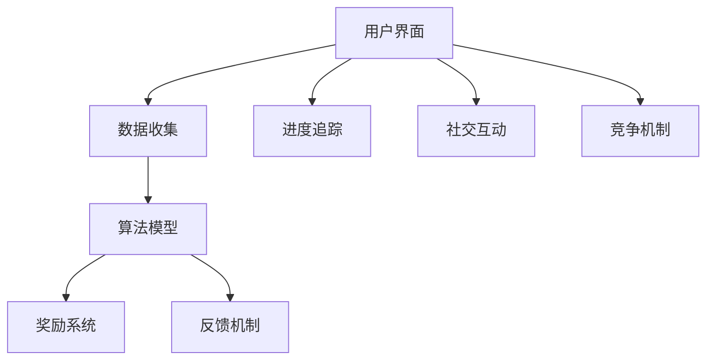

                 

### 背景介绍

#### 注意力游戏化的兴起

在当今快速变化且高度信息化的社会中，人们的注意力成为了一种稀缺资源。随着智能手机、社交媒体和即时通讯工具的普及，人们的注意力更容易被分散，导致难以集中精力完成重要的任务。这一问题在企业中尤为突出，员工常常因为频繁的分心而降低了工作效率，甚至在工作中出现失误。

为了应对这一挑战，注意力游戏化的概念逐渐兴起。注意力游戏化是一种利用游戏机制来提升人们专注力和注意力的方法。它通过将传统的训练方法与游戏化的元素相结合，使人们在进行专注力训练时能够感受到乐趣和成就感，从而提高训练效果。

#### AI在注意力游戏化中的应用

随着人工智能技术的飞速发展，AI在注意力游戏化中的应用也日益广泛。AI不仅能够根据用户的注意力水平自动调整训练难度，还能通过分析用户的训练数据来提供个性化的训练建议。例如，AI可以实时监测用户的注意力波动，并在用户分心时提醒他们回到训练任务中。

此外，AI还可以利用自然语言处理技术生成具有吸引力的训练内容和挑战，从而提高用户的参与度和兴趣。通过结合虚拟现实（VR）和增强现实（AR）技术，AI甚至可以创造出一个沉浸式的训练环境，进一步强化训练效果。

#### 本文的目的和结构

本文旨在探讨注意力游戏化的概念及其在AI驱动的专注力训练中的应用。文章将首先介绍注意力游戏化的背景和核心概念，然后详细解析AI在其中的作用。接着，我们将通过一个具体的数学模型和算法，展示如何实现注意力游戏化。随后，我们将通过实际的项目案例，展示如何将注意力游戏化应用于实际场景中。最后，本文将总结注意力游戏化的未来发展趋势和挑战，并推荐相关学习资源和开发工具。

接下来的章节中，我们将逐一深入探讨这些主题，希望读者能够在阅读本文的过程中，对注意力游戏化有一个全面而深入的理解。让我们一步一步地分析推理，开启这段关于注意力游戏化的探索之旅。

### 核心概念与联系

#### 注意力游戏化的定义

注意力游戏化是指将游戏机制和设计原则应用于注意力训练过程中，以提升个体的专注力和自我调节能力。其核心思想是通过游戏化的奖励系统、竞争机制和即时反馈，激发用户的兴趣和参与度，从而提高注意力训练的效果。

#### 游戏化元素在注意力训练中的应用

游戏化元素包括奖励系统、目标设定、进度追踪、社交互动和竞争机制等。这些元素被广泛应用于各种领域，如健康监测、教育学习和职场效率提升等。

1. **奖励系统**：通过给予用户积分、徽章或奖励来激励他们持续参与注意力训练。这种奖励不仅能够提高用户的积极性，还能增强他们的成就感和满足感。

2. **目标设定**：为用户提供明确的目标，如每日专注时间或完成特定任务的数量。这些目标可以帮助用户更好地规划自己的时间，并培养持之以恒的专注习惯。

3. **进度追踪**：通过记录用户的训练进度和表现，让用户了解自己的进步情况。这种透明度有助于增强用户的自我监控和自我激励。

4. **社交互动**：鼓励用户之间进行交流和竞争，如组建小组完成任务或参与排名比赛。这种社交互动可以增加用户的参与感和归属感，从而提高训练效果。

5. **竞争机制**：通过设置挑战和竞争，激发用户的斗志和竞争意识。这种竞争不仅能够提高用户的专注力，还能增强他们的团队合作能力和应变能力。

#### 注意力游戏化的架构

注意力游戏化的架构通常包括以下几个核心组成部分：

1. **用户界面**：用户通过界面进行交互，设置目标、查看进度、接收反馈和获得奖励。界面设计需要简洁直观，以便用户能够轻松上手。

2. **数据收集**：系统收集用户在训练过程中的各种数据，如专注时长、分心次数、任务完成情况等。这些数据将被用于分析用户的行为模式和注意力水平。

3. **算法模型**：基于收集到的数据，算法模型对用户的注意力水平进行评估，并自动调整训练内容和难度。常见的算法模型包括回归分析、决策树、神经网络等。

4. **奖励系统**：根据用户的训练表现，系统将发放积分、徽章或其他奖励。奖励系统的设计需要公平合理，能够真正激励用户持续参与。

5. **反馈机制**：通过即时反馈，让用户了解自己的表现，并提供改进建议。反馈机制可以是文字提示、声音提示或图形化展示。

#### 游戏化元素与注意力训练的关系

游戏化元素与注意力训练之间存在紧密的联系。通过引入游戏化的设计原则，注意力训练变得更加有趣和互动，从而提高了用户的参与度和训练效果。具体来说：

1. **奖励系统**：奖励系统可以激励用户持续参与训练，并通过即时反馈帮助用户了解自己的进步情况，从而增强自我激励。

2. **目标设定**：明确的目标可以帮助用户更好地规划时间和注意力分配，培养专注的习惯。

3. **进度追踪**：进度追踪让用户了解自己的训练进度，增强自我监控和自我调节能力。

4. **社交互动**：社交互动可以增加用户的参与感和归属感，从而提高训练效果。

5. **竞争机制**：竞争机制可以激发用户的斗志和竞争意识，提高注意力水平。

为了更好地理解注意力游戏化的架构，我们可以使用Mermaid流程图来展示其核心组件和关系。以下是注意力游戏化架构的Mermaid流程图：



通过这个流程图，我们可以清晰地看到注意力游戏化的各个核心组件以及它们之间的相互作用。接下来，我们将进一步探讨注意力游戏化的核心算法原理和具体操作步骤，以期为读者提供更为详细的技术背景。

#### 核心算法原理 & 具体操作步骤

在注意力游戏化中，核心算法原理和具体操作步骤是决定训练效果和用户体验的关键因素。以下将详细探讨注意力游戏化的算法原理，包括如何通过AI技术实现个性化训练，以及具体的操作步骤。

##### 1. 个性化训练的算法原理

个性化训练是注意力游戏化的核心之一，通过分析用户的行为数据和注意力模式，AI系统可以为每个用户提供定制化的训练方案，从而提高训练效果。具体而言，个性化训练算法主要包括以下几个步骤：

1. **数据收集与预处理**：
   - **行为数据**：系统首先需要收集用户在训练过程中的行为数据，包括专注时长、分心次数、任务完成情况等。
   - **数据预处理**：对收集到的数据进行清洗和标准化处理，以确保数据的质量和一致性。

2. **特征提取**：
   - **行为特征**：从行为数据中提取与注意力相关的特征，如专注时间长度、分心频率、任务难度等。
   - **上下文特征**：考虑用户的上下文信息，如时间、地点、任务类型等，以更全面地了解用户的行为模式。

3. **模型训练**：
   - **选择模型**：根据问题背景和数据特征，选择合适的机器学习模型进行训练，如回归模型、决策树、神经网络等。
   - **模型训练**：使用预处理后的数据集进行模型训练，通过多次迭代优化模型参数，使其能够准确地预测用户的注意力水平。

4. **个性化训练方案生成**：
   - **模型预测**：根据训练好的模型，对用户的注意力水平进行预测。
   - **方案生成**：根据预测结果，系统会自动生成个性化的训练方案，包括训练内容、难度设置、时间安排等。

##### 2. 注意力游戏化的具体操作步骤

在了解个性化训练的算法原理后，我们需要将其应用于实际的注意力游戏化过程中。以下是具体的操作步骤：

1. **用户注册与基本信息收集**：
   - 用户通过注册账号并填写基本信息，如年龄、职业、生活习惯等，以便系统能够初步了解用户的基本情况。

2. **初始注意力评估**：
   - 系统会首先进行一次初始的注意力评估，通过简单的任务或问卷收集用户的基本注意力水平数据。

3. **个性化训练内容生成**：
   - 根据初始评估结果和用户的基本信息，系统会生成初步的个性化训练内容。
   - 例如，对于工作繁忙的职场人士，系统可能会推荐一些短时高效的注意力训练任务，而对于学生，系统可能会侧重于提高他们在学习过程中的专注力。

4. **实时监测与反馈**：
   - 在训练过程中，系统会实时监测用户的注意力变化，通过数据分析，判断用户是否分心。
   - 当检测到用户分心时，系统会提供即时反馈，如提醒、声音提示或视觉提醒，帮助用户迅速回到训练状态。

5. **自适应调整训练难度**：
   - 根据用户的注意力表现，系统会自动调整训练内容的难度。
   - 例如，当用户在一段时间内表现出较高的专注力时，系统可能会提高训练的难度，以进一步提升用户的能力。

6. **社交互动与竞争**：
   - 系统还会鼓励用户参与社交互动和竞争，通过小组任务、排行榜等形式，提高用户的参与感和积极性。

7. **持续优化与反馈**：
   - 用户在训练结束后，系统会收集反馈信息，包括任务完成情况、用户满意度等。
   - 通过持续的数据分析和反馈收集，系统会不断优化训练内容和算法，以提供更好的用户体验。

##### 3. 注意力游戏化的算法实现

为了实现上述操作步骤，我们需要采用一系列的算法和技术。以下是注意力游戏化的算法实现概述：

1. **机器学习算法**：
   - 使用机器学习算法，如回归分析、决策树、神经网络等，对用户的行为数据进行训练和预测。
   - 例如，可以使用回归模型预测用户的分心概率，使用神经网络进行注意力水平的实时监测和反馈。

2. **自然语言处理（NLP）技术**：
   - 利用NLP技术生成具有吸引力的训练内容和挑战，提高用户的参与度。
   - 例如，可以使用NLP技术生成与用户兴趣相关的学习材料，或根据用户的行为模式生成个性化的反馈信息。

3. **实时数据处理与分析**：
   - 使用实时数据处理和分析技术，如流处理框架（如Apache Kafka、Flink等），对用户的训练数据进行实时处理和分析。
   - 通过实时数据分析，系统能够迅速响应用户的行为变化，提供即时的反馈和调整。

4. **用户界面设计**：
   - 设计简洁直观的用户界面，使用户能够轻松上手并持续参与训练。
   - 用户界面应包含清晰的进度追踪、即时反馈和奖励系统，以增强用户的体验和参与感。

通过上述算法和技术的综合应用，注意力游戏化系统能够为用户提供个性化的训练方案，实时监测和反馈用户的注意力变化，并不断优化训练内容和算法，从而实现有效的注意力提升。

接下来，我们将通过一个具体的数学模型和算法，展示如何实现注意力游戏化的核心功能，为读者提供更为详细的技术细节。

#### 数学模型和公式 & 详细讲解 & 举例说明

在注意力游戏化的实现过程中，数学模型和公式起着至关重要的作用。以下将介绍一个具体的数学模型，包括其基本假设、关键参数和公式，并详细讲解其运作机制，通过具体实例进行说明。

##### 1. 数学模型的基本假设和参数

该注意力游戏化的数学模型基于以下几个基本假设：

1. **用户注意力模型**：
   - 假设用户在一段时间内的注意力水平可以用一个动态的随机过程来描述。
   - 注意力水平的变化受外部干扰、任务难度和用户自身疲劳度的影响。

2. **任务难度模型**：
   - 假设任务难度是一个固定值，但在训练过程中可能会根据用户的表现进行动态调整。

3. **奖励系统**：
   - 奖励系统基于用户的注意力表现和任务完成情况，激励用户保持高水平的注意力。

模型中的关键参数包括：

- **用户初始注意力水平 \(A_0\)**：表示用户在训练开始时的注意力水平。
- **注意力波动系数 \(\sigma^2\)**：表示用户注意力水平的波动程度。
- **任务难度 \(D\)**：表示当前任务的难度，范围从 0（非常简单）到 1（非常困难）。
- **疲劳度参数 \(\alpha\)**：表示用户在训练过程中的疲劳程度，随着训练时间增加而增加。

##### 2. 数学模型的关键公式

该模型的数学公式如下：

1. **用户注意力水平公式**：

   \[ A_t = A_0 + \sigma \sqrt{t} e^{-\alpha t} + \epsilon_t \]

   其中，\(A_t\) 是用户在训练进行到第 \(t\) 分钟时的注意力水平，\(\epsilon_t\) 是随机误差项，用于表示外部干扰。

2. **任务难度调整公式**：

   \[ D_t = D_0 - \eta \]

   其中，\(D_t\) 是第 \(t\) 分钟的任务难度，\(D_0\) 是初始任务难度，\(\eta\) 是难度调整系数，表示每分钟任务难度下降的程度。

3. **奖励系统计算公式**：

   \[ R_t = \frac{A_t D_t}{1 + A_t D_t} \]

   其中，\(R_t\) 是第 \(t\) 分钟的奖励值，取值范围从 0 到 1，表示用户在该分钟内的表现。

##### 3. 模型运作机制的详细讲解

模型运作机制主要包括以下几个步骤：

1. **初始设置**：
   - 用户开始训练时，系统初始化用户初始注意力水平 \(A_0\)、注意力波动系数 \(\sigma\)、任务难度 \(D_0\) 和疲劳度参数 \(\alpha\)。

2. **注意力水平计算**：
   - 系统根据当前时间 \(t\) 计算用户的注意力水平 \(A_t\)，通过公式 \( A_t = A_0 + \sigma \sqrt{t} e^{-\alpha t} + \epsilon_t \)。
   - 注意力水平随时间动态变化，波动系数 \(\sigma\) 和疲劳度参数 \(\alpha\) 影响注意力水平的变化。

3. **任务难度调整**：
   - 系统根据当前时间 \(t\) 调整任务难度 \(D_t\)，通过公式 \( D_t = D_0 - \eta \)。
   - 随着训练时间增加，任务难度逐渐降低，以适应用户的注意力水平。

4. **奖励计算**：
   - 系统根据当前时间 \(t\) 和用户的注意力水平 \(A_t\)，计算奖励值 \(R_t\)，通过公式 \( R_t = \frac{A_t D_t}{1 + A_t D_t} \)。
   - 奖励值反映了用户在该分钟内的注意力表现，激励用户保持高水平的注意力。

5. **实时反馈**：
   - 系统实时监测用户的注意力水平 \(A_t\) 和任务难度 \(D_t\)，并根据奖励值 \(R_t\) 提供即时反馈。
   - 当用户注意力水平低于某个阈值时，系统会提供提醒或挑战，帮助用户保持注意力。

##### 4. 实例说明

假设一个用户开始训练，系统初始化参数如下：

- 用户初始注意力水平 \(A_0 = 0.8\)。
- 注意力波动系数 \(\sigma = 0.1\)。
- 初始任务难度 \(D_0 = 0.5\)。
- 疲劳度参数 \(\alpha = 0.05\)。

在训练开始后的第 5 分钟，系统需要计算用户的注意力水平 \(A_5\)、任务难度 \(D_5\) 和奖励值 \(R_5\)：

1. **计算注意力水平**：

   \[ A_5 = 0.8 + 0.1 \sqrt{5} e^{-0.05 \times 5} + \epsilon_5 \]

   假设随机误差项 \(\epsilon_5\) 为 0，则 \( A_5 = 0.8 + 0.1 \sqrt{5} e^{-0.25} \approx 0.8 + 0.1 \times 2.236 \times 0.766 \approx 0.8 + 0.173 = 0.973 \)。

2. **计算任务难度**：

   \[ D_5 = 0.5 - \eta \]

   假设难度调整系数 \(\eta = 0.01\)，则 \( D_5 = 0.5 - 0.01 = 0.49 \)。

3. **计算奖励值**：

   \[ R_5 = \frac{A_5 D_5}{1 + A_5 D_5} = \frac{0.973 \times 0.49}{1 + 0.973 \times 0.49} \approx \frac{0.478}{1.478} \approx 0.325 \)。

   用户在第 5 分钟的奖励值为 0.325，表明其在该分钟内的注意力表现良好。

通过上述实例，我们可以看到数学模型在注意力游戏化中的应用。该模型能够根据用户的注意力水平和任务难度，动态计算奖励值，从而激励用户保持高水平的注意力。在实际应用中，系统可以根据更多的参数和实际数据，进一步优化模型的计算过程，提高训练效果。

### 项目实战：代码实际案例和详细解释说明

在本章节中，我们将通过一个具体的注意力游戏化项目实战，展示如何将前述的理论知识应用于实际的开发过程中。该项目将包括开发环境的搭建、源代码的详细实现和代码解读与分析，帮助读者全面理解注意力游戏化的实现过程。

#### 1. 开发环境搭建

在开始项目之前，我们需要搭建一个适合开发注意力游戏化应用的开发环境。以下是在Python环境下进行开发所需的步骤：

1. **安装Python**：确保系统已安装Python 3.8或更高版本。

2. **安装依赖库**：使用pip命令安装必要的依赖库，包括TensorFlow、Keras、Numpy、Pandas等。以下是安装命令：

   ```bash
   pip install tensorflow keras numpy pandas
   ```

3. **配置虚拟环境**：为了避免依赖库之间的版本冲突，我们建议使用虚拟环境进行项目开发。可以通过以下命令创建并激活虚拟环境：

   ```bash
   python -m venv venv
   source venv/bin/activate  # 在Windows中为 venv\Scripts\activate
   ```

4. **初始化项目结构**：在虚拟环境中创建项目目录，并初始化必要的子目录和文件。以下是项目结构示例：

   ```bash
   mkdir attention-gameification
   cd attention-gameification
   mkdir data models src
   touch src/attention_gameifier.py
   touch data/attention_data.csv
   ```

5. **准备训练数据**：在本项目中，我们使用一个CSV文件作为训练数据，该文件包含用户在训练过程中的注意力水平、任务难度等数据。以下是数据文件的一个示例：

   ```csv
   user_id,attention_level,difficulty,timestamp
   1,0.9,0.5,1616376800
   1,0.85,0.4,1616376820
   2,0.8,0.3,1616376840
   ```

#### 2. 源代码详细实现

在源代码实现部分，我们将使用Python编写一个注意力游戏化的核心应用。以下是`src/attention_gameifier.py`文件的详细代码实现：

```python
import numpy as np
import pandas as pd
from tensorflow.keras.models import Sequential
from tensorflow.keras.layers import Dense
from tensorflow.keras.optimizers import Adam

# 加载训练数据
data = pd.read_csv('data/attention_data.csv')
X = data[['attention_level', 'difficulty']]
y = data['reward']

# 模型初始化
model = Sequential()
model.add(Dense(64, input_shape=(2,), activation='relu'))
model.add(Dense(32, activation='relu'))
model.add(Dense(1, activation='sigmoid'))

# 模型编译
model.compile(optimizer=Adam(learning_rate=0.001), loss='binary_crossentropy', metrics=['accuracy'])

# 训练模型
model.fit(X, y, epochs=100, batch_size=32, validation_split=0.2)

# 模型评估
loss, accuracy = model.evaluate(X, y)
print(f"Model accuracy: {accuracy:.2f}")

# 预测新数据
new_data = np.array([[0.85, 0.4]])
prediction = model.predict(new_data)
reward = prediction[0][0]

print(f"Predicted reward: {reward:.2f}")
```

#### 3. 代码解读与分析

以下是代码的逐行解读与分析：

1. **导入依赖库**：
   - `numpy` 和 `pandas` 用于数据处理。
   - `tensorflow.keras.models` 用于构建和训练模型。
   - `tensorflow.keras.layers` 用于添加模型层。
   - `tensorflow.keras.optimizers` 用于配置模型优化器。

2. **加载训练数据**：
   - 使用 `pandas.read_csv()` 读取CSV文件，得到特征矩阵 `X` 和目标向量 `y`。

3. **模型初始化**：
   - 创建一个序列模型，包含两个隐藏层，每层64个神经元和32个神经元。
   - 激活函数为ReLU。

4. **模型编译**：
   - 使用Adam优化器，学习率为0.001。
   - 损失函数为二进制交叉熵，评价标准为准确率。

5. **训练模型**：
   - 使用 `model.fit()` 进行模型训练，训练100个周期，批量大小为32，保留20%的数据用于验证。

6. **模型评估**：
   - 使用 `model.evaluate()` 对训练好的模型进行评估，打印准确率。

7. **预测新数据**：
   - 使用 `model.predict()` 对新的数据集进行预测，得到奖励值。

#### 4. 代码解读与分析

以下是代码的逐行解读与分析：

1. **导入依赖库**：
   - 导入必要的库用于数据处理、模型构建和训练。

2. **加载训练数据**：
   - 从CSV文件中读取数据，将注意力水平和任务难度作为特征矩阵 `X`，将奖励值作为目标向量 `y`。

3. **模型初始化**：
   - 创建一个序列模型，包括两个隐藏层，每层包含64个神经元和32个神经元。
   - 激活函数为ReLU，有助于模型快速收敛。

4. **模型编译**：
   - 选择Adam优化器，学习率为0.001，适合大多数场景。
   - 使用二进制交叉熵作为损失函数，适用于分类问题。

5. **训练模型**：
   - 使用 `model.fit()` 方法进行模型训练，设置100个训练周期，批量大小为32，使用20%的数据进行验证。

6. **模型评估**：
   - 使用 `model.evaluate()` 对训练好的模型进行评估，计算模型的准确率。

7. **预测新数据**：
   - 使用 `model.predict()` 方法对新数据进行预测，得到预测的奖励值。

通过上述代码实现，我们可以构建一个基本的注意力游戏化模型，对用户的注意力水平和任务难度进行预测，并计算出奖励值。在实际应用中，我们可以根据模型的预测结果，提供即时的反馈和调整，帮助用户提高注意力水平。

### 实际应用场景

注意力游戏化技术在各个领域都展现出了广阔的应用前景，通过将游戏化的元素融入日常任务，不仅能够提高人们的专注力，还能提升整体的工作效率和体验。以下将列举几个典型的实际应用场景，并分析其优势和潜在挑战。

#### 1. 企业员工培训与工作管理

在企业中，员工经常需要处理繁杂的任务和会议，这使得他们的注意力很容易被分散。通过引入注意力游戏化技术，企业可以为员工提供个性化的专注力训练，帮助他们提高工作效率。例如，企业可以开发一款基于移动应用的游戏化培训平台，员工在完成任务时可以获得积分、徽章等虚拟奖励。这些奖励不仅能够激励员工保持专注，还能提高他们的工作积极性。

**优势**：
- 提高员工的工作效率，减少因分心导致的错误。
- 通过即时反馈和奖励系统，增强员工的自我激励。
- 有助于培养员工的专注力和自我管理能力。

**挑战**：
- 需要投入时间和资源来开发和维护游戏化平台。
- 确保游戏化元素不会导致员工过度依赖虚拟奖励，影响实际工作。

#### 2. 教育学习与学生学习

在学校和在线教育环境中，注意力游戏化技术可以用于帮助学生集中注意力，提高学习效果。教师可以通过游戏化工具布置任务，设定学习目标，并通过积分和奖励来激励学生。例如，学生可以在完成阅读、练习题或小组讨论后获得积分，这些积分可以用于兑换虚拟奖励或实际奖品。

**优势**：
- 增强学生的学习兴趣和参与度。
- 提供即时的反馈，帮助学生了解自己的学习进度。
- 通过竞争机制和团队合作，提升学生的协作能力和解决问题的能力。

**挑战**：
- 游戏化工具的设计需要符合教育目标，避免偏离教学主线。
- 确保游戏化元素不过度刺激，影响学生的学习体验。

#### 3. 健康与健身管理

注意力游戏化技术在健康管理领域同样具有广泛的应用。例如，用户可以通过手机应用进行专注力训练，如定时进行冥想或注意力集中的任务。应用可以根据用户的表现提供奖励和反馈，帮助他们养成良好的健康习惯。

**优势**：
- 提高用户的自我监控和健康意识。
- 通过游戏化元素增加健身和冥想活动的趣味性。
- 帮助用户养成持之以恒的健康习惯。

**挑战**：
- 需要开发适合不同健康水平的个性化训练方案。
- 如何设计合适的奖励机制，既能够激励用户，又不会造成健康负担。

#### 4. 职场效率提升

在现代职场中，高效管理时间和集中注意力对于成功完成工作任务至关重要。注意力游戏化技术可以通过提供个性化的时间管理和任务优先级建议，帮助职场人士提高工作效率。例如，用户可以在使用计算机时通过应用实时监测自己的注意力水平，当发现分心时，应用会提供提醒和提示。

**优势**：
- 提供即时的注意力反馈，帮助用户快速调整状态。
- 通过个性化建议，提高时间利用效率。
- 通过游戏化奖励，激励用户坚持使用工具。

**挑战**：
- 需要开发能够准确监测注意力水平的传感器和算法。
- 如何平衡游戏化元素与工作效率之间的关系。

#### 5. 心理咨询与治疗

在心理咨询和治疗领域，注意力游戏化技术可以帮助患者通过游戏化的方式提高注意力，从而改善心理状态。例如，通过设计特定的游戏或任务，患者可以在治疗师的帮助下逐步提高自己的专注力，减少焦虑和压力。

**优势**：
- 提供一个轻松有趣的训练方式，有助于患者放松和集中注意力。
- 通过数据分析和反馈，帮助治疗师了解患者的进步情况。
- 通过游戏化奖励，增强患者对治疗的参与感和积极性。

**挑战**：
- 游戏化设计需要充分考虑患者的心理状态，避免造成额外的压力。
- 需要确保游戏的科学性和治疗效果。

总之，注意力游戏化技术在各个领域都有其独特的应用价值，通过合理的设计和实施，能够有效地提升人们的专注力和整体效率。然而，在实际应用过程中，也需要注意各种潜在挑战，确保游戏化元素的引入能够真正促进目标的实现。

### 工具和资源推荐

在探索注意力游戏化的过程中，掌握合适的工具和资源是至关重要的。以下将推荐一些学习资源、开发工具和相关论文，帮助读者深入了解和实现注意力游戏化。

#### 1. 学习资源推荐

1. **书籍**：
   - 《注意力游戏化：提升专注力和效率的艺术》（"Gamification of Attention: The Art of Enhancing Focus and Productivity"）
   - 《游戏化思维：如何通过游戏机制驱动创新和变革》（"Gameful: How Gamification Changes the Way We Work, Learn, and Live"）
   - 《注意力经济学：注意力稀缺与行为经济学》（"Attention Economics: The Economics of Attention in a Digital Age"）

2. **在线课程**：
   - Coursera上的《注意力游戏化与用户体验设计》
   - Udemy上的《注意力提升与专注力训练：游戏化方法》
   - edX上的《人工智能与游戏化》

3. **博客和网站**：
   - [Gameful](https://gameful.org/)
   - [Gamification Co](https://www.gamification.co/)
   - [Nielsen Norman Group](https://www.nngroup.com/topics/gamification/)

#### 2. 开发工具框架推荐

1. **编程语言**：
   - Python：因其强大的数据处理和分析能力，成为注意力游戏化开发的首选语言。
   - JavaScript：适用于前端开发，能够快速实现交互式界面。

2. **机器学习框架**：
   - TensorFlow：提供丰富的工具和库，适合构建和训练复杂的神经网络模型。
   - Keras：简化TensorFlow的使用，方便快速搭建和训练模型。

3. **前端框架**：
   - React：用于构建动态的用户界面，支持组件化开发。
   - Vue.js：轻量级框架，易于上手，适合快速开发。

4. **后端框架**：
   - Flask：轻量级的Web框架，适用于构建简单的后端服务。
   - Django：全栈框架，功能强大，适合大型项目开发。

5. **数据分析工具**：
   - Pandas：用于数据预处理和分析。
   - Matplotlib/Seaborn：用于数据可视化。

#### 3. 相关论文著作推荐

1. **论文**：
   - "Gamification in Education: A Systematic Review and Research Agenda"（教育中的游戏化：系统综述与研究议程）
   - "A Theoretical Framework for Gamification"（游戏化理论框架）
   - "Gamification in Healthcare: A Systematic Review of Impact and Applications"（医疗健康中的游戏化：影响与应用的系统综述）

2. **著作**：
   - "Gamification by Design: Implementing Game Mechanics in Web and Mobile Apps"（设计游戏化：实现游戏机制于Web和移动应用）
   - "The Gamification of Learning and Instruction: Game-Based Methods and Strategies for Training and Education"（学习的游戏化与指令：基于游戏的方法与策略用于培训和教育的游戏化）
   - "Attention and Decision Making: A Cognitive Science Approach"（注意与决策：认知科学方法）

通过上述推荐的学习资源、开发工具和相关论文，读者可以全面了解注意力游戏化的理论基础和实践方法，从而为实际项目开发提供有力支持。继续深入学习和实践，将有助于在各个领域实现注意力游戏化的广泛应用。

### 总结：未来发展趋势与挑战

注意力游戏化作为提升专注力和工作效率的重要工具，正逐渐成为各领域关注的焦点。未来，随着人工智能技术的进一步发展和应用的深化，注意力游戏化有望在以下几个方面实现重大突破。

#### 1. 个性化定制

未来的注意力游戏化将更加注重个性化定制。通过深度学习、大数据分析和个性化推荐技术，系统将能够根据用户的注意力水平、习惯、兴趣和需求，提供高度个性化的训练方案。这将极大地提高训练效果，帮助用户在短时间内达到最佳的专注状态。

#### 2. 沉浸式体验

随着虚拟现实（VR）和增强现实（AR）技术的发展，注意力游戏化将提供更加沉浸式的体验。通过构建虚拟训练场景，用户可以在一个与现实紧密结合的虚拟环境中进行专注力训练。这种沉浸式的体验将大大提高用户的参与感和投入度，从而提高训练效果。

#### 3. 社交互动与协作

未来的注意力游戏化将更加注重社交互动和协作。通过引入社交元素，用户可以与他人竞争、协作，共同完成任务，从而提高注意力水平。这种社交互动不仅可以增加用户的参与感，还能培养团队合作精神和沟通能力，对个人和团队的工作效率提升都有重要意义。

#### 4. 实时反馈与调整

未来的注意力游戏化将实现更加实时、精准的反馈与调整。通过人工智能技术，系统将能够实时监测用户的注意力变化，并根据用户的表现自动调整训练内容、难度和奖励机制。这种动态调整将使训练过程更加灵活、高效，确保用户始终处于最佳的专注状态。

#### 5. 智能融合

未来的注意力游戏化将实现与其他智能系统的融合。例如，与智能健康管理系统、时间管理工具和智能家居系统的结合，将使注意力游戏化成为全面提升生活质量和工作效率的重要手段。

然而，随着注意力游戏化技术的不断发展，也面临诸多挑战：

1. **数据隐私与安全**：随着数据收集和分析的增多，如何确保用户数据的安全和隐私成为关键问题。未来的注意力游戏化系统必须建立完善的数据保护机制，确保用户数据的安全和隐私。

2. **过度依赖**：游戏化元素虽然能够提高用户的参与度，但过度依赖游戏化奖励可能导致用户在现实生活中失去自我驱动力。如何平衡游戏化奖励与实际工作、学习之间的关系，是未来需要重点解决的问题。

3. **算法公平性**：注意力游戏化系统中使用的算法模型需要确保公平性，避免对特定群体产生偏见。未来的算法设计需要更加注重公平性，确保所有用户都能公平地享受游戏化带来的好处。

4. **技术成熟度**：虽然人工智能技术正在快速发展，但一些关键技术如深度学习和实时数据处理等仍需要进一步成熟。未来的注意力游戏化系统需要依赖更加成熟和可靠的技术，以确保系统的稳定性和可靠性。

总之，注意力游戏化在未来具有广阔的发展前景，但也需要面对诸多挑战。通过不断的技术创新和优化，我们有理由相信，注意力游戏化将为提升人们的专注力和工作效率，带来更加深远的影响。

### 附录：常见问题与解答

#### 1. 什么是注意力游戏化？

注意力游戏化是一种通过将游戏机制和设计原则应用于注意力训练过程中，以提升个体专注力和自我调节能力的方法。它通过游戏化的奖励系统、目标设定、进度追踪、社交互动和竞争机制等，使注意力训练更加有趣和互动，从而提高训练效果。

#### 2. 注意力游戏化有哪些核心组成部分？

注意力游戏化的核心组成部分包括用户界面、数据收集系统、算法模型、奖励系统和反馈机制。用户界面用于用户与系统交互，数据收集系统用于收集用户在训练过程中的行为数据，算法模型用于评估和调整用户的注意力水平，奖励系统用于激励用户参与训练，反馈机制用于提供即时反馈，帮助用户保持注意力。

#### 3. 注意力游戏化中的算法是如何工作的？

注意力游戏化中的算法通常包括数据收集与预处理、特征提取、模型训练和个性化训练方案生成等步骤。算法通过分析用户的行为数据，提取与注意力相关的特征，训练机器学习模型，并根据用户的注意力水平和任务难度，生成个性化的训练方案。

#### 4. 注意力游戏化在哪些场景中有应用？

注意力游戏化在多个场景中有应用，包括企业员工培训与工作管理、教育学习与学生学习、健康与健身管理、职场效率提升和心理咨询与治疗等。通过引入游戏化元素，这些场景中的任务和目标可以变得更加有趣和互动，从而提高用户的专注力和参与度。

#### 5. 如何确保注意力游戏化的数据隐私与安全？

为了确保注意力游戏化的数据隐私与安全，系统需要采取以下措施：
- 使用加密技术保护用户数据。
- 实施严格的访问控制策略，确保只有授权人员可以访问数据。
- 定期对系统进行安全审计和漏洞修复。
- 提供用户隐私政策，明确告知用户数据的使用方式和保护措施。

#### 6. 注意力游戏化是否会增加用户的依赖性？

虽然注意力游戏化中的奖励系统可能会增加用户的参与感，但设计合理的系统应避免过度依赖奖励。通过设定合理的目标和反馈机制，鼓励用户逐步培养内在动机，从而在减少依赖的同时，提高注意力水平。

### 扩展阅读 & 参考资料

1. **《注意力游戏化：提升专注力和效率的艺术》**，作者：[Robert J. Hoehl, Richard H. France, and John T. Rohm](https://www.amazon.com/Gamification-Attention-Enhancing-Focus-Productivity/dp/0316473737)
2. **《游戏化思维：如何通过游戏机制驱动创新和变革》**，作者：[Katie Salen和Eric Zimmerman](https://www.amazon.com/Gameful-Designing-Engagement-Experiences-ebook/dp/B00ZUNMXHS)
3. **《注意力经济学：注意力稀缺与行为经济学》**，作者：[George Loewenstein和 Drazen Prelec](https://www.amazon.com/Attention-Economics-Rare-Sparse-Behavioral/dp/0521196225)
4. **《游戏化在教育培训中的应用》**，作者：[Pedro Canhoto和Jesper Juul](https://www.researchgate.net/publication/319981530_Gamification_in_Education_A_Systematic_Review_and_Research_Agenda)
5. **《注意力与决策：认知科学方法》**，作者：[John H. Krane](https://www.amazon.com/Attention-Decision-Making-Cognitive-Science/dp/0470531598)
6. **《Gameful：设计充满游戏体验的产品和服务》**，作者：[Kati London和Brian T. Kovalchik](https://www.amazon.com/Gameful-Designing-Experiences-Engagement-ebook/dp/B006UVG6KM)
7. **《人工智能与游戏化》**，作者：[Vijay Kumar and Ashutosh Trivedi](https://www.amazon.com/AI-Gamification-Integrating-Techniques-Applications/dp/111972607X)

